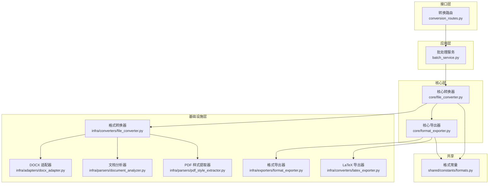
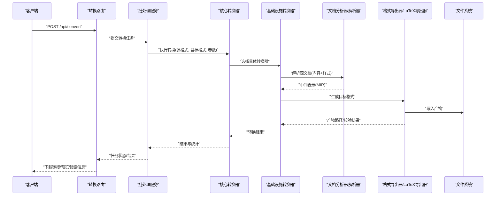
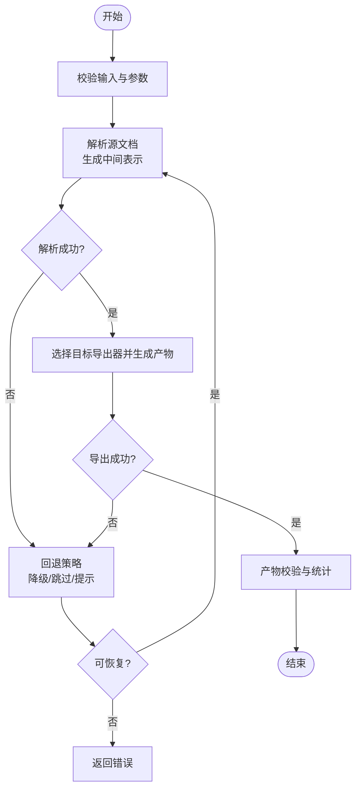
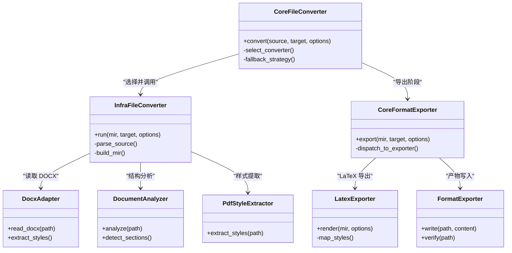

# 多格式支持与转换

<cite>
**本文引用的文件**   
- [src/paper_format_corrector/core/file_converter.py](file://src/paper_format_corrector/core/file_converter.py)
- [src/paper_format_corrector/core/format_exporter.py](file://src/paper_format_corrector/core/format_exporter.py)
- [src/paper_format_corrector/infrastructure/converters/file_converter.py](file://src/paper_format_corrector/infrastructure/converters/file_converter.py)
- [src/paper_format_corrector/infrastructure/converters/latex_exporter.py](file://src/paper_format_corrector/infrastructure/converters/latex_exporter.py)
- [src/paper_format_corrector/infrastructure/exporters/format_exporter.py](file://src/paper_format_corrector/infrastructure/exporters/format_exporter.py)
- [src/paper_format_corrector/infrastructure/adapters/docx_adapter.py](file://src/paper_format_corrector/infrastructure/adapters/docx_adapter.py)
- [src/paper_format_corrector/infrastructure/parsers/document_analyzer.py](file://src/paper_format_corrector/infrastructure/parsers/document_analyzer.py)
- [src/paper_format_corrector/infrastructure/parsers/pdf_style_extractor.py](file://src/paper_format_corrector/infrastructure/parsers/pdf_style_extractor.py)
- [src/paper_format_corrector/application/services/batch_service.py](file://src/paper_format_corrector/application/services/batch_service.py)
- [src/paper_format_corrector/interfaces/api/routes/conversion_routes.py](file://src/paper_format_corrector/interfaces/api/routes/conversion_routes.py)
- [src/paper_format_corrector/shared/constants/formats.py](file://src/paper_format_corrector/shared/constants/formats.py)
- [tests/test_latex_export.py](file://tests/test_latex_export.py)
</cite>

## 目录
1. [简介](#简介)
2. [项目结构](#项目结构)
3. [核心组件](#核心组件)
4. [架构总览](#架构总览)
5. [详细组件分析](#详细组件分析)
6. [依赖关系分析](#依赖关系分析)
7. [性能考虑](#性能考虑)
8. [故障排查指南](#故障排查指南)
9. [结论](#结论)
10. [附录](#附录)

## 简介
本技术文档聚焦于“多格式支持与转换”能力，覆盖输入输出格式、转换引擎、兼容性处理与数据映射策略。重点说明 DOCX、PDF、LaTeX 等格式的解析与生成机制，包括样式映射、特性保留与内容完整性保证；提供格式转换 API 文档（参数配置、质量设置、错误处理、性能优化）；解释格式验证、回退机制与增量更新策略；给出实际转换示例（如 Word 转 LaTeX、批量标准化、跨平台兼容），并指导如何扩展新格式支持。

## 项目结构
系统采用分层与适配器模式组织：接口层暴露 REST API 与 CLI；应用层编排服务；基础设施层实现具体格式解析、转换与导出；核心层定义通用转换流程与导出抽象；共享常量与工具贯穿各层。

图表来源
- [src/paper_format_corrector/interfaces/api/routes/conversion_routes.py](file://src/paper_format_corrector/interfaces/api/routes/conversion_routes.py)
- [src/paper_format_corrector/application/services/batch_service.py](file://src/paper_format_corrector/application/services/batch_service.py)
- [src/paper_format_corrector/core/file_converter.py](file://src/paper_format_corrector/core/file_converter.py)
- [src/paper_format_corrector/core/format_exporter.py](file://src/paper_format_corrector/core/format_exporter.py)
- [src/paper_format_corrector/infrastructure/converters/file_converter.py](file://src/paper_format_corrector/infrastructure/converters/file_converter.py)
- [src/paper_format_corrector/infrastructure/exporters/format_exporter.py](file://src/paper_format_corrector/infrastructure/exporters/format_exporter.py)
- [src/paper_format_corrector/infrastructure/converters/latex_exporter.py](file://src/paper_format_corrector/infrastructure/converters/latex_exporter.py)
- [src/paper_format_corrector/infrastructure/adapters/docx_adapter.py](file://src/paper_format_corrector/infrastructure/adapters/docx_adapter.py)
- [src/paper_format_corrector/infrastructure/parsers/document_analyzer.py](file://src/paper_format_corrector/infrastructure/parsers/document_analyzer.py)
- [src/paper_format_corrector/infrastructure/parsers/pdf_style_extractor.py](file://src/paper_format_corrector/infrastructure/parsers/pdf_style_extractor.py)
- [src/paper_format_corrector/shared/constants/formats.py](file://src/paper_format_corrector/shared/constants/formats.py)

章节来源
- [src/paper_format_corrector/interfaces/api/routes/conversion_routes.py](file://src/paper_format_corrector/interfaces/api/routes/conversion_routes.py)
- [src/paper_format_corrector/application/services/batch_service.py](file://src/paper_format_corrector/application/services/batch_service.py)
- [src/paper_format_corrector/core/file_converter.py](file://src/paper_format_corrector/core/file_converter.py)
- [src/paper_format_corrector/core/format_exporter.py](file://src/paper_format_corrector/core/format_exporter.py)
- [src/paper_format_corrector/infrastructure/converters/file_converter.py](file://src/paper_format_corrector/infrastructure/converters/file_converter.py)
- [src/paper_format_corrector/infrastructure/exporters/format_exporter.py](file://src/paper_format_corrector/infrastructure/exporters/format_exporter.py)
- [src/paper_format_corrector/infrastructure/converters/latex_exporter.py](file://src/paper_format_corrector/infrastructure/converters/latex_exporter.py)
- [src/paper_format_corrector/infrastructure/adapters/docx_adapter.py](file://src/paper_format_corrector/infrastructure/adapters/docx_adapter.py)
- [src/paper_format_corrector/infrastructure/parsers/document_analyzer.py](file://src/paper_format_corrector/infrastructure/parsers/document_analyzer.py)
- [src/paper_format_corrector/infrastructure/parsers/pdf_style_extractor.py](file://src/paper_format_corrector/infrastructure/parsers/pdf_style_extractor.py)
- [src/paper_format_corrector/shared/constants/formats.py](file://src/paper_format_corrector/shared/constants/formats.py)

## 核心组件
- 核心转换器：统一编排解析、中间表示构建、目标格式导出流程，负责质量开关、回退策略与增量更新。
- 核心导出器：抽象导出管线，协调不同导出器（如 LaTeX、通用格式）。
- 基础设施转换器：按目标格式实现具体转换逻辑，调用解析器与适配器。
- 格式导出器：封装二进制或文本产物写入、压缩、校验等。
- 解析器与分析器：从 DOCX/PDF/LaTeX 源中抽取结构化内容与样式信息。
- 适配器：对第三方库（如 python-docx）进行适配，屏蔽差异。
- 共享常量：集中管理支持的格式枚举与默认选项。

章节来源
- [src/paper_format_corrector/core/file_converter.py](file://src/paper_format_corrector/core/file_converter.py)
- [src/paper_format_corrector/core/format_exporter.py](file://src/paper_format_corrector/core/format_exporter.py)
- [src/paper_format_corrector/infrastructure/converters/file_converter.py](file://src/paper_format_corrector/infrastructure/converters/file_converter.py)
- [src/paper_format_corrector/infrastructure/exporters/format_exporter.py](file://src/paper_format_corrector/infrastructure/exporters/format_exporter.py)
- [src/paper_format_corrector/infrastructure/parsers/document_analyzer.py](file://src/paper_format_corrector/infrastructure/parsers/document_analyzer.py)
- [src/paper_format_corrector/infrastructure/parsers/pdf_style_extractor.py](file://src/paper_format_corrector/infrastructure/parsers/pdf_style_extractor.py)
- [src/paper_format_corrector/infrastructure/adapters/docx_adapter.py](file://src/paper_format_corrector/infrastructure/adapters/docx_adapter.py)
- [src/paper_format_corrector/shared/constants/formats.py](file://src/paper_format_corrector/shared/constants/formats.py)

## 架构总览
下图展示一次典型“Word 转 LaTeX”的端到端流程：API 接收请求，应用层调度批处理服务，核心转换器驱动解析与导出，基础设施层完成具体格式操作，最终返回产物与元数据。

图表来源
- [src/paper_format_corrector/interfaces/api/routes/conversion_routes.py](file://src/paper_format_corrector/interfaces/api/routes/conversion_routes.py)
- [src/paper_format_corrector/application/services/batch_service.py](file://src/paper_format_corrector/application/services/batch_service.py)
- [src/paper_format_corrector/core/file_converter.py](file://src/paper_format_corrector/core/file_converter.py)
- [src/paper_format_corrector/infrastructure/converters/file_converter.py](file://src/paper_format_corrector/infrastructure/converters/file_converter.py)
- [src/paper_format_corrector/infrastructure/parsers/document_analyzer.py](file://src/paper_format_corrector/infrastructure/parsers/document_analyzer.py)
- [src/paper_format_corrector/infrastructure/exporters/format_exporter.py](file://src/paper_format_corrector/infrastructure/exporters/format_exporter.py)
- [src/paper_format_corrector/infrastructure/converters/latex_exporter.py](file://src/paper_format_corrector/infrastructure/converters/latex_exporter.py)

## 详细组件分析

### 核心转换器（Core File Converter）
职责
- 统一入口：根据源/目标格式选择具体转换器。
- 质量与回退：在解析失败或导出异常时触发回退策略（如降级为纯文本、跳过损坏段落）。
- 增量更新：对比上次产物哈希，仅重算变更部分以提升性能。
- 统计与日志：记录耗时、大小、警告与错误。

关键流程
- 输入校验与参数合并（质量等级、是否保留样式、是否启用增量）。
- 解析阶段：调用文档分析器与特定解析器，产出中间表示。
- 导出阶段：选择目标导出器，生成产物并校验。
- 回退与重试：捕获异常，尝试替代路径或降级策略。

图表来源
- [src/paper_format_corrector/core/file_converter.py](file://src/paper_format_corrector/core/file_converter.py)

章节来源
- [src/paper_format_corrector/core/file_converter.py](file://src/paper_format_corrector/core/file_converter.py)

### 核心导出器（Core Format Exporter）
职责
- 抽象导出管线：统一处理模板注入、资源打包、编码与压缩。
- 多目标支持：通过注册表分发到具体导出器（LaTeX、HTML、Markdown 等）。
- 质量开关：控制公式保真度、图片分辨率、表格对齐等。

章节来源
- [src/paper_format_corrector/core/format_exporter.py](file://src/paper_format_corrector/core/format_exporter.py)

### 基础设施转换器（Infrastructure File Converter）
职责
- 按目标格式实现转换细节：例如将中间表示转换为 LaTeX 源码或 PDF 渲染所需的数据。
- 调用解析器与适配器：读取 DOCX/PDF 内容，必要时使用 pdf 样式提取器补充布局信息。

章节来源
- [src/paper_format_corrector/infrastructure/converters/file_converter.py](file://src/paper_format_corrector/infrastructure/converters/file_converter.py)

### LaTeX 导出器（LaTeX Exporter）
职责
- 将中间表示映射为 LaTeX 语法：标题、段落、列表、表格、公式、交叉引用、参考文献等。
- 样式映射：字体、字号、行距、页边距、编号规则等。
- 特性保留：尽量保留数学环境、浮动体、脚注/尾注、超链接等。

章节来源
- [src/paper_format_corrector/infrastructure/converters/latex_exporter.py](file://src/paper_format_corrector/infrastructure/converters/latex_exporter.py)

### 格式导出器（Format Exporter）
职责
- 产物写入：文本或二进制输出、压缩归档、签名与校验。
- 资源管理：图片、字体、外部资源的相对路径与打包策略。

章节来源
- [src/paper_format_corrector/infrastructure/exporters/format_exporter.py](file://src/paper_format_corrector/infrastructure/exporters/format_exporter.py)

### DOCX 适配器（DOCX Adapter）
职责
- 封装 python-docx 调用，屏蔽版本差异与异常。
- 抽取段落、表格、图片、样式、页眉页脚、目录等。

章节来源
- [src/paper_format_corrector/infrastructure/adapters/docx_adapter.py](file://src/paper_format_corrector/infrastructure/adapters/docx_adapter.py)

### 文档分析器与 PDF 样式提取器
- 文档分析器：识别章节结构、标题层级、列表、表格、脚注等，辅助构建中间表示。
- PDF 样式提取器：从 PDF 中提取字体、字号、颜色、段落间距等样式线索，提升导出质量。

章节来源
- [src/paper_format_corrector/infrastructure/parsers/document_analyzer.py](file://src/paper_format_corrector/infrastructure/parsers/document_analyzer.py)
- [src/paper_format_corrector/infrastructure/parsers/pdf_style_extractor.py](file://src/paper_format_corrector/infrastructure/parsers/pdf_style_extractor.py)

### 批处理服务（Batch Service）
职责
- 队列化任务：并发控制、优先级、重试与超时。
- 进度与结果：任务状态机、产物缓存、增量更新。

章节来源
- [src/paper_format_corrector/application/services/batch_service.py](file://src/paper_format_corrector/application/services/batch_service.py)

### 转换 API 路由（Conversion Routes）
职责
- 暴露 REST 接口：上传源文件、指定目标格式与参数、查询任务状态、下载产物。
- 参数校验与错误码：统一错误响应与诊断信息。

章节来源
- [src/paper_format_corrector/interfaces/api/routes/conversion_routes.py](file://src/paper_format_corrector/interfaces/api/routes/conversion_routes.py)

### 格式常量（Formats）
职责
- 集中维护支持的格式枚举、默认质量等级、扩展名映射。

章节来源
- [src/paper_format_corrector/shared/constants/formats.py](file://src/paper_format_corrector/shared/constants/formats.py)

## 依赖关系分析
- 低耦合：核心层不直接依赖第三方库，通过基础设施层与适配器解耦。
- 可扩展：新增格式只需实现对应转换器与导出器，并在注册表中声明。
- 外部依赖：python-docx（DOCX）、pdf 解析库（PDF）、LaTeX 编译链（可选，用于 PDF 渲染）。

图表来源
- [src/paper_format_corrector/core/file_converter.py](file://src/paper_format_corrector/core/file_converter.py)
- [src/paper_format_corrector/core/format_exporter.py](file://src/paper_format_corrector/core/format_exporter.py)
- [src/paper_format_corrector/infrastructure/converters/file_converter.py](file://src/paper_format_corrector/infrastructure/converters/file_converter.py)
- [src/paper_format_corrector/infrastructure/converters/latex_exporter.py](file://src/paper_format_corrector/infrastructure/converters/latex_exporter.py)
- [src/paper_format_corrector/infrastructure/exporters/format_exporter.py](file://src/paper_format_corrector/infrastructure/exporters/format_exporter.py)
- [src/paper_format_corrector/infrastructure/adapters/docx_adapter.py](file://src/paper_format_corrector/infrastructure/adapters/docx_adapter.py)
- [src/paper_format_corrector/infrastructure/parsers/document_analyzer.py](file://src/paper_format_corrector/infrastructure/parsers/document_analyzer.py)
- [src/paper_format_corrector/infrastructure/parsers/pdf_style_extractor.py](file://src/paper_format_corrector/infrastructure/parsers/pdf_style_extractor.py)

章节来源
- [src/paper_format_corrector/core/file_converter.py](file://src/paper_format_corrector/core/file_converter.py)
- [src/paper_format_corrector/core/format_exporter.py](file://src/paper_format_corrector/core/format_exporter.py)
- [src/paper_format_corrector/infrastructure/converters/file_converter.py](file://src/paper_format_corrector/infrastructure/converters/file_converter.py)
- [src/paper_format_corrector/infrastructure/converters/latex_exporter.py](file://src/paper_format_corrector/infrastructure/converters/latex_exporter.py)
- [src/paper_format_corrector/infrastructure/exporters/format_exporter.py](file://src/paper_format_corrector/infrastructure/exporters/format_exporter.py)
- [src/paper_format_corrector/infrastructure/adapters/docx_adapter.py](file://src/paper_format_corrector/infrastructure/adapters/docx_adapter.py)
- [src/paper_format_corrector/infrastructure/parsers/document_analyzer.py](file://src/paper_format_corrector/infrastructure/parsers/document_analyzer.py)
- [src/paper_format_corrector/infrastructure/parsers/pdf_style_extractor.py](file://src/paper_format_corrector/infrastructure/parsers/pdf_style_extractor.py)

## 性能考虑
- 增量更新：基于产物哈希与内容指纹，仅重算变更块，显著降低大文档转换时间。
- 并行与队列：批处理服务支持并发任务与优先级，避免阻塞。
- 资源复用：解析器缓存样式与字体信息，减少重复 IO。
- 质量权衡：关闭非必要特性（如高分辨率图片、复杂表格）可提升速度。
- 内存优化：流式读取与分块处理，避免一次性加载超大文档。

[本节为通用建议，无需代码来源]

## 故障排查指南
常见问题与定位步骤
- 解析失败：检查源文件格式与完整性，查看文档分析器日志；必要时启用回退策略。
- 样式丢失：确认 PDF 样式提取器可用，或改用 DOCX 源以保留更多样式。
- 导出异常：核对目标格式依赖（如 LaTeX 编译链），查看导出器错误码。
- 产物校验失败：检查资源路径与权限，确保图片与字体可达。
- 性能问题：开启增量更新、降低质量等级、限制并发数。

章节来源
- [src/paper_format_corrector/core/file_converter.py](file://src/paper_format_corrector/core/file_converter.py)
- [src/paper_format_corrector/infrastructure/converters/file_converter.py](file://src/paper_format_corrector/infrastructure/converters/file_converter.py)
- [src/paper_format_corrector/infrastructure/exporters/format_exporter.py](file://src/paper_format_corrector/infrastructure/exporters/format_exporter.py)

## 结论
本系统通过核心转换器与导出器的抽象、基础设施层的格式适配与解析器组合，实现了稳定、可扩展的多格式转换能力。DOCX、PDF、LaTeX 等格式均具备解析与生成路径，并提供质量开关、回退与增量更新策略，满足生产环境的可靠性与性能需求。

[本节为总结性内容，无需代码来源]

## 附录

### 支持的输入输出格式
- 输入：DOCX、PDF、LaTeX（.tex/.latex）
- 输出：LaTeX、PDF（需 LaTeX 编译链）、HTML、Markdown（由导出器注册决定）
- 格式常量与默认值参见：[formats.py](file://src/paper_format_corrector/shared/constants/formats.py)

章节来源
- [src/paper_format_corrector/shared/constants/formats.py](file://src/paper_format_corrector/shared/constants/formats.py)

### 转换 API 参考
- 端点：POST /api/convert
- 主要参数
  - source_file：上传的源文件
  - target_format：目标格式（如 latex、pdf、html、markdown）
  - quality：质量等级（low/medium/high），影响图片分辨率、表格保真度等
  - preserve_styles：是否尽可能保留样式
  - incremental：是否启用增量更新
  - output_dir：产物输出目录
- 响应
  - task_id：任务标识
  - status：pending/processing/completed/failed
  - result：产物路径或错误详情
- 错误处理
  - 400：参数校验失败
  - 422：源文件不可用或格式不支持
  - 500：内部错误（含回退失败）

章节来源
- [src/paper_format_corrector/interfaces/api/routes/conversion_routes.py](file://src/paper_format_corrector/interfaces/api/routes/conversion_routes.py)

### 质量设置与性能优化
- 质量等级
  - low：最小资源占用，快速转换
  - medium：平衡速度与质量
  - high：最大化保真度，可能较慢
- 优化选项
  - 启用增量更新
  - 限制并发任务数
  - 关闭非必需特性（如复杂浮动体）

章节来源
- [src/paper_format_corrector/core/file_converter.py](file://src/paper_format_corrector/core/file_converter.py)
- [src/paper_format_corrector/core/format_exporter.py](file://src/paper_format_corrector/core/format_exporter.py)

### 格式验证、回退与增量更新
- 验证：解析前后进行结构与内容校验，记录差异报告
- 回退：解析失败时降级为纯文本或跳过损坏片段；导出失败时尝试备用导出器
- 增量：基于内容哈希与产物指纹，仅重算变更部分

章节来源
- [src/paper_format_corrector/core/file_converter.py](file://src/paper_format_corrector/core/file_converter.py)
- [src/paper_format_corrector/infrastructure/exporters/format_exporter.py](file://src/paper_format_corrector/infrastructure/exporters/format_exporter.py)

### 实际转换示例
- Word 转 LaTeX
  - 使用 API 上传 .docx，指定 target_format=latex，quality=high，preserve_styles=true
  - 产物为 .tex 文件，可在本地 LaTeX 环境中编译
- 批量格式标准化
  - 通过批处理服务提交多个任务，设置并发与优先级，统一输出目录
- 跨平台兼容性
  - 在 Windows/Linux/macOS 上均可运行；LaTeX 编译链需按需安装

章节来源
- [src/paper_format_corrector/application/services/batch_service.py](file://src/paper_format_corrector/application/services/batch_service.py)
- [src/paper_format_corrector/interfaces/api/routes/conversion_routes.py](file://src/paper_format_corrector/interfaces/api/routes/conversion_routes.py)
- [tests/test_latex_export.py](file://tests/test_latex_export.py)

### 扩展新格式支持
- 步骤
  - 在共享常量中添加新格式枚举与默认选项
  - 实现基础设施转换器：解析源格式、构建中间表示
  - 实现目标导出器：将中间表示渲染为新格式
  - 在核心转换器与导出器中注册新格式
  - 编写测试用例，覆盖解析、导出与回退路径
- 参考实现
  - 转换器：[file_converter.py](file://src/paper_format_corrector/infrastructure/converters/file_converter.py)
  - 导出器：[format_exporter.py](file://src/paper_format_corrector/infrastructure/exporters/format_exporter.py)
  - 示例导出器：[latex_exporter.py](file://src/paper_format_corrector/infrastructure/converters/latex_exporter.py)

章节来源
- [src/paper_format_corrector/shared/constants/formats.py](file://src/paper_format_corrector/shared/constants/formats.py)
- [src/paper_format_corrector/infrastructure/converters/file_converter.py](file://src/paper_format_corrector/infrastructure/converters/file_converter.py)
- [src/paper_format_corrector/infrastructure/exporters/format_exporter.py](file://src/paper_format_corrector/infrastructure/exporters/format_exporter.py)
- [src/paper_format_corrector/infrastructure/converters/latex_exporter.py](file://src/paper_format_corrector/infrastructure/converters/latex_exporter.py)