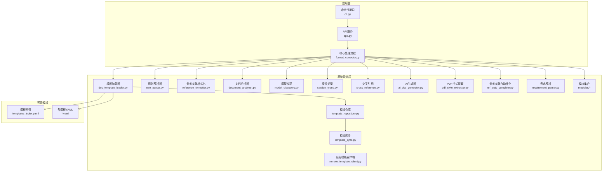
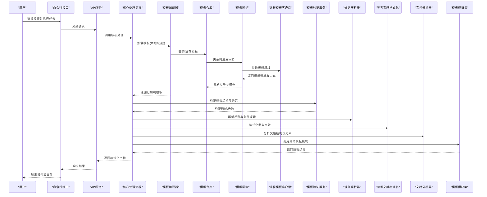
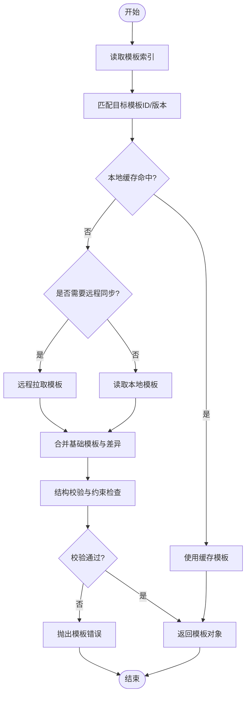
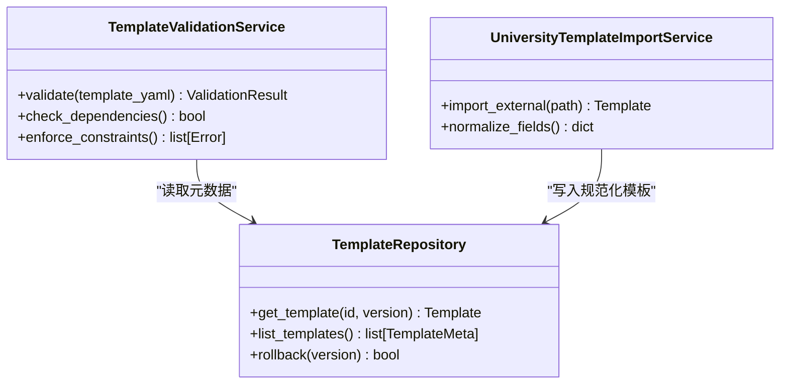
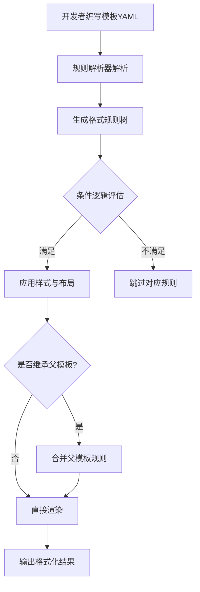
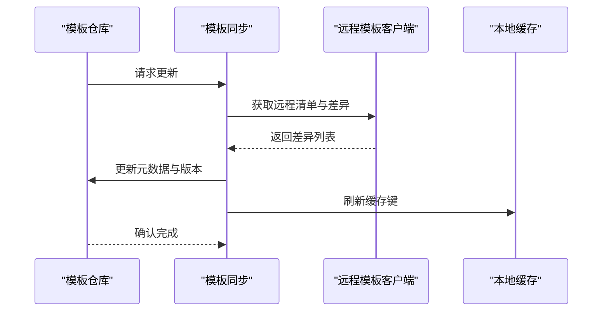
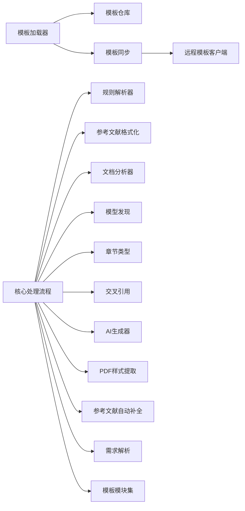

# 多格式模板系统

<cite>
**本文引用的文件**   
- [README.md](file://README.md)
- [pyproject.toml](file://pyproject.toml)
- [requirements.txt](file://requirements.txt)
- [run.py](file://run.py)
- [src/paper_format_corrector/app.py](file://src/paper_format_corrector/app.py)
- [src/paper_format_corrector/cli.py](file://src/paper_format_corrector/cli.py)
- [src/paper_format_corrector/core/format_corrector.py](file://src/paper_format_corrector/core/format_corrector.py)
- [src/paper_format_corrector/infra/doc_template_loader.py](file://src/paper_format_corrector/infra/doc_template_loader.py)
- [src/paper_format_corrector/infra/template_repository.py](file://src/paper_format_corrector/infra/template_repository.py)
- [src/paper_format_corrector/infra/template_sync.py](file://src/paper_format_corrector/infra/template_sync.py)
- [src/paper_format_corrector/infra/remote_template_client.py](file://src/paper_format_corrector/infra/remote_template_client.py)
- [src/paper_format_corrector/application/services/template_validation_service.py](file://src/paper_format_corrector/application/services/template_validation_service.py)
- [src/paper_format_corrector/application/services/university_template_import_service.py](file://src/paper_format_corrector/application/services/university_template_import_service.py)
- [src/paper_format_corrector/infrastructure/parsers/rule_parser.py](file://src/paper_format_corrector/infrastructure/parsers/rule_parser.py)
- [src/paper_format_corrector/infrastructure/parsers/reference_formatter.py](file://src/paper_format_corrector/infrastructure/parsers/reference_formatter.py)
- [src/paper_format_corrector/infrastructure/parsers/document_analyzer.py](file://src/paper_format_corrector/infrastructure/parsers/document_analyzer.py)
- [src/paper_format_corrector/infrastructure/parsers/model_discovery.py](file://src/paper_format_corrector/infrastructure/parsers/model_discovery.py)
- [src/paper_format_corrector/infrastructure/parsers/section_types.py](file://src/paper_format_corrector/infrastructure/parsers/section_types.py)
- [src/paper_format_corrector/infrastructure/parsers/cross_reference.py](file://src/paper_format_corrector/infrastructure/parsers/cross_reference.py)
- [src/paper_format_corrector/infrastructure/parsers/ai_doc_generator.py](file://src/paper_format_corrector/infrastructure/parsers/ai_doc_generator.py)
- [src/paper_format_corrector/infrastructure/parsers/pdf_style_extractor.py](file://src/paper_format_corrector/infrastructure/parsers/pdf_style_extractor.py)
- [src/paper_format_corrector/infrastructure/parsers/ref_auto_complete.py](file://src/paper_format_corrector/infrastructure/parsers/ref_auto_complete.py)
- [src/paper_format_corrector/infrastructure/parsers/requirement_parser.py](file://src/paper_format_corrector/infrastructure/parsers/requirement_parser.py)
- [src/paper_format_corrector/infrastructure/parsers/modules/__init__.py](file://src/paper_format_corrector/infrastructure/parsers/modules/__init__.py)
- [src/paper_format_corrector/infrastructure/parsers/modules/base.py](file://src/paper_format_corrector/infrastructure/parsers/modules/base.py)
- [src/paper_format_corrector/infrastructure/parsers/modules/apa_module.py](file://src/paper_format_corrector/infrastructure/parsers/modules/apa_module.py)
- [src/paper_format_corrector/infrastructure/parsers/modules/ieee_module.py](file://src/paper_format_corrector/infrastructure/parsers/modules/ieee_module.py)
- [src/paper_format_corrector/infrastructure/parsers/modules/acm_module.py](file://src/paper_format_corrector/infrastructure/parsers/modules/acm_module.py)
- [src/paper_format_corrector/infrastructure/parsers/modules/chinese_thesis_module.py](file://src/paper_format_corrector/infrastructure/parsers/modules/chinese_thesis_module.py)
- [src/paper_format_corrector/infrastructure/parsers/modules/tsinghua_module.py](file://src/paper_format_corrector/infrastructure/parsers/modules/tsinghua_module.py)
- [src/paper_format_corrector/infrastructure/parsers/modules/peking_module.py](file://src/paper_format_corrector/infrastructure/parsers/modules/peking_module.py)
- [src/paper_format_corrector/infrastructure/parsers/modules/fudan_module.py](file://src/paper_format_corrector/infrastructure/parsers/modules/fudan_module.py)
- [src/paper_format_corrector/infrastructure/parsers/modules/nanjing_module.py](file://src/paper_format_corrector/infrastructure/parsers/modules/nanjing_module.py)
- [src/paper_format_corrector/infrastructure/parsers/modules/wuhan_module.py](file://src/paper_format_corrector/infrastructure/parsers/modules/wuhan_module.py)
- [src/paper_format_corrector/infrastructure/parsers/modules/zhejiang_module.py](file://src/paper_format_corrector/infrastructure/parsers/modules/zhejiang_module.py)
- [src/paper_format_corrector/infrastructure/parsers/modules/shanghaijiaotong_module.py](file://src/paper_format_corrector/infrastructure/parsers/modules/shanghaijiaotong_module.py)
- [src/paper_format_corrector/infrastructure/parsers/modules/xjtu_module.py](file://src/paper_format_corrector/infrastructure/parsers/modules/xjtu_module.py)
- [src/paper_format_corrector/infrastructure/parsers/modules/hit_module.py](file://src/paper_format_corrector/infrastructure/parsers/modules/hit_module.py)
- [src/paper_format_corrector/infrastructure/parsers/modules/ustc_module.py](file://src/paper_format_corrector/infrastructure/parsers/modules/ustc_module.py)
- [src/paper_format_corrector/infrastructure/parsers/modules/conference_academic_module.py](file://src/paper_format_corrector/infrastructure/parsers/modules/conference_academic_module.py)
- [src/paper_format_corrector/infrastructure/parsers/modules/journal_academic_module.py](file://src/paper_format_corrector/infrastructure/parsers/modules/journal_academic_module.py)
- [src/paper_format_corrector/infrastructure/parsers/modules/academic_paper_module.py](file://src/paper_format_corrector/infrastructure/parsers/modules/academic_paper_module.py)
- [src/paper_format_corrector/infrastructure/parsers/modules/business_plan_module.py](file://src/paper_format_corrector/infrastructure/parsers/modules/business_plan_module.py)
- [src/paper_format_corrector/infrastructure/parsers/modules/contract_module.py](file://src/paper_format_corrector/infrastructure/parsers/modules/contract_module.py)
- [src/paper_format_corrector/infrastructure/parsers/modules/meeting_minutes_module.py](file://src/paper_format_corrector/infrastructure/parsers/modules/meeting_minutes_module.py)
- [src/paper_format_corrector/infrastructure/parsers/modules/report_module.py](file://src/paper_format_corrector/infrastructure/parsers/modules/report_module.py)
- [src/paper_format_corrector/infrastructure/parsers/modules/official_doc_module.py](file://src/paper_format_corrector/infrastructure/parsers/modules/official_doc_module.py)
- [presets/templates_index.yaml](file://presets/templates_index.yaml)
- [presets/apa.yaml](file://presets/apa.yaml)
- [presets/ieee.yaml](file://presets/ieee.yaml)
- [presets/acm.yaml](file://presets/acm.yaml)
- [presets/chinese_thesis.yaml](file://presets/chinese_thesis.yaml)
- [presets/tsinghua.yaml](file://presets/tsinghua.yaml)
- [presets/peking.yaml](file://presets/peking.yaml)
- [presets/fudan.yaml](file://presets/fudan.yaml)
- [presets/nanjing.yaml](file://presets/nanjing.yaml)
- [presets/wuhan.yaml](file://presets/wuhan.yaml)
- [presets/zhejiang.yaml](file://presets/zhejiang.yaml)
- [presets/shanghaijiaotong.yaml](file://presets/shanghaijiaotong.yaml)
- [presets/xjtu.yaml](file://presets/xjtu.yaml)
- [presets/hit.yaml](file://presets/hit.yaml)
- [presets/ustc.yaml](file://presets/ustc.yaml)
- [presets/aaai.yaml](file://presets/aaai.yaml)
- [presets/acl.yaml](file://presets/acl.yaml)
- [presets/cvpr.yaml](file://presets/cvpr.yaml)
- [presets/emnlp.yaml](file://presets/emnlp.yaml)
- [presets/iclr.yaml](file://presets/iclr.yaml)
- [presets/icml.yaml](file://presets/icml.yaml)
- [presets/kdd.yaml](file://presets/kdd.yaml)
- [presets/sigir.yaml](file://presets/sigir.yaml)
- [presets/www.yaml](file://presets/www.yaml)
- [presets/elsevier.yaml](file://presets/elsevier.yaml)
- [presets/nature.yaml](file://presets/nature.yaml)
- [presets/science.yaml](file://presets/science.yaml)
- [presets/springer.yaml](file://presets/springer.yaml)
- [presets/wiley.yaml](file://presets/wiley.yaml)
- [presets/ama.yaml](file://presets/ama.yaml)
- [presets/chicago.yaml](file://presets/chicago.yaml)
- [presets/harvard.yaml](file://presets/harvard.yaml)
- [presets/mla.yaml](file://presets/mla.yaml)
- [presets/japanese.yaml](file://presets/japanese.yaml)
- [presets/korean.yaml](file://presets/korean.yaml)
- [presets/doc_templates/academic_paper.yaml](file://presets/doc_templates/academic_paper.yaml)
- [presets/doc_templates/business_plan.yaml](file://presets/doc_templates/business_plan.yaml)
- [presets/doc_templates/contract.yaml](file://presets/doc_templates/contract.yaml)
- [presets/doc_templates/meeting_minutes.yaml](file://presets/doc_templates/meeting_minutes.yaml)
- [presets/doc_templates/official_doc.yaml](file://presets/doc_templates/official_doc.yaml)
- [presets/doc_templates/report.yaml](file://presets/doc_templates/report.yaml)
- [examples/sample_template.yaml](file://examples/sample_template.yaml)
- [tests/test_presets.py](file://tests/test_presets.py)
- [tests/test_template_repository.py](file://tests/test_template_repository.py)
- [tests/test_template_sync.py](file://tests/test_template_sync.py)
- [tests/test_template_validation_and_import.py](file://tests/test_template_validation_and_import.py)
</cite>

## 目录
1. [简介](#简介)
2. [项目结构](#项目结构)
3. [核心组件](#核心组件)
4. [架构总览](#架构总览)
5. [详细组件分析](#详细组件分析)
6. [依赖关系分析](#依赖关系分析)
7. [性能考虑](#性能考虑)
8. [故障排查指南](#故障排查指南)
9. [结论](#结论)
10. [附录](#附录)

## 简介
本技术文档面向“多格式模板系统”，聚焦于模板架构设计、动态加载机制、模板验证规则与版本管理策略。系统内置50+种预设格式模板，覆盖国际标准（如APA、IEEE、ACM等）与各大学特定模板，并提供YAML配置语法、格式规则定义、条件逻辑与继承机制的模板开发指南。同时说明模板仓库管理、远程同步与缓存策略，以及测试、调试与部署的最佳实践，并展示如何创建自定义模板和扩展内置模板功能。

## 项目结构
系统采用分层与模块化组织方式：
- 应用层：CLI入口、API服务、工作流编排与服务编排
- 领域层：实体、事件、值对象与领域服务
- 基础设施层：模板加载、解析器、转换器、导出器、队列与适配器
- 预设模板：以YAML定义的标准化模板集合，按标准/会议/期刊/高校分类
- 插件与示例：可扩展点与示例模板

图表来源
- [src/paper_format_corrector/cli.py](file://src/paper_format_corrector/cli.py)
- [src/paper_format_corrector/app.py](file://src/paper_format_corrector/app.py)
- [src/paper_format_corrector/core/format_corrector.py](file://src/paper_format_corrector/core/format_corrector.py)
- [src/paper_format_corrector/infra/doc_template_loader.py](file://src/paper_format_corrector/infra/doc_template_loader.py)
- [src/paper_format_corrector/infra/template_repository.py](file://src/paper_format_corrector/infra/template_repository.py)
- [src/paper_format_corrector/infra/template_sync.py](file://src/paper_format_corrector/infra/template_sync.py)
- [src/paper_format_corrector/infra/remote_template_client.py](file://src/paper_format_corrector/infra/remote_template_client.py)
- [src/paper_format_corrector/infrastructure/parsers/rule_parser.py](file://src/paper_format_corrector/infrastructure/parsers/rule_parser.py)
- [src/paper_format_corrector/infrastructure/parsers/reference_formatter.py](file://src/paper_format_corrector/infrastructure/parsers/reference_formatter.py)
- [src/paper_format_corrector/infrastructure/parsers/document_analyzer.py](file://src/paper_format_corrector/infrastructure/parsers/document_analyzer.py)
- [src/paper_format_corrector/infrastructure/parsers/model_discovery.py](file://src/paper_format_corrector/infrastructure/parsers/model_discovery.py)
- [src/paper_format_corrector/infrastructure/parsers/section_types.py](file://src/paper_format_corrector/infrastructure/parsers/section_types.py)
- [src/paper_format_corrector/infrastructure/parsers/cross_reference.py](file://src/paper_format_corrector/infrastructure/parsers/cross_reference.py)
- [src/paper_format_corrector/infrastructure/parsers/ai_doc_generator.py](file://src/paper_format_corrector/infrastructure/parsers/ai_doc_generator.py)
- [src/paper_format_corrector/infrastructure/parsers/pdf_style_extractor.py](file://src/paper_format_corrector/infrastructure/parsers/pdf_style_extractor.py)
- [src/paper_format_corrector/infrastructure/parsers/ref_auto_complete.py](file://src/paper_format_corrector/infrastructure/parsers/ref_auto_complete.py)
- [src/paper_format_corrector/infrastructure/parsers/requirement_parser.py](file://src/paper_format_corrector/infrastructure/parsers/requirement_parser.py)
- [presets/templates_index.yaml](file://presets/templates_index.yaml)

章节来源
- [README.md](file://README.md)
- [pyproject.toml](file://pyproject.toml)
- [requirements.txt](file://requirements.txt)
- [run.py](file://run.py)

## 核心组件
- 模板加载器：负责从本地与远程源发现、加载与合并模板，提供统一接口供上层使用
- 模板仓库：维护模板元数据、版本信息与缓存，支持增量更新与回滚
- 模板同步：协调远程仓库拉取、冲突解决与本地缓存刷新
- 远程模板客户端：封装认证、重试、限流与错误码映射
- 模板验证服务：校验模板YAML结构、字段约束与依赖关系
- 导入服务：将外部模板（如高校模板）转换为内部规范
- 解析器集合：规则解析、参考文献格式化、文档分析、模型发现、章节类型识别、交叉引用、AI辅助生成、PDF样式提取、参考文献自动补全、需求解析
- 模块集合：针对具体标准/会议/期刊/高校的模板实现模块

章节来源
- [src/paper_format_corrector/infra/doc_template_loader.py](file://src/paper_format_corrector/infra/doc_template_loader.py)
- [src/paper_format_corrector/infra/template_repository.py](file://src/paper_format_corrector/infra/template_repository.py)
- [src/paper_format_corrector/infra/template_sync.py](file://src/paper_format_corrector/infra/template_sync.py)
- [src/paper_format_corrector/infra/remote_template_client.py](file://src/paper_format_corrector/infra/remote_template_client.py)
- [src/paper_format_corrector/application/services/template_validation_service.py](file://src/paper_format_corrector/application/services/template_validation_service.py)
- [src/paper_format_corrector/application/services/university_template_import_service.py](file://src/paper_format_corrector/application/services/university_template_import_service.py)
- [src/paper_format_corrector/infrastructure/parsers/rule_parser.py](file://src/paper_format_corrector/infrastructure/parsers/rule_parser.py)
- [src/paper_format_corrector/infrastructure/parsers/reference_formatter.py](file://src/paper_format_corrector/infrastructure/parsers/reference_formatter.py)
- [src/paper_format_corrector/infrastructure/parsers/document_analyzer.py](file://src/paper_format_corrector/infrastructure/parsers/document_analyzer.py)
- [src/paper_format_corrector/infrastructure/parsers/model_discovery.py](file://src/paper_format_corrector/infrastructure/parsers/model_discovery.py)
- [src/paper_format_corrector/infrastructure/parsers/section_types.py](file://src/paper_format_corrector/infrastructure/parsers/section_types.py)
- [src/paper_format_corrector/infrastructure/parsers/cross_reference.py](file://src/paper_format_corrector/infrastructure/parsers/cross_reference.py)
- [src/paper_format_corrector/infrastructure/parsers/ai_doc_generator.py](file://src/paper_format_corrector/infrastructure/parsers/ai_doc_generator.py)
- [src/paper_format_corrector/infrastructure/parsers/pdf_style_extractor.py](file://src/paper_format_corrector/infrastructure/parsers/pdf_style_extractor.py)
- [src/paper_format_corrector/infrastructure/parsers/ref_auto_complete.py](file://src/paper_format_corrector/infrastructure/parsers/ref_auto_complete.py)
- [src/paper_format_corrector/infrastructure/parsers/requirement_parser.py](file://src/paper_format_corrector/infrastructure/parsers/requirement_parser.py)

## 架构总览
下图展示了模板系统的端到端流程：从用户选择模板到最终输出格式化结果，涵盖加载、验证、解析与渲染阶段。

图表来源
- [src/paper_format_corrector/cli.py](file://src/paper_format_corrector/cli.py)
- [src/paper_format_corrector/app.py](file://src/paper_format_corrector/app.py)
- [src/paper_format_corrector/core/format_corrector.py](file://src/paper_format_corrector/core/format_corrector.py)
- [src/paper_format_corrector/infra/doc_template_loader.py](file://src/paper_format_corrector/infra/doc_template_loader.py)
- [src/paper_format_corrector/infra/template_repository.py](file://src/paper_format_corrector/infra/template_repository.py)
- [src/paper_format_corrector/infra/template_sync.py](file://src/paper_format_corrector/infra/template_sync.py)
- [src/paper_format_corrector/infra/remote_template_client.py](file://src/paper_format_corrector/infra/remote_template_client.py)
- [src/paper_format_corrector/application/services/template_validation_service.py](file://src/paper_format_corrector/application/services/template_validation_service.py)
- [src/paper_format_corrector/infrastructure/parsers/rule_parser.py](file://src/paper_format_corrector/infrastructure/parsers/rule_parser.py)
- [src/paper_format_corrector/infrastructure/parsers/reference_formatter.py](file://src/paper_format_corrector/infrastructure/parsers/reference_formatter.py)
- [src/paper_format_corrector/infrastructure/parsers/document_analyzer.py](file://src/paper_format_corrector/infrastructure/parsers/document_analyzer.py)
- [src/paper_format_corrector/infrastructure/parsers/modules/__init__.py](file://src/paper_format_corrector/infrastructure/parsers/modules/__init__.py)

## 详细组件分析

### 模板加载与动态加载机制
- 模板索引：集中声明可用模板及其元信息，便于快速发现与筛选
- 加载器：根据索引定位模板YAML，按需合并基础模板与差异配置，支持条件分支与继承
- 仓库：维护模板版本、变更日志与缓存键，避免重复下载与解析
- 同步：在首次使用或强制更新时拉取远程模板，支持断点续传与冲突提示

图表来源
- [presets/templates_index.yaml](file://presets/templates_index.yaml)
- [src/paper_format_corrector/infra/doc_template_loader.py](file://src/paper_format_corrector/infra/doc_template_loader.py)
- [src/paper_format_corrector/infra/template_repository.py](file://src/paper_format_corrector/infra/template_repository.py)
- [src/paper_format_corrector/infra/template_sync.py](file://src/paper_format_corrector/infra/template_sync.py)
- [src/paper_format_corrector/infra/remote_template_client.py](file://src/paper_format_corrector/infra/remote_template_client.py)

章节来源
- [src/paper_format_corrector/infra/doc_template_loader.py](file://src/paper_format_corrector/infra/doc_template_loader.py)
- [src/paper_format_corrector/infra/template_repository.py](file://src/paper_format_corrector/infra/template_repository.py)
- [src/paper_format_corrector/infra/template_sync.py](file://src/paper_format_corrector/infra/template_sync.py)
- [src/paper_format_corrector/infra/remote_template_client.py](file://src/paper_format_corrector/infra/remote_template_client.py)
- [presets/templates_index.yaml](file://presets/templates_index.yaml)

### 模板验证规则与版本管理
- 验证服务：对模板YAML进行结构校验、必填字段检查、枚举值约束、依赖模板存在性验证
- 版本管理：模板包含版本号与兼容性矩阵；仓库记录变更摘要与回滚标记
- 导入服务：将外部模板（如高校模板）转换为内部规范，确保与现有验证规则兼容

图表来源
- [src/paper_format_corrector/application/services/template_validation_service.py](file://src/paper_format_corrector/application/services/template_validation_service.py)
- [src/paper_format_corrector/infra/template_repository.py](file://src/paper_format_corrector/infra/template_repository.py)
- [src/paper_format_corrector/application/services/university_template_import_service.py](file://src/paper_format_corrector/application/services/university_template_import_service.py)

章节来源
- [src/paper_format_corrector/application/services/template_validation_service.py](file://src/paper_format_corrector/application/services/template_validation_service.py)
- [src/paper_format_corrector/application/services/university_template_import_service.py](file://src/paper_format_corrector/application/services/university_template_import_service.py)
- [src/paper_format_corrector/infra/template_repository.py](file://src/paper_format_corrector/infra/template_repository.py)

### 预设模板组织结构与配置语法
- 模板索引：集中列出所有可用模板ID、名称、适用场景与版本
- 模板YAML：定义页面布局、段落样式、标题层级、页眉页脚、表格与图片编号、参考文献格式、条件逻辑与继承关系
- 分类：国际标准（APA、IEEE、ACM等）、会议/期刊（AAAI、ACL、CVPR、EMNLP、ICLR、ICML、KDD、SIGIR、WWW、Elsevier、Nature、Science、Springer、Wiley等）、高校模板（清华、北大、复旦、南大、武大、浙大、上交、西交、哈工大、中科大等）、通用文档（学术论文、商业计划书、合同、会议纪要、公文、报告）

```mermaid
graph TB
IDX["模板索引<br/>templates_index.yaml"]
APA["APA模板<br/>apa.yaml"]
IEEE["IEEE模板<br/>ieee.yaml"]
ACM["ACM模板<br/>acm.yaml"]
CT["中文论文模板<br/>chinese_thesis.yaml"]
TH["清华大学模板<br/>tsinghua.yaml"]
PK["北京大学模板<br/>peking.yaml"]
FD["复旦大学模板<br/>fudan.yaml"]
NJ["南京大学模板<br/>nanjing.yaml"]
WH["武汉大学模板<br/>wuhan.yaml"]
ZJ["浙江大学模板<br/>zhejiang.yaml"]
SJTU["上海交通大学模板<br/>shanghaijiaotong.yaml"]
XJTU["西安交通大学模板<br/>xjtu.yaml"]
HIT["哈尔滨工业大学模板<br/>hit.yaml"]
USTC["中国科学技术大学模板<br/>ustc.yaml"]
DOC_A["学术论文模板<br/>academic_paper.yaml"]
DOC_B["商业计划书模板<br/>business_plan.yaml"]
DOC_C["合同模板<br/>contract.yaml"]
DOC_M["会议纪要模板<br/>meeting_minutes.yaml"]
DOC_O["公文模板<br/>official_doc.yaml"]
DOC_R["报告模板<br/>report.yaml"]
IDX --> APA
IDX --> IEEE
IDX --> ACM
IDX --> CT
IDX --> TH
IDX --> PK
IDX --> FD
IDX --> NJ
IDX --> WH
IDX --> ZJ
IDX --> SJTU
IDX --> XJTU
IDX --> HIT
IDX --> USTC
IDX --> DOC_A
IDX --> DOC_B
IDX --> DOC_C
IDX --> DOC_M
IDX --> DOC_O
IDX --> DOC_R
```

图表来源
- [presets/templates_index.yaml](file://presets/templates_index.yaml)
- [presets/apa.yaml](file://presets/apa.yaml)
- [presets/ieee.yaml](file://presets/ieee.yaml)
- [presets/acm.yaml](file://presets/acm.yaml)
- [presets/chinese_thesis.yaml](file://presets/chinese_thesis.yaml)
- [presets/tsinghua.yaml](file://presets/tsinghua.yaml)
- [presets/peking.yaml](file://presets/peking.yaml)
- [presets/fudan.yaml](file://presets/fudan.yaml)
- [presets/nanjing.yaml](file://presets/nanjing.yaml)
- [presets/wuhan.yaml](file://presets/wuhan.yaml)
- [presets/zhejiang.yaml](file://presets/zhejiang.yaml)
- [presets/shanghaijiaotong.yaml](file://presets/shanghaijiaotong.yaml)
- [presets/xjtu.yaml](file://presets/xjtu.yaml)
- [presets/hit.yaml](file://presets/hit.yaml)
- [presets/ustc.yaml](file://presets/ustc.yaml)
- [presets/doc_templates/academic_paper.yaml](file://presets/doc_templates/academic_paper.yaml)
- [presets/doc_templates/business_plan.yaml](file://presets/doc_templates/business_plan.yaml)
- [presets/doc_templates/contract.yaml](file://presets/doc_templates/contract.yaml)
- [presets/doc_templates/meeting_minutes.yaml](file://presets/doc_templates/meeting_minutes.yaml)
- [presets/doc_templates/official_doc.yaml](file://presets/doc_templates/official_doc.yaml)
- [presets/doc_templates/report.yaml](file://presets/doc_templates/report.yaml)

章节来源
- [presets/templates_index.yaml](file://presets/templates_index.yaml)
- [presets/apa.yaml](file://presets/apa.yaml)
- [presets/ieee.yaml](file://presets/ieee.yaml)
- [presets/acm.yaml](file://presets/acm.yaml)
- [presets/chinese_thesis.yaml](file://presets/chinese_thesis.yaml)
- [presets/tsinghua.yaml](file://presets/tsinghua.yaml)
- [presets/peking.yaml](file://presets/peking.yaml)
- [presets/fudan.yaml](file://presets/fudan.yaml)
- [presets/nanjing.yaml](file://presets/nanjing.yaml)
- [presets/wuhan.yaml](file://presets/wuhan.yaml)
- [presets/zhejiang.yaml](file://presets/zhejiang.yaml)
- [presets/shanghaijiaotong.yaml](file://presets/shanghaijiaotong.yaml)
- [presets/xjtu.yaml](file://presets/xjtu.yaml)
- [presets/hit.yaml](file://presets/hit.yaml)
- [presets/ustc.yaml](file://presets/ustc.yaml)
- [presets/doc_templates/academic_paper.yaml](file://presets/doc_templates/academic_paper.yaml)
- [presets/doc_templates/business_plan.yaml](file://presets/doc_templates/business_plan.yaml)
- [presets/doc_templates/contract.yaml](file://presets/doc_templates/contract.yaml)
- [presets/doc_templates/meeting_minutes.yaml](file://presets/doc_templates/meeting_minutes.yaml)
- [presets/doc_templates/official_doc.yaml](file://presets/doc_templates/official_doc.yaml)
- [presets/doc_templates/report.yaml](file://presets/doc_templates/report.yaml)

### 模板开发指南（YAML配置语法、规则定义、条件逻辑与继承）
- YAML配置语法：定义模板元信息、页面设置、段落与字符样式、标题层级、页眉页脚、表格与图片编号、参考文献格式、条件逻辑与继承关系
- 规则定义：通过规则解析器将YAML中的格式规则转换为可执行指令，包括对齐、缩进、行距、字体、颜色、分页控制等
- 条件逻辑：基于环境、平台、语言、作者信息等上下文变量进行分支渲染
- 继承机制：模板可继承基础模板或父模板，仅声明差异部分，减少冗余

图表来源
- [src/paper_format_corrector/infrastructure/parsers/rule_parser.py](file://src/paper_format_corrector/infrastructure/parsers/rule_parser.py)
- [examples/sample_template.yaml](file://examples/sample_template.yaml)

章节来源
- [src/paper_format_corrector/infrastructure/parsers/rule_parser.py](file://src/paper_format_corrector/infrastructure/parsers/rule_parser.py)
- [examples/sample_template.yaml](file://examples/sample_template.yaml)

### 模板仓库管理、远程同步与缓存策略
- 仓库管理：维护模板清单、版本、哈希与变更日志，支持只读与读写模式
- 远程同步：定时或按需拉取远程模板，支持增量更新与冲突检测
- 缓存策略：按模板ID与版本生成缓存键，命中则跳过网络与解析开销

图表来源
- [src/paper_format_corrector/infra/template_repository.py](file://src/paper_format_corrector/infra/template_repository.py)
- [src/paper_format_corrector/infra/template_sync.py](file://src/paper_format_corrector/infra/template_sync.py)
- [src/paper_format_corrector/infra/remote_template_client.py](file://src/paper_format_corrector/infra/remote_template_client.py)

章节来源
- [src/paper_format_corrector/infra/template_repository.py](file://src/paper_format_corrector/infra/template_repository.py)
- [src/paper_format_corrector/infra/template_sync.py](file://src/paper_format_corrector/infra/template_sync.py)
- [src/paper_format_corrector/infra/remote_template_client.py](file://src/paper_format_corrector/infra/remote_template_client.py)

### 模板测试、调试与部署最佳实践
- 单元测试：覆盖模板加载、验证、解析与渲染路径，确保回归稳定
- 集成测试：模拟远程同步与缓存命中，验证端到端流程
- 调试技巧：启用详细日志、打印规则树与条件评估结果，定位渲染异常
- 部署建议：预构建模板索引与常用模板缓存，限制远程访问频率，灰度发布新模板版本

章节来源
- [tests/test_presets.py](file://tests/test_presets.py)
- [tests/test_template_repository.py](file://tests/test_template_repository.py)
- [tests/test_template_sync.py](file://tests/test_template_sync.py)
- [tests/test_template_validation_and_import.py](file://tests/test_template_validation_and_import.py)

### 创建自定义模板与扩展内置模板功能
- 自定义模板：基于示例模板YAML，定义差异化样式与规则，加入模板索引
- 扩展模块：新增模板模块类，实现特定标准/高校的渲染逻辑，注册到模块集合
- 插件机制：通过插件管理器注入额外处理器（如图表、公式、封面），增强模板能力

章节来源
- [src/paper_format_corrector/infra/plugin_manager.py](file://src/paper_format_corrector/infra/plugin_manager.py)
- [src/paper_format_corrector/infrastructure/parsers/modules/__init__.py](file://src/paper_format_corrector/infrastructure/parsers/modules/__init__.py)
- [examples/sample_template.yaml](file://examples/sample_template.yaml)

## 依赖关系分析
- 组件耦合：模板加载器依赖仓库与同步服务；核心处理流程依赖解析器集合与模板模块
- 外部依赖：远程模板客户端依赖网络库与认证模块；解析器依赖文档分析与模型发现
- 循环依赖：通过接口抽象与依赖注入避免循环引用

图表来源
- [src/paper_format_corrector/infra/doc_template_loader.py](file://src/paper_format_corrector/infra/doc_template_loader.py)
- [src/paper_format_corrector/infra/template_repository.py](file://src/paper_format_corrector/infra/template_repository.py)
- [src/paper_format_corrector/infra/template_sync.py](file://src/paper_format_corrector/infra/template_sync.py)
- [src/paper_format_corrector/infra/remote_template_client.py](file://src/paper_format_corrector/infra/remote_template_client.py)
- [src/paper_format_corrector/core/format_corrector.py](file://src/paper_format_corrector/core/format_corrector.py)
- [src/paper_format_corrector/infrastructure/parsers/rule_parser.py](file://src/paper_format_corrector/infrastructure/parsers/rule_parser.py)
- [src/paper_format_corrector/infrastructure/parsers/reference_formatter.py](file://src/paper_format_corrector/infrastructure/parsers/reference_formatter.py)
- [src/paper_format_corrector/infrastructure/parsers/document_analyzer.py](file://src/paper_format_corrector/infrastructure/parsers/document_analyzer.py)
- [src/paper_format_corrector/infrastructure/parsers/model_discovery.py](file://src/paper_format_corrector/infrastructure/parsers/model_discovery.py)
- [src/paper_format_corrector/infrastructure/parsers/section_types.py](file://src/paper_format_corrector/infrastructure/parsers/section_types.py)
- [src/paper_format_corrector/infrastructure/parsers/cross_reference.py](file://src/paper_format_corrector/infrastructure/parsers/cross_reference.py)
- [src/paper_format_corrector/infrastructure/parsers/ai_doc_generator.py](file://src/paper_format_corrector/infrastructure/parsers/ai_doc_generator.py)
- [src/paper_format_corrector/infrastructure/parsers/pdf_style_extractor.py](file://src/paper_format_corrector/infrastructure/parsers/pdf_style_extractor.py)
- [src/paper_format_corrector/infrastructure/parsers/ref_auto_complete.py](file://src/paper_format_corrector/infrastructure/parsers/ref_auto_complete.py)
- [src/paper_format_corrector/infrastructure/parsers/requirement_parser.py](file://src/paper_format_corrector/infrastructure/parsers/requirement_parser.py)

章节来源
- [src/paper_format_corrector/core/format_corrector.py](file://src/paper_format_corrector/core/format_corrector.py)
- [src/paper_format_corrector/infra/doc_template_loader.py](file://src/paper_format_corrector/infra/doc_template_loader.py)
- [src/paper_format_corrector/infra/template_repository.py](file://src/paper_format_corrector/infra/template_repository.py)
- [src/paper_format_corrector/infra/template_sync.py](file://src/paper_format_corrector/infra/template_sync.py)
- [src/paper_format_corrector/infra/remote_template_client.py](file://src/paper_format_corrector/infra/remote_template_client.py)

## 性能考虑
- 缓存优先：模板解析与渲染结果按版本缓存，减少重复计算
- 增量同步：仅拉取差异模板，降低网络与磁盘IO
- 并行处理：文档分析与规则应用可并行化，提升吞吐
- 资源限制：限制并发请求与内存占用，避免OOM

## 故障排查指南
- 模板加载失败：检查模板索引与ID匹配、版本是否存在、本地缓存是否损坏
- 验证错误：查看验证服务返回的错误列表，修正YAML结构与约束
- 同步异常：检查远程客户端认证、网络连通性与限流策略
- 渲染异常：启用详细日志，打印规则树与条件评估结果，定位具体规则

章节来源
- [src/paper_format_corrector/application/services/template_validation_service.py](file://src/paper_format_corrector/application/services/template_validation_service.py)
- [src/paper_format_corrector/infra/remote_template_client.py](file://src/paper_format_corrector/infra/remote_template_client.py)
- [src/paper_format_corrector/infra/logger.py](file://src/paper_format_corrector/infra/logger.py)

## 结论
多格式模板系统通过标准化的YAML配置、严格的验证规则与灵活的继承机制，实现了跨标准、跨机构的高内聚低耦合模板生态。结合远程同步与缓存策略，系统在易用性与性能之间取得平衡。开发者可通过模板模块与插件机制扩展能力，满足多样化排版需求。

## 附录
- 示例模板：参考示例YAML，快速上手模板开发
- 测试用例：参考测试文件，了解常见场景与边界条件
- 依赖清单：参考项目依赖文件，确保运行环境一致

章节来源
- [examples/sample_template.yaml](file://examples/sample_template.yaml)
- [tests/test_presets.py](file://tests/test_presets.py)
- [requirements.txt](file://requirements.txt)
- [pyproject.toml](file://pyproject.toml)