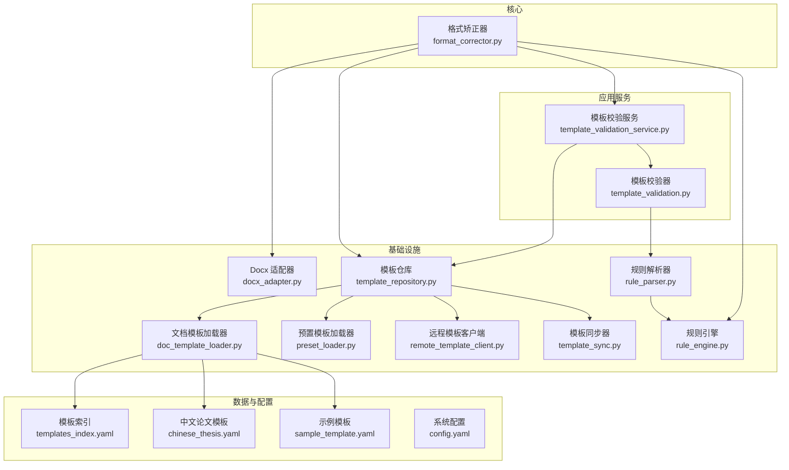
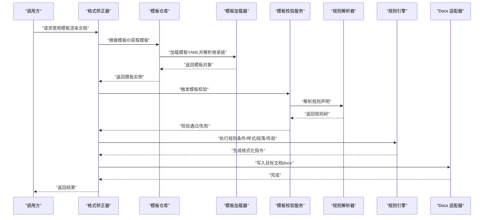
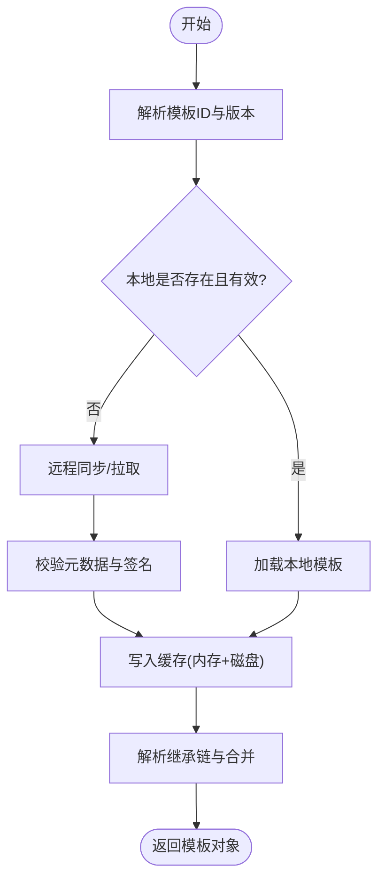
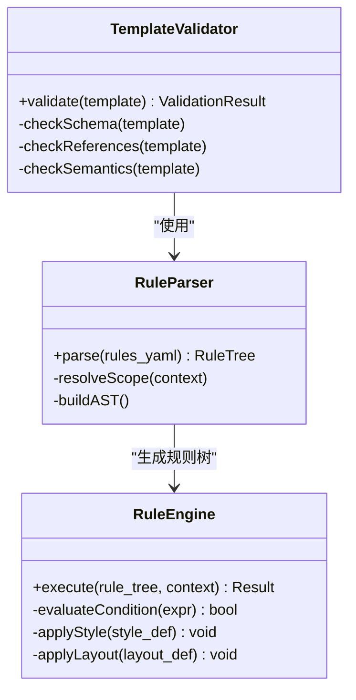
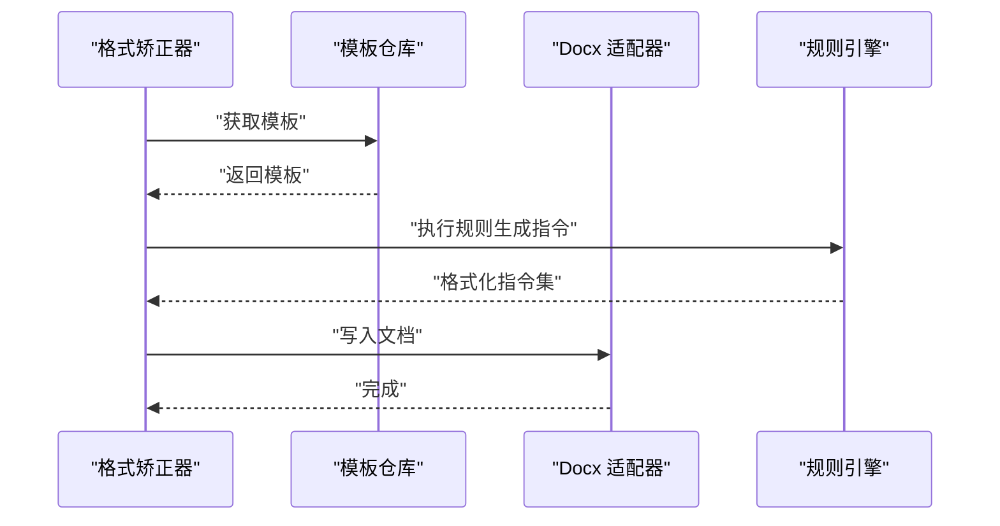
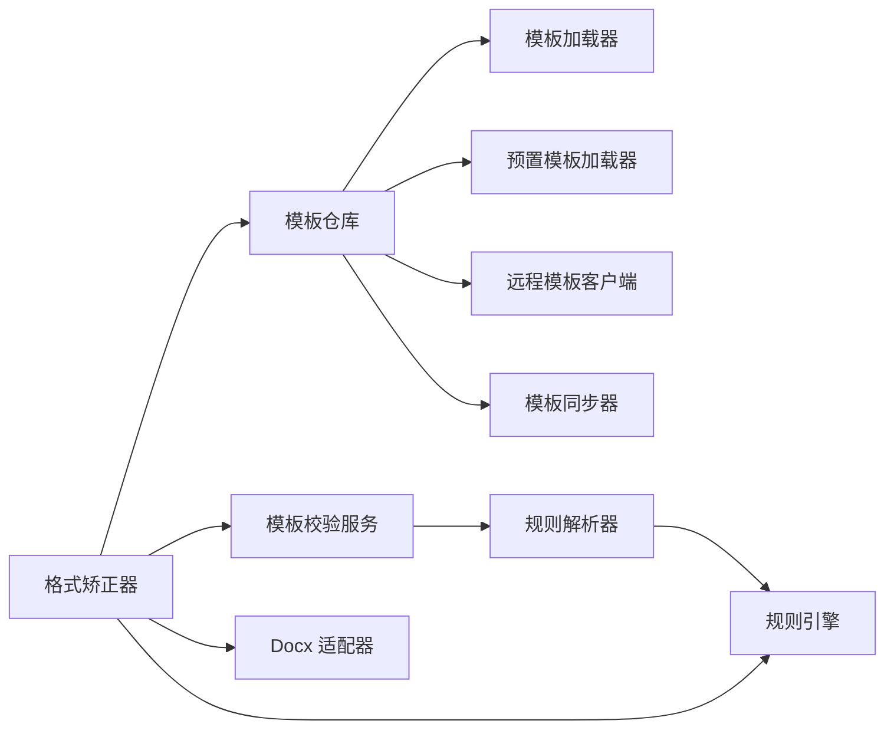

# 模板架构设计

<cite>
**本文引用的文件**   
- [src/paper_format_corrector/infra/template_repository.py](file://src/paper_format_corrector/infra/template_repository.py)
- [src/paper_format_corrector/infra/doc_template_loader.py](file://src/paper_format_corrector/infra/doc_template_loader.py)
- [src/paper_format_corrector/infra/preset_loader.py](file://src/paper_format_corrector/infra/preset_loader.py)
- [src/paper_format_corrector/application/services/template_validation_service.py](file://src/paper_format_corrector/application/services/template_validation_service.py)
- [src/paper_format_corrector/application/services/template_validation.py](file://src/paper_format_corrector/application/services/template_validation.py)
- [src/paper_format_corrector/core/format_corrector.py](file://src/paper_format_corrector/core/format_corrector.py)
- [src/paper_format_corrector/infrastructure/adapters/docx_adapter.py](file://src/paper_format_corrector/infrastructure/adapters/docx_adapter.py)
- [src/paper_format_corrector/infrastructure/parsers/rule_parser.py](file://src/paper_format_corrector/infrastructure/parsers/rule_parser.py)
- [src/paper_format_corrector/quality/rule_engine.py](file://src/paper_format_corrector/quality/rule_engine.py)
- [presets/templates_index.yaml](file://presets/templates_index.yaml)
- [presets/chinese_thesis.yaml](file://presets/chinese_thesis.yaml)
- [examples/sample_template.yaml](file://examples/sample_template.yaml)
- [config/config.yaml](file://config/config.yaml)
- [src/paper_format_corrector/infra/remote_template_client.py](file://src/paper_format_corrector/infra/remote_template_client.py)
- [src/paper_format_corrector/infra/template_sync.py](file://src/paper_format_corrector/infra/template_sync.py)
</cite>

## 目录
1. [简介](#简介)
2. [项目结构](#项目结构)
3. [核心组件](#核心组件)
4. [架构总览](#架构总览)
5. [详细组件分析](#详细组件分析)
6. [依赖关系分析](#依赖关系分析)
7. [性能考虑](#性能考虑)
8. [故障排除指南](#故障排除指南)
9. [结论](#结论)
10. [附录：YAML 模板规范](#附录yaml-模板规范)

## 简介
本技术文档围绕“模板架构设计”展开，系统性阐述模板仓库管理、动态加载机制、缓存策略与版本控制；详述模板生命周期（加载、验证、执行）；解释模板继承、条件逻辑与规则引擎的工作原理；给出模板配置文件的 YAML 语法规范（格式定义、样式规则、段落设置、页面布局）；并说明模板系统与核心格式矫正器的集成方式及多格式兼容性处理。最后提供性能优化建议与故障排除指南。

## 项目结构
模板相关能力分布在基础设施层与应用服务层，关键路径如下：
- 模板仓库与远程同步：infra/template_repository.py、infra/template_sync.py、infra/remote_template_client.py
- 模板加载与预置模板索引：infra/doc_template_loader.py、infra/preset_loader.py、presets/templates_index.yaml
- 模板校验：application/services/template_validation_service.py、application/services/template_validation.py
- 规则解析与执行：infrastructure/parsers/rule_parser.py、quality/rule_engine.py
- 与格式矫正器集成：core/format_corrector.py、infrastructure/adapters/docx_adapter.py
- 示例与配置：examples/sample_template.yaml、config/config.yaml、presets/*.yaml

图表来源
- [src/paper_format_corrector/infra/template_repository.py](file://src/paper_format_corrector/infra/template_repository.py)
- [src/paper_format_corrector/infra/doc_template_loader.py](file://src/paper_format_corrector/infra/doc_template_loader.py)
- [src/paper_format_corrector/infra/preset_loader.py](file://src/paper_format_corrector/infra/preset_loader.py)
- [src/paper_format_corrector/infra/remote_template_client.py](file://src/paper_format_corrector/infra/remote_template_client.py)
- [src/paper_format_corrector/infra/template_sync.py](file://src/paper_format_corrector/infra/template_sync.py)
- [src/paper_format_corrector/application/services/template_validation_service.py](file://src/paper_format_corrector/application/services/template_validation_service.py)
- [src/paper_format_corrector/application/services/template_validation.py](file://src/paper_format_corrector/application/services/template_validation.py)
- [src/paper_format_corrector/infrastructure/parsers/rule_parser.py](file://src/paper_format_corrector/infrastructure/parsers/rule_parser.py)
- [src/paper_format_corrector/quality/rule_engine.py](file://src/paper_format_corrector/quality/rule_engine.py)
- [src/paper_format_corrector/core/format_corrector.py](file://src/paper_format_corrector/core/format_corrector.py)
- [src/paper_format_corrector/infrastructure/adapters/docx_adapter.py](file://src/paper_format_corrector/infrastructure/adapters/docx_adapter.py)
- [presets/templates_index.yaml](file://presets/templates_index.yaml)
- [presets/chinese_thesis.yaml](file://presets/chinese_thesis.yaml)
- [examples/sample_template.yaml](file://examples/sample_template.yaml)
- [config/config.yaml](file://config/config.yaml)

章节来源
- [src/paper_format_corrector/infra/template_repository.py](file://src/paper_format_corrector/infra/template_repository.py)
- [src/paper_format_corrector/infra/doc_template_loader.py](file://src/paper_format_corrector/infra/doc_template_loader.py)
- [src/paper_format_corrector/infra/preset_loader.py](file://src/paper_format_corrector/infra/preset_loader.py)
- [src/paper_format_corrector/infra/remote_template_client.py](file://src/paper_format_corrector/infra/remote_template_client.py)
- [src/paper_format_corrector/infra/template_sync.py](file://src/paper_format_corrector/infra/template_sync.py)
- [src/paper_format_corrector/application/services/template_validation_service.py](file://src/paper_format_corrector/application/services/template_validation_service.py)
- [src/paper_format_corrector/application/services/template_validation.py](file://src/paper_format_corrector/application/services/template_validation.py)
- [src/payer_format_corrector/infrastructure/parsers/rule_parser.py](file://src/paper_format_corrector/infrastructure/parsers/rule_parser.py)
- [src/paper_format_corrector/quality/rule_engine.py](file://src/paper_format_corrector/quality/rule_engine.py)
- [src/paper_format_corrector/core/format_corrector.py](file://src/paper_format_corrector/core/format_corrector.py)
- [src/paper_format_corrector/infrastructure/adapters/docx_adapter.py](file://src/paper_format_corrector/infrastructure/adapters/docx_adapter.py)
- [presets/templates_index.yaml](file://presets/templates_index.yaml)
- [presets/chinese_thesis.yaml](file://presets/chinese_thesis.yaml)
- [examples/sample_template.yaml](file://examples/sample_template.yaml)
- [config/config.yaml](file://config/config.yaml)

## 核心组件
- 模板仓库（TemplateRepository）
  - 职责：统一访问本地与远程模板，维护元数据与版本信息，协调缓存与同步。
  - 关键点：按模板标识解析优先级（本地优先），支持增量同步与冲突策略。
- 文档模板加载器（DocTemplateLoader）
  - 职责：从文件系统或包内资源加载模板 YAML，合并继承链，构建运行时模板对象。
  - 关键点：支持相对路径解析、资源回退、按需加载片段。
- 预置模板加载器（PresetLoader）
  - 职责：扫描 presets 目录，读取 templates_index.yaml，注册可用模板清单。
  - 关键点：索引变更热更新、模板分组与标签。
- 模板校验服务（TemplateValidationService / TemplateValidator）
  - 职责：对模板进行结构与语义校验（字段存在性、类型、约束、引用完整性）。
  - 关键点：错误聚合、可插拔校验器、校验结果持久化。
- 规则解析器（RuleParser）与规则引擎（RuleEngine）
  - 职责：将模板中的规则声明解析为可执行规则树，并在文档处理阶段执行。
  - 关键点：条件分支、作用域、上下文变量注入、短路求值。
- 格式矫正器（FormatCorrector）
  - 职责：编排模板加载、校验、规则执行与文档适配（如 docx 写入）。
  - 关键点：流水线式处理、异常隔离、输出一致性保障。
- Docx 适配器（DocxAdapter）
  - 职责：封装底层文档操作，屏蔽具体格式差异。
  - 关键点：样式映射、段落/表格/图片等元素写入、兼容旧版 API。

章节来源
- [src/paper_format_corrector/infra/template_repository.py](file://src/paper_format_corrector/infra/template_repository.py)
- [src/paper_format_corrector/infra/doc_template_loader.py](file://src/paper_format_corrector/infra/doc_template_loader.py)
- [src/paper_format_corrector/infra/preset_loader.py](file://src/paper_format_corrector/infra/preset_loader.py)
- [src/paper_format_corrector/application/services/template_validation_service.py](file://src/paper_format_corrector/application/services/template_validation_service.py)
- [src/paper_format_corrector/application/services/template_validation.py](file://src/paper_format_corrector/application/services/template_validation.py)
- [src/paper_format_corrector/infrastructure/parsers/rule_parser.py](file://src/paper_format_corrector/infrastructure/parsers/rule_parser.py)
- [src/paper_format_corrector/quality/rule_engine.py](file://src/paper_format_corrector/quality/rule_engine.py)
- [src/paper_format_corrector/core/format_corrector.py](file://src/paper_format_corrector/core/format_corrector.py)
- [src/paper_format_corrector/infrastructure/adapters/docx_adapter.py](file://src/paper_format_corrector/infrastructure/adapters/docx_adapter.py)

## 架构总览
模板系统采用分层与插件化设计：
- 接口层：对外暴露模板选择、渲染与导出能力。
- 应用服务层：负责模板校验、工作流编排与业务规则。
- 基础设施层：实现模板仓库、加载器、规则引擎、格式适配器。
- 数据层：YAML 模板、索引、配置与远程仓库。

图表来源
- [src/paper_format_corrector/core/format_corrector.py](file://src/paper_format_corrector/core/format_corrector.py)
- [src/paper_format_corrector/infra/template_repository.py](file://src/paper_format_corrector/infra/template_repository.py)
- [src/paper_format_corrector/infra/doc_template_loader.py](file://src/paper_format_corrector/infra/doc_template_loader.py)
- [src/paper_format_corrector/application/services/template_validation_service.py](file://src/paper_format_corrector/application/services/template_validation_service.py)
- [src/paper_format_corrector/infrastructure/parsers/rule_parser.py](file://src/paper_format_corrector/infrastructure/parsers/rule_parser.py)
- [src/paper_format_corrector/quality/rule_engine.py](file://src/paper_format_corrector/quality/rule_engine.py)
- [src/paper_format_corrector/infrastructure/adapters/docx_adapter.py](file://src/paper_format_corrector/infrastructure/adapters/docx_adapter.py)

## 详细组件分析

### 模板仓库与动态加载
- 模板仓库
  - 提供统一的模板访问入口，支持本地缓存与远程同步。
  - 版本控制：基于模板元数据（版本号、哈希）判断是否需要拉取或回滚。
  - 冲突策略：当本地与远程不一致时，提供覆盖、保留或合并策略。
- 动态加载
  - 按需加载模板片段，避免一次性载入大模板导致内存峰值。
  - 继承链解析：基础模板 -> 领域模板 -> 用户自定义模板，后者优先级更高。
- 缓存策略
  - 内存缓存：进程内最近使用的模板对象缓存。
  - 磁盘缓存：模板文件与解析后的中间表示（IR）缓存，支持失效键（版本/哈希）。
  - 预热机制：启动时根据配置预加载高频模板。

图表来源
- [src/paper_format_corrector/infra/template_repository.py](file://src/paper_format_corrector/infra/template_repository.py)
- [src/paper_format_corrector/infra/template_sync.py](file://src/paper_format_corrector/infra/template_sync.py)
- [src/paper_format_corrector/infra/doc_template_loader.py](file://src/paper_format_corrector/infra/doc_template_loader.py)

章节来源
- [src/paper_format_corrector/infra/template_repository.py](file://src/paper_format_corrector/infra/template_repository.py)
- [src/paper_format_corrector/infra/template_sync.py](file://src/paper_format_corrector/infra/template_sync.py)
- [src/paper_format_corrector/infra/doc_template_loader.py](file://src/paper_format_corrector/infra/doc_template_loader.py)

### 模板校验与规则引擎
- 模板校验
  - 结构校验：必填字段、枚举值、嵌套层级。
  - 引用校验：样式名、段落类型、页面布局引用是否合法。
  - 语义校验：条件表达式合法性、变量作用域、循环边界。
- 规则解析与执行
  - 解析器将 YAML 中的规则声明转换为 AST/IR。
  - 规则引擎在文档处理阶段执行，支持条件分支、短路、上下文注入。
  - 错误报告：定位到具体行号与上下文，便于快速修复。

图表来源
- [src/paper_format_corrector/application/services/template_validation.py](file://src/paper_format_corrector/application/services/template_validation.py)
- [src/paper_format_corrector/infrastructure/parsers/rule_parser.py](file://src/paper_format_corrector/infrastructure/parsers/rule_parser.py)
- [src/paper_format_corrector/quality/rule_engine.py](file://src/paper_format_corrector/quality/rule_engine.py)

章节来源
- [src/paper_format_corrector/application/services/template_validation_service.py](file://src/paper_format_corrector/application/services/template_validation_service.py)
- [src/paper_format_corrector/application/services/template_validation.py](file://src/paper_format_corrector/application/services/template_validation.py)
- [src/paper_format_corrector/infrastructure/parsers/rule_parser.py](file://src/paper_format_corrector/infrastructure/parsers/rule_parser.py)
- [src/paper_format_corrector/quality/rule_engine.py](file://src/paper_format_corrector/quality/rule_engine.py)

### 与核心格式矫正器集成与多格式兼容
- 集成点
  - 格式矫正器在渲染流程中调用模板仓库与校验服务，确保模板可用后再执行规则。
  - 通过适配器抽象不同文档格式（docx、pdf 等），统一写入接口。
- 兼容性处理
  - 样式映射：模板样式名到目标格式的样式表映射。
  - 段落/表格/图片：按目标格式特性进行差异化处理。
  - 降级策略：当某些特性不可用时，自动降级为近似效果。

图表来源
- [src/paper_format_corrector/core/format_corrector.py](file://src/paper_format_corrector/core/format_corrector.py)
- [src/paper_format_corrector/infrastructure/adapters/docx_adapter.py](file://src/paper_format_corrector/infrastructure/adapters/docx_adapter.py)
- [src/paper_format_corrector/quality/rule_engine.py](file://src/paper_format_corrector/quality/rule_engine.py)

章节来源
- [src/paper_format_corrector/core/format_corrector.py](file://src/paper_format_corrector/core/format_corrector.py)
- [src/paper_format_corrector/infrastructure/adapters/docx_adapter.py](file://src/paper_format_corrector/infrastructure/adapters/docx_adapter.py)

### 模板继承、条件逻辑与页面布局
- 继承机制
  - 多级继承：基础模板 -> 领域模板 -> 用户模板，后者覆盖前者同名配置。
  - 片段复用：公共样式、段落、页眉页脚等以片段形式复用。
- 条件逻辑
  - 基于上下文的布尔表达式控制样式/段落/布局的生效范围。
  - 支持变量注入（作者、机构、会议信息等）。
- 页面布局
  - 页边距、纸张大小、分栏、页眉页脚、页码位置等集中配置。
  - 与规则引擎联动，按条件动态调整布局。

章节来源
- [src/paper_format_corrector/infra/doc_template_loader.py](file://src/paper_format_corrector/infra/doc_template_loader.py)
- [src/paper_format_corrector/quality/rule_engine.py](file://src/paper_format_corrector/quality/rule_engine.py)

## 依赖关系分析
- 组件耦合
  - 模板仓库依赖加载器、同步器与远程客户端，形成松耦合的访问层。
  - 校验服务依赖规则解析器，规则引擎独立于具体格式。
  - 格式矫正器作为编排者，依赖仓库、校验与适配器。
- 外部依赖
  - YAML 解析库、网络请求库（远程模板）、文档处理库（docx）。
- 潜在循环依赖
  - 通过接口解耦与事件驱动避免循环引用。

图表来源
- [src/paper_format_corrector/infra/template_repository.py](file://src/paper_format_corrector/infra/template_repository.py)
- [src/paper_format_corrector/infra/doc_template_loader.py](file://src/paper_format_corrector/infra/doc_template_loader.py)
- [src/paper_format_corrector/infra/preset_loader.py](file://src/paper_format_corrector/infra/preset_loader.py)
- [src/paper_format_corrector/infra/remote_template_client.py](file://src/paper_format_corrector/infra/remote_template_client.py)
- [src/paper_format_corrector/infra/template_sync.py](file://src/paper_format_corrector/infra/template_sync.py)
- [src/paper_format_corrector/application/services/template_validation_service.py](file://src/paper_format_corrector/application/services/template_validation_service.py)
- [src/paper_format_corrector/infrastructure/parsers/rule_parser.py](file://src/paper_format_corrector/infrastructure/parsers/rule_parser.py)
- [src/paper_format_corrector/quality/rule_engine.py](file://src/paper_format_corrector/quality/rule_engine.py)
- [src/paper_format_corrector/core/format_corrector.py](file://src/paper_format_corrector/core/format_corrector.py)
- [src/paper_format_corrector/infrastructure/adapters/docx_adapter.py](file://src/paper_format_corrector/infrastructure/adapters/docx_adapter.py)

章节来源
- [src/paper_format_corrector/infra/template_repository.py](file://src/paper_format_corrector/infra/template_repository.py)
- [src/paper_format_corrector/infra/doc_template_loader.py](file://src/paper_format_corrector/infra/doc_template_loader.py)
- [src/paper_format_corrector/infra/preset_loader.py](file://src/paper_format_corrector/infra/preset_loader.py)
- [src/paper_format_corrector/infra/remote_template_client.py](file://src/paper_format_corrector/infra/remote_template_client.py)
- [src/paper_format_corrector/infra/template_sync.py](file://src/paper_format_corrector/infra/template_sync.py)
- [src/paper_format_corrector/application/services/template_validation_service.py](file://src/paper_format_corrector/application/services/template_validation_service.py)
- [src/paper_format_corrector/infrastructure/parsers/rule_parser.py](file://src/paper_format_corrector/infrastructure/parsers/rule_parser.py)
- [src/paper_format_corrector/quality/rule_engine.py](file://src/paper_format_corrector/quality/rule_engine.py)
- [src/paper_format_corrector/core/format_corrector.py](file://src/paper_format_corrector/core/format_corrector.py)
- [src/paper_format_corrector/infrastructure/adapters/docx_adapter.py](file://src/paper_format_corrector/infrastructure/adapters/docx_adapter.py)

## 性能考虑
- 缓存优化
  - 启用内存与磁盘双级缓存，减少重复 I/O 与解析开销。
  - 合理设置缓存失效键（版本/哈希），避免脏读。
- 懒加载与分块
  - 仅加载当前渲染所需的模板片段，降低内存占用。
- 并发与队列
  - 批量任务使用任务队列并行处理，提升吞吐。
- 规则执行优化
  - 短路求值、条件预编译、规则树缓存。
- 预热与预解析
  - 启动时预解析高频模板，缩短首帧渲染时间。

[本节为通用性能指导，不直接分析具体文件]

## 故障排除指南
- 模板未找到或版本不匹配
  - 检查模板 ID 与版本，确认本地缓存与远程仓库一致。
  - 查看模板仓库日志，确认同步与冲突策略。
- 模板校验失败
  - 关注校验错误详情（字段缺失、类型不符、引用无效）。
  - 使用模板校验服务输出的结构化错误信息进行修复。
- 规则执行异常
  - 检查条件表达式与变量作用域，确认上下文注入正确。
  - 查看规则解析器生成的规则树，定位非法节点。
- 文档写入失败（docx）
  - 确认 Docx 适配器版本兼容性与权限。
  - 检查样式映射与段落/表格/图片写入路径。

章节来源
- [src/paper_format_corrector/infra/template_repository.py](file://src/paper_format_corrector/infra/template_repository.py)
- [src/paper_format_corrector/application/services/template_validation_service.py](file://src/paper_format_corrector/application/services/template_validation_service.py)
- [src/paper_format_corrector/infrastructure/parsers/rule_parser.py](file://src/paper_format_corrector/infrastructure/parsers/rule_parser.py)
- [src/paper_format_corrector/infrastructure/adapters/docx_adapter.py](file://src/paper_format_corrector/infrastructure/adapters/docx_adapter.py)

## 结论
模板架构通过仓库管理、动态加载、缓存与版本控制实现了高可用与可扩展的模板体系；借助校验服务与规则引擎保障了模板质量与执行稳定性；与格式矫正器和适配器的集成确保了多格式兼容与一致的输出体验。结合性能优化与故障排除策略，可在复杂场景下稳定运行。

[本节为总结性内容，不直接分析具体文件]

## 附录：YAML 模板规范
以下为模板配置文件的 YAML 语法规范要点（基于现有模板与示例归纳）：
- 基本结构
  - 顶层字段：模板元信息（名称、版本、描述）、继承链、全局变量。
  - 样式定义：字体、字号、颜色、行距、段前段后间距等。
  - 段落设置：对齐方式、缩进、编号、列表样式。
  - 页面布局：页边距、纸张大小、分栏、页眉页脚、页码位置。
- 继承机制
  - 使用 extends 或类似字段指定父模板，支持多级继承。
  - 子模板可覆盖父模板的同名字段，未覆盖字段继承自父模板。
- 条件逻辑
  - 使用 when/if 等关键字配合布尔表达式控制样式/段落/布局生效。
  - 支持上下文变量（作者、机构、会议、年份等）参与条件判断。
- 规则声明
  - rules 字段包含一组规则，每条规则包含条件、动作与参数。
  - 动作包括应用样式、插入段落、调整布局等。
- 参考与示例
  - 模板索引：presets/templates_index.yaml 提供可用模板清单与分组。
  - 示例模板：examples/sample_template.yaml 展示完整结构。
  - 预置模板：presets/chinese_thesis.yaml 展示学术模板常用配置。
  - 系统配置：config/config.yaml 提供全局开关与路径配置。

章节来源
- [presets/templates_index.yaml](file://presets/templates_index.yaml)
- [examples/sample_template.yaml](file://examples/sample_template.yaml)
- [presets/chinese_thesis.yaml](file://presets/chinese_thesis.yaml)
- [config/config.yaml](file://config/config.yaml)