# 模板验证与测试

<cite>
**本文引用的文件**   
- [src/paper_format_corrector/application/services/template_validation.py](file://src/paper_format_corrector/application/services/template_validation.py)
- [src/paper_format_corrector/application/services/template_validation_service.py](file://src/paper_format_corrector/application/services/template_validation_service.py)
- [src/paper_format_corrector/infra/template_repository.py](file://src/paper_format_corrector/infra/template_repository.py)
- [src/paper_format_corrector/infra/doc_template_loader.py](file://src/paper_format_corrector/infra/doc_template_loader.py)
- [src/paper_format_corrector/infra/preset_loader.py](file://src/paper_format_corrector/infra/preset_loader.py)
- [src/paper_format_corrector/quality/rule_engine.py](file://src/paper_format_corrector/quality/rule_engine.py)
- [src/paper_format_corrector/quality/diff_reporter.py](file://src/paper_format_corrector/quality/diff_reporter.py)
- [src/paper_format_corrector/quality/quality_scorer.py](file://src/paper_format_corrector/quality/quality_scorer.py)
- [tests/test_template_validation_and_import.py](file://tests/test_template_validation_and_import.py)
- [tests/test_presets.py](file://tests/test_presets.py)
- [tests/test_template_repository.py](file://tests/test_template_repository.py)
- [tests/test_rule_parser.py](file://tests/test_rule_parser.py)
- [tests/test_document_analyzer.py](file://tests/test_document_analyzer.py)
- [tests/test_latex_export.py](file://tests/test_latex_export.py)
- [tests/test_style_workbench.py](file://tests/test_style_workbench.py)
- [tests/conftest.py](file://tests/conftest.py)
- [.github/workflows/ci.yml](file://.github/workflows/ci.yml)
- [pyproject.toml](file://pyproject.toml)
- [requirements.txt](file://requirements.txt)
</cite>

## 目录
1. [简介](#简介)
2. [项目结构](#项目结构)
3. [核心组件](#核心组件)
4. [架构总览](#架构总览)
5. [详细组件分析](#详细组件分析)
6. [依赖关系分析](#依赖关系分析)
7. [性能考量](#性能考量)
8. [故障排查指南](#故障排查指南)
9. [结论](#结论)
10. [附录](#附录)

## 简介
本技术文档围绕“模板验证与测试”展开，面向模板作者、质量工程师与持续集成维护者。内容覆盖：
- 模板验证机制：语法检查、语义验证、兼容性测试
- 自动化测试框架：单元测试、集成测试、端到端测试的编写与组织
- 模板质量评估标准：格式一致性、性能指标、用户体验评分
- 工具使用：如何验证模板的正确性与稳定性
- 常见错误检测与修复方法
- 回归测试与持续集成配置
- 模板性能分析与优化建议

## 项目结构
本项目采用分层架构，模板验证与测试相关能力分布在应用层、基础设施层与质量模块中，并通过测试套件进行覆盖。关键路径包括：
- 应用服务：模板校验流程编排与结果聚合
- 基础设施：模板仓库加载、预设模板加载、文档模板解析
- 质量模块：规则引擎、差异报告、质量评分
- 测试：针对模板导入、规则解析、样式工作台等的用例集合
- CI：基于 GitHub Actions 的流水线

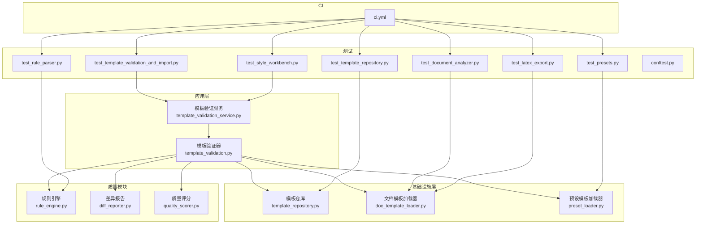

图表来源
- [src/paper_format_corrector/application/services/template_validation_service.py](file://src/paper_format_corrector/application/services/template_validation_service.py)
- [src/paper_format_corrector/application/services/template_validation.py](file://src/paper_format_corrector/application/services/template_validation.py)
- [src/paper_format_corrector/infra/template_repository.py](file://src/paper_format_corrector/infra/template_repository.py)
- [src/paper_format_corrector/infra/doc_template_loader.py](file://src/paper_format_corrector/infra/doc_template_loader.py)
- [src/paper_format_corrector/infra/preset_loader.py](file://src/paper_format_corrector/infra/preset_loader.py)
- [src/paper_format_corrector/quality/rule_engine.py](file://src/paper_format_corrector/quality/rule_engine.py)
- [src/paper_format_corrector/quality/diff_reporter.py](file://src/paper_format_corrector/quality/diff_reporter.py)
- [src/paper_format_corrector/quality/quality_scorer.py](file://src/paper_format_corrector/quality/quality_scorer.py)
- [tests/test_template_validation_and_import.py](file://tests/test_template_validation_and_import.py)
- [tests/test_presets.py](file://tests/test_presets.py)
- [tests/test_template_repository.py](file://tests/test_template_repository.py)
- [tests/test_rule_parser.py](file://tests/test_rule_parser.py)
- [tests/test_document_analyzer.py](file://tests/test_document_analyzer.py)
- [tests/test_latex_export.py](file://tests/test_latex_export.py)
- [tests/test_style_workbench.py](file://tests/test_style_workbench.py)
- [.github/workflows/ci.yml](file://.github/workflows/ci.yml)

章节来源
- [src/paper_format_corrector/application/services/template_validation_service.py](file://src/paper_format_corrector/application/services/template_validation_service.py)
- [src/paper_format_corrector/application/services/template_validation.py](file://src/paper_format_corrector/application/services/template_validation.py)
- [src/paper_format_corrector/infra/template_repository.py](file://src/paper_format_corrector/infra/template_repository.py)
- [src/paper_format_corrector/infra/doc_template_loader.py](file://src/paper_format_corrector/infra/doc_template_loader.py)
- [src/paper_format_corrector/infra/preset_loader.py](file://src/paper_format_corrector/infra/preset_loader.py)
- [src/paper_format_corrector/quality/rule_engine.py](file://src/paper_format_corrector/quality/rule_engine.py)
- [src/paper_format_corrector/quality/diff_reporter.py](file://src/paper_format_corrector/quality/diff_reporter.py)
- [src/paper_format_corrector/quality/quality_scorer.py](file://src/paper_format_corrector/quality/quality_scorer.py)
- [tests/test_template_validation_and_import.py](file://tests/test_template_validation_and_import.py)
- [tests/test_presets.py](file://tests/test_presets.py)
- [tests/test_template_repository.py](file://tests/test_template_repository.py)
- [tests/test_rule_parser.py](file://tests/test_rule_parser.py)
- [tests/test_document_analyzer.py](file://tests/test_document_analyzer.py)
- [tests/test_latex_export.py](file://tests/test_latex_export.py)
- [tests/test_style_workbench.py](file://tests/test_style_workbench.py)
- [.github/workflows/ci.yml](file://.github/workflows/ci.yml)

## 核心组件
- 模板验证服务：负责编排模板验证全流程，协调语法检查、语义验证、兼容性测试与质量评分，并输出结构化报告。
- 模板验证器：实现具体校验逻辑，包括字段存在性、类型约束、引用完整性、版本兼容等。
- 模板仓库：提供模板元数据检索、模板实例化与缓存策略。
- 文档模板加载器：解析 YAML/JSON 模板定义，构建内部模型，支持默认值合并与扩展点注入。
- 预设模板加载器：管理内置模板索引与按需加载，确保模板生态一致性。
- 规则引擎：执行模板质量规则（如段落样式、标题层级、编号规范），产出通过/失败与上下文信息。
- 差异报告：对比期望与实际的模板渲染结果，生成可读的差异摘要。
- 质量评分：对模板进行多维度打分（格式一致性、性能、可维护性、用户体验）。

章节来源
- [src/paper_format_corrector/application/services/template_validation_service.py](file://src/paper_format_corrector/application/services/template_validation_service.py)
- [src/paper_format_corrector/application/services/template_validation.py](file://src/paper_format_corrector/application/services/template_validation.py)
- [src/paper_format_corrector/infra/template_repository.py](file://src/paper_format_corrector/infra/template_repository.py)
- [src/paper_format_corrector/infra/doc_template_loader.py](file://src/paper_format_corrector/infra/doc_template_loader.py)
- [src/paper_format_corrector/infra/preset_loader.py](file://src/paper_format_corrector/infra/preset_loader.py)
- [src/paper_format_corrector/quality/rule_engine.py](file://src/paper_format_corrector/quality/rule_engine.py)
- [src/paper_format_corrector/quality/diff_reporter.py](file://src/paper_format_corrector/quality/diff_reporter.py)
- [src/paper_format_corrector/quality/quality_scorer.py](file://src/paper_format_corrector/quality/quality_scorer.py)

## 架构总览
模板验证与测试的整体流程如下：
- 输入：模板定义（YAML/JSON）、可选的参考文档或期望输出
- 处理：语法检查 → 语义验证 → 兼容性测试 → 规则校验 → 差异比对 → 质量评分
- 输出：验证报告（通过/失败、问题清单、差异摘要、评分）

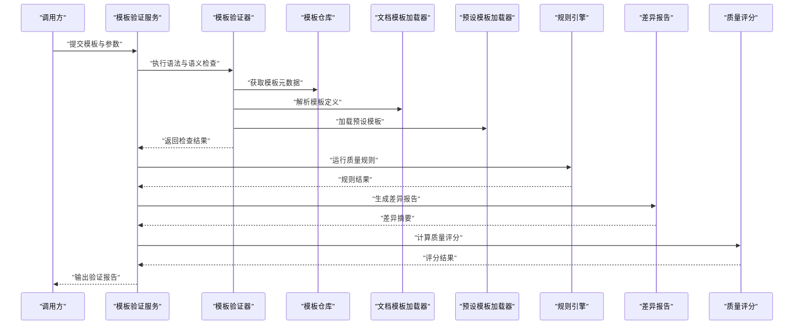

图表来源
- [src/paper_format_corrector/application/services/template_validation_service.py](file://src/paper_format_corrector/application/services/template_validation_service.py)
- [src/paper_format_corrector/application/services/template_validation.py](file://src/paper_format_corrector/application/services/template_validation.py)
- [src/paper_format_corrector/infra/template_repository.py](file://src/paper_format_corrector/infra/template_repository.py)
- [src/paper_format_corrector/infra/doc_template_loader.py](file://src/paper_format_corrector/infra/doc_template_loader.py)
- [src/paper_format_corrector/infra/preset_loader.py](file://src/paper_format_corrector/infra/preset_loader.py)
- [src/paper_format_corrector/quality/rule_engine.py](file://src/paper_format_corrector/quality/rule_engine.py)
- [src/paper_format_corrector/quality/diff_reporter.py](file://src/paper_format_corrector/quality/diff_reporter.py)
- [src/paper_format_corrector/quality/quality_scorer.py](file://src/paper_format_corrector/quality/quality_scorer.py)

## 详细组件分析

### 模板验证服务（Template Validation Service）
职责与流程：
- 接收模板输入与验证参数
- 编排语法检查、语义验证、兼容性测试、规则校验、差异比对与评分
- 汇总并输出结构化报告（包含问题列表、差异摘要、评分与建议）

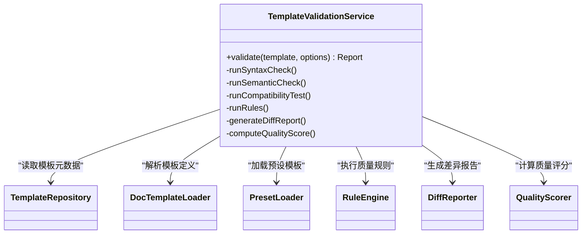

图表来源
- [src/paper_format_corrector/application/services/template_validation_service.py](file://src/paper_format_corrector/application/services/template_validation_service.py)
- [src/paper_format_corrector/infra/template_repository.py](file://src/paper_format_corrector/infra/template_repository.py)
- [src/paper_format_corrector/infra/doc_template_loader.py](file://src/paper_format_corrector/infra/doc_template_loader.py)
- [src/paper_format_corrector/infra/preset_loader.py](file://src/paper_format_corrector/infra/preset_loader.py)
- [src/paper_format_corrector/quality/rule_engine.py](file://src/paper_format_corrector/quality/rule_engine.py)
- [src/paper_format_corrector/quality/diff_reporter.py](file://src/paper_format_corrector/quality/diff_reporter.py)
- [src/paper_format_corrector/quality/quality_scorer.py](file://src/paper_format_corrector/quality/quality_scorer.py)

章节来源
- [src/paper_format_corrector/application/services/template_validation_service.py](file://src/paper_format_corrector/application/services/template_validation_service.py)

### 模板验证器（Template Validator）
职责与流程：
- 语法检查：字段存在性、必填项、类型约束、枚举值合法性
- 语义验证：引用完整性（如样式、编号、交叉引用）、命名冲突、版本兼容
- 兼容性测试：不同目标平台/版本的渲染行为一致性

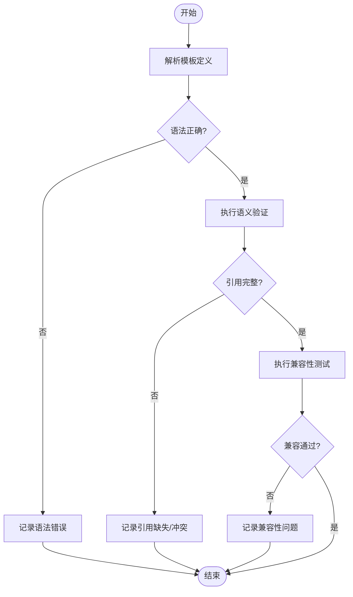

图表来源
- [src/paper_format_corrector/application/services/template_validation.py](file://src/paper_format_corrector/application/services/template_validation.py)
- [src/paper_format_corrector/infra/doc_template_loader.py](file://src/paper_format_corrector/infra/doc_template_loader.py)

章节来源
- [src/paper_format_corrector/application/services/template_validation.py](file://src/paper_format_corrector/application/services/template_validation.py)
- [src/paper_format_corrector/infra/doc_template_loader.py](file://src/paper_format_corrector/infra/doc_template_loader.py)

### 模板仓库（Template Repository）
职责与流程：
- 提供模板索引查询、按名称/标签检索
- 管理模板缓存与更新策略
- 为验证器与加载器提供稳定的模板访问接口

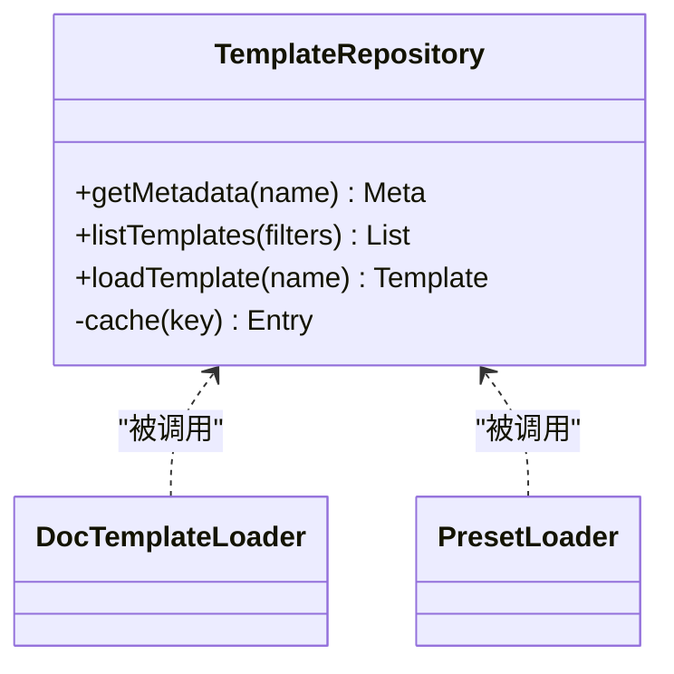

图表来源
- [src/paper_format_corrector/infra/template_repository.py](file://src/paper_format_corrector/infra/template_repository.py)
- [src/paper_format_corrector/infra/doc_template_loader.py](file://src/paper_format_corrector/infra/doc_template_loader.py)
- [src/paper_format_corrector/infra/preset_loader.py](file://src/paper_format_corrector/infra/preset_loader.py)

章节来源
- [src/paper_format_corrector/infra/template_repository.py](file://src/paper_format_corrector/infra/template_repository.py)

### 文档模板加载器（Doc Template Loader）
职责与流程：
- 解析 YAML/JSON 模板定义，构建内部模型
- 合并默认值与扩展点，支持多源模板组合
- 提供模板实例化与快照能力，便于差异比对

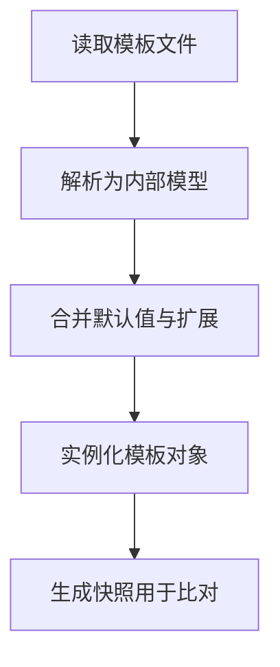

图表来源
- [src/paper_format_corrector/infra/doc_template_loader.py](file://src/paper_format_corrector/infra/doc_template_loader.py)

章节来源
- [src/paper_format_corrector/infra/doc_template_loader.py](file://src/paper_format_corrector/infra/doc_template_loader.py)

### 预设模板加载器（Preset Loader）
职责与流程：
- 管理内置模板索引与分类
- 按需加载预设模板，保证生态一致性
- 提供模板版本与依赖声明

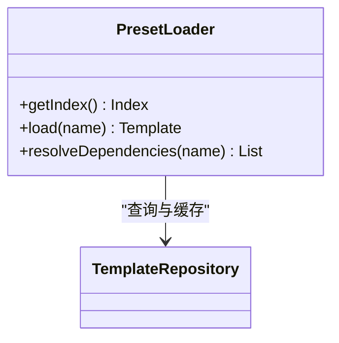

图表来源
- [src/paper_format_corrector/infra/preset_loader.py](file://src/paper_format_corrector/infra/preset_loader.py)
- [src/paper_format_corrector/infra/template_repository.py](file://src/paper_format_corrector/infra/template_repository.py)

章节来源
- [src/paper_format_corrector/infra/preset_loader.py](file://src/paper_format_corrector/infra/preset_loader.py)

### 规则引擎（Rule Engine）
职责与流程：
- 执行模板质量规则（样式、标题层级、编号、交叉引用等）
- 输出通过/失败与上下文信息，便于定位问题
- 支持规则扩展与自定义规则注册

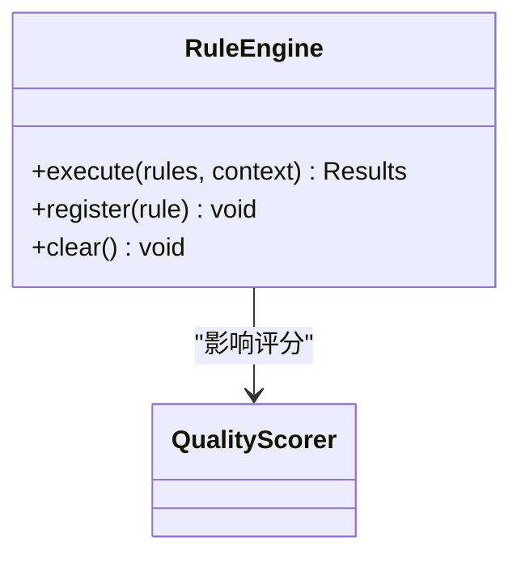

图表来源
- [src/paper_format_corrector/quality/rule_engine.py](file://src/paper_format_corrector/quality/rule_engine.py)
- [src/paper_format_corrector/quality/quality_scorer.py](file://src/paper_format_corrector/quality/quality_scorer.py)

章节来源
- [src/paper_format_corrector/quality/rule_engine.py](file://src/paper_format_corrector/quality/rule_engine.py)

### 差异报告（Diff Reporter）
职责与流程：
- 对比期望与实际的模板渲染结果
- 生成可读的差异摘要，突出关键变更
- 支持多种输出格式（文本、结构化 JSON）

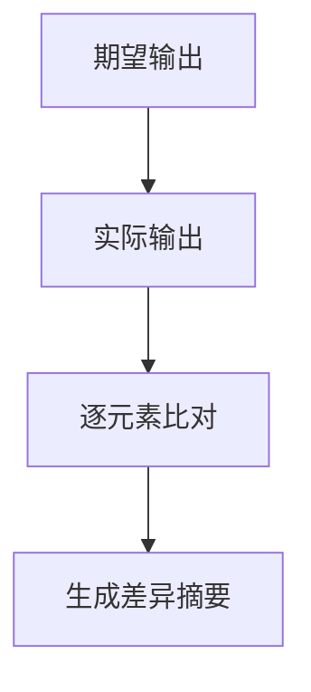

图表来源
- [src/paper_format_corrector/quality/diff_reporter.py](file://src/paper_format_corrector/quality/diff_reporter.py)

章节来源
- [src/paper_format_corrector/quality/diff_reporter.py](file://src/paper_format_corrector/quality/diff_reporter.py)

### 质量评分（Quality Scorer）
职责与流程：
- 对模板进行多维度打分（格式一致性、性能、可维护性、用户体验）
- 结合规则引擎结果与差异报告，给出综合评分与建议

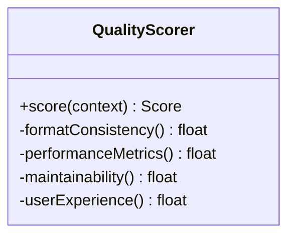

图表来源
- [src/paper_format_corrector/quality/quality_scorer.py](file://src/paper_format_corrector/quality/quality_scorer.py)

章节来源
- [src/paper_format_corrector/quality/quality_scorer.py](file://src/paper_format_corrector/quality/quality_scorer.py)

### 测试套件概览
- 模板验证与导入测试：覆盖模板解析、验证流程、导入导出
- 预设模板测试：验证内置模板索引与加载
- 模板仓库测试：验证元数据检索、缓存与加载
- 规则解析测试：验证规则语法与执行
- 文档分析测试：验证模板在文档层面的表现
- LaTeX 导出测试：验证模板在不同输出格式下的兼容性
- 样式工作台测试：验证样式相关功能与模板交互

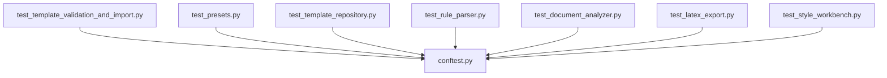

图表来源
- [tests/test_template_validation_and_import.py](file://tests/test_template_validation_and_import.py)
- [tests/test_presets.py](file://tests/test_presets.py)
- [tests/test_template_repository.py](file://tests/test_template_repository.py)
- [tests/test_rule_parser.py](file://tests/test_rule_parser.py)
- [tests/test_document_analyzer.py](file://tests/test_document_analyzer.py)
- [tests/test_latex_export.py](file://tests/test_latex_export.py)
- [tests/test_style_workbench.py](file://tests/test_style_workbench.py)
- [tests/conftest.py](file://tests/conftest.py)

章节来源
- [tests/test_template_validation_and_import.py](file://tests/test_template_validation_and_import.py)
- [tests/test_presets.py](file://tests/test_presets.py)
- [tests/test_template_repository.py](file://tests/test_template_repository.py)
- [tests/test_rule_parser.py](file://tests/test_rule_parser.py)
- [tests/test_document_analyzer.py](file://tests/test_document_analyzer.py)
- [tests/test_latex_export.py](file://tests/test_latex_export.py)
- [tests/test_style_workbench.py](file://tests/test_style_workbench.py)
- [tests/conftest.py](file://tests/conftest.py)

## 依赖关系分析
- 组件耦合：
  - 模板验证服务强依赖验证器、规则引擎、差异报告与质量评分
  - 验证器依赖模板仓库、文档模板加载器与预设模板加载器
  - 质量评分受规则引擎与差异报告影响
- 外部依赖：
  - 配置文件与依赖声明位于 pyproject.toml 与 requirements.txt
  - CI 流水线通过 .github/workflows/ci.yml 触发测试与质量门禁

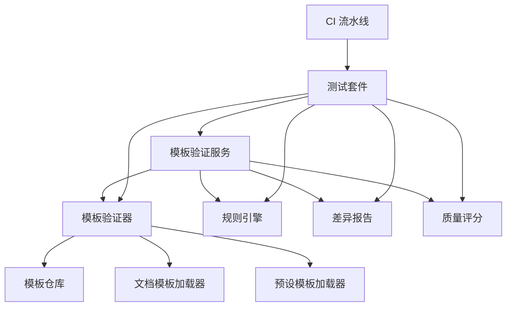

图表来源
- [src/paper_format_corrector/application/services/template_validation_service.py](file://src/paper_format_corrector/application/services/template_validation_service.py)
- [src/paper_format_corrector/application/services/template_validation.py](file://src/paper_format_corrector/application/services/template_validation.py)
- [src/paper_format_corrector/infra/template_repository.py](file://src/paper_format_corrector/infra/template_repository.py)
- [src/paper_format_corrector/infra/doc_template_loader.py](file://src/paper_format_corrector/infra/doc_template_loader.py)
- [src/paper_format_corrector/infra/preset_loader.py](file://src/paper_format_corrector/infra/preset_loader.py)
- [src/paper_format_corrector/quality/rule_engine.py](file://src/paper_format_corrector/quality/rule_engine.py)
- [src/paper_format_corrector/quality/diff_reporter.py](file://src/paper_format_corrector/quality/diff_reporter.py)
- [src/paper_format_corrector/quality/quality_scorer.py](file://src/paper_format_corrector/quality/quality_scorer.py)
- [.github/workflows/ci.yml](file://.github/workflows/ci.yml)

章节来源
- [pyproject.toml](file://pyproject.toml)
- [requirements.txt](file://requirements.txt)
- [.github/workflows/ci.yml](file://.github/workflows/ci.yml)

## 性能考量
- 模板解析与实例化：
  - 避免重复解析：利用模板仓库缓存与增量更新
  - 大模板分块处理：减少内存峰值与解析时间
- 规则执行：
  - 并行执行独立规则：提升吞吐
  - 短路策略：遇到严重错误提前终止，降低无效计算
- 差异比对：
  - 仅比对关键节点：减少比较开销
  - 增量比对：基于上次快照进行差异计算
- 质量评分：
  - 权重可调：根据业务重点调整维度权重
  - 采样评估：对大型文档进行抽样评分，平衡精度与性能

[本节为通用指导，不直接分析具体文件]

## 故障排查指南
- 常见模板错误与修复：
  - 语法错误：字段缺失、类型不符、枚举非法 → 修正模板定义，补充必填项
  - 引用不完整：样式/编号/交叉引用未定义 → 补全引用或移除无效引用
  - 版本不兼容：模板版本与目标平台不一致 → 升级模板或适配目标版本
  - 规则失败：样式层级混乱、编号不规范 → 依据规则引擎提示修正
  - 差异过大：渲染结果与期望偏差显著 → 检查模板分支逻辑与条件渲染
- 调试建议：
  - 启用详细日志：查看解析与执行链路
  - 输出中间快照：定位问题阶段
  - 隔离测试：最小化复现用例，逐步缩小范围

章节来源
- [src/paper_format_corrector/application/services/template_validation.py](file://src/paper_format_corrector/application/services/template_validation.py)
- [src/paper_format_corrector/quality/rule_engine.py](file://src/paper_format_corrector/quality/rule_engine.py)
- [src/paper_format_corrector/quality/diff_reporter.py](file://src/paper_format_corrector/quality/diff_reporter.py)

## 结论
本项目的模板验证与测试体系以“服务编排 + 模块化组件 + 全面测试 + CI 门禁”为核心，形成从语法到语义、从规则到质量的闭环。通过清晰的职责划分与可扩展的规则/评分机制，既能保障模板正确性与稳定性，又能持续提升模板质量与用户体验。建议在团队内推广标准化模板开发流程，并将质量门禁纳入日常开发实践。

[本节为总结性内容，不直接分析具体文件]

## 附录
- 快速上手：
  - 安装依赖：参考 requirements.txt 与 pyproject.toml
  - 运行测试：使用测试框架执行 tests 目录下的用例
  - 配置 CI：参考 .github/workflows/ci.yml 设置流水线
- 最佳实践：
  - 模板设计遵循最小必要原则，避免过度复杂
  - 规则与评分权重随业务演进定期评审
  - 差异报告作为回归基准，纳入版本发布流程

[本节为通用指导，不直接分析具体文件]