# 自定义模板开发

<cite>
**本文引用的文件**   
- [README.md](file://README.md)
- [pyproject.toml](file://pyproject.toml)
- [requirements.txt](file://requirements.txt)
- [run.py](file://run.py)
- [src/paper_format_corrector/app.py](file://src/paper_format_corrector/app.py)
- [src/paper_format_corrector/cli.py](file://src/paper_format_corrector/cli.py)
- [src/paper_format_corrector/core/format_corrector.py](file://src/paper_format_corrector/core/format_corrector.py)
- [src/paper_format_corrector/infra/template_repository.py](file://src/paper_format_corrector/infra/template_repository.py)
- [src/paper_format_corrector/infra/doc_template_loader.py](file://src/paper_format_corrector/infra/doc_template_loader.py)
- [src/paper_format_corrector/application/services/template_validation_service.py](file://src/paper_format_corrector/application/services/template_validation_service.py)
- [src/paper_format_corrector/application/services/style_workbench.py](file://src/paper_format_corrector/application/services/style_workbench.py)
- [src/paper_format_corrector/handlers/header_footer_handler.py](file://src/paper_format_corrector/handlers/header_footer_handler.py)
- [src/paper_format_corrector/handlers/toc_handler.py](file://src/paper_format_corrector/handlers/toc_handler.py)
- [src/paper_format_corrector/handlers/figure_table_handler.py](file://src/paper_format_corrector/handlers/figure_table_handler.py)
- [src/paper_format_corrector/handlers/table_handler.py](file://src/paper_format_corrector/handlers/table_handler.py)
- [src/paper_format_corrector/generators/cover_page_generator.py](file://src/paper_format_corrector/generators/cover_page_generator.py)
- [src/paper_format_corrector/generators/doc_generator.py](file://src/paper_format_corrector/generators/doc_generator.py)
- [src/paper_format_corrector/infrastructure/parsers/rule_parser.py](file://src/paper_format_corrector/infrastructure/parsers/rule_parser.py)
- [src/paper_format_corrector/infrastructure/parsers/reference_formatter.py](file://src/paper_format_corrector/infrastructure/parsers/reference_formatter.py)
- [src/paper_format_corrector/infrastructure/parsers/cross_reference.py](file://src/paper_format_corrector/infrastructure/parsers/cross_reference.py)
- [src/paper_format_corrector/infrastructure/parsers/document_analyzer.py](file://src/paper_format_corrector/infrastructure/parsers/document_analyzer.py)
- [src/paper_format_corrector/infrastructure/parsers/section_types.py](file://src/paper_format_corrector/infrastructure/parsers/section_types.py)
- [src/paper_format_corrector/infrastructure/parsers/modules/numbering_module.py](file://src/paper_format_corrector/infrastructure/parsers/modules/numbering_module.py)
- [src/paper_format_corrector/infrastructure/parsers/modules/styles_module.py](file://src/paper_format_corrector/infrastructure/parsers/modules/styles_module.py)
- [src/paper_format_corrector/infrastructure/parsers/modules/paragraph_module.py](file://src/paper_format_corrector/infrastructure/parsers/modules/paragraph_module.py)
- [src/paper_format_corrector/infrastructure/parsers/modules/chapter_heading_module.py](file://src/paper_format_corrector/infrastructure/parsers/modules/chapter_heading_module.py)
- [src/paper_format_corrector/quality/rule_engine.py](file://src/paper_format_corrector/quality/rule_engine.py)
- [src/paper_format_corrector/shared/utils/logger.py](file://src/paper_format_corrector/shared/utils/logger.py)
- [presets/templates_index.yaml](file://presets/templates_index.yaml)
- [presets/academic_paper.yaml](file://presets/academic_paper.yaml)
- [presets/chinese_thesis.yaml](file://presets/chinese_thesis.yaml)
- [examples/sample_template.yaml](file://examples/sample_template.yaml)
- [docs/template_guide.md](file://docs/template_guide.md)
- [tests/test_template_validation_and_import.py](file://tests/test_template_validation_and_import.py)
</cite>

## 目录
1. [简介](#简介)
2. [项目结构](#项目结构)
3. [核心组件](#核心组件)
4. [架构总览](#架构总览)
5. [详细组件分析](#详细组件分析)
6. [依赖分析](#依赖分析)
7. [性能考虑](#性能考虑)
8. [故障排查指南](#故障排查指南)
9. [结论](#结论)
10. [附录](#附录)

## 简介
本指南面向希望为“论文格式矫正工具”开发自定义模板的开发者。内容覆盖从环境搭建、模板结构设计、规则编写到测试验证的完整工作流；详细说明YAML配置语法（文档结构定义、样式规则、段落格式、图表编号与引用格式）；展示条件逻辑、变量替换与模板继承的实现方式；提供常见格式化需求的示例路径；并包含调试工具使用、错误诊断技巧，以及模板打包、分发与版本管理的最佳实践。

## 项目结构
本项目采用分层与模块化组织：应用层负责编排流程，领域层定义实体与事件，基础设施层实现解析器、处理器、生成器与模板仓库等能力，接口层暴露CLI/API/Web入口。模板相关能力集中在基础设施与应用服务中，并通过预置模板与示例模板提供可参考的结构。

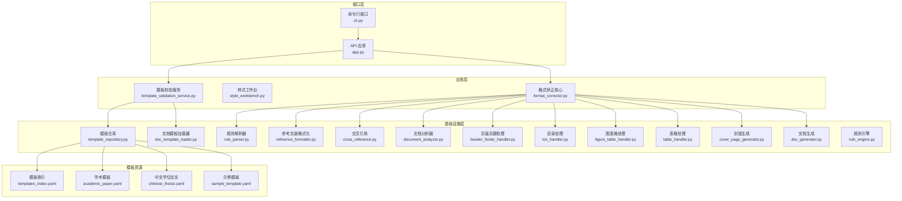

图示来源
- [src/paper_format_corrector/cli.py](file://src/paper_format_corrector/cli.py)
- [src/paper_format_corrector/app.py](file://src/paper_format_corrector/app.py)
- [src/paper_format_corrector/application/services/template_validation_service.py](file://src/paper_format_corrector/application/services/template_validation_service.py)
- [src/paper_format_corrector/core/format_corrector.py](file://src/paper_format_corrector/core/format_corrector.py)
- [src/paper_format_corrector/infra/template_repository.py](file://src/paper_format_corrector/infra/template_repository.py)
- [src/paper_format_corrector/infra/doc_template_loader.py](file://src/paper_format_corrector/infra/doc_template_loader.py)
- [src/paper_format_corrector/infrastructure/parsers/rule_parser.py](file://src/paper_format_corrector/infrastructure/parsers/rule_parser.py)
- [src/paper_format_corrector/infrastructure/parsers/reference_formatter.py](file://src/paper_format_corrector/infrastructure/parsers/reference_formatter.py)
- [src/paper_format_corrector/infrastructure/parsers/cross_reference.py](file://src/paper_format_corrector/infrastructure/parsers/cross_reference.py)
- [src/paper_format_corrector/infrastructure/parsers/document_analyzer.py](file://src/paper_format_corrector/infrastructure/parsers/document_analyzer.py)
- [src/paper_format_corrector/handlers/header_footer_handler.py](file://src/paper_format_corrector/handlers/header_footer_handler.py)
- [src/paper_format_corrector/handlers/toc_handler.py](file://src/paper_format_corrector/handlers/toc_handler.py)
- [src/paper_format_corrector/handlers/figure_table_handler.py](file://src/paper_format_corrector/handlers/figure_table_handler.py)
- [src/paper_format_corrector/handlers/table_handler.py](file://src/paper_format_corrector/handlers/table_handler.py)
- [src/paper_format_corrector/generators/cover_page_generator.py](file://src/paper_format_corrector/generators/cover_page_generator.py)
- [src/paper_format_corrector/generators/doc_generator.py](file://src/paper_format_corrector/generators/doc_generator.py)
- [presets/templates_index.yaml](file://presets/templates_index.yaml)
- [presets/academic_paper.yaml](file://presets/academic_paper.yaml)
- [presets/chinese_thesis.yaml](file://presets/chinese_thesis.yaml)
- [examples/sample_template.yaml](file://examples/sample_template.yaml)

章节来源
- [README.md](file://README.md)
- [pyproject.toml](file://pyproject.toml)
- [requirements.txt](file://requirements.txt)
- [run.py](file://run.py)

## 核心组件
- 模板仓库与加载器：负责发现、加载、缓存与合并模板资源，支持多源（本地预设、用户目录、远程仓库）。
- 模板校验服务：对模板进行结构与语义校验，返回结构化错误信息，便于定位问题。
- 规则解析器与规则引擎：将YAML中的规则转换为内部模型，并在文档处理时执行。
- 文档分析器与处理器：识别章节、段落、表格、图片、页眉页脚、目录等元素，按模板规则进行格式化。
- 生成器：根据模板与处理结果生成最终文档（含封面、正文、目录等）。
- 样式工作台：提供样式预览、对比与批量应用的能力，辅助模板开发与调试。

章节来源
- [src/paper_format_corrector/infra/template_repository.py](file://src/paper_format_corrector/infra/template_repository.py)
- [src/paper_format_corrector/infra/doc_template_loader.py](file://src/paper_format_corrector/infra/doc_template_loader.py)
- [src/paper_format_corrector/application/services/template_validation_service.py](file://src/paper_format_corrector/application/services/template_validation_service.py)
- [src/paper_format_corrector/infrastructure/parsers/rule_parser.py](file://src/paper_format_corrector/infrastructure/parsers/rule_parser.py)
- [src/paper_format_corrector/quality/rule_engine.py](file://src/paper_format_corrector/quality/rule_engine.py)
- [src/paper_format_corrector/infrastructure/parsers/document_analyzer.py](file://src/paper_format_corrector/infrastructure/parsers/document_analyzer.py)
- [src/paper_format_corrector/handlers/header_footer_handler.py](file://src/paper_format_corrector/handlers/header_footer_handler.py)
- [src/paper_format_corrector/handlers/toc_handler.py](file://src/paper_format_corrector/handlers/toc_handler.py)
- [src/paper_format_corrector/handlers/figure_table_handler.py](file://src/paper_format_corrector/handlers/figure_table_handler.py)
- [src/paper_format_corrector/handlers/table_handler.py](file://src/paper_format_corrector/handlers/table_handler.py)
- [src/paper_format_corrector/generators/cover_page_generator.py](file://src/paper_format_corrector/generators/cover_page_generator.py)
- [src/paper_format_corrector/generators/doc_generator.py](file://src/paper_format_corrector/generators/doc_generator.py)
- [src/paper_format_corrector/application/services/style_workbench.py](file://src/paper_format_corrector/application/services/style_workbench.py)

## 架构总览
下图展示了模板驱动的一次典型格式化流程：从模板加载、规则解析、文档分析、元素处理到最终生成。

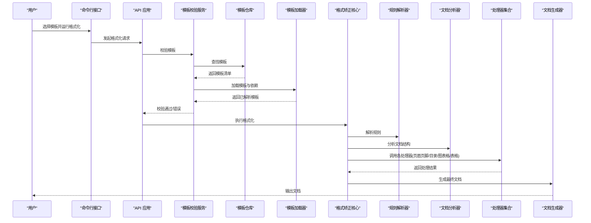

图示来源
- [src/paper_format_corrector/cli.py](file://src/paper_format_corrector/cli.py)
- [src/paper_format_corrector/app.py](file://src/paper_format_corrector/app.py)
- [src/paper_format_corrector/application/services/template_validation_service.py](file://src/paper_format_corrector/application/services/template_validation_service.py)
- [src/paper_format_corrector/infra/template_repository.py](file://src/paper_format_corrector/infra/template_repository.py)
- [src/paper_format_corrector/infra/doc_template_loader.py](file://src/paper_format_corrector/infra/doc_template_loader.py)
- [src/paper_format_corrector/core/format_corrector.py](file://src/paper_format_corrector/core/format_corrector.py)
- [src/paper_format_corrector/infrastructure/parsers/rule_parser.py](file://src/paper_format_corrector/infrastructure/parsers/rule_parser.py)
- [src/paper_format_corrector/infrastructure/parsers/document_analyzer.py](file://src/paper_format_corrector/infrastructure/parsers/document_analyzer.py)
- [src/paper_format_corrector/handlers/header_footer_handler.py](file://src/paper_format_corrector/handlers/header_footer_handler.py)
- [src/paper_format_corrector/handlers/toc_handler.py](file://src/paper_format_corrector/handlers/toc_handler.py)
- [src/paper_format_corrector/handlers/figure_table_handler.py](file://src/paper_format_corrector/handlers/figure_table_handler.py)
- [src/paper_format_corrector/handlers/table_handler.py](file://src/paper_format_corrector/handlers/table_handler.py)
- [src/paper_format_corrector/generators/doc_generator.py](file://src/paper_format_corrector/generators/doc_generator.py)

## 详细组件分析

### 模板仓库与加载器
- 职责：发现模板（内置预设、用户目录、远程），加载并合并模板树，维护版本与依赖关系。
- 关键点：
  - 模板索引用于快速检索可用模板。
  - 加载器负责解析YAML、合并继承链、注入变量与条件分支。
  - 缓存策略避免重复IO与解析开销。

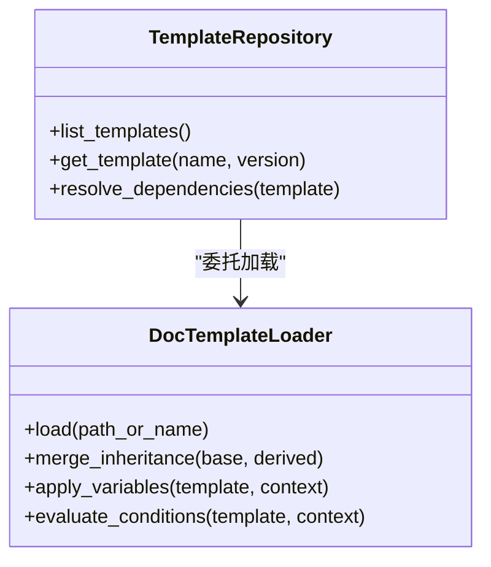

图示来源
- [src/paper_format_corrector/infra/template_repository.py](file://src/paper_format_corrector/infra/template_repository.py)
- [src/paper_format_corrector/infra/doc_template_loader.py](file://src/paper_format_corrector/infra/doc_template_loader.py)

章节来源
- [presets/templates_index.yaml](file://presets/templates_index.yaml)
- [presets/academic_paper.yaml](file://presets/academic_paper.yaml)
- [presets/chinese_thesis.yaml](file://presets/chinese_thesis.yaml)
- [examples/sample_template.yaml](file://examples/sample_template.yaml)

### 模板校验服务
- 职责：在运行前对模板进行结构与语义校验，包括必填字段、类型约束、依赖完整性、规则合法性等。
- 输出：结构化错误列表，便于定位具体键值与位置。

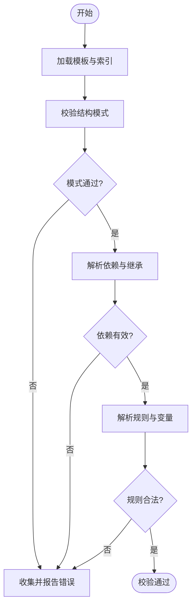

图示来源
- [src/paper_format_corrector/application/services/template_validation_service.py](file://src/paper_format_corrector/application/services/template_validation_service.py)
- [src/paper_format_corrector/infra/template_repository.py](file://src/paper_format_corrector/infra/template_repository.py)
- [src/paper_format_corrector/infra/doc_template_loader.py](file://src/paper_format_corrector/infra/doc_template_loader.py)

章节来源
- [src/paper_format_corrector/application/services/template_validation_service.py](file://src/paper_format_corrector/application/services/template_validation_service.py)
- [tests/test_template_validation_and_import.py](file://tests/test_template_validation_and_import.py)

### 规则解析器与规则引擎
- 规则解析器：将YAML中的规则描述转换为内部对象模型，支持条件、变量、作用域限定。
- 规则引擎：在文档处理阶段按优先级与顺序执行规则，更新文档元素属性。

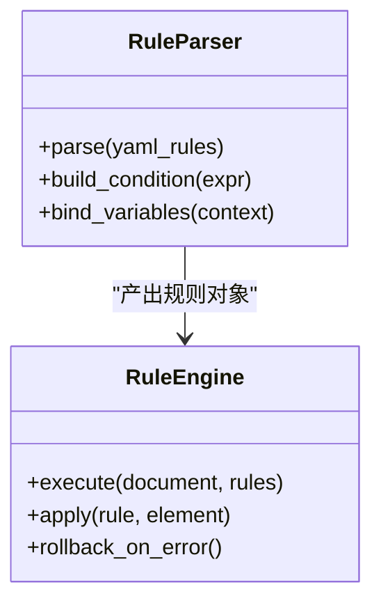

图示来源
- [src/paper_format_corrector/infrastructure/parsers/rule_parser.py](file://src/paper_format_corrector/infrastructure/parsers/rule_parser.py)
- [src/paper_format_corrector/quality/rule_engine.py](file://src/paper_format_corrector/quality/rule_engine.py)

章节来源
- [src/paper_format_corrector/infrastructure/parsers/rule_parser.py](file://src/paper_format_corrector/infrastructure/parsers/rule_parser.py)
- [src/paper_format_corrector/quality/rule_engine.py](file://src/paper_format_corrector/quality/rule_engine.py)

### 文档分析与处理器
- 文档分析器：识别章节、段落、表格、图片、页眉页脚、目录等结构。
- 处理器：针对特定元素执行模板规则，如设置标题样式、插入页眉页脚、生成目录、规范图表格编号等。

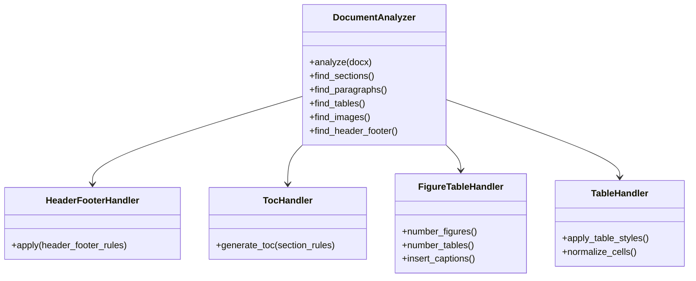

图示来源
- [src/paper_format_corrector/infrastructure/parsers/document_analyzer.py](file://src/paper_format_corrector/infrastructure/parsers/document_analyzer.py)
- [src/paper_format_corrector/handlers/header_footer_handler.py](file://src/paper_format_corrector/handlers/header_footer_handler.py)
- [src/paper_format_corrector/handlers/toc_handler.py](file://src/paper_format_corrector/handlers/toc_handler.py)
- [src/paper_format_corrector/handlers/figure_table_handler.py](file://src/paper_format_corrector/handlers/figure_table_handler.py)
- [src/paper_format_corrector/handlers/table_handler.py](file://src/paper_format_corrector/handlers/table_handler.py)

章节来源
- [src/paper_format_corrector/infrastructure/parsers/document_analyzer.py](file://src/paper_format_corrector/infrastructure/parsers/document_analyzer.py)
- [src/paper_format_corrector/handlers/header_footer_handler.py](file://src/paper_format_corrector/handlers/header_footer_handler.py)
- [src/paper_format_corrector/handlers/toc_handler.py](file://src/paper_format_corrector/handlers/toc_handler.py)
- [src/paper_format_corrector/handlers/figure_table_handler.py](file://src/paper_format_corrector/handlers/figure_table_handler.py)
- [src/paper_format_corrector/handlers/table_handler.py](file://src/paper_format_corrector/handlers/table_handler.py)

### 生成器
- 封面生成器：依据模板配置生成封面页（标题、作者、单位、日期等）。
- 文档生成器：整合各处理器结果，输出最终文档。

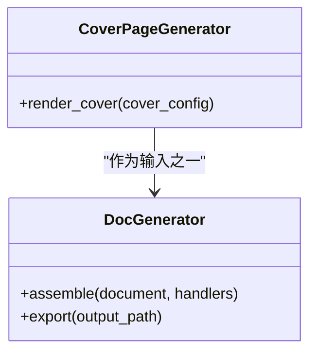

图示来源
- [src/paper_format_corrector/generators/cover_page_generator.py](file://src/paper_format_corrector/generators/cover_page_generator.py)
- [src/paper_format_corrector/generators/doc_generator.py](file://src/paper_format_corrector/generators/doc_generator.py)

章节来源
- [src/paper_format_corrector/generators/cover_page_generator.py](file://src/paper_format_corrector/generators/cover_page_generator.py)
- [src/paper_format_corrector/generators/doc_generator.py](file://src/paper_format_corrector/generators/doc_generator.py)

### 参考文献与交叉引用
- 参考文献格式化：根据模板定义的引用样式生成标准条目。
- 交叉引用：在正文中插入或更新对图表、公式、章节的引用。

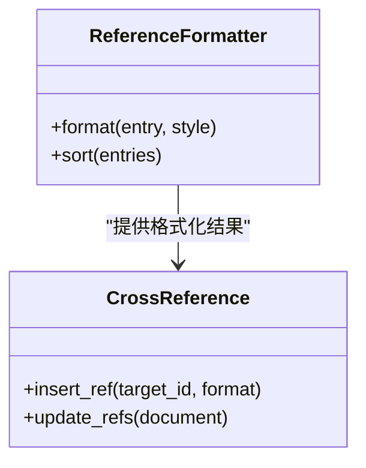

图示来源
- [src/paper_format_corrector/infrastructure/parsers/reference_formatter.py](file://src/paper_format_corrector/infrastructure/parsers/reference_formatter.py)
- [src/paper_format_corrector/infrastructure/parsers/cross_reference.py](file://src/paper_format_corrector/infrastructure/parsers/cross_reference.py)

章节来源
- [src/paper_format_corrector/infrastructure/parsers/reference_formatter.py](file://src/paper_format_corrector/infrastructure/parsers/reference_formatter.py)
- [src/paper_format_corrector/infrastructure/parsers/cross_reference.py](file://src/paper_format_corrector/infrastructure/parsers/cross_reference.py)

### 模块系统（编号、样式、段落、章节标题）
- 编号模块：管理章节、图、表、公式等编号规则与层级。
- 样式模块：定义字符与段落样式，支持继承与覆盖。
- 段落模块：控制缩进、行距、对齐、段前后间距等。
- 章节标题模块：识别标题级别并应用对应样式与编号。

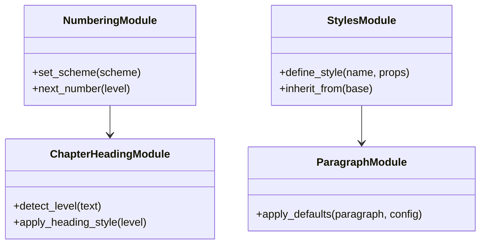

图示来源
- [src/paper_format_corrector/infrastructure/parsers/modules/numbering_module.py](file://src/paper_format_corrector/infrastructure/parsers/modules/numbering_module.py)
- [src/paper_format_corrector/infrastructure/parsers/modules/styles_module.py](file://src/paper_format_corrector/infrastructure/parsers/modules/styles_module.py)
- [src/paper_format_corrector/infrastructure/parsers/modules/paragraph_module.py](file://src/paper_format_corrector/infrastructure/parsers/modules/paragraph_module.py)
- [src/paper_format_corrector/infrastructure/parsers/modules/chapter_heading_module.py](file://src/paper_format_corrector/infrastructure/parsers/modules/chapter_heading_module.py)

章节来源
- [src/paper_format_corrector/infrastructure/parsers/modules/numbering_module.py](file://src/paper_format_corrector/infrastructure/parsers/modules/numbering_module.py)
- [src/paper_format_corrector/infrastructure/parsers/modules/styles_module.py](file://src/paper_format_corrector/infrastructure/parsers/modules/styles_module.py)
- [src/paper_format_corrector/infrastructure/parsers/modules/paragraph_module.py](file://src/paper_format_corrector/infrastructure/parsers/modules/paragraph_module.py)
- [src/paper_format_corrector/infrastructure/parsers/modules/chapter_heading_module.py](file://src/paper_format_corrector/infrastructure/parsers/modules/chapter_heading_module.py)

### YAML 配置语法规范
- 文档结构定义：顶层键通常包括元数据、模板继承链、变量定义、规则集、模块开关等。
- 样式规则配置：字符样式与段落样式的名称、继承关系、字体、颜色、对齐、缩进、行距等。
- 段落格式设置：默认段落属性、特殊段落（如摘要、致谢）的覆盖规则。
- 图表编号规则：编号方案、层级、分隔符、是否跨节重置等。
- 引用格式定制：参考文献样式、排序规则、入文引用标记格式。
- 条件逻辑与变量替换：在规则中使用条件表达式与上下文变量，实现不同场景下的差异化渲染。
- 模板继承：通过继承链复用基础模板，仅覆盖差异部分。

建议参考以下示例与预置模板以理解键名与结构：
- 示例模板：[examples/sample_template.yaml](file://examples/sample_template.yaml)
- 学术模板：[presets/academic_paper.yaml](file://presets/academic_paper.yaml)
- 中文学位论文模板：[presets/chinese_thesis.yaml](file://presets/chinese_thesis.yaml)
- 模板索引：[presets/templates_index.yaml](file://presets/templates_index.yaml)

章节来源
- [examples/sample_template.yaml](file://examples/sample_template.yaml)
- [presets/academic_paper.yaml](file://presets/academic_paper.yaml)
- [presets/chinese_thesis.yaml](file://presets/chinese_thesis.yaml)
- [presets/templates_index.yaml](file://presets/templates_index.yaml)

### 常见格式化需求示例路径
- 章节标题样式：参考章节标题模块与样式模块的使用方式。
  - [chapter_heading_module.py](file://src/paper_format_corrector/infrastructure/parsers/modules/chapter_heading_module.py)
  - [styles_module.py](file://src/paper_format_corrector/infrastructure/parsers/modules/styles_module.py)
- 参考文献格式：参考参考文献格式化器与规则解析器。
  - [reference_formatter.py](file://src/paper_format_corrector/infrastructure/parsers/reference_formatter.py)
  - [rule_parser.py](file://src/paper_format_corrector/infrastructure/parsers/rule_parser.py)
- 页眉页脚设置：参考页眉页脚处理器。
  - [header_footer_handler.py](file://src/paper_format_corrector/handlers/header_footer_handler.py)
- 目录生成：参考目录处理器。
  - [toc_handler.py](file://src/paper_format_corrector/handlers/toc_handler.py)
- 图表格编号与题注：参考图表格处理器与编号模块。
  - [figure_table_handler.py](file://src/paper_format_corrector/handlers/figure_table_handler.py)
  - [numbering_module.py](file://src/paper_format_corrector/infrastructure/parsers/modules/numbering_module.py)
- 表格样式与单元格规范化：参考表格处理器。
  - [table_handler.py](file://src/paper_format_corrector/handlers/table_handler.py)

章节来源
- [src/paper_format_corrector/infrastructure/parsers/modules/chapter_heading_module.py](file://src/paper_format_corrector/infrastructure/parsers/modules/chapter_heading_module.py)
- [src/paper_format_corrector/infrastructure/parsers/modules/styles_module.py](file://src/paper_format_corrector/infrastructure/parsers/modules/styles_module.py)
- [src/paper_format_corrector/infrastructure/parsers/reference_formatter.py](file://src/paper_format_corrector/infrastructure/parsers/reference_formatter.py)
- [src/paper_format_corrector/infrastructure/parsers/rule_parser.py](file://src/paper_format_corrector/infrastructure/parsers/rule_parser.py)
- [src/paper_format_corrector/handlers/header_footer_handler.py](file://src/paper_format_corrector/handlers/header_footer_handler.py)
- [src/paper_format_corrector/handlers/toc_handler.py](file://src/paper_format_corrector/handlers/toc_handler.py)
- [src/paper_format_corrector/handlers/figure_table_handler.py](file://src/paper_format_corrector/handlers/figure_table_handler.py)
- [src/paper_format_corrector/infrastructure/parsers/modules/numbering_module.py](file://src/paper_format_corrector/infrastructure/parsers/modules/numbering_module.py)
- [src/paper_format_corrector/handlers/table_handler.py](file://src/paper_format_corrector/handlers/table_handler.py)

### 条件逻辑、变量替换与模板继承
- 条件逻辑：在规则中使用条件表达式，基于上下文（如文档类型、语言、学校要求）动态启用或禁用某些规则。
- 变量替换：在模板中定义变量，并在运行时由上下文注入（如作者、机构、年份），用于标题、页眉页脚、封面等。
- 模板继承：通过继承链组合多个模板，子模板仅覆盖差异，减少重复配置。

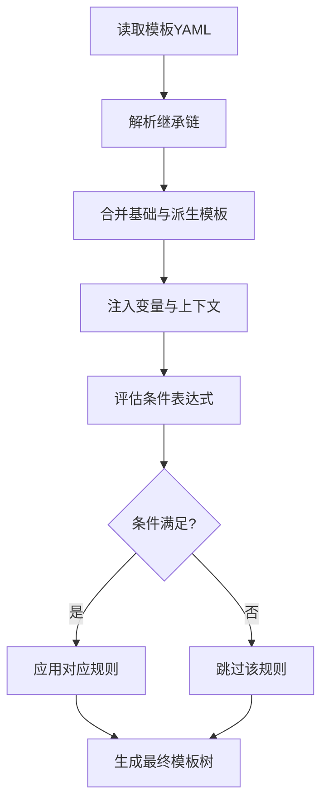

图示来源
- [src/paper_format_corrector/infra/doc_template_loader.py](file://src/paper_format_corrector/infra/doc_template_loader.py)
- [src/paper_format_corrector/infra/template_repository.py](file://src/paper_format_corrector/infra/template_repository.py)
- [src/paper_format_corrector/infrastructure/parsers/rule_parser.py](file://src/paper_format_corrector/infrastructure/parsers/rule_parser.py)

章节来源
- [src/paper_format_corrector/infra/doc_template_loader.py](file://src/paper_format_corrector/infra/doc_template_loader.py)
- [src/paper_format_corrector/infra/template_repository.py](file://src/paper_format_corrector/infra/template_repository.py)
- [src/paper_format_corrector/infrastructure/parsers/rule_parser.py](file://src/paper_format_corrector/infrastructure/parsers/rule_parser.py)

## 依赖分析
- 外部依赖：Python 包管理与依赖声明位于项目根目录。
- 内部依赖：应用层依赖基础设施层的解析器、处理器与生成器；模板仓库与加载器为上层服务提供模板能力。

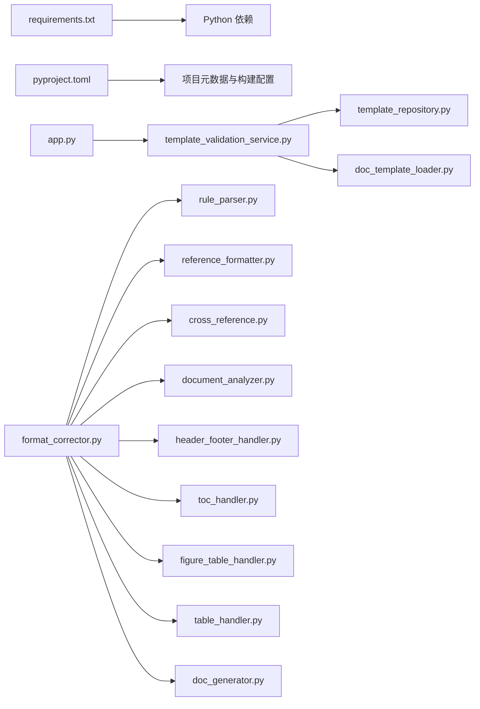

图示来源
- [requirements.txt](file://requirements.txt)
- [pyproject.toml](file://pyproject.toml)
- [src/paper_format_corrector/app.py](file://src/paper_format_corrector/app.py)
- [src/paper_format_corrector/application/services/template_validation_service.py](file://src/paper_format_corrector/application/services/template_validation_service.py)
- [src/paper_format_corrector/infra/template_repository.py](file://src/paper_format_corrector/infra/template_repository.py)
- [src/paper_format_corrector/infra/doc_template_loader.py](file://src/paper_format_corrector/infra/doc_template_loader.py)
- [src/paper_format_corrector/core/format_corrector.py](file://src/paper_format_corrector/core/format_corrector.py)
- [src/paper_format_corrector/infrastructure/parsers/rule_parser.py](file://src/paper_format_corrector/infrastructure/parsers/rule_parser.py)
- [src/paper_format_corrector/infrastructure/parsers/reference_formatter.py](file://src/paper_format_corrector/infrastructure/parsers/reference_formatter.py)
- [src/paper_format_corrector/infrastructure/parsers/cross_reference.py](file://src/paper_format_corrector/infrastructure/parsers/cross_reference.py)
- [src/paper_format_corrector/infrastructure/parsers/document_analyzer.py](file://src/paper_format_corrector/infrastructure/parsers/document_analyzer.py)
- [src/paper_format_corrector/handlers/header_footer_handler.py](file://src/paper_format_corrector/handlers/header_footer_handler.py)
- [src/paper_format_corrector/handlers/toc_handler.py](file://src/paper_format_corrector/handlers/toc_handler.py)
- [src/paper_format_corrector/handlers/figure_table_handler.py](file://src/paper_format_corrector/handlers/figure_table_handler.py)
- [src/paper_format_corrector/handlers/table_handler.py](file://src/paper_format_corrector/handlers/table_handler.py)
- [src/paper_format_corrector/generators/doc_generator.py](file://src/paper_format_corrector/generators/doc_generator.py)

章节来源
- [requirements.txt](file://requirements.txt)
- [pyproject.toml](file://pyproject.toml)

## 性能考虑
- 模板缓存：对模板解析结果与依赖树进行缓存，避免重复IO与解析。
- 增量处理：对文档元素进行懒加载与按需处理，减少内存占用。
- 规则批处理：将同类规则合并执行，降低多次遍历文档的开销。
- 并行化：对独立处理器（如表格、图片）进行并发处理，提升吞吐。
- 日志与监控：记录关键耗时点，便于定位瓶颈。

## 故障排查指南
- 模板校验失败：查看模板校验服务的错误列表，定位缺失字段或类型不匹配。
- 规则解析异常：检查规则语法与作用域，确认变量与条件表达式正确。
- 元素未生效：确认处理器是否被注册且规则命中，必要时开启调试日志。
- 依赖缺失：检查模板索引与依赖声明，确保所有必要模板存在并可加载。
- 常见问题：
  - 变量未注入：确认上下文是否正确传递。
  - 条件分支未触发：检查条件表达式与上下文值。
  - 编号错乱：核对编号方案与层级设置。

章节来源
- [src/paper_format_corrector/application/services/template_validation_service.py](file://src/paper_format_corrector/application/services/template_validation_service.py)
- [src/paper_format_corrector/infrastructure/parsers/rule_parser.py](file://src/paper_format_corrector/infrastructure/parsers/rule_parser.py)
- [src/paper_format_corrector/shared/utils/logger.py](file://src/paper_format_corrector/shared/utils/logger.py)
- [tests/test_template_validation_and_import.py](file://tests/test_template_validation_and_import.py)

## 结论
通过本指南，开发者可以系统地掌握自定义模板的开发方法：从环境与依赖准备、模板结构与YAML语法、规则与处理器编写，到测试验证与调试排障。结合模板仓库与加载器的能力，可实现灵活的模板继承、条件逻辑与变量替换，满足不同场景的格式化需求。遵循打包、分发与版本管理的最佳实践，有助于团队协作与长期维护。

## 附录
- 快速上手：
  - 安装依赖：参考项目根目录的依赖声明与构建配置。
    - [requirements.txt](file://requirements.txt)
    - [pyproject.toml](file://pyproject.toml)
  - 运行入口：
    - [run.py](file://run.py)
    - [src/paper_format_corrector/cli.py](file://src/paper_format_corrector/cli.py)
    - [src/paper_format_corrector/app.py](file://src/paper_format_corrector/app.py)
- 模板示例与预置：
  - [examples/sample_template.yaml](file://examples/sample_template.yaml)
  - [presets/academic_paper.yaml](file://presets/academic_paper.yaml)
  - [presets/chinese_thesis.yaml](file://presets/chinese_thesis.yaml)
  - [presets/templates_index.yaml](file://presets/templates_index.yaml)
- 文档与指南：
  - [docs/template_guide.md](file://docs/template_guide.md)
  - [README.md](file://README.md)