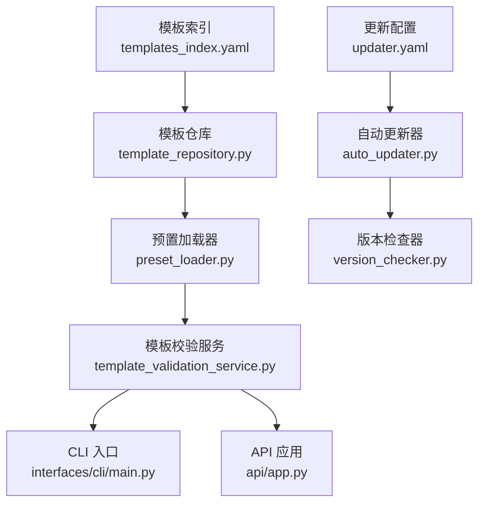
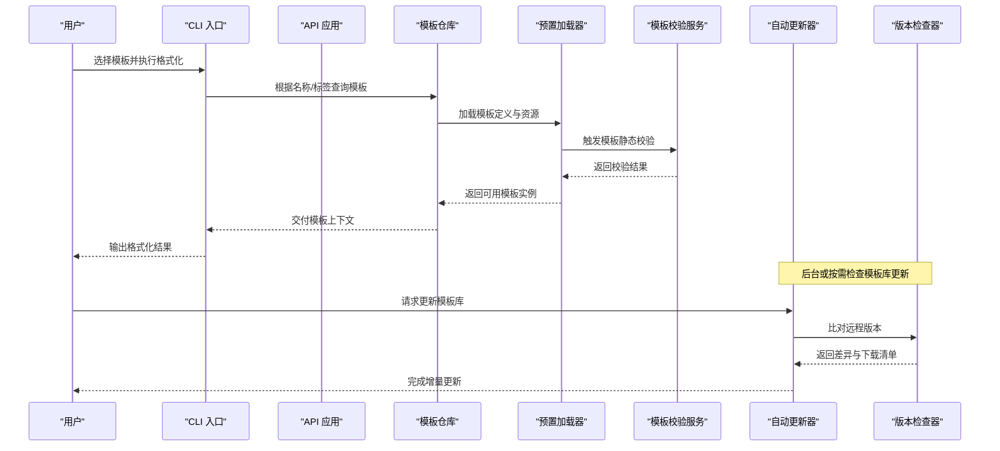
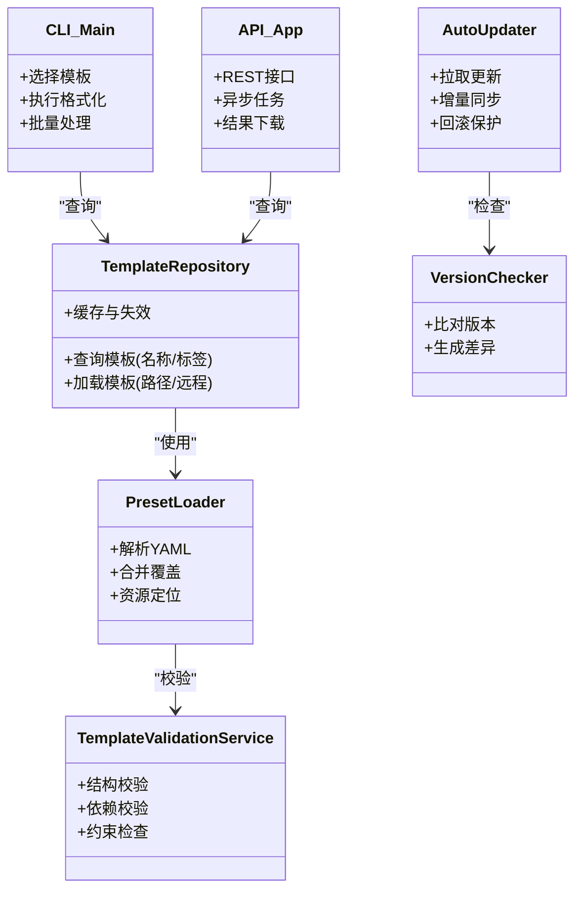

# 预设格式模板

<cite>
**本文引用的文件**   
- [presets/templates_index.yaml](file://presets/templates_index.yaml)
- [presets/apa.yaml](file://presets/apa.yaml)
- [presets/ieee.yaml](file://presets/ieee.yaml)
- [presets/acm.yaml](file://presets/acm.yaml)
- [presets/nature.yaml](file://presets/nature.yaml)
- [presets/science.yaml](file://presets/science.yaml)
- [presets/cvpr.yaml](file://presets/cvpr.yaml)
- [presets/icml.yaml](file://presets/icml.yaml)
- [presets/neurips.yaml](file://presets/neurips.yaml)
- [presets/tsinghua.yaml](file://presets/tsinghua.yaml)
- [presets/peking.yaml](file://presets/peking.yaml)
- [presets/fudan.yaml](file://presets/fudan.yaml)
- [presets/chinese_thesis.yaml](file://presets/chinese_thesis.yaml)
- [presets/gb7714.yaml](file://presets/gb7714.yaml)
- [presets/doc_templates/academic_paper.yaml](file://presets/doc_templates/academic_paper.yaml)
- [presets/doc_templates/business_plan.yaml](file://presets/doc_templates/business_plan.yaml)
- [presets/doc_templates/contract.yaml](file://presets/doc_templates/contract.yaml)
- [presets/doc_templates/meeting_minutes.yaml](file://presets/doc_templates/meeting_minutes.yaml)
- [presets/doc_templates/official_doc.yaml](file://presets/doc_templates/official_doc.yaml)
- [presets/doc_templates/report.yaml](file://presets/doc_templates/report.yaml)
- [src/paper_format_corrector/infra/template_repository.py](file://src/paper_format_corrector/infra/template_repository.py)
- [src/paper_format_corrector/infra/preset_loader.py](file://src/paper_format_corrector/infra/preset_loader.py)
- [src/paper_format_corrector/application/services/template_validation_service.py](file://src/paper_format_corrector/application/services/template_validation_service.py)
- [src/paper_format_corrector/interfaces/cli/main.py](file://src/paper_format_corrector/interfaces/cli/main.py)
- [src/paper_format_corrector/api/app.py](file://src/paper_format_corrector/api/app.py)
- [config/updater.yaml](file://config/updater.yaml)
- [src/paper_format_corrector/infra/updater/auto_updater.py](file://src/paper_format_corrector/infra/updater/auto_updater.py)
- [src/paper_format_corrector/infra/updater/version_checker.py](file://src/paper_format_corrector/infra/updater/version_checker.py)
</cite>

## 目录
1. [简介](#简介)
2. [项目结构](#项目结构)
3. [核心组件](#核心组件)
4. [架构总览](#架构总览)
5. [详细组件分析](#详细组件分析)
6. [依赖关系分析](#依赖关系分析)
7. [性能考虑](#性能考虑)
8. [故障排查指南](#故障排查指南)
9. [结论](#结论)
10. [附录](#附录)

## 简介
本指南面向需要快速、准确地将论文或文档排版到目标格式的用户与开发者，系统梳理了内置的“预设格式模板”体系。内容覆盖：
- 50+ 种内置模板的分类与组织结构（国际标准、会议论文、大学特定等）
- 每种模板的适用场景、主要特点与关键配置项
- 模板选择指南与对比表
- 通过命令行与 API 调用不同预设模板的方法
- 模板版本更新机制与自定义覆盖方式
- 最佳实践建议

## 项目结构
预设模板以 YAML 形式集中管理，并通过索引文件进行统一注册与检索；运行时由加载器与仓库组件负责解析、校验与分发。

图示来源
- [presets/templates_index.yaml](file://presets/templates_index.yaml)
- [src/paper_format_corrector/infra/template_repository.py](file://src/paper_format_corrector/infra/template_repository.py)
- [src/paper_format_corrector/infra/preset_loader.py](file://src/paper_format_corrector/infra/preset_loader.py)
- [src/paper_format_corrector/application/services/template_validation_service.py](file://src/paper_format_corrector/application/services/template_validation_service.py)
- [src/paper_format_corrector/interfaces/cli/main.py](file://src/paper_format_corrector/interfaces/cli/main.py)
- [src/paper_format_corrector/api/app.py](file://src/paper_format_corrector/api/app.py)
- [config/updater.yaml](file://config/updater.yaml)
- [src/paper_format_corrector/infra/updater/auto_updater.py](file://src/paper_format_corrector/infra/updater/auto_updater.py)
- [src/paper_format_corrector/infra/updater/version_checker.py](file://src/paper_format_corrector/infra/updater/version_checker.py)

章节来源
- [presets/templates_index.yaml](file://presets/templates_index.yaml)
- [src/paper_format_corrector/infra/template_repository.py](file://src/paper_format_corrector/infra/template_repository.py)
- [src/paper_format_corrector/infra/preset_loader.py](file://src/paper_format_corrector/infra/preset_loader.py)
- [src/paper_format_corrector/application/services/template_validation_service.py](file://src/paper_format_corrector/application/services/template_validation_service.py)
- [src/paper_format_corrector/interfaces/cli/main.py](file://src/paper_format_corrector/interfaces/cli/main.py)
- [src/paper_format_corrector/api/app.py](file://src/paper_format_corrector/api/app.py)
- [config/updater.yaml](file://config/updater.yaml)
- [src/paper_format_corrector/infra/updater/auto_updater.py](file://src/paper_format_corrector/infra/updater/auto_updater.py)
- [src/paper_format_corrector/infra/updater/version_checker.py](file://src/paper_format_corrector/infra/updater/version_checker.py)

## 核心组件
- 模板索引与清单
  - 提供模板的统一注册、分类标签与元数据，便于检索与展示。
- 模板仓库与加载器
  - 负责从本地与远程位置加载模板、合并覆盖、缓存与失效策略。
- 模板校验服务
  - 对模板字段、依赖与约束进行静态校验，避免运行期错误。
- CLI 与 API 接口
  - 对外暴露按名称或标识选择模板的能力，支持批量处理与参数注入。
- 更新与版本管理
  - 基于更新配置与版本检查器，实现模板库的增量更新与回滚保护。

章节来源
- [presets/templates_index.yaml](file://presets/templates_index.yaml)
- [src/paper_format_corrector/infra/template_repository.py](file://src/paper_format_corrector/infra/template_repository.py)
- [src/paper_format_corrector/infra/preset_loader.py](file://src/paper_format_corrector/infra/preset_loader.py)
- [src/paper_format_corrector/application/services/template_validation_service.py](file://src/paper_format_corrector/application/services/template_validation_service.py)
- [src/paper_format_corrector/interfaces/cli/main.py](file://src/paper_format_corrector/interfaces/cli/main.py)
- [src/paper_format_corrector/api/app.py](file://src/paper_format_corrector/api/app.py)
- [config/updater.yaml](file://config/updater.yaml)
- [src/paper_format_corrector/infra/updater/auto_updater.py](file://src/paper_format_corrector/infra/updater/auto_updater.py)
- [src/paper_format_corrector/infra/updater/version_checker.py](file://src/paper_format_corrector/infra/updater/version_checker.py)

## 架构总览
下图展示了从用户选择模板到最终生成格式化文档的关键路径，以及模板校验与更新机制的参与点。

图示来源
- [src/paper_format_corrector/interfaces/cli/main.py](file://src/paper_format_corrector/interfaces/cli/main.py)
- [src/paper_format_corrector/api/app.py](file://src/paper_format_corrector/api/app.py)
- [src/paper_format_corrector/infra/template_repository.py](file://src/paper_format_corrector/infra/template_repository.py)
- [src/paper_format_corrector/infra/preset_loader.py](file://src/paper_format_corrector/infra/preset_loader.py)
- [src/paper_format_corrector/application/services/template_validation_service.py](file://src/paper_format_corrector/application/services/template_validation_service.py)
- [src/paper_format_corrector/infra/updater/auto_updater.py](file://src/paper_format_corrector/infra/updater/auto_updater.py)
- [src/paper_format_corrector/infra/updater/version_checker.py](file://src/paper_format_corrector/infra/updater/version_checker.py)

## 详细组件分析

### 模板分类与组织结构
- 国际标准格式
  - APA、IEEE、ACM、Nature、Science、Chicago、Harvard、MLA、AMA、GB/T 7714 等
  - 适用场景：期刊论文、学位论文、技术报告的标准引用与版式要求
- 会议论文模板
  - CVPR、ICML、NeurIPS、ICLR、ACL、EMNLP、KDD、SIGIR、WWW、AAAI 等
  - 适用场景：计算机视觉、机器学习、自然语言处理、数据挖掘等领域的会议投稿
- 大学特定模板
  - 清华、北大、复旦、上交、浙大、中科大、哈工大、南大、武大、西交等
  - 适用场景：各高校学位论文、开题报告、毕业设计的校内规范
- 通用文档模板
  - 学术论文、商业计划书、合同、会议纪要、公文、报告等
  - 适用场景：企业办公、项目管理、合规文档等

章节来源
- [presets/apa.yaml](file://presets/apa.yaml)
- [presets/ieee.yaml](file://presets/ieee.yaml)
- [presets/acm.yaml](file://presets/acm.yaml)
- [presets/nature.yaml](file://presets/nature.yaml)
- [presets/science.yaml](file://presets/science.yaml)
- [presets/cvpr.yaml](file://presets/cvpr.yaml)
- [presets/icml.yaml](file://presets/icml.yaml)
- [presets/neurips.yaml](file://presets/neurips.yaml)
- [presets/tsinghua.yaml](file://presets/tsinghua.yaml)
- [presets/peking.yaml](file://presets/peking.yaml)
- [presets/fudan.yaml](file://presets/fudan.yaml)
- [presets/chinese_thesis.yaml](file://presets/chinese_thesis.yaml)
- [presets/gb7714.yaml](file://presets/gb7714.yaml)
- [presets/doc_templates/academic_paper.yaml](file://presets/doc_templates/academic_paper.yaml)
- [presets/doc_templates/business_plan.yaml](file://presets/doc_templates/business_plan.yaml)
- [presets/doc_templates/contract.yaml](file://presets/doc_templates/contract.yaml)
- [presets/doc_templates/meeting_minutes.yaml](file://presets/doc_templates/meeting_minutes.yaml)
- [presets/doc_templates/official_doc.yaml](file://presets/doc_templates/official_doc.yaml)
- [presets/doc_templates/report.yaml](file://presets/doc_templates/report.yaml)

### 模板选择指南
- 按论文类型
  - 期刊论文：优先选择 Nature、Science、APA、IEEE、ACM 等
  - 会议论文：优先选择 CVPR、ICML、NeurIPS、ICLR、ACL、EMNLP 等
  - 学位论文：优先选择对应大学的模板或中文学位论文模板
  - 通用文档：选择学术、商业、合同、公文、报告等通用模板
- 按地区与语言
  - 国内高校与国标引用：优先 GB/T 7714、清华、北大、复旦等
  - 国际会议与英文写作：优先 IEEE、ACM、APA、Nature、Science 等
- 按特殊需求
  - 多语言混排：关注字体与段落样式配置
  - 图表与公式：关注图题、表题、编号与交叉引用规则
  - 参考文献风格：注意作者-年份或顺序编码制差异

章节来源
- [presets/templates_index.yaml](file://presets/templates_index.yaml)
- [presets/gb7714.yaml](file://presets/gb7714.yaml)
- [presets/chinese_thesis.yaml](file://presets/chinese_thesis.yaml)
- [presets/ieee.yaml](file://presets/ieee.yaml)
- [presets/acm.yaml](file://presets/acm.yaml)
- [presets/nature.yaml](file://presets/nature.yaml)
- [presets/science.yaml](file://presets/science.yaml)

### 模板对比与关键特性
以下为常用模板类别的对比要点（示例性说明，具体以模板定义为准）：
- 引用与参考文献
  - 作者-年份（如 APA、Harvard、Nature、Science）
  - 顺序编码（如 IEEE、ACM、GB/T 7714）
- 标题与层级
  - 章节编号、标题样式、页眉页脚
- 图表与公式
  - 图题/表题位置、编号规则、跨页断行、公式居中与编号
- 页面与版心
  - 页边距、纸张大小、行距、首行缩进
- 语言与字体
  - 中英文字体映射、字号、加粗斜体规则
- 元数据与封面
  - 作者、单位、摘要、关键词、封面模板

章节来源
- [presets/apa.yaml](file://presets/apa.yaml)
- [presets/ieee.yaml](file://presets/ieee.yaml)
- [presets/acm.yaml](file://presets/acm.yaml)
- [presets/nature.yaml](file://presets/nature.yaml)
- [presets/science.yaml](file://presets/science.yaml)
- [presets/gb7714.yaml](file://presets/gb7714.yaml)
- [presets/chinese_thesis.yaml](file://presets/chinese_thesis.yaml)

### 使用方式：命令行与 API
- 命令行
  - 通过 CLI 指定模板名称或标签，传入输入文档与输出路径，即可一键套用模板并完成格式化
  - 支持批量处理与参数覆盖（如字体、页边距、引用风格等）
- API
  - 通过 REST 接口提交模板名与文档，返回格式化后的文档或任务状态
  - 支持异步任务、进度查询与结果下载

章节来源
- [src/paper_format_corrector/interfaces/cli/main.py](file://src/paper_format_corrector/interfaces/cli/main.py)
- [src/paper_format_corrector/api/app.py](file://src/paper_format_corrector/api/app.py)

### 模板版本更新机制与自定义覆盖
- 版本更新
  - 基于更新配置文件与版本检查器，定期或按需拉取最新模板库
  - 支持增量更新、差异预览与回滚保护
- 自定义覆盖
  - 在本地创建同名模板文件或覆盖配置，优先级高于内置模板
  - 可通过索引文件扩展新模板分类与标签，便于检索与展示

章节来源
- [config/updater.yaml](file://config/updater.yaml)
- [src/paper_format_corrector/infra/updater/auto_updater.py](file://src/paper_format_corrector/infra/updater/auto_updater.py)
- [src/paper_format_corrector/infra/updater/version_checker.py](file://src/paper_format_corrector/infra/updater/version_checker.py)
- [presets/templates_index.yaml](file://presets/templates_index.yaml)

## 依赖关系分析
模板系统的核心依赖如下：
- 模板仓库依赖预置加载器，用于定位与读取模板定义
- 预置加载器依赖模板校验服务，确保模板结构正确
- CLI 与 API 均依赖模板仓库获取模板上下文
- 更新模块依赖版本检查器与更新配置，保障模板库一致性

图示来源
- [src/paper_format_corrector/infra/template_repository.py](file://src/paper_format_corrector/infra/template_repository.py)
- [src/paper_format_corrector/infra/preset_loader.py](file://src/paper_format_corrector/infra/preset_loader.py)
- [src/paper_format_corrector/application/services/template_validation_service.py](file://src/paper_format_corrector/application/services/template_validation_service.py)
- [src/paper_format_corrector/interfaces/cli/main.py](file://src/paper_format_corrector/interfaces/cli/main.py)
- [src/paper_format_corrector/api/app.py](file://src/paper_format_corrector/api/app.py)
- [src/paper_format_corrector/infra/updater/auto_updater.py](file://src/paper_format_corrector/infra/updater/auto_updater.py)
- [src/paper_format_corrector/infra/updater/version_checker.py](file://src/paper_format_corrector/infra/updater/version_checker.py)

章节来源
- [src/paper_format_corrector/infra/template_repository.py](file://src/paper_format_corrector/infra/template_repository.py)
- [src/paper_format_corrector/infra/preset_loader.py](file://src/paper_format_corrector/infra/preset_loader.py)
- [src/paper_format_corrector/application/services/template_validation_service.py](file://src/paper_format_corrector/application/services/template_validation_service.py)
- [src/paper_format_corrector/interfaces/cli/main.py](file://src/paper_format_corrector/interfaces/cli/main.py)
- [src/paper_format_corrector/api/app.py](file://src/paper_format_corrector/api/app.py)
- [src/paper_format_corrector/infra/updater/auto_updater.py](file://src/paper_format_corrector/infra/updater/auto_updater.py)
- [src/paper_format_corrector/infra/updater/version_checker.py](file://src/paper_format_corrector/infra/updater/version_checker.py)

## 性能考虑
- 模板加载与缓存
  - 首次加载后缓存模板解析结果，减少重复 IO 与解析开销
- 批量处理优化
  - 并行化模板解析与文档处理，结合任务队列提升吞吐
- 更新与同步
  - 增量更新仅拉取差异文件，降低带宽与时间成本
- 校验与容错
  - 静态校验前置，避免运行期失败导致的重试与回滚

[本节为通用指导，不直接分析具体文件]

## 故障排查指南
- 模板未找到或名称不匹配
  - 检查模板索引是否包含该模板，确认名称与标签一致
- 模板校验失败
  - 查看校验服务返回的错误信息，修正缺失字段或依赖
- 更新失败或版本不一致
  - 检查更新配置与网络连通性，尝试回滚至上一稳定版本
- 输出格式异常
  - 确认模板与输入文档兼容，必要时启用调试日志定位问题

章节来源
- [src/paper_format_corrector/application/services/template_validation_service.py](file://src/paper_format_corrector/application/services/template_validation_service.py)
- [src/paper_format_corrector/infra/updater/auto_updater.py](file://src/paper_format_corrector/infra/updater/auto_updater.py)
- [src/paper_format_corrector/infra/updater/version_checker.py](file://src/paper_format_corrector/infra/updater/version_checker.py)

## 结论
本指南系统化梳理了预设格式模板的分类、组织与使用方法，提供了从选择到落地的完整路径。借助统一的索引、仓库与校验机制，用户可以高效地选用合适的模板并通过 CLI 或 API 完成格式化。同时，版本更新与自定义覆盖能力保障了模板体系的可持续演进与个性化定制。

[本节为总结性内容，不直接分析具体文件]

## 附录

### 常见模板清单（示例）
- 国际标准格式
  - APA、IEEE、ACM、Nature、Science、Chicago、Harvard、MLA、AMA、GB/T 7714
- 会议论文模板
  - CVPR、ICML、NeurIPS、ICLR、ACL、EMNLP、KDD、SIGIR、WWW、AAAI
- 大学特定模板
  - 清华、北大、复旦、上交、浙大、中科大、哈工大、南大、武大、西交
- 通用文档模板
  - 学术论文、商业计划书、合同、会议纪要、公文、报告

章节来源
- [presets/templates_index.yaml](file://presets/templates_index.yaml)
- [presets/apa.yaml](file://presets/apa.yaml)
- [presets/ieee.yaml](file://presets/ieee.yaml)
- [presets/acm.yaml](file://presets/acm.yaml)
- [presets/nature.yaml](file://presets/nature.yaml)
- [presets/science.yaml](file://presets/science.yaml)
- [presets/cvpr.yaml](file://presets/cvpr.yaml)
- [presets/icml.yaml](file://presets/icml.yaml)
- [presets/neurips.yaml](file://presets/neurips.yaml)
- [presets/tsinghua.yaml](file://presets/tsinghua.yaml)
- [presets/peking.yaml](file://presets/peking.yaml)
- [presets/fudan.yaml](file://presets/fudan.yaml)
- [presets/chinese_thesis.yaml](file://presets/chinese_thesis.yaml)
- [presets/gb7714.yaml](file://presets/gb7714.yaml)
- [presets/doc_templates/academic_paper.yaml](file://presets/doc_templates/academic_paper.yaml)
- [presets/doc_templates/business_plan.yaml](file://presets/doc_templates/business_plan.yaml)
- [presets/doc_templates/contract.yaml](file://presets/doc_templates/contract.yaml)
- [presets/doc_templates/meeting_minutes.yaml](file://presets/doc_templates/meeting_minutes.yaml)
- [presets/doc_templates/official_doc.yaml](file://presets/doc_templates/official_doc.yaml)
- [presets/doc_templates/report.yaml](file://presets/doc_templates/report.yaml)

### 最佳实践建议
- 先选模板再改内容：优先遵循模板规范，减少后期返工
- 小步验证：在正式提交前，先用小样测试模板效果
- 保留备份：对重要文档与模板覆盖保持版本控制
- 关注更新：定期检查模板库更新，及时修复兼容性问题

[本节为通用指导，不直接分析具体文件]