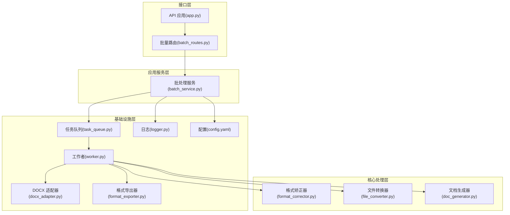
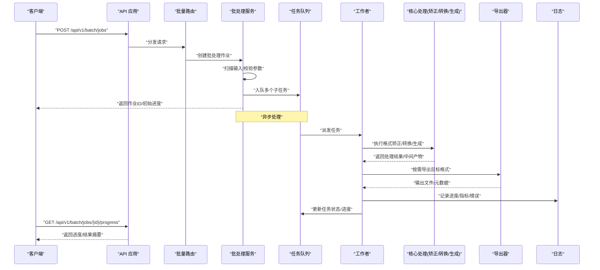
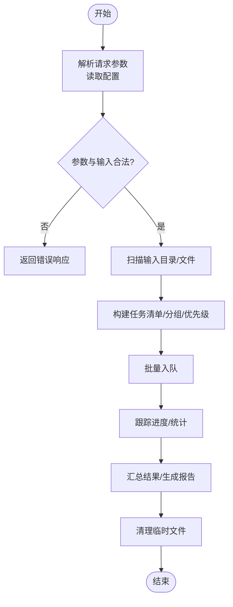
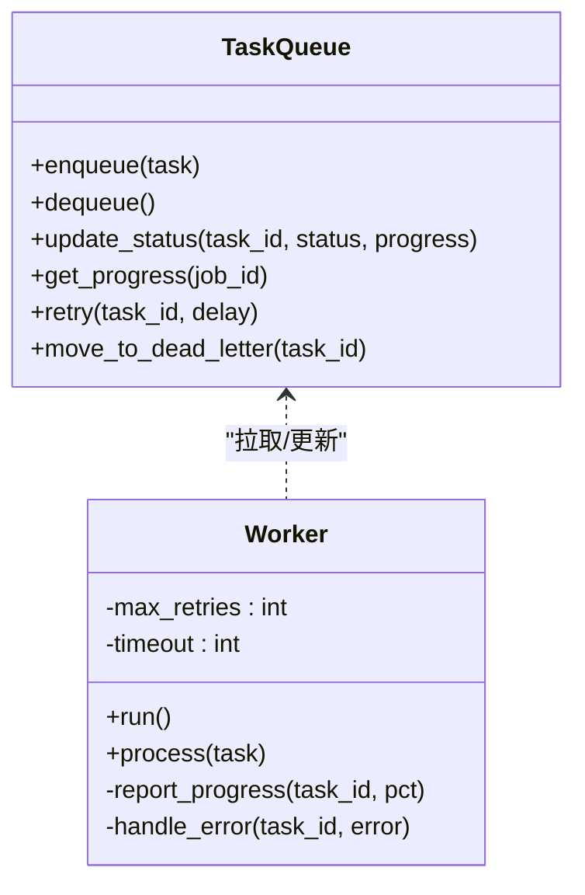
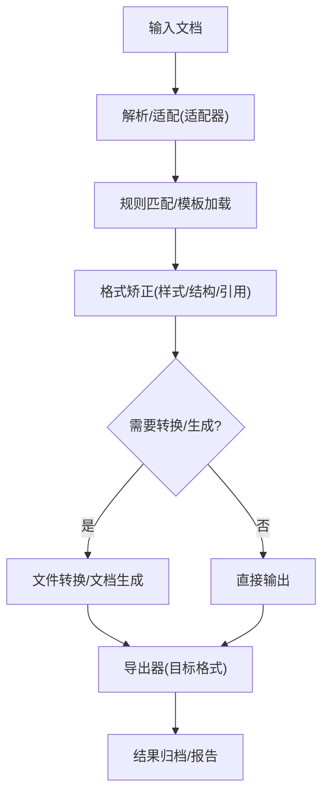
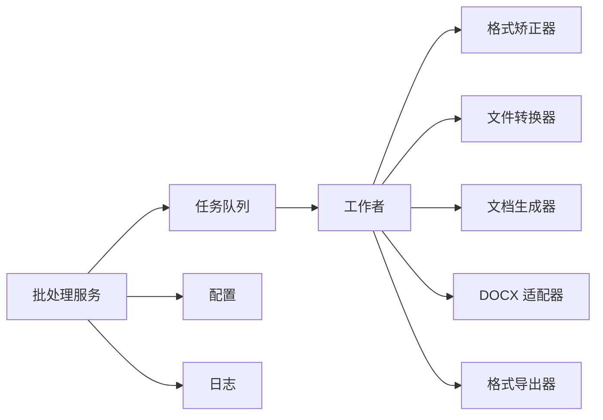

# 批量文档处理

<cite>
**本文引用的文件**   
- [src/paper_format_corrector/application/services/batch_service.py](file://src/paper_format_corrector/application/services/batch_service.py)
- [src/paper_format_corrector/infrastructure/queue/task_queue.py](file://src/paper_format_corrector/infrastructure/queue/task_queue.py)
- [src/paper_format_corrector/infrastructure/queue/worker.py](file://src/paper_format_corrector/infrastructure/queue/worker.py)
- [src/paper_format_corrector/core/format_corrector.py](file://src/paper_format_corrector/core/format_corrector.py)
- [src/paper_format_corrector/core/file_converter.py](file://src/paper_format_corrector/core/file_converter.py)
- [src/paper_format_corrector/core/doc_generator.py](file://src/paper_format_corrector/core/doc_generator.py)
- [src/paper_format_corrector/infrastructure/adapters/docx_adapter.py](file://src/paper_format_corrector/infrastructure/adapters/docx_adapter.py)
- [src/paper_format_corrector/infrastructure/exporters/format_exporter.py](file://src/paper_format_corrector/infrastructure/exporters/format_exporter.py)
- [src/paper_format_corrector/interfaces/api/routes/batch_routes.py](file://src/paper_format_corrector/interfaces/api/routes/batch_routes.py)
- [src/paper_format_corrector/interfaces/api/app.py](file://src/paper_format_corrector/interfaces/api/app.py)
- [src/paper_format_corrector/shared/utils/logger.py](file://src/paper_format_corrector/shared/utils/logger.py)
- [config/config.yaml](file://config/config.yaml)
- [examples/sample_template.yaml](file://examples/sample_template.yaml)
- [tests/test_task_queue.py](file://tests/test_task_queue.py)
</cite>

## 目录
1. [简介](#简介)
2. [项目结构](#项目结构)
3. [核心组件](#核心组件)
4. [架构总览](#架构总览)
5. [详细组件分析](#详细组件分析)
6. [依赖关系分析](#依赖关系分析)
7. [性能考虑](#性能考虑)
8. [故障排查指南](#故障排查指南)
9. [结论](#结论)
10. [附录](#附录)

## 简介
本技术文档围绕“批量文档处理”能力，系统阐述批处理架构设计、任务队列管理、并行处理机制与错误恢复策略。重点说明如何对大规模文档集合进行自动化格式矫正，包括文件扫描、任务分配、进度监控与结果汇总；并提供完整的API接口文档（配置参数、回调、异常处理、性能调优）。同时给出典型批处理场景示例（如论文提交前批量检查、机构模板统一应用），并解释分布式处理支持与资源管理机制。

## 项目结构
与批量处理相关的代码主要分布在以下层次：
- 应用服务层：编排批处理流程、任务拆分与聚合、进度与结果汇总
- 基础设施层：任务队列与工作者、适配器与导出器、日志与配置
- 核心处理层：格式矫正、文件转换、文档生成
- 接口层：HTTP API路由与应用装配
- 测试与示例：任务队列行为验证、模板样例

图表来源
- [src/paper_format_corrector/interfaces/api/app.py](file://src/paper_format_corrector/interfaces/api/app.py)
- [src/paper_format_corrector/interfaces/api/routes/batch_routes.py](file://src/paper_format_corrector/interfaces/api/routes/batch_routes.py)
- [src/paper_format_corrector/application/services/batch_service.py](file://src/paper_format_corrector/application/services/batch_service.py)
- [src/paper_format_corrector/infrastructure/queue/task_queue.py](file://src/paper_format_corrector/infrastructure/queue/task_queue.py)
- [src/paper_format_corrector/infrastructure/queue/worker.py](file://src/paper_format_corrector/infrastructure/queue/worker.py)
- [src/paper_format_corrector/core/format_corrector.py](file://src/paper_format_corrector/core/format_corrector.py)
- [src/paper_format_corrector/core/file_converter.py](file://src/paper_format_corrector/core/file_converter.py)
- [src/paper_format_corrector/core/doc_generator.py](file://src/paper_format_corrector/core/doc_generator.py)
- [src/paper_format_corrector/infrastructure/adapters/docx_adapter.py](file://src/paper_format_corrector/infrastructure/adapters/docx_adapter.py)
- [src/paper_format_corrector/infrastructure/exporters/format_exporter.py](file://src/paper_format_corrector/infrastructure/exporters/format_exporter.py)
- [src/paper_format_corrector/shared/utils/logger.py](file://src/paper_format_corrector/shared/utils/logger.py)
- [config/config.yaml](file://config/config.yaml)

章节来源
- [src/paper_format_corrector/interfaces/api/app.py](file://src/paper_format_corrector/interfaces/api/app.py)
- [src/paper_format_corrector/interfaces/api/routes/batch_routes.py](file://src/paper_format_corrector/interfaces/api/routes/batch_routes.py)
- [src/paper_format_corrector/application/services/batch_service.py](file://src/paper_format_corrector/application/services/batch_service.py)
- [src/paper_format_corrector/infrastructure/queue/task_queue.py](file://src/paper_format_corrector/infrastructure/queue/task_queue.py)
- [src/paper_format_corrector/infrastructure/queue/worker.py](file://src/paper_format_corrector/infrastructure/queue/worker.py)
- [src/paper_format_corrector/core/format_corrector.py](file://src/paper_format_corrector/core/format_corrector.py)
- [src/paper_format_corrector/core/file_converter.py](file://src/paper_format_corrector/core/file_converter.py)
- [src/paper_format_corrector/core/doc_generator.py](file://src/paper_format_corrector/core/doc_generator.py)
- [src/paper_format_corrector/infrastructure/adapters/docx_adapter.py](file://src/paper_format_corrector/infrastructure/adapters/docx_adapter.py)
- [src/paper_format_corrector/infrastructure/exporters/format_exporter.py](file://src/paper_format_corrector/infrastructure/exporters/format_exporter.py)
- [src/paper_format_corrector/shared/utils/logger.py](file://src/paper_format_corrector/shared/utils/logger.py)
- [config/config.yaml](file://config/config.yaml)

## 核心组件
- 批处理服务：负责接收批量请求、扫描输入、拆分任务、调度到队列、收集结果与进度、汇总报告。
- 任务队列：提供持久化或内存的任务存储、任务状态机、重试与死信通道、并发消费控制。
- 工作者：从队列拉取任务，执行具体处理逻辑（格式矫正、转换、导出等），上报进度与结果。
- 格式矫正器：依据模板与规则对文档进行样式、段落、标题、引用等一致性修正。
- 文件转换器：在多种中间表示之间转换（如docx <-> 其他格式），保证内容无损。
- 文档生成器：根据模板与数据生成结构化文档，支持封面、目录、参考文献等。
- DOCX 适配器：封装底层文档库操作，屏蔽差异，提供统一的读写接口。
- 格式导出器：将处理后的文档输出为目标格式（PDF、HTML、LaTeX 等）。
- 日志与配置：记录关键事件、指标与错误；集中管理批处理参数与运行时选项。

章节来源
- [src/paper_format_corrector/application/services/batch_service.py](file://src/paper_format_corrector/application/services/batch_service.py)
- [src/paper_format_corrector/infrastructure/queue/task_queue.py](file://src/paper_format_corrector/infrastructure/queue/task_queue.py)
- [src/paper_format_corrector/infrastructure/queue/worker.py](file://src/paper_format_corrector/infrastructure/queue/worker.py)
- [src/paper_format_corrector/core/format_corrector.py](file://src/paper_format_corrector/core/format_corrector.py)
- [src/paper_format_corrector/core/file_converter.py](file://src/paper_format_corrector/core/file_converter.py)
- [src/paper_format_corrector/core/doc_generator.py](file://src/paper_format_corrector/core/doc_generator.py)
- [src/paper_format_corrector/infrastructure/adapters/docx_adapter.py](file://src/paper_format_corrector/infrastructure/adapters/docx_adapter.py)
- [src/paper_format_corrector/infrastructure/exporters/format_exporter.py](file://src/paper_format_corrector/infrastructure/exporters/format_exporter.py)
- [src/paper_format_corrector/shared/utils/logger.py](file://src/paper_format_corrector/shared/utils/logger.py)
- [config/config.yaml](file://config/config.yaml)

## 架构总览
下图展示了从API入口到任务执行与结果输出的端到端流程，以及批处理服务的编排职责。

图表来源
- [src/paper_format_corrector/interfaces/api/app.py](file://src/paper_format_corrector/interfaces/api/app.py)
- [src/paper_format_corrector/interfaces/api/routes/batch_routes.py](file://src/paper_format_corrector/interfaces/api/routes/batch_routes.py)
- [src/paper_format_corrector/application/services/batch_service.py](file://src/paper_format_corrector/application/services/batch_service.py)
- [src/paper_format_corrector/infrastructure/queue/task_queue.py](file://src/paper_format_corrector/infrastructure/queue/task_queue.py)
- [src/paper_format_corrector/infrastructure/queue/worker.py](file://src/paper_format_corrector/infrastructure/queue/worker.py)
- [src/paper_format_corrector/core/format_corrector.py](file://src/paper_format_corrector/core/format_corrector.py)
- [src/paper_format_corrector/core/file_converter.py](file://src/paper_format_corrector/core/file_converter.py)
- [src/paper_format_corrector/core/doc_generator.py](file://src/paper_format_corrector/core/doc_generator.py)
- [src/paper_format_corrector/infrastructure/exporters/format_exporter.py](file://src/paper_format_corrector/infrastructure/exporters/format_exporter.py)
- [src/paper_format_corrector/shared/utils/logger.py](file://src/paper_format_corrector/shared/utils/logger.py)

## 详细组件分析

### 批处理服务（BatchService）
职责
- 解析批量请求参数，校验输入路径/模板/导出格式等
- 扫描输入目录，过滤有效文档，构建任务清单
- 将任务拆分为可并行执行的子任务，写入队列
- 维护作业级进度、统计与最终报告
- 支持回调通知（可选）与结果归档

关键流程
- 初始化：加载配置、准备临时目录、建立日志上下文
- 扫描与规划：按模板分组、预估工作量、设置并发度
- 调度：批量入队，记录作业元数据
- 聚合：监听队列事件，汇总成功/失败/跳过数量
- 收尾：清理临时文件，生成汇总报告

图表来源
- [src/paper_format_corrector/application/services/batch_service.py](file://src/paper_format_corrector/application/services/batch_service.py)
- [config/config.yaml](file://config/config.yaml)

章节来源
- [src/paper_format_corrector/application/services/batch_service.py](file://src/paper_format_corrector/application/services/batch_service.py)
- [config/config.yaml](file://config/config.yaml)

### 任务队列与工作者（TaskQueue & Worker）
职责
- 任务队列：提供任务持久化、状态机（待处理/进行中/完成/失败/重试）、死信队列、延迟重试、限流与并发控制
- 工作者：拉取任务、执行处理、上报进度、处理异常与重试、落盘中间产物

并发模型
- 多进程或多线程工作者池，受最大并发数限制
- 每个工作者独立工作空间，避免共享状态冲突
- 通过心跳/心跳超时检测工作者健康状态

图表来源
- [src/paper_format_corrector/infrastructure/queue/task_queue.py](file://src/paper_format_corrector/infrastructure/queue/task_queue.py)
- [src/paper_format_corrector/infrastructure/queue/worker.py](file://src/paper_format_corrector/infrastructure/queue/worker.py)

章节来源
- [src/paper_format_corrector/infrastructure/queue/task_queue.py](file://src/paper_format_corrector/infrastructure/queue/task_queue.py)
- [src/paper_format_corrector/infrastructure/queue/worker.py](file://src/paper_format_corrector/infrastructure/queue/worker.py)
- [tests/test_task_queue.py](file://tests/test_task_queue.py)

### 核心处理管线（格式矫正/转换/生成）
职责
- 格式矫正器：基于模板与规则，统一字体、段落、标题层级、页眉页脚、编号、交叉引用等
- 文件转换器：在不同格式间转换，保持结构与样式一致
- 文档生成器：根据模板与数据生成文档骨架与必要元素

图表来源
- [src/paper_format_corrector/core/format_corrector.py](file://src/paper_format_corrector/core/format_corrector.py)
- [src/paper_format_corrector/core/file_converter.py](file://src/paper_format_corrector/core/file_converter.py)
- [src/paper_format_corrector/core/doc_generator.py](file://src/paper_format_corrector/core/doc_generator.py)
- [src/paper_format_corrector/infrastructure/adapters/docx_adapter.py](file://src/paper_format_corrector/infrastructure/adapters/docx_adapter.py)
- [src/paper_format_corrector/infrastructure/exporters/format_exporter.py](file://src/paper_format_corrector/infrastructure/exporters/format_exporter.py)

章节来源
- [src/paper_format_corrector/core/format_corrector.py](file://src/paper_format_corrector/core/format_corrector.py)
- [src/paper_format_corrector/core/file_converter.py](file://src/paper_format_corrector/core/file_converter.py)
- [src/paper_format_corrector/core/doc_generator.py](file://src/paper_format_corrector/core/doc_generator.py)
- [src/paper_format_corrector/infrastructure/adapters/docx_adapter.py](file://src/paper_format_corrector/infrastructure/adapters/docx_adapter.py)
- [src/paper_format_corrector/infrastructure/exporters/format_exporter.py](file://src/paper_format_corrector/infrastructure/exporters/format_exporter.py)

### API 接口定义
- 创建批处理作业
  - 方法：POST
  - 路径：/api/v1/batch/jobs
  - 请求体字段（示例）：
    - input_paths: 字符串数组，输入文件或目录
    - template_ref: 字符串，模板标识或路径
    - export_formats: 字符串数组，目标格式列表
    - options: 对象，包含并发度、重试次数、是否保留中间产物等
    - callback_url: 字符串，可选的回调地址
  - 响应：作业ID、初始进度、预计任务数
- 查询作业进度
  - 方法：GET
  - 路径：/api/v1/batch/jobs/{job_id}/progress
  - 响应：各子任务状态、整体进度百分比、成功/失败计数、错误摘要
- 取消作业
  - 方法：DELETE
  - 路径：/api/v1/batch/jobs/{job_id}
  - 响应：取消确认、剩余任务处理策略
- 下载结果
  - 方法：GET
  - 路径：/api/v1/batch/jobs/{job_id}/results
  - 响应：结果文件列表与下载链接

注意
- 所有接口均返回标准JSON响应体
- 错误码遵循REST约定，并在响应体中附带错误详情
- 大作业建议配合分页与增量进度查询

章节来源
- [src/paper_format_corrector/interfaces/api/routes/batch_routes.py](file://src/paper_format_corrector/interfaces/api/routes/batch_routes.py)
- [src/paper_format_corrector/interfaces/api/app.py](file://src/paper_format_corrector/interfaces/api/app.py)

### 配置与模板
- 全局配置（config.yaml）
  - 队列后端与连接参数
  - 工作者并发度上限
  - 重试策略（最大重试次数、退避时间）
  - 临时目录与结果目录
  - 日志级别与输出位置
- 模板配置（示例）
  - 模板元信息（名称、版本、适用领域）
  - 样式规则（字体、字号、行距、段前段后）
  - 结构规则（标题层级、编号、页眉页脚）
  - 引用与交叉引用规范
  - 导出预设（PDF/HTML/LaTeX 渲染选项）

章节来源
- [config/config.yaml](file://config/config.yaml)
- [examples/sample_template.yaml](file://examples/sample_template.yaml)

## 依赖关系分析
- 低耦合高内聚：批处理服务仅依赖队列抽象与核心处理接口，不关心具体实现细节
- 可扩展性：新增处理器（如新的导出器或转换器）只需实现对应接口并注册
- 外部依赖：
  - 文档库（由适配器封装）
  - 消息/任务存储（由队列实现选择）
  - 文件系统（输入/输出/临时目录）
  - 日志系统

图表来源
- [src/paper_format_corrector/application/services/batch_service.py](file://src/paper_format_corrector/application/services/batch_service.py)
- [src/paper_format_corrector/infrastructure/queue/task_queue.py](file://src/paper_format_corrector/infrastructure/queue/task_queue.py)
- [src/paper_format_corrector/infrastructure/queue/worker.py](file://src/paper_format_corrector/infrastructure/queue/worker.py)
- [src/paper_format_corrector/core/format_corrector.py](file://src/paper_format_corrector/core/format_corrector.py)
- [src/paper_format_corrector/core/file_converter.py](file://src/paper_format_corrector/core/file_converter.py)
- [src/paper_format_corrector/core/doc_generator.py](file://src/paper_format_corrector/core/doc_generator.py)
- [src/paper_format_corrector/infrastructure/adapters/docx_adapter.py](file://src/paper_format_corrector/infrastructure/adapters/docx_adapter.py)
- [src/paper_format_corrector/infrastructure/exporters/format_exporter.py](file://src/paper_format_corrector/infrastructure/exporters/format_exporter.py)
- [src/paper_format_corrector/shared/utils/logger.py](file://src/paper_format_corrector/shared/utils/logger.py)
- [config/config.yaml](file://config/config.yaml)

章节来源
- [src/paper_format_corrector/application/services/batch_service.py](file://src/paper_format_corrector/application/services/batch_service.py)
- [src/paper_format_corrector/infrastructure/queue/task_queue.py](file://src/paper_format_corrector/infrastructure/queue/task_queue.py)
- [src/paper_format_corrector/infrastructure/queue/worker.py](file://src/paper_format_corrector/infrastructure/queue/worker.py)
- [src/paper_format_corrector/core/format_corrector.py](file://src/paper_format_corrector/core/format_corrector.py)
- [src/paper_format_corrector/core/file_converter.py](file://src/paper_format_corrector/core/file_converter.py)
- [src/paper_format_corrector/core/doc_generator.py](file://src/paper_format_corrector/core/doc_generator.py)
- [src/paper_format_corrector/infrastructure/adapters/docx_adapter.py](file://src/paper_format_corrector/infrastructure/adapters/docx_adapter.py)
- [src/paper_format_corrector/infrastructure/exporters/format_exporter.py](file://src/paper_format_corrector/infrastructure/exporters/format_exporter.py)
- [src/paper_format_corrector/shared/utils/logger.py](file://src/paper_format_corrector/shared/utils/logger.py)
- [config/config.yaml](file://config/config.yaml)

## 性能考虑
- 并发度调优
  - 根据CPU核数与I/O特性调整工作者并发度
  - 对CPU密集型任务（如复杂排版）降低并发，对I/O密集型任务可适当提高
- 任务粒度
  - 将大文档切分为合理大小的子任务，避免单任务过长导致阻塞
- 缓存与复用
  - 模板与样式预加载，减少重复解析开销
  - 中间产物缓存，避免重复计算
- 资源隔离
  - 为每个工作者分配独立工作目录，防止文件竞争
- 背压与限流
  - 当队列积压时自动降速，保护系统稳定性
- 导出优化
  - 批量导出合并，减少磁盘IO与进程启动开销

[本节为通用指导，无需特定文件来源]

## 故障排查指南
常见问题与定位要点
- 任务长时间无进展
  - 检查工作者的健康状态与心跳
  - 查看队列中的任务状态是否为“进行中”
  - 核对工作者日志是否有异常堆栈
- 大量任务失败
  - 检查输入文件权限与路径有效性
  - 查看错误分类（解析失败、模板缺失、导出失败等）
  - 使用死信队列定位不可重试任务
- 内存占用过高
  - 降低并发度，增大GC压力阈值
  - 检查是否存在未释放的资源（文件句柄、临时文件）
- 导出失败
  - 确认目标格式依赖是否安装
  - 检查导出器配置与模板兼容性

定位手段
- 启用更详细的日志级别，关注关键节点日志
- 使用进度查询接口观察任务分布
- 导出错误摘要与堆栈，便于快速复现

章节来源
- [src/paper_format_corrector/shared/utils/logger.py](file://src/paper_format_corrector/shared/utils/logger.py)
- [src/paper_format_corrector/infrastructure/queue/task_queue.py](file://src/paper_format_corrector/infrastructure/queue/task_queue.py)
- [src/paper_format_corrector/infrastructure/queue/worker.py](file://src/paper_format_corrector/infrastructure/queue/worker.py)

## 结论
本方案以“批处理服务 + 任务队列 + 工作者”为核心，结合“格式矫正/转换/生成”的核心处理管线，实现了大规模文档集合的自动化格式矫正与批量导出。通过合理的并发控制、重试与死信机制、完善的日志与进度监控，系统在可靠性与性能之间取得平衡。API层提供了清晰的作业生命周期管理能力，便于集成到现有工作流中。

[本节为总结性内容，无需特定文件来源]

## 附录

### 典型批处理场景示例
- 论文提交前批量检查
  - 输入：某学院提交的若干论文草稿
  - 模板：学校学位论文模板
  - 处理：统一标题层级、页眉页脚、参考文献格式、图片表格编号
  - 输出：符合规范的PDF与源文档
- 机构模板统一应用
  - 输入：历史文档集合（不同作者、不同风格）
  - 模板：机构标准模板
  - 处理：样式迁移、结构规范化、交叉引用修复
  - 输出：标准化文档集与差异报告

[本节为概念性示例，无需特定文件来源]

### 分布式处理支持与资源管理
- 分布式扩展
  - 将任务队列部署为独立服务，支持水平扩展
  - 工作者可在多节点运行，通过队列中心协调
- 资源管理
  - 动态扩缩容：根据队列长度与工作负载自动增减工作者实例
  - 资源配额：为每个工作者设定CPU/内存上限，避免争抢
  - 优雅停机：停止工作者前完成当前任务或安全回滚

[本节为概念性说明，无需特定文件来源]