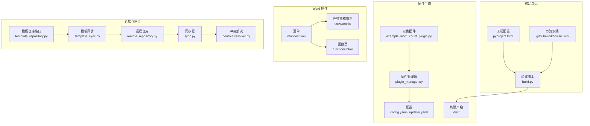
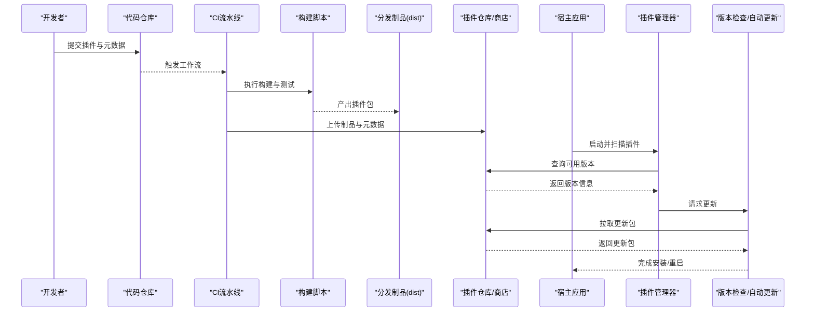
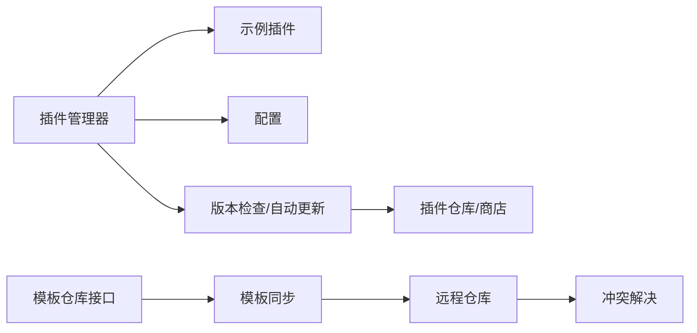

# 插件分发与发布

<cite>
**本文引用的文件**   
- [README.md](file://README.md)
- [pyproject.toml](file://pyproject.toml)
- [build.py](file://build.py)
- [.github/workflows/ci.yml](file://.github/workflows/ci.yml)
- [src/paper_format_corrector/infra/plugin_manager.py](file://src/paper_format_corrector/infra/plugin_manager.py)
- [plugins/example_word_count_plugin.py](file://plugins/example_word_count_plugin.py)
- [config/config.yaml](file://config/config.yaml)
- [config/updater.yaml](file://config/updater.yaml)
- [dist/](file://dist/)
- [examples/sample_requirements.txt](file://examples/sample_requirements.txt)
- [examples/sample_template.yaml](file://examples/sample_template.yaml)
- [interfaces/word_addin/manifest.xml](file://interfaces/word_addin/manifest.xml)
- [interfaces/word_addin/src/taskpane.js](file://interfaces/word_addin/src/taskpane.js)
- [interfaces/word_addin/src/functions.html](file://interfaces/word_addin/src/functions.html)
- [src/paper_format_corrector/infra/updater/version_checker.py](file://src/paper_format_corrector/infra/updater/version_checker.py)
- [src/paper_format_corrector/infra/updater/auto_updater.py](file://src/paper_format_corrector/infra/updater/auto_updater.py)
- [src/paper_format_corrector/infra/template_repository.py](file://src/paper_format_corrector/infra/template_repository.py)
- [src/paper_format_corrector/infra/template_sync.py](file://src/paper_format_corrector/infra/template_sync.py)
- [src/paper_format_corrector/infra/remote/conflict_resolver.py](file://src/paper_format_corrector/infra/remote/conflict_resolver.py)
- [src/paper_format_corrector/infra/remote/remote_repository.py](file://src/paper_format_corrector/infra/remote/remote_repository.py)
- [src/paper_format_corrector/infra/remote/sync.py](file://src/paper_format_corrector/infra/remote/sync.py)
- [tests/test_basic.py](file://tests/test_basic.py)
- [tests/test_cli_integration.py](file://tests/test_cli_integration.py)
- [tests/test_template_repository.py](file://tests/test_template_repository.py)
- [tests/test_template_sync.py](file://tests/test_template_sync.py)
- [tests/test_task_queue.py](file://tests/test_task_queue.py)
- [tests/conftest.py](file://tests/conftest.py)
- [docs/user_guide.md](file://docs/user_guide.md)
- [docs/api_guide.md](file://docs/api_guide.md)
- [docs/template_guide.md](file://docs/template_guide.md)
</cite>

## 目录
1. [简介](#简介)
2. [项目结构](#项目结构)
3. [核心组件](#核心组件)
4. [架构总览](#架构总览)
5. [详细组件分析](#详细组件分析)
6. [依赖分析](#依赖分析)
7. [性能考虑](#性能考虑)
8. [故障排查指南](#故障排查指南)
9. [结论](#结论)
10. [附录](#附录)

## 简介
本指南面向插件开发者与维护者，围绕“插件打包、签名、版本管理与发布”的全流程，结合仓库现有能力，提供可操作的步骤与最佳实践。内容覆盖：
- 插件包结构与元数据定义
- 构建与打包（含可选签名）
- 版本管理策略与变更日志
- 插件仓库与依赖解析、冲突解决
- 插件市场/商店集成方案
- 安装、更新与卸载的用户操作流程
- 质量保证、自动化测试与持续集成配置
- 文档生成与用户手册编写指导

## 项目结构
本项目已具备插件生态的基础设施与示例，关键位置如下：
- 插件入口与示例：plugins/example_word_count_plugin.py
- 插件管理器：src/paper_format_corrector/infra/plugin_manager.py
- 构建脚本：build.py；Python 工程配置：pyproject.toml
- 持续集成：.github/workflows/ci.yml
- 配置与更新：config/config.yaml、config/updater.yaml
- 产物输出：dist/
- Word 插件清单与任务窗格：interfaces/word_addin/manifest.xml、interfaces/word_addin/src/*.js
- 模板仓库与同步：src/paper_format_corrector/infra/template_repository.py、template_sync.py
- 远程协作与冲突解决：src/paper_format_corrector/infra/remote/*
- 测试套件：tests/*
- 文档：docs/*

图表来源
- [src/paper_format_corrector/infra/plugin_manager.py](file://src/paper_format_corrector/infra/plugin_manager.py)
- [plugins/example_word_count_plugin.py](file://plugins/example_word_count_plugin.py)
- [config/config.yaml](file://config/config.yaml)
- [config/updater.yaml](file://config/updater.yaml)
- [build.py](file://build.py)
- [pyproject.toml](file://pyproject.toml)
- [.github/workflows/ci.yml](file://.github/workflows/ci.yml)
- [interfaces/word_addin/manifest.xml](file://interfaces/word_addin/manifest.xml)
- [interfaces/word_addin/src/taskpane.js](file://interfaces/word_addin/src/taskpane.js)
- [interfaces/word_addin/src/functions.html](file://interfaces/word_addin/src/functions.html)
- [src/paper_format_corrector/infra/template_repository.py](file://src/paper_format_corrector/infra/template_repository.py)
- [src/paper_format_corrector/infra/template_sync.py](file://src/paper_format_corrector/infra/template_sync.py)
- [src/paper_format_corrector/infra/remote/remote_repository.py](file://src/paper_format_corrector/infra/remote/remote_repository.py)
- [src/paper_format_corrector/infra/remote/sync.py](file://src/paper_format_corrector/infra/remote/sync.py)
- [src/paper_format_corrector/infra/remote/conflict_resolver.py](file://src/paper_format_corrector/infra/remote/conflict_resolver.py)

章节来源
- [README.md](file://README.md)
- [pyproject.toml](file://pyproject.toml)
- [build.py](file://build.py)
- [.github/workflows/ci.yml](file://.github/workflows/ci.yml)
- [src/paper_format_corrector/infra/plugin_manager.py](file://src/paper_format_corrector/infra/plugin_manager.py)
- [plugins/example_word_count_plugin.py](file://plugins/example_word_count_plugin.py)
- [config/config.yaml](file://config/config.yaml)
- [config/updater.yaml](file://config/updater.yaml)
- [interfaces/word_addin/manifest.xml](file://interfaces/word_addin/manifest.xml)
- [interfaces/word_addin/src/taskpane.js](file://interfaces/word_addin/src/taskpane.js)
- [interfaces/word_addin/src/functions.html](file://interfaces/word_addin/src/functions.html)
- [src/paper_format_corrector/infra/template_repository.py](file://src/paper_format_corrector/infra/template_repository.py)
- [src/paper_format_corrector/infra/template_sync.py](file://src/paper_format_corrector/infra/template_sync.py)
- [src/paper_format_corrector/infra/remote/remote_repository.py](file://src/paper_format_corrector/infra/remote/remote_repository.py)
- [src/paper_format_corrector/infra/remote/sync.py](file://src/paper_format_corrector/infra/remote/sync.py)
- [src/paper_format_corrector/infra/remote/conflict_resolver.py](file://src/paper_format_corrector/infra/remote/conflict_resolver.py)

## 核心组件
- 插件管理器：负责插件发现、加载、生命周期管理与扩展点调用。
- 示例插件：演示插件最小实现与注册方式。
- 构建与打包：通过构建脚本与工程配置产出标准分发包。
- 版本检查与自动更新：提供版本比对与增量更新能力。
- 模板仓库与同步：复用仓库机制作为插件仓库的参考实现。
- 远程协作与冲突解决：为多端同步与冲突处理提供参考。
- 持续集成：在提交与合并时执行测试与构建。
- 文档与用户指南：提供使用说明与API参考。

章节来源
- [src/paper_format_corrector/infra/plugin_manager.py](file://src/paper_format_corrector/infra/plugin_manager.py)
- [plugins/example_word_count_plugin.py](file://plugins/example_word_count_plugin.py)
- [build.py](file://build.py)
- [pyproject.toml](file://pyproject.toml)
- [src/paper_format_corrector/infra/updater/version_checker.py](file://src/paper_format_corrector/infra/updater/version_checker.py)
- [src/paper_format_corrector/infra/updater/auto_updater.py](file://src/paper_format_corrector/infra/updater/auto_updater.py)
- [src/paper_format_corrector/infra/template_repository.py](file://src/paper_format_corrector/infra/template_repository.py)
- [src/paper_format_corrector/infra/template_sync.py](file://src/paper_format_corrector/infra/template_sync.py)
- [src/paper_format_corrector/infra/remote/conflict_resolver.py](file://src/paper_format_corrector/infra/remote/conflict_resolver.py)
- [src/paper_format_corrector/infra/remote/remote_repository.py](file://src/paper_format_corrector/infra/remote/remote_repository.py)
- [src/paper_format_corrector/infra/remote/sync.py](file://src/paper_format_corrector/infra/remote/sync.py)
- [.github/workflows/ci.yml](file://.github/workflows/ci.yml)
- [docs/user_guide.md](file://docs/user_guide.md)
- [docs/api_guide.md](file://docs/api_guide.md)
- [docs/template_guide.md](file://docs/template_guide.md)

## 架构总览
下图展示插件从开发到发布的端到端流程，以及运行时加载与更新的交互关系。

图表来源
- [.github/workflows/ci.yml](file://.github/workflows/ci.yml)
- [build.py](file://build.py)
- [dist/](file://dist/)
- [src/paper_format_corrector/infra/plugin_manager.py](file://src/paper_format_corrector/infra/plugin_manager.py)
- [src/paper_format_corrector/infra/updater/version_checker.py](file://src/paper_format_corrector/infra/updater/version_checker.py)
- [src/paper_format_corrector/infra/updater/auto_updater.py](file://src/paper_format_corrector/infra/updater/auto_updater.py)

## 详细组件分析

### 插件包结构与元数据定义
- 包结构建议
  - 根目录包含插件描述文件（如清单或元数据），用于声明名称、版本、依赖、入口等。
  - 源码目录组织业务逻辑，按功能模块拆分。
  - 资源目录存放静态资源（图标、样式、模板等）。
  - 测试目录放置单元测试与集成测试。
  - 文档目录包含使用指南与API说明。
- 元数据要点
  - 唯一标识、版本号、兼容范围、依赖声明、许可证、作者与联系方式。
  - 入口点与扩展点映射，便于插件管理器发现与注入。
- 参考路径
  - 示例插件：[plugins/example_word_count_plugin.py](file://plugins/example_word_count_plugin.py)
  - 示例需求与模板：[examples/sample_requirements.txt](file://examples/sample_requirements.txt)、[examples/sample_template.yaml](file://examples/sample_template.yaml)
  - 工程配置（依赖与打包）：[pyproject.toml](file://pyproject.toml)

章节来源
- [plugins/example_word_count_plugin.py](file://plugins/example_word_count_plugin.py)
- [examples/sample_requirements.txt](file://examples/sample_requirements.txt)
- [examples/sample_template.yaml](file://examples/sample_template.yaml)
- [pyproject.toml](file://pyproject.toml)

### 构建与打包（含签名）
- 构建流程
  - 使用构建脚本统一执行依赖安装、测试、打包与产物归档。
  - 产物输出至 dist 目录，供后续上传与分发。
- 签名策略
  - 对产物进行数字签名，确保完整性与来源可信。
  - 在CI中引入密钥管理，避免硬编码敏感信息。
- 参考路径
  - 构建脚本：[build.py](file://build.py)
  - 工程配置：[pyproject.toml](file://pyproject.toml)
  - 产物目录：[dist/](file://dist/)

章节来源
- [build.py](file://build.py)
- [pyproject.toml](file://pyproject.toml)
- [dist/](file://dist/)

### 版本管理与发布流程
- 版本策略
  - 采用语义化版本控制，明确主/次/补丁号含义。
  - 在元数据与制品命名中包含版本号，便于追踪与回滚。
- 发布步骤
  - 本地验证通过后推送标签或分支。
  - CI触发构建、测试、签名与上传。
  - 更新仓库索引与商店元数据。
- 参考路径
  - 版本检查：[src/paper_format_corrector/infra/updater/version_checker.py](file://src/paper_format_corrector/infra/updater/version_checker.py)
  - 自动更新：[src/paper_format_corrector/infra/updater/auto_updater.py](file://src/paper_format_corrector/infra/updater/auto_updater.py)
  - 更新配置：[config/updater.yaml](file://config/updater.yaml)

章节来源
- [src/paper_format_corrector/infra/updater/version_checker.py](file://src/paper_format_corrector/infra/updater/version_checker.py)
- [src/paper_format_corrector/infra/updater/auto_updater.py](file://src/paper_format_corrector/infra/updater/auto_updater.py)
- [config/updater.yaml](file://config/updater.yaml)

### 插件仓库管理与依赖解析、冲突解决
- 仓库模型
  - 以模板仓库为参考，建立统一的插件索引与元数据服务。
  - 支持按平台、版本、依赖约束检索。
- 依赖解析
  - 基于元数据中的依赖声明进行解析，优先满足最低兼容版本。
  - 检测循环依赖与不可满足约束，提前失败。
- 冲突解决
  - 当存在不兼容版本时，采用升级策略或提示用户选择。
  - 记录冲突详情，便于审计与回溯。
- 参考路径
  - 模板仓库接口：[src/paper_format_corrector/infra/template_repository.py](file://src/paper_format_corrector/infra/template_repository.py)
  - 模板同步：[src/paper_format_corrector/infra/template_sync.py](file://src/paper_format_corrector/infra/template_sync.py)
  - 远程仓库：[src/paper_format_corrector/infra/remote/remote_repository.py](file://src/paper_format_corrector/infra/remote/remote_repository.py)
  - 同步器：[src/paper_format_corrector/infra/remote/sync.py](file://src/paper_format_corrector/infra/remote/sync.py)
  - 冲突解决：[src/paper_format_corrector/infra/remote/conflict_resolver.py](file://src/paper_format_corrector/infra/remote/conflict_resolver.py)

章节来源
- [src/paper_format_corrector/infra/template_repository.py](file://src/paper_format_corrector/infra/template_repository.py)
- [src/paper_format_corrector/infra/template_sync.py](file://src/paper_format_corrector/infra/template_sync.py)
- [src/paper_format_corrector/infra/remote/remote_repository.py](file://src/paper_format_corrector/infra/remote/remote_repository.py)
- [src/paper_format_corrector/infra/remote/sync.py](file://src/paper_format_corrector/infra/remote/sync.py)
- [src/paper_format_corrector/infra/remote/conflict_resolver.py](file://src/paper_format_corrector/infra/remote/conflict_resolver.py)

### 插件市场/商店集成方案
- 清单与界面
  - Word 插件清单 manifest.xml 定义插件基本信息与权限。
  - 任务窗格与函数页提供交互入口。
- 集成要点
  - 将插件元数据同步至商店索引。
  - 提供在线安装与一键更新能力。
- 参考路径
  - 清单：[interfaces/word_addin/manifest.xml](file://interfaces/word_addin/manifest.xml)
  - 任务窗格脚本：[interfaces/word_addin/src/taskpane.js](file://interfaces/word_addin/src/taskpane.js)
  - 函数页：[interfaces/word_addin/src/functions.html](file://interfaces/word_addin/src/functions.html)

章节来源
- [interfaces/word_addin/manifest.xml](file://interfaces/word_addin/manifest.xml)
- [interfaces/word_addin/src/taskpane.js](file://interfaces/word_addin/src/taskpane.js)
- [interfaces/word_addin/src/functions.html](file://interfaces/word_addin/src/functions.html)

### 安装、更新与卸载的用户操作流程
- 安装
  - 从仓库或商店搜索插件，点击安装。
  - 宿主应用下载并校验签名，完成后启用。
- 更新
  - 启动时检查新版本，提示用户确认。
  - 静默或交互式更新，必要时重启生效。
- 卸载
  - 在设置中移除插件，清理缓存与残留文件。
- 参考路径
  - 插件管理器：[src/paper_format_corrector/infra/plugin_manager.py](file://src/paper_format_corrector/infra/plugin_manager.py)
  - 版本检查与自动更新：[src/paper_format_corrector/infra/updater/version_checker.py](file://src/paper_format_corrector/infra/updater/version_checker.py)、[src/paper_format_corrector/infra/updater/auto_updater.py](file://src/paper_format_corrector/infra/updater/auto_updater.py)
  - 更新配置：[config/updater.yaml](file://config/updater.yaml)

章节来源
- [src/paper_format_corrector/infra/plugin_manager.py](file://src/paper_format_corrector/infra/plugin_manager.py)
- [src/paper_format_corrector/infra/updater/version_checker.py](file://src/paper_format_corrector/infra/updater/version_checker.py)
- [src/paper_format_corrector/infra/updater/auto_updater.py](file://src/paper_format_corrector/infra/updater/auto_updater.py)
- [config/updater.yaml](file://config/updater.yaml)

### 质量保证、自动化测试与持续集成
- 测试策略
  - 单元与集成测试覆盖核心逻辑与边界条件。
  - 针对插件加载、依赖解析与更新流程编写专项用例。
- 持续集成
  - 在提交与合并时执行测试、构建与制品归档。
  - 失败则阻断发布，保证质量基线。
- 参考路径
  - CI工作流：[.github/workflows/ci.yml](file://.github/workflows/ci.yml)
  - 基础测试：[tests/test_basic.py](file://tests/test_basic.py)
  - CLI集成测试：[tests/test_cli_integration.py](file://tests/test_cli_integration.py)
  - 仓库与同步测试：[tests/test_template_repository.py](file://tests/test_template_repository.py)、[tests/test_template_sync.py](file://tests/test_template_sync.py)
  - 任务队列测试：[tests/test_task_queue.py](file://tests/test_task_queue.py)
  - 测试夹具：[tests/conftest.py](file://tests/conftest.py)

章节来源
- [.github/workflows/ci.yml](file://.github/workflows/ci.yml)
- [tests/test_basic.py](file://tests/test_basic.py)
- [tests/test_cli_integration.py](file://tests/test_cli_integration.py)
- [tests/test_template_repository.py](file://tests/test_template_repository.py)
- [tests/test_template_sync.py](file://tests/test_template_sync.py)
- [tests/test_task_queue.py](file://tests/test_task_queue.py)
- [tests/conftest.py](file://tests/conftest.py)

### 文档生成与用户手册编写
- 文档体系
  - 用户指南：安装、使用、常见问题。
  - API指南：接口说明、示例与注意事项。
  - 模板指南：模板结构与自定义方法。
- 生成与发布
  - 使用文档工具链自动生成HTML/PDF。
  - 随制品一同发布，或在站点托管。
- 参考路径
  - 用户指南：[docs/user_guide.md](file://docs/user_guide.md)
  - API指南：[docs/api_guide.md](file://docs/api_guide.md)
  - 模板指南：[docs/template_guide.md](file://docs/template_guide.md)

章节来源
- [docs/user_guide.md](file://docs/user_guide.md)
- [docs/api_guide.md](file://docs/api_guide.md)
- [docs/template_guide.md](file://docs/template_guide.md)

## 依赖分析
- 组件耦合
  - 插件管理器与插件示例强相关，需保持扩展点稳定。
  - 版本检查与自动更新依赖仓库与网络层。
  - 模板仓库与同步为插件仓库提供参考实现。
- 外部依赖
  - 构建与CI依赖系统工具与密钥管理。
  - Word 插件依赖Office环境。
- 潜在风险
  - 循环依赖与版本冲突需在解析阶段尽早发现。
  - 网络不稳定影响更新体验，需增加重试与降级策略。

图表来源
- [src/paper_format_corrector/infra/plugin_manager.py](file://src/paper_format_corrector/infra/plugin_manager.py)
- [plugins/example_word_count_plugin.py](file://plugins/example_word_count_plugin.py)
- [config/config.yaml](file://config/config.yaml)
- [src/paper_format_corrector/infra/updater/version_checker.py](file://src/paper_format_corrector/infra/updater/version_checker.py)
- [src/paper_format_corrector/infra/updater/auto_updater.py](file://src/paper_format_corrector/infra/updater/auto_updater.py)
- [src/paper_format_corrector/infra/template_repository.py](file://src/paper_format_corrector/infra/template_repository.py)
- [src/paper_format_corrector/infra/template_sync.py](file://src/paper_format_corrector/infra/template_sync.py)
- [src/paper_format_corrector/infra/remote/remote_repository.py](file://src/paper_format_corrector/infra/remote/remote_repository.py)
- [src/paper_format_corrector/infra/remote/conflict_resolver.py](file://src/paper_format_corrector/infra/remote/conflict_resolver.py)

章节来源
- [src/paper_format_corrector/infra/plugin_manager.py](file://src/paper_format_corrector/infra/plugin_manager.py)
- [plugins/example_word_count_plugin.py](file://plugins/example_word_count_plugin.py)
- [config/config.yaml](file://config/config.yaml)
- [src/paper_format_corrector/infra/updater/version_checker.py](file://src/paper_format_corrector/infra/updater/version_checker.py)
- [src/paper_format_corrector/infra/updater/auto_updater.py](file://src/paper_format_corrector/infra/updater/auto_updater.py)
- [src/paper_format_corrector/infra/template_repository.py](file://src/paper_format_corrector/infra/template_repository.py)
- [src/paper_format_corrector/infra/template_sync.py](file://src/paper_format_corrector/infra/template_sync.py)
- [src/paper_format_corrector/infra/remote/remote_repository.py](file://src/paper_format_corrector/infra/remote/remote_repository.py)
- [src/paper_format_corrector/infra/remote/conflict_resolver.py](file://src/paper_format_corrector/infra/remote/conflict_resolver.py)

## 性能考虑
- 插件加载
  - 延迟加载按需初始化，减少启动开销。
  - 缓存元数据与索引，降低重复网络请求。
- 更新过程
  - 增量更新与并行下载提升效率。
  - 失败重试与断点续传增强鲁棒性。
- 依赖解析
  - 预计算依赖图，避免运行时阻塞。
  - 冲突检测前置，缩短反馈时间。

## 故障排查指南
- 常见问题
  - 插件未加载：检查元数据与入口点是否正确。
  - 依赖缺失：核对依赖声明与仓库可用性。
  - 更新失败：查看网络状态与证书有效性。
- 定位手段
  - 启用详细日志，关注错误堆栈与上下文。
  - 复现最小用例，隔离问题范围。
- 参考路径
  - 插件管理器：[src/paper_format_corrector/infra/plugin_manager.py](file://src/paper_format_corrector/infra/plugin_manager.py)
  - 版本检查与自动更新：[src/paper_format_corrector/infra/updater/version_checker.py](file://src/paper_format_corrector/infra/updater/version_checker.py)、[src/paper_format_corrector/infra/updater/auto_updater.py](file://src/paper_format_corrector/infra/updater/auto_updater.py)
  - 仓库与同步：[src/paper_format_corrector/infra/template_repository.py](file://src/paper_format_corrector/infra/template_repository.py)、[src/paper_format_corrector/infra/template_sync.py](file://src/paper_format_corrector/infra/template_sync.py)
  - 远程与冲突：[src/paper_format_corrector/infra/remote/remote_repository.py](file://src/paper_format_corrector/infra/remote/remote_repository.py)、[src/paper_format_corrector/infra/remote/sync.py](file://src/paper_format_corrector/infra/remote/sync.py)、[src/paper_format_corrector/infra/remote/conflict_resolver.py](file://src/paper_format_corrector/infra/remote/conflict_resolver.py)

章节来源
- [src/paper_format_corrector/infra/plugin_manager.py](file://src/paper_format_corrector/infra/plugin_manager.py)
- [src/paper_format_corrector/infra/updater/version_checker.py](file://src/paper_format_corrector/infra/updater/version_checker.py)
- [src/paper_format_corrector/infra/updater/auto_updater.py](file://src/paper_format_corrector/infra/updater/auto_updater.py)
- [src/paper_format_corrector/infra/template_repository.py](file://src/paper_format_corrector/infra/template_repository.py)
- [src/paper_format_corrector/infra/template_sync.py](file://src/paper_format_corrector/infra/template_sync.py)
- [src/paper_format_corrector/infra/remote/remote_repository.py](file://src/paper_format_corrector/infra/remote/remote_repository.py)
- [src/paper_format_corrector/infra/remote/sync.py](file://src/paper_format_corrector/infra/remote/sync.py)
- [src/paper_format_corrector/infra/remote/conflict_resolver.py](file://src/paper_format_corrector/infra/remote/conflict_resolver.py)

## 结论
通过完善的包结构、元数据、构建与签名、版本管理与发布流程，结合仓库与同步机制、冲突解决策略、持续集成与文档体系，可实现高质量、可维护、可扩展的插件生态。建议在发布前严格遵循本指南的步骤与检查项，确保用户体验与安全合规。

## 附录
- 快速检查清单
  - 元数据完整且正确
  - 依赖声明清晰无冲突
  - 构建与测试全部通过
  - 产物签名有效
  - 仓库索引与商店元数据同步
  - 用户指南与API文档齐全
- 参考路径
  - 工程配置：[pyproject.toml](file://pyproject.toml)
  - 构建脚本：[build.py](file://build.py)
  - CI工作流：[.github/workflows/ci.yml](file://.github/workflows/ci.yml)
  - 用户指南：[docs/user_guide.md](file://docs/user_guide.md)
  - API指南：[docs/api_guide.md](file://docs/api_guide.md)
  - 模板指南：[docs/template_guide.md](file://docs/template_guide.md)