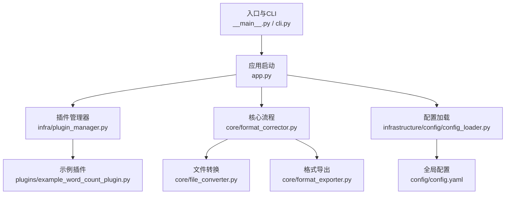
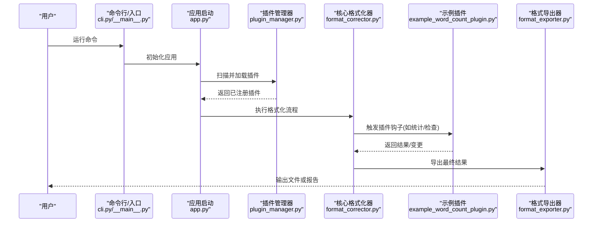
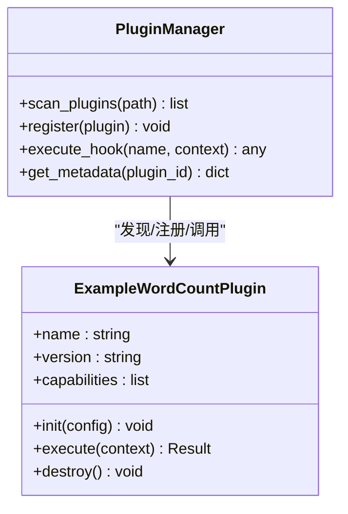
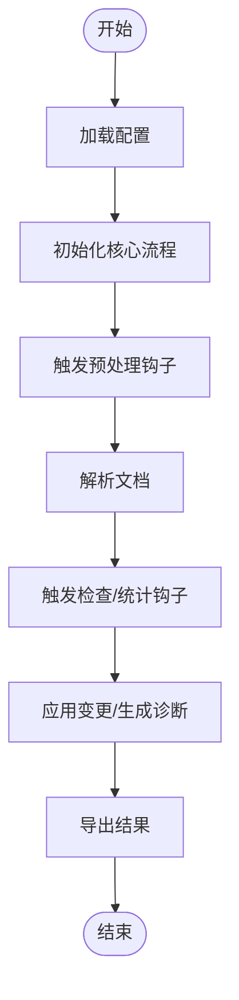
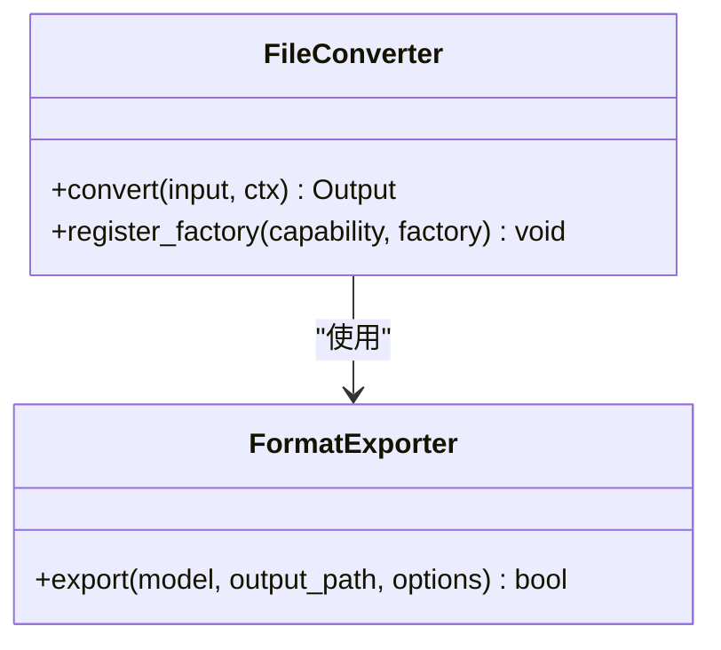
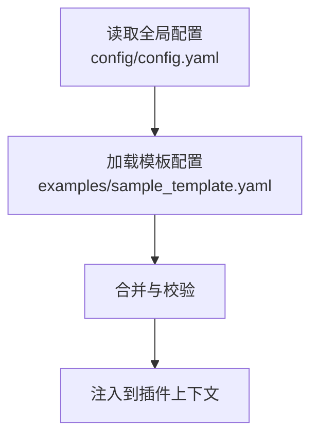
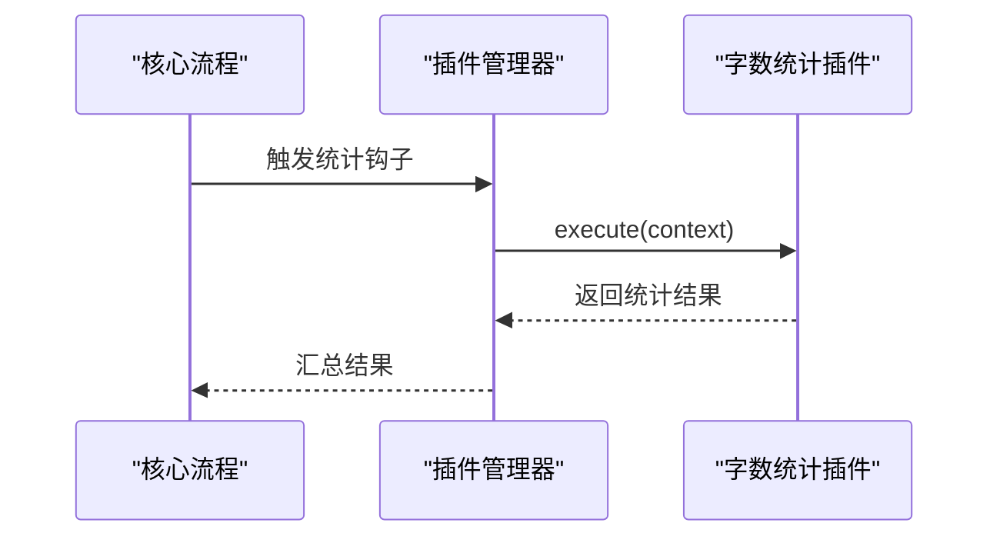
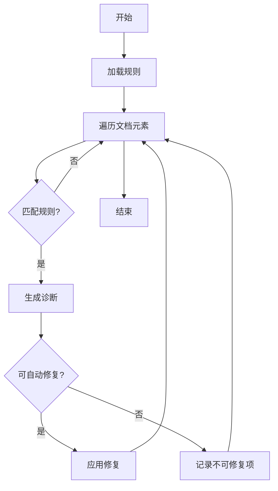
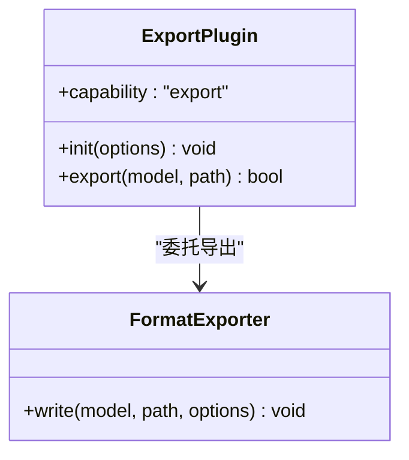
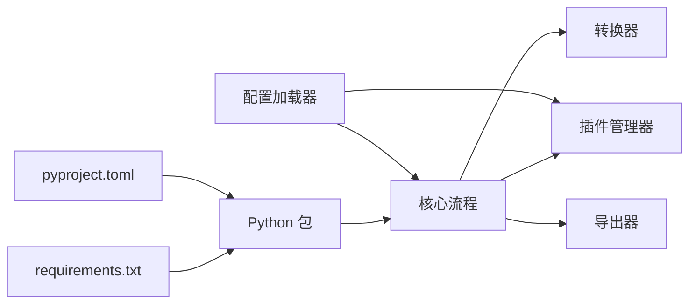

# 插件开发教程

<cite>
**本文引用的文件**   
- [README.md](file://README.md)
- [pyproject.toml](file://pyproject.toml)
- [requirements.txt](file://requirements.txt)
- [run.py](file://run.py)
- [src/paper_format_corrector/app.py](file://src/paper_format_corrector/app.py)
- [src/paper_format_corrector/__main__.py](file://src/paper_format_corrector/__main__.py)
- [src/paper_format_corrector/cli.py](file://src/paper_format_corrector/cli.py)
- [src/paper_format_corrector/infra/plugin_manager.py](file://src/paper_format_corrector/infra/plugin_manager.py)
- [plugins/example_word_count_plugin.py](file://plugins/example_word_count_plugin.py)
- [src/paper_format_corrector/core/format_corrector.py](file://src/paper_format_corrector/core/format_corrector.py)
- [src/paper_format_corrector/core/file_converter.py](file://src/paper_format_corrector/core/file_converter.py)
- [src/paper_format_corrector/core/format_exporter.py](file://src/paper_format_corrector/core/format_exporter.py)
- [src/paper_format_corrector/infrastructure/converters/file_converter.py](file://src/paper_format_corrector/infrastructure/converters/file_converter.py)
- [src/paper_format_corrector/infrastructure/exporters/format_exporter.py](file://src/paper_format_corrector/infrastructure/exporters/format_exporter.py)
- [src/paper_format_corrector/infrastructure/config/config_loader.py](file://src/paper_format_corrector/infrastructure/config/config_loader.py)
- [config/config.yaml](file://config/config.yaml)
- [examples/sample_template.yaml](file://examples/sample_template.yaml)
- [tests/test_basic.py](file://tests/test_basic.py)
- [tests/conftest.py](file://tests/conftest.py)
</cite>

## 目录
1. [简介](#简介)
2. [项目结构](#项目结构)
3. [核心组件](#核心组件)
4. [架构总览](#架构总览)
5. [详细组件分析](#详细组件分析)
6. [依赖关系分析](#依赖关系分析)
7. [性能考虑](#性能考虑)
8. [故障排查指南](#故障排查指南)
9. [结论](#结论)
10. [附录](#附录)

## 简介
本教程面向希望为“论文格式矫正工具”开发自定义插件的开发者。你将学习如何从零开始搭建插件开发环境、组织项目结构、编写符合规范的插件代码，并通过实际示例（字数统计、格式检查、导出转换）掌握不同类型插件的开发方法。文档还涵盖插件配置、参数传递与返回值处理、调试技巧、错误处理、性能优化以及测试方法与最佳实践。

## 项目结构
仓库采用分层与领域驱动相结合的组织方式：应用层、核心能力、基础设施、接口层、插件扩展点等清晰分离。插件系统通过基础设施层的插件管理器进行发现、加载与生命周期管理，核心流程在格式化与转换器中编排调用。

图表来源
- [src/paper_format_corrector/__main__.py](file://src/paper_format_corrector/__main__.py)
- [src/paper_format_corrector/cli.py](file://src/paper_format_corrector/cli.py)
- [src/paper_format_corrector/app.py](file://src/paper_format_corrector/app.py)
- [src/paper_format_corrector/infra/plugin_manager.py](file://src/paper_format_corrector/infra/plugin_manager.py)
- [src/paper_format_corrector/core/format_corrector.py](file://src/paper_format_corrector/core/format_corrector.py)
- [src/paper_format_corrector/core/file_converter.py](file://src/paper_format_corrector/core/file_converter.py)
- [src/paper_format_corrector/core/format_exporter.py](file://src/paper_format_corrector/core/format_exporter.py)
- [plugins/example_word_count_plugin.py](file://plugins/example_word_count_plugin.py)
- [src/paper_format_corrector/infrastructure/config/config_loader.py](file://src/paper_format_corrector/infrastructure/config/config_loader.py)
- [config/config.yaml](file://config/config.yaml)

章节来源
- [README.md](file://README.md)
- [pyproject.toml](file://pyproject.toml)
- [requirements.txt](file://requirements.txt)
- [run.py](file://run.py)

## 核心组件
- 插件管理器：负责插件的发现、注册、生命周期管理与钩子分发。
- 核心格式化器：编排文档解析、规则执行、结果输出等主流程。
- 文件转换器：提供输入到中间表示、中间表示到输出的转换能力。
- 格式导出器：将内部模型导出为目标格式或报告。
- 配置加载器：统一读取并校验配置项，供插件与核心流程使用。
- 示例插件：演示插件的最小可用实现与约定。

章节来源
- [src/paper_format_corrector/infra/plugin_manager.py](file://src/paper_format_corrector/infra/plugin_manager.py)
- [src/paper_format_corrector/core/format_corrector.py](file://src/paper_format_corrector/core/format_corrector.py)
- [src/paper_format_corrector/core/file_converter.py](file://src/paper_format_corrector/core/file_converter.py)
- [src/paper_format_corrector/core/format_exporter.py](file://src/paper_format_corrector/core/format_exporter.py)
- [src/paper_format_corrector/infrastructure/config/config_loader.py](file://src/paper_format_corrector/infrastructure/config/config_loader.py)
- [plugins/example_word_count_plugin.py](file://plugins/example_word_count_plugin.py)

## 架构总览
下图展示了从入口到插件执行的端到端流程，包括配置加载、插件发现、核心流程编排与导出。

图表来源
- [src/paper_format_corrector/cli.py](file://src/paper_format_corrector/cli.py)
- [src/paper_format_corrector/__main__.py](file://src/paper_format_corrector/__main__.py)
- [src/paper_format_corrector/app.py](file://src/paper_format_corrector/app.py)
- [src/paper_format_corrector/infra/plugin_manager.py](file://src/paper_format_corrector/infra/plugin_manager.py)
- [src/paper_format_corrector/core/format_corrector.py](file://src/paper_format_corrector/core/format_corrector.py)
- [plugins/example_word_count_plugin.py](file://plugins/example_word_count_plugin.py)
- [src/paper_format_corrector/core/format_exporter.py](file://src/paper_format_corrector/core/format_exporter.py)

## 详细组件分析

### 插件管理器与插件约定
- 职责
  - 扫描指定目录下的插件模块
  - 根据约定接口注册插件能力（如统计、检查、转换、导出）
  - 维护插件生命周期（初始化、执行、销毁）
  - 向核心流程暴露统一的钩子调用点
- 关键要点
  - 插件命名与路径规范：建议放在 plugins 目录下，以独立模块形式存在
  - 元数据声明：插件需提供名称、版本、描述、能力标签等
  - 钩子契约：定义入参（文档对象、上下文、配置）、出参（结果、变更集、诊断信息）
  - 错误边界：插件抛出异常需被捕获并转换为诊断报告，避免中断整体流程

图表来源
- [src/paper_format_corrector/infra/plugin_manager.py](file://src/paper_format_corrector/infra/plugin_manager.py)
- [plugins/example_word_count_plugin.py](file://plugins/example_word_count_plugin.py)

章节来源
- [src/paper_format_corrector/infra/plugin_manager.py](file://src/paper_format_corrector/infra/plugin_manager.py)
- [plugins/example_word_count_plugin.py](file://plugins/example_word_count_plugin.py)

### 核心格式化器与插件集成
- 职责
  - 编排文档解析、规则执行、插件钩子调用、结果聚合与导出
  - 提供上下文对象给插件（文档句柄、配置、日志、临时目录等）
- 与插件交互
  - 在关键阶段触发插件钩子（如预处理、正文检查、后处理）
  - 收集插件返回的诊断与变更，合并至统一报告
  - 对插件执行进行超时与资源限制控制

图表来源
- [src/paper_format_corrector/core/format_corrector.py](file://src/paper_format_corrector/core/format_corrector.py)
- [src/paper_format_corrector/infra/plugin_manager.py](file://src/paper_format_corrector/infra/plugin_manager.py)

章节来源
- [src/paper_format_corrector/core/format_corrector.py](file://src/paper_format_corrector/core/format_corrector.py)

### 文件转换器与插件扩展
- 职责
  - 提供输入到中间表示、中间表示到目标格式的转换能力
  - 支持插件注册新的转换器（如新增导出格式）
- 插件扩展点
  - 注册转换器工厂与能力标签
  - 接收配置与上下文，返回转换结果或流式输出

图表来源
- [src/paper_format_corrector/core/file_converter.py](file://src/paper_format_corrector/core/file_converter.py)
- [src/paper_format_corrector/core/format_exporter.py](file://src/paper_format_corrector/core/format_exporter.py)
- [src/paper_format_corrector/infrastructure/converters/file_converter.py](file://src/paper_format_corrector/infrastructure/converters/file_converter.py)
- [src/paper_format_corrector/infrastructure/exporters/format_exporter.py](file://src/paper_format_corrector/infrastructure/exporters/format_exporter.py)

章节来源
- [src/paper_format_corrector/core/file_converter.py](file://src/paper_format_corrector/core/file_converter.py)
- [src/paper_format_corrector/core/format_exporter.py](file://src/paper_format_corrector/core/format_exporter.py)
- [src/paper_format_corrector/infrastructure/converters/file_converter.py](file://src/paper_format_corrector/infrastructure/converters/file_converter.py)
- [src/paper_format_corrector/infrastructure/exporters/format_exporter.py](file://src/paper_format_corrector/infrastructure/exporters/format_exporter.py)

### 配置系统与插件参数
- 配置加载
  - 统一由配置加载器读取 YAML/JSON 等配置文件
  - 提供默认值、类型校验与覆盖策略（全局/模板/运行时）
- 插件配置
  - 插件通过能力键名获取自身配置段
  - 支持可选参数、枚举值、范围约束与提示文本

图表来源
- [src/paper_format_corrector/infrastructure/config/config_loader.py](file://src/paper_format_corrector/infrastructure/config/config_loader.py)
- [config/config.yaml](file://config/config.yaml)
- [examples/sample_template.yaml](file://examples/sample_template.yaml)

章节来源
- [src/paper_format_corrector/infrastructure/config/config_loader.py](file://src/paper_format_corrector/infrastructure/config/config_loader.py)
- [config/config.yaml](file://config/config.yaml)
- [examples/sample_template.yaml](file://examples/sample_template.yaml)

### 示例插件：字数统计
- 目标
  - 统计文档中的字符数、段落数、表格行数等基础指标
- 能力标签
  - 统计类（statistics）
- 入参
  - 文档句柄、上下文、插件配置
- 返回
  - 统计结果字典、诊断列表（可选）
- 典型步骤
  - 初始化时校验配置
  - 执行时遍历必要节点进行计数
  - 将结果写入上下文或报告

图表来源
- [plugins/example_word_count_plugin.py](file://plugins/example_word_count_plugin.py)
- [src/paper_format_corrector/infra/plugin_manager.py](file://src/paper_format_corrector/infra/plugin_manager.py)
- [src/paper_format_corrector/core/format_corrector.py](file://src/paper_format_corrector/core/format_corrector.py)

章节来源
- [plugins/example_word_count_plugin.py](file://plugins/example_word_count_plugin.py)

### 示例插件：格式检查
- 目标
  - 基于规则引擎检测标题层级、引用编号、图片标注等规范性问题
- 能力标签
  - 检查类（lint/check）
- 入参
  - 文档句柄、规则集合、上下文
- 返回
  - 诊断列表（位置、级别、消息、修复建议）
- 典型步骤
  - 加载规则
  - 遍历文档元素匹配规则
  - 生成诊断并可选择自动修复

图表来源
- [src/paper_format_corrector/core/format_corrector.py](file://src/paper_format_corrector/core/format_corrector.py)
- [src/paper_format_corrector/infra/plugin_manager.py](file://src/paper_format_corrector/infra/plugin_manager.py)

章节来源
- [src/paper_format_corrector/core/format_corrector.py](file://src/paper_format_corrector/core/format_corrector.py)
- [src/paper_format_corrector/infra/plugin_manager.py](file://src/paper_format_corrector/infra/plugin_manager.py)

### 示例插件：导出转换器
- 目标
  - 将内部文档模型导出为其他格式（如 Markdown、HTML、PDF 等）
- 能力标签
  - 导出类（export）
- 入参
  - 文档模型、输出路径、导出选项
- 返回
  - 成功标志、输出路径、错误信息
- 典型步骤
  - 注册导出工厂
  - 根据选项构建导出器实例
  - 流式或批量写出目标文件

图表来源
- [src/paper_format_corrector/core/format_exporter.py](file://src/paper_format_corrector/core/format_exporter.py)
- [src/paper_format_corrector/infrastructure/exporters/format_exporter.py](file://src/paper_format_corrector/infrastructure/exporters/format_exporter.py)

章节来源
- [src/paper_format_corrector/core/format_exporter.py](file://src/paper_format_corrector/core/format_exporter.py)
- [src/paper_format_corrector/infrastructure/exporters/format_exporter.py](file://src/paper_format_corrector/infrastructure/exporters/format_exporter.py)

## 依赖关系分析
- 外部依赖
  - Python 包依赖通过 requirements.txt 与 pyproject.toml 声明
  - 第三方库用于文档解析、导出、网络请求等
- 内部依赖
  - 插件管理器为核心流程提供插件能力
  - 核心流程依赖转换器与导出器完成数据处理与输出
  - 配置加载器贯穿各层提供统一配置访问

图表来源
- [requirements.txt](file://requirements.txt)
- [pyproject.toml](file://pyproject.toml)
- [src/paper_format_corrector/core/format_corrector.py](file://src/paper_format_corrector/core/format_corrector.py)
- [src/paper_format_corrector/infra/plugin_manager.py](file://src/paper_format_corrector/infra/plugin_manager.py)
- [src/paper_format_corrector/core/file_converter.py](file://src/paper_format_corrector/core/file_converter.py)
- [src/paper_format_corrector/core/format_exporter.py](file://src/paper_format_corrector/core/format_exporter.py)
- [src/paper_format_corrector/infrastructure/config/config_loader.py](file://src/paper_format_corrector/infrastructure/config/config_loader.py)

章节来源
- [requirements.txt](file://requirements.txt)
- [pyproject.toml](file://pyproject.toml)

## 性能考虑
- 插件粒度
  - 尽量将耗时操作拆分到独立插件，避免阻塞主流程
- 并行与批处理
  - 对可并行的任务（如多文档检查）进行并发处理，注意线程安全
- 内存与I/O
  - 大文档采用流式处理与分块读取，减少峰值内存占用
- 缓存与复用
  - 对重复计算的结果进行缓存；共享只读资源（如规则表）
- 超时与限流
  - 为插件执行设置超时与资源上限，防止异常拖垮进程

[本节为通用指导，不直接分析具体文件]

## 故障排查指南
- 常见问题
  - 插件未加载：检查插件路径、命名规范与元数据声明
  - 配置缺失或类型错误：核对配置键名、默认值与校验规则
  - 插件崩溃导致流程中断：确认异常是否被捕获并转为诊断
- 定位手段
  - 启用更详细的日志输出
  - 使用最小复现用例与隔离测试
  - 逐步禁用插件定位冲突
- 恢复策略
  - 回滚到上一稳定版本
  - 降级模式：跳过有问题的插件继续执行

章节来源
- [src/paper_format_corrector/infra/plugin_manager.py](file://src/paper_format_corrector/infra/plugin_manager.py)
- [src/paper_format_corrector/core/format_corrector.py](file://src/paper_format_corrector/core/format_corrector.py)

## 结论
通过本教程，你已了解插件系统的整体架构、插件约定与扩展点，掌握了统计、检查、导出三类插件的实现思路与最佳实践。建议在开发过程中遵循清晰的接口契约、完善的错误处理与充分的测试覆盖，以确保插件的稳定性和可维护性。

## 附录

### 开发环境搭建
- 安装依赖
  - 使用 requirements.txt 或 pyproject.toml 安装所需包
- 运行入口
  - 通过 run.py 或 __main__.py 启动应用
- 插件目录
  - 将自定义插件放入 plugins 目录，确保模块可被扫描与导入

章节来源
- [requirements.txt](file://requirements.txt)
- [pyproject.toml](file://pyproject.toml)
- [run.py](file://run.py)
- [src/paper_format_corrector/__main__.py](file://src/paper_format_corrector/__main__.py)

### 代码编写规范
- 命名与结构
  - 插件文件名与类名保持一致，提供清晰的元数据
- 接口契约
  - 严格遵循插件管理器定义的入参与出参结构
- 日志与诊断
  - 记录关键步骤与异常堆栈，便于追踪
- 配置校验
  - 在初始化阶段校验配置，失败即快速报错

章节来源
- [plugins/example_word_count_plugin.py](file://plugins/example_word_count_plugin.py)
- [src/paper_format_corrector/infra/plugin_manager.py](file://src/paper_format_corrector/infra/plugin_manager.py)

### 调试技巧
- 断点与单步
  - 在插件钩子入口与关键分支设置断点
- 日志分级
  - 使用不同日志级别区分信息、警告与错误
- 最小化用例
  - 构造最小文档与配置复现问题

章节来源
- [src/paper_format_corrector/core/format_corrector.py](file://src/paper_format_corrector/core/format_corrector.py)
- [src/paper_format_corrector/infra/plugin_manager.py](file://src/paper_format_corrector/infra/plugin_manager.py)

### 错误处理与返回值
- 异常转诊断
  - 插件异常应转换为结构化诊断，包含位置、级别与建议
- 返回值约定
  - 明确返回类型（布尔、字典、列表），并在文档中说明
- 幂等性
  - 插件执行应具备幂等性，避免重复执行产生副作用

章节来源
- [src/paper_format_corrector/core/format_corrector.py](file://src/paper_format_corrector/core/format_corrector.py)
- [plugins/example_word_count_plugin.py](file://plugins/example_word_count_plugin.py)

### 插件测试方法与最佳实践
- 单元测试
  - 针对插件逻辑编写用例，覆盖正常与异常路径
- 集成测试
  - 模拟完整流程，验证插件与核心流程协作
- 测试数据
  - 准备多样化样本文档与配置，提升覆盖率
- 持续集成
  - 在 CI 中运行测试，保证质量门禁

章节来源
- [tests/test_basic.py](file://tests/test_basic.py)
- [tests/conftest.py](file://tests/conftest.py)