# 插件扩展系统

<cite>
**本文引用的文件**   
- [src/paper_format_corrector/infra/plugin_manager.py](file://src/paper_format_corrector/infra/plugin_manager.py)
- [plugins/example_word_count_plugin.py](file://plugins/example_word_count_plugin.py)
- [src/paper_format_corrector/domain/events/__init__.py](file://src/paper_format_corrector/domain/events/__init__.py)
- [src/paper_format_corrector/core/format_corrector.py](file://src/paper_format_corrector/core/format_corrector.py)
- [src/paper_format_corrector/core/file_converter.py](file://src/paper_format_corrector/core/file_converter.py)
- [src/paper_format_corrector/core/format_exporter.py](file://src/paper_format_corrector/core/format_exporter.py)
- [src/paper_format_corrector/application/services/style_workbench.py](file://src/paper_format_corrector/application/services/style_workbench.py)
- [src/paper_format_corrector/interfaces/api/app.py](file://src/paper_format_corrector/interfaces/api/app.py)
- [src/paper_format_corrector/infra/external_tools.py](file://src/paper_format_corrector/infra/external_tools.py)
- [config/config.yaml](file://config/config.yaml)
</cite>

## 目录
1. [简介](#简介)
2. [项目结构](#项目结构)
3. [核心组件](#核心组件)
4. [架构总览](#架构总览)
5. [详细组件分析](#详细组件分析)
6. [依赖关系分析](#依赖关系分析)
7. [性能考虑](#性能考虑)
8. [故障排查指南](#故障排查指南)
9. [结论](#结论)
10. [附录](#附录)

## 简介
本指南面向希望为论文格式矫正工具开发插件的开发者，围绕“插件架构设计、生命周期管理、钩子机制与事件驱动模型”展开，提供从接口规范、基类定义、依赖注入到配置管理的完整框架说明，并给出字数统计、格式检查、导出转换等示例插件的实现思路。文档同时覆盖插件注册、发现、加载与执行机制，以及测试、调试、打包与分发的全流程实践建议。

## 项目结构
仓库采用分层与领域驱动相结合的组织方式：
- 应用层服务编排工作流（如样式工作台）
- 核心处理管线（格式化、转换、导出）
- 基础设施层提供插件管理器、外部工具集成、配置加载等能力
- 插件目录 plugins 用于存放第三方或自定义插件
- 配置 config 提供全局与插件级配置入口

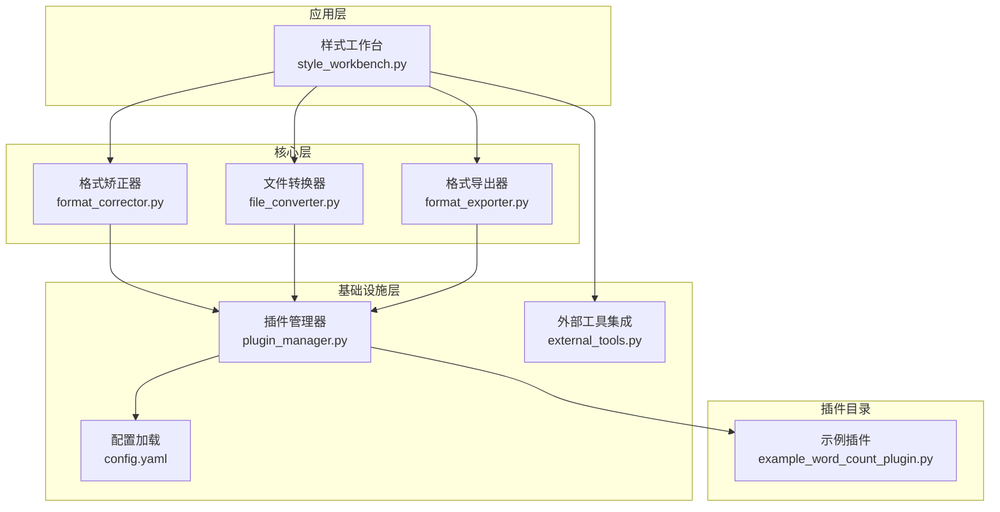

图表来源
- [src/paper_format_corrector/application/services/style_workbench.py](file://src/paper_format_corrector/application/services/style_workbench.py)
- [src/paper_format_corrector/core/format_corrector.py](file://src/paper_format_corrector/core/format_corrector.py)
- [src/paper_format_corrector/core/file_converter.py](file://src/paper_format_corrector/core/file_converter.py)
- [src/paper_format_corrector/core/format_exporter.py](file://src/paper_format_corrector/core/format_exporter.py)
- [src/paper_format_corrector/infra/plugin_manager.py](file://src/paper_format_corrector/infra/plugin_manager.py)
- [src/paper_format_corrector/infra/external_tools.py](file://src/paper_format_corrector/infra/external_tools.py)
- [config/config.yaml](file://config/config.yaml)
- [plugins/example_word_count_plugin.py](file://plugins/example_word_count_plugin.py)

章节来源
- [src/paper_format_corrector/application/services/style_workbench.py](file://src/paper_format_corrector/application/services/style_workbench.py)
- [src/paper_format_corrector/core/format_corrector.py](file://src/paper_format_corrector/core/format_corrector.py)
- [src/paper_format_corrector/core/file_converter.py](file://src/paper_format_corrector/core/file_converter.py)
- [src/paper_format_corrector/core/format_exporter.py](file://src/paper_format_corrector/core/format_exporter.py)
- [src/paper_format_corrector/infra/plugin_manager.py](file://src/paper_format_corrector/infra/plugin_manager.py)
- [src/paper_format_corrector/infra/external_tools.py](file://src/paper_format_corrector/infra/external_tools.py)
- [config/config.yaml](file://config/config.yaml)
- [plugins/example_word_count_plugin.py](file://plugins/example_word_count_plugin.py)

## 核心组件
- 插件管理器：负责插件的发现、注册、生命周期管理与钩子分发，是插件体系的核心枢纽。
- 示例插件：展示如何声明元数据、实现处理器、接入配置与事件。
- 事件总线：提供事件发布/订阅能力，支撑异步解耦与跨模块通信。
- 核心处理管线：在格式化、转换、导出流程中通过插件管理器调用已注册的插件能力。
- 外部工具集成：为插件提供调用外部程序或服务的统一通道。
- 配置管理：集中式配置加载，支持全局与插件级配置项。

章节来源
- [src/paper_format_corrector/infra/plugin_manager.py](file://src/paper_format_corrector/infra/plugin_manager.py)
- [plugins/example_word_count_plugin.py](file://plugins/example_word_count_plugin.py)
- [src/paper_format_corrector/domain/events/__init__.py](file://src/paper_format_corrector/domain/events/__init__.py)
- [src/paper_format_corrector/core/format_corrector.py](file://src/paper_format_corrector/core/format_corrector.py)
- [src/paper_format_corrector/core/file_converter.py](file://src/paper_format_corrector/core/file_converter.py)
- [src/paper_format_corrector/core/format_exporter.py](file://src/paper_format_corrector/core/format_exporter.py)
- [src/paper_format_corrector/infra/external_tools.py](file://src/paper_format_corrector/infra/external_tools.py)
- [config/config.yaml](file://config/config.yaml)

## 架构总览
插件系统以“插件管理器 + 事件总线”为核心，贯穿核心处理管线与应用服务。核心管线在关键阶段触发事件，插件管理器将事件路由至对应插件；插件也可主动发布事件，形成双向解耦的协作模式。

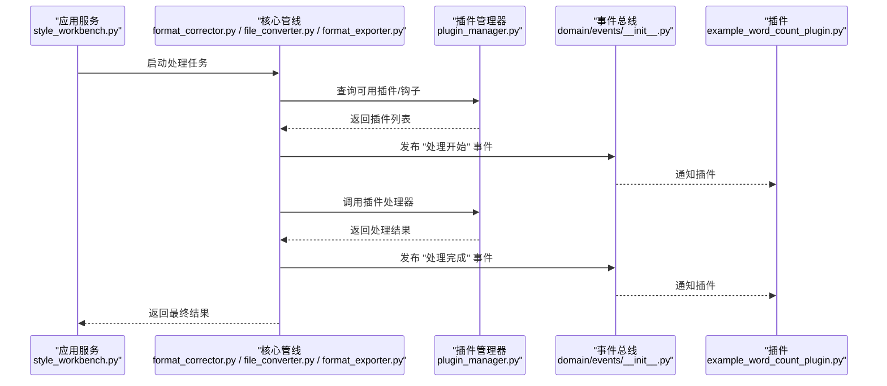

图表来源
- [src/paper_format_corrector/application/services/style_workbench.py](file://src/paper_format_corrector/application/services/style_workbench.py)
- [src/paper_format_corrector/core/format_corrector.py](file://src/paper_format_corrector/core/format_corrector.py)
- [src/paper_format_corrector/core/file_converter.py](file://src/paper_format_corrector/core/file_converter.py)
- [src/paper_format_corrector/core/format_exporter.py](file://src/paper_format_corrector/core/format_exporter.py)
- [src/paper_format_corrector/infra/plugin_manager.py](file://src/paper_format_corrector/infra/plugin_manager.py)
- [src/paper_format_corrector/domain/events/__init__.py](file://src/paper_format_corrector/domain/events/__init__.py)
- [plugins/example_word_count_plugin.py](file://plugins/example_word_count_plugin.py)

## 详细组件分析

### 插件管理器（PluginManager）
职责
- 插件发现：扫描指定目录（如 plugins），识别可加载的插件模块。
- 插件注册：解析插件元信息（名称、版本、描述、钩子类型等）。
- 生命周期管理：初始化、启用、禁用、销毁。
- 钩子分发：根据事件或阶段回调，调度匹配的插件处理器。
- 配置注入：将配置项注入插件上下文。
- 错误隔离：捕获插件异常，避免影响核心流程。

关键交互
- 被核心管线在预处理、处理、后处理阶段调用。
- 与事件总线协作，发布/订阅事件。
- 读取配置，按插件名或标签过滤。

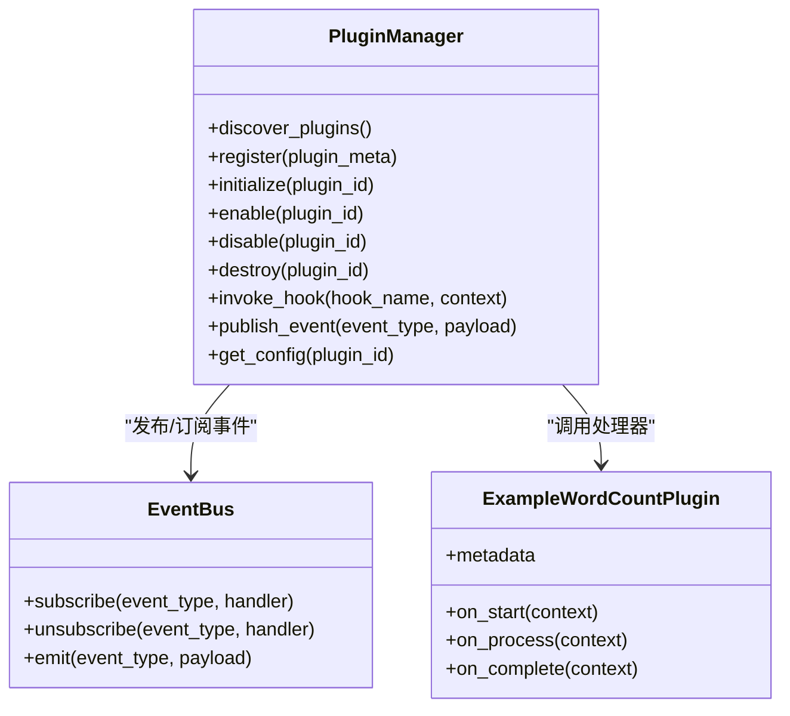

图表来源
- [src/paper_format_corrector/infra/plugin_manager.py](file://src/paper_format_corrector/infra/plugin_manager.py)
- [src/paper_format_corrector/domain/events/__init__.py](file://src/paper_format_corrector/domain/events/__init__.py)
- [plugins/example_word_count_plugin.py](file://plugins/example_word_count_plugin.py)

章节来源
- [src/paper_format_corrector/infra/plugin_manager.py](file://src/paper_format_corrector/infra/plugin_manager.py)

### 示例插件：字数统计（Example Word Count Plugin）
角色
- 作为轻量型分析插件，演示如何在处理前后收集统计信息。
- 通过钩子或事件参与核心流程，不修改文档内容。

典型行为
- 在“处理开始”时记录初始状态。
- 在“处理完成”时汇总统计指标（如字符数、段落数等）。
- 将结果写入报告或输出上下文。

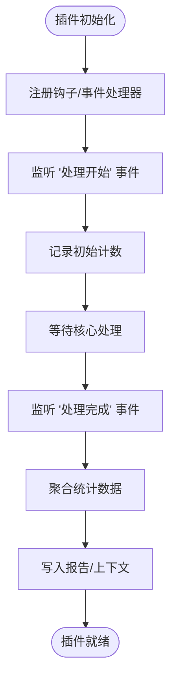

图表来源
- [plugins/example_word_count_plugin.py](file://plugins/example_word_count_plugin.py)
- [src/paper_format_corrector/domain/events/__init__.py](file://src/paper_format_corrector/domain/events/__init__.py)

章节来源
- [plugins/example_word_count_plugin.py](file://plugins/example_word_count_plugin.py)

### 核心管线中的插件集成点
- 格式矫正器：在文本规范化、段落重组、引用处理等阶段触发事件，允许插件进行校验或增强。
- 文件转换器：在输入解析、中间表示构建、输出编码阶段暴露钩子，供插件介入。
- 格式导出器：在导出前/后阶段提供钩子，便于插件做格式适配或附加产物生成。

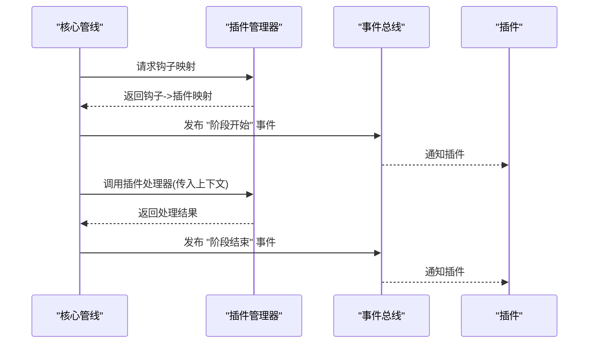

图表来源
- [src/paper_format_corrector/core/format_corrector.py](file://src/paper_format_corrector/core/format_corrector.py)
- [src/paper_format_corrector/core/file_converter.py](file://src/paper_format_corrector/core/file_converter.py)
- [src/paper_format_corrector/core/format_exporter.py](file://src/paper_format_corrector/core/format_exporter.py)
- [src/paper_format_corrector/infra/plugin_manager.py](file://src/paper_format_corrector/infra/plugin_manager.py)
- [src/paper_format_corrector/domain/events/__init__.py](file://src/paper_format_corrector/domain/events/__init__.py)

章节来源
- [src/paper_format_corrector/core/format_corrector.py](file://src/paper_format_corrector/core/format_corrector.py)
- [src/paper_format_corrector/core/file_converter.py](file://src/paper_format_corrector/core/file_converter.py)
- [src/paper_format_corrector/core/format_exporter.py](file://src/paper_format_corrector/core/format_exporter.py)

### 事件驱动模型
事件类型建议
- 生命周期事件：处理开始、处理完成、错误发生、资源释放。
- 业务事件：文档解析完成、规则匹配、导出完成。
- 诊断事件：耗时统计、内存使用、插件调用次数。

事件发布/订阅
- 插件管理器负责将事件路由到已订阅的插件处理器。
- 插件可通过事件总线发布自定义事件，供其他插件消费。

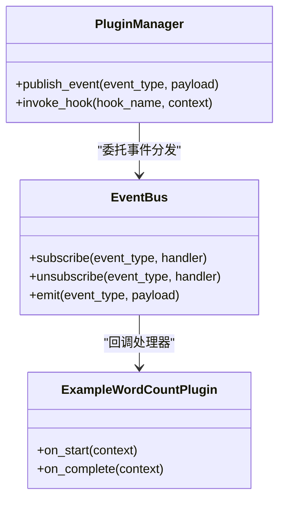

图表来源
- [src/paper_format_corrector/domain/events/__init__.py](file://src/paper_format_corrector/domain/events/__init__.py)
- [src/paper_format_corrector/infra/plugin_manager.py](file://src/paper_format_corrector/infra/plugin_manager.py)
- [plugins/example_word_count_plugin.py](file://plugins/example_word_count_plugin.py)

章节来源
- [src/paper_format_corrector/domain/events/__init__.py](file://src/paper_format_corrector/domain/events/__init__.py)
- [src/paper_format_corrector/infra/plugin_manager.py](file://src/paper_format_corrector/infra/plugin_manager.py)

### 钩子机制与生命周期
钩子类型
- 预处理钩子：在核心处理前运行，适合准备上下文、加载资源。
- 处理钩子：在核心逻辑中运行，适合插入校验、转换、增强。
- 后处理钩子：在核心处理后运行，适合生成报告、清理资源。

生命周期阶段
- 发现：扫描插件目录，解析元数据。
- 注册：建立钩子与插件的映射。
- 初始化：按需加载依赖，读取配置。
- 启用/禁用：控制插件是否参与处理。
- 销毁：释放资源，清理状态。

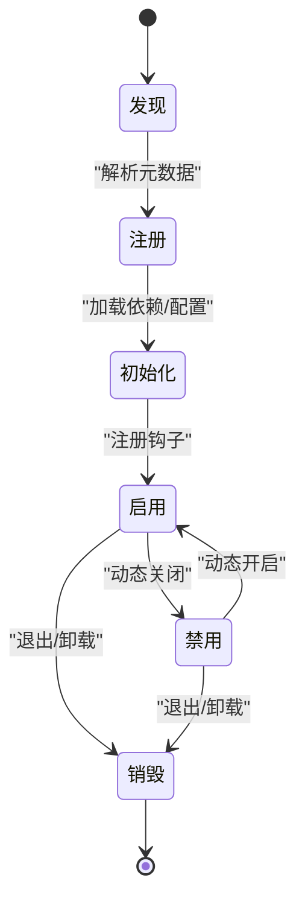

图表来源
- [src/paper_format_corrector/infra/plugin_manager.py](file://src/paper_format_corrector/infra/plugin_manager.py)

章节来源
- [src/paper_format_corrector/infra/plugin_manager.py](file://src/paper_format_corrector/infra/plugin_manager.py)

### 依赖注入与配置管理
依赖注入
- 插件管理器向插件注入上下文对象（包含配置、日志、IO、外部工具客户端等）。
- 插件通过上下文访问共享能力，避免硬耦合。

配置管理
- 全局配置位于配置文件，插件可按命名空间读取自身配置项。
- 支持默认值与覆盖策略，确保插件可独立部署与配置。

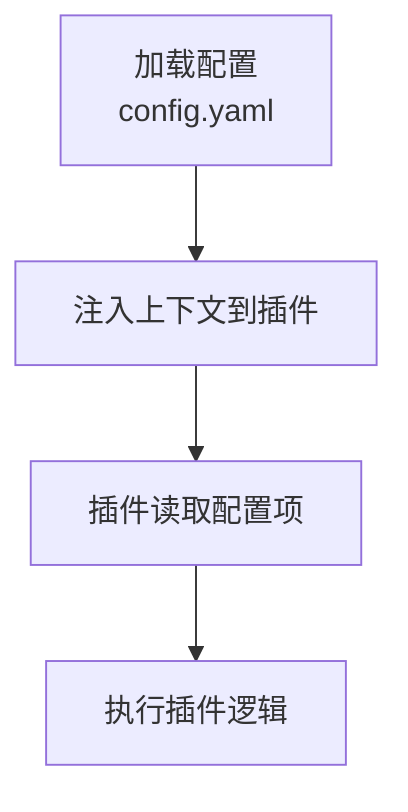

图表来源
- [src/paper_format_corrector/infra/plugin_manager.py](file://src/paper_format_corrector/infra/plugin_manager.py)
- [config/config.yaml](file://config/config.yaml)

章节来源
- [src/paper_format_corrector/infra/plugin_manager.py](file://src/paper_format_corrector/infra/plugin_manager.py)
- [config/config.yaml](file://config/config.yaml)

### 集成外部服务
外部工具集成
- 通过统一的外部工具客户端调用命令行工具或服务端 API。
- 插件可在处理钩子中调用外部服务，例如 OCR、翻译、查重等。

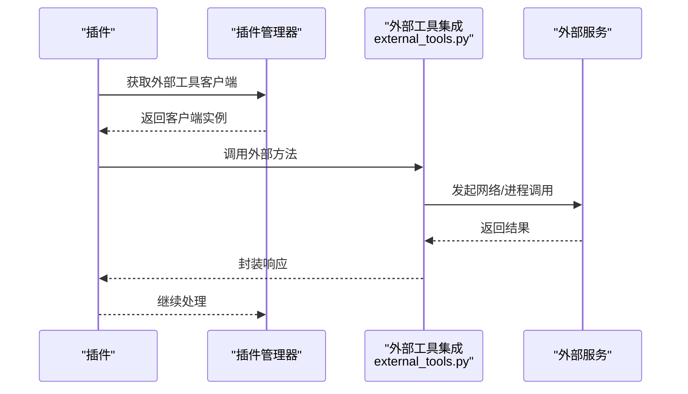

图表来源
- [src/paper_format_corrector/infra/external_tools.py](file://src/paper_format_corrector/infra/external_tools.py)
- [src/paper_format_corrector/infra/plugin_manager.py](file://src/paper_format_corrector/infra/plugin_manager.py)

章节来源
- [src/paper_format_corrector/infra/external_tools.py](file://src/paper_format_corrector/infra/external_tools.py)

### 插件开发示例
- 字数统计插件：参考示例插件路径，了解如何声明元数据、注册事件处理器、读取配置与输出统计。
- 格式检查插件：在处理钩子中实现规则匹配与问题上报，结合事件总线发布诊断事件。
- 导出转换器：在导出前后钩子中实现格式适配、附件合并、元数据补充。

章节来源
- [plugins/example_word_count_plugin.py](file://plugins/example_word_count_plugin.py)

### API 与服务编排
- 应用服务（样式工作台）编排核心管线，并在需要时通过插件管理器扩展能力。
- API 层暴露处理入口，内部调用应用服务与核心管线，插件能力透明接入。

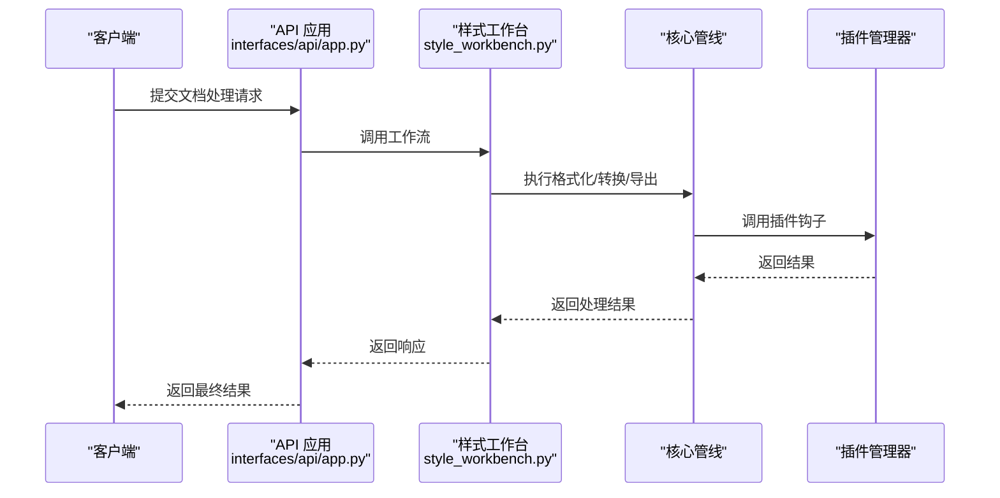

图表来源
- [src/paper_format_corrector/interfaces/api/app.py](file://src/paper_format_corrector/interfaces/api/app.py)
- [src/paper_format_corrector/application/services/style_workbench.py](file://src/paper_format_corrector/application/services/style_workbench.py)
- [src/paper_format_corrector/core/format_corrector.py](file://src/paper_format_corrector/core/format_corrector.py)
- [src/paper_format_corrector/core/file_converter.py](file://src/paper_format_corrector/core/file_converter.py)
- [src/paper_format_corrector/core/format_exporter.py](file://src/paper_format_corrector/core/format_exporter.py)
- [src/paper_format_corrector/infra/plugin_manager.py](file://src/paper_format_corrector/infra/plugin_manager.py)

章节来源
- [src/paper_format_corrector/interfaces/api/app.py](file://src/paper_format_corrector/interfaces/api/app.py)
- [src/paper_format_corrector/application/services/style_workbench.py](file://src/paper_format_corrector/application/services/style_workbench.py)

## 依赖关系分析
- 插件管理器对事件总线有直接依赖，用于事件分发。
- 核心管线通过插件管理器间接依赖插件，保持松耦合。
- 外部工具集成为插件提供统一的 I/O 抽象。
- 配置管理贯穿插件生命周期，提供可插拔的配置源。

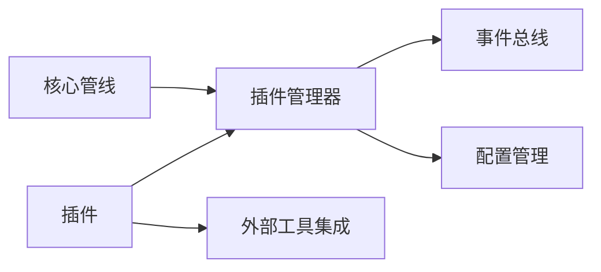

图表来源
- [src/paper_format_corrector/infra/plugin_manager.py](file://src/paper_format_corrector/infra/plugin_manager.py)
- [src/paper_format_corrector/domain/events/__init__.py](file://src/paper_format_corrector/domain/events/__init__.py)
- [src/paper_format_corrector/infra/external_tools.py](file://src/paper_format_corrector/infra/external_tools.py)
- [config/config.yaml](file://config/config.yaml)

章节来源
- [src/paper_format_corrector/infra/plugin_manager.py](file://src/paper_format_corrector/infra/plugin_manager.py)
- [src/paper_format_corrector/domain/events/__init__.py](file://src/paper_format_corrector/domain/events/__init__.py)
- [src/paper_format_corrector/infra/external_tools.py](file://src/paper_format_corrector/infra/external_tools.py)
- [config/config.yaml](file://config/config.yaml)

## 性能考虑
- 插件发现与注册应缓存结果，避免重复扫描。
- 事件分发需支持批量处理与异步执行，降低阻塞。
- 插件处理器应避免长耗时操作，必要时使用队列与超时控制。
- 外部工具调用需连接池与重试策略，防止雪崩。
- 配置读取应懒加载与局部缓存，减少 IO 开销。

## 故障排查指南
常见问题
- 插件未生效：检查插件目录、元数据、钩子注册是否正确。
- 事件未触发：确认事件类型与订阅者匹配，查看事件总线日志。
- 外部服务失败：检查网络连通性、认证配置与超时设置。
- 配置未注入：核对配置键名与作用域，确认插件命名空间。

定位步骤
- 启用详细日志，关注插件管理器与事件总线输出。
- 逐步禁用插件，缩小问题范围。
- 使用最小化配置复现问题，验证是否为配置冲突。

章节来源
- [src/paper_format_corrector/infra/plugin_manager.py](file://src/paper_format_corrector/infra/plugin_manager.py)
- [src/paper_format_corrector/domain/events/__init__.py](file://src/paper_format_corrector/domain/events/__init__.py)
- [src/paper_format_corrector/infra/external_tools.py](file://src/paper_format_corrector/infra/external_tools.py)

## 结论
本插件扩展系统以插件管理器为中心，结合事件驱动与钩子机制，实现了核心管线与扩展能力的解耦。通过清晰的接口规范、依赖注入与配置管理，开发者可以快速构建自定义格式化规则、数据处理工具与外部服务集成。配合完善的测试、调试、打包与分发流程，插件生态将具备高可扩展性与稳定性。

## 附录
- 插件开发清单
  - 定义插件元数据（名称、版本、描述、钩子类型）
  - 实现生命周期处理器（初始化、启用、禁用、销毁）
  - 注册钩子与事件处理器
  - 读取配置与注入依赖
  - 编写单元测试与集成测试
  - 打包与分发（遵循仓库约定）
- 最佳实践
  - 保持插件无副作用与幂等性
  - 合理划分钩子粒度，避免过度耦合
  - 对外部依赖进行抽象与模拟，提升可测试性
  - 提供清晰的使用文档与配置示例