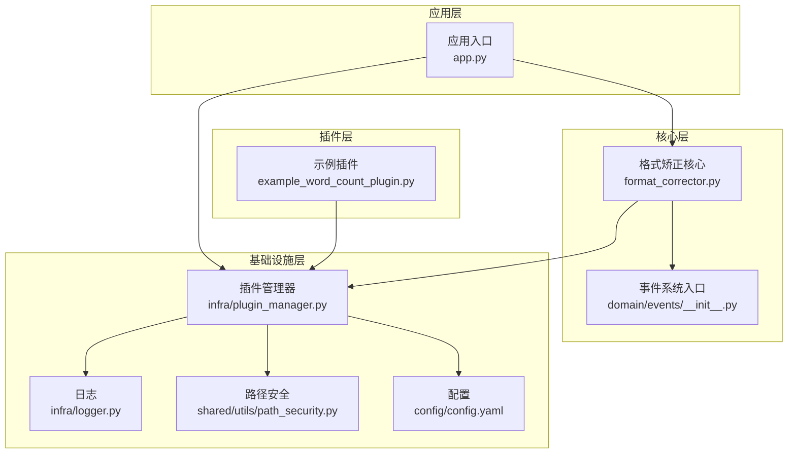
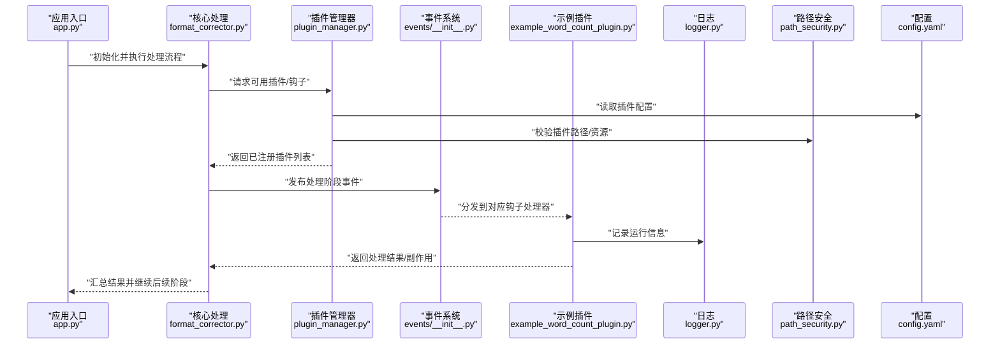
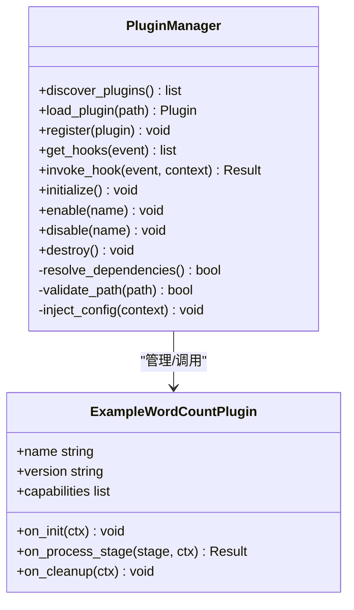
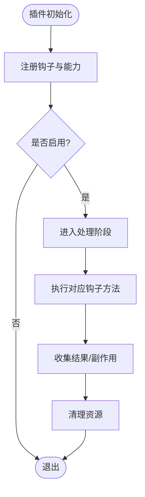
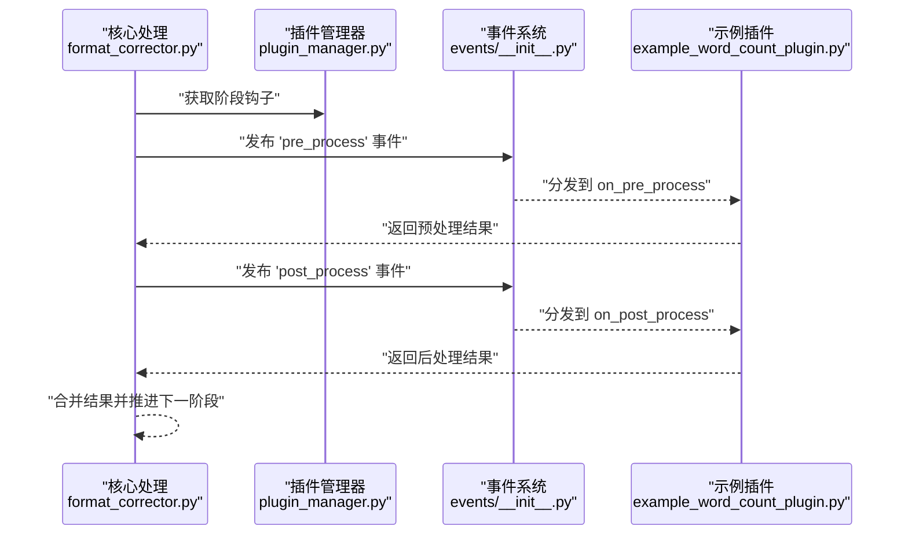
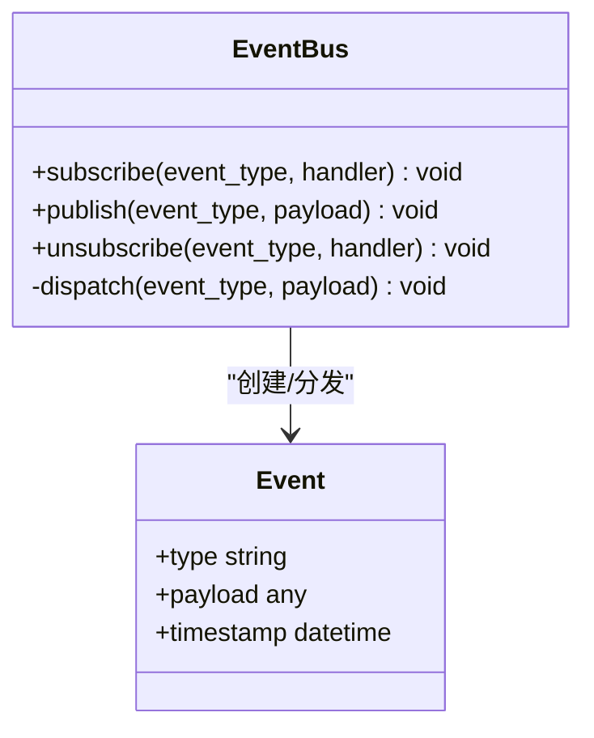
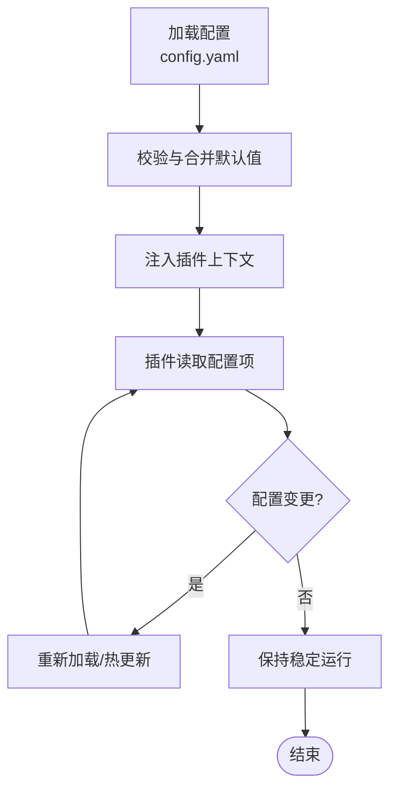
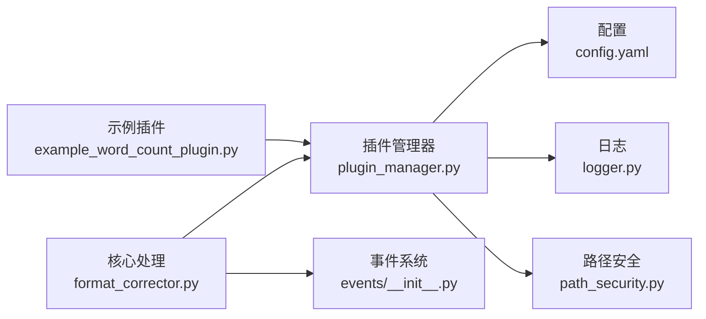

# 插件架构设计

<cite>
**本文引用的文件**   
- [src/paper_format_corrector/infra/plugin_manager.py](file://src/paper_format_corrector/infra/plugin_manager.py)
- [plugins/example_word_count_plugin.py](file://plugins/example_word_count_plugin.py)
- [src/paper_format_corrector/app.py](file://src/paper_format_corrector/app.py)
- [src/paper_format_corrector/core/format_corrector.py](file://src/paper_format_corrector/core/format_corrector.py)
- [src/paper_format_corrector/domain/events/__init__.py](file://src/paper_format_corrector/domain/events/__init__.py)
- [src/paper_format_corrector/infra/logger.py](file://src/paper_format_corrector/infra/logger.py)
- [config/config.yaml](file://config/config.yaml)
- [src/paper_format_corrector/shared/utils/path_security.py](file://src/paper_format_corrector/shared/utils/path_security.py)
</cite>

## 目录
1. [简介](#简介)
2. [项目结构](#项目结构)
3. [核心组件](#核心组件)
4. [架构总览](#架构总览)
5. [详细组件分析](#详细组件分析)
6. [依赖关系分析](#依赖关系分析)
7. [性能考虑](#性能考虑)
8. [故障排查指南](#故障排查指南)
9. [结论](#结论)
10. [附录](#附录)

## 简介
本技术文档围绕“论文格式矫正工具”的插件架构进行系统化说明，重点覆盖以下方面：
- 插件管理器与生命周期管理
- 钩子机制与事件驱动模型
- 插件注册发现、依赖注入与配置管理
- 插件与核心系统的交互模式（数据流与控制流）
- 插件接口规范、基类定义与扩展点设计
- 安全隔离、权限控制与资源管理

目标读者包括插件开发者、系统集成工程师与维护人员。

## 项目结构
从仓库结构看，插件相关代码主要分布在以下位置：
- 插件运行时与基础设施：src/paper_format_corrector/infra/plugin_manager.py
- 示例插件：plugins/example_word_count_plugin.py
- 应用启动与装配：src/paper_format_corrector/app.py
- 核心处理管线：src/paper_format_corrector/core/format_corrector.py
- 事件系统入口：src/paper_format_corrector/domain/events/__init__.py
- 日志基础设施：src/paper_format_corrector/infra/logger.py
- 全局配置：config/config.yaml
- 路径安全工具：src/paper_format_corrector/shared/utils/path_security.py

图表来源
- [src/paper_format_corrector/app.py](file://src/paper_format_corrector/app.py)
- [src/paper_format_corrector/core/format_corrector.py](file://src/paper_format_corrector/core/format_corrector.py)
- [src/paper_format_corrector/infra/plugin_manager.py](file://src/paper_format_corrector/infra/plugin_manager.py)
- [src/paper_format_corrector/domain/events/__init__.py](file://src/paper_format_corrector/domain/events/__init__.py)
- [src/paper_format_corrector/infra/logger.py](file://src/paper_format_corrector/infra/logger.py)
- [src/paper_format_corrector/shared/utils/path_security.py](file://src/paper_format_corrector/shared/utils/path_security.py)
- [config/config.yaml](file://config/config.yaml)
- [plugins/example_word_count_plugin.py](file://plugins/example_word_count_plugin.py)

章节来源
- [src/paper_format_corrector/app.py](file://src/paper_format_corrector/app.py)
- [src/paper_format_corrector/core/format_corrector.py](file://src/paper_format_corrector/core/format_corrector.py)
- [src/paper_format_corrector/infra/plugin_manager.py](file://src/paper_format_corrector/infra/plugin_manager.py)
- [plugins/example_word_count_plugin.py](file://plugins/example_word_count_plugin.py)
- [src/paper_format_corrector/domain/events/__init__.py](file://src/paper_format_corrector/domain/events/__init__.py)
- [src/paper_format_corrector/infra/logger.py](file://src/paper_format_corrector/infra/logger.py)
- [config/config.yaml](file://config/config.yaml)
- [src/paper_format_corrector/shared/utils/path_security.py](file://src/paper_format_corrector/shared/utils/path_security.py)

## 核心组件
本节聚焦插件架构的关键构件及其职责：
- 插件管理器：负责插件的发现、加载、注册、生命周期管理与钩子调度。
- 示例插件：演示如何声明能力、注册钩子、消费配置与上报结果。
- 核心处理管线：在关键阶段触发事件或调用插件钩子，形成可扩展的处理流程。
- 事件系统：提供发布/订阅通道，解耦核心与插件之间的通信。
- 配置与日志：为插件提供可插拔的配置读取与结构化日志输出。
- 路径安全：对插件访问的文件路径进行白名单校验与安全限制。

章节来源
- [src/paper_format_corrector/infra/plugin_manager.py](file://src/paper_format_corrector/infra/plugin_manager.py)
- [plugins/example_word_count_plugin.py](file://plugins/example_word_count_plugin.py)
- [src/paper_format_corrector/core/format_corrector.py](file://src/paper_format_corrector/core/format_corrector.py)
- [src/paper_format_corrector/domain/events/__init__.py](file://src/paper_format_corrector/domain/events/__init__.py)
- [src/paper_format_corrector/infra/logger.py](file://src/paper_format_corrector/infra/logger.py)
- [config/config.yaml](file://config/config.yaml)
- [src/paper_format_corrector/shared/utils/path_security.py](file://src/paper_format_corrector/shared/utils/path_security.py)

## 架构总览
下图展示插件系统与核心处理管线的整体交互关系，以及数据与控制流向。

图表来源
- [src/paper_format_corrector/app.py](file://src/paper_format_corrector/app.py)
- [src/paper_format_corrector/core/format_corrector.py](file://src/paper_format_corrector/core/format_corrector.py)
- [src/paper_format_corrector/infra/plugin_manager.py](file://src/paper_format_corrector/infra/plugin_manager.py)
- [src/paper_format_corrector/domain/events/__init__.py](file://src/paper_format_corrector/domain/events/__init__.py)
- [plugins/example_word_count_plugin.py](file://plugins/example_word_count_plugin.py)
- [src/paper_format_corrector/infra/logger.py](file://src/paper_format_corrector/infra/logger.py)
- [src/paper_format_corrector/shared/utils/path_security.py](file://src/paper_format_corrector/shared/utils/path_security.py)
- [config/config.yaml](file://config/config.yaml)

## 详细组件分析

### 插件管理器（PluginManager）
职责与能力
- 插件发现：扫描指定目录或清单，识别可加载的插件模块。
- 插件加载：动态导入插件模块，实例化插件对象。
- 插件注册：维护插件元数据（名称、版本、能力、钩子映射）。
- 生命周期管理：提供初始化、启用、禁用、销毁等状态转换。
- 钩子调度：根据事件或阶段回调，按优先级顺序调用插件钩子。
- 依赖解析：基于声明式依赖图，确保插件加载顺序正确。
- 配置注入：将配置项以只读形式注入插件上下文。
- 安全校验：结合路径安全工具，限制插件对文件系统与外部资源的访问范围。

关键交互
- 与配置中心交互：读取插件开关、参数、白名单等。
- 与日志系统交互：记录加载、错误、统计信息。
- 与核心管线交互：暴露钩子注册表与调用入口。

图表来源
- [src/paper_format_corrector/infra/plugin_manager.py](file://src/paper_format_corrector/infra/plugin_manager.py)
- [plugins/example_word_count_plugin.py](file://plugins/example_word_count_plugin.py)

章节来源
- [src/paper_format_corrector/infra/plugin_manager.py](file://src/paper_format_corrector/infra/plugin_manager.py)

### 示例插件（Example Word Count Plugin）
角色定位
- 演示插件的基本结构：元数据声明、钩子实现、配置使用、日志输出。
- 展示如何在特定处理阶段（如预处理、后处理）插入自定义逻辑。
- 展示如何通过事件系统参与核心流程。

典型行为
- 在初始化阶段注册自身钩子。
- 在处理阶段统计词数或执行轻量检查。
- 在清理阶段释放临时资源。

图表来源
- [plugins/example_word_count_plugin.py](file://plugins/example_word_count_plugin.py)

章节来源
- [plugins/example_word_count_plugin.py](file://plugins/example_word_count_plugin.py)

### 核心处理管线（Format Corrector）
职责与能力
- 编排文档处理的各个阶段（解析、校正、导出等）。
- 在关键阶段发布事件，允许插件通过钩子介入。
- 聚合插件返回的结果，驱动后续步骤。

与插件的协作
- 通过插件管理器查询当前可用的钩子。
- 按阶段顺序调用钩子，支持短路或中止策略。
- 将上下文（如文档句柄、配置快照、临时目录）传递给插件。

图表来源
- [src/paper_format_corrector/core/format_corrector.py](file://src/paper_format_corrector/core/format_corrector.py)
- [src/paper_format_corrector/infra/plugin_manager.py](file://src/paper_format_corrector/infra/plugin_manager.py)
- [src/paper_format_corrector/domain/events/__init__.py](file://src/paper_format_corrector/domain/events/__init__.py)
- [plugins/example_word_count_plugin.py](file://plugins/example_word_count_plugin.py)

章节来源
- [src/paper_format_corrector/core/format_corrector.py](file://src/paper_format_corrector/core/format_corrector.py)

### 事件系统（Events）
职责与能力
- 提供发布/订阅通道，解耦核心与插件。
- 支持事件类型、优先级与过滤器。
- 保证事件传播的顺序性与一致性。

与插件的协作
- 插件在初始化时订阅感兴趣的事件。
- 核心在关键节点发布事件，携带上下文数据。
- 事件处理器（插件钩子）异步或同步执行，返回结果或副作用。

图表来源
- [src/paper_format_corrector/domain/events/__init__.py](file://src/paper_format_corrector/domain/events/__init__.py)

章节来源
- [src/paper_format_corrector/domain/events/__init__.py](file://src/paper_format_corrector/domain/events/__init__.py)

### 配置管理（Config）
职责与能力
- 集中管理插件开关、参数、白名单与配额。
- 提供只读视图给插件，避免运行时篡改。
- 支持热更新与默认值回退。

与插件的协作
- 插件管理器在加载插件前注入配置上下文。
- 插件按需读取配置项，影响其行为。

图表来源
- [config/config.yaml](file://config/config.yaml)
- [src/paper_format_corrector/infra/plugin_manager.py](file://src/paper_format_corrector/infra/plugin_manager.py)

章节来源
- [config/config.yaml](file://config/config.yaml)
- [src/paper_format_corrector/infra/plugin_manager.py](file://src/paper_format_corrector/infra/plugin_manager.py)

### 日志与诊断（Logger）
职责与能力
- 为插件与核心提供统一的结构化日志接口。
- 支持分级日志、上下文追踪与采样。
- 便于问题定位与性能分析。

与插件的协作
- 插件在关键路径输出日志，包含事件ID、阶段、耗时等。
- 插件管理器汇总插件日志，辅助监控与告警。

章节来源
- [src/paper_format_corrector/infra/logger.py](file://src/paper_format_corrector/infra/logger.py)

### 路径安全（Path Security）
职责与能力
- 对插件访问的文件路径进行白名单校验。
- 防止越权访问与恶意路径构造。
- 与插件管理器集成，在加载与运行时双重校验。

与插件的协作
- 插件在读写文件前调用路径安全工具进行校验。
- 插件管理器在发现与加载阶段预检插件包路径。

章节来源
- [src/paper_format_corrector/shared/utils/path_security.py](file://src/paper_format_corrector/shared/utils/path_security.py)
- [src/paper_format_corrector/infra/plugin_manager.py](file://src/paper_format_corrector/infra/plugin_manager.py)

## 依赖关系分析
插件系统的关键依赖如下：
- 插件管理器依赖配置、日志与路径安全工具。
- 核心处理管线依赖插件管理器与事件系统。
- 示例插件依赖插件管理器提供的钩子注册与上下文注入。
- 事件系统作为松耦合总线，连接核心与插件。

图表来源
- [src/paper_format_corrector/infra/plugin_manager.py](file://src/paper_format_corrector/infra/plugin_manager.py)
- [src/paper_format_corrector/core/format_corrector.py](file://src/paper_format_corrector/core/format_corrector.py)
- [src/paper_format_corrector/domain/events/__init__.py](file://src/paper_format_corrector/domain/events/__init__.py)
- [plugins/example_word_count_plugin.py](file://plugins/example_word_count_plugin.py)
- [config/config.yaml](file://config/config.yaml)
- [src/paper_format_corrector/infra/logger.py](file://src/paper_format_corrector/infra/logger.py)
- [src/paper_format_corrector/shared/utils/path_security.py](file://src/paper_format_corrector/shared/utils/path_security.py)

章节来源
- [src/paper_format_corrector/infra/plugin_manager.py](file://src/paper_format_corrector/infra/plugin_manager.py)
- [src/paper_format_corrector/core/format_corrector.py](file://src/paper_format_corrector/core/format_corrector.py)
- [src/paper_format_corrector/domain/events/__init__.py](file://src/paper_format_corrector/domain/events/__init__.py)
- [plugins/example_word_count_plugin.py](file://plugins/example_word_count_plugin.py)
- [config/config.yaml](file://config/config.yaml)
- [src/paper_format_corrector/infra/logger.py](file://src/paper_format_corrector/infra/logger.py)
- [src/paper_format_corrector/shared/utils/path_security.py](file://src/paper_format_corrector/shared/utils/path_security.py)

## 性能考虑
- 插件加载缓存：对已发现的插件进行缓存，避免重复扫描与导入。
- 钩子批量调用：对同阶段多个钩子采用批处理与并行策略（注意线程安全）。
- 事件去重与节流：在高吞吐场景下对高频事件进行合并与限流。
- 配置懒加载：仅在需要时读取配置项，减少I/O开销。
- 日志采样：在生产环境开启采样，降低日志写入成本。
- 资源池：对插件共享的资源（如解析器、缓存）进行复用。

[本节为通用指导，不直接分析具体文件]

## 故障排查指南
常见问题与定位建议：
- 插件未生效：检查插件是否在配置中启用、路径是否被白名单允许、钩子是否正确注册。
- 钩子未触发：确认事件类型与阶段匹配，查看事件系统订阅情况。
- 配置读取失败：核对配置文件键名与默认值，检查注入上下文是否可用。
- 路径访问异常：使用路径安全工具校验输入路径，查看白名单策略。
- 日志缺失：确认日志级别与采样设置，检查插件是否调用日志接口。

章节来源
- [src/paper_format_corrector/infra/plugin_manager.py](file://src/paper_format_corrector/infra/plugin_manager.py)
- [src/paper_format_corrector/infra/logger.py](file://src/paper_format_corrector/infra/logger.py)
- [src/paper_format_corrector/shared/utils/path_security.py](file://src/paper_format_corrector/shared/utils/path_security.py)
- [config/config.yaml](file://config/config.yaml)

## 结论
该插件架构通过插件管理器、事件系统与核心处理管线的协同，实现了高内聚、低耦合的可扩展体系。插件在生命周期各阶段通过钩子接入，配合配置注入与路径安全机制，既保证了灵活性又兼顾了安全性。建议在后续迭代中完善插件沙箱隔离、权限细粒度控制与更丰富的遥测指标，以提升系统的健壮性与可观测性。

[本节为总结性内容，不直接分析具体文件]

## 附录

### 插件接口规范（摘要）
- 元数据：名称、版本、描述、能力清单。
- 生命周期钩子：初始化、启用、禁用、销毁。
- 阶段钩子：预处理、主处理、后处理、清理。
- 上下文：只读配置、事件总线、日志接口、路径安全工具。
- 返回值：标准化结果对象或副作用标记。

章节来源
- [plugins/example_word_count_plugin.py](file://plugins/example_word_count_plugin.py)
- [src/paper_format_corrector/infra/plugin_manager.py](file://src/paper_format_corrector/infra/plugin_manager.py)

### 扩展点设计（摘要）
- 新增处理阶段：在核心管线中定义新阶段并发布事件。
- 新增事件类型：在事件系统中注册新事件，并在相应时机发布。
- 新增配置项：在配置文件中增加键值，并在插件上下文中注入。
- 新增安全策略：在路径安全工具中扩展白名单规则。

章节来源
- [src/paper_format_corrector/core/format_corrector.py](file://src/paper_format_corrector/core/format_corrector.py)
- [src/paper_format_corrector/domain/events/__init__.py](file://src/paper_format_corrector/domain/events/__init__.py)
- [config/config.yaml](file://config/config.yaml)
- [src/paper_format_corrector/shared/utils/path_security.py](file://src/paper_format_corrector/shared/utils/path_security.py)