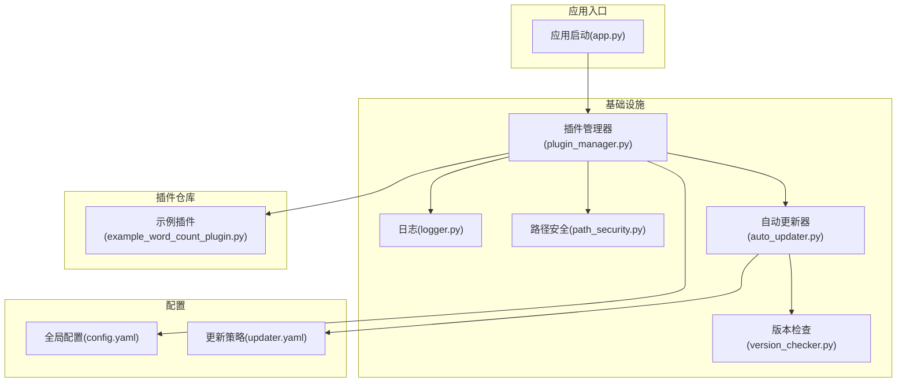
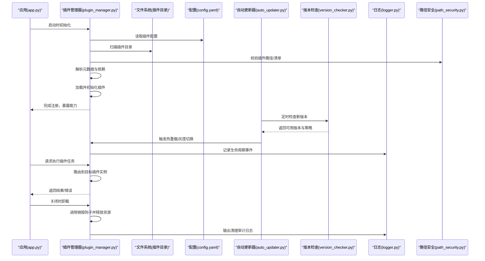
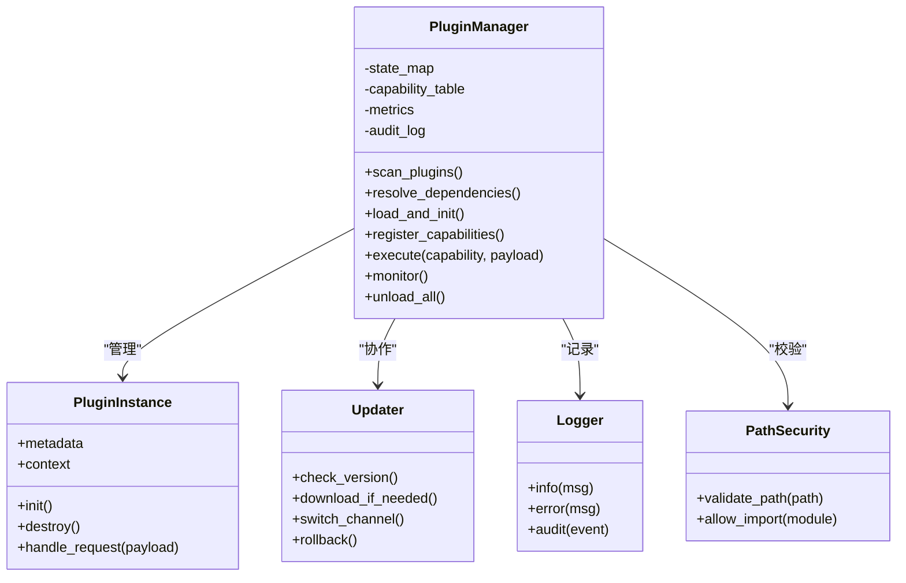
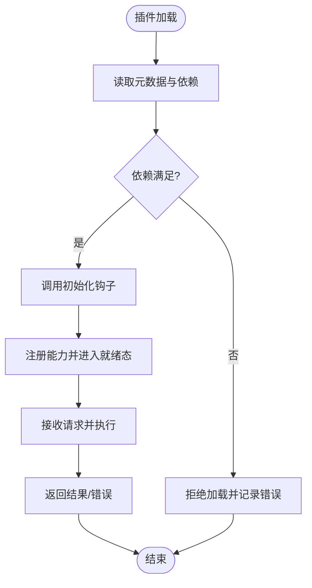
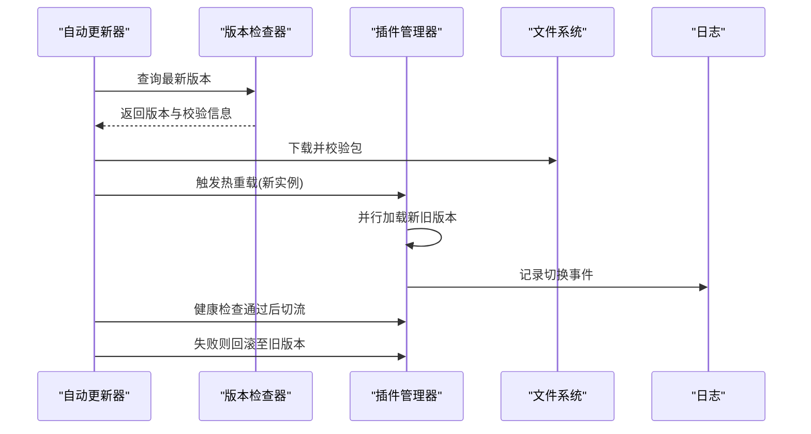
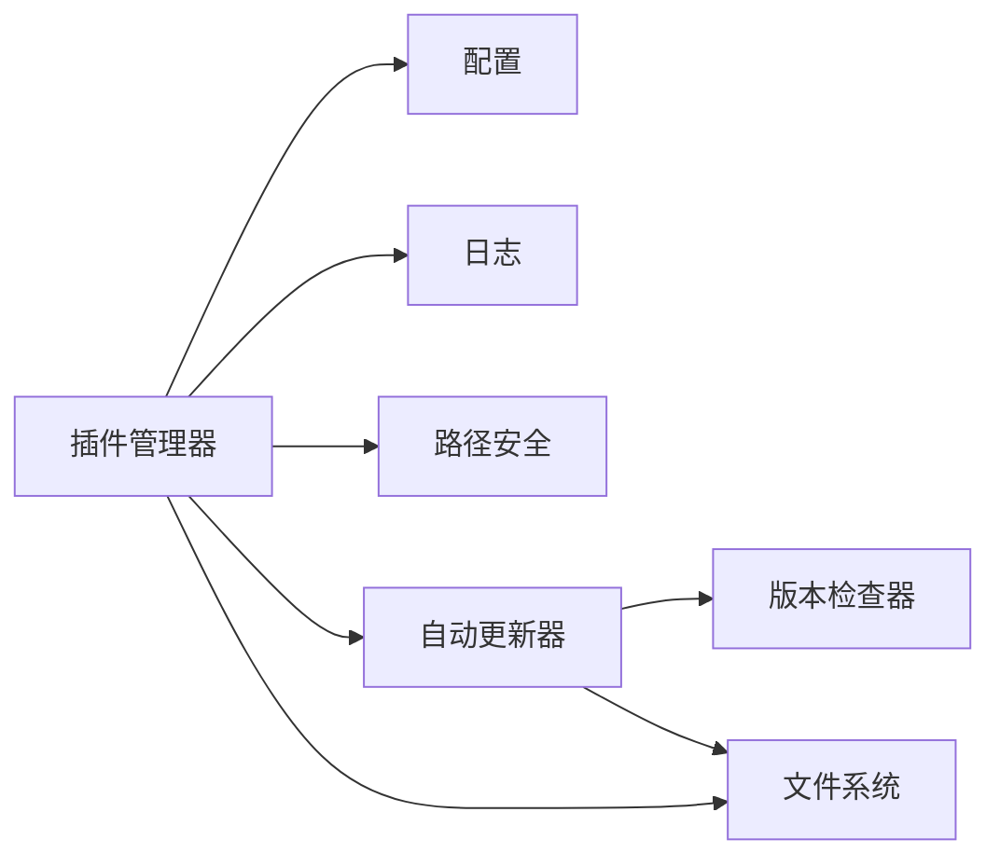
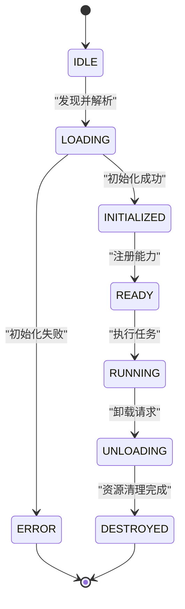
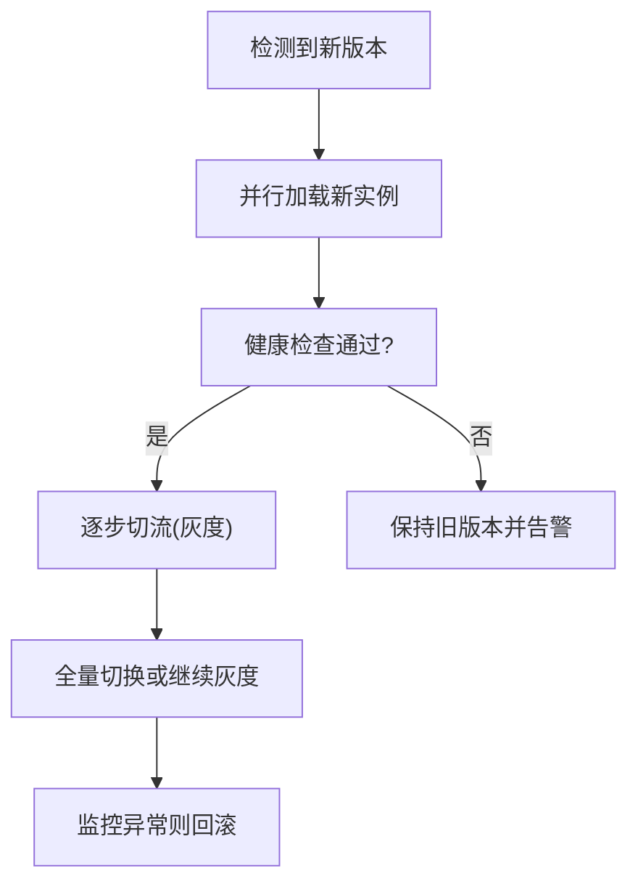

# 插件生命周期管理

<cite>
**本文引用的文件**   
- [src/paper_format_corrector/infra/plugin_manager.py](file://src/paper_format_corrector/infra/plugin_manager.py)
- [plugins/example_word_count_plugin.py](file://plugins/example_word_count_plugin.py)
- [config/config.yaml](file://config/config.yaml)
- [config/updater.yaml](file://config/updater.yaml)
- [src/paper_format_corrector/infra/updater/auto_updater.py](file://src/paper_format_corrector/infra/updater/auto_updater.py)
- [src/paper_format_corrector/infra/updater/version_checker.py](file://src/paper_format_corrector/infra/updater/version_checker.py)
- [src/paper_format_corrector/infra/logger.py](file://src/paper_format_corrector/infra/logger.py)
- [src/paper_format_corrector/shared/utils/path_security.py](file://src/paper_format_corrector/shared/utils/path_security.py)
- [src/paper_format_corrector/app.py](file://src/paper_format_corrector/app.py)
</cite>

## 目录
1. [简介](#简介)
2. [项目结构](#项目结构)
3. [核心组件](#核心组件)
4. [架构总览](#架构总览)
5. [详细组件分析](#详细组件分析)
6. [依赖关系分析](#依赖关系分析)
7. [性能考虑](#性能考虑)
8. [故障排查指南](#故障排查指南)
9. [结论](#结论)
10. [附录](#附录)

## 简介
本技术文档围绕“插件生命周期管理”展开，面向希望理解并扩展系统插件能力的开发者与运维人员。文档覆盖插件的加载、初始化、注册、执行、监控与卸载全链路；阐述状态管理、错误恢复与资源清理策略；解释插件间依赖管理与版本兼容性检查；给出热重载、动态更新与灰度发布的实现方案；并提供性能监控、日志记录与诊断工具建议；最后说明安全验证、权限检查与沙箱隔离机制。

## 项目结构
与插件生命周期直接相关的代码主要位于基础设施层与配置目录：
- 插件管理器：负责插件的发现、加载、初始化、注册、执行调度、监控与卸载。
- 示例插件：提供最小可运行的插件实现，便于理解接口约定与生命周期钩子。
- 配置中心：集中管理插件开关、路径、版本策略等。
- 自动更新器与版本检查器：支撑动态更新与灰度发布。
- 日志与安全工具：为插件运行期提供审计与访问控制能力。

图表来源
- [src/paper_format_corrector/app.py](file://src/paper_format_corrector/app.py)
- [src/paper_format_corrector/infra/plugin_manager.py](file://src/paper_format_corrector/infra/plugin_manager.py)
- [src/paper_format_corrector/infra/logger.py](file://src/paper_format_corrector/infra/logger.py)
- [src/paper_format_corrector/shared/utils/path_security.py](file://src/paper_format_corrector/shared/utils/path_security.py)
- [src/paper_format_corrector/infra/updater/auto_updater.py](file://src/paper_format_corrector/infra/updater/auto_updater.py)
- [src/paper_format_corrector/infra/updater/version_checker.py](file://src/paper_format_corrector/infra/updater/version_checker.py)
- [config/config.yaml](file://config/config.yaml)
- [config/updater.yaml](file://config/updater.yaml)
- [plugins/example_word_count_plugin.py](file://plugins/example_word_count_plugin.py)

章节来源
- [src/paper_format_corrector/app.py](file://src/paper_format_corrector/app.py)
- [src/paper_format_corrector/infra/plugin_manager.py](file://src/paper_format_corrector/infra/plugin_manager.py)
- [plugins/example_word_count_plugin.py](file://plugins/example_word_count_plugin.py)
- [config/config.yaml](file://config/config.yaml)
- [config/updater.yaml](file://config/updater.yaml)
- [src/paper_format_corrector/infra/updater/auto_updater.py](file://src/paper_format_corrector/infra/updater/auto_updater.py)
- [src/paper_format_corrector/infra/updater/version_checker.py](file://src/paper_format_corrector/infra/updater/version_checker.py)
- [src/paper_format_corrector/infra/logger.py](file://src/paper_format_corrector/infra/logger.py)
- [src/paper_format_corrector/shared/utils/path_security.py](file://src/paper_format_corrector/shared/utils/path_security.py)

## 核心组件
- 插件管理器：承担插件全生命周期编排，包括扫描、校验、加载、初始化、注册、执行、监控、卸载与资源回收。
- 示例插件：定义插件元数据、能力声明、生命周期钩子（如初始化、处理、销毁）以及对外暴露的API。
- 配置中心：提供插件启用/禁用、插件目录、版本策略、灰度比例、回滚阈值等运行时参数。
- 自动更新器与版本检查器：负责远程检查新版本、下载、校验签名、切换通道（稳定/预发）、灰度放量与回滚。
- 日志与安全工具：统一输出结构化日志、审计事件；对插件路径、导入模块进行白名单与路径安全检查。

章节来源
- [src/paper_format_corrector/infra/plugin_manager.py](file://src/paper_format_corrector/infra/plugin_manager.py)
- [plugins/example_word_count_plugin.py](file://plugins/example_word_count_plugin.py)
- [config/config.yaml](file://config/config.yaml)
- [config/updater.yaml](file://config/updater.yaml)
- [src/paper_format_corrector/infra/updater/auto_updater.py](file://src/paper_format_corrector/infra/updater/auto_updater.py)
- [src/paper_format_corrector/infra/updater/version_checker.py](file://src/paper_format_corrector/infra/updater/version_checker.py)
- [src/paper_format_corrector/infra/logger.py](file://src/paper_format_corrector/infra/logger.py)
- [src/paper_format_corrector/shared/utils/path_security.py](file://src/paper_format_corrector/shared/utils/path_security.py)

## 架构总览
下图展示了插件从发现到卸载的关键流程，以及与配置、更新器、日志与安全的交互。

图表来源
- [src/paper_format_corrector/app.py](file://src/paper_format_corrector/app.py)
- [src/paper_format_corrector/infra/plugin_manager.py](file://src/paper_format_corrector/infra/plugin_manager.py)
- [config/config.yaml](file://config/config.yaml)
- [src/paper_format_corrector/infra/updater/auto_updater.py](file://src/paper_format_corrector/infra/updater/auto_updater.py)
- [src/paper_format_corrector/infra/updater/version_checker.py](file://src/paper_format_corrector/infra/updater/version_checker.py)
- [src/paper_format_corrector/infra/logger.py](file://src/paper_format_corrector/infra/logger.py)
- [src/paper_format_corrector/shared/utils/path_security.py](file://src/paper_format_corrector/shared/utils/path_security.py)

## 详细组件分析

### 插件管理器（生命周期编排）
- 职责
  - 插件发现与清单解析：扫描插件目录，读取元数据（名称、版本、依赖、能力）。
  - 依赖解析与拓扑排序：构建依赖图，检测循环依赖与缺失依赖。
  - 加载与初始化：按依赖顺序加载模块，调用初始化钩子，建立上下文。
  - 注册与路由：将插件能力注册到内部表，支持按能力名或标签路由。
  - 执行与监控：在受控环境中执行插件方法，采集指标与日志。
  - 错误恢复与重试：捕获异常，记录诊断信息，支持幂等重试与降级。
  - 卸载与资源清理：调用销毁钩子，关闭句柄、释放内存、清理临时文件。
- 关键设计点
  - 状态机：IDLE -> LOADING -> INITIALIZED -> READY -> RUNNING -> UNLOADING -> DESTROYED。
  - 隔离：每个插件拥有独立上下文，避免共享可变状态。
  - 可观测性：埋点指标（加载耗时、错误率、QPS、延迟分位）、结构化日志。
  - 安全边界：路径白名单、模块导入限制、资源配额。

图表来源
- [src/paper_format_corrector/infra/plugin_manager.py](file://src/paper_format_corrector/infra/plugin_manager.py)
- [src/paper_format_corrector/infra/updater/auto_updater.py](file://src/paper_format_corrector/infra/updater/auto_updater.py)
- [src/paper_format_corrector/infra/logger.py](file://src/paper_format_corrector/infra/logger.py)
- [src/paper_format_corrector/shared/utils/path_security.py](file://src/paper_format_corrector/shared/utils/path_security.py)

章节来源
- [src/paper_format_corrector/infra/plugin_manager.py](file://src/paper_format_corrector/infra/plugin_manager.py)

### 示例插件（最小实现）
- 职责
  - 声明插件元数据（名称、版本、作者、描述、依赖）。
  - 实现生命周期钩子：初始化、处理请求、销毁。
  - 暴露能力：例如统计词数、格式化片段等。
- 使用方式
  - 将插件放入配置的插件目录，确保元数据完整且依赖满足。
  - 通过插件管理器提供的API调用其能力。

图表来源
- [plugins/example_word_count_plugin.py](file://plugins/example_word_count_plugin.py)

章节来源
- [plugins/example_word_count_plugin.py](file://plugins/example_word_count_plugin.py)

### 配置与策略（config.yaml / updater.yaml）
- 插件配置项
  - 插件目录、启用/禁用列表、版本约束、依赖声明、能力白名单、超时与重试策略。
- 更新策略
  - 渠道（稳定/预发）、灰度比例、回滚阈值、健康检查条件、回退窗口。
- 作用
  - 驱动插件管理器与更新器的行为，使系统在无需重启的情况下调整策略。

章节来源
- [config/config.yaml](file://config/config.yaml)
- [config/updater.yaml](file://config/updater.yaml)

### 自动更新与版本检查（auto_updater.py / version_checker.py）
- 职责
  - 定期拉取远端版本信息与变更日志。
  - 根据策略选择目标版本，执行下载与校验。
  - 支持灰度放量与健康检查失败时的自动回滚。
- 与插件管理器的协作
  - 通过事件或回调通知插件管理器进行热重载与能力重新注册。

图表来源
- [src/paper_format_corrector/infra/updater/auto_updater.py](file://src/paper_format_corrector/infra/updater/auto_updater.py)
- [src/paper_format_corrector/infra/updater/version_checker.py](file://src/paper_format_corrector/infra/updater/version_checker.py)
- [src/paper_format_corrector/infra/plugin_manager.py](file://src/paper_format_corrector/infra/plugin_manager.py)

章节来源
- [src/paper_format_corrector/infra/updater/auto_updater.py](file://src/paper_format_corrector/infra/updater/auto_updater.py)
- [src/paper_format_corrector/infra/updater/version_checker.py](file://src/paper_format_corrector/infra/updater/version_checker.py)

### 日志与安全（logger.py / path_security.py）
- 日志
  - 统一结构化日志格式，包含插件标识、阶段、耗时、错误码与追踪ID。
  - 审计日志记录敏感操作（加载、卸载、切换版本）。
- 路径安全
  - 校验插件路径是否在允许目录内，防止越权访问。
  - 限制模块导入范围，降低恶意代码风险。

章节来源
- [src/paper_format_corrector/infra/logger.py](file://src/paper_format_corrector/infra/logger.py)
- [src/paper_format_corrector/shared/utils/path_security.py](file://src/paper_format_corrector/shared/utils/path_security.py)

## 依赖关系分析
- 组件耦合
  - 插件管理器为核心枢纽，依赖配置、日志、安全与更新器。
  - 自动更新器与版本检查器松耦合，通过策略与事件驱动。
- 外部依赖
  - 文件系统用于插件包与缓存。
  - 网络用于版本检查与下载（由更新器封装）。
- 潜在风险
  - 循环依赖：需在加载前进行拓扑校验。
  - 版本不兼容：需通过语义化版本与兼容性矩阵检查。

图表来源
- [src/paper_format_corrector/infra/plugin_manager.py](file://src/paper_format_corrector/infra/plugin_manager.py)
- [src/paper_format_corrector/infra/updater/auto_updater.py](file://src/paper_format_corrector/infra/updater/auto_updater.py)
- [src/paper_format_corrector/infra/updater/version_checker.py](file://src/paper_format_corrector/infra/updater/version_checker.py)
- [config/config.yaml](file://config/config.yaml)
- [config/updater.yaml](file://config/updater.yaml)

章节来源
- [src/paper_format_corrector/infra/plugin_manager.py](file://src/paper_format_corrector/infra/plugin_manager.py)
- [src/paper_format_corrector/infra/updater/auto_updater.py](file://src/paper_format_corrector/infra/updater/auto_updater.py)
- [src/paper_format_corrector/infra/updater/version_checker.py](file://src/paper_format_corrector/infra/updater/version_checker.py)
- [config/config.yaml](file://config/config.yaml)
- [config/updater.yaml](file://config/updater.yaml)

## 性能考虑
- 加载优化
  - 懒加载：仅在首次调用时加载插件。
  - 并行初始化：无依赖的插件可并行初始化。
- 执行优化
  - 连接池与对象复用：减少重复创建开销。
  - 限流与熔断：保护下游资源，避免雪崩。
- 监控与诊断
  - 指标：加载耗时、错误率、P95/P99延迟、CPU/内存占用。
  - 采样日志：在高吞吐场景下采用采样策略，保留关键错误与审计事件。
- 资源清理
  - 显式释放：文件句柄、网络连接、线程池。
  - 垃圾回收提示：在大型对象使用后主动释放引用。

[本节为通用指导，不直接分析具体文件]

## 故障排查指南
- 常见问题
  - 插件无法加载：检查路径安全校验、元数据完整性、依赖是否满足。
  - 初始化失败：查看初始化钩子抛出的异常与上下文信息。
  - 执行异常：核对能力路由、输入参数校验与下游依赖可用性。
  - 版本切换失败：确认健康检查条件、灰度比例与回滚阈值。
- 定位步骤
  - 检索审计日志中的插件标识与阶段，定位失败时间点。
  - 检查配置项是否生效，必要时热更新配置后观察行为变化。
  - 使用诊断工具导出快照（指标、堆栈、线程状态），辅助根因分析。
- 恢复策略
  - 幂等重试：对可重入操作进行有限次重试。
  - 快速回滚：灰度失败立即切回上一稳定版本。
  - 降级模式：在依赖不可用时返回默认结果或拒绝服务。

章节来源
- [src/paper_format_corrector/infra/logger.py](file://src/paper_format_corrector/infra/logger.py)
- [src/paper_format_corrector/infra/plugin_manager.py](file://src/paper_format_corrector/infra/plugin_manager.py)

## 结论
插件生命周期管理通过统一的编排器、严格的依赖与版本控制、完善的可观测性与安全边界，实现了高可用、可扩展与可演进的插件生态。结合热重载、灰度发布与自动回滚，可在保证稳定的前提下持续交付新功能。建议在后续迭代中完善沙箱隔离与更细粒度的权限模型，进一步提升安全性与可维护性。

[本节为总结性内容，不直接分析具体文件]

## 附录

### 插件状态机

[本图为概念性状态机，不直接映射具体源码文件]

### 热重载与灰度发布流程
- 热重载
  - 在不中断现有请求的前提下，加载新版本的插件实例。
  - 逐步将流量切换到新实例，同时监控健康指标。
- 灰度发布
  - 基于配置的比例将部分流量导向新版本。
  - 若健康检查失败，自动回滚至旧版本。

[本图为概念性流程，不直接映射具体源码文件]