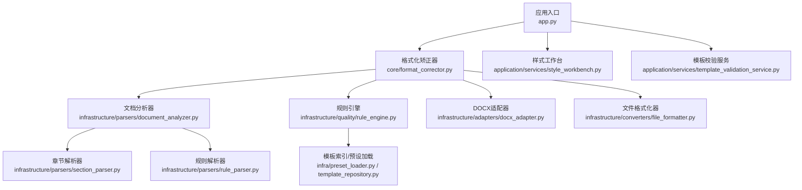
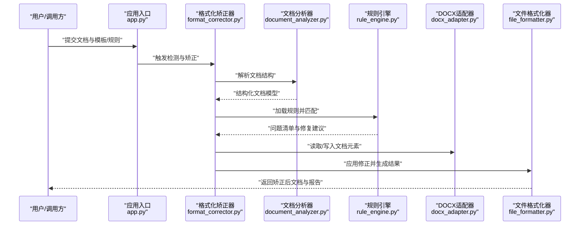
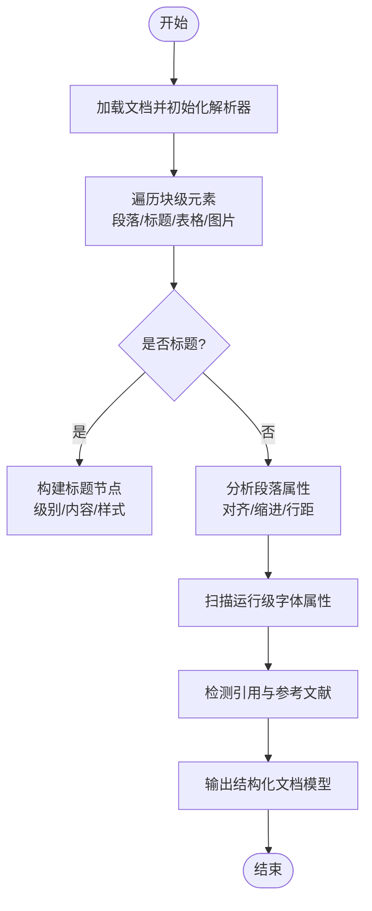
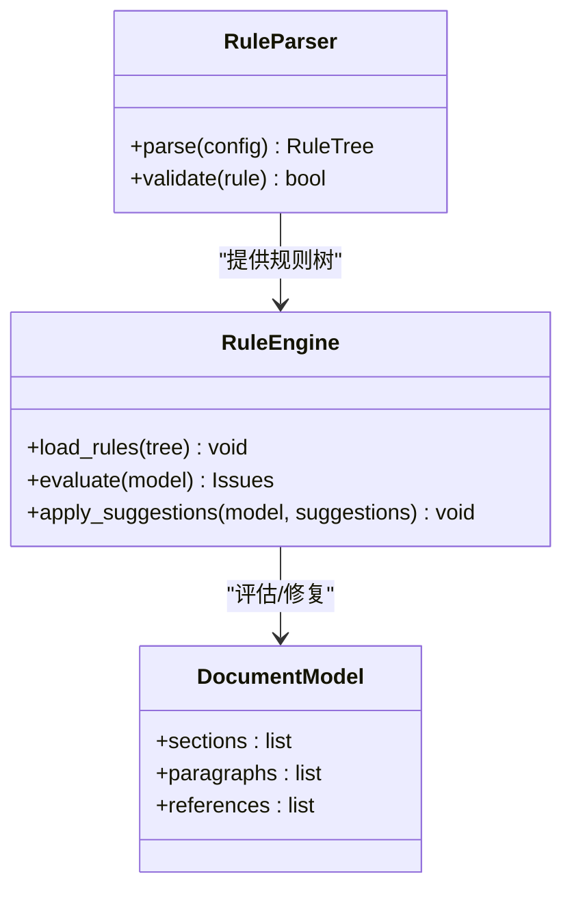
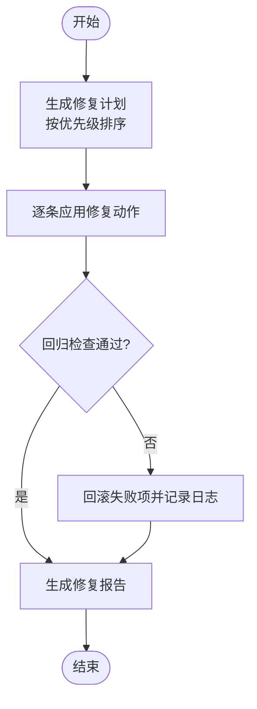
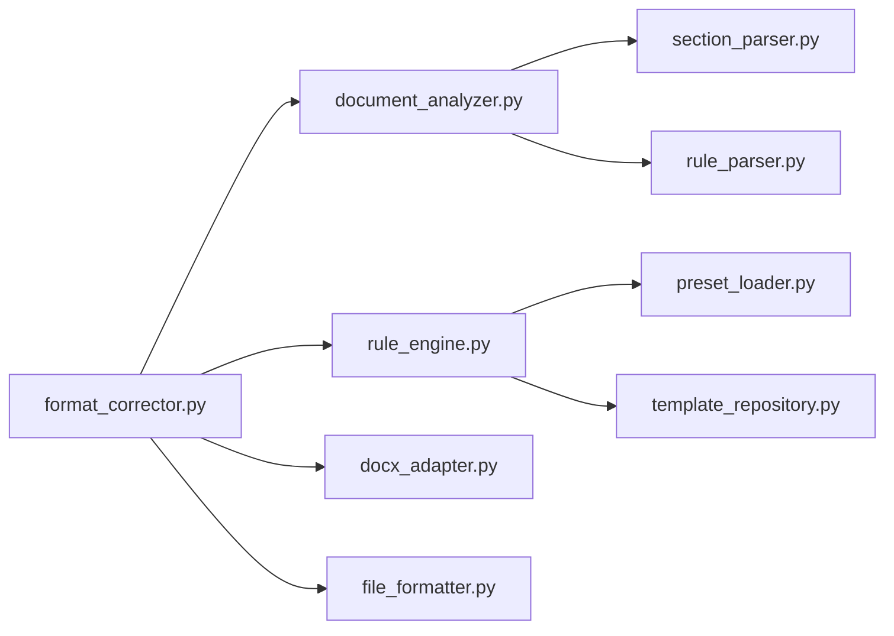

# 智能格式检测与自动矫正

<cite>
**本文引用的文件**   
- [README.md](file://README.md)
- [pyproject.toml](file://pyproject.toml)
- [requirements.txt](file://requirements.txt)
- [run.py](file://run.py)
- [src/paper_format_corrector/app.py](file://src/paper_format_corrector/app.py)
- [src/paper_format_corrector/core/format_corrector.py](file://src/paper_format_corrector/core/format_corrector.py)
- [src/paper_format_corrector/infrastructure/parsers/document_analyzer.py](file://src/paper_format_corrector/infrastructure/parsers/document_analyzer.py)
- [src/paper_format_corrector/infrastructure/parsers/section_parser.py](file://src/paper_format_corrector/infrastructure/parsers/section_parser.py)
- [src/paper_format_corrector/infrastructure/parsers/rule_parser.py](file://src/paper_format_corrector/infrastructure/parsers/rule_parser.py)
- [src/paper_format_corrector/infrastructure/quality/rule_engine.py](file://src/paper_format_corrector/infrastructure/quality/rule_engine.py)
- [src/paper_format_corrector/infrastructure/adapters/docx_adapter.py](file://src/paper_format_corrector/infrastructure/adapters/docx_adapter.py)
- [src/paper_format_corrector/infrastructure/converters/file_formatter.py](file://src/paper_format_corrector/infrastructure/converters/file_formatter.py)
- [src/paper_format_corrector/application/services/style_workbench.py](file://src/paper_format_corrector/application/services/style_workbench.py)
- [src/paper_format_corrector/application/services/template_validation_service.py](file://src/paper_format_corrector/application/services/template_validation_service.py)
- [src/paper_format_corrector/infra/preset_loader.py](file://src/paper_format_corrector/infra/preset_loader.py)
- [src/paper_format_corrector/infra/template_repository.py](file://src/paper_format_corrector/infra/template_repository.py)
- [presets/templates_index.yaml](file://presets/templates_index.yaml)
- [config/config.yaml](file://config/config.yaml)
- [examples/sample_template.yaml](file://examples/sample_template.yaml)
- [tests/test_rule_parser.py](file://tests/test_rule_parser.py)
- [tests/test_document_analyzer.py](file://tests/test_document_analyzer.py)
- [tests/test_corrector.py](file://tests/test_corrector.py)
</cite>

## 目录
1. [简介](#简介)
2. [项目结构](#项目结构)
3. [核心组件](#核心组件)
4. [架构总览](#架构总览)
5. [详细组件分析](#详细组件分析)
6. [依赖关系分析](#依赖关系分析)
7. [性能考虑](#性能考虑)
8. [故障排查指南](#故障排查指南)
9. [结论](#结论)
10. [附录](#附录)

## 简介
本项目提供面向学术文档的智能格式检测与自动矫正能力，覆盖章节标题识别、段落格式、字体样式、引用格式等关键元素。系统通过规则引擎驱动的检测流程，结合模板与预设配置，实现从“解析—诊断—修正—导出”的完整流水线，支持多语言与复杂文档结构，并提供API与CLI接口供集成使用。

## 项目结构
仓库采用分层架构：应用层（服务）、领域层（实体/值对象/事件）、基础设施层（解析器、适配器、转换器、质量模块）、接口层（API/CLI/GUI/Web）以及配置与预设资源。核心入口位于应用启动脚本与主应用模块；格式检测与矫正的核心逻辑集中在核心处理类与基础设施的质量/解析模块中。

图表来源
- [src/paper_format_corrector/app.py](file://src/paper_format_corrector/app.py)
- [src/paper_format_corrector/core/format_corrector.py](file://src/paper_format_corrector/core/format_corrector.py)
- [src/paper_format_corrector/infrastructure/parsers/document_analyzer.py](file://src/paper_format_corrector/infrastructure/parsers/document_analyzer.py)
- [src/paper_format_corrector/infrastructure/quality/rule_engine.py](file://src/paper_format_corrector/infrastructure/quality/rule_engine.py)
- [src/paper_format_corrector/infrastructure/adapters/docx_adapter.py](file://src/paper_format_corrector/infrastructure/adapters/docx_adapter.py)
- [src/paper_format_corrector/infrastructure/converters/file_formatter.py](file://src/paper_format_corrector/infrastructure/converters/file_formatter.py)
- [src/paper_format_corrector/infrastructure/parsers/section_parser.py](file://src/paper_format_corrector/infrastructure/parsers/section_parser.py)
- [src/paper_format_corrector/infrastructure/parsers/rule_parser.py](file://src/paper_format_corrector/infrastructure/parsers/rule_parser.py)
- [src/paper_format_corrector/infra/preset_loader.py](file://src/paper_format_corrector/infra/preset_loader.py)
- [src/paper_format_corrector/infra/template_repository.py](file://src/paper_format_corrector/infra/template_repository.py)
- [src/paper_format_corrector/application/services/style_workbench.py](file://src/paper_format_corrector/application/services/style_workbench.py)
- [src/paper_format_corrector/application/services/template_validation_service.py](file://src/paper_format_corrector/application/services/template_validation_service.py)

章节来源
- [README.md](file://README.md)
- [pyproject.toml](file://pyproject.toml)
- [requirements.txt](file://requirements.txt)
- [run.py](file://run.py)

## 核心组件
- 格式化矫正器：编排文档解析、规则匹配、修正执行与结果输出，是检测与矫正的主控制器。
- 文档分析器：负责将输入文档抽象为结构化表示，提取段落、标题、表格、图片、引用等元素及其属性。
- 规则引擎：基于规则解析器加载的规则集进行匹配与评分，产出问题清单与修复建议。
- DOCX适配器：封装对Word文档结构的读写操作，屏蔽底层差异。
- 文件格式化器：在内存或临时结构中应用修正，并持久化到目标格式。
- 样式工作台与模板校验服务：提供模板管理、规则校验与样式工作流支撑。
- 预设与模板库：集中管理不同期刊/学校/会议模板及通用规则。

章节来源
- [src/paper_format_corrector/core/format_corrector.py](file://src/paper_format_corrector/core/format_corrector.py)
- [src/paper_format_corrector/infrastructure/parsers/document_analyzer.py](file://src/paper_format_corrector/infrastructure/parsers/document_analyzer.py)
- [src/paper_format_corrector/infrastructure/quality/rule_engine.py](file://src/paper_format_corrector/infrastructure/quality/rule_engine.py)
- [src/paper_format_corrector/infrastructure/adapters/docx_adapter.py](file://src/paper_format_corrector/infrastructure/adapters/docx_adapter.py)
- [src/paper_format_corrector/infrastructure/converters/file_formatter.py](file://src/paper_format_corrector/infrastructure/converters/file_formatter.py)
- [src/paper_format_corrector/application/services/style_workbench.py](file://src/paper_format_corrector/application/services/style_workbench.py)
- [src/paper_format_corrector/application/services/template_validation_service.py](file://src/paper_format_corrector/application/services/template_validation_service.py)
- [src/paper_format_corrector/infra/preset_loader.py](file://src/paper_format_corrector/infra/preset_loader.py)
- [src/paper_format_corrector/infra/template_repository.py](file://src/paper_format_corrector/infra/template_repository.py)

## 架构总览
整体流程遵循“输入→解析→诊断→修正→输出”的分阶段流水线，各阶段通过明确接口解耦，便于扩展与替换。

图表来源
- [src/paper_format_corrector/app.py](file://src/paper_format_corrector/app.py)
- [src/paper_format_corrector/core/format_corrector.py](file://src/paper_format_corrector/core/format_corrector.py)
- [src/paper_format_corrector/infrastructure/parsers/document_analyzer.py](file://src/paper_format_corrector/infrastructure/parsers/document_analyzer.py)
- [src/paper_format_corrector/infrastructure/quality/rule_engine.py](file://src/paper_format_corrector/infrastructure/quality/rule_engine.py)
- [src/paper_format_corrector/infrastructure/adapters/docx_adapter.py](file://src/paper_format_corrector/infrastructure/adapters/docx_adapter.py)
- [src/paper_format_corrector/infrastructure/converters/file_formatter.py](file://src/paper_format_corrector/infrastructure/converters/file_formatter.py)

## 详细组件分析

### 文档结构识别算法
- 章节标题识别：通过段落文本模式、样式名与层级信息综合判定，支持多级标题与跨语言标题前缀。
- 段落格式识别：依据对齐方式、缩进、行距、段前段后间距等属性构建段落特征向量。
- 字体样式识别：抽取运行级字体族、字号、颜色、加粗/斜体等属性，聚合为样式签名。
- 引用格式识别：扫描脚注、尾注、参考文献列表与内联引用标记，结合模板规则判断是否符合规范。

图表来源
- [src/paper_format_corrector/infrastructure/parsers/document_analyzer.py](file://src/paper_format_corrector/infrastructure/parsers/document_analyzer.py)
- [src/paper_format_corrector/infrastructure/parsers/section_parser.py](file://src/paper_format_corrector/infrastructure/parsers/section_parser.py)

章节来源
- [src/paper_format_corrector/infrastructure/parsers/document_analyzer.py](file://src/paper_format_corrector/infrastructure/parsers/document_analyzer.py)
- [src/paper_format_corrector/infrastructure/parsers/section_parser.py](file://src/paper_format_corrector/infrastructure/parsers/section_parser.py)
- [tests/test_document_analyzer.py](file://tests/test_document_analyzer.py)

### 格式规则匹配机制
- 规则定义：以YAML/JSON形式描述检测条件（如标题层级、字体大小、引用格式），并附带修复动作与优先级。
- 规则解析：规则解析器将配置转换为可执行的规则对象树，支持条件组合与上下文变量。
- 匹配策略：对结构化文档模型进行遍历，按优先级顺序评估规则，命中则记录问题并生成修复建议。
- 评分与排序：根据严重等级、影响范围与修复成本计算分数，用于报告与批量修复顺序。

图表来源
- [src/paper_format_corrector/infrastructure/parsers/rule_parser.py](file://src/paper_format_corrector/infrastructure/parsers/rule_parser.py)
- [src/paper_format_corrector/infrastructure/quality/rule_engine.py](file://src/paper_format_corrector/infrastructure/quality/rule_engine.py)

章节来源
- [src/paper_format_corrector/infrastructure/parsers/rule_parser.py](file://src/paper_format_corrector/infrastructure/parsers/rule_parser.py)
- [src/paper_format_corrector/infrastructure/quality/rule_engine.py](file://src/paper_format_corrector/infrastructure/quality/rule_engine.py)
- [tests/test_rule_parser.py](file://tests/test_rule_parser.py)

### 自动修正逻辑
- 修正策略：针对标题层级错误、段落格式不一致、字体不统一、引用不规范等问题，提供一键或选择性修复。
- 原子操作：每个修复动作最小化变更范围，确保可回滚与审计。
- 冲突处理：当多条规则同时命中时，依据优先级与兼容性矩阵选择最优修复方案。
- 验证闭环：修复后再次运行规则引擎进行回归检查，确保无新增违规。

图表来源
- [src/paper_format_corrector/core/format_corrector.py](file://src/paper_format_corrector/core/format_corrector.py)
- [src/paper_format_corrector/infrastructure/converters/file_formatter.py](file://src/paper_format_corrector/infrastructure/converters/file_formatter.py)

章节来源
- [src/paper_format_corrector/core/format_corrector.py](file://src/paper_format_corrector/core/format_corrector.py)
- [src/paper_format_corrector/infrastructure/converters/file_formatter.py](file://src/paper_format_corrector/infrastructure/converters/file_formatter.py)
- [tests/test_corrector.py](file://tests/test_corrector.py)

### 章节标题、段落格式、字体样式、引用格式的识别与矫正
- 章节标题：识别多级标题，纠正层级跳跃与命名不一致，统一编号与样式。
- 段落格式：统一对齐、缩进、行距与段前后间距，适配模板要求。
- 字体样式：规范化中英文字体、字号与强调样式，避免混用。
- 引用格式：校正参考文献列表与内联引用，支持GB/T 7714、APA、IEEE等常见标准。

章节来源
- [src/paper_format_corrector/infrastructure/parsers/document_analyzer.py](file://src/paper_format_corrector/infrastructure/parsers/document_analyzer.py)
- [src/paper_format_corrector/infrastructure/quality/rule_engine.py](file://src/paper_format_corrector/infrastructure/quality/rule_engine.py)
- [src/paper_format_corrector/infrastructure/adapters/docx_adapter.py](file://src/paper_format_corrector/infrastructure/adapters/docx_adapter.py)

### API使用示例与自定义规则配置
- 基本用法：通过应用入口或服务类暴露的接口，传入文档路径、模板名称与可选参数，获取检测结果与修复后的文档。
- 自定义规则：在模板或配置文件中添加规则条目，定义检测条件与修复动作，并通过模板校验服务验证语法与语义。
- 批量处理：结合任务队列与服务层，对多个文档并行执行检测与矫正。

章节来源
- [src/paper_format_corrector/app.py](file://src/paper_format_corrector/app.py)
- [src/paper_format_corrector/application/services/style_workbench.py](file://src/paper_format_corrector/application/services/style_workbench.py)
- [src/paper_format_corrector/application/services/template_validation_service.py](file://src/paper_format_corrector/application/services/template_validation_service.py)
- [examples/sample_template.yaml](file://examples/sample_template.yaml)
- [config/config.yaml](file://config/config.yaml)

### 多语言支持与复杂文档结构
- 多语言：规则引擎支持多语言字符集与正则表达式，适配中日韩等语言的标题与引用习惯。
- 复杂结构：对嵌套表格、图文混排、页眉页脚、批注与超链接进行稳健解析，避免误判。
- 模板兼容：通过模板索引与预设加载器动态切换规则集，满足不同机构与会议的要求。

章节来源
- [src/paper_format_corrector/infra/preset_loader.py](file://src/paper_format_corrector/infra/preset_loader.py)
- [src/paper_format_corrector/infra/template_repository.py](file://src/paper_format_corrector/infra/template_repository.py)
- [presets/templates_index.yaml](file://presets/templates_index.yaml)

## 依赖关系分析
- 内部耦合：格式化矫正器作为协调者，依赖文档分析器、规则引擎、适配器与格式化器；解析器之间通过结构化模型交互。
- 外部依赖：基于python-docx等库进行文档读写；配置文件与模板资源通过预设加载器统一管理。
- 循环依赖：通过接口与数据模型隔离，避免直接循环导入；服务层与基础设施层职责清晰。

图表来源
- [src/paper_format_corrector/core/format_corrector.py](file://src/paper_format_corrector/core/format_corrector.py)
- [src/paper_format_corrector/infrastructure/parsers/document_analyzer.py](file://src/paper_format_corrector/infrastructure/parsers/document_analyzer.py)
- [src/paper_format_corrector/infrastructure/quality/rule_engine.py](file://src/paper_format_corrector/infrastructure/quality/rule_engine.py)
- [src/paper_format_corrector/infrastructure/adapters/docx_adapter.py](file://src/paper_format_corrector/infrastructure/adapters/docx_adapter.py)
- [src/paper_format_corrector/infrastructure/converters/file_formatter.py](file://src/paper_format_corrector/infrastructure/converters/file_formatter.py)
- [src/paper_format_corrector/infrastructure/parsers/section_parser.py](file://src/paper_format_corrector/infrastructure/parsers/section_parser.py)
- [src/paper_format_corrector/infrastructure/parsers/rule_parser.py](file://src/paper_format_corrector/infrastructure/parsers/rule_parser.py)
- [src/paper_format_corrector/infra/preset_loader.py](file://src/paper_format_corrector/infra/preset_loader.py)
- [src/paper_format_corrector/infra/template_repository.py](file://src/paper_format_corrector/infra/template_repository.py)

章节来源
- [pyproject.toml](file://pyproject.toml)
- [requirements.txt](file://requirements.txt)

## 性能考虑
- 解析优化：对大文档采用分块解析与惰性加载，减少内存占用。
- 规则短路：高优先级规则优先匹配，命中即跳过低优先级分支，降低评估开销。
- 缓存策略：对重复使用的模板与规则树进行缓存，避免重复解析。
- 并发处理：结合任务队列与服务层，对多文档进行并行处理，提升吞吐。

[本节为通用指导，无需特定文件来源]

## 故障排查指南
- 规则语法错误：使用模板校验服务检查规则文件的结构与字段合法性，定位错误位置。
- 解析异常：查看文档分析器的日志与断言，确认段落/标题/引用等元素的提取是否正确。
- 修复失败：核对修复计划的优先级与兼容性，必要时回滚并调整规则。
- 性能瓶颈：启用性能日志，定位慢点（解析、规则匹配、IO），考虑缓存与并发优化。

章节来源
- [src/paper_format_corrector/application/services/template_validation_service.py](file://src/paper_format_corrector/application/services/template_validation_service.py)
- [src/paper_format_corrector/infrastructure/parsers/document_analyzer.py](file://src/paper_format_corrector/infrastructure/parsers/document_analyzer.py)
- [src/paper_format_corrector/core/format_corrector.py](file://src/paper_format_corrector/core/format_corrector.py)

## 结论
本系统通过模块化设计与规则引擎驱动的检测与矫正流程，实现了面向学术文档的高精度格式识别与自动化修正。借助模板与预设库，系统具备强大的可扩展性与多语言支持能力。配合完善的测试与校验工具链，可在保证正确性的前提下持续提升性能与用户体验。

[本节为总结性内容，无需特定文件来源]

## 附录
- 快速上手：参考应用入口与样例模板，完成首次检测与矫正。
- 模板开发：在模板索引中添加新模板，编写规则并经由校验服务验证。
- 集成指南：通过API或服务层接口将格式检测能力嵌入现有工作流。

章节来源
- [src/paper_format_corrector/app.py](file://src/paper_format_corrector/app.py)
- [presets/templates_index.yaml](file://presets/templates_index.yaml)
- [examples/sample_template.yaml](file://examples/sample_template.yaml)