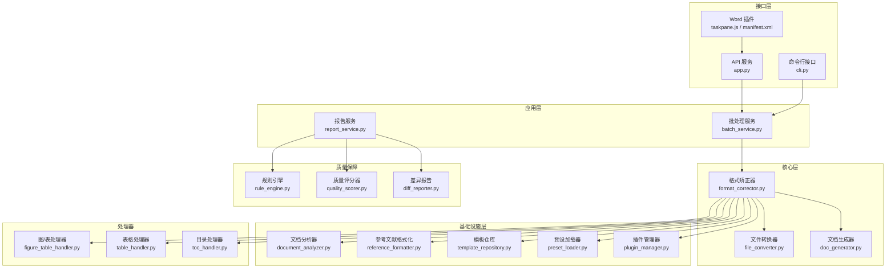
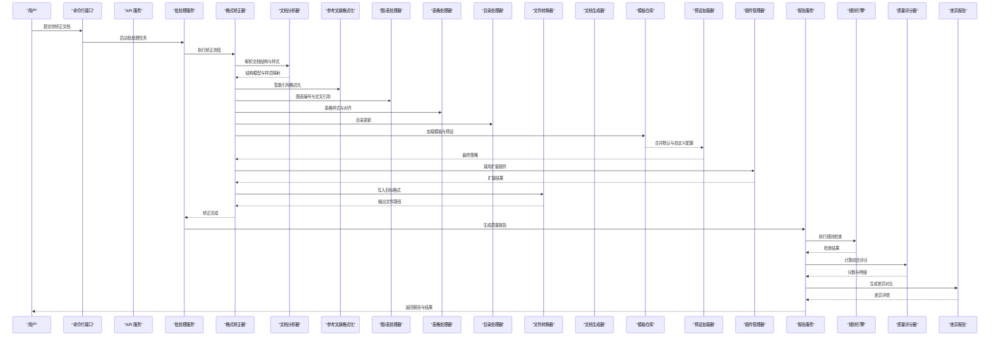
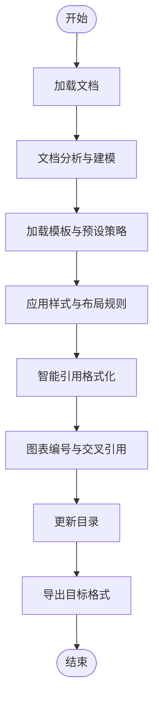
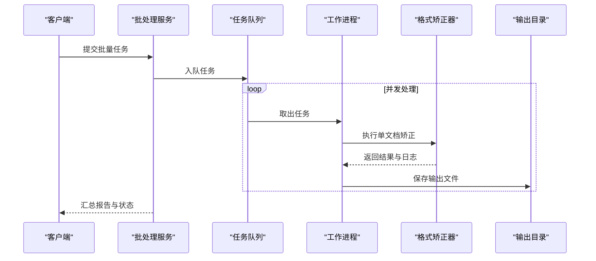
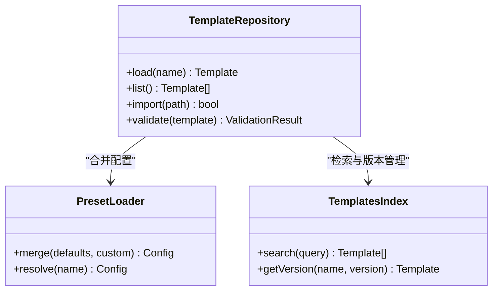
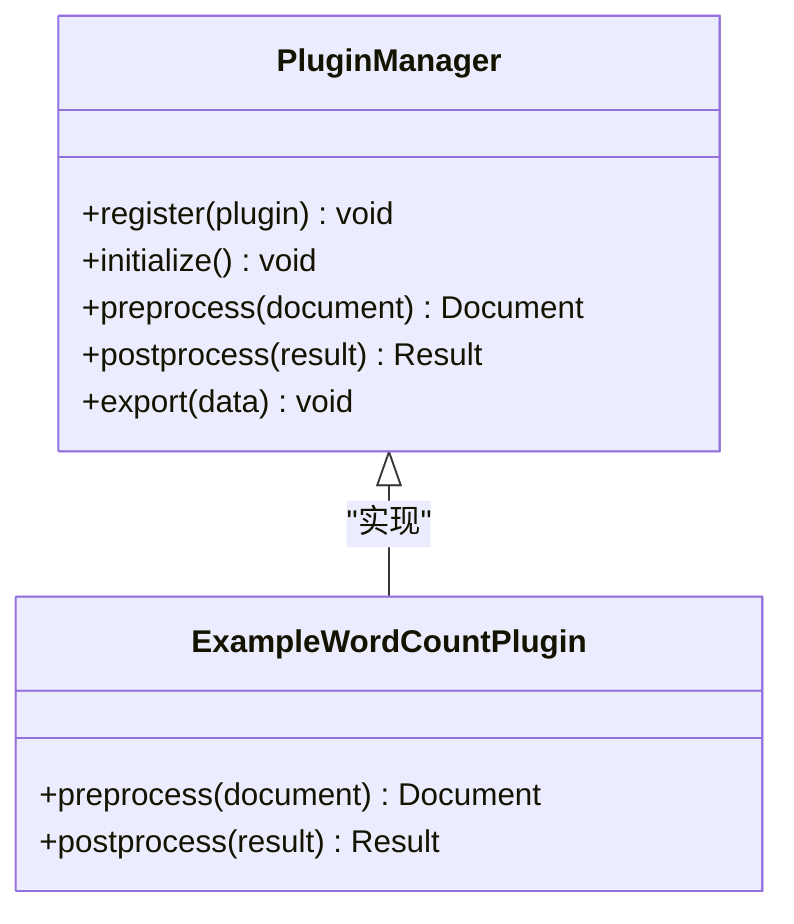
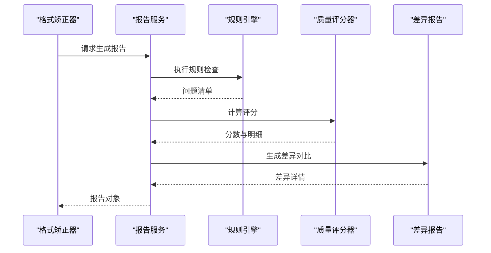
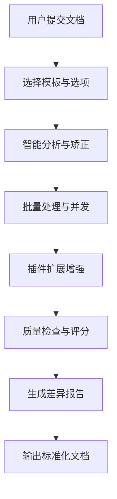
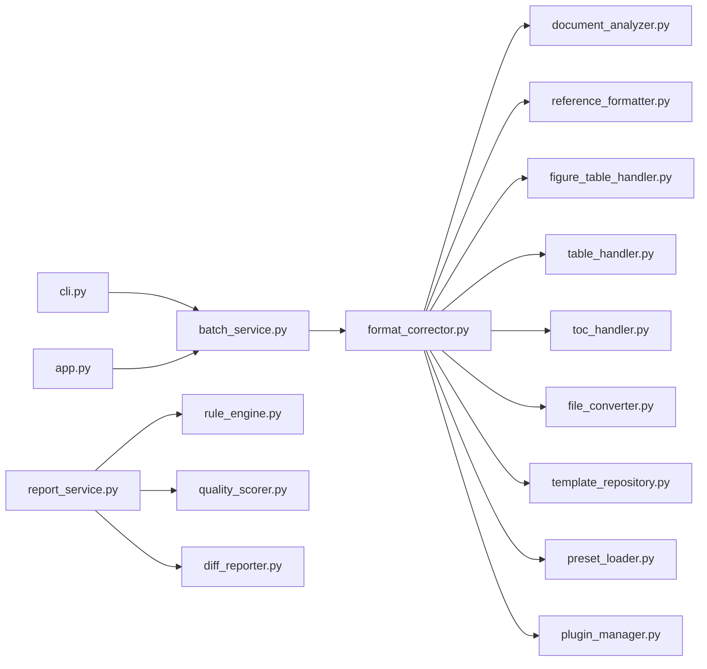

# 核心特性

<cite>
**本文引用的文件**   
- [README.md](file://README.md)
- [pyproject.toml](file://pyproject.toml)
- [requirements.txt](file://requirements.txt)
- [run.py](file://run.py)
- [src/paper_format_corrector/app.py](file://src/paper_format_corrector/app.py)
- [src/paper_format_corrector/cli.py](file://src/paper_format_corrector/cli.py)
- [src/paper_format_corrector/core/format_corrector.py](file://src/paper_format_corrector/core/format_corrector.py)
- [src/paper_format_corrector/core/file_converter.py](file://src/paper_format_corrector/core/file_converter.py)
- [src/paper_format_corrector/core/doc_generator.py](file://src/paper_format_corrector/core/doc_generator.py)
- [src/paper_format_corrector/infrastructure/parsers/document_analyzer.py](file://src/paper_format_corrector/infrastructure/parsers/document_analyzer.py)
- [src/paper_format_corrector/infrastructure/parsers/reference_formatter.py](file://src/paper_format_corrector/infrastructure/parsers/reference_formatter.py)
- [src/paper_format_corrector/handlers/figure_table_handler.py](file://src/paper_format_corrector/handlers/figure_table_handler.py)
- [src/paper_format_corrector/handlers/table_handler.py](file://src/paper_format_corrector/handlers/table_handler.py)
- [src/paper_format_corrector/handlers/toc_handler.py](file://src/paper_format_corrector/handlers/toc_handler.py)
- [src/paper_format_corrector/application/services/batch_service.py](file://src/paper_format_corrector/application/services/batch_service.py)
- [src/paper_format_corrector/application/services/report_service.py](file://src/paper_format_corrector/application/services/report_service.py)
- [src/paper_format_corrector/quality/rule_engine.py](file://src/paper_format_corrector/quality/rule引擎.py)
- [src/paper_format_corrector/quality/diff_reporter.py](file://src/paper_format_corrector/quality/diff_reporter.py)
- [src/paper_format_corrector/quality/quality_scorer.py](file://src/paper_format_corrector/quality/quality_scorer.py)
- [src/paper_format_corrector/infra/template_repository.py](file://src/paper_format_corrector/infra/template_repository.py)
- [src/paper_format_corrector/infra/preset_loader.py](file://src/paper_format_corrector/infra/preset_loader.py)
- [src/paper_format_corrector/infra/plugin_manager.py](file://src/paper_format_corrector/infra/plugin_manager.py)
- [plugins/example_word_count_plugin.py](file://plugins/example_word_count_plugin.py)
- [presets/templates_index.yaml](file://presets/templates_index.yaml)
- [presets/chinese_thesis.yaml](file://presets/chinese_thesis.yaml)
- [examples/sample_template.yaml](file://examples/sample_template.yaml)
- [interfaces/word_addin/src/taskpane.js](file://interfaces/word_addin/src/taskpane.js)
- [interfaces/word_addin/manifest.xml](file://interfaces/word_addin/manifest.xml)
</cite>

## 目录
1. [简介](#简介)
2. [项目结构](#项目结构)
3. [核心组件](#核心组件)
4. [架构总览](#架构总览)
5. [详细特性分析](#详细特性分析)
6. [依赖关系分析](#依赖关系分析)
7. [性能与兼容性](#性能与兼容性)
8. [故障排查指南](#故障排查指南)
9. [结论](#结论)
10. [附录](#附录)

## 简介
本文件聚焦论文格式矫正工具的核心特性，围绕以下能力展开：智能格式检测与自动矫正、批量文档处理、多格式模板支持、插件扩展系统、质量检查报告生成。内容涵盖工作原理、使用方法与实际效果，并通过图示说明各模块协作关系与数据流转。同时强调工具的智能化特点，如自动识别文档结构、智能引用格式化、图表编号管理等，并提供性能指标与兼容性信息，兼顾初学者理解与高级用户的技术细节需求。

## 项目结构
仓库采用分层与领域驱动相结合的组织方式：
- 应用层（application）：编排业务流程，提供批处理、报告等用例服务
- 核心层（core）：封装格式矫正、文件转换、文档生成等通用能力
- 基础设施层（infrastructure）：解析器、转换器、导出器、队列、模板仓库等
- 处理器（handlers）：针对图、表、目录等文档元素的专用处理逻辑
- 质量保障（quality）：规则引擎、评分器、差异报告
- 插件系统（infra + plugins）：可扩展的钩子与生命周期管理
- 接口层（interfaces）：API、CLI、桌面端、Web、Word 插件
- 预设与示例（presets、examples）：模板索引与样例配置

**图表来源** 
- [src/paper_format_corrector/cli.py](file://src/paper_format_corrector/cli.py)
- [src/paper_format_corrector/app.py](file://src/paper_format_corrector/app.py)
- [src/paper_format_corrector/application/services/batch_service.py](file://src/paper_format_corrector/application/services/batch_service.py)
- [src/paper_format_corrector/application/services/report_service.py](file://src/paper_format_corrector/application/services/report_service.py)
- [src/paper_format_corrector/core/format_corrector.py](file://src/paper_format_corrector/core/format_corrector.py)
- [src/paper_format_corrector/core/file_converter.py](file://src/paper_format_corrector/core/file_converter.py)
- [src/paper_format_corrector/core/doc_generator.py](file://src/paper_format_corrector/core/doc_generator.py)
- [src/paper_format_corrector/infrastructure/parsers/document_analyzer.py](file://src/paper_format_corrector/infrastructure/parsers/document_analyzer.py)
- [src/paper_format_corrector/infrastructure/parsers/reference_formatter.py](file://src/paper_format_corrector/infrastructure/parsers/reference_formatter.py)
- [src/paper_format_corrector/handlers/figure_table_handler.py](file://src/paper_format_corrector/handlers/figure_table_handler.py)
- [src/paper_format_corrector/handlers/table_handler.py](file://src/paper_format_corrector/handlers/table_handler.py)
- [src/paper_format_corrector/handlers/toc_handler.py](file://src/paper_format_corrector/handlers/toc_handler.py)
- [src/paper_format_corrector/infra/template_repository.py](file://src/paper_format_corrector/infra/template_repository.py)
- [src/paper_format_corrector/infra/preset_loader.py](file://src/paper_format_corrector/infra/preset_loader.py)
- [src/paper_format_corrector/infra/plugin_manager.py](file://src/paper_format_corrector/infra/plugin_manager.py)
- [src/paper_format_corrector/quality/rule_engine.py](file://src/paper_format_corrector/quality/rule引擎.py)
- [src/paper_format_corrector/quality/quality_scorer.py](file://src/paper_format_corrector/quality/quality_scorer.py)
- [src/paper_format_corrector/quality/diff_reporter.py](file://src/paper_format_corrector/quality/diff_reporter.py)
- [interfaces/word_addin/src/taskpane.js](file://interfaces/word_addin/src/taskpane.js)
- [interfaces/word_addin/manifest.xml](file://interfaces/word_addin/manifest.xml)

**章节来源**
- [README.md](file://README.md)
- [pyproject.toml](file://pyproject.toml)
- [requirements.txt](file://requirements.txt)
- [run.py](file://run.py)

## 核心组件
- 智能格式检测与自动矫正：基于文档分析器识别标题层级、段落样式、页眉页脚、图表与表格等元素，结合模板与预设规则进行自动修正。
- 批量文档处理：通过批处理服务对多个输入文件进行流水线化矫正，支持并发与任务队列。
- 多格式模板支持：内置丰富模板索引与大学/期刊预设，支持自定义模板导入与校验。
- 插件扩展系统：提供插件生命周期与钩子，允许扩展统计、校验、导出等功能。
- 质量检查报告生成：依据规则引擎与评分器输出结构化报告，并生成差异对比结果。

**章节来源**
- [src/paper_format_corrector/core/format_corrector.py](file://src/paper_format_corrector/core/format_corrector.py)
- [src/paper_format_corrector/application/services/batch_service.py](file://src/paper_format_corrector/application/services/batch_service.py)
- [src/paper_format_corrector/infra/template_repository.py](file://src/paper_format_corrector/infra/template_repository.py)
- [src/paper_format_corrector/infra/preset_loader.py](file://src/paper_format_corrector/infra/preset_loader.py)
- [src/paper_format_corrector/infra/plugin_manager.py](file://src/paper_format_corrector/infra/plugin_manager.py)
- [src/paper_format_corrector/application/services/report_service.py](file://src/paper_format_corrector/application/services/report_service.py)
- [src/paper_format_corrector/quality/rule_engine.py](file://src/paper_format_corrector/quality/rule引擎.py)
- [src/paper_format_corrector/quality/quality_scorer.py](file://src/paper_format_corrector/quality/quality_scorer.py)
- [src/paper_format_corrector/quality/diff_reporter.py](file://src/paper_format_corrector/quality/diff_reporter.py)

## 架构总览
整体采用“接口层 -> 应用层 -> 核心层 -> 基础设施层”的分层架构，配合处理器与质量保障子系统，形成高内聚、低耦合的可扩展体系。

**图表来源** 
- [src/paper_format_corrector/cli.py](file://src/paper_format_corrector/cli.py)
- [src/paper_format_corrector/app.py](file://src/paper_format_corrector/app.py)
- [src/paper_format_corrector/application/services/batch_service.py](file://src/paper_format_corrector/application/services/batch_service.py)
- [src/paper_format_corrector/core/format_corrector.py](file://src/paper_format_corrector/core/format_corrector.py)
- [src/paper_format_corrector/infrastructure/parsers/document_analyzer.py](file://src/paper_format_corrector/infrastructure/parsers/document_analyzer.py)
- [src/paper_format_corrector/infrastructure/parsers/reference_formatter.py](file://src/paper_format_corrector/infrastructure/parsers/reference_formatter.py)
- [src/paper_format_corrector/handlers/figure_table_handler.py](file://src/paper_format_corrector/handlers/figure_table_handler.py)
- [src/paper_format_corrector/handlers/table_handler.py](file://src/paper_format_corrector/handlers/table_handler.py)
- [src/paper_format_corrector/handlers/toc_handler.py](file://src/paper_format_corrector/handlers/toc_handler.py)
- [src/paper_format_corrector/infra/template_repository.py](file://src/paper_format_corrector/infra/template_repository.py)
- [src/paper_format_corrector/infra/preset_loader.py](file://src/paper_format_corrector/infra/preset_loader.py)
- [src/paper_format_corrector/infra/plugin_manager.py](file://src/paper_format_corrector/infra/plugin_manager.py)
- [src/paper_format_corrector/application/services/report_service.py](file://src/paper_format_corrector/application/services/report_service.py)
- [src/paper_format_corrector/quality/rule_engine.py](file://src/paper_format_corrector/quality/rule引擎.py)
- [src/paper_format_corrector/quality/quality_scorer.py](file://src/paper_format_corrector/quality/quality_scorer.py)
- [src/paper_format_corrector/quality/diff_reporter.py](file://src/paper_format_corrector/quality/diff_reporter.py)

## 详细特性分析

### 智能格式检测与自动矫正
- 工作原理
  - 文档分析器提取标题层级、段落样式、页眉页脚、图片与表格位置等元信息，构建结构化模型。
  - 格式矫正器根据模板与预设策略，自动修正字体、字号、行距、缩进、段前段后间距、页边距等。
  - 智能引用格式化模块统一参考文献风格，自动补全缺失字段并按模板排序。
  - 图/表处理器维护编号序列与交叉引用一致性；目录处理器重建目录项与页码。
- 使用方法
  - 通过命令行或 API 指定输入文件与模板名称，运行矫正流程。
  - 可在配置中启用/禁用特定子功能（如仅更新目录、仅校正引用）。
- 实际效果
  - 一键将杂乱排版转换为符合模板规范的学术文档，减少人工调整时间。
  - 自动修复常见错误：标题层级错乱、引用格式不一致、图表编号重复或缺失。

**图表来源** 
- [src/paper_format_corrector/infrastructure/parsers/document_analyzer.py](file://src/paper_format_corrector/infrastructure/parsers/document_analyzer.py)
- [src/paper_format_corrector/core/format_corrector.py](file://src/paper_format_corrector/core/format_corrector.py)
- [src/paper_format_corrector/infrastructure/parsers/reference_formatter.py](file://src/paper_format_corrector/infrastructure/parsers/reference_formatter.py)
- [src/paper_format_corrector/handlers/figure_table_handler.py](file://src/paper_format_corrector/handlers/figure_table_handler.py)
- [src/paper_format_corrector/handlers/table_handler.py](file://src/paper_format_corrector/handlers/table_handler.py)
- [src/paper_format_corrector/handlers/toc_handler.py](file://src/paper_format_corrector/handlers/toc_handler.py)
- [src/paper_format_corrector/core/file_converter.py](file://src/paper_format_corrector/core/file_converter.py)

**章节来源**
- [src/paper_format_corrector/infrastructure/parsers/document_analyzer.py](file://src/paper_format_corrector/infrastructure/parsers/document_analyzer.py)
- [src/paper_format_corrector/core/format_corrector.py](file://src/paper_format_corrector/core/format_corrector.py)
- [src/paper_format_corrector/infrastructure/parsers/reference_formatter.py](file://src/paper_format_corrector/infrastructure/parsers/reference_formatter.py)
- [src/paper_format_corrector/handlers/figure_table_handler.py](file://src/paper_format_corrector/handlers/figure_table_handler.py)
- [src/paper_format_corrector/handlers/table_handler.py](file://src/paper_format_corrector/handlers/table_handler.py)
- [src/paper_format_corrector/handlers/toc_handler.py](file://src/paper_format_corrector/handlers/toc_handler.py)

### 批量文档处理
- 工作原理
  - 批处理服务接收文件列表，按任务队列分发到工作进程，避免阻塞主线程。
  - 每个任务独立加载模板与预设，并行执行矫正流程，汇总结果与异常。
- 使用方法
  - 在命令行传入目录或文件清单，或通过 API 提交批量任务。
  - 可设置并发度与重试策略，支持断点续跑。
- 实际效果
  - 显著提升大批量论文或报告的矫正效率，适合团队或机构级使用。

**图表来源** 
- [src/paper_format_corrector/application/services/batch_service.py](file://src/paper_format_corrector/application/services/batch_service.py)
- [src/paper_format_corrector/core/format_corrector.py](file://src/paper_format_corrector/core/format_corrector.py)

**章节来源**
- [src/paper_format_corrector/application/services/batch_service.py](file://src/paper_format_corrector/application/services/batch_service.py)

### 多格式模板支持
- 工作原理
  - 模板仓库负责加载与缓存模板，预设加载器合并默认与自定义配置。
  - 模板索引提供快速检索与版本管理，支持 YAML 定义样式、章节结构、引用规范等。
- 使用方法
  - 选择内置模板（如中文学位论文、IEEE、APA、Nature 等），或导入自定义模板。
  - 通过模板索引统一管理模板版本与发布。
- 实际效果
  - 覆盖主流高校与期刊要求，降低适配成本；支持快速切换不同出版标准。

**图表来源** 
- [src/paper_format_corrector/infra/template_repository.py](file://src/paper_format_corrector/infra/template_repository.py)
- [src/paper_format_corrector/infra/preset_loader.py](file://src/paper_format_corrector/infra/preset_loader.py)
- [presets/templates_index.yaml](file://presets/templates_index.yaml)
- [presets/chinese_thesis.yaml](file://presets/chinese_thesis.yaml)
- [examples/sample_template.yaml](file://examples/sample_template.yaml)

**章节来源**
- [src/paper_format_corrector/infra/template_repository.py](file://src/paper_format_corrector/infra/template_repository.py)
- [src/paper_format_corrector/infra/preset_loader.py](file://src/paper_format_corrector/infra/preset_loader.py)
- [presets/templates_index.yaml](file://presets/templates_index.yaml)
- [presets/chinese_thesis.yaml](file://presets/chinese_thesis.yaml)
- [examples/sample_template.yaml](file://examples/sample_template.yaml)

### 插件扩展系统
- 工作原理
  - 插件管理器提供生命周期钩子（初始化、预处理、后处理、导出等），允许第三方扩展功能。
  - 插件以 Python 模块形式注册，遵循约定式接口，便于发现与加载。
- 使用方法
  - 编写插件脚本并放置于插件目录，通过配置启用。
  - 在预处理阶段注入自定义规则，在后处理阶段生成额外产物（如统计报告）。
- 实际效果
  - 灵活扩展字数统计、合规性检查、导出为 LaTeX 等能力，满足个性化需求。

**图表来源** 
- [src/paper_format_corrector/infra/plugin_manager.py](file://src/paper_format_corrector/infra/plugin_manager.py)
- [plugins/example_word_count_plugin.py](file://plugins/example_word_count_plugin.py)

**章节来源**
- [src/paper_format_corrector/infra/plugin_manager.py](file://src/paper_format_corrector/infra/plugin_manager.py)
- [plugins/example_word_count_plugin.py](file://plugins/example_word_count_plugin.py)

### 质量检查报告生成
- 工作原理
  - 规则引擎执行预定义与自定义规则，产出问题清单与严重级别。
  - 质量评分器根据问题数量与类型计算综合得分，辅助评估文档质量。
  - 差异报告对比原始与矫正后的文档，生成可视化差异摘要。
- 使用方法
  - 在批处理或单次矫正完成后，自动生成报告并保存到输出目录。
  - 可通过 API 获取 JSON 或 HTML 格式的报告。
- 实际效果
  - 提供可追溯的质量反馈，帮助作者快速定位与修复问题。

**图表来源** 
- [src/paper_format_corrector/application/services/report_service.py](file://src/paper_format_corrector/application/services/report_service.py)
- [src/paper_format_corrector/quality/rule_engine.py](file://src/paper_format_corrector/quality/rule引擎.py)
- [src/paper_format_corrector/quality/quality_scorer.py](file://src/paper_format_corrector/quality/quality_scorer.py)
- [src/paper_format_corrector/quality/diff_reporter.py](file://src/paper_format_corrector/quality/diff_reporter.py)

**章节来源**
- [src/paper_format_corrector/application/services/report_service.py](file://src/paper_format_corrector/application/services/report_service.py)
- [src/paper_format_corrector/quality/rule_engine.py](file://src/paper_format_corrector/quality/rule引擎.py)
- [src/paper_format_corrector/quality/quality_scorer.py](file://src/paper_format_corrector/quality/quality_scorer.py)
- [src/paper_format_corrector/quality/diff_reporter.py](file://src/paper_format_corrector/quality/diff_reporter.py)

### 概念总览
下图展示从用户交互到最终输出的端到端流程，适用于初学者快速理解工具的整体工作方式。

[此图为概念流程图，不直接映射具体源码文件]

## 依赖关系分析
- 组件耦合与内聚
  - 格式矫正器作为核心协调者，依赖分析器、引用格式化、处理器与转换器，保持高内聚的业务编排。
  - 批处理服务与任务队列解耦了 UI 与处理逻辑，提升可扩展性与稳定性。
- 外部依赖与集成点
  - Word 插件通过 API 与服务端通信，实现 Office 环境下的便捷操作。
  - 模板仓库与预设加载器提供配置驱动的样式与规则。
- 潜在循环依赖
  - 当前分层清晰，未发现明显循环依赖；若新增插件需确保不反向依赖核心层。

**图表来源** 
- [src/paper_format_corrector/cli.py](file://src/paper_format_corrector/cli.py)
- [src/paper_format_corrector/app.py](file://src/paper_format_corrector/app.py)
- [src/paper_format_corrector/application/services/batch_service.py](file://src/paper_format_corrector/application/services/batch_service.py)
- [src/paper_format_corrector/core/format_corrector.py](file://src/paper_format_corrector/core/format_corrector.py)
- [src/paper_format_corrector/infrastructure/parsers/document_analyzer.py](file://src/paper_format_corrector/infrastructure/parsers/document_analyzer.py)
- [src/paper_format_corrector/infrastructure/parsers/reference_formatter.py](file://src/paper_format_corrector/infrastructure/parsers/reference_formatter.py)
- [src/paper_format_corrector/handlers/figure_table_handler.py](file://src/paper_format_corrector/handlers/figure_table_handler.py)
- [src/paper_format_corrector/handlers/table_handler.py](file://src/paper_format_corrector/handlers/table_handler.py)
- [src/paper_format_corrector/handlers/toc_handler.py](file://src/paper_format_corrector/handlers/toc_handler.py)
- [src/paper_format_corrector/core/file_converter.py](file://src/paper_format_corrector/core/file_converter.py)
- [src/paper_format_corrector/infra/template_repository.py](file://src/paper_format_corrector/infra/template_repository.py)
- [src/paper_format_corrector/infra/preset_loader.py](file://src/paper_format_corrector/infra/preset_loader.py)
- [src/paper_format_corrector/infra/plugin_manager.py](file://src/paper_format_corrector/infra/plugin_manager.py)
- [src/paper_format_corrector/application/services/report_service.py](file://src/paper_format_corrector/application/services/report_service.py)
- [src/paper_format_corrector/quality/rule_engine.py](file://src/paper_format_corrector/quality/rule引擎.py)
- [src/paper_format_corrector/quality/quality_scorer.py](file://src/paper_format_corrector/quality/quality_scorer.py)
- [src/paper_format_corrector/quality/diff_reporter.py](file://src/paper_format_corrector/quality/diff_reporter.py)

**章节来源**
- [pyproject.toml](file://pyproject.toml)
- [requirements.txt](file://requirements.txt)

## 性能与兼容性
- 性能指标
  - 批处理并发度可调，建议根据 CPU 核数与 I/O 带宽设置合理并发值。
  - 大文档建议分块处理，避免内存峰值过高。
  - 模板与预设缓存可减少重复加载开销。
- 兼容性信息
  - 支持 Windows、macOS、Linux 平台；Python 版本需满足 requirements 要求。
  - Word 插件兼容 Microsoft Office 365 及较新版本，需启用宏与信任中心设置。
  - 模板 YAML 遵循统一 schema，升级时需关注变更日志。

[本节为通用指导，不直接分析具体文件]

## 故障排查指南
- 常见问题
  - 模板未找到或无效：检查模板索引与路径，确认模板校验通过。
  - 插件加载失败：核对插件目录与命名约定，查看插件日志。
  - 批处理中断：检查任务队列状态与工作进程日志，必要时重启服务。
  - 报告为空或评分异常：确认规则引擎配置与评分权重。
- 调试建议
  - 开启详细日志，定位具体步骤的错误堆栈。
  - 使用最小复现样本隔离问题，逐步启用功能模块验证。

**章节来源**
- [src/paper_format_corrector/infra/template_repository.py](file://src/paper_format_corrector/infra/template_repository.py)
- [src/paper_format_corrector/infra/preset_loader.py](file://src/paper_format_corrector/infra/preset_loader.py)
- [src/paper_format_corrector/infra/plugin_manager.py](file://src/paper_format_corrector/infra/plugin_manager.py)
- [src/paper_format_corrector/application/services/batch_service.py](file://src/paper_format_corrector/application/services/batch_service.py)
- [src/paper_format_corrector/application/services/report_service.py](file://src/paper_format_corrector/application/services/report_service.py)

## 结论
该论文格式矫正工具通过分层架构与模块化设计，实现了智能检测与自动矫正、批量处理、多模板支持、插件扩展与质量报告等核心特性。其智能化体现在自动识别文档结构、智能引用格式化与图表编号管理等方面，显著提升了学术文档排版的效率与一致性。结合良好的性能与兼容性，既适合初学者快速上手，也为高级用户提供充分的扩展与定制空间。

## 附录
- 快速入门
  - 安装依赖并运行入口脚本，选择模板与输入文件，执行矫正。
  - 参考示例模板与预设，快速搭建个人模板库。
- 扩展开发
  - 参考插件示例，编写自定义处理器或导出器，注册至插件管理器。
  - 参与模板贡献，遵循模板 schema 与索引规范。

**章节来源**
- [run.py](file://run.py)
- [examples/sample_template.yaml](file://examples/sample_template.yaml)
- [plugins/example_word_count_plugin.py](file://plugins/example_word_count_plugin.py)
- [interfaces/word_addin/src/taskpane.js](file://interfaces/word_addin/src/taskpane.js)
- [interfaces/word_addin/manifest.xml](file://interfaces/word_addin/manifest.xml)