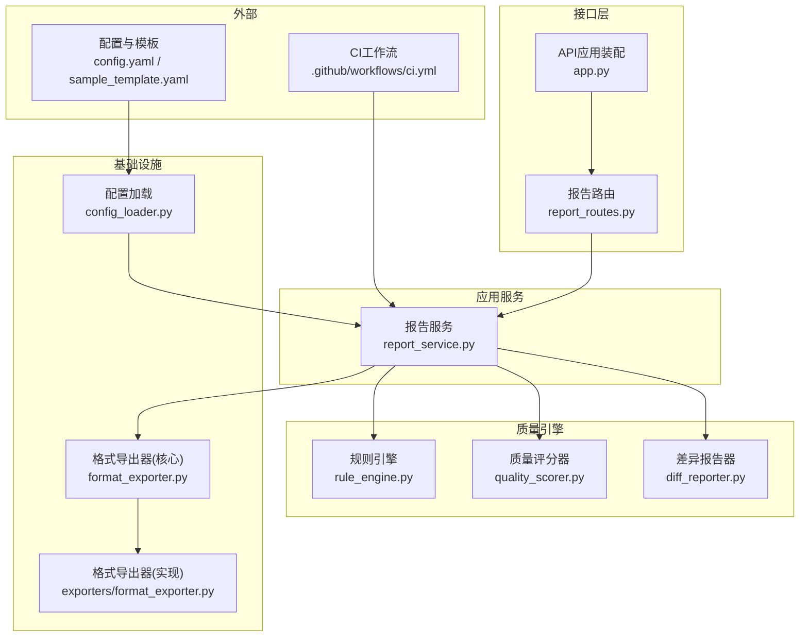
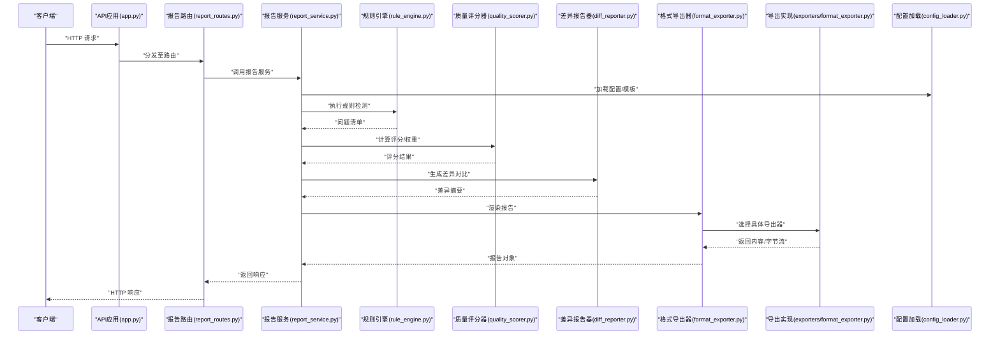
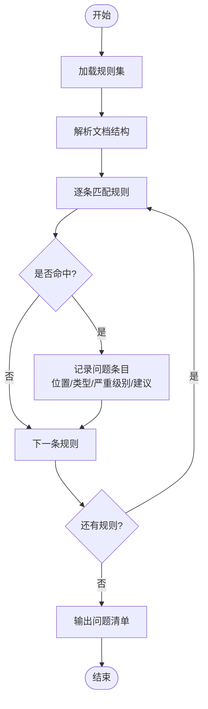
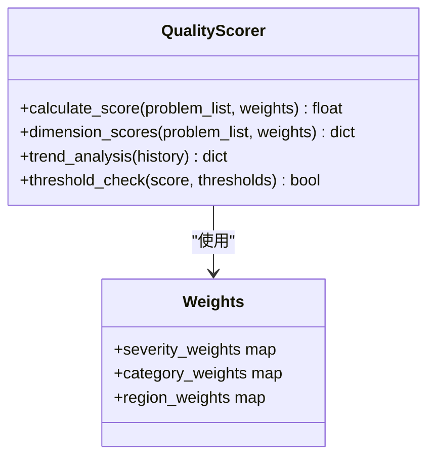
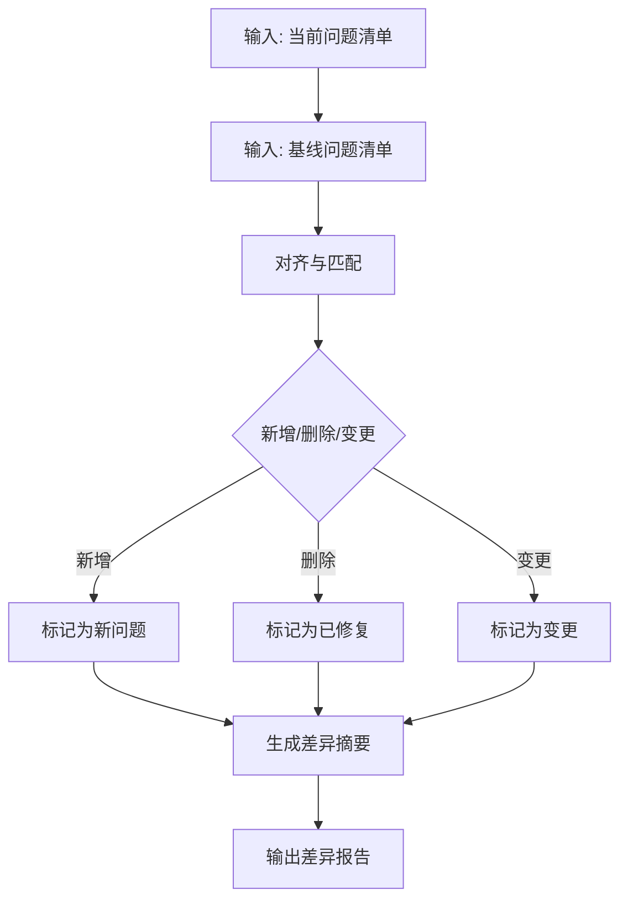
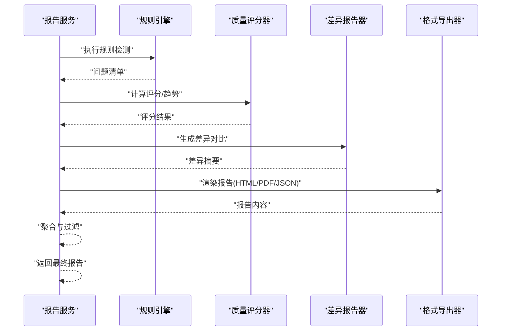
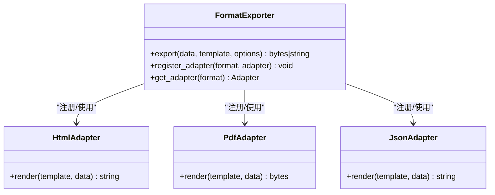
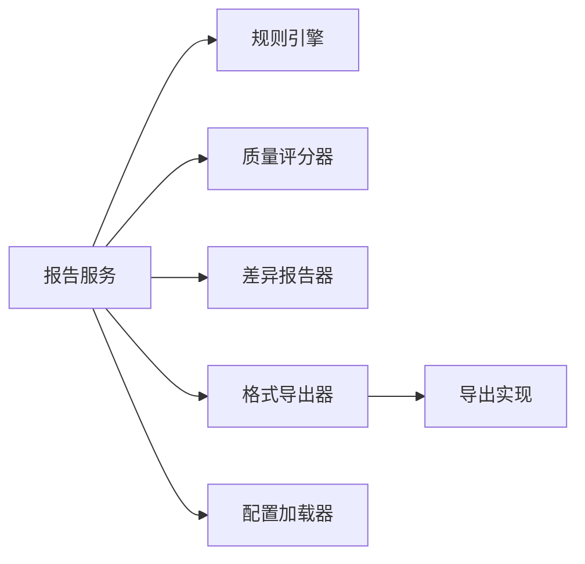

# 质量检查报告生成

<cite>
**本文引用的文件**   
- [src/paper_format_corrector/quality/diff_reporter.py](file://src/paper_format_corrector/quality/diff_reporter.py)
- [src/paper_format_corrector/quality/quality_scorer.py](file://src/paper_format_corrector/quality/quality_scorer.py)
- [src/paper_format_corrector/quality/rule_engine.py](file://src/paper_format_corrector/quality/rule_engine.py)
- [src/paper_format_corrector/application/services/report_service.py](file://src/paper_format_corrector/application/services/report_service.py)
- [src/paper_format_corrector/interfaces/api/routes/report_routes.py](file://src/paper_format_corrector/interfaces/api/routes/report_routes.py)
- [src/paper_format_corrector/interfaces/api/app.py](file://src/paper_format_corrector/interfaces/api/app.py)
- [src/paper_format_corrector/core/format_exporter.py](file://src/paper_format_corrector/core/format_exporter.py)
- [src/paper_format_corrector/infrastructure/exporters/format_exporter.py](file://src/paper_format_corrector/infrastructure/exporters/format_exporter.py)
- [src/paper_format_corrector/infrastructure/config/config_loader.py](file://src/paper_format_corrector/infrastructure/config/config_loader.py)
- [config/config.yaml](file://config/config.yaml)
- [examples/sample_template.yaml](file://examples/sample_template.yaml)
- [tests/test_report_service.py](file://tests/test_report_service.py)
- [.github/workflows/ci.yml](file://.github/workflows/ci.yml)
</cite>

## 目录
1. [简介](#简介)
2. [项目结构](#项目结构)
3. [核心组件](#核心组件)
4. [架构总览](#架构总览)
5. [详细组件分析](#详细组件分析)
6. [依赖关系分析](#依赖关系分析)
7. [性能考量](#性能考量)
8. [故障排查指南](#故障排查指南)
9. [结论](#结论)
10. [附录](#附录)

## 简介
本技术文档聚焦于“质量检查报告生成功能”，覆盖以下关键主题：
- 报告生成架构与数据流
- 质量评分算法、权重计算与趋势分析
- 差异对比机制（Diff）与问题定位
- 可视化展示方案与多格式输出（HTML、PDF、JSON）
- 报告API接口规范（配置、模板定制、过滤与聚合）
- CI/CD流水线集成实践

目标读者包括开发者、测试工程师、质量保障人员以及需要接入自动化流程的运维同学。

## 项目结构
围绕报告生成的代码主要分布在如下模块：
- 质量引擎层：规则引擎、评分器、差异报告器
- 应用服务层：报告编排服务，协调解析、评估、导出
- 接口层：REST API路由与应用装配
- 基础设施层：配置加载、格式导出器
- 示例与测试：模板样例、单元测试、CI工作流

图表来源
- [src/paper_format_corrector/quality/rule_engine.py](file://src/paper_format_corrector/quality/rule_engine.py)
- [src/paper_format_corrector/quality/quality_scorer.py](file://src/paper_format_corrector/quality/quality_scorer.py)
- [src/paper_format_corrector/quality/diff_reporter.py](file://src/paper_format_corrector/quality/diff_reporter.py)
- [src/paper_format_corrector/application/services/report_service.py](file://src/paper_format_corrector/application/services/report_service.py)
- [src/paper_format_corrector/interfaces/api/app.py](file://src/paper_format_corrector/interfaces/api/app.py)
- [src/paper_format_corrector/interfaces/api/routes/report_routes.py](file://src/paper_format_corrector/interfaces/api/routes/report_routes.py)
- [src/paper_format_corrector/core/format_exporter.py](file://src/paper_format_corrector/core/format_exporter.py)
- [src/paper_format_corrector/infrastructure/exporters/format_exporter.py](file://src/paper_format_corrector/infrastructure/exporters/format_exporter.py)
- [src/paper_format_corrector/infrastructure/config/config_loader.py](file://src/paper_format_corrector/infrastructure/config/config_loader.py)
- [config/config.yaml](file://config/config.yaml)
- [examples/sample_template.yaml](file://examples/sample_template.yaml)
- [.github/workflows/ci.yml](file://.github/workflows/ci.yml)

章节来源
- [src/paper_format_corrector/application/services/report_service.py](file://src/paper_format_corrector/application/services/report_service.py)
- [src/paper_format_corrector/interfaces/api/routes/report_routes.py](file://src/paper_format_corrector/interfaces/api/routes/report_routes.py)
- [src/paper_format_corrector/quality/rule_engine.py](file://src/paper_format_corrector/quality/rule_engine.py)
- [src/paper_format_corrector/quality/quality_scorer.py](file://src/paper_format_corrector/quality/quality_scorer.py)
- [src/paper_format_corrector/quality/diff_reporter.py](file://src/paper_format_corrector/quality/diff_reporter.py)
- [src/paper_format_corrector/core/format_exporter.py](file://src/paper_format_corrector/core/format_exporter.py)
- [src/paper_format_corrector/infrastructure/exporters/format_exporter.py](file://src/paper_format_corrector/infrastructure/exporters/format_exporter.py)
- [src/paper_format_corrector/infrastructure/config/config_loader.py](file://src/paper_format_corrector/infrastructure/config/config_loader.py)
- [config/config.yaml](file://config/config.yaml)
- [examples/sample_template.yaml](file://examples/sample_template.yaml)
- [.github/workflows/ci.yml](file://.github/workflows/ci.yml)

## 核心组件
- 规则引擎：负责将输入文档与预设规则进行匹配，产出结构化问题清单（含位置、类型、严重级别等）。
- 质量评分器：基于问题清单与权重策略计算综合得分，支持按维度统计与趋势指标。
- 差异报告器：对前后版本或基线进行比对，生成差异项与变更摘要，辅助定位回归问题。
- 报告服务：编排上述组件，完成从输入到报告的端到端流程，并对接导出器输出多种格式。
- 格式导出器：提供统一导出接口，内部适配HTML、PDF、JSON等具体实现。
- 配置加载器：读取系统配置与模板定义，驱动评分权重、规则集与导出模板。

章节来源
- [src/paper_format_corrector/quality/rule_engine.py](file://src/paper_format_corrector/quality/rule_engine.py)
- [src/paper_format_corrector/quality/quality_scorer.py](file://src/paper_format_corrector/quality/quality_scorer.py)
- [src/paper_format_corrector/quality/diff_reporter.py](file://src/paper_format_corrector/quality/diff_reporter.py)
- [src/paper_format_corrector/application/services/report_service.py](file://src/paper_format_corrector/application/services/report_service.py)
- [src/paper_format_corrector/core/format_exporter.py](file://src/paper_format_corrector/core/format_exporter.py)
- [src/paper_format_corrector/infrastructure/exporters/format_exporter.py](file://src/paper_format_corrector/infrastructure/exporters/format_exporter.py)
- [src/paper_format_corrector/infrastructure/config/config_loader.py](file://src/paper_format_corrector/infrastructure/config/config_loader.py)

## 架构总览
报告生成采用分层设计：接口层接收请求，应用服务层编排质量引擎与导出器，基础设施层提供配置与持久化能力。

图表来源
- [src/paper_format_corrector/interfaces/api/app.py](file://src/paper_format_corrector/interfaces/api/app.py)
- [src/paper_format_corrector/interfaces/api/routes/report_routes.py](file://src/paper_format_corrector/interfaces/api/routes/report_routes.py)
- [src/paper_format_corrector/application/services/report_service.py](file://src/paper_format_corrector/application/services/report_service.py)
- [src/paper_format_corrector/quality/rule_engine.py](file://src/paper_format_corrector/quality/rule_engine.py)
- [src/paper_format_corrector/quality/quality_scorer.py](file://src/paper_format_corrector/quality/quality_scorer.py)
- [src/paper_format_corrector/quality/diff_reporter.py](file://src/paper_format_corrector/quality/diff_reporter.py)
- [src/paper_format_corrector/core/format_exporter.py](file://src/paper_format_corrector/core/format_exporter.py)
- [src/paper_format_corrector/infrastructure/exporters/format_exporter.py](file://src/paper_format_corrector/infrastructure/exporters/format_exporter.py)
- [src/paper_format_corrector/infrastructure/config/config_loader.py](file://src/paper_format_corrector/infrastructure/config/config_loader.py)

## 详细组件分析

### 规则引擎（问题发现与定位）
- 职责：将文档结构与文本内容与规则集合进行匹配，产出标准化问题条目（包含位置信息、错误类型、严重级别、修复建议等）。
- 关键点：
  - 规则可配置化，支持按章节、段落、表格、图片等多粒度定位。
  - 严重级别映射到评分权重，便于后续量化。
  - 可扩展的规则注册机制，便于新增领域规则。

图表来源
- [src/paper_format_corrector/quality/rule_engine.py](file://src/paper_format_corrector/quality/rule_engine.py)

章节来源
- [src/paper_format_corrector/quality/rule_engine.py](file://src/paper_format_corrector/quality/rule_engine.py)

### 质量评分器（评分模型与趋势分析）
- 职责：根据问题清单与权重策略计算综合得分，支持多维度统计与历史趋势分析。
- 关键点：
  - 权重策略可配置，支持按严重级别、规则类别、文档区域加权。
  - 支持滚动窗口或时间序列的趋势指标（如近N次构建的平均分、方差、改善率）。
  - 阈值判定用于通过/失败决策，便于在CI中阻断低质量提交。

图表来源
- [src/paper_format_corrector/quality/quality_scorer.py](file://src/paper_format_corrector/quality/quality_scorer.py)

章节来源
- [src/paper_format_corrector/quality/quality_scorer.py](file://src/paper_format_corrector/quality/quality_scorer.py)

### 差异报告器（对比与回归定位）
- 职责：对当前版本与基线/上次版本进行差异对比，生成差异摘要与回归问题列表。
- 关键点：
  - 支持按问题ID、类型、严重级别进行差异过滤。
  - 输出变更热点区域，辅助快速定位回归点。
  - 可与评分器联动，计算“回归影响分”。

图表来源
- [src/paper_format_corrector/quality/diff_reporter.py](file://src/paper_format_corrector/quality/diff_reporter.py)

章节来源
- [src/paper_format_corrector/quality/diff_reporter.py](file://src/paper_format_corrector/quality/diff_reporter.py)

### 报告服务（编排与聚合）
- 职责：串联规则引擎、评分器、差异报告器与导出器，完成端到端报告生成。
- 关键点：
  - 支持批量处理与并发控制。
  - 提供数据过滤与聚合接口（按类型、严重级别、区域等维度）。
  - 与配置加载器协作，动态调整评分权重与导出模板。

图表来源
- [src/paper_format_corrector/application/services/report_service.py](file://src/paper_format_corrector/application/services/report_service.py)
- [src/paper_format_corrector/quality/rule_engine.py](file://src/paper_format_corrector/quality/rule_engine.py)
- [src/paper_format_corrector/quality/quality_scorer.py](file://src/paper_format_corrector/quality/quality_scorer.py)
- [src/paper_format_corrector/quality/diff_reporter.py](file://src/paper_format_corrector/quality/diff_reporter.py)
- [src/paper_format_corrector/core/format_exporter.py](file://src/paper_format_corrector/core/format_exporter.py)

章节来源
- [src/paper_format_corrector/application/services/report_service.py](file://src/paper_format_corrector/application/services/report_service.py)

### 格式导出器（多格式输出）
- 职责：提供统一的导出接口，内部适配HTML、PDF、JSON等具体实现。
- 关键点：
  - HTML交互式报告：支持筛选、排序、跳转定位。
  - PDF摘要报告：适合归档与打印。
  - JSON结构化数据：便于二次加工与系统集成。
  - 模板定制：通过模板配置文件控制布局与字段。

图表来源
- [src/paper_format_corrector/core/format_exporter.py](file://src/paper_format_corrector/core/format_exporter.py)
- [src/paper_format_corrector/infrastructure/exporters/format_exporter.py](file://src/paper_format_corrector/infrastructure/exporters/format_exporter.py)

章节来源
- [src/paper_format_corrector/core/format_exporter.py](file://src/paper_format_corrector/core/format_exporter.py)
- [src/paper_format_corrector/infrastructure/exporters/format_exporter.py](file://src/paper_format_corrector/infrastructure/exporters/format_exporter.py)

### 配置加载器（权重与模板）
- 职责：加载系统配置与模板定义，驱动评分权重、规则集与导出模板。
- 关键点：
  - 支持YAML配置，便于非代码方式调整策略。
  - 模板变量与占位符替换，支持多语言与品牌化。
  - 环境隔离：不同环境（开发/测试/生产）使用不同配置。

章节来源
- [src/paper_format_corrector/infrastructure/config/config_loader.py](file://src/paper_format_corrector/infrastructure/config/config_loader.py)
- [config/config.yaml](file://config/config.yaml)
- [examples/sample_template.yaml](file://examples/sample_template.yaml)

## 依赖关系分析
- 耦合度：
  - 报告服务对规则引擎、评分器、差异报告器存在强依赖，但通过接口抽象降低直接耦合。
  - 导出器通过适配器模式解耦具体格式实现，扩展性好。
- 外部依赖：
  - 配置加载器依赖YAML解析库。
  - 导出器可能依赖HTML渲染与PDF生成库（由具体实现决定）。
- 潜在循环依赖：
  - 各组件以单向调用为主，未发现明显循环依赖。

图表来源
- [src/paper_format_corrector/application/services/report_service.py](file://src/paper_format_corrector/application/services/report_service.py)
- [src/paper_format_corrector/quality/rule_engine.py](file://src/paper_format_corrector/quality/rule_engine.py)
- [src/paper_format_corrector/quality/quality_scorer.py](file://src/paper_format_corrector/quality/quality_scorer.py)
- [src/paper_format_corrector/quality/diff_reporter.py](file://src/paper_format_corrector/quality/diff_reporter.py)
- [src/paper_format_corrector/core/format_exporter.py](file://src/paper_format_corrector/core/format_exporter.py)
- [src/paper_format_corrector/infrastructure/exporters/format_exporter.py](file://src/paper_format_corrector/infrastructure/exporters/format_exporter.py)
- [src/paper_format_corrector/infrastructure/config/config_loader.py](file://src/paper_format_corrector/infrastructure/config/config_loader.py)

章节来源
- [src/paper_format_corrector/application/services/report_service.py](file://src/paper_format_corrector/application/services/report_service.py)
- [src/paper_format_corrector/core/format_exporter.py](file://src/paper_format_corrector/core/format_exporter.py)
- [src/paper_format_corrector/infrastructure/exporters/format_exporter.py](file://src/paper_format_corrector/infrastructure/exporters/format_exporter.py)
- [src/paper_format_corrector/infrastructure/config/config_loader.py](file://src/paper_format_corrector/infrastructure/config/config_loader.py)

## 性能考量
- 规则匹配优化：
  - 对大规模文档，建议启用索引与缓存，减少重复解析。
  - 规则集可按文档类型预分组，避免全量扫描。
- 评分计算优化：
  - 增量评分：仅对变更部分重新计算，结合差异报告器输出。
  - 并行计算：对独立维度评分进行并发处理。
- 导出性能：
  - HTML报告按需渲染，避免一次性生成超大DOM。
  - PDF生成可异步队列化，避免阻塞主流程。
- 内存管理：
  - 流式处理大文件，避免一次性加载全部节点。
  - 及时释放中间结果引用，防止内存泄漏。

[本节为通用指导，不直接分析具体文件]

## 故障排查指南
- 常见问题：
  - 配置加载失败：检查YAML语法与路径权限。
  - 规则未命中：确认规则集版本与文档结构匹配。
  - 评分异常：核对权重配置与阈值设置。
  - 导出失败：检查模板变量是否完整、依赖库是否安装。
- 调试建议：
  - 开启详细日志，记录规则匹配与评分过程。
  - 使用最小复现用例验证规则与模板。
  - 在本地模拟CI环境，确保一致性与可重现性。

章节来源
- [tests/test_report_service.py](file://tests/test_report_service.py)

## 结论
本报告生成体系以规则引擎为核心，配合评分器与差异报告器形成闭环，并通过导出器实现多格式输出。其模块化设计与配置化策略使得系统具备良好的可扩展性与可维护性，适用于持续集成与质量治理场景。

[本节为总结性内容，不直接分析具体文件]

## 附录

### 报告API接口文档
- 基础信息：
  - 入口：应用装配与路由位于接口层。
  - 方法：支持POST/GET等标准HTTP方法。
  - 认证：根据部署环境决定是否启用鉴权。
- 主要端点：
  - 生成报告：提交文档与配置，返回指定格式的报告。
  - 查询历史：按任务ID或时间范围获取历史报告。
  - 配置管理：上传/更新评分权重与导出模板。
- 请求参数：
  - 文档输入：文件路径或二进制流。
  - 配置选项：评分权重、过滤条件、聚合维度。
  - 输出格式：html/pdf/json。
- 响应格式：
  - HTML：字符串或文件流。
  - PDF：二进制流。
  - JSON：结构化数据，包含评分、问题清单、差异摘要等。
- 错误码：
  - 400：参数校验失败。
  - 404：资源不存在。
  - 500：服务器内部错误。

章节来源
- [src/paper_format_corrector/interfaces/api/app.py](file://src/paper_format_corrector/interfaces/api/app.py)
- [src/paper_format_corrector/interfaces/api/routes/report_routes.py](file://src/paper_format_corrector/interfaces/api/routes/report_routes.py)

### 报告格式配置与模板定制
- 配置项：
  - 评分权重：按严重级别、类别、区域设置权重。
  - 阈值：通过/警告/失败阈值。
  - 导出模板：HTML/PDF模板变量与布局。
- 模板变量：
  - 标题、作者、日期、版本号。
  - 评分总分、维度分数、问题统计。
  - 差异摘要与回归风险。
- 示例模板：
  - 参考示例模板文件，了解变量命名与占位符用法。

章节来源
- [config/config.yaml](file://config/config.yaml)
- [examples/sample_template.yaml](file://examples/sample_template.yaml)

### 数据过滤与聚合功能
- 过滤维度：
  - 严重级别：高/中/低。
  - 规则类别：排版、引用、图表等。
  - 文档区域：章节、段落、页眉页脚等。
- 聚合方式：
  - 按类型统计数量与占比。
  - 按区域汇总问题密度。
  - 按时间序列计算趋势指标。

章节来源
- [src/paper_format_corrector/application/services/report_service.py](file://src/paper_format_corrector/application/services/report_service.py)

### 质量评分模型与趋势分析
- 模型构成：
  - 基础分：满分减去扣分项。
  - 扣分项：按严重级别与权重计算。
  - 调节项：按文档复杂度或区域重要性微调。
- 趋势分析：
  - 移动平均：平滑短期波动。
  - 方差与标准差：衡量稳定性。
  - 改善率：比较相邻周期得分变化。

章节来源
- [src/paper_format_corrector/quality/quality_scorer.py](file://src/paper_format_corrector/quality/quality_scorer.py)

### 多格式报告示例
- HTML交互式报告：
  - 特点：支持筛选、排序、跳转定位。
  - 适用：日常审查与团队协作。
- PDF摘要报告：
  - 特点：固定布局，适合归档与打印。
  - 适用：正式交付与审计。
- JSON结构化数据：
  - 特点：机器可读，便于二次加工。
  - 适用：系统集成与数据分析。

章节来源
- [src/paper_format_corrector/core/format_exporter.py](file://src/paper_format_corrector/core/format_exporter.py)
- [src/paper_format_corrector/infrastructure/exporters/format_exporter.py](file://src/paper_format_corrector/infrastructure/exporters/format_exporter.py)

### CI/CD流水线集成
- 集成步骤：
  - 在流水线中调用报告API或CLI。
  - 设置阈值，低于阈值则标记构建失败。
  - 保存报告产物作为构建附件。
  - 可选：推送趋势指标到监控系统。
- 注意事项：
  - 缓存依赖与模板，提升构建速度。
  - 隔离环境变量，避免污染。
  - 重试与超时策略，增强鲁棒性。

章节来源
- [.github/workflows/ci.yml](file://.github/workflows/ci.yml)