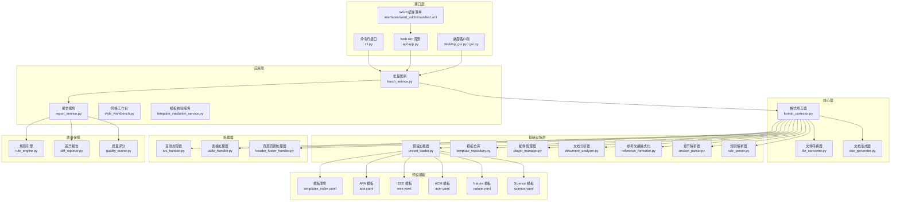
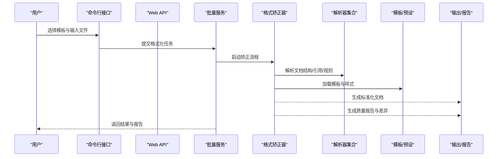
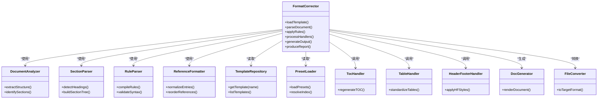
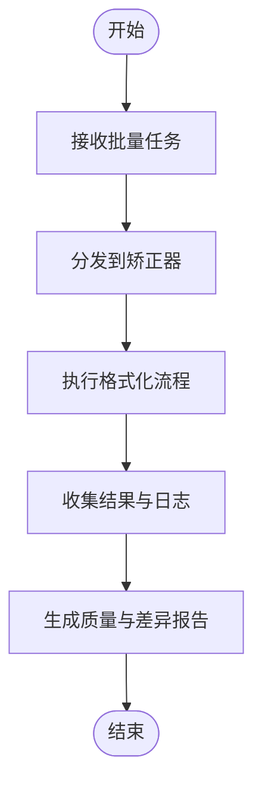
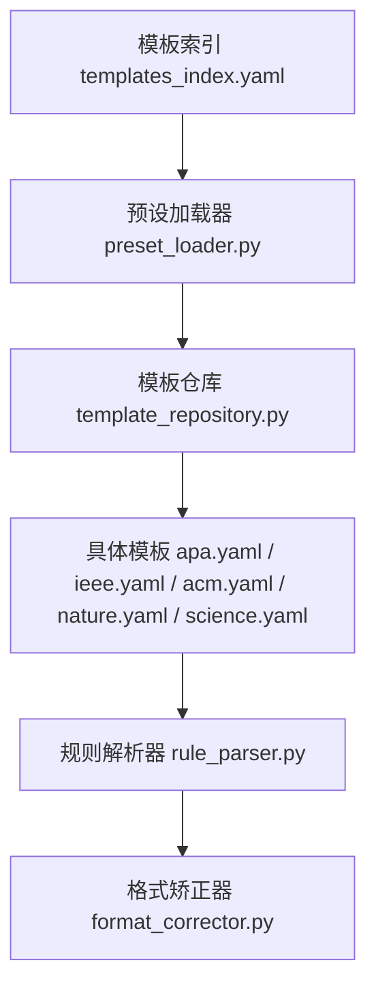
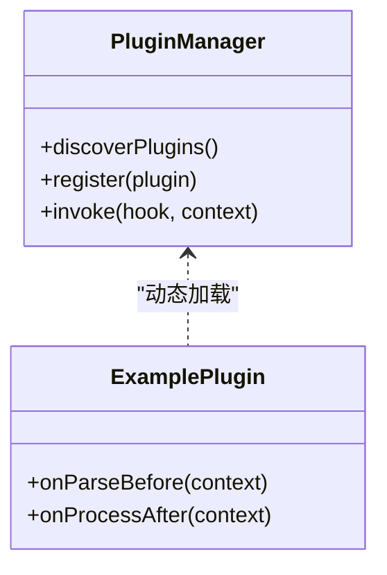
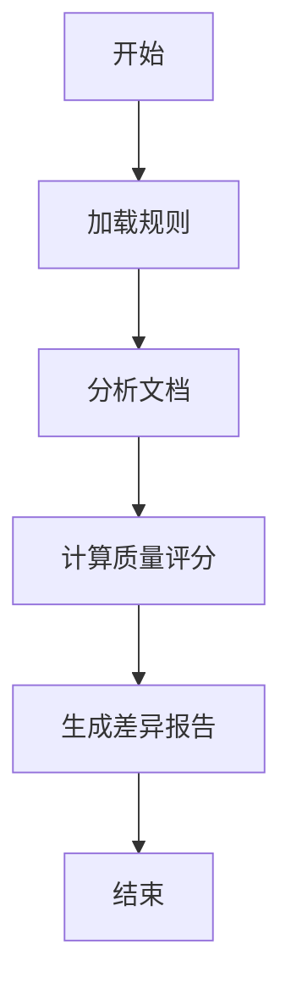
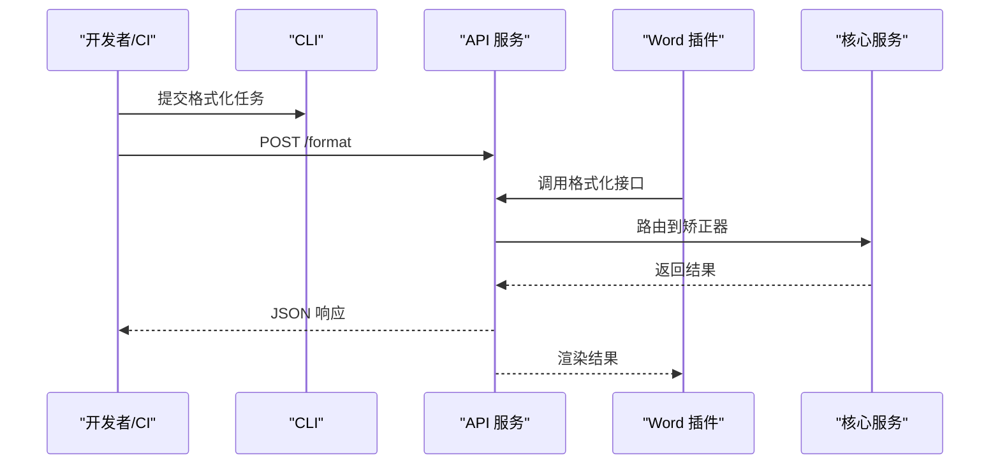
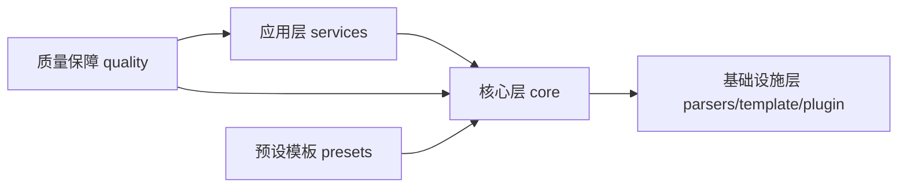

# 项目介绍

<cite>
**本文引用的文件**   
- [README.md](file://README.md)
- [pyproject.toml](file://pyproject.toml)
- [requirements.txt](file://requirements.txt)
- [src/paper_format_corrector/__main__.py](file://src/paper_format_corrector/__main__.py)
- [src/paper_format_corrector/app.py](file://src/paper_format_corrector/app.py)
- [src/paper_format_corrector/cli.py](file://src/paper_format_corrector/cli.py)
- [src/paper_format_corrector/api/app.py](file://src/paper_format_corrector/api/app.py)
- [src/paper_format_corrector/core/format_corrector.py](file://src/paper_format_corrector/core/format_corrector.py)
- [src/paper_format_corrector/core/file_converter.py](file://src/paper_format_corrector/core/file_converter.py)
- [src/paper_format_corrector/core/doc_generator.py](file://src/paper_format_corrector/core/doc_generator.py)
- [src/paper_format_corrector/infrastructure/parsers/document_analyzer.py](file://src/paper_format_corrector/infrastructure/parsers/document_analyzer.py)
- [src/paper_format_corrector/infrastructure/parsers/reference_formatter.py](file://src/paper_format_corrector/infrastructure/parsers/reference_formatter.py)
- [src/paper_format_corrector/infrastructure/parsers/section_parser.py](file://src/paper_format_corrector/infrastructure/parsers/section_parser.py)
- [src/paper_format_corrector/infrastructure/parsers/rule_parser.py](file://src/paper_format_corrector/infrastructure/parsers/rule_parser.py)
- [src/paper_format_corrector/infrastructure/template_repository.py](file://src/paper_format_corrector/infrastructure/template_repository.py)
- [src/paper_format_corrector/infra/preset_loader.py](file://src/paper_format_corrector/infra/preset_loader.py)
- [src/paper_format_corrector/infra/plugin_manager.py](file://src/paper_format_corrector/infra/plugin_manager.py)
- [src/paper_format_corrector/application/services/batch_service.py](file://src/paper_format_corrector/application/services/batch_service.py)
- [src/paper_format_corrector/application/services/report_service.py](file://src/paper_format_corrector/application/services/report_service.py)
- [src/paper_format_corrector/application/services/style_workbench.py](file://src/paper_format_corrector/application/services/style_workbench.py)
- [src/paper_format_corrector/application/services/template_validation_service.py](file://src/paper_format_corrector/application/services/template_validation_service.py)
- [src/paper_format_corrector/handlers/toc_handler.py](file://src/paper_format_corrector/handlers/toc_handler.py)
- [src/paper_format_corrector/handlers/table_handler.py](file://src/paper_format_corrector/handlers/table_handler.py)
- [src/paper_format_corrector/handlers/header_footer_handler.py](file://src/paper_format_corrector/handlers/header_footer_handler.py)
- [src/paper_format_corrector/quality/rule_engine.py](file://src/paper_format_corrector/quality/rule_engine.py)
- [src/paper_format_corrector/quality/diff_reporter.py](file://src/paper_format_corrector/quality/diff_reporter.py)
- [src/paper_format_corrector/quality/quality_scorer.py](file://src/paper_format_corrector/quality/quality_scorer.py)
- [presets/templates_index.yaml](file://presets/templates_index.yaml)
- [presets/apa.yaml](file://presets/apa.yaml)
- [presets/ieee.yaml](file://presets/ieee.yaml)
- [presets/acm.yaml](file://presets/acm.yaml)
- [presets/nature.yaml](file://presets/nature.yaml)
- [presets/science.yaml](file://presets/science.yaml)
- [examples/sample_template.yaml](file://examples/sample_template.yaml)
- [interfaces/word_addin/manifest.xml](file://interfaces/word_addin/manifest.xml)
- [tests/test_presets.py](file://tests/test_presets.py)
- [tests/test_cli_integration.py](file://tests/test_cli_integration.py)
- [tests/test_api_endpoints.py](file://tests/test_api_endpoints.py)
</cite>

## 目录
1. [简介](#简介)
2. [项目结构](#项目结构)
3. [核心组件](#核心组件)
4. [架构总览](#架构总览)
5. [详细组件分析](#详细组件分析)
6. [依赖关系分析](#依赖关系分析)
7. [性能与扩展性](#性能与扩展性)
8. [故障排查指南](#故障排查指南)
9. [结论](#结论)
10. [附录](#附录)

## 简介
本项目是一个面向学术论文的“格式矫正工具”，旨在帮助研究人员、学生与编辑将论文快速、稳定地标准化为权威期刊与会议要求的排版格式。工具内置对 APA、IEEE、ACM、Nature、Science 等主流学术格式的模板支持，并提供智能检测、批量处理、插件扩展、质量报告与差异对比等能力，显著降低人工校对成本，提升投稿效率与一致性。

核心价值主张：
- 一键标准化：基于模板驱动，自动完成标题层级、段落样式、图表编号、参考文献格式等关键要素的规范化。
- 多格式覆盖：通过可插拔模板体系，持续扩展至 50+ 种学术格式标准，满足跨学科、跨机构的多场景需求。
- 智能辅助：文档解析与规则引擎协同工作，提供自动补全、交叉引用修复、质量评分与差异报告。
- 工程化能力：CLI、API、桌面端与 Word 插件多入口，支持批量任务队列与远程协作（预留接口）。

目标用户与典型场景：
- 研究人员/博士生：在投稿前统一格式，减少返修时间；批量处理课题组多篇稿件。
- 期刊/会议编辑：对大量投稿进行一致性检查与初步格式化，生成质量报告。
- 高校学生：学位论文、课程论文的格式规范与模板导入。

技术优势与创新点：
- 智能格式检测：结合文档分析与规则解析，自动识别章节结构与引用模式。
- 模板驱动与插件扩展：YAML 模板定义 + Python 插件机制，便于社区贡献新格式。
- 批处理与质量闭环：任务队列 + 质量评分 + 差异报告，形成“检测—修正—验证”的完整流程。

## 项目结构
仓库采用分层与领域驱动相结合的组织方式：
- 应用层：服务编排（批量、报告、风格工作台、模板校验）
- 核心层：格式矫正、文件转换、文档生成
- 基础设施层：解析器（文档、章节、引用、规则）、模板仓库、预设加载、插件管理
- 接口层：CLI、API、桌面 GUI、Word 插件
- 质量保障：规则引擎、差异报告、质量评分
- 预设模板：以 YAML 定义的学术格式模板集合与索引

图示来源
- [src/paper_format_corrector/cli.py](file://src/paper_format_corrector/cli.py)
- [src/paper_format_corrector/api/app.py](file://src/paper_format_corrector/api/app.py)
- [src/paper_format_corrector/application/services/batch_service.py](file://src/paper_format_corrector/application/services/batch_service.py)
- [src/paper_format_corrector/core/format_corrector.py](file://src/paper_format_corrector/core/format_corrector.py)
- [src/paper_format_corrector/core/file_converter.py](file://src/paper_format_corrector/core/file_converter.py)
- [src/paper_format_corrector/core/doc_generator.py](file://src/paper_format_corrector/core/doc_generator.py)
- [src/paper_format_corrector/infra/preset_loader.py](file://src/paper_format_corrector/infra/preset_loader.py)
- [src/paper_format_corrector/infrastructure/template_repository.py](file://src/paper_format_corrector/infrastructure/template_repository.py)
- [src/paper_format_corrector/infra/plugin_manager.py](file://src/paper_format_corrector/infra/plugin_manager.py)
- [src/paper_format_corrector/infrastructure/parsers/document_analyzer.py](file://src/paper_format_corrector/infrastructure/parsers/document_analyzer.py)
- [src/paper_format_corrector/infrastructure/parsers/reference_formatter.py](file://src/paper_format_corrector/infrastructure/parsers/reference_formatter.py)
- [src/paper_format_corrector/infrastructure/parsers/section_parser.py](file://src/paper_format_corrector/infrastructure/parsers/section_parser.py)
- [src/paper_format_corrector/infrastructure/parsers/rule_parser.py](file://src/paper_format_corrector/infrastructure/parsers/rule_parser.py)
- [src/paper_format_corrector/handlers/toc_handler.py](file://src/paper_format_corrector/handlers/toc_handler.py)
- [src/paper_format_corrector/handlers/table_handler.py](file://src/paper_format_corrector/handlers/table_handler.py)
- [src/paper_format_corrector/handlers/header_footer_handler.py](file://src/paper_format_corrector/handlers/header_footer_handler.py)
- [src/paper_format_corrector/quality/rule_engine.py](file://src/paper_format_corrector/quality/rule_engine.py)
- [src/paper_format_corrector/quality/diff_reporter.py](file://src/paper_format_corrector/quality/diff_reporter.py)
- [src/paper_format_corrector/quality/quality_scorer.py](file://src/paper_format_corrector/quality/quality_scorer.py)
- [presets/templates_index.yaml](file://presets/templates_index.yaml)
- [presets/apa.yaml](file://presets/apa.yaml)
- [presets/ieee.yaml](file://presets/ieee.yaml)
- [presets/acm.yaml](file://presets/acm.yaml)
- [presets/nature.yaml](file://presets/nature.yaml)
- [presets/science.yaml](file://presets/science.yaml)

章节来源
- [README.md](file://README.md)
- [pyproject.toml](file://pyproject.toml)
- [requirements.txt](file://requirements.txt)

## 核心组件
- 入口与运行期
  - 命令行入口与主程序装配：[__main__.py](file://src/paper_format_corrector/__main__.py)、[app.py](file://src/paper_format_corrector/app.py)
  - CLI 命令集与参数解析：[cli.py](file://src/paper_format_corrector/cli.py)
  - Web API 服务：[api/app.py](file://src/paper_format_corrector/api/app.py)
- 核心处理链
  - 格式矫正器：协调解析、模板、处理器与输出，是整条流水线的主控：[format_corrector.py](file://src/paper_format_corrector/core/format_corrector.py)
  - 文件转换器：负责输入/输出格式适配与中间表示：[file_converter.py](file://src/paper_format_corrector/core/file_converter.py)
  - 文档生成器：按模板与规则生成最终文档对象：[doc_generator.py](file://src/paper_format_corrector/core/doc_generator.py)
- 解析与规则
  - 文档分析器：抽取章节、段落、图片表格等结构信息：[document_analyzer.py](file://src/paper_format_corrector/infrastructure/parsers/document_analyzer.py)
  - 章节解析器：识别标题层级与结构类型：[section_parser.py](file://src/paper_format_corrector/infrastructure/parsers/section_parser.py)
  - 引用格式化器：根据模板与规则重构参考文献条目：[reference_formatter.py](file://src/paper_format_corrector/infrastructure/parsers/reference_formatter.py)
  - 规则解析器：读取并编译模板中的格式规则：[rule_parser.py](file://src/paper_format_corrector/infrastructure/parsers/rule_parser.py)
- 模板与预设
  - 模板仓库：集中管理与加载模板资源：[template_repository.py](file://src/paper_format_corrector/infrastructure/template_repository.py)
  - 预设加载器：从 presets 目录加载 YAML 模板与索引：[preset_loader.py](file://src/paper_format_corrector/infra/preset_loader.py)
  - 模板索引与示例：[templates_index.yaml](file://presets/templates_index.yaml)、[sample_template.yaml](file://examples/sample_template.yaml)
  - 主流格式模板：APA、IEEE、ACM、Nature、Science 等：[apa.yaml](file://presets/apa.yaml)、[ieee.yaml](file://presets/ieee.yaml)、[acm.yaml](file://presets/acm.yaml)、[nature.yaml](file://presets/nature.yaml)、[science.yaml](file://presets/science.yaml)
- 插件扩展
  - 插件管理器：动态发现、注册与调用插件：[plugin_manager.py](file://src/paper_format_corrector/infra/plugin_manager.py)
- 应用服务
  - 批量服务：任务调度与并发执行：[batch_service.py](file://src/paper_format_corrector/application/services/batch_service.py)
  - 报告服务：汇总质量指标与差异报告：[report_service.py](file://src/paper_format_corrector/application/services/report_service.py)
  - 风格工作台：交互式模板调试与预览：[style_workbench.py](file://src/paper_format_corrector/application/services/style_workbench.py)
  - 模板校验服务：校验模板语法与完整性：[template_validation_service.py](file://src/paper_format_corrector/application/services/template_validation_service.py)
- 处理器
  - 目录、表格、页眉页脚等专项处理器：[toc_handler.py](file://src/paper_format_corrector/handlers/toc_handler.py)、[table_handler.py](file://src/paper_format_corrector/handlers/table_handler.py)、[header_footer_handler.py](file://src/paper_format_corrector/handlers/header_footer_handler.py)
- 质量保障
  - 规则引擎、差异报告、质量评分：[rule_engine.py](file://src/paper_format_corrector/quality/rule_engine.py)、[diff_reporter.py](file://src/paper_format_corrector/quality/diff_reporter.py)、[quality_scorer.py](file://src/paper_format_corrector/quality/quality_scorer.py)

章节来源
- [src/paper_format_corrector/__main__.py](file://src/paper_format_corrector/__main__.py)
- [src/paper_format_corrector/app.py](file://src/paper_format_corrector/app.py)
- [src/paper_format_corrector/cli.py](file://src/paper_format_corrector/cli.py)
- [src/paper_format_corrector/api/app.py](file://src/paper_format_corrector/api/app.py)
- [src/paper_format_corrector/core/format_corrector.py](file://src/paper_format_corrector/core/format_corrector.py)
- [src/paper_format_corrector/core/file_converter.py](file://src/paper_format_corrector/core/file_converter.py)
- [src/paper_format_corrector/core/doc_generator.py](file://src/paper_format_corrector/core/doc_generator.py)
- [src/paper_format_corrector/infrastructure/parsers/document_analyzer.py](file://src/paper_format_corrector/infrastructure/parsers/document_analyzer.py)
- [src/paper_format_corrector/infrastructure/parsers/reference_formatter.py](file://src/paper_format_corrector/infrastructure/parsers/reference_formatter.py)
- [src/paper_format_corrector/infrastructure/parsers/section_parser.py](file://src/paper_format_corrector/infrastructure/parsers/section_parser.py)
- [src/paper_format_corrector/infrastructure/parsers/rule_parser.py](file://src/paper_format_corrector/infrastructure/parsers/rule_parser.py)
- [src/paper_format_corrector/infrastructure/template_repository.py](file://src/paper_format_corrector/infrastructure/template_repository.py)
- [src/paper_format_corrector/infra/preset_loader.py](file://src/paper_format_corrector/infra/preset_loader.py)
- [src/paper_format_corrector/infra/plugin_manager.py](file://src/paper_format_corrector/infra/plugin_manager.py)
- [src/paper_format_corrector/application/services/batch_service.py](file://src/paper_format_corrector/application/services/batch_service.py)
- [src/paper_format_corrector/application/services/report_service.py](file://src/paper_format_corrector/application/services/report_service.py)
- [src/paper_format_corrector/application/services/style_workbench.py](file://src/paper_format_corrector/application/services/style_workbench.py)
- [src/paper_format_corrector/application/services/template_validation_service.py](file://src/paper_format_corrector/application/services/template_validation_service.py)
- [src/paper_format_corrector/handlers/toc_handler.py](file://src/paper_format_corrector/handlers/toc_handler.py)
- [src/paper_format_corrector/handlers/table_handler.py](file://src/paper_format_corrector/handlers/table_handler.py)
- [src/paper_format_corrector/handlers/header_footer_handler.py](file://src/paper_format_corrector/handlers/header_footer_handler.py)
- [src/paper_format_corrector/quality/rule_engine.py](file://src/paper_format_corrector/quality/rule_engine.py)
- [src/p_paper_format_corrector/quality/diff_reporter.py](file://src/paper_format_corrector/quality/diff_reporter.py)
- [src/paper_format_corrector/quality/quality_scorer.py](file://src/paper_format_corrector/quality/quality_scorer.py)
- [presets/templates_index.yaml](file://presets/templates_index.yaml)
- [examples/sample_template.yaml](file://examples/sample_template.yaml)
- [presets/apa.yaml](file://presets/apa.yaml)
- [presets/ieee.yaml](file://presets/ieee.yaml)
- [presets/acm.yaml](file://presets/acm.yaml)
- [presets/nature.yaml](file://presets/nature.yaml)
- [presets/science.yaml](file://presets/science.yaml)

## 架构总览
系统采用“接口层—应用层—核心层—基础设施层”的分层架构，配合“模板驱动 + 插件扩展”的设计，实现高内聚、低耦合与易扩展。

图示来源
- [src/paper_format_corrector/cli.py](file://src/paper_format_corrector/cli.py)
- [src/paper_format_corrector/api/app.py](file://src/paper_format_corrector/api/app.py)
- [src/paper_format_corrector/application/services/batch_service.py](file://src/paper_format_corrector/application/services/batch_service.py)
- [src/paper_format_corrector/core/format_corrector.py](file://src/paper_format_corrector/core/format_corrector.py)
- [src/paper_format_corrector/infrastructure/parsers/document_analyzer.py](file://src/paper_format_corrector/infrastructure/parsers/document_analyzer.py)
- [src/paper_format_corrector/infrastructure/parsers/reference_formatter.py](file://src/paper_format_corrector/infrastructure/parsers/reference_formatter.py)
- [src/paper_format_corrector/infrastructure/parsers/section_parser.py](file://src/paper_format_corrector/infrastructure/parsers/section_parser.py)
- [src/paper_format_corrector/infrastructure/parsers/rule_parser.py](file://src/paper_format_corrector/infrastructure/parsers/rule_parser.py)
- [src/paper_format_corrector/infra/preset_loader.py](file://src/paper_format_corrector/infra/preset_loader.py)
- [src/paper_format_corrector/infrastructure/template_repository.py](file://src/paper_format_corrector/infrastructure/template_repository.py)
- [src/paper_format_corrector/application/services/report_service.py](file://src/paper_format_corrector/application/services/report_service.py)

## 详细组件分析

### 格式矫正器（核心编排）
- 职责：串联解析、模板、处理器与输出，维护矫正上下文与状态。
- 关键点：
  - 解析阶段：调用文档分析器、章节解析器、规则解析器构建结构化中间表示。
  - 模板阶段：从模板仓库与预设加载器获取模板与样式规则。
  - 处理阶段：按顺序执行目录、表格、页眉页脚等处理器。
  - 输出阶段：调用文档生成器与文件转换器产出目标格式。
  - 质量阶段：触发规则引擎、差异报告与质量评分。

图示来源
- [src/paper_format_corrector/core/format_corrector.py](file://src/paper_format_corrector/core/format_corrector.py)
- [src/paper_format_corrector/infrastructure/parsers/document_analyzer.py](file://src/paper_format_corrector/infrastructure/parsers/document_analyzer.py)
- [src/paper_format_corrector/infrastructure/parsers/section_parser.py](file://src/paper_format_corrector/infrastructure/parsers/section_parser.py)
- [src/paper_format_corrector/infrastructure/parsers/rule_parser.py](file://src/paper_format_corrector/infrastructure/parsers/rule_parser.py)
- [src/paper_format_corrector/infrastructure/parsers/reference_formatter.py](file://src/paper_format_corrector/infrastructure/parsers/reference_formatter.py)
- [src/paper_format_corrector/infrastructure/template_repository.py](file://src/paper_format_corrector/infrastructure/template_repository.py)
- [src/paper_format_corrector/infra/preset_loader.py](file://src/paper_format_corrector/infra/preset_loader.py)
- [src/paper_format_corrector/handlers/toc_handler.py](file://src/paper_format_corrector/handlers/toc_handler.py)
- [src/paper_format_corrector/handlers/table_handler.py](file://src/paper_format_corrector/handlers/table_handler.py)
- [src/paper_format_corrector/handlers/header_footer_handler.py](file://src/paper_format_corrector/handlers/header_footer_handler.py)
- [src/paper_format_corrector/core/doc_generator.py](file://src/paper_format_corrector/core/doc_generator.py)
- [src/paper_format_corrector/core/file_converter.py](file://src/paper_format_corrector/core/file_converter.py)

章节来源
- [src/paper_format_corrector/core/format_corrector.py](file://src/paper_format_corrector/core/format_corrector.py)

### 批量服务与任务队列
- 职责：接收批量任务、调度执行、聚合结果与报告。
- 关键点：
  - 任务入队与并发控制
  - 进度追踪与失败重试
  - 与报告服务集成，生成汇总报告

图示来源
- [src/paper_format_corrector/application/services/batch_service.py](file://src/paper_format_corrector/application/services/batch_service.py)
- [src/paper_format_corrector/application/services/report_service.py](file://src/paper_format_corrector/application/services/report_service.py)

章节来源
- [src/paper_format_corrector/application/services/batch_service.py](file://src/paper_format_corrector/application/services/batch_service.py)
- [src/paper_format_corrector/application/services/report_service.py](file://src/paper_format_corrector/application/services/report_service.py)

### 模板系统与预设加载
- 职责：提供多格式模板定义与加载机制，支撑 50+ 学术格式。
- 关键点：
  - 模板索引与版本管理
  - YAML 模板语法与校验
  - 预置模板（APA、IEEE、ACM、Nature、Science 等）

图示来源
- [presets/templates_index.yaml](file://presets/templates_index.yaml)
- [src/paper_format_corrector/infra/preset_loader.py](file://src/paper_format_corrector/infra/preset_loader.py)
- [src/paper_format_corrector/infrastructure/template_repository.py](file://src/paper_format_corrector/infrastructure/template_repository.py)
- [src/paper_format_corrector/infrastructure/parsers/rule_parser.py](file://src/paper_format_corrector/infrastructure/parsers/rule_parser.py)
- [src/paper_format_corrector/core/format_corrector.py](file://src/paper_format_corrector/core/format_corrector.py)
- [presets/apa.yaml](file://presets/apa.yaml)
- [presets/ieee.yaml](file://presets/ieee.yaml)
- [presets/acm.yaml](file://presets/acm.yaml)
- [presets/nature.yaml](file://presets/nature.yaml)
- [presets/science.yaml](file://presets/science.yaml)

章节来源
- [presets/templates_index.yaml](file://presets/templates_index.yaml)
- [src/paper_format_corrector/infra/preset_loader.py](file://src/paper_format_corrector/infra/preset_loader.py)
- [src/paper_format_corrector/infrastructure/template_repository.py](file://src/paper_format_corrector/infrastructure/template_repository.py)
- [presets/apa.yaml](file://presets/apa.yaml)
- [presets/ieee.yaml](file://presets/ieee.yaml)
- [presets/acm.yaml](file://presets/acm.yaml)
- [presets/nature.yaml](file://presets/nature.yaml)
- [presets/science.yaml](file://presets/science.yaml)

### 插件扩展系统
- 职责：动态发现与加载外部插件，扩展格式化能力。
- 关键点：
  - 插件注册与生命周期管理
  - 钩子点：解析前后、处理前后、输出前后
  - 安全沙箱与权限控制（建议）

图示来源
- [src/paper_format_corrector/infra/plugin_manager.py](file://src/paper_format_corrector/infra/plugin_manager.py)

章节来源
- [src/paper_format_corrector/infra/plugin_manager.py](file://src/paper_format_corrector/infra/plugin_manager.py)

### 质量保障与差异报告
- 职责：依据规则引擎评估文档质量，生成差异报告与评分。
- 关键点：
  - 规则匹配与断言
  - 变更前后差异对比
  - 质量维度评分（结构、引用、样式等）

图示来源
- [src/paper_format_corrector/quality/rule_engine.py](file://src/paper_format_corrector/quality/rule_engine.py)
- [src/paper_format_corrector/quality/diff_reporter.py](file://src/paper_format_corrector/quality/diff_reporter.py)
- [src/paper_format_corrector/quality/quality_scorer.py](file://src/paper_format_corrector/quality/quality_scorer.py)

章节来源
- [src/paper_format_corrector/quality/rule_engine.py](file://src/paper_format_corrector/quality/rule_engine.py)
- [src/paper_format_corrector/quality/diff_reporter.py](file://src/paper_format_corrector/quality/diff_reporter.py)
- [src/paper_format_corrector/quality/quality_scorer.py](file://src/paper_format_corrector/quality/quality_scorer.py)

### 多入口与集成
- 命令行接口：适合脚本化与 CI/CD 集成
- Web API：适合服务端批量处理与第三方系统集成
- Word 插件：在 Word 环境中直接调用，提升用户体验

图示来源
- [src/paper_format_corrector/cli.py](file://src/paper_format_corrector/cli.py)
- [src/paper_format_corrector/api/app.py](file://src/paper_format_corrector/api/app.py)
- [interfaces/word_addin/manifest.xml](file://interfaces/word_addin/manifest.xml)

章节来源
- [src/paper_format_corrector/cli.py](file://src/paper_format_corrector/cli.py)
- [src/paper_format_corrector/api/app.py](file://src/paper_format_corrector/api/app.py)
- [interfaces/word_addin/manifest.xml](file://interfaces/word_addin/manifest.xml)

## 依赖关系分析
- 外部依赖
  - 包管理与依赖声明：[pyproject.toml](file://pyproject.toml)、[requirements.txt](file://requirements.txt)
- 内部模块耦合
  - 应用层依赖核心层与基础设施层
  - 核心层依赖解析器、模板与处理器
  - 质量保障贯穿全流程，作为横切关注点

图示来源
- [pyproject.toml](file://pyproject.toml)
- [requirements.txt](file://requirements.txt)
- [src/paper_format_corrector/application/services/batch_service.py](file://src/paper_format_corrector/application/services/batch_service.py)
- [src/paper_format_corrector/core/format_corrector.py](file://src/paper_format_corrector/core/format_corrector.py)
- [src/paper_format_corrector/infra/preset_loader.py](file://src/paper_format_corrector/infra/preset_loader.py)
- [src/paper_format_corrector/quality/rule_engine.py](file://src/paper_format_corrector/quality/rule_engine.py)

章节来源
- [pyproject.toml](file://pyproject.toml)
- [requirements.txt](file://requirements.txt)

## 性能与扩展性
- 批处理与并发：通过批量服务与任务队列提升吞吐，适合大规模稿件处理。
- 模板缓存：模板与规则解析结果可缓存，减少重复开销。
- 增量处理：仅对变更区域重新处理，提高大文档性能。
- 可扩展性：插件机制与 YAML 模板使新增格式与功能低成本接入。

## 故障排查指南
- 常见问题定位
  - 模板未找到或路径错误：检查模板索引与预设加载器配置
  - 规则语法错误：使用模板校验服务与规则解析器报错信息
  - 解析异常：查看文档分析器与章节解析器的诊断日志
  - 批量任务失败：核对任务队列状态与报告服务输出的错误摘要
- 建议步骤
  - 启用详细日志与差异报告
  - 使用最小复现样本隔离问题
  - 逐步禁用处理器与插件定位根因

章节来源
- [src/paper_format_corrector/application/services/template_validation_service.py](file://src/paper_format_corrector/application/services/template_validation_service.py)
- [src/paper_format_corrector/infrastructure/parsers/rule_parser.py](file://src/paper_format_corrector/infrastructure/parsers/rule_parser.py)
- [src/paper_format_corrector/infrastructure/parsers/document_analyzer.py](file://src/paper_format_corrector/infrastructure/parsers/document_analyzer.py)
- [src/paper_format_corrector/infrastructure/parsers/section_parser.py](file://src/paper_format_corrector/infrastructure/parsers/section_parser.py)
- [src/paper_format_corrector/application/services/report_service.py](file://src/paper_format_corrector/application/services/report_service.py)

## 结论
本工具以模板驱动与插件扩展为核心，构建了从解析、矫正到质量保障的完整链路，能够高效、稳定地将论文标准化为多种学术格式。其 CLI/API/桌面/插件多入口设计，以及批量处理能力与质量报告，使其适用于个人研究、团队协作与机构级生产环境。未来将持续扩充模板生态、增强智能检测与协作能力，进一步降低学术写作与投稿的门槛。

## 附录
- 安装与运行
  - 参考依赖与入口说明：[pyproject.toml](file://pyproject.toml)、[requirements.txt](file://requirements.txt)、[__main__.py](file://src/paper_format_corrector/__main__.py)
- 使用示例
  - CLI 集成测试用例：[test_cli_integration.py](file://tests/test_cli_integration.py)
  - API 端点测试用例：[test_api_endpoints.py](file://tests/test_api_endpoints.py)
  - 预设模板测试用例：[test_presets.py](file://tests/test_presets.py)
- 模板开发
  - 模板索引与示例：[templates_index.yaml](file://presets/templates_index.yaml)、[sample_template.yaml](file://examples/sample_template.yaml)
  - 主流格式模板：[apa.yaml](file://presets/apa.yaml)、[ieee.yaml](file://presets/ieee.yaml)、[acm.yaml](file://presets/acm.yaml)、[nature.yaml](file://presets/nature.yaml)、[science.yaml](file://presets/science.yaml)

章节来源
- [pyproject.toml](file://pyproject.toml)
- [requirements.txt](file://requirements.txt)
- [src/paper_format_corrector/__main__.py](file://src/paper_format_corrector/__main__.py)
- [tests/test_cli_integration.py](file://tests/test_cli_integration.py)
- [tests/test_api_endpoints.py](file://tests/test_api_endpoints.py)
- [tests/test_presets.py](file://tests/test_presets.py)
- [presets/templates_index.yaml](file://presets/templates_index.yaml)
- [examples/sample_template.yaml](file://examples/sample_template.yaml)
- [presets/apa.yaml](file://presets/apa.yaml)
- [presets/ieee.yaml](file://presets/ieee.yaml)
- [presets/acm.yaml](file://presets/acm.yaml)
- [presets/nature.yaml](file://presets/nature.yaml)
- [presets/science.yaml](file://presets/science.yaml)