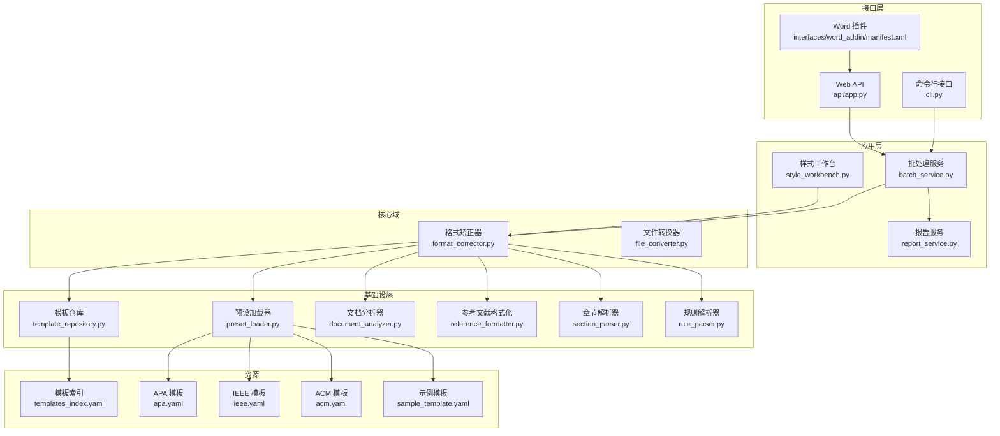
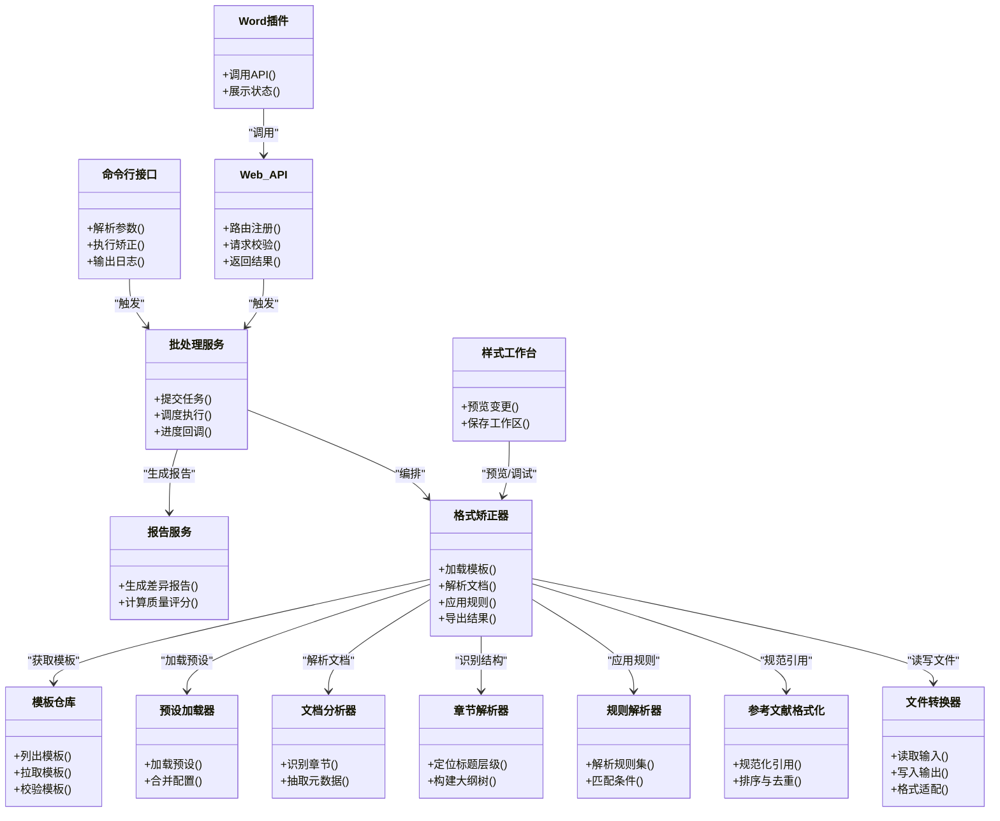
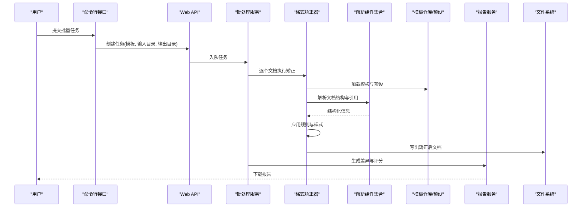
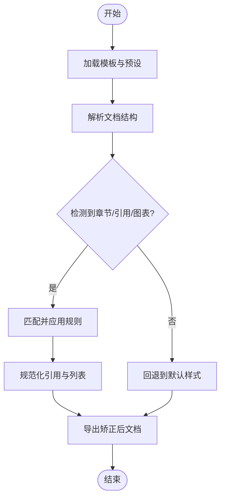
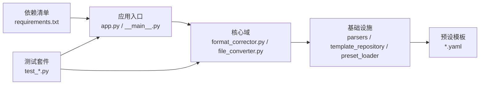

# 项目概述

<cite>
**本文引用的文件**   
- [README.md](file://README.md)
- [pyproject.toml](file://pyproject.toml)
- [requirements.txt](file://requirements.txt)
- [run.py](file://run.py)
- [src/paper_format_corrector/__main__.py](file://src/paper_format_corrector/__main__.py)
- [src/paper_format_corrector/app.py](file://src/paper_format_corrector/app.py)
- [src/paper_format_corrector/cli.py](file://src/paper_format_corrector/cli.py)
- [src/paper_format_corrector/api/app.py](file://src/paper_format_corrector/api/app.py)
- [src/paper_format_corrector/application/services/batch_service.py](file://src/paper_format_corrector/application/services/batch_service.py)
- [src/paper_format_corrector/application/services/report_service.py](file://src/paper_format_corrector/application/services/report_service.py)
- [src/paper_format_corrector/application/services/style_workbench.py](file://src/paper_format_corrector/application/services/style_workbench.py)
- [src/paper_format_corrector/core/format_corrector.py](file://src/paper_format_corrector/core/format_corrector.py)
- [src/paper_format_corrector/core/file_converter.py](file://src/paper_format_corrector/core/file_converter.py)
- [src/paper_format_corrector/infrastructure/parsers/document_analyzer.py](file://src/paper_format_corrector/infrastructure/parsers/document_analyzer.py)
- [src/paper_format_corrector/infrastructure/parsers/reference_formatter.py](file://src/paper_format_corrector/infrastructure/parsers/reference_formatter.py)
- [src/paper_format_corrector/infrastructure/parsers/section_parser.py](file://src/paper_format_corrector/infrastructure/parsers/section_parser.py)
- [src/paper_format_corrector/infrastructure/parsers/rule_parser.py](file://src/paper_format_corrector/infrastructure/parsers/rule_parser.py)
- [src/paper_format_corrector/infrastructure/template_repository.py](file://src/paper_format_corrector/infrastructure/template_repository.py)
- [src/paper_format_corrector/infrastructure/preset_loader.py](file://src/paper_format_corrector/infrastructure/preset_loader.py)
- [presets/templates_index.yaml](file://presets/templates_index.yaml)
- [presets/apa.yaml](file://presets/apa.yaml)
- [presets/ieee.yaml](file://presets/ieee.yaml)
- [presets/acm.yaml](file://presets/acm.yaml)
- [examples/sample_template.yaml](file://examples/sample_template.yaml)
- [interfaces/word_addin/manifest.xml](file://interfaces/word_addin/manifest.xml)
- [tests/test_cli_integration.py](file://tests/test_cli_integration.py)
- [tests/test_presets.py](file://tests/test_presets.py)
</cite>

## 目录
1. [简介](#简介)
2. [项目结构](#项目结构)
3. [核心组件](#核心组件)
4. [架构总览](#架构总览)
5. [详细组件分析](#详细组件分析)
6. [依赖关系分析](#依赖关系分析)
7. [性能考量](#性能考量)
8. [故障排查指南](#故障排查指南)
9. [结论](#结论)
10. [附录](#附录)

## 简介
本项目是一个面向学术论文的格式矫正与标准化平台，目标是帮助作者、编辑与机构将论文文档统一为权威学术格式标准。系统内置并持续扩展对50+种学术格式的支持（如APA、IEEE、ACM等），并提供批量处理、智能检测、模板仓库、插件生态与多端入口（CLI、API、Word插件）能力，显著降低人工排版成本，提升出版合规性与协作效率。

主要特性概览：
- 多格式支持：覆盖主流期刊与会议模板，提供集中式模板索引与在线同步能力
- 智能解析：自动识别章节结构、参考文献、图表与页眉页脚等关键元素
- 规则引擎：基于可配置规则进行样式与引用格式化，支持自定义扩展
- 批量处理：队列化任务执行，适合大批量文档的自动化流水线
- 多端接入：命令行接口、REST API、桌面GUI与Word插件
- 质量报告：生成差异报告与评分，辅助审阅与版本对比
- 可扩展性：插件机制与适配器模式，便于对接新格式与新工具链

## 项目结构
项目采用分层架构与领域驱动设计原则，按职责划分为应用层、核心域、基础设施与接口层；同时以“预设模板 + 规则解析 + 转换器”的方式实现格式标准化。

图示来源
- [src/paper_format_corrector/cli.py](file://src/paper_format_corrector/cli.py)
- [src/paper_format_corrector/api/app.py](file://src/paper_format_corrector/api/app.py)
- [interfaces/word_addin/manifest.xml](file://interfaces/word_addin/manifest.xml)
- [src/paper_format_corrector/application/services/batch_service.py](file://src/paper_format_corrector/application/services/batch_service.py)
- [src/paper_format_corrector/application/services/report_service.py](file://src/paper_format_corrector/application/services/report_service.py)
- [src/paper_format_corrector/application/services/style_workbench.py](file://src/paper_format_corrector/application/services/style_workbench.py)
- [src/paper_format_corrector/core/format_corrector.py](file://src/paper_format_corrector/core/format_corrector.py)
- [src/paper_format_corrector/core/file_converter.py](file://src/paper_format_corrector/core/file_converter.py)
- [src/paper_format_corrector/infrastructure/preset_loader.py](file://src/paper_format_corrector/infrastructure/preset_loader.py)
- [src/paper_format_corrector/infrastructure/template_repository.py](file://src/paper_format_corrector/infrastructure/template_repository.py)
- [src/paper_format_corrector/infrastructure/parsers/document_analyzer.py](file://src/paper_format_corrector/infrastructure/parsers/document_analyzer.py)
- [src/paper_format_corrector/infrastructure/parsers/reference_formatter.py](file://src/paper_format_corrector/infrastructure/parsers/reference_formatter.py)
- [src/paper_format_corrector/infrastructure/parsers/section_parser.py](file://src/paper_format_corrector/infrastructure/parsers/section_parser.py)
- [src/paper_format_corrector/infrastructure/parsers/rule_parser.py](file://src/paper_format_corrector/infrastructure/parsers/rule_parser.py)
- [presets/templates_index.yaml](file://presets/templates_index.yaml)
- [presets/apa.yaml](file://presets/apa.yaml)
- [presets/ieee.yaml](file://presets/ieee.yaml)
- [presets/acm.yaml](file://presets/acm.yaml)
- [examples/sample_template.yaml](file://examples/sample_template.yaml)

章节来源
- [README.md](file://README.md)
- [pyproject.toml](file://pyproject.toml)
- [requirements.txt](file://requirements.txt)

## 核心组件
- 命令行接口（CLI）：提供一键运行、参数化选择模板、批量扫描与输出路径控制等能力
- Web API：暴露REST接口供外部系统集成，支持上传文档、选择模板、触发矫正与下载结果
- Word 插件：在Word环境中直接调用服务，实现无感集成
- 批处理服务：负责任务编排、并发控制与进度上报
- 报告服务：生成差异报告与质量评分，辅助审阅
- 样式工作台：交互式调整样式与规则，快速验证效果
- 格式矫正器：协调解析、规则匹配与转换，完成最终文档修正
- 文件转换器：封装不同输入/输出格式的读写适配
- 模板仓库与预设加载器：管理本地与远程模板，提供模板发现与校验
- 文档分析器/章节解析器/规则解析器/参考文献格式化：支撑智能检测与标准化

章节来源
- [src/paper_format_corrector/cli.py](file://src/paper_format_corrector/cli.py)
- [src/paper_format_corrector/api/app.py](file://src/paper_format_corrector/api/app.py)
- [interfaces/word_addin/manifest.xml](file://interfaces/word_addin/manifest.xml)
- [src/paper_format_corrector/application/services/batch_service.py](file://src/paper_format_corrector/application/services/batch_service.py)
- [src/paper_format_corrector/application/services/report_service.py](file://src/paper_format_corrector/application/services/report_service.py)
- [src/paper_format_corrector/application/services/style_workbench.py](file://src/paper_format_corrector/application/services/style_workbench.py)
- [src/paper_format_corrector/core/format_corrector.py](file://src/paper_format_corrector/core/format_corrector.py)
- [src/paper_format_corrector/core/file_converter.py](file://src/paper_format_corrector/core/file_converter.py)
- [src/paper_format_corrector/infrastructure/template_repository.py](file://src/paper_format_corrector/infrastructure/template_repository.py)
- [src/paper_format_corrector/infrastructure/preset_loader.py](file://src/paper_format_corrector/infrastructure/preset_loader.py)
- [src/paper_format_corrector/infrastructure/parsers/document_analyzer.py](file://src/paper_format_corrector/infrastructure/parsers/document_analyzer.py)
- [src/paper_format_corrector/infrastructure/parsers/section_parser.py](file://src/paper_format_corrector/infrastructure/parsers/section_parser.py)
- [src/paper_format_corrector/infrastructure/parsers/rule_parser.py](file://src/paper_format_corrector/infrastructure/parsers/rule_parser.py)
- [src/paper_format_corrector/infrastructure/parsers/reference_formatter.py](file://src/paper_format_corrector/infrastructure/parsers/reference_formatter.py)

## 架构总览
系统遵循分层架构与领域驱动设计：
- 接口层：对外暴露多种交互方式（CLI、API、插件）
- 应用层：编排业务流程（批处理、报告、样式工作台）
- 核心域：定义格式矫正与转换的核心能力
- 基础设施：提供解析、模板、持久化与外部工具适配

图示来源
- [src/paper_format_corrector/cli.py](file://src/paper_format_corrector/cli.py)
- [src/paper_format_corrector/api/app.py](file://src/paper_format_corrector/api/app.py)
- [interfaces/word_addin/manifest.xml](file://interfaces/word_addin/manifest.xml)
- [src/paper_format_corrector/application/services/batch_service.py](file://src/paper_format_corrector/application/services/batch_service.py)
- [src/paper_format_corrector/application/services/report_service.py](file://src/paper_format_corrector/application/services/report_service.py)
- [src/paper_format_corrector/application/services/style_workbench.py](file://src/paper_format_corrector/application/services/style_workbench.py)
- [src/paper_format_corrector/core/format_corrector.py](file://src/paper_format_corrector/core/format_corrector.py)
- [src/paper_format_corrector/core/file_converter.py](file://src/paper_format_corrector/core/file_converter.py)
- [src/paper_format_corrector/infrastructure/template_repository.py](file://src/paper_format_corrector/infrastructure/template_repository.py)
- [src/paper_format_corrector/infrastructure/preset_loader.py](file://src/paper_format_corrector/infrastructure/preset_loader.py)
- [src/paper_format_corrector/infrastructure/parsers/document_analyzer.py](file://src/paper_format_corrector/infrastructure/parsers/document_analyzer.py)
- [src/paper_format_corrector/infrastructure/parsers/section_parser.py](file://src/paper_format_corrector/infrastructure/parsers/section_parser.py)
- [src/paper_format_corrector/infrastructure/parsers/rule_parser.py](file://src/paper_format_corrector/infrastructure/parsers/rule_parser.py)
- [src/paper_format_corrector/infrastructure/parsers/reference_formatter.py](file://src/paper_format_corrector/infrastructure/parsers/reference_formatter.py)

## 详细组件分析

### 快速开始指南
- 安装依赖：使用项目提供的依赖清单进行环境准备
- 启动入口：通过主程序或运行脚本启动服务
- 选择模板：从模板索引中选择目标格式（如APA、IEEE、ACM）
- 执行矫正：提交单文件或批量目录，指定输出路径
- 查看报告：下载差异报告与质量评分，指导后续修改

章节来源
- [requirements.txt](file://requirements.txt)
- [run.py](file://run.py)
- [src/paper_format_corrector/__main__.py](file://src/paper_format_corrector/__main__.py)
- [presets/templates_index.yaml](file://presets/templates_index.yaml)
- [tests/test_cli_integration.py](file://tests/test_cli_integration.py)

### 批量文档处理流程

图示来源
- [src/paper_format_corrector/cli.py](file://src/paper_format_corrector/cli.py)
- [src/paper_format_corrector/api/app.py](file://src/paper_format_corrector/api/app.py)
- [src/paper_format_corrector/application/services/batch_service.py](file://src/paper_format_corrector/application/services/batch_service.py)
- [src/paper_format_corrector/core/format_corrector.py](file://src/paper_format_corrector/core/format_corrector.py)
- [src/paper_format_corrector/infrastructure/template_repository.py](file://src/paper_format_corrector/infrastructure/template_repository.py)
- [src/paper_format_corrector/infrastructure/preset_loader.py](file://src/paper_format_corrector/infrastructure/preset_loader.py)
- [src/paper_format_corrector/infrastructure/parsers/document_analyzer.py](file://src/paper_format_corrector/infrastructure/parsers/document_analyzer.py)
- [src/paper_format_corrector/infrastructure/parsers/section_parser.py](file://src/paper_format_corrector/infrastructure/parsers/section_parser.py)
- [src/paper_format_corrector/infrastructure/parsers/reference_formatter.py](file://src/paper_format_corrector/infrastructure/parsers/reference_formatter.py)
- [src/paper_format_corrector/application/services/report_service.py](file://src/paper_format_corrector/application/services/report_service.py)

### 智能格式检测与规则应用

图示来源
- [src/paper_format_corrector/core/format_corrector.py](file://src/paper_format_corrector/core/format_corrector.py)
- [src/paper_format_corrector/infrastructure/parsers/document_analyzer.py](file://src/paper_format_corrector/infrastructure/parsers/document_analyzer.py)
- [src/paper_format_corrector/infrastructure/parsers/section_parser.py](file://src/paper_format_corrector/infrastructure/parsers/section_parser.py)
- [src/paper_format_corrector/infrastructure/parsers/rule_parser.py](file://src/paper_format_corrector/infrastructure/parsers/rule_parser.py)
- [src/paper_format_corrector/infrastructure/parsers/reference_formatter.py](file://src/paper_format_corrector/infrastructure/parsers/reference_formatter.py)

### 模板与预设体系
- 模板索引：集中管理所有可用模板及其元数据
- 预设模板：针对具体格式（APA、IEEE、ACM等）的样式与规则定义
- 示例模板：提供最小可运行模板，便于二次开发
- 模板仓库：支持本地与远程仓库，具备校验与同步能力

章节来源
- [presets/templates_index.yaml](file://presets/templates_index.yaml)
- [presets/apa.yaml](file://presets/apa.yaml)
- [presets/ieee.yaml](file://presets/ieee.yaml)
- [presets/acm.yaml](file://presets/acm.yaml)
- [examples/sample_template.yaml](file://examples/sample_template.yaml)
- [src/paper_format_corrector/infrastructure/template_repository.py](file://src/paper_format_corrector/infrastructure/template_repository.py)
- [src/paper_format_corrector/infrastructure/preset_loader.py](file://src/paper_format_corrector/infrastructure/preset_loader.py)
- [tests/test_presets.py](file://tests/test_presets.py)

### 与其他组件的关系与数据流向
- 接口层接收请求并委派至应用层服务
- 应用层服务协调核心域组件完成矫正与转换
- 基础设施层提供解析、模板、持久化与外部工具适配
- 数据流从输入文档经解析、规则应用到输出文档，同时生成报告与日志

章节来源
- [src/paper_format_corrector/app.py](file://src/paper_format_corrector/app.py)
- [src/paper_format_corrector/core/file_converter.py](file://src/paper_format_corrector/core/file_converter.py)
- [src/paper_format_corrector/application/services/batch_service.py](file://src/paper_format_corrector/application/services/batch_service.py)
- [src/paper_format_corrector/application/services/report_service.py](file://src/paper_format_corrector/application/services/report_service.py)

## 依赖关系分析
- 外部依赖：通过依赖清单声明运行时所需库
- 模块耦合：应用层与核心域松耦合，通过清晰接口通信
- 模板与预设：由模板仓库与预设加载器统一管理，避免硬编码
- 测试覆盖：集成测试验证CLI与预设能力，确保稳定性

图示来源
- [requirements.txt](file://requirements.txt)
- [src/paper_format_corrector/app.py](file://src/paper_format_corrector/app.py)
- [src/paper_format_corrector/__main__.py](file://src/paper_format_corrector/__main__.py)
- [src/paper_format_corrector/core/format_corrector.py](file://src/paper_format_corrector/core/format_corrector.py)
- [src/paper_format_corrector/core/file_converter.py](file://src/paper_format_corrector/core/file_converter.py)
- [src/paper_format_corrector/infrastructure/template_repository.py](file://src/paper_format_corrector/infrastructure/template_repository.py)
- [src/paper_format_corrector/infrastructure/preset_loader.py](file://src/paper_format_corrector/infrastructure/preset_loader.py)
- [tests/test_cli_integration.py](file://tests/test_cli_integration.py)
- [tests/test_presets.py](file://tests/test_presets.py)

章节来源
- [pyproject.toml](file://pyproject.toml)
- [requirements.txt](file://requirements.txt)
- [tests/test_cli_integration.py](file://tests/test_cli_integration.py)
- [tests/test_presets.py](file://tests/test_presets.py)

## 性能考量
- 批处理并发：合理设置并发度，避免I/O瓶颈与内存峰值
- 增量处理：仅对变更部分应用规则，减少重复计算
- 缓存策略：对模板与规则解析结果进行缓存，提高响应速度
- 资源限制：对大文档进行分块处理，防止OOM
- 异步任务：长耗时操作放入队列，提升用户体验

[本节为通用指导，不直接分析具体文件]

## 故障排查指南
- 模板缺失或无效：检查模板索引与预设文件完整性，确认模板ID与路径正确
- 解析失败：查看文档结构是否被正确识别，必要时调整规则或补充示例模板
- 权限问题：确认输入/输出目录访问权限，避免路径安全拦截
- 网络异常：远程模板同步失败时，检查网络与仓库地址
- 日志定位：启用详细日志，结合差异报告定位问题根因

章节来源
- [src/paper_format_corrector/infrastructure/template_repository.py](file://src/paper_format_corrector/infrastructure/template_repository.py)
- [src/paper_format_corrector/infrastructure/preset_loader.py](file://src/paper_format_corrector/infrastructure/preset_loader.py)
- [src/paper_format_corrector/infrastructure/parsers/document_analyzer.py](file://src/paper_format_corrector/infrastructure/parsers/document_analyzer.py)
- [src/paper_format_corrector/infrastructure/parsers/rule_parser.py](file://src/paper_format_corrector/infrastructure/parsers/rule_parser.py)

## 结论
本项目通过分层架构与领域驱动设计，构建了可扩展、可维护且高效的论文格式矫正平台。依托丰富的模板与规则体系、智能解析与批量处理能力，以及多端接入与插件生态，能够显著降低学术写作与出版的格式门槛，提升团队协作与交付质量。

[本节为总结性内容，不直接分析具体文件]

## 附录
- 术语说明
  - 模板：描述特定格式样式的配置文件集合
  - 预设：预置的规则与样式组合，用于快速选择目标格式
  - 规则：用于匹配文档元素并应用样式或结构的条件与动作
  - 差异报告：对比矫正前后文档变化的结构化报告
- 相关入口
  - 主程序入口：参见主程序与运行脚本
  - API文档：参考API路由与服务定义
  - 插件清单：参见Word插件清单文件

章节来源
- [src/paper_format_corrector/__main__.py](file://src/paper_format_corrector/__main__.py)
- [run.py](file://run.py)
- [src/paper_format_corrector/api/app.py](file://src/paper_format_corrector/api/app.py)
- [interfaces/word_addin/manifest.xml](file://interfaces/word_addin/manifest.xml)