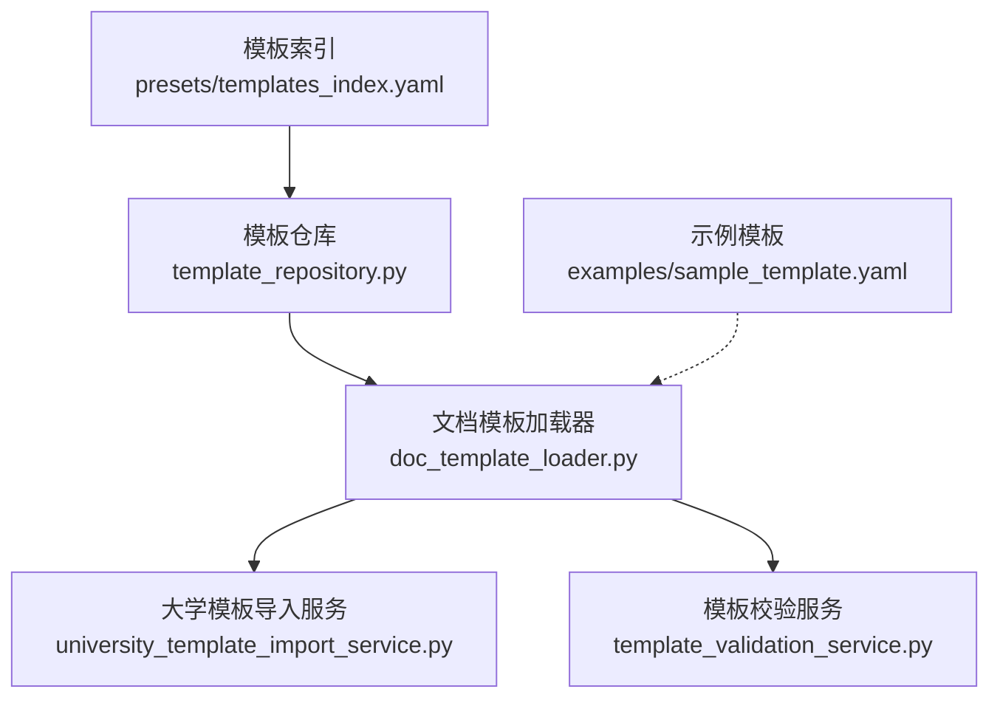
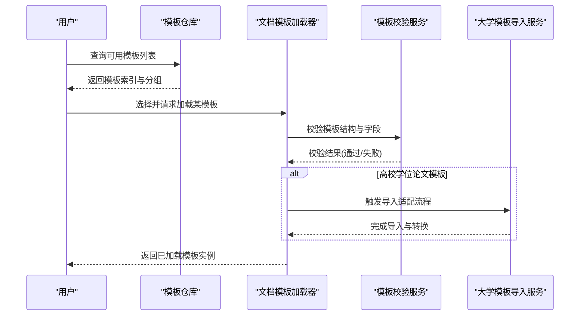
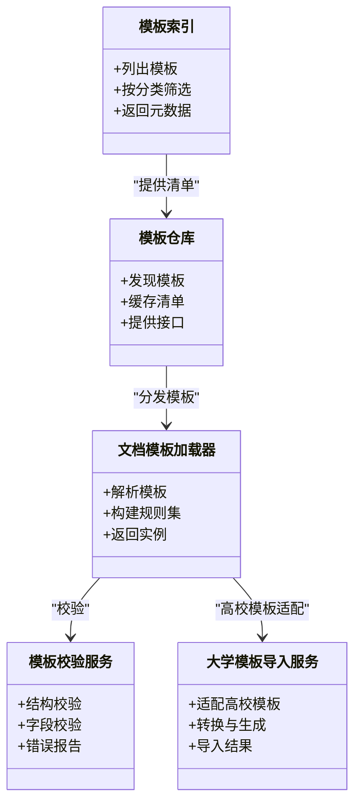

# 内置模板介绍

<cite>
**本文引用的文件**   
- [presets/templates_index.yaml](file://presets/templates_index.yaml)
- [presets/ieee.yaml](file://presets/ieee.yaml)
- [presets/apa.yaml](file://presets/apa.yaml)
- [presets/acm.yaml](file://presets/acm.yaml)
- [presets/nature.yaml](file://presets/nature.yaml)
- [presets/science.yaml](file://presets/science.yaml)
- [presets/springer.yaml](file://presets/springer.yaml)
- [presets/tsinghua.yaml](file://presets/tsinghua.yaml)
- [presets/peking.yaml](file://presets/peking.yaml)
- [presets/fudan.yaml](file://presets/fudan.yaml)
- [presets/zhejiang.yaml](file://presets/zhejiang.yaml)
- [presets/hit.yaml](file://presets/hit.yaml)
- [presets/ustc.yaml](file://presets/ustc.yaml)
- [presets/shanghaijiaotong.yaml](file://presets/shanghaijiaotong.yaml)
- [presets/xjtu.yaml](file://presets/xjtu.yaml)
- [presets/wuhan.yaml](file://presets/wuhan.yaml)
- [presets/nanjing.yaml](file://presets/nanjing.yaml)
- [presets/gb7714.yaml](file://presets/gb7714.yaml)
- [presets/chinese_thesis.yaml](file://presets/chinese_thesis.yaml)
- [src/paper_format_corrector/infra/template_repository.py](file://src/paper_format_corrector/infra/template_repository.py)
- [src/paper_format_corrector/infra/doc_template_loader.py](file://src/paper_format_corrector/infra/doc_template_loader.py)
- [src/paper_format_corrector/application/services/university_template_import_service.py](file://src/paper_format_corrector/application/services/university_template_import服务.py)
- [src/paper_format_corrector/application/services/template_validation_service.py](file://src/paper_format_corrector/application/services/template_validation_service.py)
- [examples/sample_template.yaml](file://examples/sample_template.yaml)
</cite>

## 目录
1. [简介](#简介)
2. [项目结构](#项目结构)
3. [核心组件](#核心组件)
4. [架构总览](#架构总览)
5. [详细组件分析](#详细组件分析)
6. [依赖分析](#依赖分析)
7. [性能考虑](#性能考虑)
8. [故障排查指南](#故障排查指南)
9. [结论](#结论)
10. [附录](#附录)

## 简介
本文件面向用户与开发者，系统化介绍系统内置的50+种预设格式模板。内容覆盖：
- 国际期刊与会议模板（APA、IEEE、ACM、Nature、Science、Springer等）
- 国内高校学位论文模板（清华、北大、复旦、浙大、哈工大、中科大、上交、西交、武大、南航等）
- 每种模板的适用场景、主要特点、配置项说明
- 模板分类与快速选择指南
- 版本信息与兼容性说明
- 使用示例与效果预览指引

## 项目结构
模板资源集中存放于 presets 目录，并通过索引文件进行统一注册与管理；运行时由模板仓库与服务层加载、校验与导入。

图表来源
- [presets/templates_index.yaml](file://presets/templates_index.yaml)
- [src/paper_format_corrector/infra/template_repository.py](file://src/paper_format_corrector/infra/template_repository.py)
- [src/paper_format_corrector/infra/doc_template_loader.py](file://src/paper_format_corrector/infra/doc_template_loader.py)
- [src/paper_format_corrector/application/services/university_template_import_service.py](file://src/paper_format_corrector/application/services/university_template_import服务.py)
- [src/paper_format_corrector/application/services/template_validation_service.py](file://src/paper_format_corrector/application/services/template_validation_service.py)
- [examples/sample_template.yaml](file://examples/sample_template.yaml)

章节来源
- [presets/templates_index.yaml](file://presets/templates_index.yaml)
- [src/paper_format_corrector/infra/template_repository.py](file://src/paper_format_corrector/infra/template_repository.py)
- [src/paper_format_corrector/infra/doc_template_loader.py](file://src/paper_format_corrector/infra/doc_template_loader.py)
- [src/paper_format_corrector/application/services/university_template_import_service.py](file://src/paper_format_corrector/application/services/university_template_import服务.py)
- [src/paper_format_corrector/application/services/template_validation_service.py](file://src/paper_format_corrector/application/services/template_validation_service.py)
- [examples/sample_template.yaml](file://examples/sample_template.yaml)

## 核心组件
- 模板索引：集中登记所有可用模板元数据与分组信息，便于检索与展示。
- 模板仓库：负责从本地或远程位置发现、缓存与提供模板清单。
- 文档模板加载器：解析并加载具体模板定义，构建可执行的格式化规则集。
- 大学模板导入服务：针对高校学位论文模板的专用导入流程与适配。
- 模板校验服务：对模板结构与必填字段进行一致性检查，保障稳定性。

章节来源
- [presets/templates_index.yaml](file://presets/templates_index.yaml)
- [src/paper_format_corrector/infra/template_repository.py](file://src/paper_format_corrector/infra/template_repository.py)
- [src/paper_format_corrector/infra/doc_template_loader.py](file://src/paper_format_corrector/infra/doc_template_loader.py)
- [src/paper_format_corrector/application/services/university_template_import_service.py](file://src/paper_format_corrector/application/services/university_template_import服务.py)
- [src/paper_format_corrector/application/services/template_validation_service.py](file://src/paper_format_corrector/application/services/template_validation_service.py)

## 架构总览
下图展示了“模板选择—加载—校验—应用”的整体流程，以及各模块之间的调用关系。

图表来源
- [src/paper_format_corrector/infra/template_repository.py](file://src/paper_format_corrector/infra/template_repository.py)
- [src/paper_format_corrector/infra/doc_template_loader.py](file://src/paper_format_corrector/infra/doc_template_loader.py)
- [src/paper_format_corrector/application/services/template_validation_service.py](file://src/paper_format_corrector/application/services/template_validation_service.py)
- [src/paper_format_corrector/application/services/university_template_import_service.py](file://src/paper_format_corrector/application/services/university_template_import服务.py)

## 详细组件分析

### 模板索引与分类
- 作用：集中维护模板名称、标识、分类、适用领域、版本与兼容性等信息，支撑前端展示与后端检索。
- 分类建议：
  - 国际期刊/会议：APA、IEEE、ACM、Nature、Science、Springer、Elsevier、Wiley、Harvard、MLA、AMA、Chicago、AAAI、ACL、CVPR、EMNLP、ICLR、ICML、KDD、NeurIPS、SIGIR、WWW 等
  - 国家标准与通用：GB/T 7714、中文通用论文模板
  - 国内高校学位论文：清华、北大、复旦、浙大、哈工大、中科大、上交、西交、武大、南航等
- 使用方式：通过索引获取模板ID后，再交由加载器解析具体模板定义。

章节来源
- [presets/templates_index.yaml](file://presets/templates_index.yaml)

### 国际期刊与会议模板

#### IEEE 模板
- 适用场景：工程与计算机科学领域的期刊与会议投稿
- 主要特点：双栏排版、参考文献样式、图表编号规范
- 关键配置项：作者信息、摘要、关键词、章节标题层级、图表编号、参考文献格式、页眉页脚
- 兼容性与版本：遵循 IEEE 最新投稿指南；若期刊有特定变体，可通过覆盖配置调整

章节来源
- [presets/ieee.yaml](file://presets/ieee.yaml)

#### APA 模板
- 适用场景：社会科学、心理学、教育学等领域
- 主要特点：作者-年份引用、段落缩进、标题层级、表格与图注格式
- 关键配置项：引用风格、标题层级、行距、页边距、图表标题位置
- 兼容性与版本：支持 APA 第7版常见要求；特殊机构要求可通过覆盖配置

章节来源
- [presets/apa.yaml](file://presets/apa.yaml)

#### ACM 模板
- 适用场景：计算机科学与信息技术领域会议与期刊
- 主要特点：双栏/单栏可选、ACM 引用格式、版权页、代码块样式
- 关键配置项：会议/期刊类型、引用格式、代码高亮、图表编号
- 兼容性与版本：随 ACM 模板更新而演进，支持多会议变体

章节来源
- [presets/acm.yaml](file://presets/acm.yaml)

#### Nature 模板
- 适用场景：综合性自然科学期刊投稿
- 主要特点：简洁正文、图表紧凑、参考文献顺序编码
- 关键配置项：图表编号、参考文献格式、单位与符号规范
- 兼容性与版本：遵循 Nature 系列期刊最新要求

章节来源
- [presets/nature.yaml](file://presets/nature.yaml)

#### Science 模板
- 适用场景：综合性科学期刊投稿
- 主要特点：严格图表与数据呈现规范、参考文献顺序编码
- 关键配置项：图表编号、单位与符号、参考文献格式
- 兼容性与版本：随 Science 期刊要求更新

章节来源
- [presets/science.yaml](file://presets/science.yaml)

#### Springer 模板
- 适用场景：Springer 系列期刊与会议
- 主要特点：多种文章类型（Article、Review、Letter）、参考文献样式
- 关键配置项：文章类型、引用格式、图表编号、页眉页脚
- 兼容性与版本：支持不同子刊差异化的格式要求

章节来源
- [presets/springer.yaml](file://presets/springer.yaml)

### 国家标准与通用模板

#### GB/T 7714 模板
- 适用场景：国内学术文献引用标准
- 主要特点：顺序编码或著者-出版年两种引用体系、参考文献条目规范化
- 关键配置项：引用体系、标点与空格、作者姓名缩写、期刊卷期号格式
- 兼容性与版本：依据 GB/T 7714 最新版本

章节来源
- [presets/gb7714.yaml](file://presets/gb7714.yaml)

#### 中文通用论文模板
- 适用场景：中文学术论文通用需求
- 主要特点：中文字体与字号、段落与行距、中英文混排
- 关键配置项：字体族、字号、行距、页边距、标题层级
- 兼容性与版本：适配主流中文排版环境

章节来源
- [presets/chinese_thesis.yaml](file://presets/chinese_thesis.yaml)

### 国内高校学位论文模板

#### 清华大学模板
- 适用场景：清华大学本科/硕士/博士毕业论文
- 主要特点：封面、声明、摘要（中英文）、目录、正文、参考文献、致谢、附录
- 关键配置项：学位级别、学科门类、导师信息、图表编号、页码格式
- 兼容性与版本：遵循研究生院最新格式规范

章节来源
- [presets/tsinghua.yaml](file://presets/tsinghua.yaml)

#### 北京大学模板
- 适用场景：北京大学学位论文
- 主要特点：封面与声明、中英文摘要、章节结构、参考文献
- 关键配置项：学位层次、学院与专业、导师与日期、图表编号
- 兼容性与版本：按学校最新规定执行

章节来源
- [presets/peking.yaml](file://presets/peking.yaml)

#### 复旦大学模板
- 适用场景：复旦大学学位论文
- 主要特点：封面、声明、摘要、目录、正文、参考文献、附录
- 关键配置项：学位类型、学科分类、导师信息、图表编号
- 兼容性与版本：随研究生院通知更新

章节来源
- [presets/fudan.yaml](file://presets/fudan.yaml)

#### 浙江大学模板
- 适用场景：浙江大学学位论文
- 主要特点：封面、声明、中英文摘要、目录、正文、参考文献
- 关键配置项：学位级别、学院与专业、导师与日期、图表编号
- 兼容性与版本：遵循学校最新格式要求

章节来源
- [presets/zhejiang.yaml](file://presets/zhejiang.yaml)

#### 哈尔滨工业大学模板
- 适用场景：哈尔滨工业大学学位论文
- 主要特点：封面、声明、摘要、目录、正文、参考文献、附录
- 关键配置项：学位层次、学科门类、导师信息、图表编号
- 兼容性与版本：按研究生院规范执行

章节来源
- [presets/hit.yaml](file://presets/hit.yaml)

#### 中国科学技术大学模板
- 适用场景：中国科学技术大学学位论文
- 主要特点：封面、声明、摘要、目录、正文、参考文献
- 关键配置项：学位类型、学院与专业、导师与日期、图表编号
- 兼容性与版本：遵循学校最新规定

章节来源
- [presets/ustc.yaml](file://presets/ustc.yaml)

#### 上海交通大学模板
- 适用场景：上海交通大学学位论文
- 主要特点：封面、声明、摘要、目录、正文、参考文献、附录
- 关键配置项：学位层次、学科分类、导师信息、图表编号
- 兼容性与版本：按研究生院要求更新

章节来源
- [presets/shanghaijiaotong.yaml](file://presets/shanghaijiaotong.yaml)

#### 西安交通大学模板
- 适用场景：西安交通大学学位论文
- 主要特点：封面、声明、摘要、目录、正文、参考文献
- 关键配置项：学位类型、学院与专业、导师与日期、图表编号
- 兼容性与版本：遵循学校最新格式规范

章节来源
- [presets/xjtu.yaml](file://presets/xjtu.yaml)

#### 武汉大学模板
- 适用场景：武汉大学学位论文
- 主要特点：封面、声明、摘要、目录、正文、参考文献、附录
- 关键配置项：学位层次、学科门类、导师信息、图表编号
- 兼容性与版本：按研究生院通知执行

章节来源
- [presets/wuhan.yaml](file://presets/wuhan.yaml)

#### 南京大学模板
- 适用场景：南京大学学位论文
- 主要特点：封面、声明、摘要、目录、正文、参考文献
- 关键配置项：学位类型、学院与专业、导师与日期、图表编号
- 兼容性与版本：遵循学校最新规定

章节来源
- [presets/nanjing.yaml](file://presets/nanjing.yaml)

### 模板分类与快速选择指南
- 按用途选择：
  - 国际期刊/会议：优先选择对应出版社或会议的官方模板（如 IEEE、ACM、Nature、Science、Springer）
  - 国内学位论文：选择目标高校的专属模板（如清华、北大、复旦、浙大等）
  - 通用写作：使用 GB/T 7714 或中文通用论文模板
- 按引用风格选择：
  - 顺序编码：Nature、Science、Springer、GB/T 7714（顺序编码）
  - 作者-年份：APA、Harvard、MLA、AMA
  - 会议/期刊定制：IEEE、ACM
- 按语言与排版选择：
  - 中英混排：中文通用论文模板、部分高校模板
  - 纯英文：IEEE、ACM、APA、Nature、Science、Springer

[本节为概念性指导，不直接分析具体文件]

## 依赖分析
- 模板索引与仓库：索引文件提供模板清单，仓库负责发现与缓存，降低重复IO开销。
- 加载器与校验：加载器解析模板定义，校验服务确保结构完整与字段合法。
- 导入服务：针对高校模板的复杂结构进行适配与转换，提升可用性。

图表来源
- [presets/templates_index.yaml](file://presets/templates_index.yaml)
- [src/paper_format_corrector/infra/template_repository.py](file://src/paper_format_corrector/infra/template_repository.py)
- [src/paper_format_corrector/infra/doc_template_loader.py](file://src/paper_format_corrector/infra/doc_template_loader.py)
- [src/paper_format_corrector/application/services/template_validation_service.py](file://src/paper_format_corrector/application/services/template_validation_service.py)
- [src/paper_format_corrector/application/services/university_template_import_service.py](file://src/paper_format_corrector/application/services/university_template_import服务.py)

章节来源
- [presets/templates_index.yaml](file://presets/templates_index.yaml)
- [src/paper_format_corrector/infra/template_repository.py](file://src/paper_format_corrector/infra/template_repository.py)
- [src/paper_format_corrector/infra/doc_template_loader.py](file://src/paper_format_corrector/infra/doc_template_loader.py)
- [src/paper_format_corrector/application/services/template_validation_service.py](file://src/paper_format_corrector/application/services/template_validation_service.py)
- [src/paper_format_corrector/application/services/university_template_import_service.py](file://src/paper_format_corrector/application/services/university_template_import服务.py)

## 性能考虑
- 模板清单缓存：避免频繁读取索引与模板文件，提高响应速度。
- 按需加载：仅加载当前使用的模板，减少内存占用。
- 增量校验：在校验阶段尽早失败，避免后续处理浪费资源。
- 批量处理：在批量格式化时复用已加载的模板实例，降低重复解析成本。

[本节提供一般性建议，不直接分析具体文件]

## 故障排查指南
- 模板未找到：确认模板ID是否在索引中，路径是否正确。
- 校验失败：检查模板必填字段是否齐全、类型是否符合预期。
- 高校模板导入异常：查看导入服务的日志输出，确认适配逻辑是否匹配目标学校版本。
- 版本不兼容：核对模板版本与目标期刊/学校要求的对应关系，必要时升级或切换模板。

章节来源
- [src/paper_format_corrector/application/services/template_validation_service.py](file://src/paper_format_corrector/application/services/template_validation_service.py)
- [src/paper_format_corrector/application/services/university_template_import_service.py](file://src/paper_format_corrector/application/services/university_template_import服务.py)

## 结论
内置模板覆盖了国际主流期刊与会议以及国内重点高校的学位论文需求，配合统一的索引、仓库、加载与校验机制，能够快速定位并应用合适的模板。通过分类指南与配置项说明，用户可以高效完成格式设置与提交准备。

[本节为总结性内容，不直接分析具体文件]

## 附录

### 使用示例与效果预览指引
- 选择模板：从模板索引中根据分类与用途挑选目标模板ID。
- 加载模板：通过文档模板加载器加载所选模板，并进行校验。
- 应用模板：将模板应用于文档，生成符合规范的排版与引用格式。
- 效果预览：在界面或导出报告中查看最终效果，必要时微调配置项。

章节来源
- [examples/sample_template.yaml](file://examples/sample_template.yaml)
- [src/paper_format_corrector/infra/doc_template_loader.py](file://src/paper_format_corrector/infra/doc_template_loader.py)
- [src/paper_format_corrector/application/services/template_validation_service.py](file://src/paper_format_corrector/application/services/template_validation_service.py)