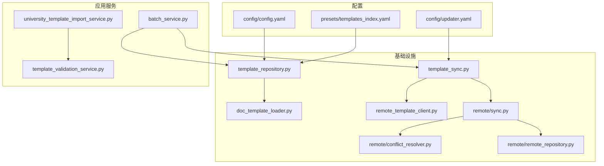
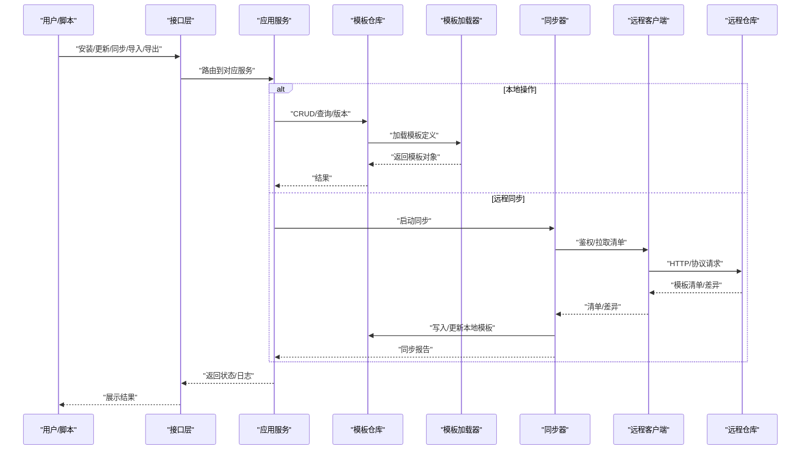
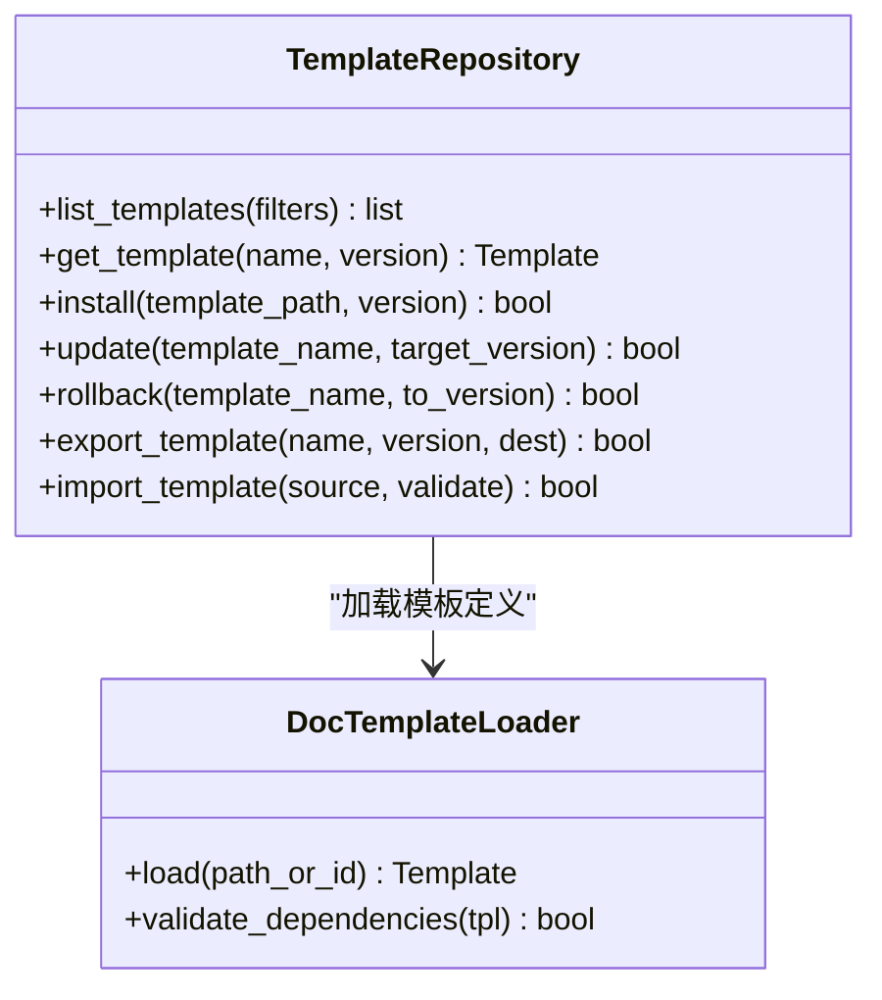
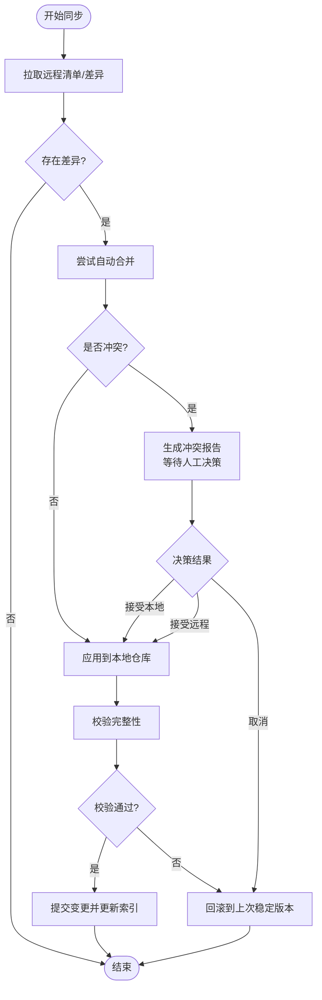
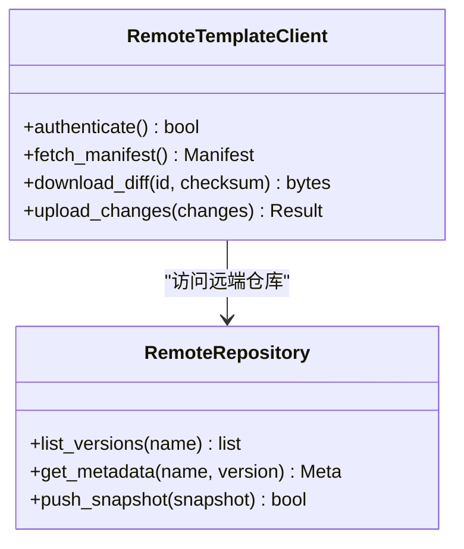
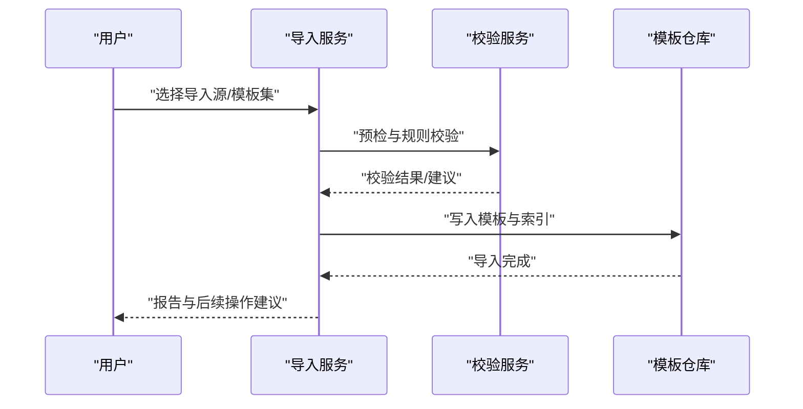
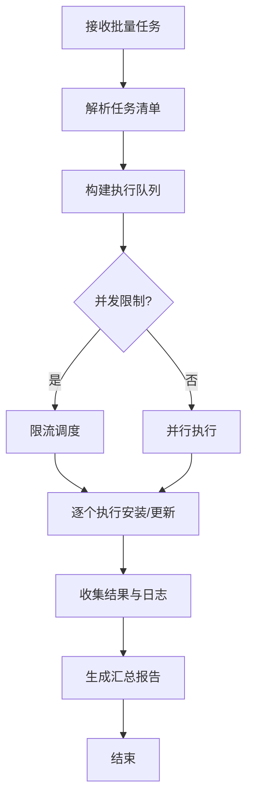
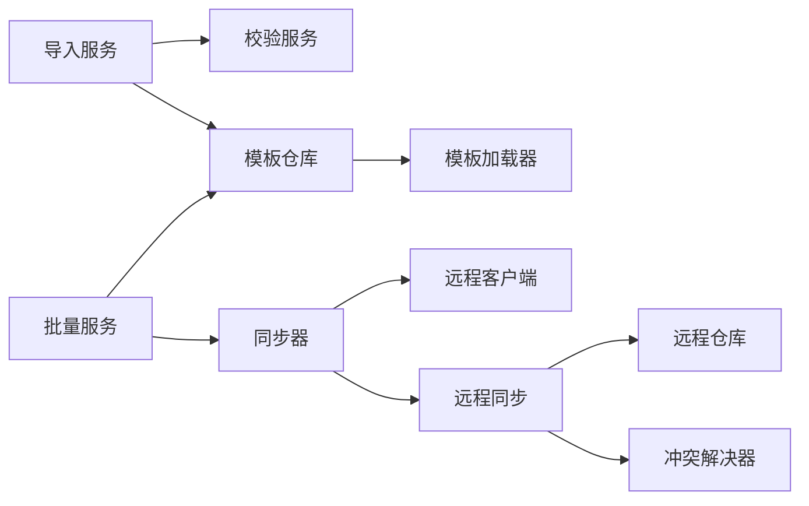

# 模板管理工具

<cite>
**本文引用的文件**   
- [README.md](file://README.md)
- [config/config.yaml](file://config/config.yaml)
- [config/updater.yaml](file://config/updater.yaml)
- [presets/templates_index.yaml](file://presets/templates_index.yaml)
- [src/paper_format_corrector/infra/template_repository.py](file://src/paper_format_corrector/infra/template_repository.py)
- [src/paper_format_corrector/infra/template_sync.py](file://src/paper_format_corrector/infra/template_sync.py)
- [src/paper_format_corrector/infra/doc_template_loader.py](file://src/paper_format_corrector/infra/doc_template_loader.py)
- [src/paper_format_corrector/infra/remote_template_client.py](file://src/paper_format_corrector/infra/remote_template_client.py)
- [src/paper_format_corrector/application/services/university_template_import_service.py](file://src/paper_format_corrector/application/services/university_template_import_service.py)
- [src/paper_format_corrector/application/services/template_validation_service.py](file://src/paper_format_corrector/application/services/template_validation_service.py)
- [src/paper_format_corrector/application/services/batch_service.py](file://src/paper_format_corrector/application/services/batch_service.py)
- [src/paper_format_corrector/infra/remote/conflict_resolver.py](file://src/paper_format_corrector/infra/remote/conflict_resolver.py)
- [src/paper_format_corrector/infra/remote/sync.py](file://src/paper_format_corrector/infra/remote/sync.py)
- [src/paper_format_corrector/infra/remote/remote_repository.py](file://src/paper_format_corrector/infra/remote/remote_repository.py)
- [tests/test_template_repository.py](file://tests/test_template_repository.py)
- [tests/test_template_sync.py](file://tests/test_template_sync.py)
- [tests/test_template_validation_and_import.py](file://tests/test_template_validation_and_import.py)
</cite>

## 目录
1. [简介](#简介)
2. [项目结构](#项目结构)
3. [核心组件](#核心组件)
4. [架构总览](#架构总览)
5. [详细组件分析](#详细组件分析)
6. [依赖关系分析](#依赖关系分析)
7. [性能考虑](#性能考虑)
8. [故障排查指南](#故障排查指南)
9. [结论](#结论)
10. [附录](#附录)

## 简介
本指南面向需要集中管理论文模板的用户与运维人员，围绕“模板仓库”的完整生命周期展开，覆盖以下能力：
- 模板安装、更新、备份与恢复
- 本地模板库与远程模板仓库的同步机制
- 模板导入导出工具使用方法
- 模板版本管理与冲突解决策略
- 批量操作与自动化脚本示例
- 最佳实践与性能优化建议

目标读者包括：使用模板进行文档生成的作者、团队模板管理员、以及负责部署与维护模板仓库的工程师。

## 项目结构
与模板管理相关的代码主要分布在基础设施层与应用服务层：
- 基础设施层
  - 模板仓库与加载：template_repository.py、doc_template_loader.py
  - 同步与远程客户端：template_sync.py、remote_template_client.py
  - 远程协作与冲突处理：remote/sync.py、remote/conflict_resolver.py、remote/remote_repository.py
- 应用服务层
  - 大学模板导入：university_template_import_service.py
  - 模板校验：template_validation_service.py
  - 批量任务编排：batch_service.py
- 配置与索引
  - 全局配置：config/config.yaml、config/updater.yaml
  - 模板索引：presets/templates_index.yaml
- 测试
  - 模板仓库与同步、导入校验等用例：tests/test_template_repository.py、tests/test_template_sync.py、tests/test_template_validation_and_import.py

图表来源
- [config/config.yaml](file://config/config.yaml)
- [config/updater.yaml](file://config/updater.yaml)
- [presets/templates_index.yaml](file://presets/templates_index.yaml)
- [src/paper_format_corrector/infra/template_repository.py](file://src/paper_format_corrector/infra/template_repository.py)
- [src/paper_format_corrector/infra/doc_template_loader.py](file://src/paper_format_corrector/infra/doc_template_loader.py)
- [src/paper_format_corrector/infra/template_sync.py](file://src/paper_format_corrector/infra/template_sync.py)
- [src/paper_format_corrector/infra/remote_template_client.py](file://src/paper_format_corrector/infra/remote_template_client.py)
- [src/paper_format_corrector/infra/remote/sync.py](file://src/paper_format_corrector/infra/remote/sync.py)
- [src/paper_format_corrector/infra/remote/conflict_resolver.py](file://src/paper_format_corrector/infra/remote/conflict_resolver.py)
- [src/paper_format_corrector/infra/remote/remote_repository.py](file://src/paper_format_corrector/infra/remote/remote_repository.py)

章节来源
- [README.md](file://README.md)
- [config/config.yaml](file://config/config.yaml)
- [config/updater.yaml](file://config/updater.yaml)
- [presets/templates_index.yaml](file://presets/templates_index.yaml)

## 核心组件
- 模板仓库（Template Repository）
  - 职责：提供模板的增删改查、版本信息维护、元数据解析与持久化。
  - 关键能力：列出模板、获取模板详情、按条件过滤、记录变更历史。
- 模板加载器（Doc Template Loader）
  - 职责：从文件系统或包内资源加载模板定义与样式，完成路径解析与依赖检查。
- 同步器（Template Sync）
  - 职责：协调本地与远程模板仓库的增量同步，支持拉取、推送、差异计算与回滚。
- 远程客户端（Remote Template Client）
  - 职责：封装远端仓库的认证、请求、分页与重试逻辑。
- 远程同步与冲突解决（Remote Sync & Conflict Resolver）
  - 职责：实现双向同步流程、合并策略、冲突检测与人工介入点。
- 大学模板导入服务（University Template Import Service）
  - 职责：将外部大学模板规范转换为内部模板格式，并执行一致性校验。
- 模板校验服务（Template Validation Service）
  - 职责：对模板结构与字段进行规则校验，输出错误与建议。
- 批量服务（Batch Service）
  - 职责：编排批量安装、批量更新、批量导出等任务，支持队列与进度上报。

章节来源
- [src/paper_format_corrector/infra/template_repository.py](file://src/paper_format_corrector/infra/template_repository.py)
- [src/paper_format_corrector/infra/doc_template_loader.py](file://src/paper_format_corrector/infra/doc_template_loader.py)
- [src/paper_format_corrector/infra/template_sync.py](file://src/paper_format_corrector/infra/template_sync.py)
- [src/paper_format_corrector/infra/remote_template_client.py](file://src/paper_format_corrector/infra/remote_template_client.py)
- [src/paper_format_corrector/infra/remote/sync.py](file://src/paper_format_corrector/infra/remote/sync.py)
- [src/paper_format_corrector/infra/remote/conflict_resolver.py](file://src/paper_format_corrector/infra/remote/conflict_resolver.py)
- [src/paper_format_corrector/infra/remote/remote_repository.py](file://src/paper_format_corrector/infra/remote/remote_repository.py)
- [src/paper_format_corrector/application/services/university_template_import_service.py](file://src/paper_format_corrector/application/services/university_template_import_service.py)
- [src/paper_format_corrector/application/services/template_validation_service.py](file://src/paper_format_corrector/application/services/template_validation_service.py)
- [src/paper_format_corrector/application/services/batch_service.py](file://src/paper_format_corrector/application/services/batch_service.py)

## 架构总览
下图展示了模板管理的端到端流程：用户通过 CLI/GUI/API 发起操作，应用服务层调用基础设施层的仓库、加载器与同步模块；远程侧通过客户端访问远端仓库，并在必要时触发冲突解决流程。

图表来源
- [src/paper_format_corrector/infra/template_repository.py](file://src/paper_format_corrector/infra/template_repository.py)
- [src/paper_format_corrector/infra/doc_template_loader.py](file://src/paper_format_corrector/infra/doc_template_loader.py)
- [src/paper_format_corrector/infra/template_sync.py](file://src/paper_format_corrector/infra/template_sync.py)
- [src/paper_format_corrector/infra/remote_template_client.py](file://src/paper_format_corrector/infra/remote_template_client.py)
- [src/paper_format_corrector/infra/remote/remote_repository.py](file://src/paper_format_corrector/infra/remote/remote_repository.py)

## 详细组件分析

### 模板仓库（Template Repository）
- 功能要点
  - 模板注册与索引：维护模板清单、版本、标签、依赖关系。
  - 安装与卸载：将模板文件复制到工作区，更新索引与元数据。
  - 更新与回滚：基于版本标记进行增量更新，保留历史快照以便回滚。
  - 查询与过滤：按名称、标签、版本范围检索模板。
- 数据结构与复杂度
  - 索引通常以键值映射存储，查找时间近似 O(1)，列表遍历为 O(n)。
  - 版本比较与排序采用语义化版本策略，时间复杂度与版本数量线性相关。
- 错误处理
  - 文件权限不足、磁盘空间不足、模板损坏或缺失依赖时抛出明确异常并记录日志。
- 性能优化
  - 索引缓存、懒加载、增量扫描减少 IO 开销。
  - 并发读取模板元数据，避免串行阻塞。

图表来源
- [src/paper_format_corrector/infra/template_repository.py](file://src/paper_format_corrector/infra/template_repository.py)
- [src/paper_format_corrector/infra/doc_template_loader.py](file://src/paper_format_corrector/infra/doc_template_loader.py)

章节来源
- [src/paper_format_corrector/infra/template_repository.py](file://src/paper_format_corrector/infra/template_repository.py)
- [src/paper_format_corrector/infra/doc_template_loader.py](file://src/paper_format_corrector/infra/doc_template_loader.py)
- [tests/test_template_repository.py](file://tests/test_template_repository.py)

### 模板同步（Local ↔ Remote）
- 同步流程
  - 拉取模式：对比本地与远程清单，下载新增/更新项，删除废弃项（可选）。
  - 推送模式：将本地变更上传至远端，生成变更摘要。
  - 增量同步：仅传输差异部分，降低带宽与时间成本。
- 冲突解决策略
  - 自动合并：当变更不冲突且满足兼容性约束时自动合并。
  - 人工介入：冲突时暂停并生成冲突报告，等待决策后继续。
  - 回退策略：在合并失败时回滚到上一稳定版本。
- 可靠性保障
  - 断点续传、幂等写入、事务性提交与校验和验证。

图表来源
- [src/paper_format_corrector/infra/template_sync.py](file://src/paper_format_corrector/infra/template_sync.py)
- [src/paper_format_corrector/infra/remote/sync.py](file://src/paper_format_corrector/infra/remote/sync.py)
- [src/paper_format_corrector/infra/remote/conflict_resolver.py](file://src/paper_format_corrector/infra/remote/conflict_resolver.py)

章节来源
- [src/paper_format_corrector/infra/template_sync.py](file://src/paper_format_corrector/infra/template_sync.py)
- [src/paper_format_corrector/infra/remote/sync.py](file://src/paper_format_corrector/infra/remote/sync.py)
- [src/paper_format_corrector/infra/remote/conflict_resolver.py](file://src/paper_format_corrector/infra/remote/conflict_resolver.py)
- [tests/test_template_sync.py](file://tests/test_template_sync.py)

### 远程模板客户端与仓库
- 远程客户端
  - 负责鉴权、重试、超时控制、分页与压缩传输。
  - 提供统一的接口抽象，屏蔽底层协议细节。
- 远程仓库
  - 提供模板清单、版本元数据、差异包与校验和。
  - 支持只读访问与受控写入（需权限）。

图表来源
- [src/paper_format_corrector/infra/remote_template_client.py](file://src/paper_format_corrector/infra/remote_template_client.py)
- [src/paper_format_corrector/infra/remote/remote_repository.py](file://src/paper_format_corrector/infra/remote/remote_repository.py)

章节来源
- [src/paper_format_corrector/infra/remote_template_client.py](file://src/paper_format_corrector/infra/remote_template_client.py)
- [src/paper_format_corrector/infra/remote/remote_repository.py](file://src/paper_format_corrector/infra/remote/remote_repository.py)

### 模板导入与导出
- 导入
  - 支持从外部大学模板规范批量导入，自动转换并执行一致性校验。
  - 导入前可预检依赖与命名冲突，失败时给出修复建议。
- 导出
  - 将指定模板及其依赖打包为归档，便于离线分发与审计。
  - 导出包含元数据、版本信息与校验和，确保可追溯。

图表来源
- [src/paper_format_corrector/application/services/university_template_import_service.py](file://src/paper_format_corrector/application/services/university_template_import_service.py)
- [src/paper_format_corrector/application/services/template_validation_service.py](file://src/paper_format_corrector/application/services/template_validation_service.py)
- [src/paper_format_corrector/infra/template_repository.py](file://src/paper_format_corrector/infra/template_repository.py)

章节来源
- [src/paper_format_corrector/application/services/university_template_import_service.py](file://src/paper_format_corrector/application/services/university_template_import_service.py)
- [src/paper_format_corrector/application/services/template_validation_service.py](file://src/paper_format_corrector/application/services/template_validation_service.py)
- [tests/test_template_validation_and_import.py](file://tests/test_template_validation_and_import.py)

### 批量操作与自动化
- 批量安装/更新
  - 通过批量服务编排任务队列，支持并发与限速。
  - 支持按标签/版本范围筛选模板，统一进度与错误汇总。
- 自动化脚本
  - 结合配置文件与索引，编写定时任务拉取最新模板并发布到生产环境。
  - 建议在 CI/CD 中集成模板校验与回归测试，确保质量门禁。

图表来源
- [src/paper_format_corrector/application/services/batch_service.py](file://src/paper_format_corrector/application/services/batch_service.py)
- [src/paper_format_corrector/infra/template_repository.py](file://src/paper_format_corrector/infra/template_repository.py)

章节来源
- [src/paper_format_corrector/application/services/batch_service.py](file://src/paper_format_corrector/application/services/batch_service.py)

## 依赖关系分析
- 组件耦合
  - 模板仓库与加载器强耦合（加载器用于解析模板定义）。
  - 同步器依赖远程客户端与远程仓库，同时与冲突解决器协作。
  - 导入服务依赖校验服务与模板仓库。
- 外部依赖
  - 网络访问（远程仓库）、文件系统（本地模板存储）、序列化与校验算法。
- 潜在循环依赖
  - 当前设计通过分层与接口抽象避免循环依赖；若扩展时需保持单向依赖。

图表来源
- [src/paper_format_corrector/infra/template_repository.py](file://src/paper_format_corrector/infra/template_repository.py)
- [src/paper_format_corrector/infra/doc_template_loader.py](file://src/paper_format_corrector/infra/doc_template_loader.py)
- [src/paper_format_corrector/infra/template_sync.py](file://src/paper_format_corrector/infra/template_sync.py)
- [src/paper_format_corrector/infra/remote_template_client.py](file://src/paper_format_corrector/infra/remote_template_client.py)
- [src/paper_format_corrector/infra/remote/sync.py](file://src/paper_format_corrector/infra/remote/sync.py)
- [src/paper_format_corrector/infra/remote/conflict_resolver.py](file://src/paper_format_corrector/infra/remote/conflict_resolver.py)
- [src/paper_format_corrector/infra/remote/remote_repository.py](file://src/paper_format_corrector/infra/remote/remote_repository.py)
- [src/paper_format_corrector/application/services/university_template_import_service.py](file://src/paper_format_corrector/application/services/university_template_import_service.py)
- [src/paper_format_corrector/application/services/template_validation_service.py](file://src/paper_format_corrector/application/services/template_validation_service.py)
- [src/paper_format_corrector/application/services/batch_service.py](file://src/paper_format_corrector/application/services/batch_service.py)

## 性能考虑
- 索引与缓存
  - 对模板索引建立内存缓存，减少重复 IO。
  - 按需加载大体积模板内容，避免一次性载入。
- 并发与限流
  - 批量操作采用任务队列与并发上限控制，防止资源争用。
  - 网络请求设置超时与重试，避免长尾影响整体吞吐。
- 增量与压缩
  - 优先使用差异包与压缩传输，降低带宽占用。
  - 本地变更采用增量扫描与哈希比对，提升同步效率。
- 存储与清理
  - 定期清理过期版本与临时文件，释放磁盘空间。
  - 使用原子写入与校验和，保证一致性与快速恢复。

## 故障排查指南
- 常见问题
  - 权限问题：确认运行用户对模板目录具有读写权限。
  - 网络问题：检查代理、防火墙与证书配置，确保能访问远程仓库。
  - 版本冲突：查看冲突报告，依据策略选择接受本地或远程版本。
  - 导入失败：根据校验服务输出的错误定位缺失字段或依赖。
- 诊断步骤
  - 启用详细日志，定位具体失败阶段（拉取、合并、写入、校验）。
  - 使用导出功能生成模板快照，对比前后差异。
  - 回滚到上一个稳定版本，验证系统可用性。
- 恢复策略
  - 使用备份快照恢复模板仓库与索引。
  - 重新执行同步，确保与远程仓库一致。

章节来源
- [src/paper_format_corrector/infra/template_sync.py](file://src/paper_format_corrector/infra/template_sync.py)
- [src/paper_format_corrector/infra/remote/conflict_resolver.py](file://src/paper_format_corrector/infra/remote/conflict_resolver.py)
- [src/paper_format_corrector/application/services/template_validation_service.py](file://src/paper_format_corrector/application/services/template_validation_service.py)

## 结论
本模板管理工具提供了完整的模板生命周期管理能力，涵盖安装、更新、备份恢复、同步、导入导出、版本管理与冲突解决，并通过批量服务与自动化脚本提升效率。遵循最佳实践与性能优化建议，可在团队协作与规模化部署中保持稳定与高效。

## 附录
- 配置参考
  - 全局配置与更新策略位于配置文件，建议在生产环境集中管理。
  - 模板索引文件用于描述可用模板集合与元数据，便于检索与筛选。
- 使用建议
  - 在发布新版本前进行全量校验与回归测试。
  - 为重要模板开启版本锁定与灰度发布策略。
  - 定期备份模板仓库与索引，并演练恢复流程。

章节来源
- [config/config.yaml](file://config/config.yaml)
- [config/updater.yaml](file://config/updater.yaml)
- [presets/templates_index.yaml](file://presets/templates_index.yaml)