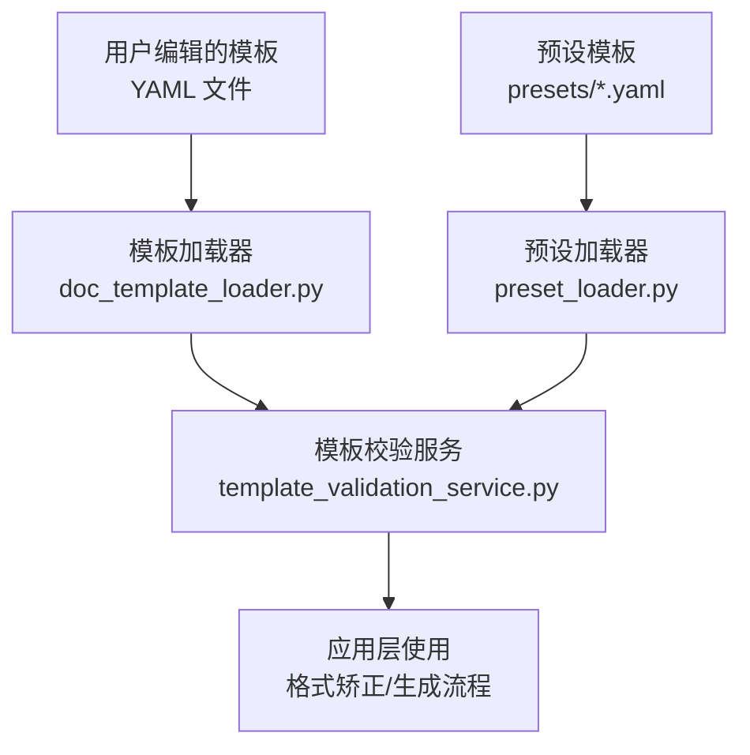
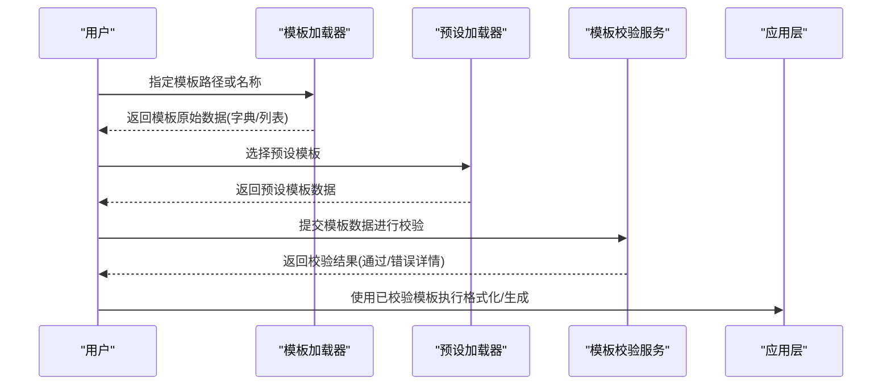
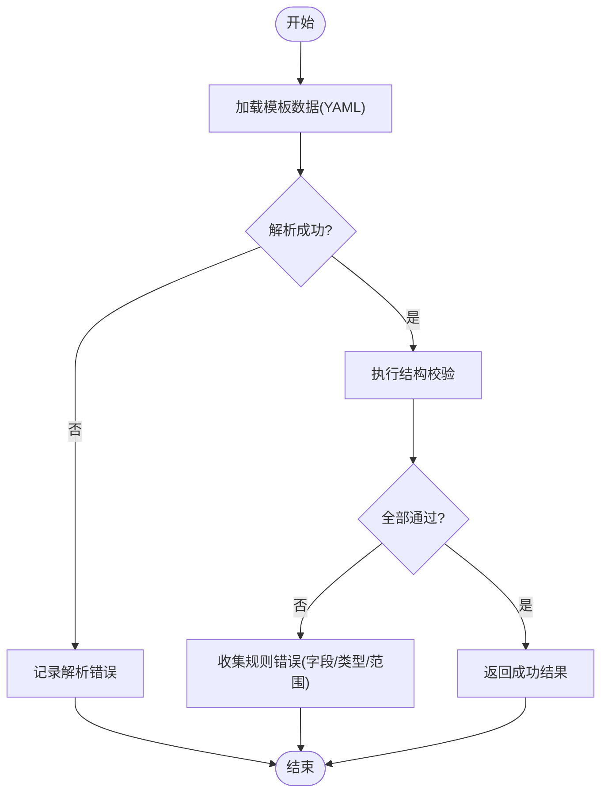
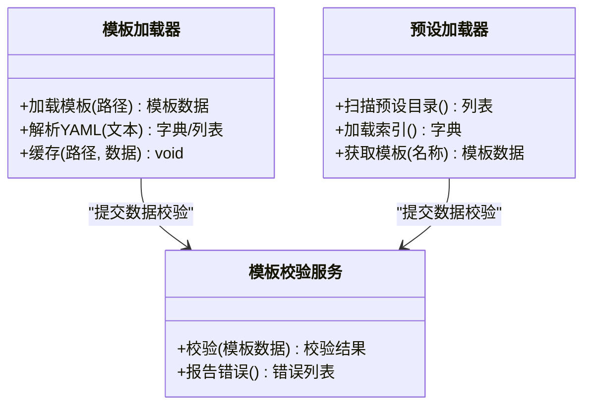
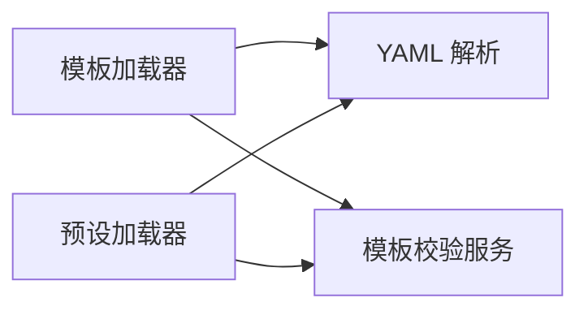

# 基础语法规范

<cite>
**本文引用的文件**   
- [presets/academic_paper.yaml](file://presets/academic_paper.yaml)
- [presets/chinese_thesis.yaml](file://presets/chinese_thesis.yaml)
- [presets/templates_index.yaml](file://presets/templates_index.yaml)
- [examples/sample_template.yaml](file://examples/sample_template.yaml)
- [src/paper_format_corrector/application/services/template_validation_service.py](file://src/paper_format_corrector/application/services/template_validation_service.py)
- [src/paper_format_corrector/infra/doc_template_loader.py](file://src/paper_format_corrector/infra/doc_template_loader.py)
- [src/paper_format_corrector/infra/preset_loader.py](file://src/paper_format_corrector/infra/preset_loader.py)
</cite>

## 目录
1. [简介](#简介)
2. [项目结构](#项目结构)
3. [核心组件](#核心组件)
4. [架构总览](#架构总览)
5. [详细组件分析](#详细组件分析)
6. [依赖关系分析](#依赖关系分析)
7. [性能考虑](#性能考虑)
8. [故障排查指南](#故障排查指南)
9. [结论](#结论)
10. [附录](#附录)

## 简介
本文件面向模板配置使用者与维护者，系统化阐述模板配置文件的基础语法与组织方式。内容涵盖：
- YAML 基本结构：键值对、数据类型（字符串、数字、布尔值、数组、对象）、嵌套结构与注释
- 模板文件的组织方式：顶层字段与子对象的定义规则
- 完整语法示例：如何编写有效的模板配置文件
- 常见语法错误与调试技巧

## 项目结构
本项目将模板与预设以 YAML 文件形式集中管理，并通过加载器与校验服务进行解析与验证。关键位置包括：
- presets：内置模板与索引
- examples：示例模板
- infra：模板加载与预设加载
- application：模板校验服务

图表来源
- [src/paper_format_corrector/infra/doc_template_loader.py](file://src/paper_format_corrector/infra/doc_template_loader.py)
- [src/paper_format_corrector/infra/preset_loader.py](file://src/paper_format_corrector/infra/preset_loader.py)
- [src/paper_format_corrector/application/services/template_validation_service.py](file://src/paper_format_corrector/application/services/template_validation_service.py)

章节来源
- [presets/academic_paper.yaml](file://presets/academic_paper.yaml)
- [presets/chinese_thesis.yaml](file://presets/chinese_thesis.yaml)
- [presets/templates_index.yaml](file://presets/templates_index.yaml)
- [examples/sample_template.yaml](file://examples/sample_template.yaml)
- [src/paper_format_corrector/infra/doc_template_loader.py](file://src/paper_format_corrector/infra/doc_template_loader.py)
- [src/paper_format_corrector/infra/preset_loader.py](file://src/paper_format_corrector/infra/preset_loader.py)
- [src/paper_format_corrector/application/services/template_validation_service.py](file://src/paper_format_corrector/application/services/template_validation_service.py)

## 核心组件
- 模板加载器：负责从文件系统或包内资源读取 YAML 模板并转换为内部数据结构
- 预设加载器：负责加载 presets 目录下的模板集合与索引
- 模板校验服务：对模板结构进行合法性检查，返回结构化错误信息以便定位问题

章节来源
- [src/paper_format_corrector/infra/doc_template_loader.py](file://src/paper_format_corrector/infra/doc_template_loader.py)
- [src/paper_format_corrector/infra/preset_loader.py](file://src/paper_format_corrector/infra/preset_loader.py)
- [src/paper_format_corrector/application/services/template_validation_service.py](file://src/paper_format_corrector/application/services/template_validation_service.py)

## 架构总览
下图展示了模板从“文件”到“可用数据”的关键路径，以及校验环节的位置。

图表来源
- [src/paper_format_corrector/infra/doc_template_loader.py](file://src/paper_format_corrector/infra/doc_template_loader.py)
- [src/paper_format_corrector/infra/preset_loader.py](file://src/paper_format_corrector/infra/preset_loader.py)
- [src/paper_format_corrector/application/services/template_validation_service.py](file://src/paper_format_corrector/application/services/template_validation_service.py)

## 详细组件分析

### YAML 基础语法要点
- 键值对
  - 使用冒号分隔键与值，键名需唯一
  - 支持引号包裹的字符串与未加引号的标量
- 数据类型
  - 字符串：单引号或双引号包裹；也可省略引号（注意特殊字符）
  - 数字：整数、浮点数
  - 布尔值：true/false（不区分大小写）
  - 数组：使用短横线“- ”表示序列项
  - 对象：使用缩进表示层级
- 嵌套结构
  - 通过统一缩进（推荐空格而非制表符）表达父子关系
- 注释
  - 以“#”开头整行或行尾注释

章节来源
- [presets/academic_paper.yaml](file://presets/academic_paper.yaml)
- [presets/chinese_thesis.yaml](file://presets/chinese_thesis.yaml)
- [examples/sample_template.yaml](file://examples/sample_template.yaml)

### 模板文件组织方式
- 顶层字段
  - 通常包含元信息（如版本、作者、描述等）与全局设置
- 子对象
  - 按功能域划分，例如页面布局、段落样式、标题层级、表格样式、页眉页脚、封面等
  - 每个子对象内部再细分为具体属性键值对
- 命名约定
  - 建议使用小写字母、数字与下划线组合的键名，避免保留字与特殊符号
- 可选与必填
  - 由模板校验服务定义；缺失必填字段会触发校验错误

章节来源
- [presets/academic_paper.yaml](file://presets/academic_paper.yaml)
- [presets/chinese_thesis.yaml](file://presets/chinese_thesis.yaml)
- [presets/templates_index.yaml](file://presets/templates_index.yaml)
- [examples/sample_template.yaml](file://examples/sample_template.yaml)

### 模板校验流程（代码级）

图表来源
- [src/paper_format_corrector/application/services/template_validation_service.py](file://src/paper_format_corrector/application/services/template_validation_service.py)

章节来源
- [src/paper_format_corrector/application/services/template_validation_service.py](file://src/paper_format_corrector/application/services/template_validation_service.py)

### 模板加载与预设集成（代码级）

图表来源
- [src/paper_format_corrector/infra/doc_template_loader.py](file://src/paper_format_corrector/infra/doc_template_loader.py)
- [src/paper_format_corrector/infra/preset_loader.py](file://src/paper_format_corrector/infra/preset_loader.py)
- [src/paper_format_corrector/application/services/template_validation_service.py](file://src/paper_format_corrector/application/services/template_validation_service.py)

章节来源
- [src/paper_format_corrector/infra/doc_template_loader.py](file://src/paper_format_corrector/infra/doc_template_loader.py)
- [src/paper_format_corrector/infra/preset_loader.py](file://src/paper_format_corrector/infra/preset_loader.py)
- [src/paper_format_corrector/application/services/template_validation_service.py](file://src/paper_format_corrector/application/services/template_validation_service.py)

## 依赖关系分析
- 模块耦合
  - 模板加载器与预设加载器均依赖 YAML 解析能力，并将结果交给模板校验服务
  - 模板校验服务作为“契约”入口，向上提供统一的校验接口
- 外部依赖
  - YAML 解析库（标准库或第三方）
  - 文件系统访问（本地路径或包内资源）
- 潜在循环依赖
  - 当前分层清晰，未见直接循环引用

图表来源
- [src/paper_format_corrector/infra/doc_template_loader.py](file://src/paper_format_corrector/infra/doc_template_loader.py)
- [src/paper_format_corrector/infra/preset_loader.py](file://src/paper_format_corrector/infra/preset_loader.py)
- [src/paper_format_corrector/application/services/template_validation_service.py](file://src/paper_format_corrector/application/services/template_validation_service.py)

章节来源
- [src/paper_format_corrector/infra/doc_template_loader.py](file://src/paper_format_corrector/infra/doc_template_loader.py)
- [src/paper_format_corrector/infra/preset_loader.py](file://src/paper_format_corrector/infra/preset_loader.py)
- [src/paper_format_corrector/application/services/template_validation_service.py](file://src/paper_format_corrector/application/services/template_validation_service.py)

## 性能考虑
- 模板缓存
  - 对频繁使用的模板进行内存或磁盘缓存，减少重复 I/O 与解析开销
- 增量校验
  - 仅对变更部分进行校验，降低大模板的校验成本
- 懒加载
  - 按需加载子对象，避免一次性加载庞大模板树
- 并发安全
  - 多进程/多线程环境下确保共享缓存的读写安全

[本节为通用建议，无需特定文件来源]

## 故障排查指南
- 常见语法错误
  - 缩进不一致导致解析失败
  - 非法字符或未转义的特殊字符
  - 键名重复或使用了保留字
  - 数据类型不匹配（如期望数字却提供了字符串）
  - 缺少必填字段或字段取值越界
- 定位方法
  - 优先查看模板校验服务返回的错误列表，关注字段路径与错误原因
  - 使用最小可复现模板逐步缩小范围
  - 借助编辑器开启 YAML 语法高亮与实时校验
- 修复建议
  - 统一使用空格缩进（推荐 2 或 4 个空格）
  - 为复杂字符串添加引号
  - 严格遵循模板定义的字段与类型约束
  - 在开发阶段启用更严格的校验模式

章节来源
- [src/paper_format_corrector/application/services/template_validation_service.py](file://src/paper_format_corrector/application/services/template_validation_service.py)

## 结论
通过规范的 YAML 语法与清晰的模板组织结构，配合模板加载器与校验服务，可以稳定地构建、维护与复用模板配置。建议在团队中统一约定键名与结构，并在 CI 中加入模板校验步骤，以提升质量与协作效率。

[本节为总结性内容，无需特定文件来源]

## 附录

### 完整语法示例（参考路径）
- 学术模板示例：[presets/academic_paper.yaml](file://presets/academic_paper.yaml)
- 中文学位论文示例：[presets/chinese_thesis.yaml](file://presets/chinese_thesis.yaml)
- 模板索引示例：[presets/templates_index.yaml](file://presets/templates_index.yaml)
- 通用示例模板：[examples/sample_template.yaml](file://examples/sample_template.yaml)

章节来源
- [presets/academic_paper.yaml](file://presets/academic_paper.yaml)
- [presets/chinese_thesis.yaml](file://presets/chinese_thesis.yaml)
- [presets/templates_index.yaml](file://presets/templates_index.yaml)
- [examples/sample_template.yaml](file://examples/sample_template.yaml)