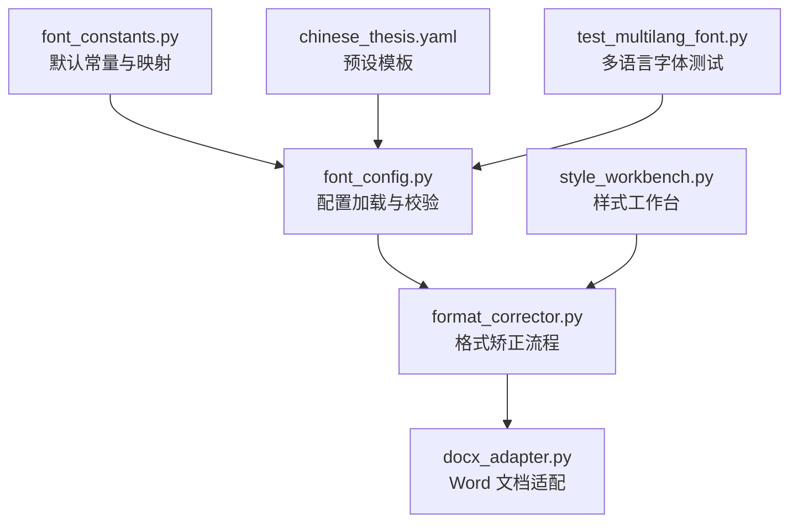
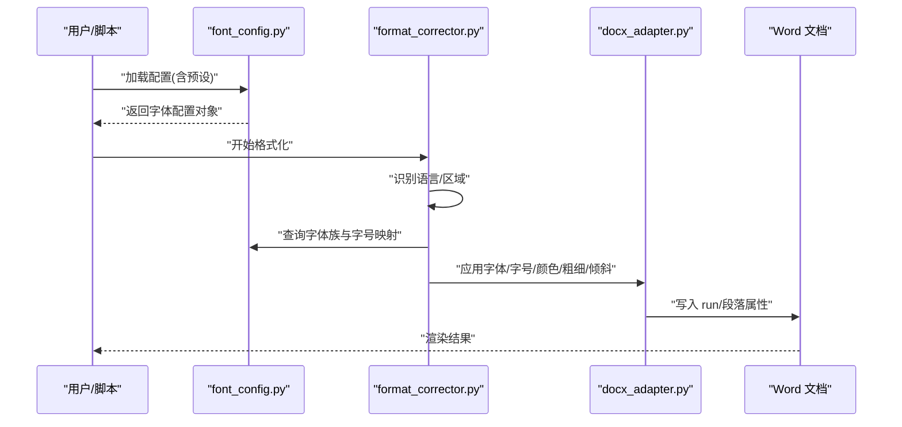
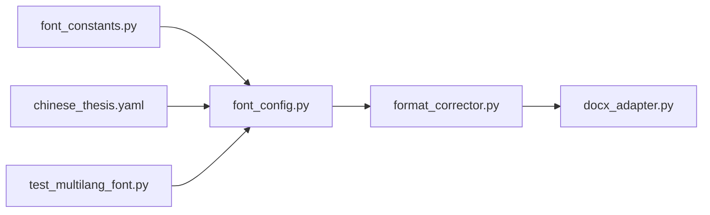
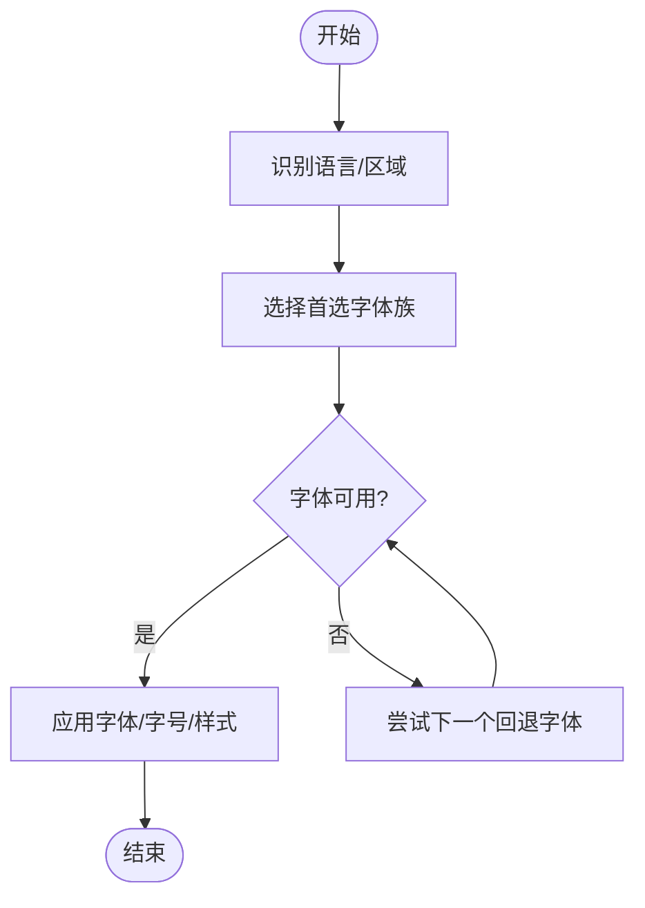

# 字体样式配置

<cite>
**本文引用的文件**   
- [src/paper_format_corrector/infrastructure/config/font_config.py](file://src/paper_format_corrector/infrastructure/config/font_config.py)
- [src/paper_format_corrector/core/format_corrector.py](file://src/paper_format_corrector/core/format_corrector.py)
- [src/paper_format_corrector/infrastructure/adapters/docx_adapter.py](file://src/paper_format_corrector/infrastructure/adapters/docx_adapter.py)
- [src/paper_format_corrector/shared/constants/font_constants.py](file://src/paper_format_corrector/shared/constants/font_constants.py)
- [src/paper_format_corrector/application/services/style_workbench.py](file://src/paper_format_corrector/application/services/style_workbench.py)
- [config/config.yaml](file://config/config.yaml)
- [presets/chinese_thesis.yaml](file://presets/chinese_thesis.yaml)
- [tests/test_multilang_font.py](file://tests/test_multilang_font.py)
</cite>

## 目录
1. [简介](#简介)
2. [项目结构](#项目结构)
3. [核心组件](#核心组件)
4. [架构总览](#架构总览)
5. [详细组件分析](#详细组件分析)
6. [依赖关系分析](#依赖关系分析)
7. [性能考虑](#性能考虑)
8. [故障排查指南](#故障排查指南)
9. [结论](#结论)
10. [附录](#附录)

## 简介
本参考文档聚焦于“字体样式配置”，覆盖中文字体（宋体、黑体、楷体等）、英文字体（Times New Roman、Arial等）、字号定义（小四、五号等对应磅值）、字体颜色、加粗斜体等文本样式属性，并提供多语言字体兼容性与回退机制的配置方法。文档面向使用者与二次开发者，既提供高层说明，也给出代码级定位以便快速落地。

## 项目结构
与字体样式配置相关的核心位置如下：
- 配置常量与默认映射：位于共享常量模块
- 配置加载与校验：位于基础设施配置层
- 格式矫正流程：位于核心矫正器
- Word 文档适配：位于 docx 适配器
- 样式工作台：用于批量应用与预览
- 预设模板：包含高校论文等常用字体的示例配置
- 测试用例：验证多语言字体与回退行为

图表来源
- [src/paper_format_corrector/infrastructure/config/font_config.py](file://src/paper_format_corrector/infrastructure/config/font_config.py)
- [src/paper_format_corrector/core/format_corrector.py](file://src/paper_format_corrector/core/format_corrector.py)
- [src/paper_format_corrector/infrastructure/adapters/docx_adapter.py](file://src/paper_format_corrector/infrastructure/adapters/docx_adapter.py)
- [src/paper_format_corrector/shared/constants/font_constants.py](file://src/paper_format_corrector/shared/constants/font_constants.py)
- [src/paper_format_corrector/application/services/style_workbench.py](file://src/paper_format_corrector/application/services/style_workbench.py)
- [presets/chinese_thesis.yaml](file://presets/chinese_thesis.yaml)
- [tests/test_multilang_font.py](file://tests/test_multilang_font.py)

章节来源
- [src/paper_format_corrector/infrastructure/config/font_config.py](file://src/paper_format_corrector/infrastructure/config/font_config.py)
- [src/paper_format_corrector/core/format_corrector.py](file://src/paper_format_corrector/core/format_corrector.py)
- [src/paper_format_corrector/infrastructure/adapters/docx_adapter.py](file://src/paper_format_corrector/infrastructure/adapters/docx_adapter.py)
- [src/paper_format_corrector/shared/constants/font_constants.py](file://src/paper_format_corrector/shared/constants/font_constants.py)
- [src/paper_format_corrector/application/services/style_workbench.py](file://src/paper_format_corrector/application/services/style_workbench.py)
- [presets/chinese_thesis.yaml](file://presets/chinese_thesis.yaml)
- [tests/test_multilang_font.py](file://tests/test_multilang_font.py)

## 核心组件
- 配置常量与默认映射
  - 负责维护中英文字体族名、常见字号到磅值的映射、默认颜色与粗细/倾斜标记等基础数据。
  - 典型键包括：中文正文字体、英文正文字体、标题字体、脚注/引文字体、字号映射表、颜色枚举或命名映射、加粗/斜体开关等。
- 配置加载与校验
  - 从 YAML 配置文件读取用户自定义的字体设置，合并默认常量，进行类型与取值校验，生成运行时可用的字体配置对象。
  - 支持按区域/语言选择不同字体族，并允许为同一逻辑角色（如“正文”）指定多语言回退序列。
- 格式矫正流程
  - 在文档处理管线中，依据当前段落/字符的语言特征与上下文，选择目标字体族与字号，应用颜色、加粗、斜体等样式。
- Word 文档适配
  - 将内存中的字体配置写入 docx 的 run/paragraph 级别属性，确保在 Word 中渲染一致。
- 样式工作台
  - 提供批量应用、预览与导出能力，便于统一调整整篇文档的字体策略。
- 预设模板
  - 提供高校论文、期刊等常用配置的示例，开箱即用。

章节来源
- [src/paper_format_corrector/shared/constants/font_constants.py](file://src/paper_format_corrector/shared/constants/font_constants.py)
- [src/paper_format_corrector/infrastructure/config/font_config.py](file://src/paper_format_corrector/infrastructure/config/font_config.py)
- [src/paper_format_corrector/core/format_corrector.py](file://src/paper_format_corrector/core/format_corrector.py)
- [src/paper_format_corrector/infrastructure/adapters/docx_adapter.py](file://src/paper_format_corrector/infrastructure/adapters/docx_adapter.py)
- [src/paper_format_corrector/application/services/style_workbench.py](file://src/paper_format_corrector/application/services/style_workbench.py)
- [presets/chinese_thesis.yaml](file://presets/chinese_thesis.yaml)

## 架构总览
下图展示了从配置到最终应用到 Word 文档的关键路径，以及多语言回退的决策点。

图表来源
- [src/paper_format_corrector/infrastructure/config/font_config.py](file://src/paper_format_corrector/infrastructure/config/font_config.py)
- [src/paper_format_corrector/core/format_corrector.py](file://src/paper_format_corrector/core/format_corrector.py)
- [src/paper_format_corrector/infrastructure/adapters/docx_adapter.py](file://src/paper_format_corrector/infrastructure/adapters/docx_adapter.py)

## 详细组件分析

### 配置常量与默认映射（font_constants.py）
- 职责
  - 维护默认的中英文字体族名、字号到磅值映射、颜色命名映射、加粗/斜体标志等。
- 关键内容
  - 中文字体族：如宋体、黑体、楷体等
  - 英文字体族：如 Times New Roman、Arial 等
  - 字号映射：如“小四”“五号”等中文传统字号到磅值
  - 颜色：支持十六进制或命名色
  - 文本样式：加粗、斜体、下划线等开关
- 使用建议
  - 通过修改常量或覆盖配置的方式定制全局默认值
  - 保持字体族名与操作系统已安装字体一致，避免回退失败

章节来源
- [src/paper_format_corrector/shared/constants/font_constants.py](file://src/paper_format_corrector/shared/constants/font_constants.py)

### 配置加载与校验（font_config.py）
- 职责
  - 从 YAML 读取用户配置，合并默认常量，执行类型与取值校验，输出可被上层使用的配置对象。
- 关键流程
  - 读取 config.yaml 与预设模板（如 chinese_thesis.yaml）
  - 合并策略：用户配置优先，未显式设置的字段回落到默认常量
  - 校验规则：字体族名非空、字号映射合法、颜色格式正确、布尔开关合法等
  - 输出：统一的字体配置对象，供矫正器与适配器使用
- 多语言与回退
  - 支持为每个逻辑角色（如“正文”）配置多语言字体族列表，形成回退链
  - 若首选字体不可用，自动尝试下一个候选

章节来源
- [src/paper_format_corrector/infrastructure/config/font_config.py](file://src/paper_format_corrector/infrastructure/config/font_config.py)
- [config/config.yaml](file://config/config.yaml)
- [presets/chinese_thesis.yaml](file://presets/chinese_thesis.yaml)

### 格式矫正流程（format_corrector.py）
- 职责
  - 在文档遍历过程中，根据当前文本的语言/区域信息，选择目标字体族与字号，应用颜色、加粗、斜体等样式。
- 关键逻辑
  - 语言检测：基于字符集或上下文判断中文/英文/数字等
  - 字体选择：从配置对象中获取对应语言的字体族与回退序列
  - 字号解析：将“小四”“五号”等映射为具体磅值
  - 样式应用：调用适配器写入 run/段落属性
- 错误处理
  - 当字体缺失时记录警告并继续回退
  - 对非法字号或颜色进行修正或跳过

章节来源
- [src/paper_format_corrector/core/format_corrector.py](file://src/paper_format_corrector/core/format_corrector.py)

### Word 文档适配（docx_adapter.py）
- 职责
  - 将内存中的字体配置写入 docx 的 run 与段落属性，保证在 Word 中正确渲染。
- 关键点
  - 字体族名写入：区分东亚与拉丁字体族
  - 字号单位：以磅为单位写入
  - 颜色：十六进制或命名色转换
  - 加粗/斜体：布尔位写入
- 兼容性
  - 针对不同版本的 python-docx API 做兼容处理
  - 对不支持的属性进行降级或忽略

章节来源
- [src/paper_format_corrector/infrastructure/adapters/docx_adapter.py](file://src/paper_format_corrector/infrastructure/adapters/docx_adapter.py)

### 样式工作台（style_workbench.py）
- 职责
  - 提供批量应用、预览与导出能力，便于统一调整整篇文档的字体策略。
- 功能要点
  - 批量替换：按段落/运行范围应用字体与字号
  - 预览模式：不写盘，仅计算差异
  - 导出报告：输出应用了哪些样式的统计信息

章节来源
- [src/paper_format_corrector/application/services/style_workbench.py](file://src/paper_format_corrector/application/services/style_workbench.py)

### 预设模板（chinese_thesis.yaml）
- 用途
  - 提供高校论文等常用字体的开箱即用配置，包括中/英字体族、字号、颜色与样式开关。
- 扩展方式
  - 复制并修改为机构专属模板，纳入配置加载流程即可生效

章节来源
- [presets/chinese_thesis.yaml](file://presets/chinese_thesis.yaml)

### 多语言字体与回退（测试用例）
- 目的
  - 验证多语言字体选择与回退机制的正确性，确保在不同语言混合场景下仍能得到预期渲染。
- 关注点
  - 中文优先使用宋体/黑体/楷体等
  - 英文优先使用 Times New Roman/Arial 等
  - 数字与标点遵循主语言或独立策略
  - 回退链顺序与缺失字体时的表现

章节来源
- [tests/test_multilang_font.py](file://tests/test_multilang_font.py)

## 依赖关系分析
- 低耦合高内聚
  - 常量层只暴露数据，配置层负责合并与校验，矫正器专注策略，适配器专注持久化。
- 直接依赖
  - 矫正器依赖配置对象与适配器
  - 配置层依赖常量与 YAML 文件
  - 适配器依赖 python-docx 的底层 API
- 潜在风险
  - 若系统缺少某字体族，需确保回退链合理
  - 不同 OS 的字体族名可能略有差异，建议在配置中显式声明

图表来源
- [src/paper_format_corrector/shared/constants/font_constants.py](file://src/paper_format_corrector/shared/constants/font_constants.py)
- [src/paper_format_corrector/infrastructure/config/font_config.py](file://src/paper_format_corrector/infrastructure/config/font_config.py)
- [src/paper_format_corrector/core/format_corrector.py](file://src/paper_format_corrector/core/format_corrector.py)
- [src/paper_format_corrector/infrastructure/adapters/docx_adapter.py](file://src/paper_format_corrector/infrastructure/adapters/docx_adapter.py)
- [presets/chinese_thesis.yaml](file://presets/chinese_thesis.yaml)
- [tests/test_multilang_font.py](file://tests/test_multilang_font.py)

## 性能考虑
- 配置缓存
  - 启动时一次性加载并缓存配置对象，避免重复 I/O 与解析开销。
- 批量应用
  - 使用样式工作台进行批量操作，减少逐段处理的函数调用成本。
- 字体回退优化
  - 预检查可用字体族，构建高效回退索引，降低运行时查找成本。
- 最小化写入
  - 仅在必要时更新 run/段落属性，避免无变更的重写。

## 故障排查指南
- 症状：部分字符显示异常或字体不一致
  - 排查步骤
    - 确认操作系统是否安装了配置的字体族
    - 检查 config.yaml 与预设模板中的字体族名是否正确
    - 查看回退链顺序，确保备选字体可用
- 症状：字号未按预期显示
  - 排查步骤
    - 核对“小四”“五号”等映射到磅值的配置
    - 确认 Word 版本对字号单位的处理方式
- 症状：颜色不正确
  - 排查步骤
    - 检查颜色格式（十六进制或命名色）
    - 确认适配器对颜色的转换逻辑
- 症状：加粗/斜体无效
  - 排查步骤
    - 检查布尔开关是否启用
    - 确认目标字体族是否支持相应字形变体

章节来源
- [src/paper_format_corrector/infrastructure/config/font_config.py](file://src/paper_format_corrector/infrastructure/config/font_config.py)
- [src/paper_format_corrector/core/format_corrector.py](file://src/paper_format_corrector/core/format_corrector.py)
- [src/paper_format_corrector/infrastructure/adapters/docx_adapter.py](file://src/paper_format_corrector/infrastructure/adapters/docx_adapter.py)

## 结论
通过常量、配置、矫正器与适配器的分层设计，本项目实现了灵活且可维护的字体样式配置体系。借助预设模板与回退机制，可在多语言环境下稳定地应用中/英字体、字号、颜色与文本样式。建议在生产环境中结合样式工作台进行批量管理与回归测试，确保跨平台一致性。

## 附录

### 中文字体设置参考
- 常用中文字体族：宋体、黑体、楷体、仿宋、微软雅黑等
- 适用场景：正文、标题、脚注、引文等
- 注意事项：不同操作系统字体名称可能略有差异，建议在配置中显式声明

章节来源
- [src/paper_format_corrector/shared/constants/font_constants.py](file://src/paper_format_corrector/shared/constants/font_constants.py)
- [presets/chinese_thesis.yaml](file://presets/chinese_thesis.yaml)

### 英文字体设置参考
- 常用英文字体族：Times New Roman、Arial、Calibri、Georgia 等
- 适用场景：英文正文、参考文献、图表标签等
- 注意事项：与中文字体搭配时注意视觉协调

章节来源
- [src/paper_format_corrector/shared/constants/font_constants.py](file://src/paper_format_corrector/shared/constants/font_constants.py)
- [presets/chinese_thesis.yaml](file://presets/chinese_thesis.yaml)

### 字号定义（中文传统字号到磅值）
- 常见映射：初号、小初、一号、二号、三号、四号、小四、五号、小五、六号、七号、八号
- 建议：在配置中以“小四”“五号”等键名映射到具体磅值，便于跨平台一致

章节来源
- [src/paper_format_corrector/shared/constants/font_constants.py](file://src/paper_format_corrector/shared/constants/font_constants.py)

### 字体颜色与文本样式
- 颜色：支持十六进制或命名色；建议统一在配置中集中管理
- 文本样式：加粗、斜体、下划线等布尔开关；确保所选字体族具备相应字形变体

章节来源
- [src/paper_format_corrector/shared/constants/font_constants.py](file://src/paper_format_corrector/shared/constants/font_constants.py)
- [src/paper_format_corrector/infrastructure/adapters/docx_adapter.py](file://src/paper_format_corrector/infrastructure/adapters/docx_adapter.py)

### 多语言字体兼容性与回退机制
- 语言识别：基于字符集或上下文判断中文/英文/数字
- 回退链：为每个逻辑角色配置多语言字体族列表，按优先级依次尝试
- 缺失处理：记录警告并继续回退，避免中断整体流程

图表来源
- [src/paper_format_corrector/core/format_corrector.py](file://src/paper_format_corrector/core/format_corrector.py)
- [src/paper_format_corrector/infrastructure/config/font_config.py](file://src/paper_format_corrector/infrastructure/config/font_config.py)