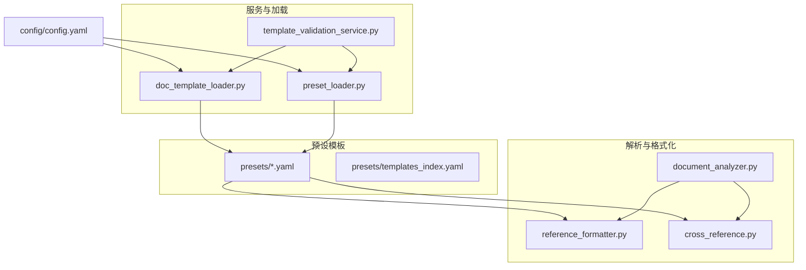
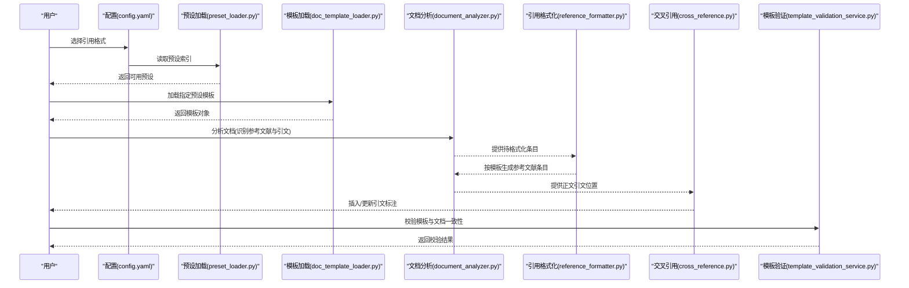
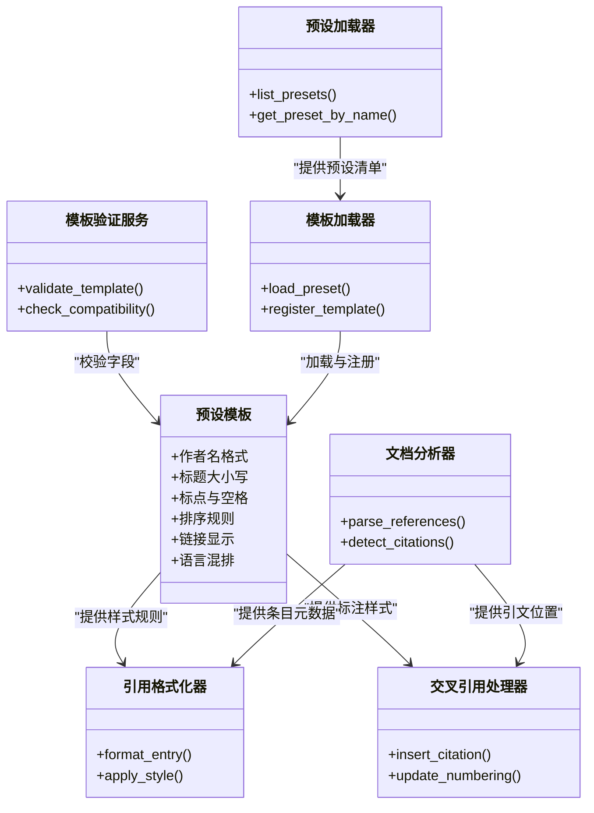

# 引用格式配置

<cite>
**本文引用的文件**   
- [README.md](file://README.md)
- [config/config.yaml](file://config/config.yaml)
- [presets/apa.yaml](file://presets/apa.yaml)
- [presets/ieee.yaml](file://presets/ieee.yaml)
- [presets/mla.yaml](file://presets/mla.yaml)
- [presets/chicago.yaml](file://presets/chicago.yaml)
- [presets/gb7714.yaml](file://presets/gb7714.yaml)
- [presets/templates_index.yaml](file://presets/templates_index.yaml)
- [src/paper_format_corrector/infrastructure/parsers/reference_formatter.py](file://src/paper_format_corrector/infrastructure/parsers/reference_formatter.py)
- [src/paper_format_corrector/infrastructure/parsers/cross_reference.py](file://src/paper_format_corrector/infrastructure/parsers/cross_reference.py)
- [src/paper_format_corrector/infrastructure/parsers/document_analyzer.py](file://src/paper_format_corrector/infrastructure/parsers/document_analyzer.py)
- [src/paper_format_corrector/application/services/template_validation_service.py](file://src/paper_format_corrector/application/services/template_validation_service.py)
- [src/paper_format_corrector/infra/doc_template_loader.py](file://src/paper_format_corrector/infra/doc_template_loader.py)
- [src/paper_format_corrector/infra/preset_loader.py](file://src/paper_format_corrector/infra/preset_loader.py)
</cite>

## 目录
1. [简介](#简介)
2. [项目结构](#项目结构)
3. [核心组件](#核心组件)
4. [架构总览](#架构总览)
5. [详细组件分析](#详细组件分析)
6. [依赖关系分析](#依赖关系分析)
7. [性能考虑](#性能考虑)
8. [故障排查指南](#故障排查指南)
9. [结论](#结论)
10. [附录](#附录)

## 简介
本文件聚焦“引用格式配置”，覆盖以下主题：
- 参考文献格式设置（如 APA、IEEE、MLA、Chicago、GB/T 7714 等）
- 引文标注样式（作者-年份、数字编号）
- 参考文献列表格式与排序规则
- 中英文文献混排处理策略
- 常见学术格式的引用规则对照表
- 自定义引用格式的实现方法

目标是帮助读者快速理解并正确配置引用格式，满足多场景的论文排版需求。

## 项目结构
与引用格式配置相关的代码与资源主要分布在如下位置：
- presets 目录：存放各学术格式模板（YAML），定义引用风格、标点、顺序、排序等规则
- infrastructure/parsers：解析文档中的引文与参考文献，执行格式化与交叉引用
- application/services：模板校验与服务编排
- infra：模板加载与预设管理
- config：全局配置入口

图表来源
- [presets/apa.yaml](file://presets/apa.yaml)
- [presets/ieee.yaml](file://presets/ieee.yaml)
- [presets/mla.yaml](file://presets/mla.yaml)
- [presets/chicago.yaml](file://presets/chicago.yaml)
- [presets/gb7714.yaml](file://presets/gb7714.yaml)
- [presets/templates_index.yaml](file://presets/templates_index.yaml)
- [src/paper_format_corrector/infrastructure/parsers/reference_formatter.py](file://src/paper_format_corrector/infrastructure/parsers/reference_formatter.py)
- [src/paper_format_corrector/infrastructure/parsers/cross_reference.py](file://src/paper_format_corrector/infrastructure/parsers/cross_reference.py)
- [src/paper_format_corrector/infrastructure/parsers/document_analyzer.py](file://src/paper_format_corrector/infrastructure/parsers/document_analyzer.py)
- [src/paper_format_corrector/application/services/template_validation_service.py](file://src/paper_format_corrector/application/services/template_validation_service.py)
- [src/paper_format_corrector/infra/doc_template_loader.py](file://src/paper_format_corrector/infra/doc_template_loader.py)
- [src/paper_format_corrector/infra/preset_loader.py](file://src/paper_format_corrector/infra/preset_loader.py)
- [config/config.yaml](file://config/config.yaml)

章节来源
- [README.md](file://README.md)
- [config/config.yaml](file://config/config.yaml)
- [presets/templates_index.yaml](file://presets/templates_index.yaml)

## 核心组件
- 预设模板（presets/*.yaml）：以 YAML 描述引用风格，包括作者名格式、标题大小写、期刊缩写、标点符号、排序方式、是否使用 DOI/URL、中英混排策略等
- 引用格式化器（reference_formatter.py）：根据所选模板对参考文献条目进行格式化输出
- 交叉引用处理器（cross_reference.py）：在正文中插入或更新引文标注，支持作者-年份与数字编号两种样式
- 文档分析器（document_analyzer.py）：识别文档中的参考文献区块、定位引文标注、提取元数据
- 模板验证服务（template_validation_service.py）：校验模板完整性与兼容性
- 模板与预设加载器（doc_template_loader.py、preset_loader.py）：从本地或远程仓库加载模板与预设，提供统一接口

章节来源
- [src/paper_format_corrector/infrastructure/parsers/reference_formatter.py](file://src/paper_format_corrector/infrastructure/parsers/reference_formatter.py)
- [src/paper_format_corrector/infrastructure/parsers/cross_reference.py](file://src/paper_format_corrector/infrastructure/parsers/cross_reference.py)
- [src/paper_format_corrector/infrastructure/parsers/document_analyzer.py](file://src/paper_format_corrector/infrastructure/parsers/document_analyzer.py)
- [src/paper_format_corrector/application/services/template_validation_service.py](file://src/paper_format_corrector/application/services/template_validation_service.py)
- [src/paper_format_corrector/infra/doc_template_loader.py](file://src/paper_format_corrector/infra/doc_template_loader.py)
- [src/paper_format_corrector/infra/preset_loader.py](file://src/paper_format_corrector/infra/preset_loader.py)

## 架构总览
引用格式配置的整体流程如下：
- 用户通过配置选择目标格式（如 APA、IEEE、MLA、GB/T 7714）
- 系统加载对应预设模板与全局配置
- 文档分析器扫描文档，识别参考文献区块与正文引文标注
- 引用格式化器依据模板生成标准参考文献条目
- 交叉引用处理器在正文中插入或更新引文标注
- 模板验证服务确保模板与文档兼容

图表来源
- [config/config.yaml](file://config/config.yaml)
- [src/paper_format_corrector/infra/preset_loader.py](file://src/paper_format_corrector/infra/preset_loader.py)
- [src/paper_format_corrector/infra/doc_template_loader.py](file://src/paper_format_corrector/infra/doc_template_loader.py)
- [src/paper_format_corrector/infrastructure/parsers/document_analyzer.py](file://src/paper_format_corrector/infrastructure/parsers/document_analyzer.py)
- [src/paper_format_corrector/infrastructure/parsers/reference_formatter.py](file://src/paper_format_corrector/infrastructure/parsers/reference_formatter.py)
- [src/paper_format_corrector/infrastructure/parsers/cross_reference.py](file://src/paper_format_corrector/infrastructure/parsers/cross_reference.py)
- [src/paper_format_corrector/application/services/template_validation_service.py](file://src/paper_format_corrector/application/services/template_validation_service.py)

## 详细组件分析

### 预设模板与字段说明
- 预设模板位于 presets 目录，每个 .yaml 文件定义一种引用风格
- 常用字段（不同模板可能略有差异）：
  - 作者名格式：姓前名后、缩写、连字符、多作者分隔符
  - 标题大小写：句首大写、实词大写、全小写
  - 期刊/会议名称：全称或缩写、斜体规则
  - 标点与空格：逗号、冒号、分号、括号、句号的使用
  - 排序规则：按作者姓氏字母序、出版年、类型优先级
  - 链接与标识：DOI、URL、ISBN、ISSN 的显示策略
  - 语言与混排：中文/英文字体、标点半角/全角、混排对齐
  - 引文标注样式：作者-年份、数字编号、上标/方括号
  - 参考文献列表：缩进、悬挂缩进、编号前缀/后缀

示例模板参考路径：
- [APA 预设](file://presets/apa.yaml)
- [IEEE 预设](file://presets/ieee.yaml)
- [MLA 预设](file://presets/mla.yaml)
- [Chicago 预设](file://presets/chicago.yaml)
- [GB/T 7714 预设](file://presets/gb7714.yaml)

章节来源
- [presets/apa.yaml](file://presets/apa.yaml)
- [presets/ieee.yaml](file://presets/ieee.yaml)
- [presets/mla.yaml](file://presets/mla.yaml)
- [presets/chicago.yaml](file://presets/chicago.yaml)
- [presets/gb7714.yaml](file://presets/gb7714.yaml)

### 引用格式化器（reference_formatter.py）
- 职责：将结构化元数据转换为符合模板规则的参考文献条目
- 输入：文档分析器提供的条目元数据（作者、题名、出处、年份、标识符等）
- 输出：格式化后的字符串或段落对象
- 关键点：
  - 根据模板决定作者名顺序与分隔符
  - 控制标题大小写与标点
  - 处理多作者、编辑者、译者
  - 决定是否包含 DOI/URL 及显示格式
  - 支持中英文混排的字体与标点切换

章节来源
- [src/paper_format_corrector/infrastructure/parsers/reference_formatter.py](file://src/paper_format_corrector/infrastructure/parsers/reference_formatter.py)

### 交叉引用处理器（cross_reference.py）
- 职责：在正文中插入或更新引文标注，保持与参考文献列表一致
- 支持的标注样式：
  - 作者-年份：例如 (Smith, 2020) 或 Smith(2020)
  - 数字编号：例如 [1] 或上标形式
- 关键点：
  - 自动分配编号（按出现顺序或按字母序）
  - 合并重复引用
  - 处理同页多次引用与页码标注
  - 与模板的标点与样式保持一致

章节来源
- [src/paper_format_corrector/infrastructure/parsers/cross_reference.py](file://src/paper_format_corrector/infrastructure/parsers/cross_reference.py)

### 文档分析器（document_analyzer.py）
- 职责：识别文档中的参考文献区块与正文引文标注
- 功能：
  - 定位“参考文献”、“References”、“Bibliography”等标题
  - 解析已有参考文献条目的元数据
  - 检测正文中的引文占位符或标记
  - 为格式化器与交叉引用处理器提供结构化输入

章节来源
- [src/paper_format_corrector/infrastructure/parsers/document_analyzer.py](file://src/paper_format_corrector/infrastructure/parsers/document_analyzer.py)

### 模板验证服务（template_validation_service.py）
- 职责：校验模板完整性与兼容性
- 检查项：
  - 必填字段是否存在
  - 字段值是否符合规范（如布尔、枚举）
  - 与当前文档结构的兼容性
- 输出：错误与警告信息，指导用户修正模板

章节来源
- [src/paper_format_corrector/application/services/template_validation_service.py](file://src/paper_format_corrector/application/services/template_validation_service.py)

### 模板与预设加载器（doc_template_loader.py、preset_loader.py）
- 职责：从本地或远程仓库加载模板与预设
- 能力：
  - 读取 templates_index.yaml 获取可用模板清单
  - 按需下载与缓存模板
  - 提供统一的模板对象接口供上层调用

章节来源
- [src/paper_format_corrector/infra/doc_template_loader.py](file://src/paper_format_corrector/infra/doc_template_loader.py)
- [src/paper_format_corrector/infra/preset_loader.py](file://src/paper_format_corrector/infra/preset_loader.py)
- [presets/templates_index.yaml](file://presets/templates_index.yaml)

### 常见学术格式引用规则对照表
以下为常见格式的关键规则要点（具体实现以对应预设模板为准）：
- APA（第7版）
  - 作者-年份标注；作者名姓前名后；标题仅首词与专有名词大写；期刊名缩写；含 DOI/URL
  - 排序：按作者姓氏字母序；同年同作者按年份升序
  - 参考路径：[presets/apa.yaml](file://presets/apa.yaml)
- IEEE
  - 数字编号标注（方括号）；作者名缩写；标题实词大写；会议/期刊名缩写；常含 DOI/URL
  - 排序：按编号顺序（即正文出现顺序）
  - 参考路径：[presets/ieee.yaml](file://presets/ieee.yaml)
- MLA（第9版）
  - 作者-姓氏标注；作者名全拼；标题与容器名采用特定大小写；标点简洁
  - 排序：按作者姓氏字母序
  - 参考路径：[presets/mla.yaml](file://presets/mla.yaml)
- Chicago（作者-年份或注释-书目）
  - 可选作者-年份或脚注/尾注；标题大小写灵活；机构与报告格式特殊
  - 排序：按作者姓氏字母序
  - 参考路径：[presets/chicago.yaml](file://presets/chicago.yaml)
- GB/T 7714
  - 数字编号标注；作者名姓前名后；中文与英文混排；标点与空格遵循国标
  - 排序：按编号顺序（通常与正文出现顺序一致）
  - 参考路径：[presets/gb7714.yaml](file://presets/gb7714.yaml)

章节来源
- [presets/apa.yaml](file://presets/apa.yaml)
- [presets/ieee.yaml](file://presets/ieee.yaml)
- [presets/mla.yaml](file://presets/mla.yaml)
- [presets/chicago.yaml](file://presets/chicago.yaml)
- [presets/gb7714.yaml](file://presets/gb7714.yaml)

### 中英文文献混排处理
- 字体与标点：中文使用全角标点与宋体/黑体，英文使用半角标点与 Times New Roman/Arial
- 作者名：中文作者保留汉字，英文作者按模板要求缩写或全拼
- 标题与出处：中文标题保留原语言，英文标题按模板大小写规则
- 排序：可分别按语言分组或统一按作者姓氏字母序
- 实现要点：
  - 在模板中配置语言检测与字体切换
  - 在引用格式化器中根据语言字段选择标点与空格
  - 在交叉引用处理器中保持标注样式一致

章节来源
- [src/paper_format_corrector/infrastructure/parsers/reference_formatter.py](file://src/paper_format_corrector/infrastructure/parsers/reference_formatter.py)
- [src/paper_format_corrector/infrastructure/parsers/cross_reference.py](file://src/paper_format_corrector/infrastructure/parsers/cross_reference.py)

### 自定义引用格式的实现方法
步骤概览：
- 新建预设模板
  - 复制现有模板（如 apa.yaml 或 gb7714.yaml）作为基础
  - 修改作者名格式、标题大小写、标点、排序、链接显示等字段
- 注册到模板索引
  - 在 templates_index.yaml 中添加新模板条目（名称、路径、描述）
- 验证与测试
  - 使用模板验证服务检查必填字段与兼容性
  - 运行端到端流程，确认正文标注与参考文献列表一致
- 发布与维护
  - 提交至本地或远程仓库，便于团队共享

关键文件参考：
- 新增模板：[presets/my_style.yaml](file://presets/my_style.yaml)（示例路径）
- 模板索引：[presets/templates_index.yaml](file://presets/templates_index.yaml)
- 模板验证：[application/services/template_validation_service.py](file://src/paper_format_corrector/application/services/template_validation_service.py)
- 模板加载：[infra/doc_template_loader.py](file://src/paper_format_corrector/infra/doc_template_loader.py)
- 预设加载：[infra/preset_loader.py](file://src/paper_format_corrector/infra/preset_loader.py)

章节来源
- [presets/templates_index.yaml](file://presets/templates_index.yaml)
- [src/paper_format_corrector/application/services/template_validation_service.py](file://src/paper_format_corrector/application/services/template_validation_service.py)
- [src/paper_format_corrector/infra/doc_template_loader.py](file://src/paper_format_corrector/infra/doc_template_loader.py)
- [src/paper_format_corrector/infra/preset_loader.py](file://src/paper_format_corrector/infra/preset_loader.py)

## 依赖关系分析
引用格式相关模块之间的依赖关系如下：

图表来源
- [src/paper_format_corrector/infrastructure/parsers/reference_formatter.py](file://src/paper_format_corrector/infrastructure/parsers/reference_formatter.py)
- [src/paper_format_corrector/infrastructure/parsers/cross_reference.py](file://src/paper_format_corrector/infrastructure/parsers/cross_reference.py)
- [src/paper_format_corrector/infrastructure/parsers/document_analyzer.py](file://src/paper_format_corrector/infrastructure/parsers/document_analyzer.py)
- [src/paper_format_corrector/application/services/template_validation_service.py](file://src/paper_format_corrector/application/services/template_validation_service.py)
- [src/paper_format_corrector/infra/doc_template_loader.py](file://src/paper_format_corrector/infra/doc_template_loader.py)
- [src/paper_format_corrector/infra/preset_loader.py](file://src/paper_format_corrector/infra/preset_loader.py)

章节来源
- [presets/templates_index.yaml](file://presets/templates_index.yaml)
- [src/paper_format_corrector/infra/doc_template_loader.py](file://src/paper_format_corrector/infra/doc_template_loader.py)
- [src/paper_format_corrector/infra/preset_loader.py](file://src/paper_format_corrector/infra/preset_loader.py)

## 性能考虑
- 批量处理：对大型文档，建议先进行增量分析，仅处理变更段落
- 缓存机制：对已解析的参考文献条目与模板样式进行缓存，避免重复计算
- 并行化：对多条参考文献的格式化可并行执行，提升吞吐
- 内存优化：流式读取与写入，减少一次性加载全文带来的内存压力

## 故障排查指南
常见问题与解决思路：
- 模板字段缺失或不合法
  - 现象：模板验证失败或格式化异常
  - 排查：检查模板必填字段与取值范围
  - 参考：[模板验证服务](file://src/paper_format_corrector/application/services/template_validation_service.py)
- 正文标注与参考文献不一致
  - 现象：编号错乱或缺失
  - 排查：确认交叉引用处理器是否正确更新编号与合并重复引用
  - 参考：[交叉引用处理器](file://src/paper_format_corrector/infrastructure/parsers/cross_reference.py)
- 中英文混排标点错误
  - 现象：中文文本中出现半角标点或反之
  - 排查：检查模板的语言混排配置与引用格式化器的语言检测逻辑
  - 参考：[引用格式化器](file://src/paper_format_corrector/infrastructure/parsers/reference_formatter.py)
- 预设未生效
  - 现象：选择的预设未应用
  - 排查：确认模板索引是否包含该预设，模板加载器是否正确注册
  - 参考：[模板索引](file://presets/templates_index.yaml)、[模板加载器](file://src/paper_format_corrector/infra/doc_template_loader.py)、[预设加载器](file://src/paper_format_corrector/infra/preset_loader.py)

章节来源
- [src/paper_format_corrector/application/services/template_validation_service.py](file://src/paper_format_corrector/application/services/template_validation_service.py)
- [src/paper_format_corrector/infrastructure/parsers/cross_reference.py](file://src/paper_format_corrector/infrastructure/parsers/cross_reference.py)
- [src/paper_format_corrector/infrastructure/parsers/reference_formatter.py](file://src/paper_format_corrector/infrastructure/parsers/reference_formatter.py)
- [presets/templates_index.yaml](file://presets/templates_index.yaml)
- [src/paper_format_corrector/infra/doc_template_loader.py](file://src/paper_format_corrector/infra/doc_template_loader.py)
- [src/paper_format_corrector/infra/preset_loader.py](file://src/paper_format_corrector/infra/preset_loader.py)

## 结论
通过预设模板与解析组件的配合，系统能够灵活支持多种学术引用格式，并提供作者-年份与数字编号两种标注样式。借助模板验证与加载机制，用户可以快速创建与复用自定义引用格式，同时保障中英文混排的一致性与准确性。

## 附录
- 全局配置入口参考：[config/config.yaml](file://config/config.yaml)
- 预设模板索引参考：[presets/templates_index.yaml](file://presets/templates_index.yaml)
- 常见预设模板参考：
  - [presets/apa.yaml](file://presets/apa.yaml)
  - [presets/ieee.yaml](file://presets/ieee.yaml)
  - [presets/mla.yaml](file://presets/mla.yaml)
  - [presets/chicago.yaml](file://presets/chicago.yaml)
  - [presets/gb7714.yaml](file://presets/gb7714.yaml)