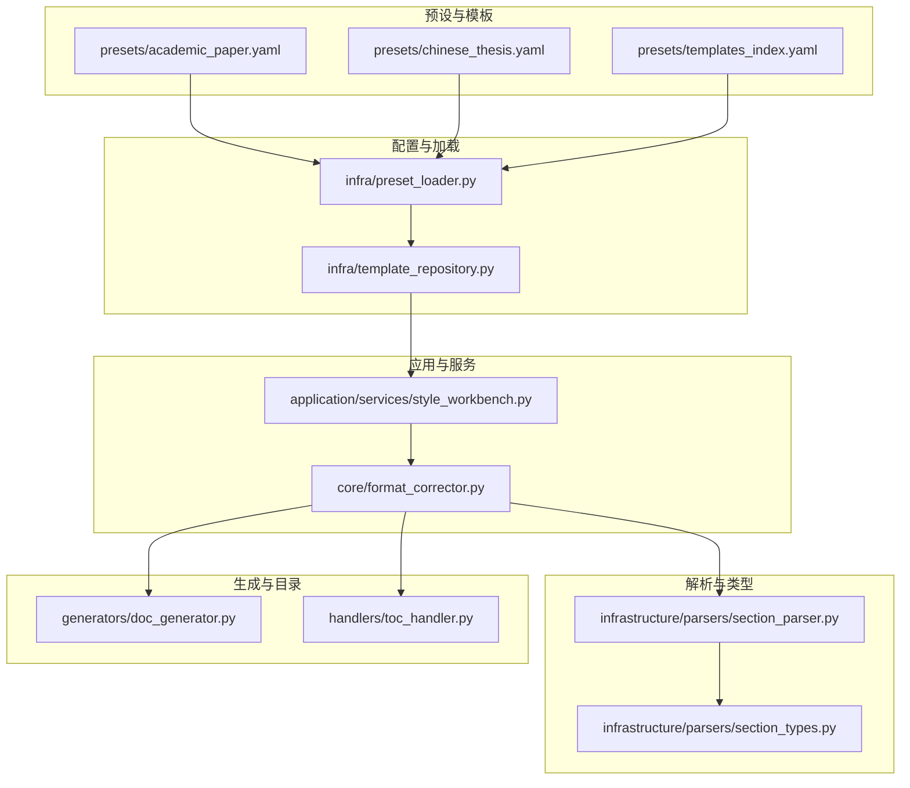
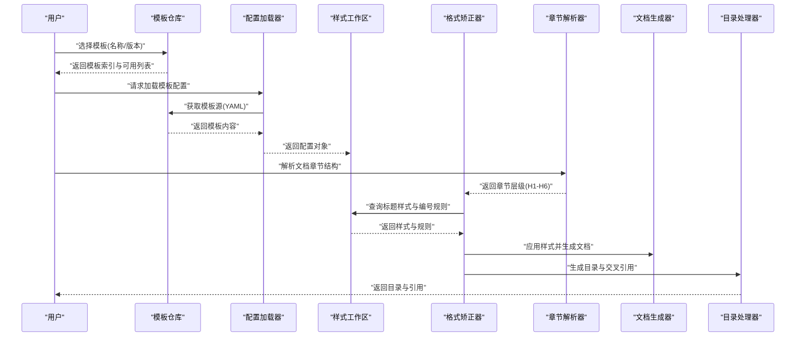
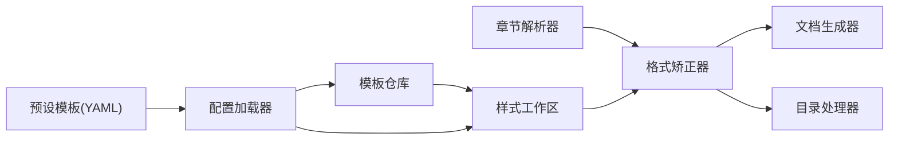

# 标题样式配置

<cite>
**本文引用的文件**   
- [presets/academic_paper.yaml](file://presets/academic_paper.yaml)
- [presets/chinese_thesis.yaml](file://presets/chinese_thesis.yaml)
- [presets/templates_index.yaml](file://presets/templates_index.yaml)
- [src/paper_format_corrector/infrastructure/config/style_config.py](file://src/paper_format_corrector/infrastructure/config/style_config.py)
- [src/paper_format_corrector/core/format_corrector.py](file://src/paper_format_corrector/core/format_corrector.py)
- [src/paper_format_corrector/application/services/style_workbench.py](file://src/paper_format_corrector/application/services/style_workbench.py)
- [src/paper_format_corrector/infra/template_repository.py](file://src/paper_format_corrector/infra/template_repository.py)
- [src/paper_format_corrector/infra/preset_loader.py](file://src/paper_format_corrector/infra/preset_loader.py)
- [src/paper_format_corrector/infrastructure/parsers/section_parser.py](file://src/paper_format_corrector/infrastructure/parsers/section_parser.py)
- [src/paper_format_corrector/infrastructure/parsers/section_types.py](file://src/paper_format_corrector/infrastructure/parsers/section_types.py)
- [src/paper_format_corrector/generators/doc_generator.py](file://src/paper_format_corrector/generators/doc_generator.py)
- [src/paper_format_corrector/handlers/toc_handler.py](file://src/paper_format_corrector/handlers/toc_handler.py)
</cite>

## 目录
1. [简介](#简介)
2. [项目结构](#项目结构)
3. [核心组件](#核心组件)
4. [架构总览](#架构总览)
5. [详细组件分析](#详细组件分析)
6. [依赖关系分析](#依赖关系分析)
7. [性能考虑](#性能考虑)
8. [故障排查指南](#故障排查指南)
9. [结论](#结论)
10. [附录](#附录)

## 简介
本参考文档聚焦于“标题样式配置”，覆盖 H1-H6 各级标题的样式定义与行为，包括：
- 层级结构与编号规则（自动编号、自定义编号）
- 标题格式（字体、字号、颜色、对齐）
- 标题与正文的关系设置（段前/段后间距、悬挂缩进、大纲级别等）
- 不同学术格式标准下的标题样式规范对照表（基于预设模板）

目标是帮助使用者快速理解并正确配置标题样式，以满足各类论文或报告排版要求。

## 项目结构
与标题样式配置相关的代码与资源主要分布在以下位置：
- 预设模板：presets/*.yaml（如 academic_paper.yaml、chinese_thesis.yaml、templates_index.yaml）
- 配置加载与解析：infra/preset_loader.py、infra/template_repository.py
- 样式工作区与应用服务：application/services/style_workbench.py
- 格式矫正核心：core/format_corrector.py
- 章节解析与类型：infrastructure/parsers/section_parser.py、infrastructure/parsers/section_types.py
- 文档生成与目录处理：generators/doc_generator.py、handlers/toc_handler.py

图表来源
- [presets/academic_paper.yaml](file://presets/academic_paper.yaml)
- [presets/chinese_thesis.yaml](file://presets/chinese_thesis.yaml)
- [presets/templates_index.yaml](file://presets/templates_index.yaml)
- [src/paper_format_corrector/infra/preset_loader.py](file://src/paper_format_corrector/infra/preset_loader.py)
- [src/paper_format_corrector/infra/template_repository.py](file://src/paper_format_corrector/infra/template_repository.py)
- [src/paper_format_corrector/application/services/style_workbench.py](file://src/paper_format_corrector/application/services/style_workbench.py)
- [src/paper_format_corrector/core/format_corrector.py](file://src/paper_format_corrector/core/format_corrector.py)
- [src/paper_format_corrector/infrastructure/parsers/section_parser.py](file://src/paper_format_corrector/infrastructure/parsers/section_parser.py)
- [src/paper_format_corrector/infrastructure/parsers/section_types.py](file://src/paper_format_corrector/infrastructure/parsers/section_types.py)
- [src/paper_format_corrector/generators/doc_generator.py](file://src/paper_format_corrector/generators/doc_generator.py)
- [src/paper_format_corrector/handlers/toc_handler.py](file://src/paper_format_corrector/handlers/toc_handler.py)

章节来源
- [presets/academic_paper.yaml](file://presets/academic_paper.yaml)
- [presets/chinese_thesis.yaml](file://presets/chinese_thesis.yaml)
- [presets/templates_index.yaml](file://presets/templates_index.yaml)
- [src/paper_format_corrector/infra/preset_loader.py](file://src/paper_format_corrector/infra/preset_loader.py)
- [src/paper_format_corrector/infra/template_repository.py](file://src/paper_format_corrector/infra/template_repository.py)
- [src/paper_format_corrector/application/services/style_workbench.py](file://src/paper_format_corrector/application/services/style_workbench.py)
- [src/paper_format_corrector/core/format_corrector.py](file://src/paper_format_corrector/core/format_corrector.py)
- [src/paper_format_corrector/infrastructure/parsers/section_parser.py](file://src/paper_format_corrector/infrastructure/parsers/section_parser.py)
- [src/paper_format_corrector/infrastructure/parsers/section_types.py](file://src/paper_format_corrector/infrastructure/parsers/section_types.py)
- [src/paper_format_corrector/generators/doc_generator.py](file://src/paper_format_corrector/generators/doc_generator.py)
- [src/paper_format_corrector/handlers/toc_handler.py](file://src/paper_format_corrector/handlers/toc_handler.py)

## 核心组件
- 预设模板（YAML）：集中定义各学术格式的标题样式与编号规则，便于统一管理与切换。
- 配置加载器：负责读取与合并预设模板，提供统一的配置对象给上层使用。
- 模板仓库：管理模板索引与版本，支持按名称或标识选择具体模板。
- 样式工作区：暴露样式编辑与校验能力，供应用层调用。
- 格式矫正器：将配置应用到文档对象模型，完成标题样式与编号的实际落盘。
- 章节解析器与类型：识别文档中的章节结构，映射到 H1-H6 层级，驱动后续样式应用。
- 文档生成与目录处理器：根据标题层级与编号生成目录与交叉引用。

章节来源
- [src/paper_format_corrector/infra/preset_loader.py](file://src/paper_format_corrector/infra/preset_loader.py)
- [src/paper_format_corrector/infra/template_repository.py](file://src/paper_format_corrector/infra/template_repository.py)
- [src/paper_format_corrector/application/services/style_workbench.py](file://src/paper_format_corrector/application/services/style_workbench.py)
- [src/paper_format_corrector/core/format_corrector.py](file://src/paper_format_corrector/core/format_corrector.py)
- [src/paper_format_corrector/infrastructure/parsers/section_parser.py](file://src/paper_format_corrector/infrastructure/parsers/section_parser.py)
- [src/paper_format_corrector/infrastructure/parsers/section_types.py](file://src/paper_format_corrector/infrastructure/parsers/section_types.py)
- [src/paper_format_corrector/generators/doc_generator.py](file://src/paper_format_corrector/generators/doc_generator.py)
- [src/paper_format_corrector/handlers/toc_handler.py](file://src/paper_format_corrector/handlers/toc_handler.py)

## 架构总览
标题样式配置的端到端流程如下：
- 用户选择或指定模板（如 academic_paper、chinese_thesis）。
- 配置加载器从模板索引中定位并加载对应 YAML 模板。
- 模板仓库提供模板元数据与版本信息。
- 样式工作区对配置进行校验与合并（允许局部覆盖）。
- 格式矫正器读取章节解析结果，依据配置应用标题样式与编号。
- 文档生成器与目录处理器根据最终标题层级与编号输出目录与交叉引用。

图表来源
- [src/paper_format_corrector/infra/template_repository.py](file://src/paper_format_corrector/infra/template_repository.py)
- [src/paper_format_corrector/infra/preset_loader.py](file://src/paper_format_corrector/infra/preset_loader.py)
- [src/paper_format_corrector/application/services/style_workbench.py](file://src/paper_format_corrector/application/services/style_workbench.py)
- [src/paper_format_corrector/core/format_corrector.py](file://src/paper_format_corrector/core/format_corrector.py)
- [src/paper_format_corrector/infrastructure/parsers/section_parser.py](file://src/paper_format_corrector/infrastructure/parsers/section_parser.py)
- [src/paper_format_corrector/generators/doc_generator.py](file://src/paper_format_corrector/generators/doc_generator.py)
- [src/paper_format_corrector/handlers/toc_handler.py](file://src/paper_format_corrector/handlers/toc_handler.py)

## 详细组件分析

### 预设模板（YAML）
- 作用：集中定义标题样式（字体、字号、颜色、对齐）、段落属性（段前/段后间距、悬挂缩进、大纲级别）、编号规则（自动编号、自定义编号序列、起始值、分隔符）。
- 典型字段（概念性说明）：
  - 标题层级：h1-h6
  - 文本格式：font_family、font_size、color、alignment
  - 段落格式：space_before、space_after、indent_first_line、hanging_indent、outline_level
  - 编号规则：numbering_type（auto/custom）、prefix/suffix、start_number、separator、level_sequence
- 示例模板：
  - 学术论文模板：[presets/academic_paper.yaml](file://presets/academic_paper.yaml)
  - 中文学位论文模板：[presets/chinese_thesis.yaml](file://presets/chinese_thesis.yaml)
  - 模板索引：[presets/templates_index.yaml](file://presets/templates_index.yaml)

章节来源
- [presets/academic_paper.yaml](file://presets/academic_paper.yaml)
- [presets/chinese_thesis.yaml](file://presets/chinese_thesis.yaml)
- [presets/templates_index.yaml](file://presets/templates_index.yaml)

### 配置加载器与模板仓库
- 模板仓库：维护模板索引、版本与可用性；支持按名称或标识检索模板。
- 配置加载器：读取模板 YAML，解析为内部配置对象，并提供合并与覆盖能力。
- 关键职责：
  - 模板发现与缓存
  - 配置校验与默认值填充
  - 多模板组合与优先级策略

章节来源
- [src/paper_format_corrector/infra/template_repository.py](file://src/paper_format_corrector/infra/template_repository.py)
- [src/paper_format_corrector/infra/preset_loader.py](file://src/paper_format_corrector/infra/preset_loader.py)

### 样式工作区（Style Workbench）
- 作用：对外暴露样式编辑、校验与查询接口；用于在应用层动态调整标题样式与编号规则。
- 典型能力：
  - 获取某一级标题的完整样式定义
  - 批量更新样式（如统一更改字号或颜色）
  - 校验编号规则一致性（避免冲突或越界）

章节来源
- [src/paper_format_corrector/application/services/style_workbench.py](file://src/paper_format_corrector/application/services/style_workbench.py)

### 格式矫正器（Format Corrector）
- 作用：将样式配置应用到文档对象模型，完成标题样式与编号的最终落盘。
- 输入：
  - 章节解析结果（H1-H6 层级）
  - 样式工作区返回的样式与编号规则
- 输出：
  - 已应用样式的文档对象
  - 生成的目录与交叉引用（交由目录处理器处理）

章节来源
- [src/paper_format_corrector/core/format_corrector.py](file://src/paper_format_corrector/core/format_corrector.py)

### 章节解析器与类型（Section Parser & Types）
- 章节解析器：扫描文档内容，识别标题层级（H1-H6），构建章节树。
- 章节类型：定义层级枚举与属性（如是否包含编号、是否可折叠等）。
- 关键点：
  - 准确识别标题边界与嵌套关系
  - 兼容多种文档格式（docx/pdf 等）
  - 提供稳定的层级映射给格式矫正器

章节来源
- [src/paper_format_corrector/infrastructure/parsers/section_parser.py](file://src/paper_format_corrector/infrastructure/parsers/section_parser.py)
- [src/paper_format_corrector/infrastructure/parsers/section_types.py](file://src/paper_format_corrector/infrastructure/parsers/section_types.py)

### 文档生成器与目录处理器
- 文档生成器：根据样式配置生成文档结构，确保标题层级与编号一致。
- 目录处理器：基于标题层级与编号生成目录条目，支持多级目录与交叉引用。

章节来源
- [src/paper_format_corrector/generators/doc_generator.py](file://src/paper_format_corrector/generators/doc_generator.py)
- [src/paper_format_corrector/handlers/toc_handler.py](file://src/paper_format_corrector/handlers/toc_handler.py)

### 标题样式配置项详解（概念性说明）
以下为标题样式配置的关键维度与常见取值范围，便于理解与定制：
- 层级结构
  - h1-h6：表示标题深度，影响目录层级与编号序列
- 文本格式
  - font_family：字体族（如宋体、Times New Roman）
  - font_size：字号（pt 单位）
  - color：颜色（十六进制或命名色）
  - alignment：对齐方式（左对齐、居中、右对齐、两端对齐）
- 段落格式
  - space_before / space_after：段前/段后间距（pt）
  - indent_first_line：首行缩进（pt 或字符数）
  - hanging_indent：悬挂缩进（用于编号悬挂）
  - outline_level：大纲级别（与目录层级对应）
- 编号规则
  - numbering_type：auto（自动）/ custom（自定义）
  - prefix / suffix：前后缀（如“第”、“章”、“.”）
  - start_number：起始编号
  - separator：分隔符（如“.”、“-”、“ ”）
  - level_sequence：层级序列（如“1, a, i”）

注意：以上为通用配置维度的概念性说明，具体字段名与取值以实际模板 YAML 为准。

## 依赖关系分析
标题样式配置涉及的模块依赖关系如下：
- 预设模板 → 配置加载器 → 模板仓库
- 样式工作区 ← 配置加载器/模板仓库
- 格式矫正器 ← 样式工作区 + 章节解析器
- 文档生成器 ← 格式矫正器
- 目录处理器 ← 格式矫正器

图表来源
- [src/paper_format_corrector/infra/preset_loader.py](file://src/paper_format_corrector/infra/preset_loader.py)
- [src/paper_format_corrector/infra/template_repository.py](file://src/paper_format_corrector/infra/template_repository.py)
- [src/paper_format_corrector/application/services/style_workbench.py](file://src/paper_format_corrector/application/services/style_workbench.py)
- [src/paper_format_corrector/core/format_corrector.py](file://src/paper_format_corrector/core/format_corrector.py)
- [src/paper_format_corrector/infrastructure/parsers/section_parser.py](file://src/paper_format_corrector/infrastructure/parsers/section_parser.py)
- [src/paper_format_corrector/generators/doc_generator.py](file://src/paper_format_corrector/generators/doc_generator.py)
- [src/paper_format_corrector/handlers/toc_handler.py](file://src/paper_format_corrector/handlers/toc_handler.py)

章节来源
- [src/paper_format_corrector/infra/preset_loader.py](file://src/paper_format_corrector/infra/preset_loader.py)
- [src/paper_format_corrector/infra/template_repository.py](file://src/paper_format_corrector/infra/template_repository.py)
- [src/paper_format_corrector/application/services/style_workbench.py](file://src/paper_format_corrector/application/services/style_workbench.py)
- [src/paper_format_corrector/core/format_corrector.py](file://src/paper_format_corrector/core/format_corrector.py)
- [src/paper_format_corrector/infrastructure/parsers/section_parser.py](file://src/paper_format_corrector/infrastructure/parsers/section_parser.py)
- [src/paper_format_corrector/generators/doc_generator.py](file://src/paper_format_corrector/generators/doc_generator.py)
- [src/paper_format_corrector/handlers/toc_handler.py](file://src/paper_format_corrector/handlers/toc_handler.py)

## 性能考虑
- 模板缓存：建议对模板 YAML 与解析后的配置对象进行缓存，减少重复 IO 与解析开销。
- 增量应用：仅对变更的标题层级重新应用样式，避免全量重算。
- 并行处理：在大型文档中，可对不同章节块并行应用样式（需保证线程安全）。
- 内存优化：避免一次性加载超大文档的全部节点，采用流式或分块处理。

## 故障排查指南
常见问题与定位方法：
- 模板未找到或索引错误
  - 检查模板仓库索引是否正确注册模板名称与路径
  - 确认模板 YAML 语法有效且字段齐全
- 编号不连续或层级错乱
  - 核对章节解析结果是否正确识别 H1-H6
  - 检查编号规则中的 level_sequence 与 start_number 设置
- 样式未生效
  - 确认样式工作区返回的配置是否被格式矫正器正确消费
  - 验证段落属性（如 outline_level）是否与目录层级匹配
- 目录生成异常
  - 检查目录处理器是否接收到正确的标题层级与编号
  - 确认文档生成器输出的标题结构符合预期

章节来源
- [src/paper_format_corrector/infra/template_repository.py](file://src/paper_format_corrector/infra/template_repository.py)
- [src/paper_format_corrector/infra/preset_loader.py](file://src/paper_format_corrector/infra/preset_loader.py)
- [src/paper_format_corrector/application/services/style_workbench.py](file://src/paper_format_corrector/application/services/style_workbench.py)
- [src/paper_format_corrector/core/format_corrector.py](file://src/paper_format_corrector/core/format_corrector.py)
- [src/paper_format_corrector/infrastructure/parsers/section_parser.py](file://src/paper_format_corrector/infrastructure/parsers/section_parser.py)
- [src/paper_format_corrector/generators/doc_generator.py](file://src/paper_format_corrector/generators/doc_generator.py)
- [src/paper_format_corrector/handlers/toc_handler.py](file://src/paper_format_corrector/handlers/toc_handler.py)

## 结论
通过预设模板与配置加载机制，系统实现了灵活的标题样式配置与编号规则管理。结合章节解析、样式工作区与格式矫正器，能够稳定地将样式应用到文档对象模型，并生成一致的目录与交叉引用。建议在实际使用中优先选择合适的预设模板，再按需微调样式与编号规则，以获得最佳排版效果。

## 附录

### 不同学术格式标准下的标题样式规范对照表（概念性说明）
以下为常见学术格式在标题样式上的典型差异点（概念性说明，具体以模板 YAML 为准）：
- 编号风格
  - APA：数字层级（1.0, 1.1, 1.1.1）
  - IEEE：罗马数字与大写英文字母混合（I, A, 1, a）
  - GB/T 7714：中文常用“一、”“（一）”“1.”“（1）”
  - 中文学位论文：学校特定规范（如“第一章”“1.1”“1.1.1”）
- 字体与字号
  - 英文论文：Times New Roman，小四至三号不等
  - 中文论文：宋体/黑体，三号至小二不等
- 对齐方式
  - 多数格式：居中对齐或左对齐
  - 部分期刊：两端对齐
- 段落间距
  - 段前/段后间距通常为 0-12 pt
  - 首行缩进：中文常用 2 字符，英文通常无缩进
- 大纲级别
  - 与目录层级严格对应，H1 对应一级目录，依此类推

提示：如需精确数值与字段名，请查阅对应模板 YAML 的具体定义。