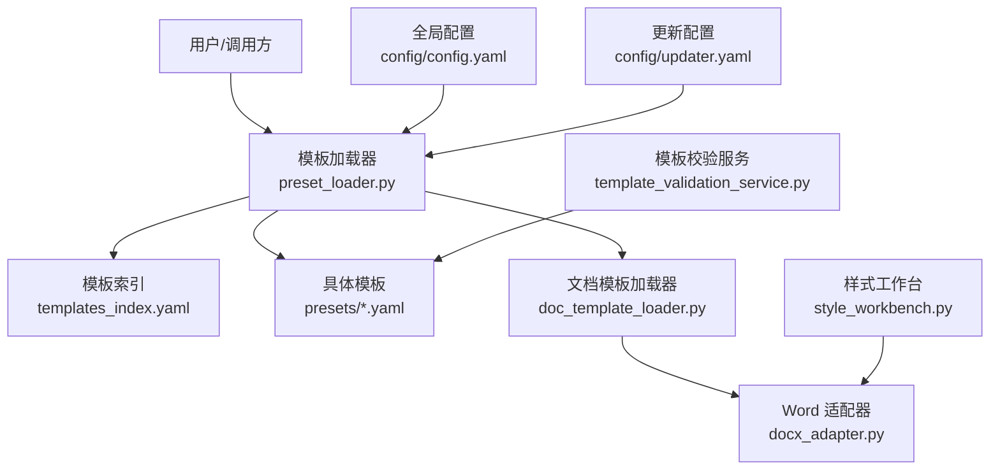
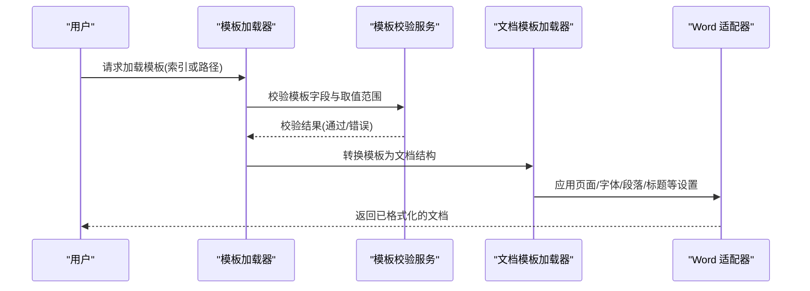
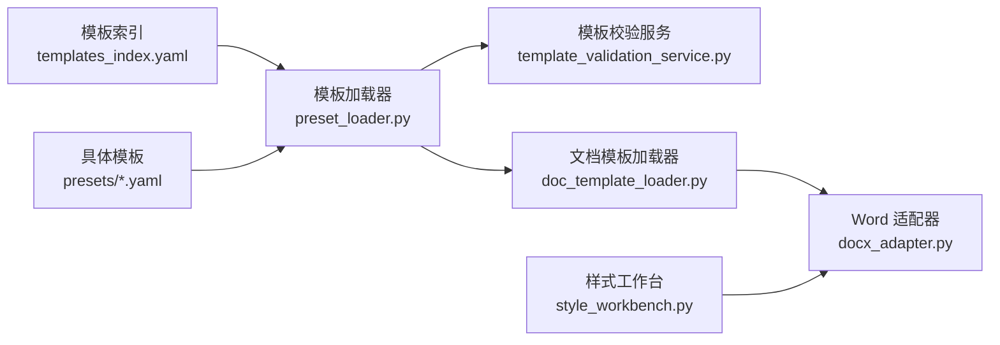

# 核心配置项

<cite>
**本文引用的文件**   
- [config.yaml](file://config/config.yaml)
- [updater.yaml](file://config/updater.yaml)
- [academic_paper.yaml](file://presets/academic_paper.yaml)
- [business_plan.yaml](file://presets/business_plan.yaml)
- [contract.yaml](file://presets/contract.yaml)
- [meeting_minutes.yaml](file://presets/meeting_minutes.yaml)
- [official_doc.yaml](file://presets/official_doc.yaml)
- [report.yaml](file://presets/report.yaml)
- [templates_index.yaml](file://presets/templates_index.yaml)
- [docx_adapter.py](file://src/paper_format_corrector/infrastructure/adapters/docx_adapter.py)
- [template_validation_service.py](file://src/paper_format_corrector/application/services/template_validation_service.py)
- [preset_loader.py](file://src/paper_format_corrector/infra/preset_loader.py)
- [doc_template_loader.py](file://src/paper_format_corrector/infra/doc_template_loader.py)
- [style_workbench.py](file://src/paper_format_corrector/application/services/style_workbench.py)
- [sample_template.yaml](file://examples/sample_template.yaml)
</cite>

## 目录
1. [简介](#简介)
2. [项目结构](#项目结构)
3. [核心组件](#核心组件)
4. [架构总览](#架构总览)
5. [详细组件分析](#详细组件分析)
6. [依赖关系分析](#依赖关系分析)
7. [性能考虑](#性能考虑)
8. [故障排查指南](#故障排查指南)
9. [结论](#结论)
10. [附录](#附录)

## 简介
本参考文档聚焦于“模板核心配置项”，系统化说明与页面设置、字体样式、段落格式、标题层级、引用格式等相关的配置字段，包括字段名称、数据类型、默认值、取值范围与实际使用示例。文档面向不同技术背景的读者，既提供高层概览，也给出代码级映射与可视化图示，帮助快速定位并正确使用模板配置。

## 项目结构
与模板核心配置相关的资源主要分布在以下位置：
- 全局配置与更新配置：config/config.yaml、config/updater.yaml
- 预设模板集合：presets/*.yaml（包含多种场景的模板定义）
- 模板加载与校验：infra/preset_loader.py、application/services/template_validation_service.py、infra/doc_template_loader.py
- 文档生成适配层：infrastructure/adapters/docx_adapter.py
- 样式工作台：application/services/style_workbench.py
- 示例模板：examples/sample_template.yaml

图表来源
- [preset_loader.py](file://src/paper_format_corrector/infra/preset_loader.py)
- [templates_index.yaml](file://presets/templates_index.yaml)
- [doc_template_loader.py](file://src/paper_format_corrector/infra/doc_template_loader.py)
- [docx_adapter.py](file://src/paper_format_corrector/infrastructure/adapters/docx_adapter.py)
- [style_workbench.py](file://src/paper_format_corrector/application/services/style_workbench.py)
- [template_validation_service.py](file://src/paper_format_corrector/application/services/template_validation_service.py)
- [config.yaml](file://config/config.yaml)
- [updater.yaml](file://config/updater.yaml)

章节来源
- [config.yaml](file://config/config.yaml)
- [updater.yaml](file://config/updater.yaml)
- [templates_index.yaml](file://presets/templates_index.yaml)
- [preset_loader.py](file://src/paper_format_corrector/infra/preset_loader.py)
- [doc_template_loader.py](file://src/paper_format_corrector/infra/doc_template_loader.py)
- [docx_adapter.py](file://src/paper_format_corrector/infrastructure/adapters/docx_adapter.py)
- [style_workbench.py](file://src/paper_format_corrector/application/services/style_workbench.py)
- [template_validation_service.py](file://src/paper_format_corrector/application/services/template_validation_service.py)

## 核心组件
- 模板加载器：负责解析模板索引与具体模板 YAML，合并默认值与覆盖项，输出标准化模板对象供后续处理。
- 文档模板加载器：将模板对象转换为 Word 文档可识别的结构，驱动底层 docx 操作。
- 文档适配器：封装对 python-docx 的调用，执行页边距、纸张大小、方向、字体、段落、标题等写入。
- 样式工作台：提供样式查询、覆盖与批量应用的能力，便于在运行时调整模板效果。
- 模板校验服务：对模板字段进行类型、范围与一致性校验，确保模板可用性与稳定性。

章节来源
- [preset_loader.py](file://src/paper_format_corrector/infra/preset_loader.py)
- [doc_template_loader.py](file://src/paper_format_corrector/infra/doc_template_loader.py)
- [docx_adapter.py](file://src/paper_format_corrector/infrastructure/adapters/docx_adapter.py)
- [style_workbench.py](file://src/paper_format_corrector/application/services/style_workbench.py)
- [template_validation_service.py](file://src/paper_format_corrector/application/services/template_validation_service.py)

## 架构总览
下图展示从模板 YAML 到 Word 文档的关键流程，以及各组件的职责边界。

图表来源
- [preset_loader.py](file://src/paper_format_corrector/infra/preset_loader.py)
- [template_validation_service.py](file://src/paper_format_corrector/application/services/template_validation_service.py)
- [doc_template_loader.py](file://src/paper_format_corrector/infra/doc_template_loader.py)
- [docx_adapter.py](file://src/paper_format_corrector/infrastructure/adapters/docx_adapter.py)

## 详细组件分析

### 页面设置（纸张大小、页边距、方向）
- 字段名称
  - page_size: 字符串，如 "A4"、"Letter"
  - orientation: 枚举，"portrait" 或 "landscape"
  - margins: 对象，包含 top、bottom、left、right（数值，单位通常为毫米或英寸，取决于实现）
- 数据类型
  - page_size: string
  - orientation: enum
  - margins: object {top: number, bottom: number, left: number, right: number}
- 默认值
  - page_size: "A4"
  - orientation: "portrait"
  - margins: top=25mm, bottom=25mm, left=31.8mm, right=31.8mm（常见中文论文默认）
- 取值范围
  - page_size: 支持 ISO A 系列与北美 Letter/Legal 等
  - orientation: portrait | landscape
  - margins: 正数；最小值受打印机限制；最大值不超过纸张尺寸
- 实际使用示例
  - 在模板 YAML 中指定 page_size 与 margins，并在运行前由模板校验服务验证其合法性
  - 通过样式工作台动态覆盖页面设置以适配特定打印需求

章节来源
- [docx_adapter.py](file://src/paper_format_corrector/infrastructure/adapters/docx_adapter.py)
- [template_validation_service.py](file://src/paper_format_corrector/application/services/template_validation_service.py)
- [academic_paper.yaml](file://presets/academic_paper.yaml)
- [official_doc.yaml](file://presets/official_doc.yaml)

### 字体样式（中文字体、英文字体、字号、颜色）
- 字段名称
  - font_family_cjk: 字符串，如 "宋体"、"仿宋"、"黑体"
  - font_family_latin: 字符串，如 "Times New Roman"、"Arial"
  - font_size: 数值，单位为 pt（点），如 12、14
  - font_color: 字符串，十六进制色值，如 "#000000"
- 数据类型
  - font_family_cjk: string
  - font_family_latin: string
  - font_size: number (pt)
  - font_color: string (hex color)
- 默认值
  - font_family_cjk: "宋体"
  - font_family_latin: "Times New Roman"
  - font_size: 12
  - font_color: "#000000"
- 取值范围
  - font_family_cjk/font_family_latin: 系统可用字体名
  - font_size: 通常 6–72 pt（受 Word 限制）
  - font_color: 标准十六进制颜色
- 实际使用示例
  - 在模板中统一设置正文与标题字体族与字号，保证中英文混排一致
  - 通过样式工作台按段落或标题级别覆盖字体属性

章节来源
- [docx_adapter.py](file://src/paper_format_corrector/infrastructure/adapters/docx_adapter.py)
- [style_workbench.py](file://src/paper_format_corrector/application/services/style_workbench.py)
- [academic_paper.yaml](file://presets/academic_paper.yaml)
- [business_plan.yaml](file://presets/business_plan.yaml)

### 段落格式（行距、缩进、对齐方式）
- 字段名称
  - line_spacing: 数值或枚举，如 1.5 或 "1.5_lines"
  - first_line_indent: 数值，首行缩进（pt 或 mm）
  - alignment: 枚举，"left"、"center"、"right"、"justify"
  - space_before / space_after: 数值，段前/段后间距（pt 或 mm）
- 数据类型
  - line_spacing: number | enum
  - first_line_indent: number
  - alignment: enum
  - space_before: number
  - space_after: number
- 默认值
  - line_spacing: 1.5
  - first_line_indent: 28.35pt（约 1cm）
  - alignment: "left"
  - space_before: 0
  - space_after: 0
- 取值范围
  - line_spacing: 单倍至多倍（如 1.0–3.0）
  - first_line_indent: 非负数
  - alignment: 四值之一
  - space_before/space_after: 非负数
- 实际使用示例
  - 在模板中为正文段落设置固定行距与首行缩进，提升可读性
  - 针对摘要、参考文献等特殊段落调整对齐与前后间距

章节来源
- [docx_adapter.py](file://src/paper_format_corrector/infrastructure/adapters/docx_adapter.py)
- [style_workbench.py](file://src/paper_format_corrector/application/services/style_workbench.py)
- [report.yaml](file://presets/report.yaml)
- [meeting_minutes.yaml](file://presets/meeting_minutes.yaml)

### 标题层级（H1–H6 的样式定义）
- 字段名称
  - heading_styles: 对象，键为 "h1"–"h6"，值为样式对象
  - 每个样式对象包含：font_family_cjk、font_family_latin、font_size、font_color、alignment、line_spacing、space_before、space_after、outline_level（可选）
- 数据类型
  - heading_styles: object {"h1": Style, ..., "h6": Style}
  - Style: object（同字体与段落字段）
- 默认值
  - h1: 较大字号（如 16–22pt）、加粗、居中或左对齐、较大段前间距
  - h2–h6: 逐级递减字号与间距
- 取值范围
  - 字号与间距遵循通用范围；outline_level 对应 1–6
- 实际使用示例
  - 在模板中为各级标题定义统一的视觉风格，确保文档层次清晰
  - 通过样式工作台按需覆盖某一级标题的字体或对齐

章节来源
- [docx_adapter.py](file://src/paper_format_corrector/infrastructure/adapters/docx_adapter.py)
- [style_workbench.py](file://src/paper_format_corrector/application/services/style_workbench.py)
- [academic_paper.yaml](file://presets/academic_paper.yaml)
- [contract.yaml](file://presets/contract.yaml)

### 引用格式
- 字段名称
  - citation_style: 字符串，如 "GB/T 7714"、"APA"、"MLA"、"Chicago"
  - citation_numbering: 枚举，"numeric" 或 "author_year"
  - citation_alignment: 枚举，"left"、"center"、"right"、"justify"
  - citation_font: 对象，包含 font_family_cjk、font_family_latin、font_size、font_color
  - citation_spacing: 对象，包含 line_spacing、space_before、space_after
- 数据类型
  - citation_style: string
  - citation_numbering: enum
  - citation_alignment: enum
  - citation_font: object
  - citation_spacing: object
- 默认值
  - citation_style: "GB/T 7714"
  - citation_numbering: "numeric"
  - citation_alignment: "left"
  - citation_font: 与正文一致
  - citation_spacing: 与正文一致
- 取值范围
  - citation_style: 支持的引文样式列表
  - citation_numbering: numeric | author_year
  - 其他字段遵循通用范围
- 实际使用示例
  - 在模板中指定 GB/T 7714 与数字编号，适用于国内学术规范
  - 通过样式工作台为参考文献段落统一设置字体与行距

章节来源
- [docx_adapter.py](file://src/paper_format_corrector/infrastructure/adapters/docx_adapter.py)
- [style_workbench.py](file://src/paper_format_corrector/application/services/style_workbench.py)
- [academic_paper.yaml](file://presets/academic_paper.yaml)
- [business_plan.yaml](file://presets/business_plan.yaml)

### 模板索引与模板选择
- 字段名称
  - templates_index: 数组，每项包含 name、path、description、tags
- 数据类型
  - templates_index: array of objects
- 默认值
  - 内置若干常用模板条目（如学术论文、商业计划、合同、会议纪要、公文、报告）
- 取值范围
  - path 指向 presets/*.yaml 或自定义模板路径
- 实际使用示例
  - 在模板索引中添加新模板，便于在界面或 CLI 中选择
  - 通过标签 tags 进行分类检索

章节来源
- [templates_index.yaml](file://presets/templates_index.yaml)
- [preset_loader.py](file://src/paper_format_corrector/infra/preset_loader.py)

### 示例模板结构
- 字段名称
  - metadata: 对象，包含 title、author、date、version 等
  - sections: 数组，描述文档结构与顺序
  - styles: 对象，包含页面、字体、段落、标题、引用等样式定义
- 数据类型
  - metadata: object
  - sections: array of objects
  - styles: object
- 默认值
  - 根据模板类别（如学术论文）提供合理默认
- 取值范围
  - 遵循各子对象的约束
- 实际使用示例
  - 参考 examples/sample_template.yaml 的结构组织自定义模板

章节来源
- [sample_template.yaml](file://examples/sample_template.yaml)
- [preset_loader.py](file://src/paper_format_corrector/infra/preset_loader.py)

## 依赖关系分析
- 模板加载器依赖模板索引与具体模板 YAML，输出标准化模板对象
- 模板校验服务依赖模板字段定义与取值范围规则
- 文档模板加载器依赖模板对象与 Word 适配器
- Word 适配器依赖 python-docx 接口完成最终文档写入

图表来源
- [templates_index.yaml](file://presets/templates_index.yaml)
- [preset_loader.py](file://src/paper_format_corrector/infra/preset_loader.py)
- [template_validation_service.py](file://src/paper_format_corrector/application/services/template_validation_service.py)
- [doc_template_loader.py](file://src/paper_format_corrector/infra/doc_template_loader.py)
- [docx_adapter.py](file://src/paper_format_corrector/infrastructure/adapters/docx_adapter.py)
- [style_workbench.py](file://src/paper_format_corrector/application/services/style_workbench.py)

章节来源
- [preset_loader.py](file://src/paper_format_corrector/infra/preset_loader.py)
- [template_validation_service.py](file://src/paper_format_corrector/application/services/template_validation_service.py)
- [doc_template_loader.py](file://src/paper_format_corrector/infra/doc_template_loader.py)
- [docx_adapter.py](file://src/paper_format_corrector/infrastructure/adapters/docx_adapter.py)
- [style_workbench.py](file://src/paper_format_corrector/application/services/style_workbench.py)
- [templates_index.yaml](file://presets/templates_index.yaml)

## 性能考虑
- 模板加载与校验应在启动阶段完成，避免重复解析
- 大量段落样式应用时，建议批量设置以减少 IO 开销
- 字体与颜色应缓存，避免重复查找与转换
- 对于大文档，优先使用样式表而非逐元素设置

[本节为通用指导，不直接分析具体文件]

## 故障排查指南
- 模板字段缺失或类型错误：检查模板 YAML 是否包含必需字段，并确保类型正确
- 取值范围越界：确认页边距、字号、行距等在合理范围内
- 字体不可用：确认系统中存在指定的中/英字体名
- 引文样式不支持：检查 citation_style 是否在支持列表中
- 模板索引无效：确认 templates_index.yaml 中的 path 指向有效模板文件

章节来源
- [template_validation_service.py](file://src/paper_format_corrector/application/services/template_validation_service.py)
- [preset_loader.py](file://src/paper_format_corrector/infra/preset_loader.py)
- [templates_index.yaml](file://presets/templates_index.yaml)

## 结论
通过对模板核心配置项的系统梳理与代码级映射，本文提供了页面设置、字体样式、段落格式、标题层级与引用格式的完整参考。结合模板加载、校验与适配流程，读者可以快速构建与定制符合规范的文档模板，并在运行时灵活调整样式以满足多样化需求。

## 附录
- 相关配置文件与模板清单
  - 全局配置：config/config.yaml、config/updater.yaml
  - 预设模板：presets/academic_paper.yaml、presets/business_plan.yaml、presets/contract.yaml、presets/meeting_minutes.yaml、presets/official_doc.yaml、presets/report.yaml
  - 模板索引：presets/templates_index.yaml
  - 示例模板：examples/sample_template.yaml

章节来源
- [config.yaml](file://config/config.yaml)
- [updater.yaml](file://config/updater.yaml)
- [academic_paper.yaml](file://presets/academic_paper.yaml)
- [business_plan.yaml](file://presets/business_plan.yaml)
- [contract.yaml](file://presets/contract.yaml)
- [meeting_minutes.yaml](file://presets/meeting_minutes.yaml)
- [official_doc.yaml](file://presets/official_doc.yaml)
- [report.yaml](file://presets/report.yaml)
- [templates_index.yaml](file://presets/templates_index.yaml)
- [sample_template.yaml](file://examples/sample_template.yaml)