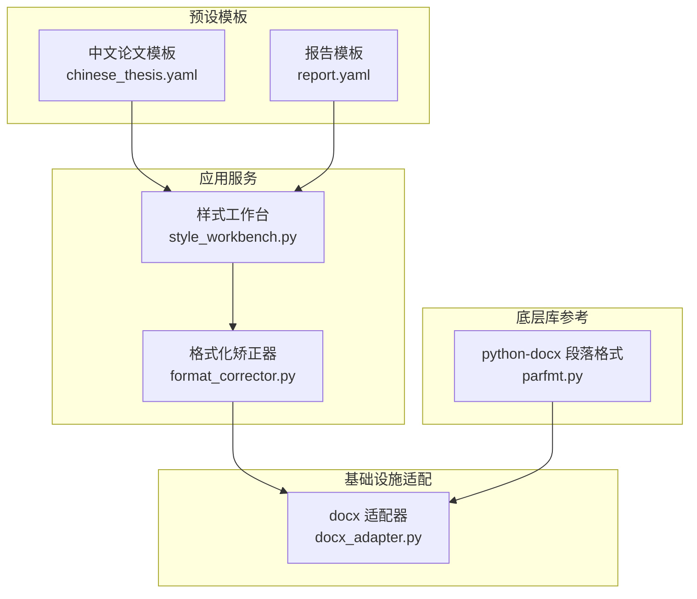
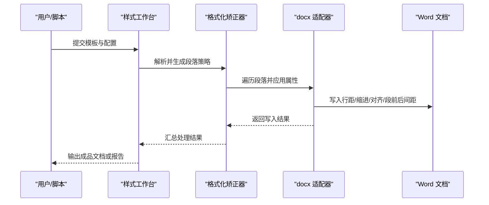
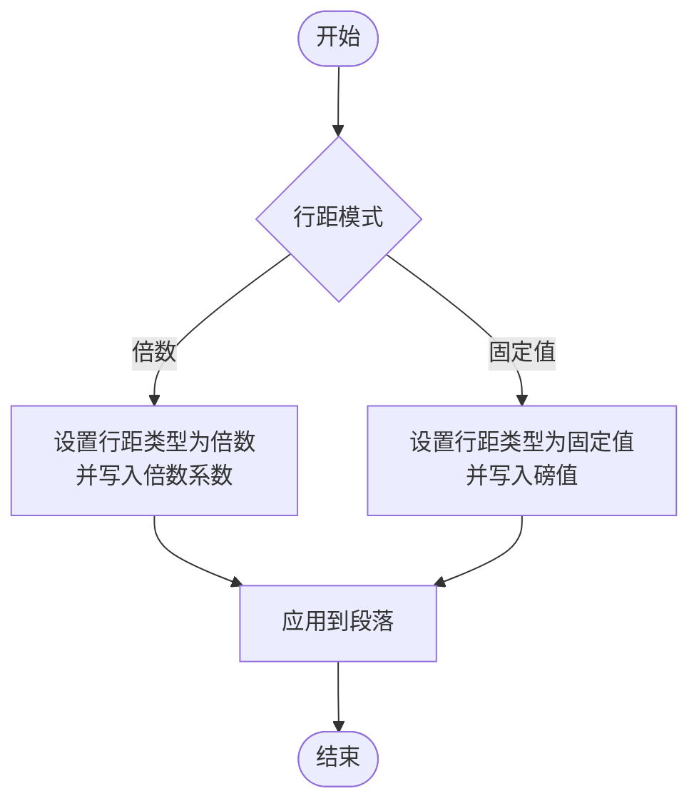
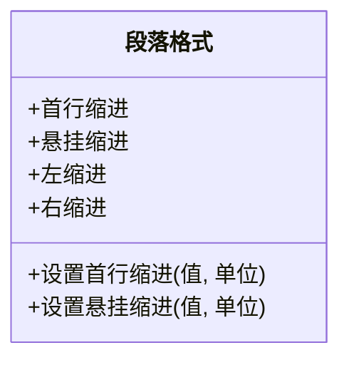
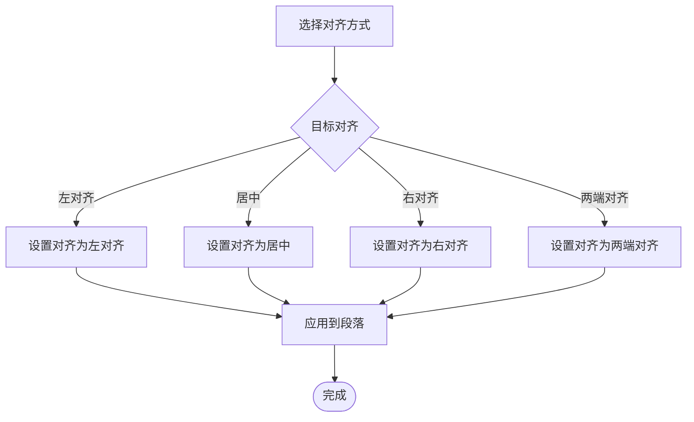
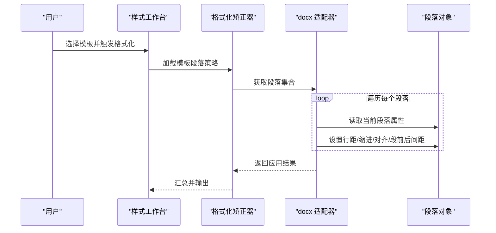
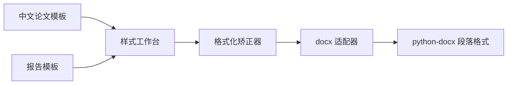

# 段落格式配置

<cite>
**本文引用的文件**   
- [src/paper_format_corrector/infrastructure/adapters/docx_adapter.py](file://src/paper_format_corrector/infrastructure/adapters/docx_adapter.py)
- [src/paper_format_corrector/core/format_corrector.py](file://src/paper_format_corrector/core/format_corrector.py)
- [src/paper_format_corrector/application/services/style_workbench.py](file://src/paper_format_corrector/application/services/style_workbench.py)
- [presets/chinese_thesis.yaml](file://presets/chinese_thesis.yaml)
- [presets/report.yaml](file://presets/report.yaml)
- [cankao/python-docx/src/docx/text/parfmt.py](file://cankao/python-docx/src/docx/text/parfmt.py)
- [cankao/python-docx/features/steps/par-alignment-prop.feature](file://cankao/python-docx/features/steps/par-alignment-prop.feature)
</cite>

## 目录
1. [简介](#简介)
2. [项目结构](#项目结构)
3. [核心组件](#核心组件)
4. [架构总览](#架构总览)
5. [详细组件分析](#详细组件分析)
6. [依赖关系分析](#依赖关系分析)
7. [性能考虑](#性能考虑)
8. [故障排查指南](#故障排查指南)
9. [结论](#结论)
10. [附录](#附录)

## 简介
本文件聚焦于“段落格式配置”的完整说明，覆盖行距设置（单倍、1.5倍、双倍）、段落缩进（首行缩进、悬挂缩进）、对齐方式（左对齐、居中、右对齐、两端对齐）、段前段后间距等关键属性。文档同时给出学术论文与商业报告两类典型场景的最佳实践建议，帮助读者快速落地规范一致的排版效果。

## 项目结构
围绕段落格式的配置与应用，本项目采用分层设计：
- 应用服务层：编排样式工作流、模板校验与批量处理
- 核心层：格式化矫正流程、导出器与生成器
- 基础设施适配层：对 Word 文档对象模型进行读写封装
- 预设模板层：不同文档类型的默认段落参数集合

图表来源
- [src/paper_format_corrector/application/services/style_workbench.py](file://src/paper_format_corrector/application/services/style_workbench.py)
- [src/paper_format_corrector/core/format_corrector.py](file://src/paper_format_corrector/core/format_corrector.py)
- [src/paper_format_corrector/infrastructure/adapters/docx_adapter.py](file://src/paper_format_corrector/infrastructure/adapters/docx_adapter.py)
- [presets/chinese_thesis.yaml](file://presets/chinese_thesis.yaml)
- [presets/report.yaml](file://presets/report.yaml)
- [cankao/python-docx/src/docx/text/parfmt.py](file://cankao/python-docx/src/docx/text/parfmt.py)

章节来源
- [src/paper_format_corrector/application/services/style_workbench.py](file://src/paper_format_corrector/application/services/style_workbench.py)
- [src/paper_format_corrector/core/format_corrector.py](file://src/paper_format_corrector/core/format_corrector.py)
- [src/paper_format_corrector/infrastructure/adapters/docx_adapter.py](file://src/paper_format_corrector/infrastructure/adapters/docx_adapter.py)
- [presets/chinese_thesis.yaml](file://presets/chinese_thesis.yaml)
- [presets/report.yaml](file://presets/report.yaml)
- [cankao/python-docx/src/docx/text/parfmt.py](file://cankao/python-docx/src/docx/text/parfmt.py)

## 核心组件
- 样式工作台（应用服务）
  - 职责：加载预设模板、合并用户配置、编排段落格式策略、驱动批量处理
  - 输入：模板 YAML、用户自定义配置、目标文档集合
  - 输出：已应用段落样式的文档或变更清单
- 格式化矫正器（核心）
  - 职责：将高层配置转换为具体段落属性值，协调各子处理器执行
  - 关注点：行距、缩进、对齐、段前段后间距的统一计算与写入
- docx 适配器（基础设施）
  - 职责：基于 python-docx 对段落对象进行读取与写入，屏蔽底层 XML 细节
  - 能力：设置行距、缩进、对齐、段前后间距等

章节来源
- [src/paper_format_corrector/application/services/style_workbench.py](file://src/paper_format_corrector/application/services/style_workbench.py)
- [src/paper_format_corrector/core/format_corrector.py](file://src/paper_format_corrector/core/format_corrector.py)
- [src/paper_format_corrector/infrastructure/adapters/docx_adapter.py](file://src/paper_format_corrector/infrastructure/adapters/docx_adapter.py)

## 架构总览
段落格式从“配置到生效”的典型调用链如下：

图表来源
- [src/paper_format_corrector/application/services/style_workbench.py](file://src/paper_format_corrector/application/services/style_workbench.py)
- [src/paper_format_corrector/core/format_corrector.py](file://src/paper_format_corrector/core/format_corrector.py)
- [src/paper_format_corrector/infrastructure/adapters/docx_adapter.py](file://src/paper_format_corrector/infrastructure/adapters/docx_adapter.py)

## 详细组件分析

### 段落属性与配置项
- 行距
  - 支持倍数型（如单倍、1.5倍、双倍）与固定值型两种模式
  - 在模板中通常以“倍数”或“固定值”字段表达；系统会按当前字体大小换算为实际值
- 段落缩进
  - 首行缩进：常用于正文段落，提升可读性
  - 悬挂缩进：常用于参考文献、列表条目，保持视觉对齐
- 对齐方式
  - 左对齐、居中、右对齐、两端对齐
  - 两端对齐在长段落中更利于版面整洁，但需避免过窄列宽导致断行异常
- 段前段后间距
  - 控制段落之间的呼吸感，影响阅读节奏与分页稳定性

章节来源
- [src/paper_format_corrector/infrastructure/adapters/docx_adapter.py](file://src/paper_format_corrector/infrastructure/adapters/docx_adapter.py)
- [cankao/python-docx/src/docx/text/parfmt.py](file://cankao/python-docx/src/docx/text/parfmt.py)

### 行距设置实现要点
- 倍数型行距
  - 通过段落格式对象的行距类型设置为“倍数”，并传入倍数系数
  - 适用于大多数正文、标题等通用段落
- 固定值行距
  - 通过段落格式对象的行距类型设置为“固定值”，并传入精确磅值
  - 适用于需要严格控制的表格内文本、脚注、注释等
- 单位换算
  - 当配置以“行高倍数”表达时，系统会根据当前字号与行距规则换算为最终值

图表来源
- [src/paper_format_corrector/infrastructure/adapters/docx_adapter.py](file://src/paper_format_corrector/infrastructure/adapters/docx_adapter.py)
- [cankao/python-docx/src/docx/text/parfmt.py](file://cankao/python-docx/src/docx/text/parfmt.py)

章节来源
- [src/paper_format_corrector/infrastructure/adapters/docx_adapter.py](file://src/paper_format_corrector/infrastructure/adapters/docx_adapter.py)
- [cankao/python-docx/src/docx/text/parfmt.py](file://cankao/python-docx/src/docx/text/parfmt.py)

### 段落缩进实现要点
- 首行缩进
  - 使用段落格式的首行缩进属性，单位为字符或磅值
  - 中文正文常用“两个字符”作为标准首行缩进
- 悬挂缩进
  - 使用段落格式的悬挂缩进属性，使除首行外的其余行统一缩进
  - 适合参考文献、编号列表等场景

图表来源
- [src/paper_format_corrector/infrastructure/adapters/docx_adapter.py](file://src/paper_format_corrector/infrastructure/adapters/docx_adapter.py)
- [cankao/python-docx/src/docx/text/parfmt.py](file://cankao/python-docx/src/docx/text/parfmt.py)

章节来源
- [src/paper_format_corrector/infrastructure/adapters/docx_adapter.py](file://src/paper_format_corrector/infrastructure/adapters/docx_adapter.py)
- [cankao/python-docx/src/docx/text/parfmt.py](file://cankao/python-docx/src/docx/text/parfmt.py)

### 对齐方式实现要点
- 支持的枚举值包括：左对齐、居中、右对齐、两端对齐
- 在 python-docx 中通过段落对齐属性设置，对应不同的对齐常量

图表来源
- [cankao/python-docx/features/steps/par-alignment-prop.feature](file://cankao/python-docx/features/steps/par-alignment-prop.feature)
- [cankao/python-docx/src/docx/text/parfmt.py](file://cankao/python-docx/src/docx/text/parfmt.py)

章节来源
- [cankao/python-docx/features/steps/par-alignment-prop.feature](file://cankao/python-docx/features/steps/par-alalignment-prop.feature)
- [cankao/python-docx/src/docx/text/parfmt.py](file://cankao/python-docx/src/docx/text/parfmt.py)

### 段前段后间距实现要点
- 段前间距：当前段落与上一段落的垂直距离
- 段后间距：当前段落与下一段落的垂直距离
- 建议与行距保持一致的单位体系（磅值或行高倍数），避免混用造成不可预期布局

章节来源
- [src/paper_format_corrector/infrastructure/adapters/docx_adapter.py](file://src/paper_format_corrector/infrastructure/adapters/docx_adapter.py)
- [cankao/python-docx/src/docx/text/parfmt.py](file://cankao/python-docx/src/docx/text/parfmt.py)

### 模板与最佳实践

#### 学术论文（中文学位论文/期刊）
- 行距
  - 正文：1.5倍行距或固定值（根据学校/期刊要求）
  - 标题：单倍行距，必要时增加段后间距以突出层级
- 缩进
  - 正文：首行缩进两个字符
  - 参考文献：悬挂缩进，便于对齐作者与年份
- 对齐
  - 正文：两端对齐
  - 图表标题：居中
- 段前段后间距
  - 正文：段前0、段后0（由行距控制）
  - 标题：段前段后适当留白，增强层次

章节来源
- [presets/chinese_thesis.yaml](file://presets/chinese_thesis.yaml)

#### 商业报告
- 行距
  - 正文：单倍或1.25倍行距，提高信息密度
  - 小标题：单倍行距，配合段后间距
- 缩进
  - 正文：可取消首行缩进，改用段前段后间距区分段落
  - 列表：悬挂缩进，提升可读性
- 对齐
  - 正文：两端对齐
  - 页眉/页脚：居中对齐或左右分栏
- 段前段后间距
  - 段落间适度留白，避免密集堆叠

章节来源
- [presets/report.yaml](file://presets/report.yaml)

### 端到端流程示例（序列图）
以下展示“应用模板段落格式”的关键步骤：

图表来源
- [src/paper_format_corrector/application/services/style_workbench.py](file://src/paper_format_corrector/application/services/style_workbench.py)
- [src/paper_format_corrector/core/format_corrector.py](file://src/paper_format_corrector/core/format_corrector.py)
- [src/paper_format_corrector/infrastructure/adapters/docx_adapter.py](file://src/paper_format_corrector/infrastructure/adapters/docx_adapter.py)

## 依赖关系分析
- 上层依赖下层：样式工作台依赖格式化矫正器，后者依赖 docx 适配器
- 外部依赖：docx 适配器依赖 python-docx 的段落格式 API
- 模板数据：YAML 模板提供默认段落参数，被样式工作台加载并合并

图表来源
- [src/paper_format_corrector/application/services/style_workbench.py](file://src/paper_format_corrector/application/services/style_workbench.py)
- [src/paper_format_corrector/core/format_corrector.py](file://src/paper_format_corrector/core/format_corrector.py)
- [src/paper_format_corrector/infrastructure/adapters/docx_adapter.py](file://src/paper_format_corrector/infrastructure/adapters/docx_adapter.py)
- [cankao/python-docx/src/docx/text/parfmt.py](file://cankao/python-docx/src/docx/text/parfmt.py)
- [presets/chinese_thesis.yaml](file://presets/chinese_thesis.yaml)
- [presets/report.yaml](file://presets/report.yaml)

章节来源
- [src/paper_format_corrector/application/services/style_workbench.py](file://src/paper_format_corrector/application/services/style_workbench.py)
- [src/paper_format_corrector/core/format_corrector.py](file://src/paper_format_corrector/core/format_corrector.py)
- [src/paper_format_corrector/infrastructure/adapters/docx_adapter.py](file://src/paper_format_corrector/infrastructure/adapters/docx_adapter.py)
- [cankao/python-docx/src/docx/text/parfmt.py](file://cankao/python-docx/src/docx/text/parfmt.py)
- [presets/chinese_thesis.yaml](file://presets/chinese_thesis.yaml)
- [presets/report.yaml](file://presets/report.yaml)

## 性能考虑
- 批量处理优化
  - 尽量在内存中缓存段落集合，减少重复 I/O
  - 对大文档采用分段处理，避免一次性加载过多对象
- 属性写入批量化
  - 对同一属性的多次设置应合并为一次写入，降低底层 XML 序列化开销
- 模板预编译
  - 将常用段落策略预编译为中间表示，减少运行时解析成本

[本节为通用指导，不直接分析具体文件]

## 故障排查指南
- 行距不生效
  - 检查是否误用了“固定值”与“倍数”混用
  - 确认当前段落字体大小与行距换算逻辑是否符合预期
- 缩进错位
  - 核对首行缩进与悬挂缩进的优先级与单位一致性
  - 检查是否存在制表位冲突
- 对齐异常
  - 两端对齐在极窄列宽下可能出现断行问题，建议调整列宽或切换为左对齐
- 段前后间距叠加
  - 避免相邻段落同时设置较大段前/段后间距，防止出现过大空白

章节来源
- [src/paper_format_corrector/infrastructure/adapters/docx_adapter.py](file://src/paper_format_corrector/infrastructure/adapters/docx_adapter.py)
- [cankao/python-docx/src/docx/text/parfmt.py](file://cankao/python-docx/src/docx/text/parfmt.py)

## 结论
通过“样式工作台—格式化矫正器—docx 适配器”的分层协作，结合 YAML 模板提供的默认段落参数，系统能够稳定地实现行距、缩进、对齐与段前后间距等段落格式配置。针对学术论文与商业报告的不同需求，选择合适的模板与参数组合，即可快速获得专业且一致的排版效果。

## 附录
- 术语
  - 行距：段落内各行之间的垂直距离
  - 首行缩进：段落第一行的额外缩进
  - 悬挂缩进：除首行外其余行的额外缩进
  - 两端对齐：文本左右两侧均对齐，形成整齐的边界
  - 段前/段后间距：段落与相邻段落之间的垂直空白

[本节为概念性补充，不直接分析具体文件]