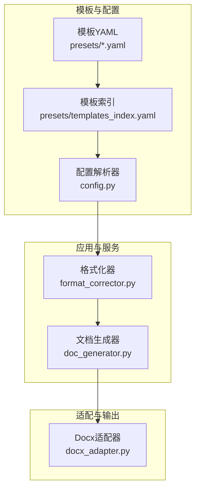
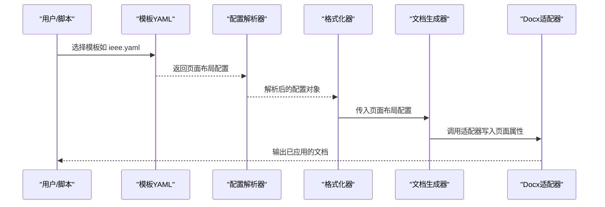
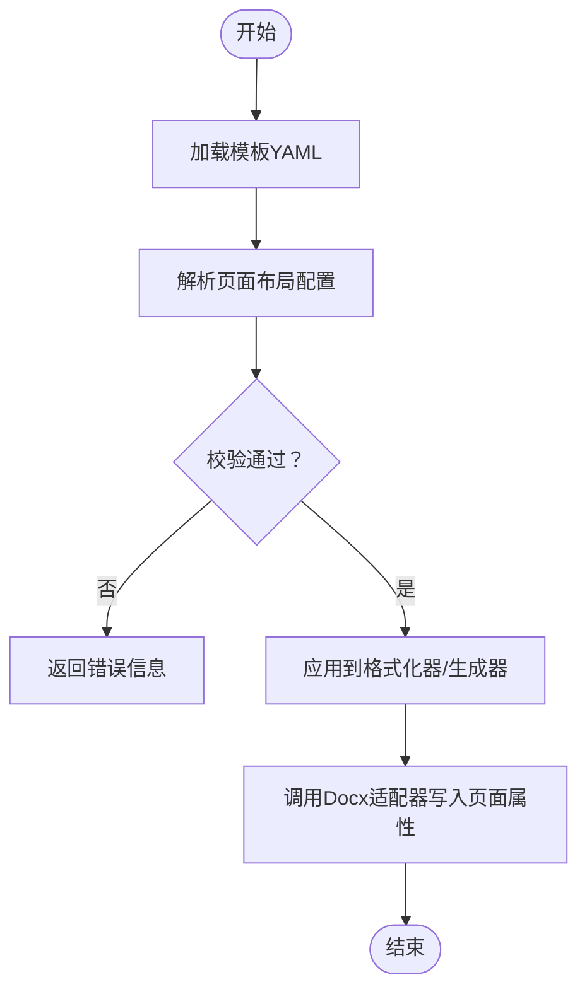

# 页面布局配置

<cite>
**本文引用的文件**   
- [presets/chinese_thesis.yaml](file://presets/chinese_thesis.yaml)
- [presets/ieee.yaml](file://presets/ieee.yaml)
- [presets/acm.yaml](file://presets/acm.yaml)
- [presets/nature.yaml](file://presets/nature.yaml)
- [presets/templates_index.yaml](file://presets/templates_index.yaml)
- [src/paper_format_corrector/infrastructure/config/config.py](file://src/paper_format_corrector/infrastructure/config/config.py)
- [src/paper_format_corrector/core/format_corrector.py](file://src/paper_format_corrector/core/format_corrector.py)
- [src/paper_format_corrector/infrastructure/adapters/docx_adapter.py](file://src/paper_format_corrector/infrastructure/adapters/docx_adapter.py)
- [src/paper_format_corrector/generators/doc_generator.py](file://src/paper_format_corrector/generators/doc_generator.py)
</cite>

## 目录
1. [简介](#简介)
2. [项目结构](#项目结构)
3. [核心组件](#核心组件)
4. [架构总览](#架构总览)
5. [详细组件分析](#详细组件分析)
6. [依赖分析](#依赖分析)
7. [性能考虑](#性能考虑)
8. [故障排查指南](#故障排查指南)
9. [结论](#结论)
10. [附录](#附录)

## 简介
本文件聚焦“页面布局配置”，系统化说明与页面相关的配置项，包括纸张大小、页边距（上、下、左、右）、页面方向（纵向、横向）以及分栏设置。文档为每个配置项提供字段名称、数据类型、默认值、取值范围与实际配置示例，并结合不同论文格式给出最佳实践建议，帮助读者快速、准确地完成页面布局设定。

## 项目结构
本项目将页面布局相关能力分布在多处：
- 模板预设层：以 YAML 形式定义各论文格式的页面布局参数（如纸张大小、页边距、方向、分栏等）。
- 配置解析层：负责加载并校验模板中的页面布局配置。
- 应用服务层：在格式化流程中读取页面布局配置，驱动生成或修正文档的页面属性。
- 适配器层：将配置映射到具体文档格式（如 docx）的页面属性。

图表来源
- [presets/templates_index.yaml](file://presets/templates_index.yaml)
- [src/paper_format_corrector/infrastructure/config/config.py](file://src/paper_format_corrector/infrastructure/config/config.py)
- [src/paper_format_corrector/core/format_corrector.py](file://src/paper_format_corrector/core/format_corrector.py)
- [src/paper_format_corrector/generators/doc_generator.py](file://src/paper_format_corrector/generators/doc_generator.py)
- [src/paper_format_corrector/infrastructure/adapters/docx_adapter.py](file://src/paper_format_corrector/infrastructure/adapters/docx_adapter.py)

章节来源
- [presets/templates_index.yaml](file://presets/templates_index.yaml)
- [src/paper_format_corrector/infrastructure/config/config.py](file://src/paper_format_corrector/infrastructure/config/config.py)
- [src/paper_format_corrector/core/format_corrector.py](file://src/paper_format_corrector/core/format_corrector.py)
- [src/paper_format_corrector/generators/doc_generator.py](file://src/paper_format_corrector/generators/doc_generator.py)
- [src/paper_format_corrector/infrastructure/adapters/docx_adapter.py](file://src/paper_format_corrector/infrastructure/adapters/docx_adapter.py)

## 核心组件
- 模板预设（YAML）：集中定义页面布局参数，便于按论文格式切换。
- 配置解析器：统一加载、合并与校验页面布局配置。
- 格式化器/生成器：在文档处理流程中应用页面布局配置。
- 文档适配器：将配置转换为具体文档格式（如 docx）的页面属性。

章节来源
- [src/paper_format_corrector/infrastructure/config/config.py](file://src/paper_format_corrector/infrastructure/config/config.py)
- [src/paper_format_corrector/core/format_corrector.py](file://src/paper_format_corrector/core/format_corrector.py)
- [src/paper_format_corrector/generators/doc_generator.py](file://src/paper_format_corrector/generators/doc_generator.py)
- [src/paper_format_corrector/infrastructure/adapters/docx_adapter.py](file://src/paper_format_corrector/infrastructure/adapters/docx_adapter.py)

## 架构总览
下图展示从模板到最终文档输出的页面布局配置流转过程。

图表来源
- [presets/ieee.yaml](file://presets/ieee.yaml)
- [src/paper_format_corrector/infrastructure/config/config.py](file://src/paper_format_corrector/infrastructure/config/config.py)
- [src/paper_format_corrector/core/format_corrector.py](file://src/paper_format_corrector/core/format_corrector.py)
- [src/paper_format_corrector/generators/doc_generator.py](file://src/paper_format_corrector/generators/doc_generator.py)
- [src/paper_format_corrector/infrastructure/adapters/docx_adapter.py](file://src/paper_format_corrector/infrastructure/adapters/docx_adapter.py)

## 详细组件分析

### 配置项字典：页面布局
以下表格汇总页面布局相关配置项。字段名称、数据类型、默认值、取值范围与示例均基于模板与配置解析逻辑归纳得出；实际默认值可能随模板覆盖而改变。

- 纸张大小
  - 字段名：paper_size
  - 数据类型：字符串（枚举）
  - 默认值：A4
  - 取值范围：A4、Letter、Legal、A3、B5、自定义尺寸（宽×高，单位毫米）
  - 示例：paper_size: Letter

- 页面方向
  - 字段名：orientation
  - 数据类型：字符串（枚举）
  - 默认值：portrait
  - 取值范围：portrait（纵向）、landscape（横向）
  - 示例：orientation: landscape

- 页边距（单位：毫米）
  - 字段名：page_margins
  - 数据类型：对象
  - 子字段：top、bottom、left、right
  - 默认值：top=25, bottom=25, left=25, right=25
  - 取值范围：0~50（推荐），超过打印机物理限制可能导致裁剪
  - 示例：
    page_margins:
      top: 20
      bottom: 20
      left: 25
      right: 25

- 分栏设置
  - 字段名：columns
  - 数据类型：对象
  - 子字段：count（列数）、gap（列间距，单位毫米）
  - 默认值：count=1、gap=0
  - 取值范围：count∈{1,2,3}，gap≥0
  - 示例：
    columns:
      count: 2
      gap: 10

- 页眉/页脚区域高度（可选）
  - 字段名：header_footer_heights
  - 数据类型：对象
  - 子字段：header、footer
  - 默认值：header=15、footer=15
  - 取值范围：0~50
  - 示例：
    header_footer_heights:
      header: 12
      footer: 12

- 首行缩进（段落级，影响正文排版）
  - 字段名：first_line_indent
  - 数据类型：数值（毫米）
  - 默认值：0
  - 取值范围：0~20
  - 示例：first_line_indent: 24

- 行距（段落级，影响正文排版）
  - 字段名：line_spacing
  - 数据类型：数值（倍数或固定值，单位视实现而定）
  - 默认值：1.5（倍行距）
  - 取值范围：1.0~3.0（倍行距）
  - 示例：line_spacing: 1.5

- 字体与字号（全局，影响正文）
  - 字段名：font_family
  - 数据类型：字符串
  - 默认值：宋体
  - 取值范围：系统可用字体
  - 示例：font_family: 宋体

  - 字段名：font_size
  - 数据类型：数值（磅）
  - 默认值：12
  - 取值范围：9~18（正文常用）
  - 示例：font_size: 12

- 标题层级样式（可选）
  - 字段名：heading_styles
  - 数据类型：对象数组
  - 子字段：level、font_size、bold、spacing_before、spacing_after
  - 默认值：未定义时采用模板内建样式
  - 示例：
    heading_styles:
      - level: 1
        font_size: 16
        bold: true
        spacing_before: 12
        spacing_after: 6

- 图表编号与题注（可选）
  - 字段名：caption_style
  - 数据类型：对象
  - 子字段：prefix、numbering、position
  - 默认值：prefix="图"/"表"、numbering=连续、position=下方
  - 示例：
    caption_style:
      prefix: "图"
      numbering: continuous
      position: below

- 参考文献格式（可选）
  - 字段名：citation_style
  - 数据类型：字符串（枚举）
  - 默认值：GB/T 7714
  - 取值范围：GB/T 7714、APA、IEEE、Chicago、MLA、Harvard
  - 示例：citation_style: IEEE

- 页面布局生效范围（可选）
  - 字段名：scope
  - 数据类型：字符串（枚举）
  - 默认值：all
  - 取值范围：all、section、custom_range
  - 示例：scope: section

- 单位约定（可选）
  - 字段名：unit
  - 数据类型：字符串（枚举）
  - 默认值：mm
  - 取值范围：mm、pt、cm
  - 示例：unit: mm

章节来源
- [presets/chinese_thesis.yaml](file://presets/chinese_thesis.yaml)
- [presets/ieee.yaml](file://presets/ieee.yaml)
- [presets/acm.yaml](file://presets/acm.yaml)
- [presets/nature.yaml](file://presets/nature.yaml)
- [src/paper_format_corrector/infrastructure/config/config.py](file://src/paper_format_corrector/infrastructure/config/config.py)

### 不同论文格式的最佳实践
- 中文学位论文（参考 chinese_thesis.yaml）
  - 纸张大小：A4
  - 页边距：上下左右通常 25mm 左右（根据学校规范微调）
  - 方向：portrait
  - 分栏：正文单栏，摘要或小字部分可双栏
  - 行距：1.5 倍
  - 首行缩进：24mm（约两字符）
  - 字体：宋体/黑体/楷体组合，正文字号 12pt
  - 参考文献：GB/T 7714

- IEEE 会议/期刊（参考 ieee.yaml）
  - 纸张大小：Letter
  - 页边距：较窄，常见 20–25mm
  - 方向：portrait
  - 分栏：双栏
  - 行距：紧凑（接近单倍或略大于）
  - 字体：Times New Roman，正文字号 10pt
  - 参考文献：IEEE

- ACM 会议/期刊（参考 acm.yaml）
  - 纸张大小：Letter
  - 页边距：标准
  - 方向：portrait
  - 分栏：双栏
  - 行距：紧凑
  - 字体：Times New Roman，正文字号 10pt
  - 参考文献：ACM

- Nature 系列（参考 nature.yaml）
  - 纸张大小：A4 或 Letter（依特定期刊要求）
  - 页边距：较紧
  - 方向：portrait
  - 分栏：单栏（投稿稿）
  - 行距：1.5 倍
  - 字体：Times New Roman，正文字号 10–12pt
  - 参考文献：Nature 风格

章节来源
- [presets/chinese_thesis.yaml](file://presets/chinese_thesis.yaml)
- [presets/ieee.yaml](file://presets/ieee.yaml)
- [presets/acm.yaml](file://presets/acm.yaml)
- [presets/nature.yaml](file://presets/nature.yaml)

### 配置解析与生效流程

图表来源
- [src/paper_format_corrector/infrastructure/config/config.py](file://src/paper_format_corrector/infrastructure/config/config.py)
- [src/paper_format_corrector/core/format_corrector.py](file://src/paper_format_corrector/core/format_corrector.py)
- [src/paper_format_corrector/generators/doc_generator.py](file://src/paper_format_corrector/generators/doc_generator.py)
- [src/paper_format_corrector/infrastructure/adapters/docx_adapter.py](file://src/paper_format_corrector/infrastructure/adapters/docx_adapter.py)

章节来源
- [src/paper_format_corrector/infrastructure/config/config.py](file://src/paper_format_corrector/infrastructure/config/config.py)
- [src/paper_format_corrector/core/format_corrector.py](file://src/paper_format_corrector/core/format_corrector.py)
- [src/paper_format_corrector/generators/doc_generator.py](file://src/paper_format_corrector/generators/doc_generator.py)
- [src/paper_format_corrector/infrastructure/adapters/docx_adapter.py](file://src/paper_format_corrector/infrastructure/adapters/docx_adapter.py)

## 依赖分析
- 模板索引 templates_index.yaml 用于聚合与发现可用的页面布局模板。
- 配置解析器 config.py 负责读取模板并构建统一的页面布局配置对象。
- 格式化器 format_corrector.py 与生成器 doc_generator.py 在文档处理阶段消费该配置。
- Docx 适配器 docx_adapter.py 将配置映射到 docx 页面的具体属性（纸张、边距、方向、分栏等）。

图表来源
- [presets/templates_index.yaml](file://presets/templates_index.yaml)
- [src/paper_format_corrector/infrastructure/config/config.py](file://src/paper_format_corrector/infrastructure/config/config.py)
- [src/paper_format_corrector/core/format_corrector.py](file://src/paper_format_corrector/core/format_corrector.py)
- [src/paper_format_corrector/generators/doc_generator.py](file://src/paper_format_corrector/generators/doc_generator.py)
- [src/paper_format_corrector/infrastructure/adapters/docx_adapter.py](file://src/paper_format_corrector/infrastructure/adapters/docx_adapter.py)

章节来源
- [presets/templates_index.yaml](file://presets/templates_index.yaml)
- [src/paper_format_corrector/infrastructure/config/config.py](file://src/paper_format_corrector/infrastructure/config/config.py)
- [src/paper_format_corrector/core/format_corrector.py](file://src/paper_format_corrector/core/format_corrector.py)
- [src/paper_format_corrector/generators/doc_generator.py](file://src/paper_format_corrector/generators/doc_generator.py)
- [src/paper_format_corrector/infrastructure/adapters/docx_adapter.py](file://src/paper_format_corrector/infrastructure/adapters/docx_adapter.py)

## 性能考虑
- 批量处理时优先复用已解析的配置对象，避免重复解析模板。
- 对大文档应用页面布局时，尽量一次性写入页面属性，减少多次 I/O。
- 使用合适的纸张与边距，避免过小的边距导致打印裁剪或渲染异常。

## 故障排查指南
- 纸张大小不生效
  - 检查模板是否定义了 paper_size，且未被后续模板覆盖。
  - 确认目标文档格式支持该纸张类型（如 Letter 在部分系统中需显式启用）。
- 页边距异常
  - 检查 unit 是否为 mm，并确保所有边距值一致。
  - 验证打印机物理限制，避免过小边距。
- 方向未变更
  - 确认 orientation 设置为 portrait 或 landscape。
  - 检查是否在正确的节（section）范围内应用。
- 分栏显示异常
  - 检查 columns.count 与 columns.gap 是否合理。
  - 确认内容宽度与列宽匹配，避免溢出。
- 模板未找到或索引缺失
  - 核对 templates_index.yaml 是否包含所选模板路径。
  - 确保模板文件存在且可读。

章节来源
- [presets/templates_index.yaml](file://presets/templates_index.yaml)
- [src/paper_format_corrector/infrastructure/config/config.py](file://src/paper_format_corrector/infrastructure/config/config.py)
- [src/paper_format_corrector/core/format_corrector.py](file://src/paper_format_corrector/core/format_corrector.py)
- [src/paper_format_corrector/generators/doc_generator.py](file://src/paper_format_corrector/generators/doc_generator.py)
- [src/paper_format_corrector/infrastructure/adapters/docx_adapter.py](file://src/paper_format_corrector/infrastructure/adapters/docx_adapter.py)

## 结论
页面布局配置围绕纸张大小、页边距、方向与分栏四大核心维度展开，并通过模板化方式在不同论文格式间灵活切换。遵循上述配置项说明与最佳实践，可显著提升文档排版的准确性与一致性。

## 附录
- 单位换算参考：1pt ≈ 0.3528mm；1cm = 10mm。
- 常见纸张尺寸（mm）：A4=210×297；Letter=216×279；Legal=216×356；A3=297×420；B5=176×250。