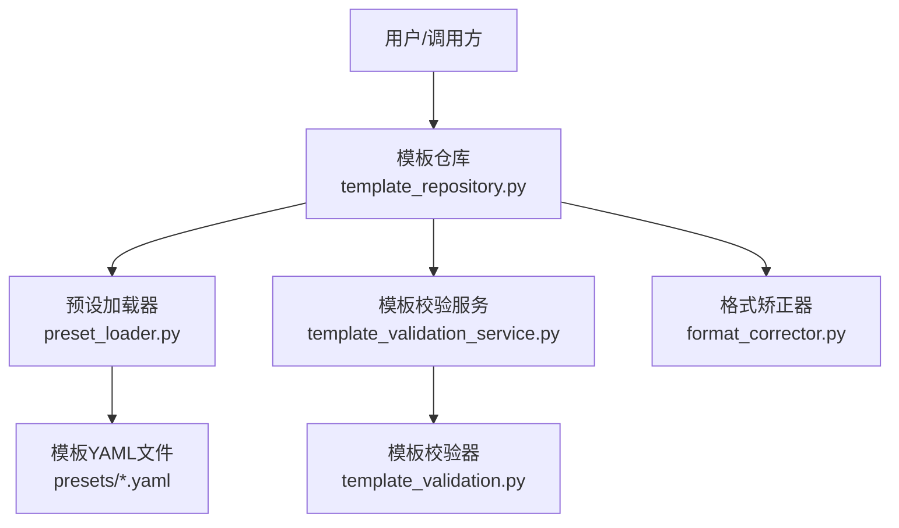
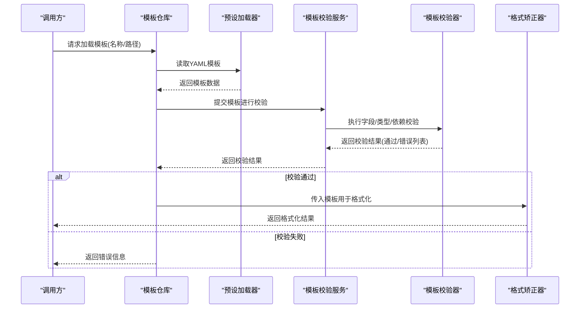
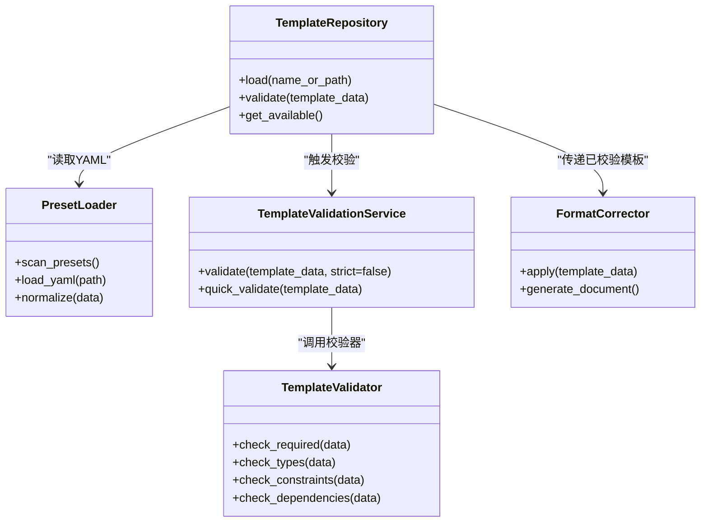

# 模板配置语法

<cite>
**本文引用的文件**   
- [presets/templates_index.yaml](file://presets/templates_index.yaml)
- [presets/academic_paper.yaml](file://presets/academic_paper.yaml)
- [presets/chinese_thesis.yaml](file://presets/chinese_thesis.yaml)
- [presets/ieee.yaml](file://presets/ieee.yaml)
- [presets/doc_templates/academic_paper.yaml](file://presets/doc_templates/academic_paper.yaml)
- [src/paper_format_corrector/application/services/template_validation.py](file://src/paper_format_corrector/application/services/template_validation.py)
- [src/paper_format_corrector/application/services/template_validation_service.py](file://src/paper_format_corrector/application/services/template_validation_service.py)
- [src/paper_format_corrector/infra/template_repository.py](file://src/paper_format_corrector/infra/template_repository.py)
- [src/paper_format_corrector/infra/preset_loader.py](file://src/paper_format_corrector/infra/preset_loader.py)
- [src/paper_format_corrector/core/format_corrector.py](file://src/paper_format_corrector/core/format_corrector.py)
- [examples/sample_template.yaml](file://examples/sample_template.yaml)
</cite>

## 目录
1. [简介](#简介)
2. [项目结构](#项目结构)
3. [核心组件](#核心组件)
4. [架构总览](#架构总览)
5. [详细组件分析](#详细组件分析)
6. [依赖关系分析](#依赖关系分析)
7. [性能考虑](#性能考虑)
8. [故障排查指南](#故障排查指南)
9. [结论](#结论)
10. [附录：字段参考手册](#附录字段参考手册)

## 简介
本文件为“模板配置语法”的完整参考文档，面向需要自定义或扩展论文格式模板的用户与开发者。内容涵盖：
- YAML 模板语法规则（字段定义、数据类型、嵌套结构与继承机制）
- 模板核心配置项（页面设置、字体样式、段落格式、标题层级、引用格式等）
- 完整的配置字段参考手册（类型、默认值、使用示例）
- 模板验证规则与错误处理机制
- 高级配置技巧与优化建议

## 项目结构
本项目采用“预设模板 + 应用服务 + 基础设施加载器”的分层组织方式：
- presets：存放各类机构/会议/期刊的模板 YAML 与索引
- src/paper_format_corrector/application/services：模板校验与服务编排
- src/paper_format_corrector/infra：模板仓库与预设加载器
- examples：示例模板与用法

图表来源
- [src/paper_format_corrector/infra/template_repository.py](file://src/paper_format_corrector/infra/template_repository.py)
- [src/paper_format_corrector/infra/preset_loader.py](file://src/paper_format_corrector/infra/preset_loader.py)
- [src/paper_format_corrector/application/services/template_validation_service.py](file://src/paper_format_corrector/application/services/template_validation_service.py)
- [src/paper_format_corrector/application/services/template_validation.py](file://src/paper_format_corrector/application/services/template_validation.py)
- [src/paper_format_corrector/core/format_corrector.py](file://src/paper_format_corrector/core/format_corrector.py)

章节来源
- [presets/templates_index.yaml](file://presets/templates_index.yaml)
- [src/paper_format_corrector/infra/template_repository.py](file://src/paper_format_corrector/infra/template_repository.py)
- [src/paper_format_corrector/infra/preset_loader.py](file://src/paper_format_corrector/infra/preset_loader.py)

## 核心组件
- 模板仓库（TemplateRepository）：负责按名称/路径解析并加载模板，提供统一访问入口。
- 预设加载器（PresetLoader）：从 presets 目录读取 YAML 模板，支持合并与覆盖。
- 模板校验服务（TemplateValidationService）：对外暴露模板校验流程，协调具体校验器。
- 模板校验器（TemplateValidator）：实现字段存在性、类型、取值范围、依赖关系等校验逻辑。
- 格式矫正器（FormatCorrector）：消费已校验的模板，驱动后续排版生成与修正流程。

章节来源
- [src/paper_format_corrector/infra/template_repository.py](file://src/paper_format_corrector/infra/template_repository.py)
- [src/paper_format_corrector/infra/preset_loader.py](file://src/paper_format_corrector/infra/preset_loader.py)
- [src/paper_format_corrector/application/services/template_validation_service.py](file://src/paper_format_corrector/application/services/template_validation_service.py)
- [src/paper_format_corrector/application/services/template_validation.py](file://src/paper_format_corrector/application/services/template_validation.py)
- [src/paper_format_corrector/core/format_corrector.py](file://src/paper_format_corrector/core/format_corrector.py)

## 架构总览
下图展示了模板从加载到校验再到使用的端到端流程。

图表来源
- [src/paper_format_corrector/infra/template_repository.py](file://src/paper_format_corrector/infra/template_repository.py)
- [src/paper_format_corrector/infra/preset_loader.py](file://src/paper_format_corrector/infra/preset_loader.py)
- [src/paper_format_corrector/application/services/template_validation_service.py](file://src/paper_format_corrector/application/services/template_validation_service.py)
- [src/paper_format_corrector/application/services/template_validation.py](file://src/paper_format_corrector/application/services/template_validation.py)
- [src/paper_format_corrector/core/format_corrector.py](file://src/paper_format_corrector/core/format_corrector.py)

## 详细组件分析

### 模板仓库（TemplateRepository）
职责
- 根据模板标识（名称或路径）定位模板源
- 委托预设加载器读取 YAML
- 将模板数据交给校验服务
- 返回可用模板对象供上层使用

关键点
- 支持本地 presets 目录与外部路径
- 对重复键名与冲突字段进行合并策略控制（以具体实现为准）

章节来源
- [src/paper_format_corrector/infra/template_repository.py](file://src/paper_format_corrector/infra/template_repository.py)

### 预设加载器（PresetLoader）
职责
- 扫描 presets 目录，解析 templates_index.yaml 索引
- 按需加载指定模板 YAML
- 提供基础的数据清洗与规范化能力

关键点
- 支持相对路径与绝对路径
- 对缺失文件或非法 YAML 抛出明确异常

章节来源
- [src/paper_format_corrector/infra/preset_loader.py](file://src/paper_format_corrector/infra/preset_loader.py)
- [presets/templates_index.yaml](file://presets/templates_index.yaml)

### 模板校验服务（TemplateValidationService）
职责
- 编排模板校验流程
- 聚合校验器输出，形成统一的校验报告
- 提供“快速校验”和“严格校验”模式

关键点
- 可配置是否启用可选字段检查
- 支持批量模板校验

章节来源
- [src/paper_format_corrector/application/services/template_validation_service.py](file://src/paper_format_corrector/application/services/template_validation_service.py)

### 模板校验器（TemplateValidator）
职责
- 校验必填字段是否存在
- 校验字段类型是否符合预期（字符串、数值、布尔、枚举、数组、对象等）
- 校验取值范围与约束（如页边距正数、字号范围、对齐方式枚举值等）
- 校验依赖关系（如开启某功能需同时配置相关字段）

关键点
- 错误分类：缺失、类型错误、取值越界、依赖不满足
- 错误包含位置路径与修复建议

章节来源
- [src/paper_format_corrector/application/services/template_validation.py](file://src/paper_format_corrector/application/services/template_validation.py)

### 格式矫正器（FormatCorrector）
职责
- 接收已通过校验的模板
- 驱动文档生成、样式应用与格式修正
- 输出最终文档或差异报告

关键点
- 与处理器（表格、图片、目录、页眉页脚等）协作
- 支持增量更新与回滚策略（由上层决定）

章节来源
- [src/paper_format_corrector/core/format_corrector.py](file://src/paper_format_corrector/core/format_corrector.py)

## 依赖关系分析
- 模块耦合
  - TemplateRepository 依赖 PresetLoader 与 TemplateValidationService
  - TemplateValidationService 依赖 TemplateValidator
  - FormatCorrector 依赖已校验的模板数据
- 外部依赖
  - YAML 解析库（PyYAML 或等价实现）
  - 文件系统访问（本地 presets 目录）
- 潜在循环依赖
  - 当前分层清晰，未见循环导入迹象

图表来源
- [src/paper_format_corrector/infra/template_repository.py](file://src/paper_format_corrector/infra/template_repository.py)
- [src/paper_format_corrector/infra/preset_loader.py](file://src/paper_format_corrector/infra/preset_loader.py)
- [src/paper_format_corrector/application/services/template_validation_service.py](file://src/paper_format_corrector/application/services/template_validation_service.py)
- [src/paper_format_corrector/application/services/template_validation.py](file://src/paper_format_corrector/application/services/template_validation.py)
- [src/paper_format_corrector/core/format_corrector.py](file://src/paper_format_corrector/core/format_corrector.py)

章节来源
- [src/paper_format_corrector/infra/template_repository.py](file://src/paper_format_corrector/infra/template_repository.py)
- [src/paper_format_corrector/infra/preset_loader.py](file://src/paper_format_corrector/infra/preset_loader.py)
- [src/paper_format_corrector/application/services/template_validation_service.py](file://src/paper_format_corrector/application/services/template_validation_service.py)
- [src/paper_format_corrector/application/services/template_validation.py](file://src/paper_format_corrector/application/services/template_validation.py)
- [src/paper_format_corrector/core/format_corrector.py](file://src/paper_format_corrector/core/format_corrector.py)

## 性能考虑
- 模板缓存：对常用模板在内存中缓存，避免重复 I/O 与解析
- 懒加载：仅在需要时加载大型模板集合
- 增量校验：仅校验变更字段，减少全量校验开销
- 并行校验：对多模板批量校验时使用并发策略（注意资源限制）

[本节为通用指导，无需代码来源]

## 故障排查指南
常见问题与定位步骤
- 模板未找到
  - 确认模板名称是否在 templates_index.yaml 中注册
  - 检查路径是否为绝对路径或相对于 presets 目录
- YAML 语法错误
  - 关注缩进与引号使用；确保键名唯一
  - 使用在线 YAML 校验工具辅助定位
- 校验失败
  - 查看错误列表中的字段路径与错误类型
  - 根据提示补齐必填字段或修正类型/取值
- 运行期异常
  - 检查模板字段是否与处理器期望一致
  - 查看日志中关于样式/段落/字体的报错信息

章节来源
- [src/paper_format_corrector/application/services/template_validation.py](file://src/paper_format_corrector/application/services/template_validation.py)
- [src/paper_format_corrector/application/services/template_validation_service.py](file://src/paper_format_corrector/application/services/template_validation_service.py)
- [src/paper_format_corrector/infra/preset_loader.py](file://src/paper_format_corrector/infra/preset_loader.py)

## 结论
模板配置系统通过“仓库 + 加载器 + 校验服务 + 校验器 + 矫正器”的分层设计，实现了高内聚、低耦合的可扩展模板体系。遵循本文档的语法规则与最佳实践，可以快速构建符合机构/会议/期刊要求的标准化模板。

[本节为总结性内容，无需代码来源]

## 附录：字段参考手册

说明
- 以下为模板 YAML 的核心字段族与语义约定。实际字段名与默认值以各模板文件与校验器实现为准。
- 若某字段未在模板中显式声明，系统将尝试使用内置默认值（如有）。

通用约定
- 数据类型
  - string：文本
  - number：整数或浮点数
  - boolean：true/false
  - enum：预定义枚举值之一
  - array：有序列表
  - object：键值对象
- 命名规范
  - 使用小写字母与下划线分隔
  - 层级尽量扁平化，复杂结构使用对象封装
- 单位约定
  - 长度默认单位为毫米（mm），字号默认单位为磅（pt）
  - 颜色支持十六进制与常见英文色名（取决于实现）

页面设置（page）
- page.size：纸张尺寸，enum，默认 A4
- page.orientation：方向，enum，portrait/landscape
- page.margins.top/bottom/left/right：页边距，number，单位 mm
- page.header_distance/footer_distance：页眉/页脚距离，number，单位 mm
- page.columns：分栏数，number
- page.page_numbering：页码样式，object，包含 position、font、size 等子字段

字体样式（fonts）
- fonts.primary：主字体，string
- fonts.secondary：副字体，string
- fonts.cjk：中文/日文/韩文字体，string
- fonts.math：数学公式字体，string
- fonts.fallback：回退字体链，array<string>
- fonts.default_size：默认字号，number，单位 pt

段落格式（paragraph）
- paragraph.alignment：对齐方式，enum，left/center/right/justify
- paragraph.line_spacing：行距，number 或 enum，single/1.5/double/custom
- paragraph.first_line_indent：首行缩进，number，单位 mm
- paragraph.space_before/after：段前/段后间距，number，单位 pt
- paragraph.keep_with_next：与下一段保持在一起，boolean
- paragraph.widow_control：孤行控制，boolean

标题层级（headings）
- headings.h1/h2/h3/h4/h5/h6：各级标题样式，object
  - font：字体对象
  - size：字号，number
  - alignment：对齐，enum
  - numbering：编号方案，object（style、prefix、separator）
  - space_before/after：间距，number
  - keep_with_next：boolean

引用格式（references）
- references.style：引用风格，enum，GB/T 7714、APA、IEEE、Chicago、MLA、Harvard 等
- references.in_text_citation：文内引用，object（author_year、numeric、superscript）
- references.bibliography：参考文献列表，object（title、indent、spacing、hanging_indent）
- references.cross_ref：交叉引用，object（enabled、label_prefix）

封面与元数据（cover & metadata）
- cover.enabled：是否生成封面，boolean
- cover.layout：封面布局，enum，simple/full
- metadata.title/author/date/institution：文档元数据，string

表格与图片（tables & figures）
- tables.numbering：表编号方案，object（style、prefix、separator）
- tables.caption_position：表题位置，enum，above/below
- tables.font：表内字体，object
- figures.numbering：图编号方案，object
- figures.caption_position：图题位置，enum，below/above
- figures.font：图内字体，object
- figures.centered：居中显示，boolean

目录（toc）
- toc.enabled：是否生成目录，boolean
- toc.levels：目录层级，array<number>
- toc.font：目录字体，object
- toc.indent：缩进方案，object

页眉页脚（header_footer）
- header.left/center/right：页眉三段内容，string
- footer.left/center/right：页脚三段内容，string
- header_footer.show_page_number：显示页码，boolean
- header_footer.page_number_style：页码样式，enum，阿拉伯数字/罗马数字/汉字

其他（misc）
- misc.watermark：水印配置，object（text、opacity、rotation）
- misc.print_settings：打印设置，object（grayscale、fit_to_page）
- misc.export_options：导出选项，object（pdf、docx、latex）

继承机制（extends）
- extends：继承自某个模板名称或路径，object/string
- override：覆盖父模板字段，object
- merge_strategy：合并策略，enum，deep/shallow/replace
- priority：优先级，number（当多个模板合并时生效）

示例模板参考
- 示例模板路径：[examples/sample_template.yaml](file://examples/sample_template.yaml)
- 学术模板示例：[presets/academic_paper.yaml](file://presets/academic_paper.yaml)
- 中文学位论文示例：[presets/chinese_thesis.yaml](file://presets/chinese_thesis.yaml)
- IEEE 模板示例：[presets/ieee.yaml](file://presets/ieee.yaml)
- 文档模板示例：[presets/doc_templates/academic_paper.yaml](file://presets/doc_templates/academic_paper.yaml)

章节来源
- [examples/sample_template.yaml](file://examples/sample_template.yaml)
- [presets/academic_paper.yaml](file://presets/academic_paper.yaml)
- [presets/chinese_thesis.yaml](file://presets/chinese_thesis.yaml)
- [presets/ieee.yaml](file://presets/ieee.yaml)
- [presets/doc_templates/academic_paper.yaml](file://presets/doc_templates/academic_paper.yaml)

## 高级配置技巧与优化建议
- 模板复用与组合
  - 使用 extends 继承通用模板，再通过 override 局部定制
  - 利用 merge_strategy 控制字段合并深度，避免意外覆盖
- 条件化配置
  - 基于环境或目标场景选择不同模板分支（通过脚本或上层逻辑切换）
- 性能优化
  - 对大型模板启用缓存；避免频繁重建模板对象
  - 批量处理时复用已加载的模板实例
- 可观测性与调试
  - 记录模板加载与校验日志，便于问题回溯
  - 使用“快速校验”模式在开发阶段加速迭代

[本节为通用指导，无需代码来源]