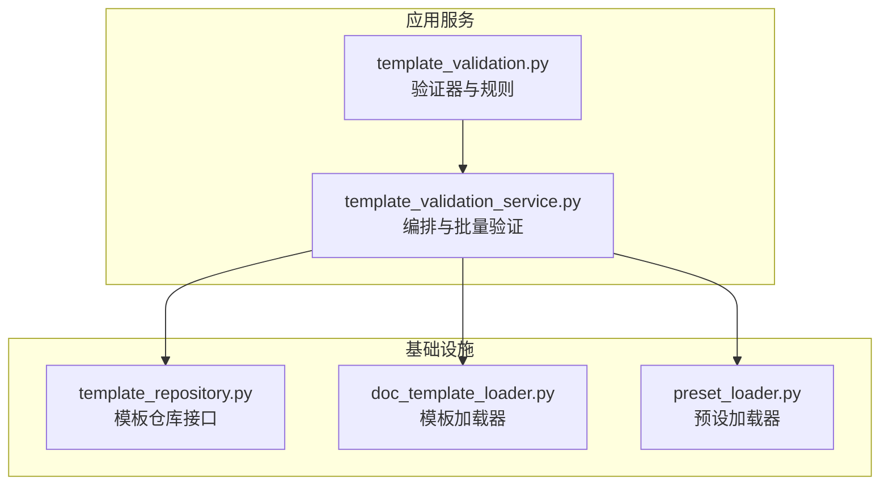
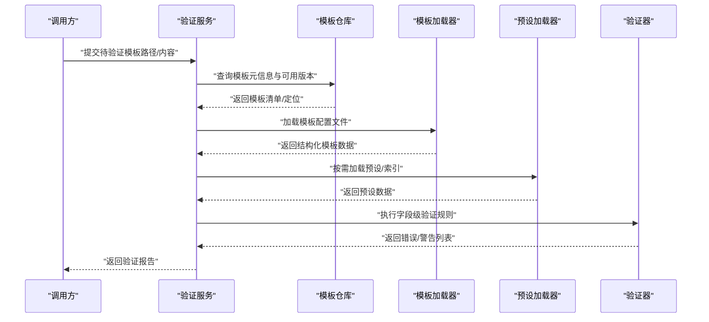
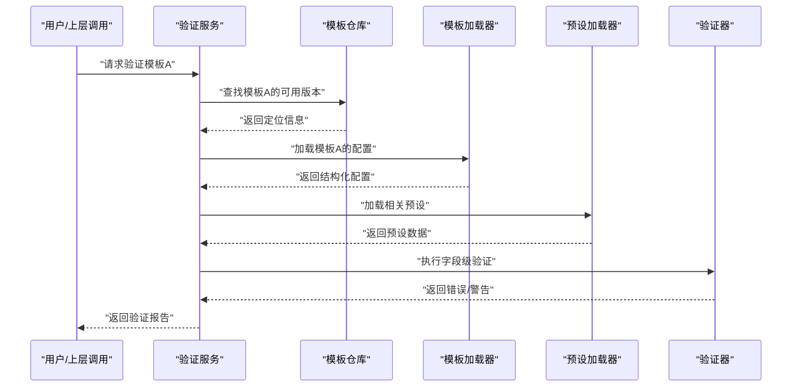
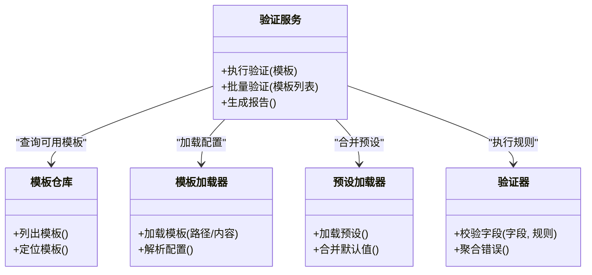

# 模板验证规则

<cite>
**本文引用的文件**   
- [src/paper_format_corrector/application/services/template_validation.py](file://src/paper_format_corrector/application/services/template_validation.py)
- [src/paper_format_corrector/application/services/template_validation_service.py](file://src/paper_format_corrector/application/services/template_validation_service.py)
- [src/paper_format_corrector/infra/template_repository.py](file://src/paper_format_corrector/infra/template_repository.py)
- [src/paper_format_corrector/infra/doc_template_loader.py](file://src/paper_format_corrector/infra/doc_template_loader.py)
- [src/paper_format_corrector/infra/preset_loader.py](file://src/paper_format_corrector/infra/preset_loader.py)
- [examples/sample_template.yaml](file://examples/sample_template.yaml)
- [presets/templates_index.yaml](file://presets/templates_index.yaml)
- [tests/test_template_validation_and_import.py](file://tests/test_template_validation_and_import.py)
</cite>

## 目录
1. [简介](#简介)
2. [项目结构](#项目结构)
3. [核心组件](#核心组件)
4. [架构总览](#架构总览)
5. [详细组件分析](#详细组件分析)
6. [依赖关系分析](#依赖关系分析)
7. [性能考虑](#性能考虑)
8. [故障排查指南](#故障排查指南)
9. [结论](#结论)
10. [附录](#附录)

## 简介
本文件系统化说明模板验证规则与配置有效性检查机制，覆盖必填字段、数据类型、取值范围与逻辑关系校验；解释错误类型与消息含义；提供常见失败原因与修复方法；并给出自定义验证规则与扩展验证逻辑的方式。同时包含批量验证与性能优化建议，帮助使用者稳定、高效地管理模板配置。

## 项目结构
围绕模板验证的相关代码主要分布在应用服务层与基础设施层：
- 应用服务层负责定义验证规则、执行校验流程、聚合错误信息并提供批量验证能力
- 基础设施层负责加载模板、索引与预设，为验证提供数据源与上下文

图表来源
- [src/paper_format_corrector/application/services/template_validation.py](file://src/paper_format_corrector/application/services/template_validation.py)
- [src/paper_format_corrector/application/services/template_validation_service.py](file://src/paper_format_corrector/application/services/template_validation_service.py)
- [src/paper_format_corrector/infra/template_repository.py](file://src/paper_format_corrector/infra/template_repository.py)
- [src/paper_format_corrector/infra/doc_template_loader.py](file://src/paper_format_corrector/infra/doc_template_loader.py)
- [src/paper_format_corrector/infra/preset_loader.py](file://src/paper_format_corrector/infra/preset_loader.py)

章节来源
- [src/paper_format_corrector/application/services/template_validation.py](file://src/paper_format_corrector/application/services/template_validation.py)
- [src/paper_format_corrector/application/services/template_validation_service.py](file://src/paper_format_corrector/application/services/template_validation_service.py)
- [src/paper_format_corrector/infra/template_repository.py](file://src/paper_format_corrector/infra/template_repository.py)
- [src/paper_format_corrector/infra/doc_template_loader.py](file://src/paper_format_corrector/infra/doc_template_loader.py)
- [src/paper_format_corrector/infra/preset_loader.py](file://src/paper_format_corrector/infra/preset_loader.py)

## 核心组件
- 验证器（Validation Rules）：定义字段级校验规则，包括必填、类型、范围、枚举、正则、条件依赖等
- 验证服务（Validation Service）：编排一次或多次验证任务，收集错误、生成报告，支持批量验证
- 模板仓库（Template Repository）：提供模板的读取、解析与缓存能力
- 模板加载器（Doc Template Loader）：从本地或远程位置加载模板文件，返回结构化配置
- 预设加载器（Preset Loader）：加载内置模板索引与预设，辅助模板发现与默认值填充

章节来源
- [src/paper_format_corrector/application/services/template_validation.py](file://src/paper_format_corrector/application/services/template_validation.py)
- [src/paper_format_corrector/application/services/template_validation_service.py](file://src/paper_format_corrector/application/services/template_validation_service.py)
- [src/paper_format_corrector/infra/template_repository.py](file://src/paper_format_corrector/infra/template_repository.py)
- [src/paper_format_corrector/infra/doc_template_loader.py](file://src/paper_format_corrector/infra/doc_template_loader.py)
- [src/paper_format_corrector/infra/preset_loader.py](file://src/paper_format_corrector/infra/preset_loader.py)

## 架构总览
模板验证的整体流程如下：
- 入口：通过验证服务发起单次或批量验证
- 数据准备：从模板仓库/加载器获取模板配置，必要时合并预设
- 规则执行：按字段维度逐项执行验证器定义的规则
- 结果聚合：汇总错误与警告，输出结构化报告
- 反馈：上层调用方根据报告进行提示或阻断后续处理

图表来源
- [src/paper_format_corrector/application/services/template_validation_service.py](file://src/paper_format_corrector/application/services/template_validation_service.py)
- [src/paper_format_corrector/infra/template_repository.py](file://src/paper_format_corrector/infra/template_repository.py)
- [src/paper_format_corrector/infra/doc_template_loader.py](file://src/paper_format_corrector/infra/doc_template_loader.py)
- [src/paper_format_corrector/infra/preset_loader.py](file://src/paper_format_corrector/infra/preset_loader.py)
- [src/paper_format_corrector/application/services/template_validation.py](file://src/paper_format_corrector/application/services/template_validation.py)

## 详细组件分析

### 验证器（字段级规则）
职责
- 定义各字段的校验策略：是否必填、数据类型、取值范围、枚举集合、正则表达式、条件依赖、跨字段一致性等
- 对单个模板实例执行校验，产出错误与警告条目

关键能力
- 必填字段验证：缺失时产生“必填”类错误
- 数据类型检查：字符串、数值、布尔、日期、数组、对象等类型不匹配时报错
- 取值范围验证：数值区间、长度限制、格式约束（如邮箱、URL、正则）
- 逻辑关系验证：字段间依赖、互斥、联动、全局一致性（例如封面标题与作者必须同时存在）

错误分类
- 必填缺失：字段未提供或为空
- 类型错误：实际类型与期望类型不一致
- 范围越界：超出最小/最大值、长度不符合要求
- 格式不符：不满足正则或约定格式
- 逻辑冲突：违反字段间约束或业务规则

示例参考
- 可参考示例模板的结构以理解字段组织方式与命名约定
  - [examples/sample_template.yaml](file://examples/sample_template.yaml)

章节来源
- [src/paper_format_corrector/application/services/template_validation.py](file://src/paper_format_corrector/application/services/template_validation.py)
- [examples/sample_template.yaml](file://examples/sample_template.yaml)

### 验证服务（编排与批量验证）
职责
- 协调模板加载、预设合并与验证执行
- 支持单次验证与批量验证
- 聚合错误、生成可读的报告（含位置、类型、消息与建议）

批量验证
- 输入：多个模板路径或配置项
- 处理：并行或队列化执行，避免阻塞
- 输出：汇总报告，包含每个模板的验证结果与整体统计

章节来源
- [src/paper_format_corrector/application/services/template_validation_service.py](file://src/paper_format_corrector/application/services/template_validation_service.py)

### 模板仓库（模板发现与定位）
职责
- 提供模板清单、版本信息与可用性状态
- 作为验证前快速判断模板是否存在与可访问的入口

章节来源
- [src/paper_format_corrector/infra/template_repository.py](file://src/paper_format_corrector/infra/template_repository.py)

### 模板加载器（模板解析与合并）
职责
- 从本地文件或远程地址加载模板
- 解析 YAML/JSON 等格式为结构化数据
- 可选：与预设合并，补齐默认值

章节来源
- [src/paper_format_corrector/infra/doc_template_loader.py](file://src/paper_format_corrector/infra/doc_template_loader.py)

### 预设加载器（预设与索引）
职责
- 加载内置模板索引与预设，用于默认值填充与模板发现
- 提供模板分类、标签与推荐

章节来源
- [src/paper_format_corrector/infra/preset_loader.py](file://src/paper_format_corrector/infra/preset_loader.py)
- [presets/templates_index.yaml](file://presets/templates_index.yaml)

### 端到端验证流程（序列图）

图表来源
- [src/paper_format_corrector/application/services/template_validation_service.py](file://src/paper_format_corrector/application/services/template_validation_service.py)
- [src/paper_format_corrector/infra/template_repository.py](file://src/paper_format_corrector/infra/template_repository.py)
- [src/paper_format_corrector/infra/doc_template_loader.py](file://src/paper_format_corrector/infra/doc_template_loader.py)
- [src/paper_format_corrector/infra/preset_loader.py](file://src/paper_format_corrector/infra/preset_loader.py)
- [src/paper_format_corrector/application/services/template_validation.py](file://src/paper_format_corrector/application/services/template_validation.py)

## 依赖关系分析
- 验证服务依赖模板仓库、模板加载器与预设加载器，形成“数据准备→规则执行→报告输出”的链路
- 验证器相对独立，便于扩展新规则而不影响其他模块
- 模板仓库与加载器解耦，便于替换存储后端或加载策略

图表来源
- [src/paper_format_corrector/application/services/template_validation_service.py](file://src/paper_format_corrector/application/services/template_validation_service.py)
- [src/paper_format_corrector/infra/template_repository.py](file://src/paper_format_corrector/infra/template_repository.py)
- [src/paper_format_corrector/infra/doc_template_loader.py](file://src/paper_format_corrector/infra/doc_template_loader.py)
- [src/paper_format_corrector/infra/preset_loader.py](file://src/paper_format_corrector/infra/preset_loader.py)
- [src/paper_format_corrector/application/services/template_validation.py](file://src/paper_format_corrector/application/services/template_validation.py)

章节来源
- [src/paper_format_corrector/application/services/template_validation_service.py](file://src/paper_format_corrector/application/services/template_validation_service.py)
- [src/paper_format_corrector/infra/template_repository.py](file://src/paper_format_corrector/infra/template_repository.py)
- [src/paper_format_corrector/infra/doc_template_loader.py](file://src/paper_format_corrector/infra/doc_template_loader.py)
- [src/paper_format_corrector/infra/preset_loader.py](file://src/paper_format_corrector/infra/preset_loader.py)
- [src/paper_format_corrector/application/services/template_validation.py](file://src/paper_format_corrector/application/services/template_validation.py)

## 性能考虑
- 预加载与缓存
  - 模板仓库可对模板清单与元信息进行缓存，减少重复查询
  - 模板加载器可对已解析的配置进行内存缓存，避免重复 I/O
- 并行与队列
  - 批量验证采用并发或任务队列，提升吞吐
  - 控制并发度以避免资源争用
- 增量验证
  - 仅对变更字段或受影响规则重新执行，降低计算开销
- 规则短路
  - 对于严重错误（如必填缺失），可提前终止后续无关规则的评估
- 日志与监控
  - 记录耗时与错误分布，定位热点规则与瓶颈

[本节为通用指导，无需具体文件引用]

## 故障排查指南
常见问题与修复建议
- 必填字段缺失
  - 现象：报告出现“必填缺失”错误
  - 修复：补充缺失字段或确认其默认值由预设正确填充
- 数据类型错误
  - 现象：报告出现“类型错误”
  - 修复：将字段值转换为期望类型（如字符串转数字、布尔值修正）
- 取值范围越界
  - 现象：报告出现“范围越界”
  - 修复：调整数值至允许区间或修正长度/格式约束
- 格式不符
  - 现象：报告出现“格式不符”
  - 修复：遵循约定的格式（如邮箱、URL、正则表达式）
- 逻辑冲突
  - 现象：报告出现“逻辑冲突”
  - 修复：检查字段间的依赖与互斥关系，确保业务规则一致

错误类型与消息含义
- 必填缺失：字段未提供或为空，需补充
- 类型错误：实际类型与期望类型不一致，需转换或修正
- 范围越界：数值或长度不在允许范围内，需调整
- 格式不符：不满足正则或约定格式，需规范化
- 逻辑冲突：违反字段间约束或全局一致性，需重构配置

章节来源
- [tests/test_template_validation_and_import.py](file://tests/test_template_validation_and_import.py)

## 结论
模板验证规则通过“字段级规则+服务编排+数据加载”的分层设计，实现了高内聚、低耦合的可扩展验证体系。借助批量验证与性能优化策略，可在大规模模板场景下保持稳定与高效。建议结合预设与模板索引，完善默认值与发现机制，并通过单元测试持续覆盖边界与异常路径。

[本节为总结性内容，无需具体文件引用]

## 附录

### 自定义验证规则与扩展
- 新增字段级规则
  - 在验证器中注册新的规则处理器，定义校验逻辑与错误消息
  - 在模板配置中声明该规则，指定字段与参数
- 扩展逻辑关系验证
  - 实现跨字段校验函数，并在验证服务中注册为全局规则
- 集成外部数据源
  - 在模板加载器或预设加载器中接入外部配置中心或远端模板库
- 测试与回归
  - 为新规则编写用例，覆盖正常与异常路径
  - 使用现有测试套件中的模板验证用例作为参考

章节来源
- [src/paper_format_corrector/application/services/template_validation.py](file://src/paper_format_corrector/application/services/template_validation.py)
- [src/paper_format_corrector/application/services/template_validation_service.py](file://src/paper_format_corrector/application/services/template_validation_service.py)
- [src/paper_format_corrector/infra/doc_template_loader.py](file://src/paper_format_corrector/infra/doc_template_loader.py)
- [src/paper_format_corrector/infra/preset_loader.py](file://src/paper_format_corrector/infra/preset_loader.py)
- [tests/test_template_validation_and_import.py](file://tests/test_template_validation_and_import.py)

### 批量验证配置选项
- 并发度：控制并行执行的模板数量
- 超时：设置单条验证的最大耗时
- 重试：对网络或 I/O 失败的自动重试次数
- 过滤：仅对特定标签或版本的模板执行验证
- 输出：选择报告格式（文本、JSON、结构化摘要）

章节来源
- [src/paper_format_corrector/application/services/template_validation_service.py](file://src/paper_format_corrector/application/services/template_validation_service.py)

### 示例模板参考
- 示例模板展示了常用字段与结构，可作为自定义模板的起点
  - [examples/sample_template.yaml](file://examples/sample_template.yaml)
- 模板索引提供了预设模板的分类与元信息
  - [presets/templates_index.yaml](file://presets/templates_index.yaml)

章节来源
- [examples/sample_template.yaml](file://examples/sample_template.yaml)
- [presets/templates_index.yaml](file://presets/templates_index.yaml)