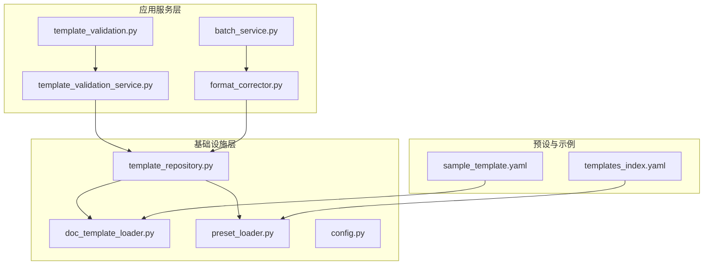
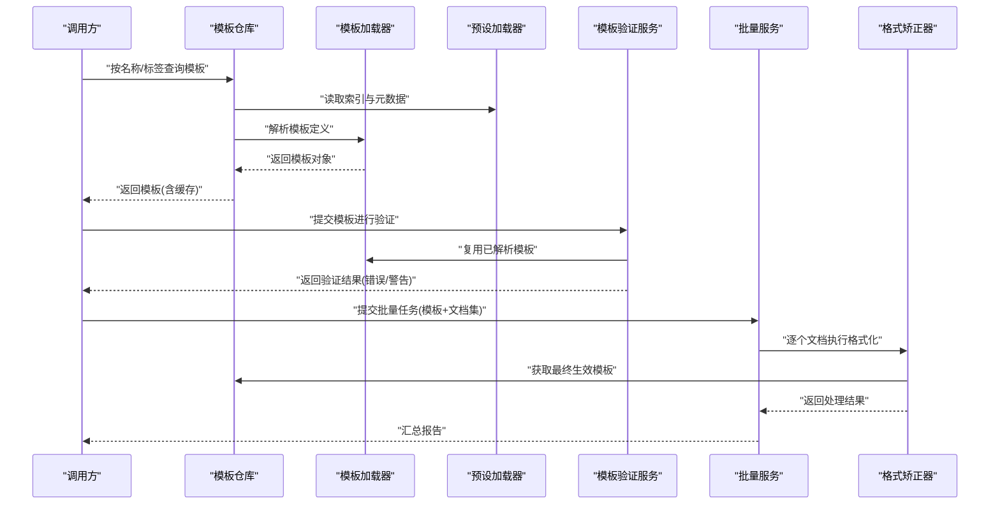
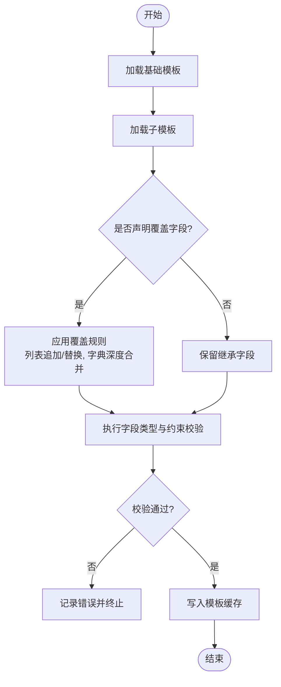
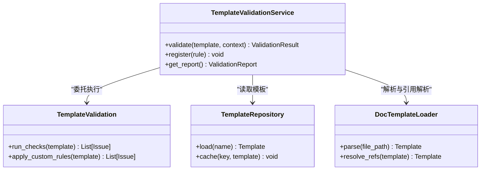
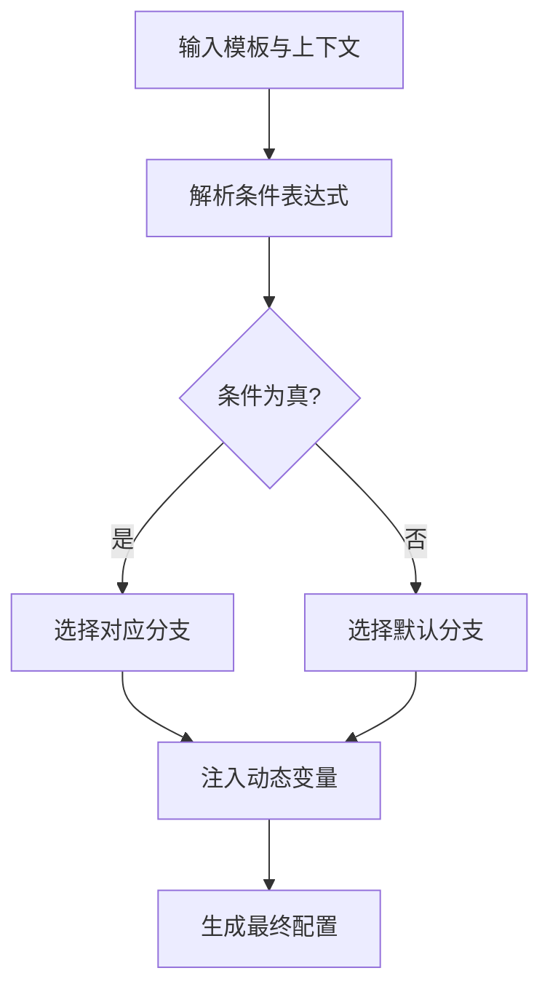
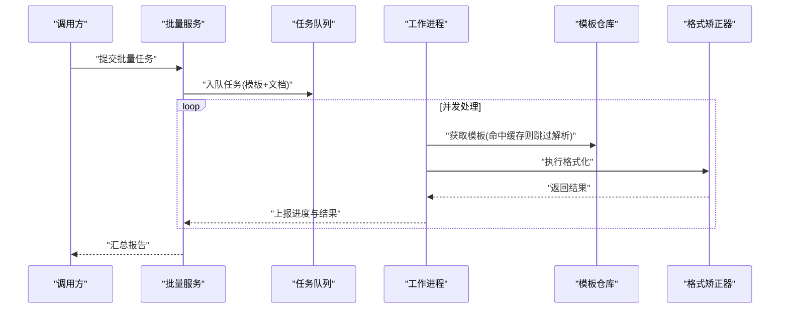
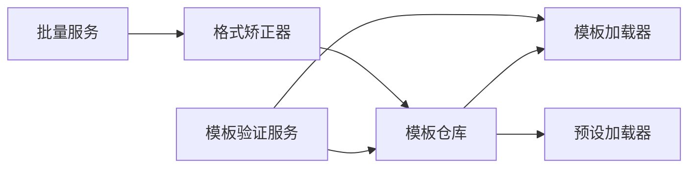

# 高级配置特性

<cite>
**本文引用的文件**   
- [src/paper_format_corrector/application/services/template_validation.py](file://src/paper_format_corrector/application/services/template_validation.py)
- [src/paper_format_corrector/application/services/template_validation_service.py](file://src/paper_format_corrector/application/services/template_validation_service.py)
- [src/paper_format_corrector/infra/template_repository.py](file://src/paper_format_corrector/infra/template_repository.py)
- [src/paper_format_corrector/infra/doc_template_loader.py](file://src/paper_format_corrector/infra/doc_template_loader.py)
- [src/paper_format_corrector/infra/preset_loader.py](file://src/paper_format_corrector/infra/preset_loader.py)
- [src/paper_format_corrector/application/services/batch_service.py](file://src/paper_format_corrector/application/services/batch_service.py)
- [src/paper_format_corrector/core/format_corrector.py](file://src/paper_format_corrector/core/format_corrector.py)
- [src/paper_format_corrector/infrastructure/config/config.py](file://src/paper_format_corrector/infrastructure/config/config.py)
- [presets/templates_index.yaml](file://presets/templates_index.yaml)
- [examples/sample_template.yaml](file://examples/sample_template.yaml)
</cite>

## 目录
1. [简介](#简介)
2. [项目结构](#项目结构)
3. [核心组件](#核心组件)
4. [架构总览](#架构总览)
5. [详细组件分析](#详细组件分析)
6. [依赖关系分析](#依赖关系分析)
7. [性能考虑](#性能考虑)
8. [故障排查指南](#故障排查指南)
9. [结论](#结论)
10. [附录](#附录)

## 简介
本章节聚焦“模板高级配置特性”，围绕以下主题展开：
- 模板继承机制：如何基于现有模板创建新模板、字段覆盖规则与继承链管理
- 条件配置与动态配置：在运行时根据上下文选择或计算配置项
- 模板验证规则与自定义验证逻辑：确保模板正确性与一致性
- 性能优化配置、缓存策略与批量处理：提升大规模模板与文档处理的效率
- 最佳实践与常见问题解决方案：落地指导与排错要点

## 项目结构
与模板高级配置相关的代码主要分布在应用服务层、基础设施层以及预设模板资源中。下图给出与“模板高级配置”直接相关的模块概览。

图表来源
- [src/paper_format_corrector/application/services/template_validation.py](file://src/paper_format_corrector/application/services/template_validation.py)
- [src/paper_format_corrector/application/services/template_validation_service.py](file://src/paper_format_corrector/application/services/template_validation_service.py)
- [src/paper_format_corrector/infra/template_repository.py](file://src/paper_format_corrector/infra/template_repository.py)
- [src/paper_format_corrector/infra/doc_template_loader.py](file://src/paper_format_corrector/infra/doc_template_loader.py)
- [src/paper_format_corrector/infra/preset_loader.py](file://src/paper_format_corrector/infra/preset_loader.py)
- [src/paper_format_corrector/application/services/batch_service.py](file://src/paper_format_corrector/application/services/batch_service.py)
- [src/paper_format_corrector/core/format_corrector.py](file://src/paper_format_corrector/core/format_corrector.py)
- [src/paper_format_corrector/infrastructure/config/config.py](file://src/paper_format_corrector/infrastructure/config/config.py)
- [presets/templates_index.yaml](file://presets/templates_index.yaml)
- [examples/sample_template.yaml](file://examples/sample_template.yaml)

章节来源
- [src/paper_format_corrector/application/services/template_validation.py](file://src/paper_format_corrector/application/services/template_validation.py)
- [src/paper_format_corrector/application/services/template_validation_service.py](file://src/paper_format_corrector/application/services/template_validation_service.py)
- [src/paper_format_corrector/infra/template_repository.py](file://src/paper_format_corrector/infra/template_repository.py)
- [src/paper_format_corrector/infra/doc_template_loader.py](file://src/paper_format_corrector/infra/doc_template_loader.py)
- [src/paper_format_corrector/infra/preset_loader.py](file://src/paper_format_corrector/infra/preset_loader.py)
- [src/paper_format_corrector/application/services/batch_service.py](file://src/paper_format_corrector/application/services/batch_service.py)
- [src/paper_format_corrector/core/format_corrector.py](file://src/paper_format_corrector/core/format_corrector.py)
- [src/paper_format_corrector/infrastructure/config/config.py](file://src/paper_format_corrector/infrastructure/config/config.py)
- [presets/templates_index.yaml](file://presets/templates_index.yaml)
- [examples/sample_template.yaml](file://examples/sample_template.yaml)

## 核心组件
- 模板仓库（TemplateRepository）
  - 职责：统一加载、解析、合并与缓存模板；维护模板索引与版本信息；提供按名称/标签检索能力。
  - 关键点：支持从本地文件系统与远端仓库拉取；对已解析的模板进行内存缓存，避免重复IO与解析开销。
- 文档模板加载器（DocTemplateLoader）
  - 职责：将YAML/JSON等格式的模板定义转换为内部模型；负责字段校验、默认值填充与类型转换。
  - 关键点：支持嵌套字段、引用外部片段、条件分支与变量插值。
- 预设加载器（PresetLoader）
  - 职责：加载内置预设模板集合（如各高校/期刊模板），并生成索引以便快速发现可用模板。
  - 关键点：通过索引文件聚合元数据，减少扫描成本。
- 模板验证服务（TemplateValidationService）与验证器（TemplateValidation）
  - 职责：执行模板结构的静态检查、字段约束与业务规则校验；收集错误与警告；支持扩展自定义验证器。
  - 关键点：分层校验（语法、语义、业务）、可插拔验证器注册表、结果汇总与报告输出。
- 批量服务（BatchService）
  - 职责：编排大批量模板/文档的处理任务，包括并发控制、重试与进度上报。
  - 关键点：结合格式矫正器（FormatCorrector）完成端到端流水线。
- 格式矫正器（FormatCorrector）
  - 职责：依据模板与配置对文档执行样式修正、段落/表格/图片等元素处理。
  - 关键点：与模板仓库协作获取最终生效模板；支持按需启用插件与处理器。
- 配置中心（Config）
  - 职责：集中管理全局配置项，包括缓存开关、并发度、超时、日志级别等。
  - 关键点：支持多环境覆盖与环境变量注入。

章节来源
- [src/paper_format_corrector/infra/template_repository.py](file://src/paper_format_corrector/infra/template_repository.py)
- [src/paper_format_corrector/infra/doc_template_loader.py](file://src/paper_format_corrector/infra/doc_template_loader.py)
- [src/paper_format_corrector/infra/preset_loader.py](file://src/paper_format_corrector/infra/preset_loader.py)
- [src/paper_format_corrector/application/services/template_validation.py](file://src/paper_format_corrector/application/services/template_validation.py)
- [src/paper_format_corrector/application/services/template_validation_service.py](file://src/paper_format_corrector/application/services/template_validation_service.py)
- [src/paper_format_corrector/application/services/batch_service.py](file://src/paper_format_corrector/application/services/batch_service.py)
- [src/paper_format_corrector/core/format_corrector.py](file://src/paper_format_corrector/core/format_corrector.py)
- [src/paper_format_corrector/infrastructure/config/config.py](file://src/paper_format_corrector/infrastructure/config/config.py)

## 架构总览
下图展示“模板高级配置”在系统中的调用关系与数据流。

图表来源
- [src/paper_format_corrector/infra/template_repository.py](file://src/paper_format_corrector/infra/template_repository.py)
- [src/paper_format_corrector/infra/doc_template_loader.py](file://src/paper_format_corrector/infra/doc_template_loader.py)
- [src/paper_format_corrector/infra/preset_loader.py](file://src/paper_format_corrector/infra/preset_loader.py)
- [src/paper_format_corrector/application/services/template_validation_service.py](file://src/paper_format_corrector/application/services/template_validation_service.py)
- [src/paper_format_corrector/application/services/batch_service.py](file://src/paper_format_corrector/application/services/batch_service.py)
- [src/paper_format_corrector/core/format_corrector.py](file://src/paper_format_corrector/core/format_corrector.py)

## 详细组件分析

### 模板继承机制
- 继承方式
  - 基于现有模板创建新模板：通过声明式字段覆盖实现，新模板仅声明差异部分，其余字段沿用父模板。
  - 多继承与优先级：当存在多个父模板时，按声明顺序自顶向下合并，后声明的父模板具有更高优先级。
  - 字段覆盖规则：同名字段会被子模板覆盖；列表型字段可选择追加或替换；字典型字段支持深度合并。
- 继承链管理
  - 模板仓库负责构建继承图，检测循环依赖并报错；同时维护解析后的模板树，便于快速定位最终生效字段。
  - 预置模板作为基础模板，用户模板通过索引注册，形成“系统预设 -> 组织模板 -> 个人模板”的分层体系。
- 条件配置与动态配置
  - 条件配置：在模板中使用条件表达式选择不同字段组合，例如按学科、学校或目标期刊切换样式。
  - 动态配置：支持在运行时注入变量（如作者、标题、日期），由加载器在执行阶段进行插值与求值。
- 验证与回退
  - 若覆盖字段类型不匹配或缺失必填项，验证器会返回具体错误路径；未满足条件分支时，自动回退到默认分支。

图表来源
- [src/paper_format_corrector/infra/template_repository.py](file://src/paper_format_corrector/infra/template_repository.py)
- [src/paper_format_corrector/infra/doc_template_loader.py](file://src/paper_format_corrector/infra/doc_template_loader.py)
- [src/paper_format_corrector/infra/preset_loader.py](file://src/paper_format_corrector/infra/preset_loader.py)

章节来源
- [src/paper_format_corrector/infra/template_repository.py](file://src/paper_format_corrector/infra/template_repository.py)
- [src/paper_format_corrector/infra/doc_template_loader.py](file://src/paper_format_corrector/infra/doc_template_loader.py)
- [src/paper_format_corrector/infra/preset_loader.py](file://src/paper_format_corrector/infra/preset_loader.py)
- [presets/templates_index.yaml](file://presets/templates_index.yaml)
- [examples/sample_template.yaml](file://examples/sample_template.yaml)

### 模板验证规则与自定义验证逻辑
- 内置验证规则
  - 结构完整性：必填字段、字段类型、枚举值范围、唯一性约束。
  - 语义一致性：跨字段关联校验（如页眉页脚与章节样式的一致性）。
  - 兼容性检查：与目标文档格式（如docx）特性的兼容提示。
- 自定义验证器
  - 通过验证服务提供的注册接口添加自定义规则；每个验证器接收模板对象与上下文，返回成功或错误列表。
  - 支持分组与优先级，便于在不同阶段（语法、语义、业务）执行。
- 验证结果
  - 结构化输出：包含错误位置、消息与建议修复方案；支持导出为报告供后续流程使用。

图表来源
- [src/paper_format_corrector/application/services/template_validation_service.py](file://src/paper_format_corrector/application/services/template_validation_service.py)
- [src/paper_format_corrector/application/services/template_validation.py](file://src/paper_format_corrector/application/services/template_validation.py)
- [src/paper_format_corrector/infra/template_repository.py](file://src/paper_format_corrector/infra/template_repository.py)
- [src/paper_format_corrector/infra/doc_template_loader.py](file://src/paper_format_corrector/infra/doc_template_loader.py)

章节来源
- [src/paper_format_corrector/application/services/template_validation_service.py](file://src/paper_format_corrector/application/services/template_validation_service.py)
- [src/paper_format_corrector/application/services/template_validation.py](file://src/paper_format_corrector/application/services/template_validation.py)

### 条件配置与动态配置
- 条件配置
  - 在模板中声明条件分支，根据上下文（如学校、学科、目标期刊）选择不同样式块。
  - 条件表达式支持布尔运算与简单函数调用，便于复杂场景判断。
- 动态配置
  - 运行期注入变量：作者、标题、日期、机构等；加载器在解析阶段进行插值与求值。
  - 变量作用域：支持全局与局部作用域，避免命名冲突。
- 回退与默认值
  - 当条件不满足或变量缺失时，采用默认值或回退分支，保证模板可用性。

图表来源
- [src/paper_format_corrector/infra/doc_template_loader.py](file://src/paper_format_corrector/infra/doc_template_loader.py)
- [src/paper_format_corrector/infra/template_repository.py](file://src/paper_format_corrector/infra/template_repository.py)

章节来源
- [src/paper_format_corrector/infra/doc_template_loader.py](file://src/paper_format_corrector/infra/doc_template_loader.py)
- [src/paper_format_corrector/infra/template_repository.py](file://src/paper_format_corrector/infra/template_repository.py)

### 性能优化配置、缓存策略与批量处理
- 缓存策略
  - 模板解析缓存：对已解析的模板对象进行内存缓存，键包含模板名称、版本与关键哈希，避免重复IO与解析。
  - 索引缓存：预设模板索引在启动时加载并缓存，加速模板发现。
- 并发与批处理
  - 批量服务支持并发任务队列，限制最大并发数以避免资源争用；失败任务支持重试与隔离。
  - 与格式矫正器协作，按批次提交文档处理任务，汇总结果与错误统计。
- 配置项建议
  - 开启缓存开关、设置合理的并发度与超时时间；在大规模处理时启用增量更新与懒加载。

图表来源
- [src/paper_format_corrector/application/services/batch_service.py](file://src/paper_format_corrector/application/services/batch_service.py)
- [src/paper_format_corrector/core/format_corrector.py](file://src/paper_format_corrector/core/format_corrector.py)
- [src/paper_format_corrector/infra/template_repository.py](file://src/paper_format_corrector/infra/template_repository.py)

章节来源
- [src/paper_format_corrector/application/services/batch_service.py](file://src/paper_format_corrector/application/services/batch_service.py)
- [src/paper_format_corrector/core/format_corrector.py](file://src/paper_format_corrector/core/format_corrector.py)
- [src/paper_format_corrector/infra/template_repository.py](file://src/paper_format_corrector/infra/template_repository.py)

## 依赖关系分析
- 组件耦合
  - 模板仓库依赖加载器与预设加载器，承担统一入口与缓存职责。
  - 验证服务依赖仓库与加载器，复用已解析模板以提升性能。
  - 批量服务依赖格式矫正器与仓库，形成端到端处理链路。
- 外部依赖
  - 文件系统与可能的远端仓库访问；配置文件与环境变量注入。
- 潜在风险
  - 循环继承与大型模板导致的解析耗时；需通过缓存与索引优化缓解。
  - 高并发下的资源竞争；需合理设置并发度与超时。

图表来源
- [src/paper_format_corrector/infra/template_repository.py](file://src/paper_format_corrector/infra/template_repository.py)
- [src/paper_format_corrector/infra/doc_template_loader.py](file://src/paper_format_corrector/infra/doc_template_loader.py)
- [src/paper_format_corrector/infra/preset_loader.py](file://src/paper_format_corrector/infra/preset_loader.py)
- [src/paper_format_corrector/application/services/template_validation_service.py](file://src/paper_format_corrector/application/services/template_validation_service.py)
- [src/paper_format_corrector/application/services/batch_service.py](file://src/paper_format_corrector/application/services/batch_service.py)
- [src/paper_format_corrector/core/format_corrector.py](file://src/paper_format_corrector/core/format_corrector.py)

章节来源
- [src/paper_format_corrector/infra/template_repository.py](file://src/paper_format_corrector/infra/template_repository.py)
- [src/paper_format_corrector/infra/doc_template_loader.py](file://src/paper_format_corrector/infra/doc_template_loader.py)
- [src/paper_format_corrector/infra/preset_loader.py](file://src/paper_format_corrector/infra/preset_loader.py)
- [src/paper_format_corrector/application/services/template_validation_service.py](file://src/paper_format_corrector/application/services/template_validation_service.py)
- [src/paper_format_corrector/application/services/batch_service.py](file://src/paper_format_corrector/application/services/batch_service.py)
- [src/paper_format_corrector/core/format_corrector.py](file://src/paper_format_corrector/core/format_corrector.py)

## 性能考虑
- 缓存优先：充分利用模板解析缓存与索引缓存，减少重复IO与解析。
- 并发调优：根据CPU与I/O能力调整并发度，避免过度并行导致抖动。
- 懒加载与增量更新：仅在需要时加载大模板，变更时增量刷新缓存。
- 监控与度量：记录解析耗时、缓存命中率与任务成功率，持续优化。

## 故障排查指南
- 常见错误
  - 模板继承循环：检查继承声明，确保无环依赖。
  - 字段类型不匹配：对照验证报告中的错误路径，修正类型或默认值。
  - 条件分支未命中：确认上下文变量是否正确注入，必要时增加默认分支。
- 诊断步骤
  - 启用详细日志，查看模板加载与验证过程。
  - 使用最小化模板复现问题，逐步扩大范围定位根因。
  - 检查缓存状态与索引一致性，必要时清理缓存重建。

章节来源
- [src/paper_format_corrector/application/services/template_validation_service.py](file://src/paper_format_corrector/application/services/template_validation_service.py)
- [src/paper_format_corrector/infra/template_repository.py](file://src/paper_format_corrector/infra/template_repository.py)

## 结论
模板高级配置通过继承机制、条件与动态配置、严格验证与高性能缓存，提供了灵活且可靠的模板管理能力。配合批量处理与配置中心，可在大规模场景中稳定运行。遵循最佳实践与排错指南，可显著提升开发效率与系统稳定性。

## 附录
- 示例模板参考：用于理解字段结构与覆盖方式
- 模板索引参考：了解预设模板的组织与元数据

章节来源
- [examples/sample_template.yaml](file://examples/sample_template.yaml)
- [presets/templates_index.yaml](file://presets/templates_index.yaml)