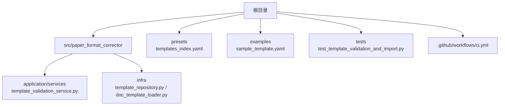
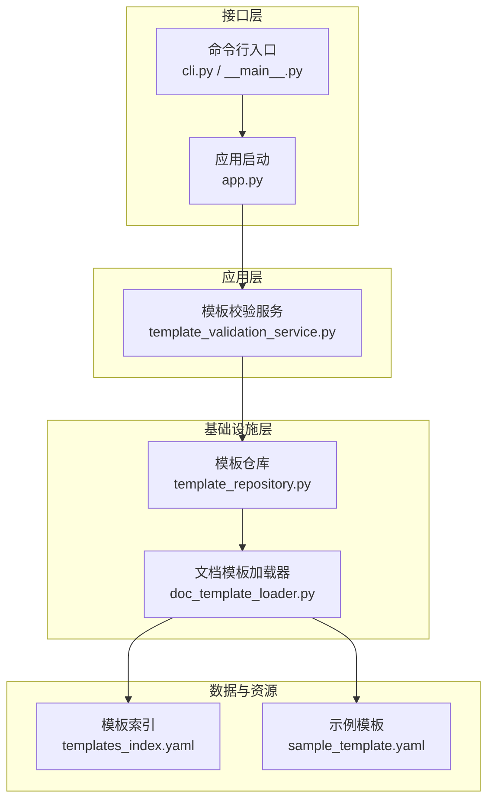
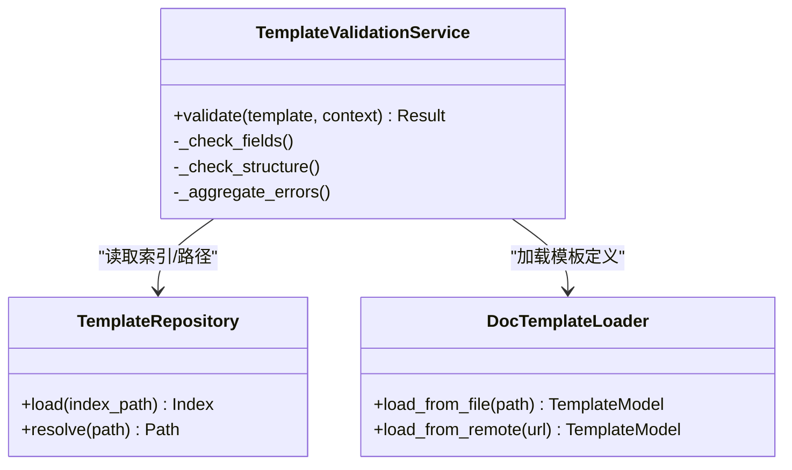
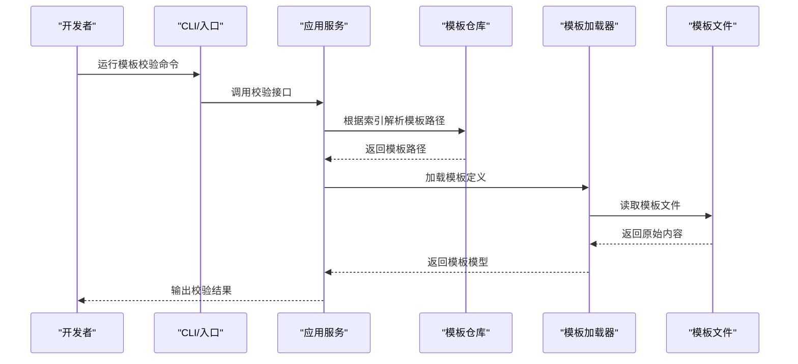
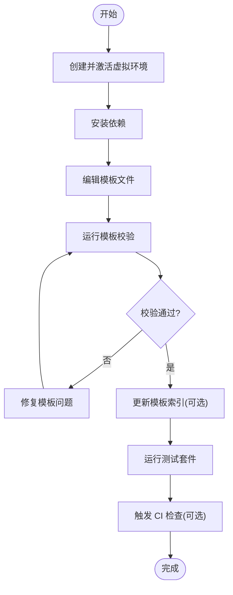
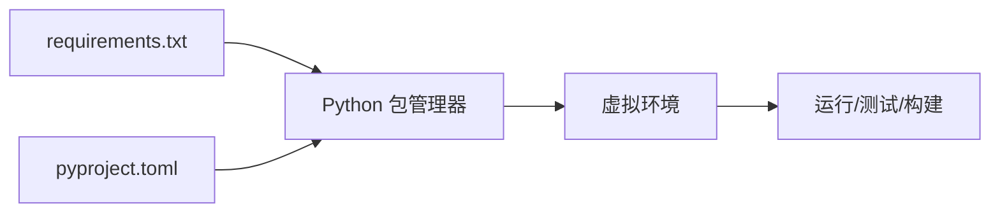

# 开发环境搭建

<cite>
**本文引用的文件**   
- [README.md](file://README.md)
- [requirements.txt](file://requirements.txt)
- [pyproject.toml](file://pyproject.toml)
- [run.py](file://run.py)
- [src/paper_format_corrector/__main__.py](file://src/paper_format_corrector/__main__.py)
- [src/paper_format_corrector/app.py](file://src/paper_format_corrector/app.py)
- [src/paper_format_corrector/cli.py](file://src/paper_format_corrector/cli.py)
- [src/paper_format_corrector/application/services/template_validation_service.py](file://src/paper_format_corrector/application/services/template_validation_service.py)
- [src/paper_format_corrector/infra/template_repository.py](file://src/paper_format_corrector/infra/template_repository.py)
- [src/paper_format_corrector/infra/doc_template_loader.py](file://src/paper_format_corrector/infra/doc_template_loader.py)
- [presets/templates_index.yaml](file://presets/templates_index.yaml)
- [examples/sample_template.yaml](file://examples/sample_template.yaml)
- [tests/test_template_validation_and_import.py](file://tests/test_template_validation_and_import.py)
- [tests/conftest.py](file://tests/conftest.py)
- [.github/workflows/ci.yml](file://.github/workflows/ci.yml)
</cite>

## 目录
1. [简介](#简介)
2. [项目结构](#项目结构)
3. [核心组件](#核心组件)
4. [架构总览](#架构总览)
5. [详细组件分析](#详细组件分析)
6. [依赖分析](#依赖分析)
7. [性能考虑](#性能考虑)
8. [故障排除指南](#故障排除指南)
9. [结论](#结论)
10. [附录](#附录)

## 简介
本指南面向模板开发者，提供从零开始搭建论文格式矫正工具“模板开发环境”的完整步骤。内容涵盖：
- Python 环境与依赖安装（含虚拟环境、包管理）
- 模板验证工具与测试套件配置
- 调试与运行入口说明
- IDE 与工作流建议
- 常见环境问题排查

## 项目结构
本项目采用分层与领域驱动相结合的组织方式，模板相关能力主要分布在以下位置：
- 应用服务层：模板校验与服务编排
- 基础设施层：模板仓库与加载器
- 预设模板与示例：用于本地开发与验证
- 测试用例：覆盖模板导入与校验流程
- 工作流：CI 中定义了常用命令与检查

图表来源
- [src/paper_format_corrector/application/services/template_validation_service.py](file://src/paper_format_corrector/application/services/template_validation_service.py)
- [src/paper_format_corrector/infra/template_repository.py](file://src/paper_format_corrector/infra/template_repository.py)
- [src/paper_format_corrector/infra/doc_template_loader.py](file://src/paper_format_corrector/infra/doc_template_loader.py)
- [presets/templates_index.yaml](file://presets/templates_index.yaml)
- [examples/sample_template.yaml](file://examples/sample_template.yaml)
- [tests/test_template_validation_and_import.py](file://tests/test_template_validation_and_import.py)
- [.github/workflows/ci.yml](file://.github/workflows/ci.yml)

章节来源
- [README.md](file://README.md)
- [pyproject.toml](file://pyproject.toml)
- [requirements.txt](file://requirements.txt)
- [.github/workflows/ci.yml](file://.github/workflows/ci.yml)

## 核心组件
- 模板校验服务：封装模板规则解析、字段校验、错误聚合等逻辑，供上层调用。
- 模板仓库：负责模板索引、路径解析、版本与来源管理。
- 文档模板加载器：从文件系统或远程源加载模板定义，并转换为内部模型。
- 测试套件：针对模板导入与校验的关键路径进行断言与回归保护。

章节来源
- [src/paper_format_corrector/application/services/template_validation_service.py](file://src/paper_format_corrector/application/services/template_validation_service.py)
- [src/paper_format_corrector/infra/template_repository.py](file://src/paper_format_corrector/infra/template_repository.py)
- [src/paper_format_corrector/infra/doc_template_loader.py](file://src/paper_format_corrector/infra/doc_template_loader.py)
- [tests/test_template_validation_and_import.py](file://tests/test_template_validation_and_import.py)

## 架构总览
下图展示了模板开发环境中的关键交互：CLI/GUI/API 通过应用服务调用模板校验与加载能力，最终访问模板仓库与本地/远端模板资源。

图表来源
- [src/paper_format_corrector/cli.py](file://src/paper_format_corrector/cli.py)
- [src/paper_format_corrector/__main__.py](file://src/paper_format_corrector/__main__.py)
- [src/paper_format_corrector/app.py](file://src/paper_format_corrector/app.py)
- [src/paper_format_corrector/application/services/template_validation_service.py](file://src/paper_format_corrector/application/services/template_validation_service.py)
- [src/paper_format_corrector/infra/template_repository.py](file://src/paper_format_corrector/infra/template_repository.py)
- [src/paper_format_corrector/infra/doc_template_loader.py](file://src/paper_format_corrector/infra/doc_template_loader.py)
- [presets/templates_index.yaml](file://presets/templates_index.yaml)
- [examples/sample_template.yaml](file://examples/sample_template.yaml)

## 详细组件分析

### 模板校验服务（Template Validation Service）
职责
- 接收模板定义与上下文参数
- 执行字段级与结构级校验
- 返回结构化结果（通过/失败 + 错误详情）

关键点
- 与模板仓库解耦，便于替换存储后端
- 可组合多种校验规则，支持扩展

图表来源
- [src/paper_format_corrector/application/services/template_validation_service.py](file://src/paper_format_corrector/application/services/template_validation_service.py)
- [src/paper_format_corrector/infra/template_repository.py](file://src/paper_format_corrector/infra/template_repository.py)
- [src/paper_format_corrector/infra/doc_template_loader.py](file://src/paper_format_corrector/infra/doc_template_loader.py)

章节来源
- [src/paper_format_corrector/application/services/template_validation_service.py](file://src/paper_format_corrector/application/services/template_validation_service.py)

### 模板仓库与加载器（Template Repository & Loader）
职责
- 模板仓库：维护模板索引、解析路径、定位具体模板文件
- 加载器：将 YAML/JSON 等格式的模板定义载入为内部模型，供校验服务使用

图表来源
- [src/paper_format_corrector/cli.py](file://src/paper_format_corrector/cli.py)
- [src/paper_format_corrector/__main__.py](file://src/paper_format_corrector/__main__.py)
- [src/paper_format_corrector/app.py](file://src/paper_format_corrector/app.py)
- [src/paper_format_corrector/infra/template_repository.py](file://src/paper_format_corrector/infra/template_repository.py)
- [src/paper_format_corrector/infra/doc_template_loader.py](file://src/paper_format_corrector/infra/doc_template_loader.py)
- [presets/templates_index.yaml](file://presets/templates_index.yaml)
- [examples/sample_template.yaml](file://examples/sample_template.yaml)

章节来源
- [src/paper_format_corrector/infra/template_repository.py](file://src/paper_format_corrector/infra/template_repository.py)
- [src/paper_format_corrector/infra/doc_template_loader.py](file://src/paper_format_corrector/infra/doc_template_loader.py)
- [presets/templates_index.yaml](file://presets/templates_index.yaml)
- [examples/sample_template.yaml](file://examples/sample_template.yaml)

### 模板开发工作流程（建议）
- 准备环境：创建虚拟环境，安装依赖
- 编写模板：在 examples 下新增 sample_template.yaml 作为草稿
- 本地验证：通过 CLI 或测试用例对模板进行快速校验
- 加入索引：如需纳入内置集合，更新 templates_index.yaml
- 提交前自检：运行测试与 CI 预检

[此图为概念流程图，无需源码映射]

## 依赖分析
- 运行时依赖：由 requirements.txt 与 pyproject.toml 共同声明，确保本地与 CI 一致
- 开发依赖：测试、代码质量与构建工具通常包含在开发依赖中
- 入口点：__main__.py 与 cli.py 提供命令行入口；app.py 提供应用初始化

图表来源
- [requirements.txt](file://requirements.txt)
- [pyproject.toml](file://pyproject.toml)
- [src/paper_format_corrector/__main__.py](file://src/paper_format_corrector/__main__.py)
- [src/paper_format_corrector/cli.py](file://src/paper_format_corrector/cli.py)
- [src/paper_format_corrector/app.py](file://src/paper_format_corrector/app.py)

章节来源
- [requirements.txt](file://requirements.txt)
- [pyproject.toml](file://pyproject.toml)
- [src/paper_format_corrector/__main__.py](file://src/paper_format_corrector/__main__.py)
- [src/paper_format_corrector/cli.py](file://src/paper_format_corrector/cli.py)
- [src/paper_format_corrector/app.py](file://src/paper_format_corrector/app.py)

## 性能考虑
- 模板加载缓存：对频繁使用的模板定义进行内存缓存，减少重复 I/O
- 增量校验：仅对变更的模板片段执行校验，降低整体耗时
- 并行处理：批量模板校验时，按任务粒度并发执行
- 资源限制：避免一次性加载超大模板集，按需懒加载

[本节为通用指导，不直接分析具体文件]

## 故障排除指南
常见问题与解决思路
- 依赖缺失或版本冲突
  - 现象：导入错误或运行时异常
  - 处理：重新创建虚拟环境，严格使用 requirements.txt 与 pyproject.toml 同步依赖
- 模板路径或索引错误
  - 现象：找不到模板文件或索引项无效
  - 处理：核对 templates_index.yaml 的路径与文件名一致性，确认相对/绝对路径
- 模板语法错误
  - 现象：校验失败，提示字段缺失或类型不符
  - 处理：参考示例模板结构与字段约束，逐步缩小范围定位
- 权限或编码问题
  - 现象：无法读取模板文件或中文乱码
  - 处理：检查文件权限与编码（UTF-8），必要时显式指定编码
- 测试无法运行
  - 现象：测试报错或找不到夹具
  - 处理：确认 conftest.py 已正确加载，测试数据路径有效

章节来源
- [tests/conftest.py](file://tests/conftest.py)
- [tests/test_template_validation_and_import.py](file://tests/test_template_validation_and_import.py)

## 结论
通过本指南，您可以快速搭建模板开发环境，掌握模板校验与加载的核心流程，并在本地高效迭代模板。结合测试与 CI，可保障模板质量与稳定性。

## 附录

### 环境搭建步骤（推荐）
- 系统要求
  - Python 版本：建议使用与项目兼容的 3.x 版本（以 pyproject.toml 为准）
- 创建虚拟环境
  - 在项目根目录创建并激活虚拟环境
- 安装依赖
  - 使用 requirements.txt 安装运行时依赖
  - 若需开发工具，参考 pyproject.toml 中的开发依赖
- 验证安装
  - 运行 CLI 或最小化脚本，确认无导入错误
- 运行模板校验
  - 使用 CLI 或测试用例对示例模板进行校验

章节来源
- [requirements.txt](file://requirements.txt)
- [pyproject.toml](file://pyproject.toml)
- [src/paper_format_corrector/cli.py](file://src/paper_format_corrector/cli.py)
- [src/paper_format_corrector/__main__.py](file://src/paper_format_corrector/__main__.py)
- [examples/sample_template.yaml](file://examples/sample_template.yaml)

### IDE 与工作区设置建议
- 解释器
  - 指向项目虚拟环境的 Python 解释器
- 代码风格与检查
  - 启用 Lint 与格式化插件，遵循项目现有规范
- 调试配置
  - 添加“模块”或“脚本”运行配置，指向 __main__.py 或 cli.py
  - 设置工作目录为项目根目录，以便相对路径生效
- 测试配置
  - 使用 pytest 发现 tests 目录下的用例
  - 将 conftest.py 所在目录加入 PYTHONPATH（IDE 自动识别即可）

章节来源
- [src/paper_format_corrector/__main__.py](file://src/paper_format_corrector/__main__.py)
- [src/paper_format_corrector/cli.py](file://src/paper_format_corrector/cli.py)
- [tests/conftest.py](file://tests/conftest.py)

### 持续集成与本地预检
- CI 工作流
  - .github/workflows/ci.yml 定义了自动化检查流程，可在本地复现相同命令
- 本地预检建议
  - 运行测试套件
  - 执行静态检查与格式化（如项目启用）
  - 校验模板索引与示例模板的一致性

章节来源
- [.github/workflows/ci.yml](file://.github/workflows/ci.yml)