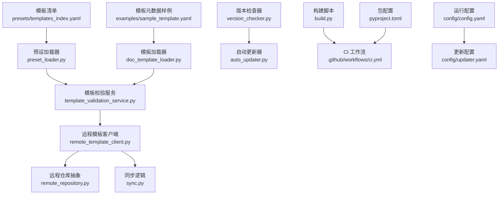
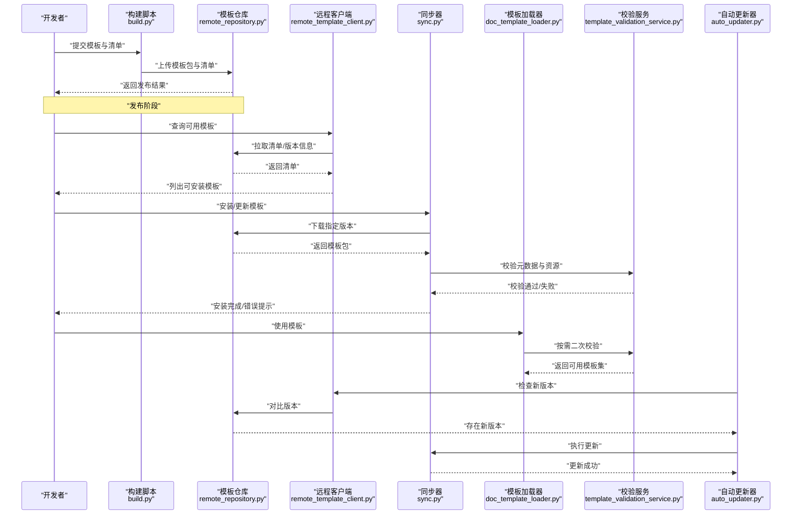
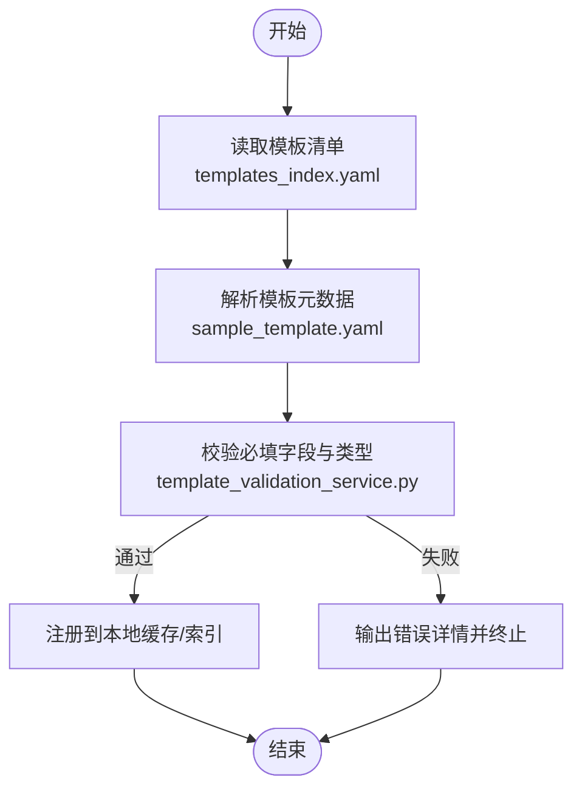
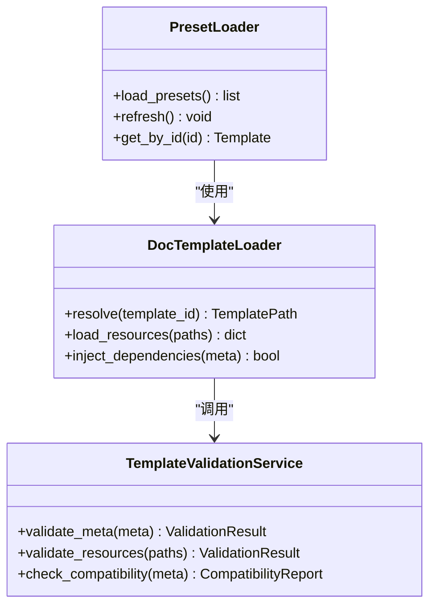
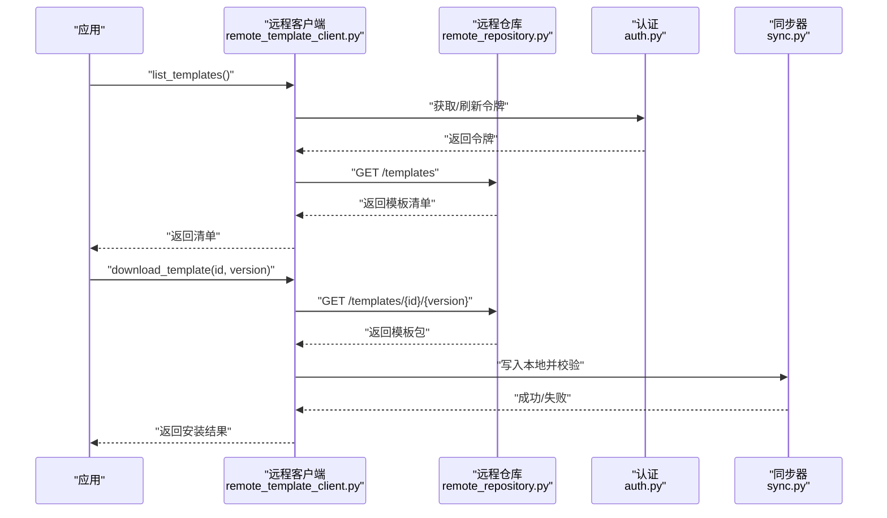
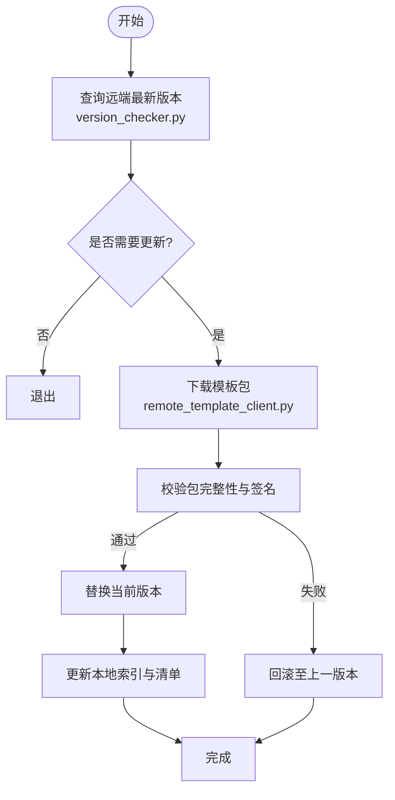
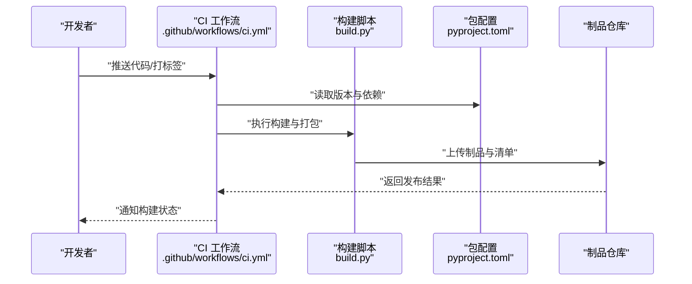
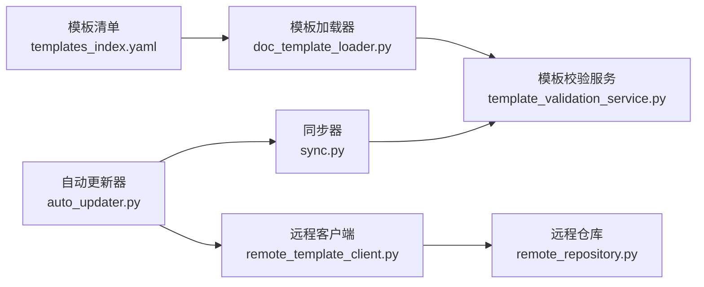

# 模板发布与分发

<cite>
**本文引用的文件**   
- [README.md](file://README.md)
- [pyproject.toml](file://pyproject.toml)
- [build.py](file://build.py)
- [config/config.yaml](file://config/config.yaml)
- [config/updater.yaml](file://config/updater.yaml)
- [presets/templates_index.yaml](file://presets/templates_index.yaml)
- [presets/academic_paper.yaml](file://presets/academic_paper.yaml)
- [src/paper_format_corrector/infra/template_repository.py](file://src/paper_format_corrector/infra/template_repository.py)
- [src/paper_format_corrector/infra/doc_template_loader.py](file://src/paper_format_corrector/infra/doc_template_loader.py)
- [src/paper_format_corrector/infra/preset_loader.py](file://src/paper_format_corrector/infra/preset_loader.py)
- [src/paper_format_corrector/application/services/university_template_import_service.py](file://src/paper_format_corrector/application/services/university_template_import_service.py)
- [src/paper_format_corrector/application/services/template_validation_service.py](file://src/paper_format_corrector/application/services/template_validation_service.py)
- [src/paper_format_corrector/infra/remote_template_client.py](file://src/paper_format_corrector/infra/remote_template_client.py)
- [src/paper_format_corrector/infra/remote/remote_repository.py](file://src/paper_format_corrector/infra/remote/remote_repository.py)
- [src/paper_format_corrector/infra/remote/sync.py](file://src/paper_format_corrector/infra/remote/sync.py)
- [src/paper_format_corrector/infra/remote/auth.py](file://src/paper_format_corrector/infra/remote/auth.py)
- [src/paper_format_corrector/infra/updater/version_checker.py](file://src/paper_format_corrector/infra/updater/version_checker.py)
- [src/paper_format_corrector/infra/updater/auto_updater.py](file://src/paper_format_corrector/infra/updater/auto_updater.py)
- [examples/sample_template.yaml](file://examples/sample_template.yaml)
- [docs/template_guide.md](file://docs/template_guide.md)
- [.github/workflows/ci.yml](file://.github/workflows/ci.yml)
</cite>

## 目录
1. [简介](#简介)
2. [项目结构](#项目结构)
3. [核心组件](#核心组件)
4. [架构总览](#架构总览)
5. [详细组件分析](#详细组件分析)
6. [依赖关系分析](#依赖关系分析)
7. [性能考虑](#性能考虑)
8. [故障排查指南](#故障排查指南)
9. [结论](#结论)
10. [附录](#附录)

## 简介
本文件面向模板作者与维护者，系统化说明模板的打包、注册、版本管理、兼容性处理、文档规范与元数据定义，以及模板市场上传与社区分享的最佳实践，并给出更新与维护策略。内容基于仓库中模板加载、校验、远程同步与自动更新等实现进行提炼，帮助读者从“本地开发”到“公开发布”的全链路落地。

## 项目结构
围绕模板发布与分发，仓库中与模板生态相关的核心位置如下：
- 模板清单与示例
  - presets/templates_index.yaml：模板索引（用于发现与展示）
  - examples/sample_template.yaml：模板元数据样例
  - docs/template_guide.md：模板编写指南
- 模板加载与校验
  - infra/preset_loader.py：预设/模板清单加载器
  - infra/doc_template_loader.py：文档模板加载器
  - application/services/template_validation_service.py：模板校验服务
  - application/services/university_template_import_service.py：高校模板导入服务
- 远程与分发
  - infra/remote_template_client.py：远程模板客户端
  - infra/remote/remote_repository.py：远程仓库抽象
  - infra/remote/sync.py：同步逻辑
  - infra/remote/auth.py：认证
- 版本与更新
  - infra/updater/version_checker.py：版本检查
  - infra/updater/auto_updater.py：自动更新
- 构建与流水线
  - build.py：构建脚本
  - .github/workflows/ci.yml：CI 工作流
  - pyproject.toml：包与入口配置
  - config/config.yaml、config/updater.yaml：运行时与更新配置

图表来源
- [presets/templates_index.yaml](file://presets/templates_index.yaml)
- [src/paper_format_corrector/infra/preset_loader.py](file://src/paper_format_corrector/infra/preset_loader.py)
- [examples/sample_template.yaml](file://examples/sample_template.yaml)
- [src/paper_format_corrector/infra/doc_template_loader.py](file://src/paper_format_corrector/infra/doc_template_loader.py)
- [src/paper_format_corrector/application/services/template_validation_service.py](file://src/paper_format_corrector/application/services/template_validation_service.py)
- [src/paper_format_corrector/infra/remote_template_client.py](file://src/paper_format_corrector/infra/remote_template_client.py)
- [src/paper_format_corrector/infra/remote/remote_repository.py](file://src/paper_format_corrector/infra/remote/remote_repository.py)
- [src/paper_format_corrector/infra/remote/sync.py](file://src/paper_format_corrector/infra/remote/sync.py)
- [src/paper_format_corrector/infra/updater/version_checker.py](file://src/paper_format_corrector/infra/updater/version_checker.py)
- [src/paper_format_corrector/infra/updater/auto_updater.py](file://src/paper_format_corrector/infra/updater/auto_updater.py)
- [build.py](file://build.py)
- [.github/workflows/ci.yml](file://.github/workflows/ci.yml)
- [pyproject.toml](file://pyproject.toml)
- [config/config.yaml](file://config/config.yaml)
- [config/updater.yaml](file://config/updater.yaml)

章节来源
- [README.md](file://README.md)
- [pyproject.toml](file://pyproject.toml)
- [build.py](file://build.py)
- [config/config.yaml](file://config/config.yaml)
- [config/updater.yaml](file://config/updater.yaml)
- [presets/templates_index.yaml](file://presets/templates_index.yaml)
- [examples/sample_template.yaml](file://examples/sample_template.yaml)
- [docs/template_guide.md](file://docs/template_guide.md)

## 核心组件
- 模板清单与元数据
  - templates_index.yaml：集中描述可用模板、版本、来源与分类，便于前端或工具发现。
  - sample_template.yaml：提供模板元数据字段参考，包括名称、版本、适用场景、依赖、许可证等。
- 模板加载与校验
  - preset_loader.py：解析清单与本地预设，建立可枚举的模板集合。
  - doc_template_loader.py：按清单定位并加载具体模板资源，完成路径解析与依赖注入。
  - template_validation_service.py：对模板元数据与资源进行一致性校验（必填项、格式、依赖完整性）。
- 远程分发与同步
  - remote_template_client.py：封装远端模板仓库的查询、下载、列表与更新接口。
  - remote_repository.py：统一远程仓库访问契约，屏蔽不同后端差异。
  - sync.py：增量同步、冲突检测与回滚策略。
  - auth.py：令牌获取、刷新与鉴权。
- 版本管理与自动更新
  - version_checker.py：对比本地与远端版本，计算升级路径。
  - auto_updater.py：执行下载、校验、替换与重启流程。
- 构建与 CI
  - build.py：打包模板产物、生成清单、签名与归档。
  - ci.yml：在推送/标签时触发构建、测试与发布。
  - pyproject.toml：定义包名、版本、入口点与依赖约束。

章节来源
- [presets/templates_index.yaml](file://presets/templates_index.yaml)
- [examples/sample_template.yaml](file://examples/sample_template.yaml)
- [src/paper_format_corrector/infra/preset_loader.py](file://src/paper_format_corrector/infra/preset_loader.py)
- [src/paper_format_corrector/infra/doc_template_loader.py](file://src/paper_format_corrector/infra/doc_template_loader.py)
- [src/paper_format_corrector/application/services/template_validation_service.py](file://src/paper_format_corrector/application/services/template_validation_service.py)
- [src/paper_format_corrector/infra/remote_template_client.py](file://src/paper_format_corrector/infra/remote_template_client.py)
- [src/paper_format_corrector/infra/remote/remote_repository.py](file://src/paper_format_corrector/infra/remote/remote_repository.py)
- [src/paper_format_corrector/infra/remote/sync.py](file://src/paper_format_corrector/infra/remote/sync.py)
- [src/paper_format_corrector/infra/remote/auth.py](file://src/paper_format_corrector/infra/remote/auth.py)
- [src/paper_format_corrector/infra/updater/version_checker.py](file://src/paper_format_corrector/infra/updater/version_checker.py)
- [src/paper_format_corrector/infra/updater/auto_updater.py](file://src/paper_format_corrector/infra/updater/auto_updater.py)
- [build.py](file://build.py)
- [.github/workflows/ci.yml](file://.github/workflows/ci.yml)
- [pyproject.toml](file://pyproject.toml)

## 架构总览
下图展示了模板从“开发—打包—注册—分发—安装—更新”的端到端流程，以及与本地加载、校验、同步和自动更新的交互。

图表来源
- [build.py](file://build.py)
- [src/paper_format_corrector/infra/remote/remote_repository.py](file://src/paper_format_corrector/infra/remote/remote_repository.py)
- [src/paper_format_corrector/infra/remote_template_client.py](file://src/paper_format_corrector/infra/remote_template_client.py)
- [src/paper_format_corrector/infra/remote/sync.py](file://src/paper_format_corrector/infra/remote/sync.py)
- [src/paper_format_corrector/infra/doc_template_loader.py](file://src/paper_format_corrector/infra/doc_template_loader.py)
- [src/paper_format_corrector/application/services/template_validation_service.py](file://src/paper_format_corrector/application/services/template_validation_service.py)
- [src/paper_format_corrector/infra/updater/auto_updater.py](file://src/paper_format_corrector/infra/updater/auto_updater.py)

## 详细组件分析

### 模板清单与元数据规范
- 清单文件（templates_index.yaml）
  - 作用：集中声明模板 ID、名称、版本、来源地址、分类、兼容范围、许可证等，供加载器与 UI 发现。
  - 建议字段：id、name、version、description、author、license、source_url、category、compatibility、tags、assets。
- 模板元数据样例（sample_template.yaml）
  - 作用：作为单个模板的元数据定义参考，包含模板基本信息、依赖、资源清单、入口脚本、校验规则等。
  - 建议字段：title、version、description、author、license、requires、entry、resources、rules、schema_version。
- 模板编写指南（template_guide.md）
  - 作用：指导如何组织模板目录、命名约定、资源引用方式、样式与规则文件组织、测试与验证方法。

图表来源
- [presets/templates_index.yaml](file://presets/templates_index.yaml)
- [examples/sample_template.yaml](file://examples/sample_template.yaml)
- [src/paper_format_corrector/application/services/template_validation_service.py](file://src/paper_format_corrector/application/services/template_validation_service.py)

章节来源
- [presets/templates_index.yaml](file://presets/templates_index.yaml)
- [examples/sample_template.yaml](file://examples/sample_template.yaml)
- [docs/template_guide.md](file://docs/template_guide.md)
- [src/paper_format_corrector/application/services/template_validation_service.py](file://src/paper_format_corrector/application/services/template_validation_service.py)

### 模板加载与校验
- 预设加载器（preset_loader.py）
  - 职责：扫描本地预设与清单，合并为统一的模板视图；支持热重载与增量更新。
- 文档模板加载器（doc_template_loader.py）
  - 职责：根据清单定位模板资源，解析相对路径，注入依赖，暴露统一 API 给上层使用。
- 模板校验服务（template_validation_service.py）
  - 职责：校验元数据完整性、资源可达性、依赖满足情况、向后兼容标记等。

图表来源
- [src/paper_format_corrector/infra/preset_loader.py](file://src/paper_format_corrector/infra/preset_loader.py)
- [src/paper_format_corrector/infra/doc_template_loader.py](file://src/paper_format_corrector/infra/doc_template_loader.py)
- [src/paper_format_corrector/application/services/template_validation_service.py](file://src/paper_format_corrector/application/services/template_validation_service.py)

章节来源
- [src/paper_format_corrector/infra/preset_loader.py](file://src/paper_format_corrector/infra/preset_loader.py)
- [src/paper_format_corrector/infra/doc_template_loader.py](file://src/paper_format_corrector/infra/doc_template_loader.py)
- [src/paper_format_corrector/application/services/template_validation_service.py](file://src/paper_format_corrector/application/services/template_validation_service.py)

### 远程分发与同步
- 远程模板客户端（remote_template_client.py）
  - 职责：封装远端仓库的查询、下载、列表、版本比较等 HTTP 操作。
- 远程仓库抽象（remote_repository.py）
  - 职责：定义统一接口，屏蔽不同存储后端（对象存储、Git、私有仓库）差异。
- 同步器（sync.py）
  - 职责：增量下载、去重、校验、回滚；支持断点续传与并发控制。
- 认证（auth.py）
  - 职责：令牌获取、刷新、重试与错误码映射。

图表来源
- [src/paper_format_corrector/infra/remote_template_client.py](file://src/paper_format_corrector/infra/remote_template_client.py)
- [src/paper_format_corrector/infra/remote/remote_repository.py](file://src/paper_format_corrector/infra/remote/remote_repository.py)
- [src/paper_format_corrector/infra/remote/sync.py](file://src/paper_format_corrector/infra/remote/sync.py)
- [src/paper_format_corrector/infra/remote/auth.py](file://src/paper_format_corrector/infra/remote/auth.py)

章节来源
- [src/paper_format_corrector/infra/remote_template_client.py](file://src/paper_format_corrector/infra/remote_template_client.py)
- [src/paper_format_corrector/infra/remote/remote_repository.py](file://src/paper_format_corrector/infra/remote/remote_repository.py)
- [src/paper_format_corrector/infra/remote/sync.py](file://src/paper_format_corrector/infra/remote/sync.py)
- [src/paper_format_corrector/infra/remote/auth.py](file://src/paper_format_corrector/infra/remote/auth.py)

### 版本管理与兼容性处理
- 版本检查器（version_checker.py）
  - 职责：解析语义化版本，比较本地与远端版本，计算升级路径与是否破坏性变更。
- 自动更新器（auto_updater.py）
  - 职责：触发更新流程，下载新包、校验、替换旧版本、记录日志与回滚。
- 高校模板导入服务（university_template_import_service.py）
  - 职责：批量导入与迁移历史模板，保证版本一致性与元数据规范化。

图表来源
- [src/paper_format_corrector/infra/updater/version_checker.py](file://src/paper_format_corrector/infra/updater/version_checker.py)
- [src/paper_format_corrector/infra/updater/auto_updater.py](file://src/paper_format_corrector/infra/updater/auto_updater.py)
- [src/paper_format_corrector/infra/remote_template_client.py](file://src/paper_format_corrector/infra/remote_template_client.py)
- [src/paper_format_corrector/application/services/university_template_import_service.py](file://src/paper_format_corrector/application/services/university_template_import_service.py)

章节来源
- [src/paper_format_corrector/infra/updater/version_checker.py](file://src/paper_format_corrector/infra/updater/version_checker.py)
- [src/paper_format_corrector/infra/updater/auto_updater.py](file://src/paper_format_corrector/infra/updater/auto_updater.py)
- [src/paper_format_corrector/application/services/university_template_import_service.py](file://src/paper_format_corrector/application/services/university_template_import_service.py)

### 构建与发布流水线
- 构建脚本（build.py）
  - 职责：收集模板资源、生成清单、压缩打包、生成校验和与签名、输出制品。
- CI 工作流（ci.yml）
  - 职责：在推送或打标签时触发构建、单元测试、模板校验、制品归档与发布。
- 包配置（pyproject.toml）
  - 职责：定义包名、版本、入口点、依赖约束，确保构建与安装一致性。
- 运行与更新配置（config/config.yaml、config/updater.yaml）
  - 职责：配置模板仓库地址、缓存目录、更新策略、超时与重试参数。

图表来源
- [.github/workflows/ci.yml](file://.github/workflows/ci.yml)
- [build.py](file://build.py)
- [pyproject.toml](file://pyproject.toml)

章节来源
- [build.py](file://build.py)
- [.github/workflows/ci.yml](file://.github/workflows/ci.yml)
- [pyproject.toml](file://pyproject.toml)
- [config/config.yaml](file://config/config.yaml)
- [config/updater.yaml](file://config/updater.yaml)

## 依赖关系分析
- 组件耦合
  - 清单与加载器：强耦合，清单字段变化需同步调整加载器解析逻辑。
  - 校验服务与加载器：校验前置，避免无效模板进入运行期。
  - 远程客户端与仓库抽象：弱耦合，通过接口适配不同后端。
  - 同步器与自动更新器：松耦合，通过事件与回调协调。
- 外部依赖
  - 网络库（HTTP）、加密库（签名/校验）、序列化库（YAML/JSON）、文件系统与压缩包处理。
- 潜在循环依赖
  - 应避免在加载器中直接调用更新器，在更新器中再调用加载器，防止循环。

图表来源
- [presets/templates_index.yaml](file://presets/templates_index.yaml)
- [src/paper_format_corrector/infra/doc_template_loader.py](file://src/paper_format_corrector/infra/doc_template_loader.py)
- [src/paper_format_corrector/application/services/template_validation_service.py](file://src/paper_format_corrector/application/services/template_validation_service.py)
- [src/paper_format_corrector/infra/remote_template_client.py](file://src/paper_format_corrector/infra/remote_template_client.py)
- [src/paper_format_corrector/infra/remote/remote_repository.py](file://src/paper_format_corrector/infra/remote/remote_repository.py)
- [src/paper_format_corrector/infra/remote/sync.py](file://src/paper_format_corrector/infra/remote/sync.py)
- [src/paper_format_corrector/infra/updater/auto_updater.py](file://src/paper_format_corrector/infra/updater/auto_updater.py)

## 性能考虑
- 清单与索引
  - 采用增量更新与缓存机制，减少重复解析与网络请求。
- 下载与同步
  - 支持分块下载与并发控制，结合断点续传提升大模板下载效率。
- 校验与加载
  - 将耗时校验异步化，优先返回轻量元数据，按需加载完整资源。
- 更新策略
  - 仅下载差异部分，先校验后替换，失败快速回滚，降低停机时间。

## 故障排查指南
- 常见问题
  - 清单字段缺失或类型错误：检查 templates_index.yaml 与 sample_template.yaml 的字段定义与必填项。
  - 资源路径不可达：确认模板内相对路径与清单中的 assets 列表一致。
  - 依赖不满足：查看 requires 字段与运行环境版本约束。
  - 网络异常或认证失败：检查 auth.py 的令牌刷新逻辑与网络超时设置。
  - 更新失败：查看自动更新器的日志与回滚记录，确认包完整性与签名。
- 定位步骤
  - 启用调试日志，定位错误堆栈。
  - 使用模板校验服务单独运行校验，隔离问题范围。
  - 复现最小用例，逐步缩小影响面。

章节来源
- [src/paper_format_corrector/application/services/template_validation_service.py](file://src/paper_format_corrector/application/services/template_validation_service.py)
- [src/paper_format_corrector/infra/remote/auth.py](file://src/paper_format_corrector/infra/remote/auth.py)
- [src/paper_format_corrector/infra/updater/auto_updater.py](file://src/paper_format_corrector/infra/updater/auto_updater.py)

## 结论
通过清单驱动、严格校验、远程分发与自动更新，模板的发布与分发实现了从“本地开发”到“社区共享”的闭环。遵循本文档的元数据规范、兼容性策略与最佳实践，可显著提升模板质量与用户信任度，同时降低维护成本与风险。

## 附录
- 模板元数据字段建议
  - 基础信息：id、name、version、description、author、license、tags、category
  - 来源与资产：source_url、assets、entry、schema_version
  - 兼容性与依赖：requires、compatibility、platforms
  - 安全与审计：checksum、signature、audit_log
- 社区分享最佳实践
  - 使用语义化版本，明确破坏性变更与迁移指引
  - 提供最小可复现实例与测试用例
  - 在清单中标注许可证与贡献者信息
  - 定期清理废弃版本，保留必要的历史快照
- 更新与维护策略
  - 小步快跑，频繁发布补丁版本
  - 灰度发布与回滚预案
  - 监控与告警，关注错误率与性能指标
  - 文档与变更日志同步更新