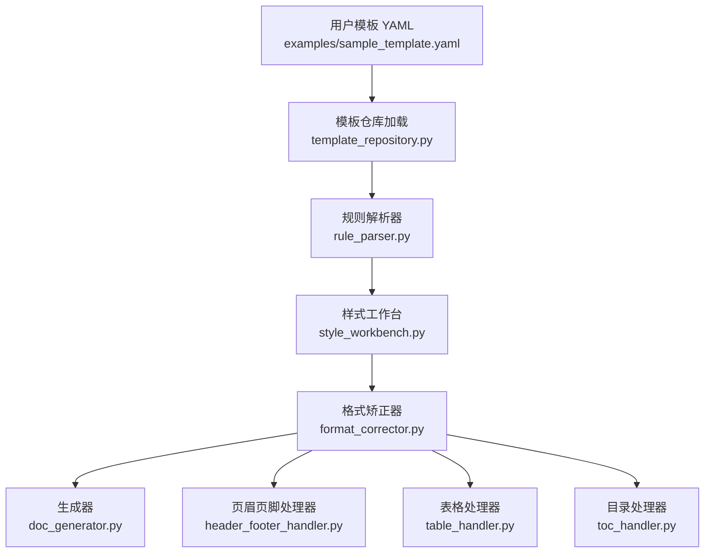
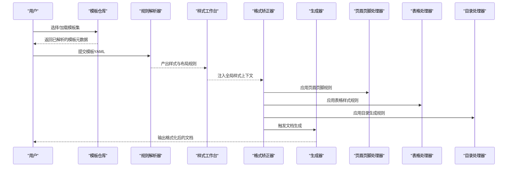
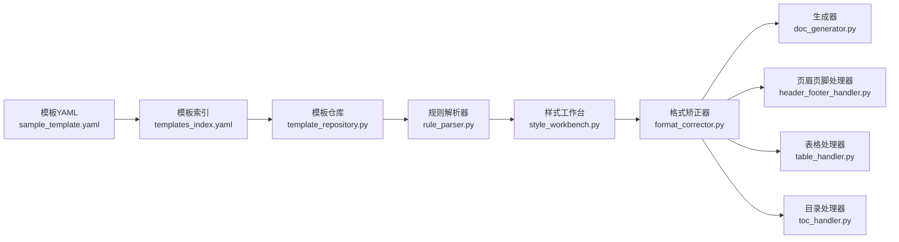

# 基础模板修改

<cite>
**本文引用的文件**   
- [README.md](file://README.md)
- [config/config.yaml](file://config/config.yaml)
- [examples/sample_template.yaml](file://examples/sample_template.yaml)
- [presets/templates_index.yaml](file://presets/templates_index.yaml)
- [presets/academic_paper.yaml](file://presets/academic_paper.yaml)
- [presets/chinese_thesis.yaml](file://presets/chinese_thesis.yaml)
- [src/paper_format_corrector/core/format_corrector.py](file://src/paper_format_corrector/core/format_corrector.py)
- [src/paper_format_corrector/infra/template_repository.py](file://src/paper_format_corrector/infra/template_repository.py)
- [src/paper_format_corrector/application/services/style_workbench.py](file://src/paper_format_corrector/application/services/style_workbench.py)
- [src/paper_format_corrector/infrastructure/parsers/rule_parser.py](file://src/paper_format_corrector/infrastructure/parsers/rule_parser.py)
- [src/paper_format_corrector/handlers/header_footer_handler.py](file://src/paper_format_corrector/handlers/header_footer_handler.py)
- [src/paper_format_corrector/handlers/table_handler.py](file://src/paper_format_corrector/handlers/table_handler.py)
- [src/paper_format_corrector/handlers/toc_handler.py](file://src/paper_format_corrector/handlers/toc_handler.py)
- [src/paper_format_corrector/generators/doc_generator.py](file://src/paper_format_corrector/generators/doc_generator.py)
</cite>

## 目录
1. [简介](#简介)
2. [项目结构](#项目结构)
3. [核心组件](#核心组件)
4. [架构总览](#架构总览)
5. [详细组件分析](#详细组件分析)
6. [依赖关系分析](#依赖关系分析)
7. [性能考虑](#性能考虑)
8. [故障排查指南](#故障排查指南)
9. [结论](#结论)
10. [附录](#附录)

## 简介
本指南面向希望基于现有“基础模板”进行样式与排版定制的用户，聚焦于从最简单的文本属性（字体、字号、颜色）到段落格式（行距、段前段后间距、对齐）、页面布局（页边距、纸张大小、分栏）的逐步修改方法。文档提供YAML配置示例路径与效果说明，并总结常见问题与最佳实践，帮助你高效完成模板二次开发。

## 项目结构
本项目采用分层与模块化组织方式：
- 顶层配置与示例：config、examples、presets
- 核心处理逻辑：core、handlers、generators
- 基础设施与解析：infra、infrastructure/parsers
- 应用服务：application/services

图示来源
- [examples/sample_template.yaml](file://examples/sample_template.yaml)
- [src/paper_format_corrector/infra/template_repository.py](file://src/paper_format_corrector/infra/template_repository.py)
- [src/paper_format_corrector/infrastructure/parsers/rule_parser.py](file://src/paper_format_corrector/infrastructure/parsers/rule_parser.py)
- [src/paper_format_corrector/application/services/style_workbench.py](file://src/paper_format_corrector/application/services/style_workbench.py)
- [src/paper_format_corrector/core/format_corrector.py](file://src/paper_format_corrector/core/format_corrector.py)
- [src/paper_format_corrector/generators/doc_generator.py](file://src/paper_format_corrector/generators/doc_generator.py)
- [src/paper_format_corrector/handlers/header_footer_handler.py](file://src/paper_format_corrector/handlers/header_footer_handler.py)
- [src/paper_format_corrector/handlers/table_handler.py](file://src/paper_format_corrector/handlers/table_handler.py)
- [src/paper_format_corrector/handlers/toc_handler.py](file://src/paper_format_corrector/handlers/toc_handler.py)

章节来源
- [README.md](file://README.md)
- [examples/sample_template.yaml](file://examples/sample_template.yaml)
- [presets/templates_index.yaml](file://presets/templates_index.yaml)

## 核心组件
- 模板仓库与索引：负责发现、加载与合并模板集合，支持多模板组合与覆盖策略。
- 规则解析器：将YAML中的样式与布局规则解析为内部模型，供后续处理阶段使用。
- 样式工作台：聚合文本、段落、页面等样式能力，提供统一的设置入口。
- 格式矫正器：驱动整体格式化流程，协调各处理器执行具体变更。
- 生成器：输出最终文档，确保样式生效且结构完整。
- 专项处理器：页眉页脚、表格、目录等模块按职责独立处理对应元素。

章节来源
- [src/paper_format_corrector/infra/template_repository.py](file://src/paper_format_corrector/infra/template_repository.py)
- [src/paper_format_corrector/infrastructure/parsers/rule_parser.py](file://src/paper_format_corrector/infrastructure/parsers/rule_parser.py)
- [src/paper_format_corrector/application/services/style_workbench.py](file://src/paper_format_corrector/application/services/style_workbench.py)
- [src/paper_format_corrector/core/format_corrector.py](file://src/paper_format_corrector/core/format_corrector.py)
- [src/paper_format_corrector/generators/doc_generator.py](file://src/paper_format_corrector/generators/doc_generator.py)
- [src/paper_format_corrector/handlers/header_footer_handler.py](file://src/paper_format_corrector/handlers/header_footer_handler.py)
- [src/paper_format_corrector/handlers/table_handler.py](file://src/paper_format_corrector/handlers/table_handler.py)
- [src/paper_format_corrector/handlers/toc_handler.py](file://src/paper_format_corrector/handlers/toc_handler.py)

## 架构总览
下图展示从模板YAML到最终文档的关键调用链与数据流向。

图示来源
- [src/paper_format_corrector/infra/template_repository.py](file://src/paper_format_corrector/infra/template_repository.py)
- [src/paper_format_corrector/infrastructure/parsers/rule_parser.py](file://src/paper_format_corrector/infrastructure/parsers/rule_parser.py)
- [src/paper_format_corrector/application/services/style_workbench.py](file://src/paper_format_corrector/application/services/style_workbench.py)
- [src/paper_format_corrector/core/format_corrector.py](file://src/paper_format_corrector/core/format_corrector.py)
- [src/paper_format_corrector/generators/doc_generator.py](file://src/paper_format_corrector/generators/doc_generator.py)
- [src/paper_format_corrector/handlers/header_footer_handler.py](file://src/paper_format_corrector/handlers/header_footer_handler.py)
- [src/paper_format_corrector/handlers/table_handler.py](file://src/paper_format_corrector/handlers/table_handler.py)
- [src/paper_format_corrector/handlers/toc_handler.py](file://src/paper_format_corrector/handlers/toc_handler.py)

## 详细组件分析

### 文本属性（字体、字号、颜色）
- 目标：统一全文或指定样式的字体族、字号与颜色，保证跨平台一致显示。
- 关键步骤：
  - 在模板YAML中定义文本样式键值（如字体、字号、颜色）。
  - 通过规则解析器将其转换为内部样式对象。
  - 样式工作台将该对象应用到正文、标题、注释等相应样式类。
  - 格式矫正器在执行时批量更新段落与字符样式。
- 建议：
  - 优先使用系统通用字体族名，避免缺失字体导致的回退不一致。
  - 字号建议使用相对单位或固定点值，保持层级清晰。
  - 颜色建议使用标准色值，避免RGB与十六进制混用造成歧义。

章节来源
- [src/paper_format_corrector/infrastructure/parsers/rule_parser.py](file://src/paper_format_corrector/infrastructure/parsers/rule_parser.py)
- [src/paper_format_corrector/application/services/style_workbench.py](file://src/paper_format_corrector/application/services/style_workbench.py)
- [src/paper_format_corrector/core/format_corrector.py](file://src/paper_format_corrector/core/format_corrector.py)

### 段落格式（行距、段前段后间距、对齐）
- 目标：控制段落内行高与段落间空白，以及左右对齐、两端对齐等。
- 关键步骤：
  - 在模板YAML中配置段落样式键值（行距、段前段后、对齐方式）。
  - 规则解析器解析为段落格式对象。
  - 样式工作台将段落格式绑定到对应样式（正文、各级标题、列表项等）。
  - 格式矫正器遍历文档段落，应用段落格式。
- 建议：
  - 行距与段前段后需配合字号与字体度量，避免拥挤或过大留白。
  - 对齐方式应与内容语义匹配（标题居中、正文两端对齐等）。

章节来源
- [src/paper_format_corrector/infrastructure/parsers/rule_parser.py](file://src/paper_format_corrector/infrastructure/parsers/rule_parser.py)
- [src/paper_format_corrector/application/services/style_workbench.py](file://src/paper_format_corrector/application/services/style_workbench.py)
- [src/paper_format_corrector/core/format_corrector.py](file://src/paper_format_corrector/core/format_corrector.py)

### 页面布局（页边距、纸张大小、分栏）
- 目标：设定页面尺寸与边距，必要时启用分栏以提升版面利用率。
- 关键步骤：
  - 在模板YAML中声明页面布局参数（纸张大小、上下左右边距、分栏数与间隔）。
  - 规则解析器将布局参数转为页面设置对象。
  - 样式工作台将页面设置应用到文档节（Section）。
  - 格式矫正器在生成前统一刷新页面布局。
- 建议：
  - 不同打印设备对最小边距有要求，需预留装订空间。
  - 分栏适用于双栏论文或报告，注意图表跨栏时的处理。

章节来源
- [src/paper_format_corrector/infrastructure/parsers/rule_parser.py](file://src/paper_format_corrector/infrastructure/parsers/rule_parser.py)
- [src/paper_format_corrector/application/services/style_workbench.py](file://src/paper_format_corrector/application/services/style_workbench.py)
- [src/paper_format_corrector/core/format_corrector.py](file://src/paper_format_corrector/core/format_corrector.py)

### 页眉页脚与目录
- 页眉页脚：
  - 在模板YAML中定义页眉页脚内容与样式。
  - 由页眉页脚处理器根据规则插入并应用样式。
- 目录：
  - 在模板YAML中配置目录级别、编号与缩进。
  - 由目录处理器扫描标题样式并生成目录条目。

章节来源
- [src/paper_format_corrector/handlers/header_footer_handler.py](file://src/paper_format_corrector/handlers/header_footer_handler.py)
- [src/paper_format_corrector/handlers/toc_handler.py](file://src/paper_format_corrector/handlers/toc_handler.py)

### 表格样式
- 目标：统一表格边框、单元格内边距、表头样式与斑马纹等。
- 关键步骤：
  - 在模板YAML中声明表格样式键值。
  - 规则解析器解析为表格样式对象。
  - 表格处理器遍历文档表格并应用样式。

章节来源
- [src/paper_format_corrector/handlers/table_handler.py](file://src/paper_format_corrector/handlers/table_handler.py)
- [src/paper_format_corrector/infrastructure/parsers/rule_parser.py](file://src/paper_format_corrector/infrastructure/parsers/rule_parser.py)

### 模板索引与预设
- 模板索引：集中管理可用模板清单与版本信息，便于快速选择与升级。
- 预设模板：提供学术、学位论文、期刊等常见场景的默认配置，可作为起点进行二次定制。

章节来源
- [presets/templates_index.yaml](file://presets/templates_index.yaml)
- [presets/academic_paper.yaml](file://presets/academic_paper.yaml)
- [presets/chinese_thesis.yaml](file://presets/chinese_thesis.yaml)

## 依赖关系分析

图示来源
- [examples/sample_template.yaml](file://examples/sample_template.yaml)
- [presets/templates_index.yaml](file://presets/templates_index.yaml)
- [src/paper_format_corrector/infra/template_repository.py](file://src/paper_format_corrector/infra/template_repository.py)
- [src/paper_format_corrector/infrastructure/parsers/rule_parser.py](file://src/paper_format_corrector/infrastructure/parsers/rule_parser.py)
- [src/paper_format_corrector/application/services/style_workbench.py](file://src/paper_format_corrector/application/services/style_workbench.py)
- [src/paper_format_corrector/core/format_corrector.py](file://src/paper_format_corrector/core/format_corrector.py)
- [src/paper_format_corrector/generators/doc_generator.py](file://src/paper_format_corrector/generators/doc_generator.py)
- [src/paper_format_corrector/handlers/header_footer_handler.py](file://src/paper_format_corrector/handlers/header_footer_handler.py)
- [src/paper_format_corrector/handlers/table_handler.py](file://src/paper_format_corrector/handlers/table_handler.py)
- [src/paper_format_corrector/handlers/toc_handler.py](file://src/paper_format_corrector/handlers/toc_handler.py)

## 性能考虑
- 批量应用：尽量在样式工作台层一次性构建样式对象，减少重复计算。
- 增量更新：仅对受影响的段落与表格重算，避免全篇遍历。
- 缓存策略：对常用字体与页面布局结果进行缓存，提升渲染速度。
- 资源限制：大文档分块处理，降低内存峰值。

## 故障排查指南
- 字体缺失导致回退异常
  - 现象：中文显示为方框或英文字体。
  - 排查：检查模板YAML中字体族是否包含常用回退；确认运行环境已安装所需字体。
  - 解决：增加通用字体族名与回退顺序。
- 行距与段前段后不生效
  - 现象：段落间距未按预期变化。
  - 排查：确认段落样式键值是否正确映射到段落格式对象；检查是否存在局部覆盖。
  - 解决：在全局样式中统一设置，避免局部覆盖冲突。
- 页边距被截断或打印溢出
  - 现象：边缘内容被裁剪。
  - 排查：核对页面布局参数与打印机最小边距限制。
  - 解决：调整边距或纸张大小，确保符合输出设备要求。
- 目录未生成或层级错乱
  - 现象：目录为空或标题级别不正确。
  - 排查：检查标题样式是否与目录规则匹配；确认标题编号与缩进配置。
  - 解决：修正标题样式名称与目录级别映射。
- 表格样式错位
  - 现象：边框重叠或单元格内边距异常。
  - 排查：确认表格样式键值与处理器映射关系；检查是否存在嵌套表格。
  - 解决：简化表格样式，避免复杂嵌套。

章节来源
- [src/paper_format_corrector/infrastructure/parsers/rule_parser.py](file://src/paper_format_corrector/infrastructure/parsers/rule_parser.py)
- [src/paper_format_corrector/application/services/style_workbench.py](file://src/paper_format_corrector/application/services/style_workbench.py)
- [src/paper_format_corrector/core/format_corrector.py](file://src/paper_format_corrector/core/format_corrector.py)
- [src/paper_format_corrector/handlers/header_footer_handler.py](file://src/paper_format_corrector/handlers/header_footer_handler.py)
- [src/paper_format_corrector/handlers/table_handler.py](file://src/paper_format_corrector/handlers/table_handler.py)
- [src/paper_format_corrector/handlers/toc_handler.py](file://src/paper_format_corrector/handlers/toc_handler.py)

## 结论
通过模板YAML进行样式与布局定制是本项目最核心的工作流。建议在预设模板基础上，遵循“先文本、再段落、后页面”的顺序逐步完善；同时利用模板索引与样式工作台提供的统一接口，确保样式的一致性与可维护性。遇到异常时，优先检查规则解析与样式映射是否正确，再结合处理器日志定位问题。

## 附录

### 常用YAML配置示例与效果
- 文本属性
  - 示例路径：[examples/sample_template.yaml](file://examples/sample_template.yaml)
  - 效果：统一字体族、字号与颜色，提升可读性与一致性。
- 段落格式
  - 示例路径：[examples/sample_template.yaml](file://examples/sample_template.yaml)
  - 效果：设置行距、段前段后与对齐方式，改善阅读节奏。
- 页面布局
  - 示例路径：[examples/sample_template.yaml](file://examples/sample_template.yaml)
  - 效果：配置纸张大小与页边距，必要时启用分栏。
- 预设模板参考
  - 示例路径：[presets/academic_paper.yaml](file://presets/academic_paper.yaml)、[presets/chinese_thesis.yaml](file://presets/chinese_thesis.yaml)
  - 效果：提供学术与学位论文的默认样式与布局，可直接复用或微调。

章节来源
- [examples/sample_template.yaml](file://examples/sample_template.yaml)
- [presets/academic_paper.yaml](file://presets/academic_paper.yaml)
- [presets/chinese_thesis.yaml](file://presets/chinese_thesis.yaml)