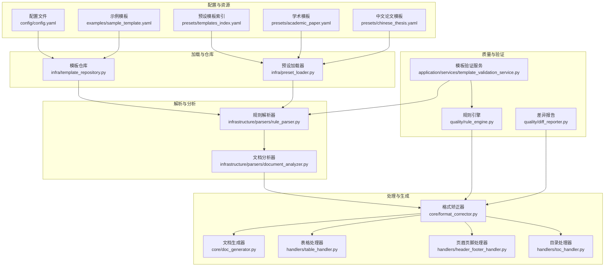
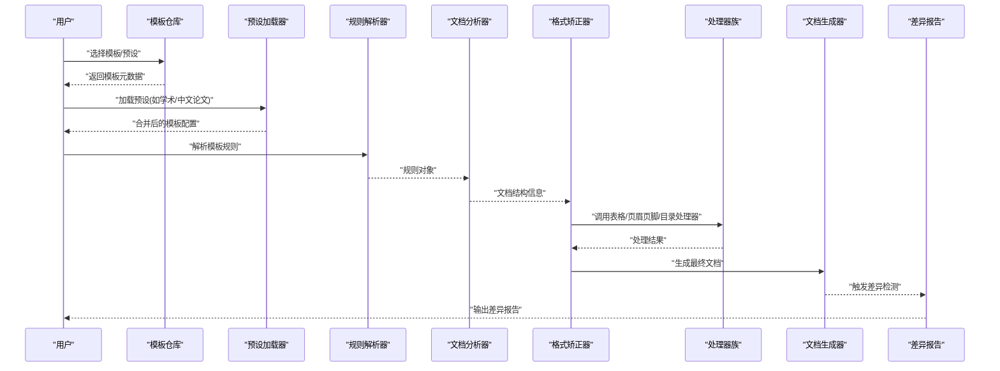
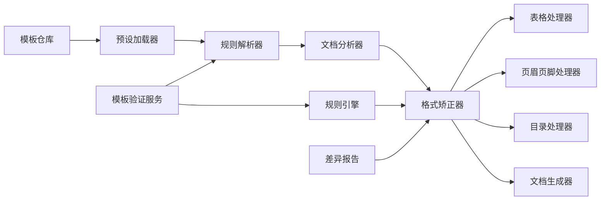

# 模板定制指南

<cite>
**本文引用的文件**   
- [README.md](file://README.md)
- [config/config.yaml](file://config/config.yaml)
- [examples/sample_template.yaml](file://examples/sample_template.yaml)
- [presets/templates_index.yaml](file://presets/templates_index.yaml)
- [presets/academic_paper.yaml](file://presets/academic_paper.yaml)
- [presets/chinese_thesis.yaml](file://presets/chinese_thesis.yaml)
- [src/paper_format_corrector/core/format_corrector.py](file://src/paper_format_corrector/core/format_corrector.py)
- [src/paper_format_corrector/core/doc_generator.py](file://src/paper_format_corrector/core/doc_generator.py)
- [src/paper_format_corrector/infrastructure/parsers/rule_parser.py](file://src/paper_format_corrector/infrastructure/parsers/rule_parser.py)
- [src/paper_format_corrector/infrastructure/parsers/document_analyzer.py](file://src/paper_format_corrector/infrastructure/parsers/document_analyzer.py)
- [src/paper_format_corrector/application/services/template_validation_service.py](file://src/paper_format_corrector/application/services/template_validation_service.py)
- [src/paper_format_corrector/infra/template_repository.py](file://src/paper_format_corrector/infra/template_repository.py)
- [src/paper_format_corrector/infra/preset_loader.py](file://src/paper_format_corrector/infra/preset_loader.py)
- [src/paper_format_corrector/handlers/table_handler.py](file://src/paper_format_corrector/handlers/table_handler.py)
- [src/paper_format_corrector/handlers/header_footer_handler.py](file://src/paper_format_corrector/handlers/header_footer_handler.py)
- [src/paper_format_corrector/handlers/toc_handler.py](file://src/paper_format_corrector/handlers/toc_handler.py)
- [src/paper_format_corrector/quality/rule_engine.py](file://src/paper_format_corrector/quality/rule_engine.py)
- [src/paper_format_corrector/quality/diff_reporter.py](file://src/paper_format_corrector/quality/diff_reporter.py)
- [tests/test_rule_parser.py](file://tests/test_rule_parser.py)
- [tests/test_presets.py](file://tests/test_presets.py)
</cite>

## 目录
1. [简介](#简介)
2. [项目结构](#项目结构)
3. [核心组件](#核心组件)
4. [架构总览](#架构总览)
5. [详细组件分析](#详细组件分析)
6. [依赖关系分析](#依赖关系分析)
7. [性能考虑](#性能考虑)
8. [故障排查指南](#故障排查指南)
9. [结论](#结论)
10. [附录](#附录)

## 简介
本指南面向希望基于现有系统进行“模板定制开发”的工程师与研究者，目标是帮助你从简单的样式修改（字体、段落、页面布局）逐步深入到复杂的业务规则定制（自定义格式化规则、验证逻辑），并提供实际案例与调试技巧。你将学会：
- 如何理解并扩展模板配置
- 如何添加自定义格式化规则与校验逻辑
- 如何通过处理器扩展表格、页眉页脚、目录等复杂元素
- 如何进行模板调试与性能优化

## 项目结构
本项目采用分层与模块化组织方式，模板相关能力分布在配置、解析、处理、质量与测试等多个层次。下图展示了与模板定制密切相关的模块及其交互关系。

图表来源
- [config/config.yaml](file://config/config.yaml)
- [presets/templates_index.yaml](file://presets/templates_index.yaml)
- [examples/sample_template.yaml](file://examples/sample_template.yaml)
- [presets/academic_paper.yaml](file://presets/academic_paper.yaml)
- [presets/chinese_thesis.yaml](file://presets/chinese_thesis.yaml)
- [src/paper_format_corrector/infra/template_repository.py](file://src/paper_format_corrector/infra/template_repository.py)
- [src/paper_format_corrector/infra/preset_loader.py](file://src/paper_format_corrector/infra/preset_loader.py)
- [src/paper_format_corrector/infrastructure/parsers/rule_parser.py](file://src/paper_format_corrector/infrastructure/parsers/rule_parser.py)
- [src/paper_format_corrector/infrastructure/parsers/document_analyzer.py](file://src/paper_format_corrector/infrastructure/parsers/document_analyzer.py)
- [src/paper_format_corrector/core/format_corrector.py](file://src/paper_format_corrector/core/format_corrector.py)
- [src/paper_format_corrector/core/doc_generator.py](file://src/paper_format_corrector/core/doc_generator.py)
- [src/paper_format_corrector/handlers/table_handler.py](file://src/paper_format_corrector/handlers/table_handler.py)
- [src/paper_format_corrector/handlers/header_footer_handler.py](file://src/paper_format_corrector/handlers/header_footer_handler.py)
- [src/paper_format_corrector/handlers/toc_handler.py](file://src/paper_format_corrector/handlers/toc_handler.py)
- [src/paper_format_corrector/quality/rule_engine.py](file://src/paper_format_corrector/quality/rule_engine.py)
- [src/paper_format_corrector/quality/diff_reporter.py](file://src/paper_format_corrector/quality/diff_reporter.py)
- [src/paper_format_corrector/application/services/template_validation_service.py](file://src/paper_format_corrector/application/services/template_validation_service.py)

章节来源
- [README.md](file://README.md)
- [config/config.yaml](file://config/config.yaml)
- [presets/templates_index.yaml](file://presets/templates_index.yaml)
- [examples/sample_template.yaml](file://examples/sample_template.yaml)

## 核心组件
- 模板仓库与预设加载器：负责从本地或远程位置加载模板与预设，提供统一的模板访问接口。
- 规则解析器：将模板中的规则描述解析为内部可执行的结构，支持条件、范围、目标元素等。
- 文档分析器：对输入文档进行结构化分析，提取段落、表格、图片、标题层级等信息，供后续处理使用。
- 格式矫正器：编排各类处理器，按规则驱动文档样式与结构的修正。
- 文档生成器：在矫正完成后输出最终文档，支持多种导出格式。
- 处理器族：针对表格、页眉页脚、目录等复杂元素的专用处理逻辑。
- 规则引擎与差异报告：用于运行规则、评估质量并生成对比报告，辅助调试与回归测试。
- 模板验证服务：在应用层对模板进行完整性与一致性校验，避免运行时错误。

章节来源
- [src/paper_format_corrector/infra/template_repository.py](file://src/paper_format_corrector/infra/template_repository.py)
- [src/paper_format_corrector/infra/preset_loader.py](file://src/paper_format_corrector/infra/preset_loader.py)
- [src/paper_format_corrector/infrastructure/parsers/rule_parser.py](file://src/paper_format_corrector/infrastructure/parsers/rule_parser.py)
- [src/paper_format_corrector/infrastructure/parsers/document_analyzer.py](file://src/paper_format_corrector/infrastructure/parsers/document_analyzer.py)
- [src/paper_format_corrector/core/format_corrector.py](file://src/paper_format_corrector/core/format_corrector.py)
- [src/paper_format_corrector/core/doc_generator.py](file://src/paper_format_corrector/core/doc_generator.py)
- [src/paper_format_corrector/handlers/table_handler.py](file://src/paper_format_corrector/handlers/table_handler.py)
- [src/paper_format_corrector/handlers/header_footer_handler.py](file://src/paper_format_corrector/handlers/header_footer_handler.py)
- [src/paper_format_corrector/handlers/toc_handler.py](file://src/paper_format_corrector/handlers/toc_handler.py)
- [src/paper_format_corrector/quality/rule_engine.py](file://src/paper_format_corrector/quality/rule_engine.py)
- [src/paper_format_corrector/quality/diff_reporter.py](file://src/paper_format_corrector/quality/diff_reporter.py)
- [src/paper_format_corrector/application/services/template_validation_service.py](file://src/paper_format_corrector/application/services/template_validation_service.py)

## 架构总览
下图展示了一次模板驱动的文档矫正流程，从模板加载到规则解析、文档分析、格式矫正与结果输出的完整链路。

图表来源
- [src/paper_format_corrector/infra/template_repository.py](file://src/paper_format_corrector/infra/template_repository.py)
- [src/paper_format_corrector/infra/preset_loader.py](file://src/paper_format_corrector/infra/preset_loader.py)
- [src/paper_format_corrector/infrastructure/parsers/rule_parser.py](file://src/paper_format_corrector/infrastructure/parsers/rule_parser.py)
- [src/paper_format_corrector/infrastructure/parsers/document_analyzer.py](file://src/paper_format_corrector/infrastructure/parsers/document_analyzer.py)
- [src/paper_format_corrector/core/format_corrector.py](file://src/paper_format_corrector/core/format_corrector.py)
- [src/paper_format_corrector/handlers/table_handler.py](file://src/paper_format_corrector/handlers/table_handler.py)
- [src/paper_format_corrector/handlers/header_footer_handler.py](file://src/paper_format_corrector/handlers/header_footer_handler.py)
- [src/paper_format_corrector/handlers/toc_handler.py](file://src/paper_format_corrector/handlers/toc_handler.py)
- [src/paper_format_corrector/core/doc_generator.py](file://src/paper_format_corrector/core/doc_generator.py)
- [src/paper_format_corrector/quality/diff_reporter.py](file://src/paper_format_corrector/quality/diff_reporter.py)

## 详细组件分析

### 基础样式定制（字体、段落、页面布局）
- 字体与段落
  - 通过模板配置定义全局字体、字号、行距、段前段后间距等属性。
  - 结合规则解析器，可将样式规则应用到特定段落类型（如正文、标题、引用）。
- 页面布局
  - 在模板中设置页边距、纸张大小、分节符等布局参数。
  - 使用文档分析器识别分节信息，确保不同章节拥有独立布局。

建议步骤
- 在示例模板基础上调整字体与段落属性，观察预览效果。
- 使用差异报告对比前后版本，确认变更符合预期。

章节来源
- [examples/sample_template.yaml](file://examples/sample_template.yaml)
- [src/paper_format_corrector/infrastructure/parsers/rule_parser.py](file://src/paper_format_corrector/infrastructure/parsers/rule_parser.py)
- [src/paper_format_corrector/infrastructure/parsers/document_analyzer.py](file://src/paper_format_corrector/infrastructure/parsers/document_analyzer.py)
- [src/paper_format_corrector/quality/diff_reporter.py](file://src/paper_format_corrector/quality/diff_reporter.py)

### 复杂业务规则定制（自定义格式化规则与验证逻辑）
- 自定义格式化规则
  - 在模板中声明规则条目，指定目标元素（段落、表格、图片）、匹配条件（正则、层级、上下文）与动作（样式覆盖、插入分隔符、重编号）。
  - 规则解析器将规则转换为可执行对象，由规则引擎统一调度。
- 验证逻辑
  - 在模板验证服务中增加字段级或结构级校验，例如检查标题层级是否连续、表格编号是否唯一、参考文献格式是否符合规范。
  - 规则引擎在执行过程中收集违规项，生成报告供人工复核。

建议步骤
- 参考预设模板（学术/中文论文）的规则写法，复制并修改为所需场景。
- 编写单元测试用例，覆盖边界条件与异常路径。

章节来源
- [presets/academic_paper.yaml](file://presets/academic_paper.yaml)
- [presets/chinese_thesis.yaml](file://presets/chinese_thesis.yaml)
- [src/paper_format_corrector/infrastructure/parsers/rule_parser.py](file://src/paper_format_corrector/infrastructure/parsers/rule_parser.py)
- [src/paper_format_corrector/quality/rule_engine.py](file://src/paper_format_corrector/quality/rule_engine.py)
- [src/paper_format_corrector/application/services/template_validation_service.py](file://src/paper_format_corrector/application/services/template_validation_service.py)
- [tests/test_rule_parser.py](file://tests/test_rule_parser.py)

### 处理器扩展（表格、页眉页脚、目录）
- 表格处理器
  - 负责表格样式统一、跨页断行、表头重复、编号与标题对齐等。
  - 可在模板中声明表格规则，处理器根据规则批量修正。
- 页眉页脚处理器
  - 管理奇偶页不同、章节名自动填充、页码格式等。
- 目录处理器
  - 依据标题层级自动生成目录，支持多级缩进与页码右对齐。

建议步骤
- 在模板中启用对应处理器开关，并配置其参数。
- 使用差异报告验证处理器行为是否符合预期。

章节来源
- [src/paper_format_corrector/handlers/table_handler.py](file://src/paper_format_corrector/handlers/table_handler.py)
- [src/paper_format_corrector/handlers/header_footer_handler.py](file://src/paper_format_corrector/handlers/header_footer_handler.py)
- [src/paper_format_corrector/handlers/toc_handler.py](file://src/paper_format_corrector/handlers/toc_handler.py)

### 模板调试技巧
- 最小化复现
  - 将问题缩小到单个规则或单一处理器，快速定位根因。
- 差异报告
  - 利用差异报告查看具体变更点，包括新增、删除与修改的元素。
- 日志与断点
  - 在规则解析与执行阶段加入日志输出，记录关键中间状态。
- 单元测试
  - 为自定义规则与处理器编写单测，确保回归安全。

章节来源
- [src/paper_format_corrector/quality/diff_reporter.py](file://src/paper_format_corrector/quality/diff_reporter.py)
- [tests/test_rule_parser.py](file://tests/test_rule_parser.py)

### 性能优化建议
- 规则粒度控制
  - 将通用规则下沉到全局，减少重复匹配；仅在必要时使用复杂条件。
- 批处理与缓存
  - 对大文档采用分块处理策略，缓存已解析的文档结构，避免重复计算。
- 处理器并行
  - 对相互独立的处理器（如表格与页眉页脚）进行并发执行，缩短整体耗时。
- 增量更新
  - 仅对变更区域重新应用规则，降低全量扫描成本。

[本节为通用指导，不直接分析具体文件]

## 依赖关系分析
下图展示模板定制相关模块之间的依赖关系，有助于理解扩展点与耦合度。

图表来源
- [src/paper_format_corrector/infra/template_repository.py](file://src/paper_format_corrector/infra/template_repository.py)
- [src/paper_format_corrector/infra/preset_loader.py](file://src/paper_format_corrector/infra/preset_loader.py)
- [src/paper_format_corrector/infrastructure/parsers/rule_parser.py](file://src/paper_format_corrector/infrastructure/parsers/rule_parser.py)
- [src/paper_format_corrector/infrastructure/parsers/document_analyzer.py](file://src/paper_format_corrector/infrastructure/parsers/document_analyzer.py)
- [src/paper_format_corrector/core/format_corrector.py](file://src/paper_format_corrector/core/format_corrector.py)
- [src/paper_format_corrector/handlers/table_handler.py](file://src/paper_format_corrector/handlers/table_handler.py)
- [src/paper_format_corrector/handlers/header_footer_handler.py](file://src/paper_format_corrector/handlers/header_footer_handler.py)
- [src/paper_format_corrector/handlers/toc_handler.py](file://src/paper_format_corrector/handlers/toc_handler.py)
- [src/paper_format_corrector/core/doc_generator.py](file://src/paper_format_corrector/core/doc_generator.py)
- [src/paper_format_corrector/quality/rule_engine.py](file://src/paper_format_corrector/quality/rule_engine.py)
- [src/paper_format_corrector/quality/diff_reporter.py](file://src/paper_format_corrector/quality/diff_reporter.py)
- [src/paper_format_corrector/application/services/template_validation_service.py](file://src/paper_format_corrector/application/services/template_validation_service.py)

章节来源
- [presets/templates_index.yaml](file://presets/templates_index.yaml)
- [tests/test_presets.py](file://tests/test_presets.py)

## 性能考虑
- 规则复杂度与匹配范围应严格控制，避免全篇正则扫描。
- 对频繁使用的样式与布局参数建立缓存，减少重复写入。
- 使用增量模式处理大型文档，优先处理变更区域。
- 合理拆分处理器职责，提升可维护性与并行度。

[本节为通用指导，不直接分析具体文件]

## 故障排查指南
- 模板加载失败
  - 检查模板索引与预设路径是否正确，确认模板语法合法。
- 规则未生效
  - 使用差异报告核对目标元素是否存在，确认匹配条件与优先级。
- 处理器异常
  - 隔离单个处理器进行测试，查看日志与中间状态。
- 验证报错
  - 在模板验证服务中定位具体校验项，修复数据或规则。

章节来源
- [src/paper_format_corrector/application/services/template_validation_service.py](file://src/paper_format_corrector/application/services/template_validation_service.py)
- [src/paper_format_corrector/quality/diff_reporter.py](file://src/paper_format_corrector/quality/diff_reporter.py)
- [tests/test_rule_parser.py](file://tests/test_rule_parser.py)

## 结论
通过本指南，你可以从基础样式入手，逐步掌握复杂业务规则的定制方法。借助模板仓库、规则解析器、文档分析器与处理器族，配合规则引擎与差异报告，能够高效完成高质量模板开发与调试。建议在迭代过程中持续完善单元测试与差异报告，确保模板的稳定性和可维护性。

[本节为总结性内容，不直接分析具体文件]

## 附录
- 常用模板与预设
  - 学术模板与中文论文模板可作为起点，参考其规则结构与处理器配置。
- 示例模板
  - 在示例模板基础上进行修改，快速验证想法。
- 配置文件
  - 全局配置可用于覆盖默认行为，便于环境适配。

章节来源
- [presets/academic_paper.yaml](file://presets/academic_paper.yaml)
- [presets/chinese_thesis.yaml](file://presets/chinese_thesis.yaml)
- [examples/sample_template.yaml](file://examples/sample_template.yaml)
- [config/config.yaml](file://config/config.yaml)