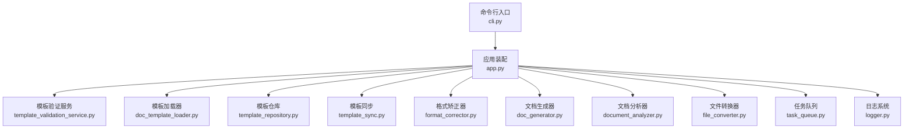
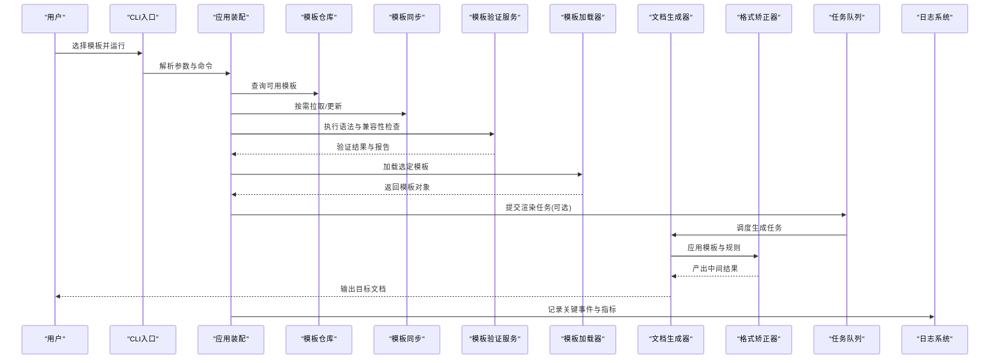
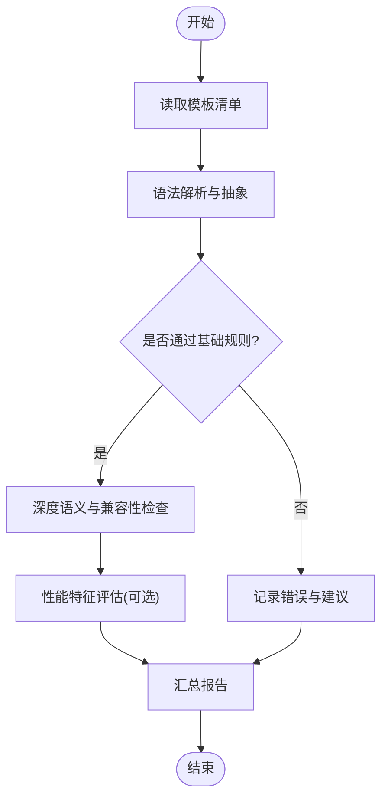
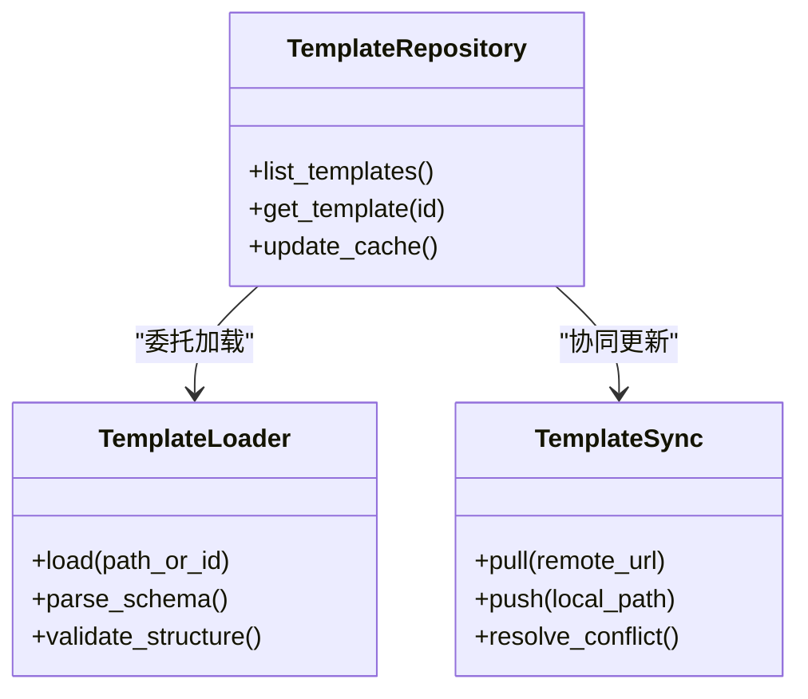
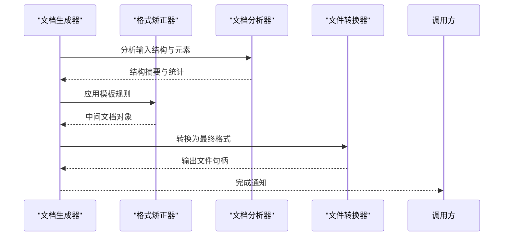
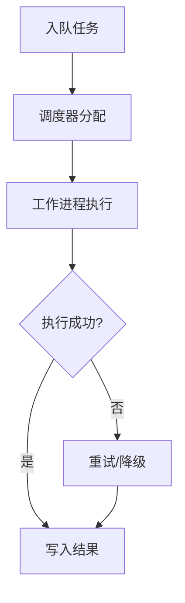
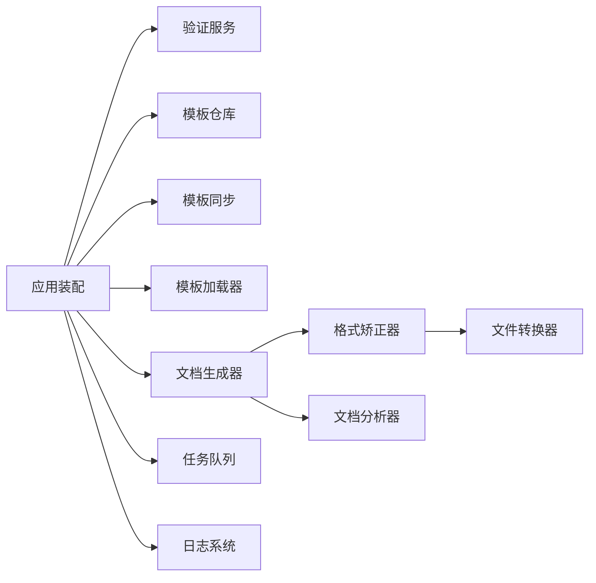

# 模板调试与优化

<cite>
**本文引用的文件**   
- [README.md](file://README.md)
- [pyproject.toml](file://pyproject.toml)
- [requirements.txt](file://requirements.txt)
- [run.py](file://run.py)
- [src/paper_format_corrector/app.py](file://src/paper_format_corrector/app.py)
- [src/paper_format_corrector/cli.py](file://src/paper_format_corrector/cli.py)
- [src/paper_format_corrector/infra/logger.py](file://src/paper_format_corrector/infra/logger.py)
- [src/paper_format_corrector/application/services/template_validation_service.py](file://src/paper_format_corrector/application/services/template_validation_service.py)
- [src/paper_format_corrector/application/services/template_validation.py](file://src/paper_format_corrector/application/services/template_validation.py)
- [src/paper_format_corrector/infra/doc_template_loader.py](file://src/paper_format_corrector/infra/doc_template_loader.py)
- [src/paper_format_corrector/infra/template_repository.py](file://src/paper_format_corrector/infra/template_repository.py)
- [src/paper_format_corrector/infra/template_sync.py](file://src/paper_format_corrector/infra/template_sync.py)
- [src/paper_format_corrector/core/format_corrector.py](file://src/paper_format_corrector/core/format_corrector.py)
- [src/paper_format_corrector/generators/doc_generator.py](file://src/paper_format_corrector/generators/doc_generator.py)
- [src/paper_format_corrector/infrastructure/parsers/document_analyzer.py](file://src/paper_format_corrector/infrastructure/parsers/document_analyzer.py)
- [src/paper_format_corrector/infrastructure/converters/file_converter.py](file://src/paper_format_corrector/infrastructure/converters/file_converter.py)
- [src/paper_format_corrector/infrastructure/queue/task_queue.py](file://src/paper_format_corrector/infrastructure/queue/task_queue.py)
- [src/paper_format_corrector/infra/updater/version_checker.py](file://src/paper_format_corrector/infra/updater/version_checker.py)
- [tests/test_template_validation_and_import.py](file://tests/test_template_validation_and_import.py)
- [tests/test_template_repository.py](file://tests/test_template_repository.py)
- [tests/test_template_sync.py](file://tests/test_template_sync.py)
- [tests/test_task_queue.py](file://tests/test_task_queue.py)
</cite>

## 目录
1. [简介](#简介)
2. [项目结构](#项目结构)
3. [核心组件](#核心组件)
4. [架构总览](#架构总览)
5. [详细组件分析](#详细组件分析)
6. [依赖关系分析](#依赖关系分析)
7. [性能考虑](#性能考虑)
8. [故障排查指南](#故障排查指南)
9. [结论](#结论)
10. [附录](#附录)

## 简介
本指南面向模板开发者与维护者，聚焦于“模板调试与优化”。内容覆盖：
- 调试技巧：日志分析、错误追踪、断点与最小化复现
- 验证工具：语法检查、兼容性测试、规则校验
- 性能优化：大文件处理、内存使用、渲染速度提升
- 常见问题诊断与解决方案
- 模板版本管理与协作开发最佳实践

## 项目结构
围绕模板生命周期（加载→验证→渲染→导出）的关键代码分布在应用服务、基础设施与生成器层。下图展示与模板调试和优化相关的核心模块及其交互。

图表来源
- [src/paper_format_corrector/cli.py](file://src/paper_format_corrector/cli.py)
- [src/paper_format_corrector/app.py](file://src/paper_format_corrector/app.py)
- [src/paper_format_corrector/application/services/template_validation_service.py](file://src/paper_format_corrector/application/services/template_validation_service.py)
- [src/paper_format_corrector/infra/doc_template_loader.py](file://src/paper_format_corrector/infra/doc_template_loader.py)
- [src/paper_format_corrector/infra/template_repository.py](file://src/paper_format_corrector/infra/template_repository.py)
- [src/paper_format_corrector/infra/template_sync.py](file://src/paper_format_corrector/infra/template_sync.py)
- [src/paper_format_corrector/core/format_corrector.py](file://src/paper_format_corrector/core/format_corrector.py)
- [src/paper_format_corrector/generators/doc_generator.py](file://src/paper_format_corrector/generators/doc_generator.py)
- [src/paper_format_corrector/infrastructure/parsers/document_analyzer.py](file://src/paper_format_corrector/infrastructure/parsers/document_analyzer.py)
- [src/paper_format_corrector/infrastructure/converters/file_converter.py](file://src/paper_format_corrector/infrastructure/converters/file_converter.py)
- [src/paper_format_corrector/infrastructure/queue/task_queue.py](file://src/paper_format_corrector/infrastructure/queue/task_queue.py)
- [src/paper_format_corrector/infra/logger.py](file://src/paper_format_corrector/infra/logger.py)

章节来源
- [README.md](file://README.md)
- [pyproject.toml](file://pyproject.toml)
- [requirements.txt](file://requirements.txt)
- [run.py](file://run.py)

## 核心组件
- 模板验证服务：提供模板语法与兼容性校验能力，支持批量与增量验证，输出结构化报告。
- 模板加载器与仓库：负责从本地/远程位置加载模板，管理缓存与一致性。
- 模板同步：在团队协作中拉取/推送模板变更，解决冲突与版本对齐。
- 格式矫正器与文档生成器：将模板应用于输入文档，执行样式与结构转换。
- 任务队列：对耗时任务进行异步编排，避免阻塞主流程。
- 日志系统：贯穿各层的统一日志记录，便于定位问题与性能分析。

章节来源
- [src/paper_format_corrector/application/services/template_validation_service.py](file://src/paper_format_corrector/application/services/template_validation_service.py)
- [src/paper_format_corrector/application/services/template_validation.py](file://src/paper_format_corrector/application/services/template_validation.py)
- [src/paper_format_corrector/infra/doc_template_loader.py](file://src/paper_format_corrector/infra/doc_template_loader.py)
- [src/paper_format_corrector/infra/template_repository.py](file://src/paper_format_corrector/infra/template_repository.py)
- [src/paper_format_corrector/infra/template_sync.py](file://src/paper_format_corrector/infra/template_sync.py)
- [src/paper_format_corrector/core/format_corrector.py](file://src/paper_format_corrector/core/format_corrector.py)
- [src/paper_format_corrector/generators/doc_generator.py](file://src/paper_format_corrector/generators/doc_generator.py)
- [src/paper_format_corrector/infrastructure/queue/task_queue.py](file://src/paper_format_corrector/infrastructure/queue/task_queue.py)
- [src/paper_format_corrector/infra/logger.py](file://src/paper_format_corrector/infra/logger.py)

## 架构总览
下图展示了模板从加载到渲染的端到端流程，以及验证、同步、队列与日志等横切关注点。

图表来源
- [src/paper_format_corrector/cli.py](file://src/paper_format_corrector/cli.py)
- [src/paper_format_corrector/app.py](file://src/paper_format_corrector/app.py)
- [src/paper_format_corrector/infra/template_repository.py](file://src/paper_format_corrector/infra/template_repository.py)
- [src/paper_format_corrector/infra/template_sync.py](file://src/paper_format_corrector/infra/template_sync.py)
- [src/paper_format_corrector/application/services/template_validation_service.py](file://src/paper_format_corrector/application/services/template_validation_service.py)
- [src/paper_format_corrector/infra/doc_template_loader.py](file://src/paper_format_corrector/infra/doc_template_loader.py)
- [src/paper_format_corrector/generators/doc_generator.py](file://src/paper_format_corrector/generators/doc_generator.py)
- [src/paper_format_corrector/core/format_corrector.py](file://src/paper_format_corrector/core/format_corrector.py)
- [src/paper_format_corrector/infrastructure/queue/task_queue.py](file://src/paper_format_corrector/infrastructure/queue/task_queue.py)
- [src/paper_format_corrector/infra/logger.py](file://src/paper_format_corrector/infra/logger.py)

## 详细组件分析

### 模板验证服务与规则引擎
- 职责：对模板进行语法检查、字段存在性校验、引用完整性检查、兼容性与回退策略评估；输出可机读的报告。
- 关键点：
  - 分层校验：先轻量语法扫描，再深度语义检查，减少不必要开销。
  - 并行与批处理：对多模板或大模板集合采用并发策略，结合任务队列控制资源。
  - 报告结构：包含错误、警告、建议与修复指引，便于自动化集成。

图表来源
- [src/paper_format_corrector/application/services/template_validation_service.py](file://src/paper_format_corrector/application/services/template_validation_service.py)
- [src/paper_format_corrector/application/services/template_validation.py](file://src/paper_format_corrector/application/services/template_validation.py)

章节来源
- [src/paper_format_corrector/application/services/template_validation_service.py](file://src/paper_format_corrector/application/services/template_validation_service.py)
- [src/paper_format_corrector/application/services/template_validation.py](file://src/paper_format_corrector/application/services/template_validation.py)
- [tests/test_template_validation_and_import.py](file://tests/test_template_validation_and_import.py)

### 模板加载器与仓库
- 职责：从本地路径或远程仓库加载模板，维护缓存与版本信息，保证一致性与快速访问。
- 关键点：
  - 缓存策略：按模板指纹（如哈希）缓存，避免重复解析。
  - 一致性：在团队环境中通过同步服务确保多人协作时模板版本一致。
  - 安全：路径白名单与权限校验，防止非法路径访问。

图表来源
- [src/paper_format_corrector/infra/template_repository.py](file://src/paper_format_corrector/infra/template_repository.py)
- [src/paper_format_corrector/infra/doc_template_loader.py](file://src/paper_format_corrector/infra/doc_template_loader.py)
- [src/paper_format_corrector/infra/template_sync.py](file://src/paper_format_corrector/infra/template_sync.py)

章节来源
- [src/paper_format_corrector/infra/template_repository.py](file://src/paper_format_corrector/infra/template_repository.py)
- [src/paper_format_corrector/infra/doc_template_loader.py](file://src/paper_format_corrector/infra/doc_template_loader.py)
- [src/paper_format_corrector/infra/template_sync.py](file://src/paper_format_corrector/infra/template_sync.py)
- [tests/test_template_repository.py](file://tests/test_template_repository.py)
- [tests/test_template_sync.py](file://tests/test_template_sync.py)

### 文档生成与格式矫正
- 职责：基于模板与输入文档，执行段落、表格、图片、页眉页脚、目录等元素的生成与格式化。
- 关键点：
  - 流式处理：对大文档分块处理，降低峰值内存占用。
  - 规则驱动：将样式与结构规则外置，便于调试与迭代。
  - 可观测性：在关键步骤埋点计时与计数，辅助性能分析。

图表来源
- [src/paper_format_corrector/generators/doc_generator.py](file://src/paper_format_corrector/generators/doc_generator.py)
- [src/paper_format_corrector/core/format_corrector.py](file://src/paper_format_corrector/core/format_corrector.py)
- [src/paper_format_corrector/infrastructure/parsers/document_analyzer.py](file://src/paper_format_corrector/infrastructure/parsers/document_analyzer.py)
- [src/paper_format_corrector/infrastructure/converters/file_converter.py](file://src/paper_format_corrector/infrastructure/converters/file_converter.py)

章节来源
- [src/paper_format_corrector/generators/doc_generator.py](file://src/paper_format_corrector/generators/doc_generator.py)
- [src/paper_format_corrector/core/format_corrector.py](file://src/paper_format_corrector/core/format_corrector.py)
- [src/paper_format_corrector/infrastructure/parsers/document_analyzer.py](file://src/paper_format_corrector/infrastructure/parsers/document_analyzer.py)
- [src/paper_format_corrector/infrastructure/converters/file_converter.py](file://src/paper_format_corrector/infrastructure/converters/file_converter.py)

### 任务队列与异步编排
- 职责：将耗时任务（如大批量模板验证、复杂文档渲染）放入队列，由工作进程消费，避免阻塞主线程。
- 关键点：
  - 优先级与重试：对关键任务设置高优先级，失败自动重试。
  - 背压与限流：根据系统负载动态调整并发度。
  - 监控：记录任务时长、成功率与错误分布。

图表来源
- [src/paper_format_corrector/infrastructure/queue/task_queue.py](file://src/paper_format_corrector/infrastructure/queue/task_queue.py)

章节来源
- [src/paper_format_corrector/infrastructure/queue/task_queue.py](file://src/paper_format_corrector/infrastructure/queue/task_queue.py)
- [tests/test_task_queue.py](file://tests/test_task_queue.py)

### 日志系统与可观测性
- 职责：为模板加载、验证、渲染、导出等阶段提供结构化日志与指标采集。
- 关键点：
  - 分级日志：DEBUG/INFO/WARNING/ERROR，便于不同场景筛选。
  - 上下文关联：为每次模板操作生成唯一ID，串联跨模块日志。
  - 指标上报：关键路径耗时、内存峰值、错误率等。

章节来源
- [src/paper_format_corrector/infra/logger.py](file://src/paper_format_corrector/infra/logger.py)

## 依赖关系分析
- 内部依赖：
  - 应用装配依赖验证服务、加载器、仓库、同步、生成器、矫正器、队列与日志。
  - 生成器依赖矫正器与分析器；矫正器依赖转换器。
- 外部依赖：
  - 文件系统、网络（远程模板仓库）、序列化库、文档处理库等。
- 潜在风险：
  - 循环依赖需避免，保持单向依赖。
  - 第三方库升级可能影响模板解析与渲染行为，需回归测试。

图表来源
- [src/paper_format_corrector/app.py](file://src/paper_format_corrector/app.py)
- [src/paper_format_corrector/application/services/template_validation_service.py](file://src/paper_format_corrector/application/services/template_validation_service.py)
- [src/paper_format_corrector/infra/template_repository.py](file://src/paper_format_corrector/infra/template_repository.py)
- [src/paper_format_corrector/infra/template_sync.py](file://src/paper_format_corrector/infra/template_sync.py)
- [src/paper_format_corrector/infra/doc_template_loader.py](file://src/paper_format_corrector/infra/doc_template_loader.py)
- [src/paper_format_corrector/generators/doc_generator.py](file://src/paper_format_corrector/generators/doc_generator.py)
- [src/paper_format_corrector/core/format_corrector.py](file://src/paper_format_corrector/core/format_corrector.py)
- [src/paper_format_corrector/infrastructure/parsers/document_analyzer.py](file://src/paper_format_corrector/infrastructure/parsers/document_analyzer.py)
- [src/paper_format_corrector/infrastructure/converters/file_converter.py](file://src/paper_format_corrector/infrastructure/converters/file_converter.py)
- [src/paper_format_corrector/infrastructure/queue/task_queue.py](file://src/paper_format_corrector/infrastructure/queue/task_queue.py)
- [src/paper_format_corrector/infra/logger.py](file://src/paper_format_corrector/infra/logger.py)

## 性能考虑
- 大文件处理优化
  - 分块与流式：对超大文档采用分块解析与增量写入，降低内存峰值。
  - 延迟加载：仅加载必要部分，按需解析子树。
- 内存使用优化
  - 对象复用：重用中间数据结构，避免频繁创建销毁。
  - 及时释放：显式关闭文件句柄与临时资源。
- 渲染速度提升
  - 并行验证：对多模板或大模板集合并发执行轻量检查。
  - 缓存命中：利用模板指纹缓存，避免重复解析。
  - 规则裁剪：在调试阶段禁用非关键规则，缩短反馈周期。
- 监控与度量
  - 关键路径埋点：记录解析、转换、导出阶段的耗时与吞吐。
  - 告警阈值：对异常耗时与错误率设置阈值，触发告警。

[本节为通用指导，不直接分析具体文件]

## 故障排查指南
- 日志分析
  - 开启更细粒度日志级别，收集完整上下文。
  - 使用唯一操作ID过滤相关日志，定位问题链路。
- 错误追踪
  - 优先复现最小用例，隔离变量。
  - 对比正常与异常模板差异，逐步缩小范围。
- 验证工具使用
  - 先运行语法检查，再执行深度语义检查。
  - 查看验证报告中的错误与警告，按优先级修复。
- 常见问题
  - 模板路径不可达：检查路径白名单与权限。
  - 远程同步失败：确认网络连通与认证配置。
  - 渲染崩溃：检查模板规则与输入数据边界条件。
- 版本管理
  - 使用版本检查器核对模板与运行时兼容性。
  - 在CI中集成模板验证与回归测试，提前发现问题。

章节来源
- [src/paper_format_corrector/infra/logger.py](file://src/paper_format_corrector/infra/logger.py)
- [src/paper_format_corrector/infra/updater/version_checker.py](file://src/paper_format_corrector/infra/updater/version_checker.py)
- [tests/test_template_validation_and_import.py](file://tests/test_template_validation_and_import.py)
- [tests/test_template_repository.py](file://tests/test_template_repository.py)
- [tests/test_template_sync.py](file://tests/test_template_sync.py)

## 结论
通过系统的调试方法、完善的验证工具链、合理的性能优化策略与严格的版本管理，可以显著提升模板开发的效率与稳定性。建议在团队内建立统一的模板规范与自动化流水线，持续改进模板质量与交付体验。

[本节为总结性内容，不直接分析具体文件]

## 附录
- 常用命令与入口
  - 命令行入口与脚本位于根目录与接口层，便于快速启动与集成。
- 参考与依赖
  - 项目依赖与构建配置位于顶层配置文件，便于环境搭建与扩展。

章节来源
- [run.py](file://run.py)
- [pyproject.toml](file://pyproject.toml)
- [requirements.txt](file://requirements.txt)