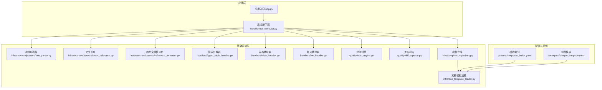
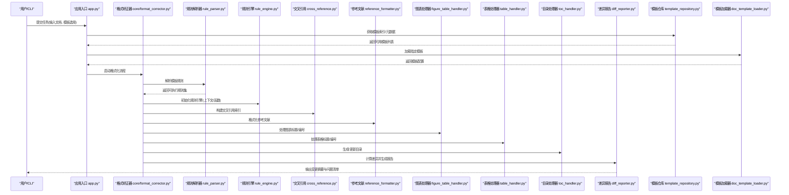
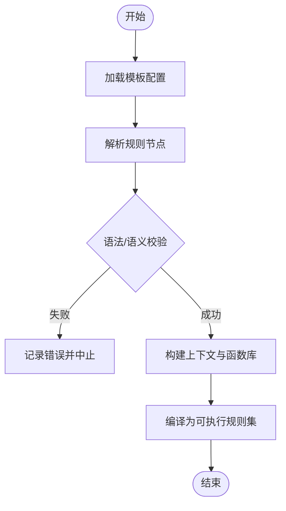
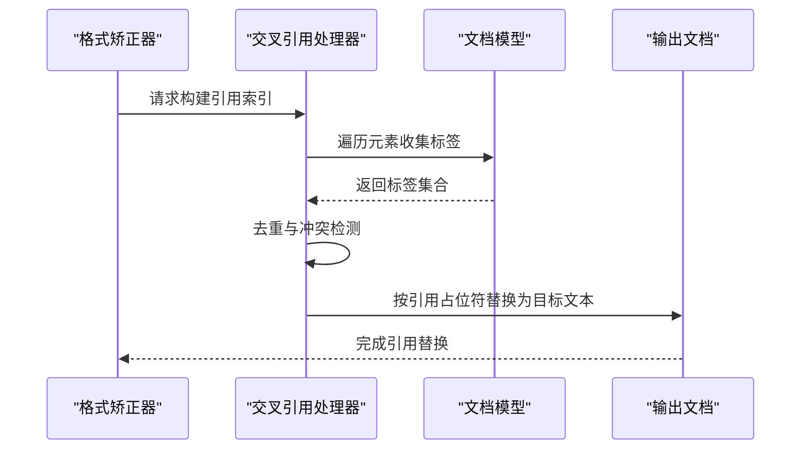
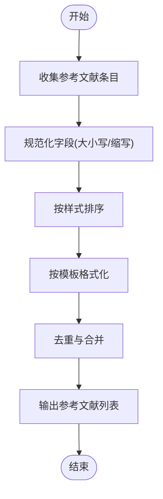
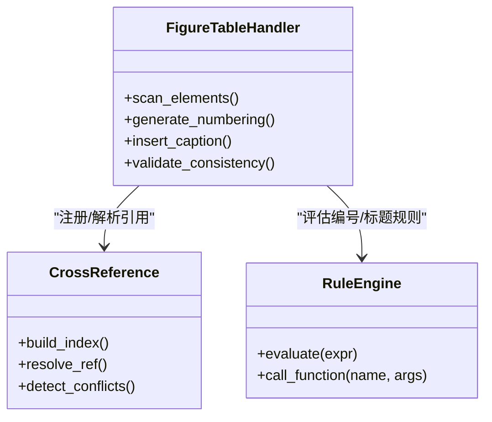
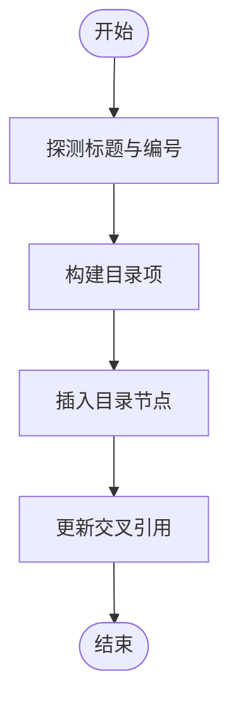
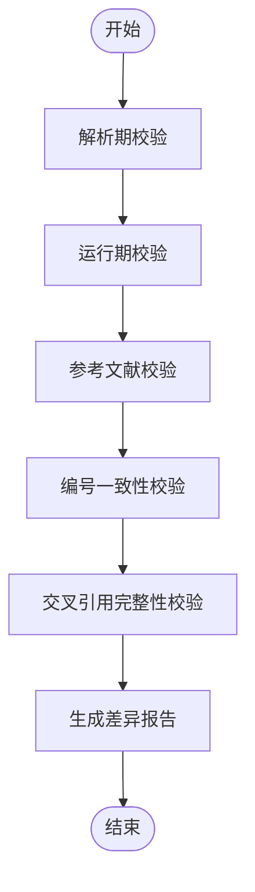
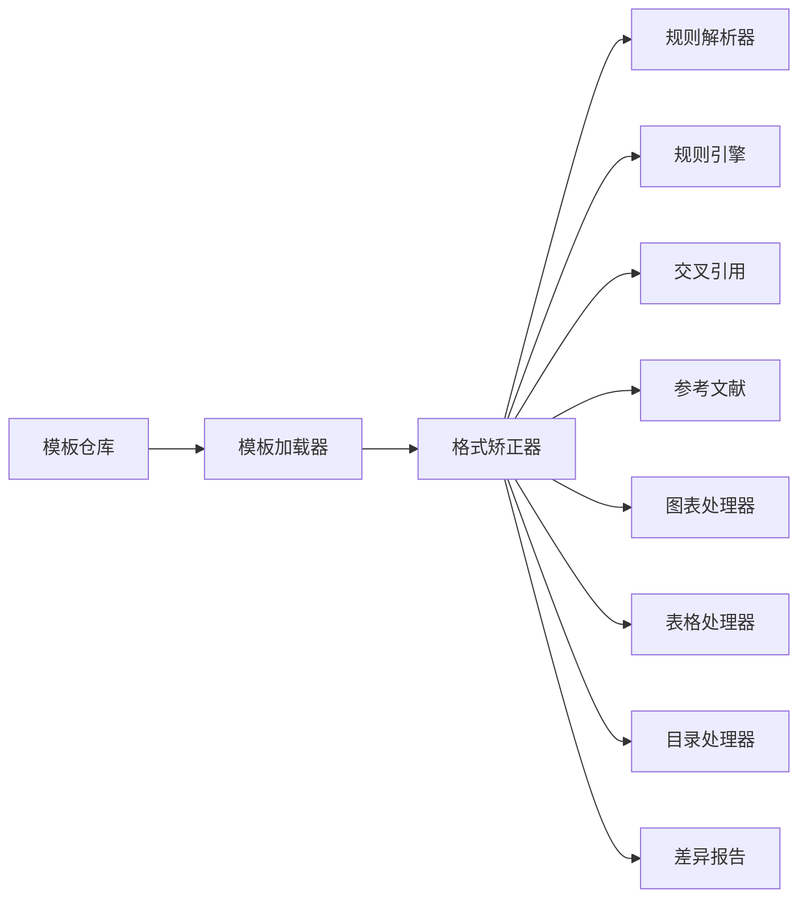

# 高级格式化规则

<cite>
**本文引用的文件**   
- [README.md](file://README.md)
- [pyproject.toml](file://pyproject.toml)
- [requirements.txt](file://requirements.txt)
- [run.py](file://run.py)
- [src/paper_format_corrector/app.py](file://src/paper_format_corrector/app.py)
- [src/paper_format_corrector/core/format_corrector.py](file://src/paper_format_corrector/core/format_corrector.py)
- [src/paper_format_corrector/infrastructure/parsers/rule_parser.py](file://src/paper_format_corrector/infrastructure/parsers/rule_parser.py)
- [src/paper_format_corrector/infrastructure/parsers/cross_reference.py](file://src/paper_format_corrector/infrastructure/parsers/cross_reference.py)
- [src/paper_format_corrector/infrastructure/parsers/reference_formatter.py](file://src/paper_format_corrector/infrastructure/parsers/reference_formatter.py)
- [src/paper_format_corrector/handlers/figure_table_handler.py](file://src/paper_format_corrector/handlers/figure_table_handler.py)
- [src/paper_format_corrector/handlers/table_handler.py](file://src/paper_format_corrector/handlers/table_handler.py)
- [src/paper_format_corrector/handlers/toc_handler.py](file://src/paper_format_corrector/handlers/toc_handler.py)
- [src/paper_format_corrector/quality/rule_engine.py](file://src/paper_format_corrector/quality/rule_engine.py)
- [src/paper_format_corrector/quality/diff_reporter.py](file://src/paper_format_corrector/quality/diff_reporter.py)
- [src/paper_format_corrector/infra/template_repository.py](file://src/paper_format_corrector/infra/template_repository.py)
- [src/paper_format_corrector/infra/doc_template_loader.py](file://src/paper_format_corrector/infra/doc_template_loader.py)
- [presets/templates_index.yaml](file://presets/templates_index.yaml)
- [examples/sample_template.yaml](file://examples/sample_template.yaml)
- [tests/test_rule_parser.py](file://tests/test_rule_parser.py)
- [tests/test_cross_reference.py](file://tests/test_cross_reference.py)
</cite>

## 目录
1. [简介](#简介)
2. [项目结构](#项目结构)
3. [核心组件](#核心组件)
4. [架构总览](#架构总览)
5. [详细组件分析](#详细组件分析)
6. [依赖关系分析](#依赖关系分析)
7. [性能考虑](#性能考虑)
8. [故障排查指南](#故障排查指南)
9. [结论](#结论)
10. [附录](#附录)

## 简介
本文件面向需要实现“高级格式化规则”的开发者与模板作者，聚焦以下目标：
- 条件格式化、动态内容生成、交叉引用处理等复杂业务逻辑的实现路径
- 自定义验证规则与错误检测逻辑的编写方法
- 正则表达式在模板中的应用（模式匹配与替换）
- 高级定制案例：自动编号系统、参考文献格式化、图表标题自动生成
- 性能优化技巧与调试方法

## 项目结构
本项目采用分层与领域驱动相结合的组织方式：
- 应用层：入口与编排（app.py、core/*）
- 基础设施层：解析器、处理器、质量引擎、模板仓库（infrastructure/*、handlers/*、quality/*、infra/*）
- 预设模板与示例：presets/*、examples/*
- 测试：tests/*

图示来源
- [src/paper_format_corrector/app.py](file://src/paper_format_corrector/app.py)
- [src/paper_format_corrector/core/format_corrector.py](file://src/paper_format_corrector/core/format_corrector.py)
- [src/paper_format_corrector/infrastructure/parsers/rule_parser.py](file://src/paper_format_corrector/infrastructure/parsers/rule_parser.py)
- [src/paper_format_corrector/infrastructure/parsers/cross_reference.py](file://src/paper_format_corrector/infrastructure/parsers/cross_reference.py)
- [src/paper_format_corrector/infrastructure/parsers/reference_formatter.py](file://src/paper_format_corrector/infrastructure/parsers/reference_formatter.py)
- [src/paper_format_corrector/handlers/figure_table_handler.py](file://src/paper_format_corrector/handlers/figure_table_handler.py)
- [src/paper_format_corrector/handlers/table_handler.py](file://src/paper_format_corrector/handlers/table_handler.py)
- [src/paper_format_corrector/handlers/toc_handler.py](file://src/paper_format_corrector/handlers/toc_handler.py)
- [src/paper_format_corrector/quality/rule_engine.py](file://src/paper_format_corrector/quality/rule_engine.py)
- [src/paper_format_corrector/quality/diff_reporter.py](file://src/paper_format_corrector/quality/diff_reporter.py)
- [src/paper_format_corrector/infra/template_repository.py](file://src/paper_format_corrector/infra/template_repository.py)
- [src/paper_format_corrector/infra/doc_template_loader.py](file://src/paper_format_corrector/infra/doc_template_loader.py)
- [presets/templates_index.yaml](file://presets/templates_index.yaml)
- [examples/sample_template.yaml](file://examples/sample_template.yaml)

章节来源
- [README.md](file://README.md)
- [pyproject.toml](file://pyproject.toml)
- [requirements.txt](file://requirements.txt)
- [run.py](file://run.py)

## 核心组件
- 规则解析器：负责将 YAML/JSON 模板中的规则描述解析为可执行对象，支持条件、循环、变量注入、正则替换等。
- 交叉引用处理器：扫描文档中的引用占位符，定位目标元素并生成稳定引用文本。
- 参考文献格式化：根据样式模板对参考文献条目进行统一排版与排序。
- 图表/表格处理器：基于规则自动插入或更新标题、编号、跨页断行等。
- 目录处理器：依据标题层级与编号规则生成目录。
- 规则引擎：提供运行时评估能力（条件判断、函数调用、上下文访问）。
- 差异报告：对比前后文档差异，输出变更摘要与问题清单。
- 模板仓库与加载器：管理本地/远程模板集合，按需加载与缓存。

章节来源
- [src/paper_format_corrector/infrastructure/parsers/rule_parser.py](file://src/paper_format_corrector/infrastructure/parsers/rule_parser.py)
- [src/paper_format_corrector/infrastructure/parsers/cross_reference.py](file://src/paper_format_corrector/infrastructure/parsers/cross_reference.py)
- [src/paper_format_corrector/infrastructure/parsers/reference_formatter.py](file://src/paper_format_corrector/infrastructure/parsers/reference_formatter.py)
- [src/paper_format_corrector/handlers/figure_table_handler.py](file://src/paper_format_corrector/handlers/figure_table_handler.py)
- [src/paper_format_corrector/handlers/table_handler.py](file://src/paper_format_corrector/handlers/table_handler.py)
- [src/paper_format_corrector/handlers/toc_handler.py](file://src/paper_format_corrector/handlers/toc_handler.py)
- [src/paper_format_corrector/quality/rule_engine.py](file://src/paper_format_corrector/quality/rule_engine.py)
- [src/paper_format_corrector/quality/diff_reporter.py](file://src/paper_format_corrector/quality/diff_reporter.py)
- [src/paper_format_corrector/infra/template_repository.py](file://src/paper_format_corrector/infra/template_repository.py)
- [src/paper_format_corrector/infra/doc_template_loader.py](file://src/paper_format_corrector/infra/doc_template_loader.py)

## 架构总览
下图展示从模板到文档的一次完整格式化流程，包括规则解析、交叉引用、参考文献、图表/表格处理、目录生成以及差异报告。

图示来源
- [src/paper_format_corrector/app.py](file://src/paper_format_corrector/app.py)
- [src/paper_format_corrector/core/format_corrector.py](file://src/paper_format_corrector/core/format_corrector.py)
- [src/paper_format_corrector/infrastructure/parsers/rule_parser.py](file://src/paper_format_corrector/infrastructure/parsers/rule_parser.py)
- [src/paper_format_corrector/quality/rule_engine.py](file://src/paper_format_corrector/quality/rule_engine.py)
- [src/paper_format_corrector/infrastructure/parsers/cross_reference.py](file://src/paper_format_corrector/infrastructure/parsers/cross_reference.py)
- [src/paper_format_corrector/infrastructure/parsers/reference_formatter.py](file://src/paper_format_corrector/infrastructure/parsers/reference_formatter.py)
- [src/paper_format_corrector/handlers/figure_table_handler.py](file://src/paper_format_corrector/handlers/figure_table_handler.py)
- [src/paper_format_corrector/handlers/table_handler.py](file://src/paper_format_corrector/handlers/table_handler.py)
- [src/paper_format_corrector/handlers/toc_handler.py](file://src/paper_format_corrector/handlers/toc_handler.py)
- [src/paper_format_corrector/quality/diff_reporter.py](file://src/paper_format_corrector/quality/diff_reporter.py)
- [src/paper_format_corrector/infra/template_repository.py](file://src/paper_format_corrector/infra/template_repository.py)
- [src/paper_format_corrector/infra/doc_template_loader.py](file://src/paper_format_corrector/infra/doc_template_loader.py)

## 详细组件分析

### 规则解析器与模板语法
- 职责：将模板中的规则声明转换为内部可执行对象；支持条件分支、循环、变量注入、函数调用、正则替换等。
- 关键点：
  - 条件格式化：通过规则引擎评估布尔表达式，决定渲染分支。
  - 动态内容生成：基于上下文变量与函数库生成标题、编号、日期等。
  - 正则表达式：在模板中定义匹配与替换模式，用于清理、标准化与格式化。
  - 错误检测：在解析阶段校验语法与语义，提前暴露不合法规则。

图示来源
- [src/paper_format_corrector/infrastructure/parsers/rule_parser.py](file://src/paper_format_corrector/infrastructure/parsers/rule_parser.py)
- [src/paper_format_corrector/quality/rule_engine.py](file://src/paper_format_corrector/quality/rule_engine.py)

章节来源
- [src/paper_format_corrector/infrastructure/parsers/rule_parser.py](file://src/paper_format_corrector/infrastructure/parsers/rule_parser.py)
- [src/paper_format_corrector/quality/rule_engine.py](file://src/paper_format_corrector/quality/rule_engine.py)
- [examples/sample_template.yaml](file://examples/sample_template.yaml)
- [tests/test_rule_parser.py](file://tests/test_rule_parser.py)

### 交叉引用处理
- 职责：识别文档中的引用占位符，建立“标签→位置/内容”的映射，并在渲染时替换为最终文本。
- 关键点：
  - 标签发现：扫描标题、图表、表格、公式等元素的唯一标识。
  - 引用解析：解析引用语法，定位目标并生成稳定文本。
  - 冲突处理：重复标签检测与提示。
  - 失效修复：缺失目标时的降级策略与告警。

图示来源
- [src/paper_format_corrector/infrastructure/parsers/cross_reference.py](file://src/paper_format_corrector/infrastructure/parsers/cross_reference.py)

章节来源
- [src/paper_format_corrector/infrastructure/parsers/cross_reference.py](file://src/paper_format_corrector/infrastructure/parsers/cross_reference.py)
- [tests/test_cross_reference.py](file://tests/test_cross_reference.py)

### 参考文献格式化
- 职责：根据样式模板对参考文献条目进行统一排版、排序与编号。
- 关键点：
  - 样式模板：定义字段顺序、标点、缩进、悬挂缩进等。
  - 排序策略：按作者、年份、期刊等规则排序。
  - 去重与合并：相同条目合并与引用计数。
  - 多语言支持：不同语言的标点与语序适配。

图示来源
- [src/paper_format_corrector/infrastructure/parsers/reference_formatter.py](file://src/paper_format_corrector/infrastructure/parsers/reference_formatter.py)

章节来源
- [src/paper_format_corrector/infrastructure/parsers/reference_formatter.py](file://src/paper_format_corrector/infrastructure/parsers/reference_formatter.py)

### 图表标题与自动编号
- 职责：为图表自动插入标题、编号，并支持跨页、分节、条件前缀等。
- 关键点：
  - 编号规则：按章节/全局编号，支持多级编号。
  - 标题模板：使用变量与函数生成标题文本。
  - 交叉引用：标题作为引用目标，供正文引用。
  - 一致性检查：重复编号、缺失标题的检测与修复。

图示来源
- [src/paper_format_corrector/handlers/figure_table_handler.py](file://src/paper_format_corrector/handlers/figure_table_handler.py)
- [src/paper_format_corrector/infrastructure/parsers/cross_reference.py](file://src/paper_format_corrector/infrastructure/parsers/cross_reference.py)
- [src/paper_format_corrector/quality/rule_engine.py](file://src/paper_format_corrector/quality/rule_engine.py)

章节来源
- [src/paper_format_corrector/handlers/figure_table_handler.py](file://src/paper_format_corrector/handlers/figure_table_handler.py)
- [src/paper_format_corrector/handlers/table_handler.py](file://src/paper_format_corrector/handlers/table_handler.py)
- [src/paper_format_corrector/infrastructure/parsers/cross_reference.py](file://src/paper_format_corrector/infrastructure/parsers/cross_reference.py)
- [src/paper_format_corrector/quality/rule_engine.py](file://src/paper_format_corrector/quality/rule_engine.py)

### 目录生成
- 职责：基于标题层级与编号规则生成目录，支持分页、样式与交叉引用。
- 关键点：
  - 标题探测：识别各级标题及其编号。
  - 目录项构建：生成页码与超链接。
  - 刷新机制：在内容变化后重新生成。

图示来源
- [src/paper_format_corrector/handlers/toc_handler.py](file://src/paper_format_corrector/handlers/toc_handler.py)

章节来源
- [src/paper_format_corrector/handlers/toc_handler.py](file://src/paper_format_corrector/handlers/toc_handler.py)

### 自定义验证规则与错误检测
- 验证点：
  - 模板语法与语义校验（规则解析器）
  - 交叉引用完整性（重复/缺失）
  - 编号一致性（重复编号、断号）
  - 参考文献规范（必填字段、格式）
- 错误处理：
  - 解析期错误：快速失败，给出明确位置与建议
  - 运行期错误：记录警告与降级策略
  - 差异报告：汇总变更与问题清单，便于人工复核

图示来源
- [src/paper_format_corrector/infrastructure/parsers/rule_parser.py](file://src/paper_format_corrector/infrastructure/parsers/rule_parser.py)
- [src/paper_format_corrector/infrastructure/parsers/cross_reference.py](file://src/paper_format_corrector/infrastructure/parsers/cross_reference.py)
- [src/paper_format_corrector/infrastructure/parsers/reference_formatter.py](file://src/paper_format_corrector/infrastructure/parsers/reference_formatter.py)
- [src/paper_format_corrector/quality/diff_reporter.py](file://src/paper_format_corrector/quality/diff_reporter.py)

章节来源
- [src/paper_format_corrector/quality/diff_reporter.py](file://src/paper_format_corrector/quality/diff_reporter.py)
- [tests/test_rule_parser.py](file://tests/test_rule_parser.py)
- [tests/test_cross_reference.py](file://tests/test_cross_reference.py)

### 正则表达式在模板中的应用
- 用途：
  - 模式匹配：识别特定文本片段（如旧式编号、不规范标点）
  - 替换操作：批量修正、标准化、格式化
- 建议：
  - 在模板中集中维护正则，避免硬编码
  - 提供预置常用模式（如中英文标点、单位、日期）
  - 对复杂正则进行单元测试覆盖

章节来源
- [src/paper_format_corrector/infrastructure/parsers/rule_parser.py](file://src/paper_format_corrector/infrastructure/parsers/rule_parser.py)
- [examples/sample_template.yaml](file://examples/sample_template.yaml)

### 高级定制案例
- 自动编号系统
  - 需求：按章节/全局编号，支持多级编号与条件前缀
  - 实现要点：编号规则模板、上下文变量、交叉引用注册
  - 参考：[图表示例类图](#图表标题与自动编号)
- 参考文献格式化
  - 需求：多风格、多语言、排序与去重
  - 实现要点：样式模板、字段规范化、排序策略
  - 参考：[流程图](#参考文献格式化)
- 图表标题自动生成
  - 需求：标题模板、编号、跨页、一致性检查
  - 实现要点：标题插入、编号生成、交叉引用
  - 参考：[流程图](#图表标题与自动编号)

章节来源
- [src/paper_format_corrector/handlers/figure_table_handler.py](file://src/paper_format_corrector/handlers/figure_table_handler.py)
- [src/paper_format_corrector/handlers/table_handler.py](file://src/paper_format_corrector/handlers/table_handler.py)
- [src/paper_format_corrector/infrastructure/parsers/reference_formatter.py](file://src/paper_format_corrector/infrastructure/parsers/reference_formatter.py)
- [src/paper_format_corrector/infrastructure/parsers/cross_reference.py](file://src/paper_format_corrector/infrastructure/parsers/cross_reference.py)

## 依赖关系分析
- 模块耦合：
  - 格式矫正器为核心编排者，依赖解析器、处理器与质量引擎
  - 模板仓库与加载器为外部资源提供者
- 潜在风险：
  - 循环依赖：确保解析器与处理器单向依赖规则引擎
  - 外部工具：谨慎引入重型依赖，保持模块化

图示来源
- [src/paper_format_corrector/core/format_corrector.py](file://src/paper_format_corrector/core/format_corrector.py)
- [src/paper_format_corrector/infrastructure/parsers/rule_parser.py](file://src/paper_format_corrector/infrastructure/parsers/rule_parser.py)
- [src/paper_format_corrector/quality/rule_engine.py](file://src/paper_format_corrector/quality/rule_engine.py)
- [src/paper_format_corrector/infrastructure/parsers/cross_reference.py](file://src/paper_format_corrector/infrastructure/parsers/cross_reference.py)
- [src/paper_format_corrector/infrastructure/parsers/reference_formatter.py](file://src/paper_format_corrector/infrastructure/parsers/reference_formatter.py)
- [src/paper_format_corrector/handlers/figure_table_handler.py](file://src/paper_format_corrector/handlers/figure_table_handler.py)
- [src/paper_format_corrector/handlers/table_handler.py](file://src/paper_format_corrector/handlers/table_handler.py)
- [src/paper_format_corrector/handlers/toc_handler.py](file://src/paper_format_corrector/handlers/toc_handler.py)
- [src/paper_format_corrector/quality/diff_reporter.py](file://src/paper_format_corrector/quality/diff_reporter.py)
- [src/paper_format_corrector/infra/template_repository.py](file://src/paper_format_corrector/infra/template_repository.py)
- [src/paper_format_corrector/infra/doc_template_loader.py](file://src/paper_format_corrector/infra/doc_template_loader.py)

章节来源
- [src/paper_format_corrector/core/format_corrector.py](file://src/paper_format_corrector/core/format_corrector.py)
- [src/paper_format_corrector/infra/template_repository.py](file://src/paper_format_corrector/infra/template_repository.py)
- [src/paper_format_corrector/infra/doc_template_loader.py](file://src/paper_format_corrector/infra/doc_template_loader.py)

## 性能考虑
- 解析与编译
  - 规则解析结果缓存，避免重复编译
  - 正则表达式预编译与复用
- 文档遍历
  - 惰性遍历与增量更新，减少全量扫描
  - 大文档分块处理，控制内存峰值
- I/O 与模板
  - 模板仓库与加载器启用缓存
  - 远程模板下载重试与超时控制
- 并发与队列
  - 批处理任务入队，限制并发度
  - 长耗时任务异步化，避免阻塞主流程

[本节为通用指导，无需源码引用]

## 故障排查指南
- 常见问题
  - 模板语法错误：查看解析期错误日志与位置提示
  - 交叉引用失效：检查标签唯一性与引用占位符语法
  - 编号不一致：运行一致性校验并修复重复/缺失
  - 参考文献格式异常：核对样式模板字段与必填项
- 调试方法
  - 开启详细日志，定位具体步骤
  - 使用差异报告对比变更前后的关键区域
  - 针对正则与模板规则编写最小复现用例

章节来源
- [src/paper_format_corrector/quality/diff_reporter.py](file://src/paper_format_corrector/quality/diff_reporter.py)
- [tests/test_rule_parser.py](file://tests/test_rule_parser.py)
- [tests/test_cross_reference.py](file://tests/test_cross_reference.py)

## 结论
通过规则解析器、交叉引用、参考文献、图表/表格处理器、目录生成与规则引擎的组合，本项目实现了可扩展的高级格式化能力。借助模板与正则表达式，可灵活表达复杂业务逻辑；配合差异报告与测试用例，可有效保障正确性与稳定性。建议在大型项目中优先关注性能优化与错误诊断，提升整体交付质量。

[本节为总结性内容，无需源码引用]

## 附录
- 模板索引与示例
  - 模板索引：[templates_index.yaml](file://presets/templates_index.yaml)
  - 示例模板：[sample_template.yaml](file://examples/sample_template.yaml)
- 入口与运行
  - 应用入口：[app.py](file://src/paper_format_corrector/app.py)
  - 运行脚本：[run.py](file://run.py)
  - 依赖清单：[requirements.txt](file://requirements.txt)、[pyproject.toml](file://pyproject.toml)

章节来源
- [presets/templates_index.yaml](file://presets/templates_index.yaml)
- [examples/sample_template.yaml](file://examples/sample_template.yaml)
- [src/paper_format_corrector/app.py](file://src/paper_format_corrector/app.py)
- [run.py](file://run.py)
- [requirements.txt](file://requirements.txt)
- [pyproject.toml](file://pyproject.toml)