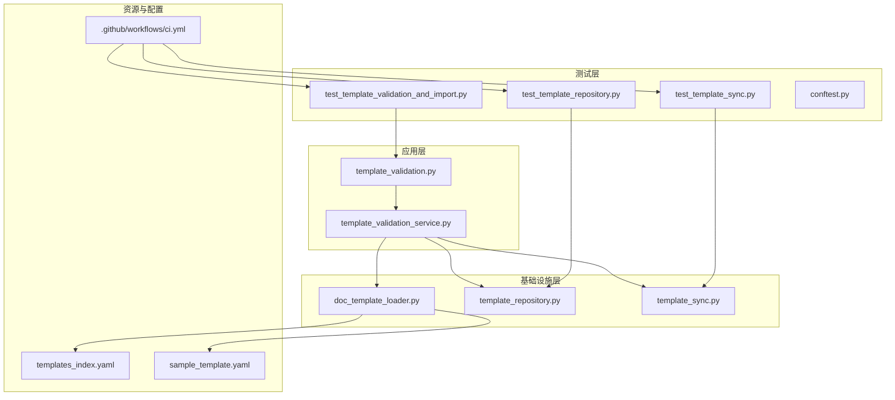
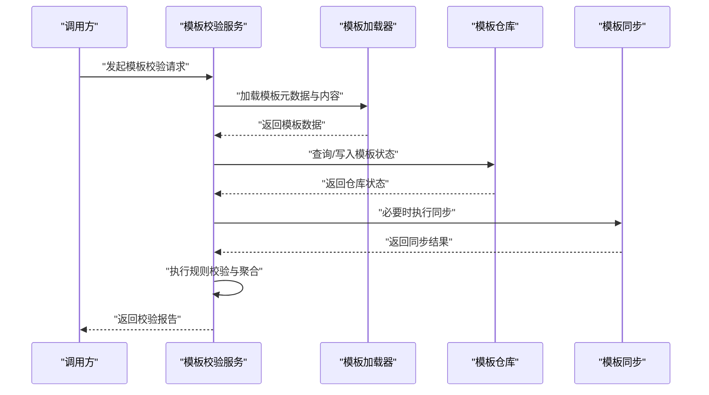
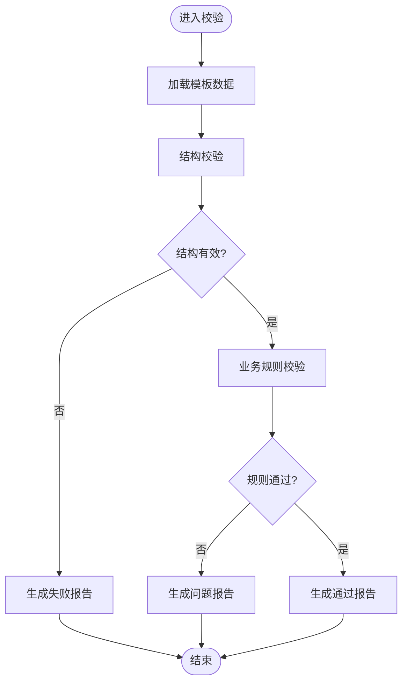
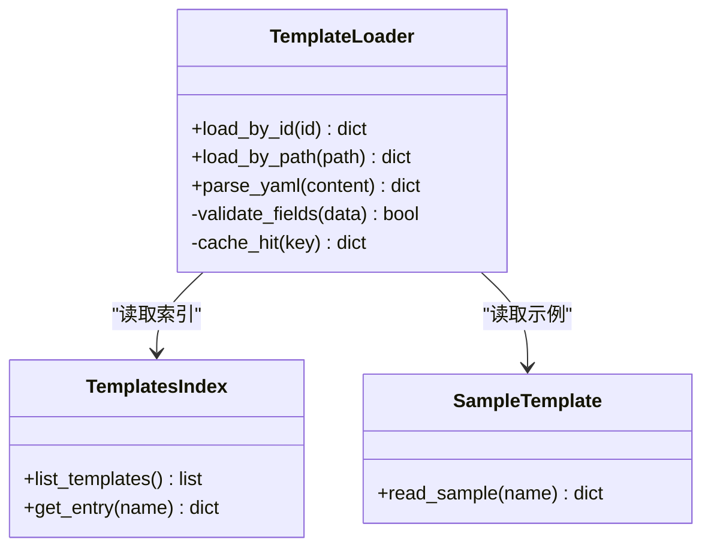
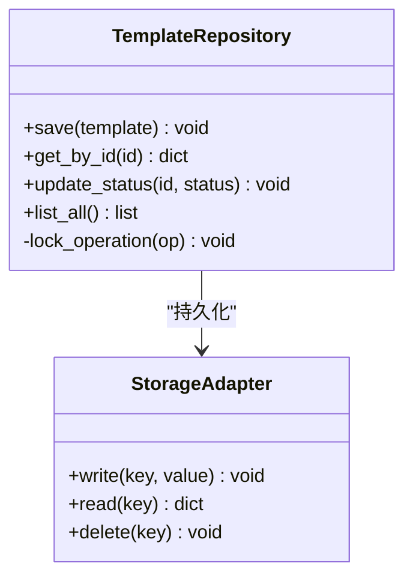
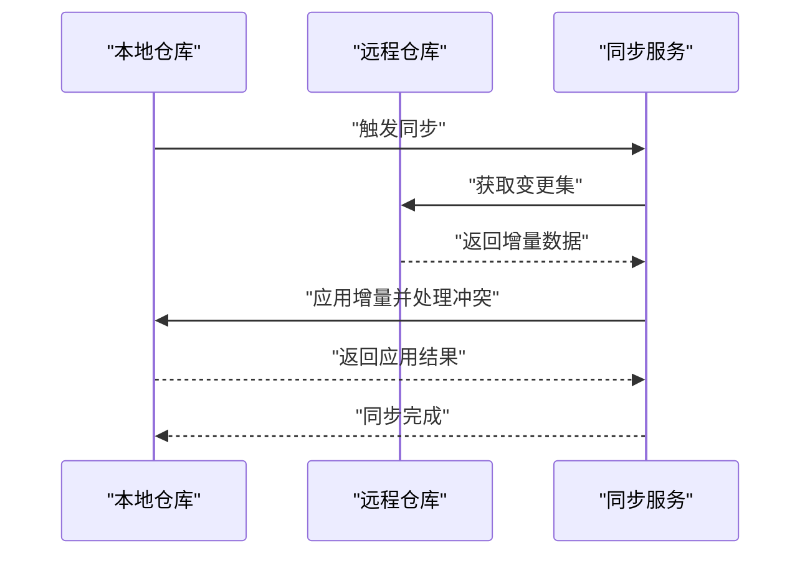
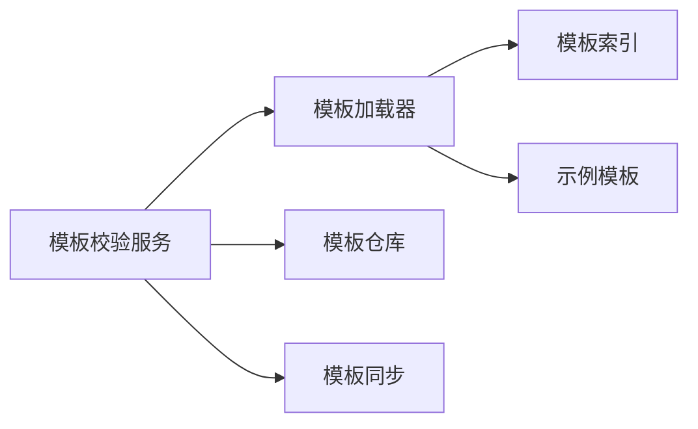

# 模板测试与调试

<cite>
**本文引用的文件**   
- [README.md](file://README.md)
- [pyproject.toml](file://pyproject.toml)
- [.github/workflows/ci.yml](file://.github/workflows/ci.yml)
- [src/paper_format_corrector/application/services/template_validation.py](file://src/paper_format_corrector/application/services/template_validation.py)
- [src/paper_format_corrector/application/services/template_validation_service.py](file://src/paper_format_corrector/application/services/template_validation_service.py)
- [src/paper_format_corrector/infra/doc_template_loader.py](file://src/paper_format_corrector/infra/doc_template_loader.py)
- [src/paper_format_corrector/infra/template_repository.py](file://src/paper_format_corrector/infra/template_repository.py)
- [src/paper_format_corrector/infra/template_sync.py](file://src/paper_format_corrector/infra/template_sync.py)
- [tests/test_template_validation_and_import.py](file://tests/test_template_validation_and_import.py)
- [tests/test_template_repository.py](file://tests/test_template_repository.py)
- [tests/test_template_sync.py](file://tests/test_template_sync.py)
- [tests/conftest.py](file://tests/conftest.py)
- [presets/templates_index.yaml](file://presets/templates_index.yaml)
- [examples/sample_template.yaml](file://examples/sample_template.yaml)
</cite>

## 目录
1. [简介](#简介)
2. [项目结构](#项目结构)
3. [核心组件](#核心组件)
4. [架构总览](#架构总览)
5. [详细组件分析](#详细组件分析)
6. [依赖关系分析](#依赖关系分析)
7. [性能考虑](#性能考虑)
8. [故障排查指南](#故障排查指南)
9. [结论](#结论)
10. [附录](#附录)

## 简介
本文件围绕“模板测试与调试”目标，系统化说明如何基于现有代码库建立完整的模板验证、单元测试与集成测试体系，并给出调试工具与日志分析方法、常见错误诊断与修复技巧，以及自动化测试流程与持续集成配置建议。内容聚焦于模板加载、校验、仓库管理与同步等关键路径，结合已有测试用例与CI脚本，提供可落地的实践方案。

## 项目结构
本项目采用分层与领域驱动相结合的组织方式：应用层包含模板校验服务；基础设施层负责模板加载、仓库与同步；测试层覆盖单元与集成场景；预设模板与示例模板位于 presets 与 examples 目录；CI 流水线定义在 .github/workflows/ci.yml。

图表来源
- [src/paper_format_corrector/application/services/template_validation.py](file://src/paper_format_corrector/application/services/template_validation.py)
- [src/paper_format_corrector/application/services/template_validation_service.py](file://src/paper_format_corrector/application/services/template_validation_service.py)
- [src/paper_format_corrector/infra/doc_template_loader.py](file://src/paper_format_corrector/infra/doc_template_loader.py)
- [src/paper_format_corrector/infra/template_repository.py](file://src/paper_format_corrector/infra/template_repository.py)
- [src/paper_format_corrector/infra/template_sync.py](file://src/paper_format_corrector/infra/template_sync.py)
- [tests/test_template_validation_and_import.py](file://tests/test_template_validation_and_import.py)
- [tests/test_template_repository.py](file://tests/test_template_repository.py)
- [tests/test_template_sync.py](file://tests/test_template_sync.py)
- [tests/conftest.py](file://tests/conftest.py)
- [presets/templates_index.yaml](file://presets/templates_index.yaml)
- [examples/sample_template.yaml](file://examples/sample_template.yaml)
- [.github/workflows/ci.yml](file://.github/workflows/ci.yml)

章节来源
- [README.md](file://README.md)
- [pyproject.toml](file://pyproject.toml)
- [.github/workflows/ci.yml](file://.github/workflows/ci.yml)

## 核心组件
- 模板校验服务（应用层）
  - 职责：对模板进行结构化校验、规则检查与结果聚合，向上暴露统一的校验接口。
  - 关键点：输入为模板数据或模板标识；输出为校验报告（通过/失败及问题清单）。
- 模板加载器（基础设施层）
  - 职责：从本地索引、示例模板或远程源加载模板元数据与内容，提供统一读取能力。
  - 关键点：支持 YAML 模板格式解析与基础字段完整性检查。
- 模板仓库（基础设施层）
  - 职责：管理模板的增删改查、版本与状态，提供持久化访问。
  - 关键点：读写一致性、并发安全与异常恢复。
- 模板同步（基础设施层）
  - 职责：将本地模板与远程仓库保持一致，处理冲突与增量更新。
  - 关键点：网络容错、幂等性与断点续传。
- 测试套件（测试层）
  - 职责：覆盖模板校验、仓库操作与同步流程的单元与集成测试。
  - 关键点：使用 fixtures 构造稳定环境，隔离外部依赖。

章节来源
- [src/paper_format_corrector/application/services/template_validation.py](file://src/paper_format_corrector/application/services/template_validation.py)
- [src/paper_format_corrector/application/services/template_validation_service.py](file://src/paper_format_corrector/application/services/template_validation_service.py)
- [src/paper_format_corrector/infra/doc_template_loader.py](file://src/paper_format_corrector/infra/doc_template_loader.py)
- [src/paper_format_corrector/infra/template_repository.py](file://src/paper_format_corrector/infra/template_repository.py)
- [src/paper_format_corrector/infra/template_sync.py](file://src/paper_format_corrector/infra/template_sync.py)
- [tests/test_template_validation_and_import.py](file://tests/test_template_validation_and_import.py)
- [tests/test_template_repository.py](file://tests/test_template_repository.py)
- [tests/test_template_sync.py](file://tests/test_template_sync.py)

## 架构总览
下图展示模板校验端到端流程：调用方请求模板校验，服务层协调加载器、仓库与同步模块完成数据准备与校验，最终返回结构化报告。

图表来源
- [src/paper_format_corrector/application/services/template_validation_service.py](file://src/paper_format_corrector/application/services/template_validation_service.py)
- [src/paper_format_corrector/infra/doc_template_loader.py](file://src/paper_format_corrector/infra/doc_template_loader.py)
- [src/paper_format_corrector/infra/template_repository.py](file://src/paper_format_corrector/infra/template_repository.py)
- [src/paper_format_corrector/infra/template_sync.py](file://src/paper_format_corrector/infra/template_sync.py)

## 详细组件分析

### 模板校验服务
- 设计要点
  - 输入抽象：支持模板对象、模板ID或模板路径等多种入口。
  - 校验阶段：结构校验（必填字段、类型）、业务规则（引用、样式、编号）、兼容性检查。
  - 输出规范：统一报告模型，包含通过/失败、问题列表与建议修复。
- 测试策略
  - 单元测试：针对各校验阶段编写最小用例，覆盖正常路径与边界条件。
  - 集成测试：以真实模板文件为输入，端到端验证校验报告准确性。
- 调试方法
  - 在关键分支插入结构化日志，记录输入摘要与中间结果。
  - 使用断言失败时输出差异对比，便于快速定位问题。

图表来源
- [src/paper_format_corrector/application/services/template_validation.py](file://src/paper_format_corrector/application/services/template_validation.py)
- [src/paper_format_corrector/application/services/template_validation_service.py](file://src/paper_format_corrector/application/services/template_validation_service.py)

章节来源
- [src/paper_format_corrector/application/services/template_validation.py](file://src/paper_format_corrector/application/services/template_validation.py)
- [src/paper_format_corrector/application/services/template_validation_service.py](file://src/paper_format_corrector/application/services/template_validation_service.py)
- [tests/test_template_validation_and_import.py](file://tests/test_template_validation_and_import.py)

### 模板加载器
- 设计要点
  - 多源加载：本地索引、示例模板、远程模板。
  - 解析与缓存：YAML 解析、字段映射与缓存命中优化。
  - 错误处理：缺失字段、格式错误、权限问题的明确提示。
- 测试策略
  - 单元测试：模拟不同输入（空模板、非法字段、损坏文件），验证异常与回退逻辑。
  - 集成测试：使用 presets 与 examples 中的真实模板，验证加载成功率与字段完整性。
- 调试方法
  - 记录加载路径、解析耗时与缓存命中率。
  - 对解析失败的模板输出最小复现片段，辅助定位问题。

图表来源
- [src/paper_format_corrector/infra/doc_template_loader.py](file://src/paper_format_corrector/infra/doc_template_loader.py)
- [presets/templates_index.yaml](file://presets/templates_index.yaml)
- [examples/sample_template.yaml](file://examples/sample_template.yaml)

章节来源
- [src/paper_format_corrector/infra/doc_template_loader.py](file://src/paper_format_corrector/infra/doc_template_loader.py)
- [presets/templates_index.yaml](file://presets/templates_index.yaml)
- [examples/sample_template.yaml](file://examples/sample_template.yaml)

### 模板仓库
- 设计要点
  - 数据模型：模板ID、版本、状态、时间戳、校验结果。
  - 事务性操作：批量更新、回滚与一致性保证。
  - 并发控制：读写锁或乐观锁避免竞态。
- 测试策略
  - 单元测试：模拟并发写入、删除不存在项、重复提交等场景。
  - 集成测试：连接真实存储后端，验证持久化与查询正确性。
- 调试方法
  - 记录每次变更的事务ID与前后快照，便于审计与回溯。
  - 对异常路径输出堆栈与上下文信息。

图表来源
- [src/paper_format_corrector/infra/template_repository.py](file://src/paper_format_corrector/infra/template_repository.py)

章节来源
- [src/paper_format_corrector/infra/template_repository.py](file://src/paper_format_corrector/infra/template_repository.py)
- [tests/test_template_repository.py](file://tests/test_template_repository.py)

### 模板同步
- 设计要点
  - 增量同步：仅拉取变更，减少带宽与时间开销。
  - 冲突解决：按策略合并或标记冲突供人工处理。
  - 幂等性：重复执行不产生副作用。
- 测试策略
  - 单元测试：模拟网络超时、部分失败、冲突场景。
  - 集成测试：对接测试远端仓库，验证同步一致性与恢复能力。
- 调试方法
  - 记录同步任务ID、步骤进度与失败重试次数。
  - 输出差异摘要与冲突详情，辅助快速修复。

图表来源
- [src/paper_format_corrector/infra/template_sync.py](file://src/paper_format_corrector/infra/template_sync.py)

章节来源
- [src/paper_format_corrector/infra/template_sync.py](file://src/paper_format_corrector/infra/template_sync.py)
- [tests/test_template_sync.py](file://tests/test_template_sync.py)

### 测试框架与夹具
- 夹具设计
  - 使用 conftest.py 提供共享夹具，如临时目录、模板样本、模拟仓库与同步客户端。
  - 参数化测试：针对不同模板与规则组合运行同一用例。
- 断言策略
  - 对报告结构进行强断言（字段存在、类型正确、数量范围）。
  - 对差异进行最小化比较，突出关键不一致点。
- 覆盖率与质量
  - 结合 pyproject.toml 配置覆盖率阈值与静态检查。
  - 在 CI 中强制要求通过率与覆盖率达标。

章节来源
- [tests/conftest.py](file://tests/conftest.py)
- [pyproject.toml](file://pyproject.toml)

## 依赖关系分析
- 组件耦合
  - 校验服务依赖加载器、仓库与同步模块，形成清晰的应用层编排。
  - 加载器依赖索引与示例模板资源，具备良好内聚性。
  - 仓库与同步模块解耦，便于替换存储实现与远端协议。
- 外部依赖
  - YAML 解析、文件系统、网络请求等第三方库。
  - 建议在测试中通过夹具与 Mock 隔离这些依赖。
- 循环依赖
  - 当前分层避免了直接循环导入，保持单向依赖。

图表来源
- [src/paper_format_corrector/application/services/template_validation_service.py](file://src/paper_format_corrector/application/services/template_validation_service.py)
- [src/paper_format_corrector/infra/doc_template_loader.py](file://src/paper_format_corrector/infra/doc_template_loader.py)
- [src/paper_format_corrector/infra/template_repository.py](file://src/paper_format_corrector/infra/template_repository.py)
- [src/paper_format_corrector/infra/template_sync.py](file://src/paper_format_corrector/infra/template_sync.py)
- [presets/templates_index.yaml](file://presets/templates_index.yaml)
- [examples/sample_template.yaml](file://examples/sample_template.yaml)

章节来源
- [src/paper_format_corrector/application/services/template_validation_service.py](file://src/paper_format_corrector/application/services/template_validation_service.py)
- [src/paper_format_corrector/infra/doc_template_loader.py](file://src/paper_format_corrector/infra/doc_template_loader.py)
- [src/paper_format_corrector/infra/template_repository.py](file://src/paper_format_corrector/infra/template_repository.py)
- [src/paper_format_corrector/infra/template_sync.py](file://src/paper_format_corrector/infra/template_sync.py)
- [presets/templates_index.yaml](file://presets/templates_index.yaml)
- [examples/sample_template.yaml](file://examples/sample_template.yaml)

## 性能考虑
- 缓存策略
  - 模板解析结果与仓库查询结果应加入内存或磁盘缓存，降低重复开销。
- 批处理与并行
  - 批量校验与同步任务可采用线程池或进程池提升吞吐。
- I/O 优化
  - 大模板分块读取与流式处理，避免一次性加载到内存。
- 监控指标
  - 记录解析耗时、缓存命中率、同步时长与失败率，用于容量规划与瓶颈定位。

[本节为通用指导，无需源码引用]

## 故障排查指南
- 常见问题
  - 模板字段缺失或类型错误：检查模板结构与加载器解析逻辑，确认索引条目与实际模板一致。
  - 同步失败或冲突：查看同步日志中的冲突详情，选择合适合并策略或人工介入。
  - 仓库写入异常：检查存储适配器与并发锁，确保事务回滚与一致性。
- 调试技巧
  - 启用详细日志级别，关注关键路径的输入摘要与中间结果。
  - 使用最小复现实例与参数化用例快速定位回归问题。
  - 对网络与I/O操作增加重试与超时保护，避免偶发失败影响稳定性。
- 修复建议
  - 对模板进行规范化与预校验，减少运行时错误。
  - 完善错误分类与用户提示，提高可观测性与可维护性。

章节来源
- [tests/test_template_validation_and_import.py](file://tests/test_template_validation_and_import.py)
- [tests/test_template_repository.py](file://tests/test_template_repository.py)
- [tests/test_template_sync.py](file://tests/test_template_sync.py)

## 结论
通过构建清晰的模板校验服务、稳健的加载器、仓库与同步模块，并结合完善的单元与集成测试、CI 流水线与调试手段，可以建立起高可靠、可观测、易维护的模板测试与调试体系。建议持续完善夹具与样例模板，强化覆盖率与质量门禁，保障模板生态的稳定演进。

[本节为总结性内容，无需源码引用]

## 附录
- 自动化测试与持续集成
  - 在 CI 中安装依赖、运行测试套件、收集覆盖率与报告。
  - 设置失败告警与制品归档，便于回溯与分析。
- 最佳实践
  - 用例命名清晰、断言具体、夹具复用。
  - 对外部依赖进行 Mock，确保测试稳定性与速度。
  - 定期清理过期模板与缓存，保持环境整洁。

章节来源
- [.github/workflows/ci.yml](file://.github/workflows/ci.yml)
- [pyproject.toml](file://pyproject.toml)