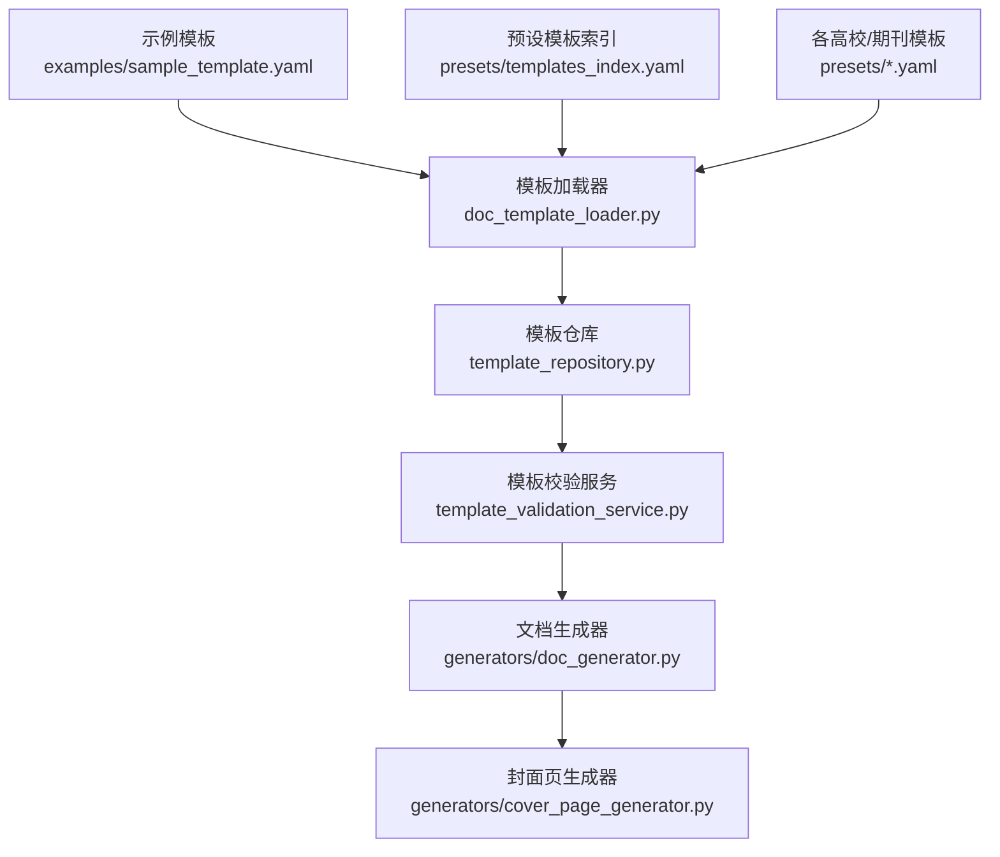
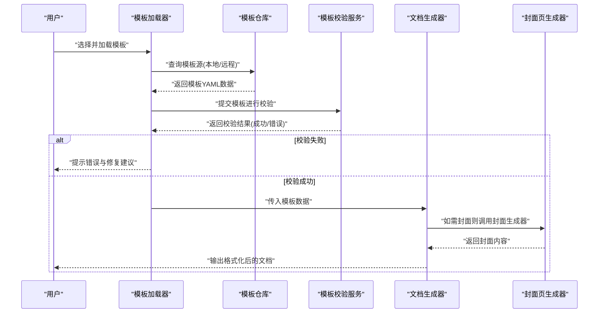
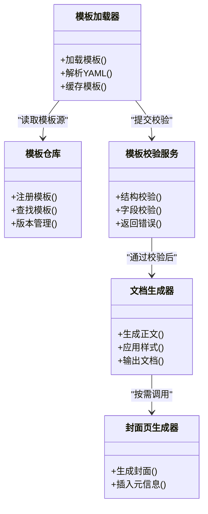

# 模板基础语法

<cite>
**本文引用的文件**   
- [示例模板](file://examples/sample_template.yaml)
- [预设模板索引](file://presets/templates_index.yaml)
- [学术模板](file://presets/academic_paper.yaml)
- [中文论文模板](file://presets/chinese_thesis.yaml)
- [清华大学模板](file://presets/tsinghua.yaml)
- [北京大学模板](file://presets/peking.yaml)
- [浙江大学模板](file://presets/zhejiang.yaml)
- [复旦大学模板](file://presets/fudan.yaml)
- [上海交通大学模板](file://presets/shanghaijiaotong.yaml)
- [中国科学技术大学模板](file://presets/ustc.yaml)
- [西安交通大学模板](file://presets/xjtu.yaml)
- [武汉大学模板](file://presets/wuhan.yaml)
- [南京大学模板](file://presets/nanjing.yaml)
- [模板验证服务](file://src/paper_format_corrector/application/services/template_validation_service.py)
- [模板加载器](file://src/paper_format_corrector/infra/doc_template_loader.py)
- [模板仓库](file://src/paper_format_corrector/infra/template_repository.py)
- [文档生成器](file://src/paper_format_corrector/generators/doc_generator.py)
- [封面页生成器](file://src/paper_format_corrector/generators/cover_page_generator.py)
- [用户指南](file://docs/user_guide.md)
- [模板指南](file://docs/template_guide.md)
</cite>

## 目录
1. [简介](#简介)
2. [项目结构](#项目结构)
3. [核心组件](#核心组件)
4. [架构总览](#架构总览)
5. [详细组件分析](#详细组件分析)
6. [依赖关系分析](#依赖关系分析)
7. [性能考虑](#性能考虑)
8. [故障排查指南](#故障排查指南)
9. [结论](#结论)
10. [附录](#附录)

## 简介
本章节面向首次接触模板系统的读者，系统介绍YAML模板的基础语法与核心配置项。内容涵盖：
- 模板文件的基本结构与字段定义
- 数据类型约定（字符串、数值、布尔、列表、映射）
- 必填字段与可选字段的区别
- 配置值校验规则与常见错误
- 通过实际示例展示标题设置、段落格式、字体样式等基础配置方法
- 调试技巧与排错建议

## 项目结构
模板相关资源与代码主要分布在以下位置：
- 示例与预设模板：examples、presets
- 模板解析与加载：src/paper_format_corrector/infra/doc_template_loader.py、template_repository.py
- 模板校验：src/paper_format_corrector/application/services/template_validation_service.py
- 模板驱动生成：src/paper_format_corrector/generators/doc_generator.py、cover_page_generator.py
- 用户文档：docs/user_guide.md、docs/template_guide.md

图示来源
- [示例模板](file://examples/sample_template.yaml)
- [预设模板索引](file://presets/templates_index.yaml)
- [模板加载器](file://src/paper_format_corrector/infra/doc_template_loader.py)
- [模板仓库](file://src/paper_format_corrector/infra/template_repository.py)
- [模板验证服务](file://src/paper_format_corrector/application/services/template_validation_service.py)
- [文档生成器](file://src/paper_format_corrector/generators/doc_generator.py)
- [封面页生成器](file://src/paper_format_corrector/generators/cover_page_generator.py)

章节来源
- [示例模板](file://examples/sample_template.yaml)
- [预设模板索引](file://presets/templates_index.yaml)
- [模板加载器](file://src/paper_format_corrector/infra/doc_template_loader.py)
- [模板仓库](file://src/paper_format_corrector/infra/template_repository.py)
- [模板验证服务](file://src/paper_format_corrector/application/services/template_validation_service.py)
- [文档生成器](file://src/paper_format_corrector/generators/doc_generator.py)
- [封面页生成器](file://src/paper_format_corrector/generators/cover_page_generator.py)
- [用户指南](file://docs/user_guide.md)
- [模板指南](file://docs/template_guide.md)

## 核心组件
- 模板加载器：负责从本地或远程路径读取YAML模板，并进行初步解析与缓存。
- 模板仓库：提供模板的注册、查找与版本管理，支持多模板切换。
- 模板校验服务：对模板进行结构校验、必填字段检查、取值范围与类型约束验证。
- 文档生成器：基于已校验的模板数据，驱动正文、章节、表格、图片、目录等元素的生成。
- 封面页生成器：根据模板中的封面配置，生成封面页及元信息。

章节来源
- [模板加载器](file://src/paper_format_corrector/infra/doc_template_loader.py)
- [模板仓库](file://src/paper_format_corrector/infra/template_repository.py)
- [模板验证服务](file://src/paper_format_corrector/application/services/template_validation_service.py)
- [文档生成器](file://src/paper_format_corrector/generators/doc_generator.py)
- [封面页生成器](file://src/paper_format_corrector/generators/cover_page_generator.py)

## 架构总览
下图展示了模板从加载到生成的关键流程，以及校验在其中的作用。

图示来源
- [模板加载器](file://src/paper_format_corrector/infra/doc_template_loader.py)
- [模板仓库](file://src/paper_format_corrector/infra/template_repository.py)
- [模板验证服务](file://src/paper_format_corrector/application/services/template_validation_service.py)
- [文档生成器](file://src/paper_format_corrector/generators/doc_generator.py)
- [封面页生成器](file://src/paper_format_corrector/generators/cover_page_generator.py)

## 详细组件分析

### YAML模板基础语法与数据结构
- 基本结构
  - 顶层为映射（键值对），包含全局配置与区块配置。
  - 常用顶层键包括：文档元信息、页面与版式、章节与段落、字体与样式、封面与页眉页脚、引用与交叉引用等。
- 数据类型约定
  - 字符串：用于名称、路径、描述等。
  - 数值：用于字号、行距、边距、编号层级等。
  - 布尔：用于开关类选项（如是否显示目录、是否启用自动编号）。
  - 列表：用于枚举值集合（如支持的导出格式、章节类型列表）。
  - 映射：用于嵌套配置（如字体族、段落属性、页边距四值）。
- 必填字段与可选字段
  - 必填字段：模板校验服务会强制检查，缺失将导致加载失败。
  - 可选字段：未提供时使用默认值；若提供需满足类型与取值范围约束。
- 配置值校验规则
  - 类型校验：确保字段类型为预期类型。
  - 取值范围：数值需在合理区间（如字号、边距）。
  - 枚举校验：某些字段仅接受预定义值（如对齐方式、纸张大小）。
  - 依赖校验：某些字段存在前置条件（如启用某功能后必须提供对应参数）。

章节来源
- [模板验证服务](file://src/paper_format_corrector/application/services/template_validation_service.py)
- [模板加载器](file://src/paper_format_corrector/infra/doc_template_loader.py)
- [模板仓库](file://src/paper_format_corrector/infra/template_repository.py)

### 标题设置与章节结构
- 标题层级
  - 通过章节类型与层级控制标题样式（如一级、二级、三级）。
  - 可配置编号规则、缩进、段前段后间距。
- 标题样式
  - 字体族、字号、粗细、颜色、对齐方式。
  - 段落属性：行距、首行缩进、悬挂缩进。
- 示例参考
  - 可参考预设模板中的章节与标题配置，了解典型写法与组合。

章节来源
- [学术模板](file://presets/academic_paper.yaml)
- [中文论文模板](file://presets/chinese_thesis.yaml)
- [清华大学模板](file://presets/tsinghua.yaml)
- [北京大学模板](file://presets/peking.yaml)
- [浙江大学模板](file://presets/zhejiang.yaml)
- [复旦大学模板](file://presets/fudan.yaml)
- [上海交通大学模板](file://presets/shanghaijiaotong.yaml)
- [中国科学技术大学模板](file://presets/ustc.yaml)
- [西安交通大学模板](file://presets/xjtu.yaml)
- [武汉大学模板](file://presets/wuhan.yaml)
- [南京大学模板](file://presets/nanjing.yaml)

### 段落格式与文本样式
- 段落格式
  - 对齐方式（左对齐、居中、右对齐、两端对齐）。
  - 行距（固定值、倍数）、段前段后间距、首行缩进。
- 文本样式
  - 字体族、字号、加粗、斜体、下划线、删除线。
  - 字符间距、上标/下标、字体颜色。
- 示例参考
  - 参考示例模板与预设模板中的段落与字体配置，理解常用组合。

章节来源
- [示例模板](file://examples/sample_template.yaml)
- [中文论文模板](file://presets/chinese_thesis.yaml)
- [清华大学模板](file://presets/tsinghua.yaml)

### 字体与样式配置
- 字体族
  - 中文字体与英文字体分别配置，支持回退策略。
- 字号与单位
  - 支持点号（pt）等单位，注意与页面布局的一致性。
- 样式继承
  - 可通过样式名复用，减少重复配置。
- 示例参考
  - 查看预设模板中的字体与样式块，学习最佳实践。

章节来源
- [学术模板](file://presets/academic_paper.yaml)
- [中文论文模板](file://presets/chinese_thesis.yaml)
- [上海交通大学模板](file://presets/shanghaijiaotong.yaml)

### 封面与页眉页脚
- 封面配置
  - 标题、作者、机构、日期、摘要、关键词等元信息。
  - 封面布局与样式（居中对齐、行距、字体）。
- 页眉页脚
  - 页码位置与格式、章节标题插入、左右页不同。
- 示例参考
  - 参考示例模板与预设模板中的封面与页眉页脚配置。

章节来源
- [示例模板](file://examples/sample_template.yaml)
- [模板指南](file://docs/template_guide.md)
- [封面页生成器](file://src/paper_format_corrector/generators/cover_page_generator.py)

### 模板校验与错误处理
- 校验流程
  - 加载后先进行结构校验，再执行字段级校验。
  - 校验失败时返回具体错误信息与修复建议。
- 常见错误
  - 缺少必填字段、类型不匹配、取值越界、枚举非法、依赖缺失。
- 调试技巧
  - 使用最小可用模板逐步添加字段定位问题。
  - 开启日志输出，关注校验阶段报错堆栈。
  - 对比预设模板差异，快速修正。

章节来源
- [模板验证服务](file://src/paper_format_corrector/application/services/template_validation_service.py)
- [模板加载器](file://src/paper_format_corrector/infra/doc_template_loader.py)

### 模板生成流程
- 生成步骤
  - 解析模板数据，构建内部模型。
  - 按章节顺序生成段落、标题、表格、图片等元素。
  - 应用样式与布局，输出最终文档。
- 封面生成
  - 根据封面配置生成封面页，并插入到文档开头。
- 示例参考
  - 参考文档生成器与封面页生成器的实现，理解数据到文档的转换过程。

章节来源
- [文档生成器](file://src/paper_format_corrector/generators/doc_generator.py)
- [封面页生成器](file://src/paper_format_corrector/generators/cover_page_generator.py)

## 依赖关系分析
模板系统的关键依赖如下：
- 模板加载器依赖模板仓库获取模板源。
- 模板校验服务依赖模板加载器提供的原始数据。
- 文档生成器依赖模板仓库与校验服务的结果。
- 封面页生成器由文档生成器按需调用。

图示来源
- [模板加载器](file://src/paper_format_corrector/infra/doc_template_loader.py)
- [模板仓库](file://src/paper_format_corrector/infra/template_repository.py)
- [模板验证服务](file://src/paper_format_corrector/application/services/template_validation_service.py)
- [文档生成器](file://src/paper_format_corrector/generators/doc_generator.py)
- [封面页生成器](file://src/paper_format_corrector/generators/cover_page_generator.py)

章节来源
- [模板加载器](file://src/paper_format_corrector/infra/doc_template_loader.py)
- [模板仓库](file://src/paper_format_corrector/infra/template_repository.py)
- [模板验证服务](file://src/paper_format_corrector/application/services/template_validation_service.py)
- [文档生成器](file://src/paper_format_corrector/generators/doc_generator.py)
- [封面页生成器](file://src/paper_format_corrector/generators/cover_page_generator.py)

## 性能考虑
- 模板缓存：避免重复解析相同模板，提升加载速度。
- 增量校验：仅在变更部分重新校验，降低开销。
- 懒加载：按需加载大型模板区块，减少内存占用。
- 并行生成：对独立章节并行生成，提高吞吐（需注意线程安全）。

[本节为通用指导，无需特定文件来源]

## 故障排查指南
- 常见问题
  - 模板无法加载：检查路径权限与网络连通性。
  - 校验失败：对照错误信息，逐项修复必填字段与取值范围。
  - 生成异常：确认依赖资源（字体、图片）是否存在且可读。
- 调试技巧
  - 启用详细日志，记录加载与校验阶段的关键状态。
  - 使用最小模板复现问题，逐步增加配置定位根因。
  - 对比预设模板差异，快速发现不一致之处。
- 恢复策略
  - 回滚到上一稳定版本模板。
  - 使用备份模板覆盖当前配置。

章节来源
- [模板验证服务](file://src/paper_format_corrector/application/services/template_validation_service.py)
- [模板加载器](file://src/paper_format_corrector/infra/doc_template_loader.py)
- [用户指南](file://docs/user_guide.md)

## 结论
YAML模板通过清晰的键值结构与严格的数据类型约定，提供了灵活而可控的文档格式化能力。借助模板加载器、仓库与校验服务，系统实现了从模板到文档的稳定转换。遵循必填与可选字段规范、掌握常见错误与调试技巧，可显著提升模板编写效率与质量。

[本节为总结性内容，无需特定文件来源]

## 附录
- 示例模板路径：examples/sample_template.yaml
- 预设模板索引：presets/templates_index.yaml
- 用户指南：docs/user_guide.md
- 模板指南：docs/template_guide.md

章节来源
- [示例模板](file://examples/sample_template.yaml)
- [预设模板索引](file://presets/templates_index.yaml)
- [用户指南](file://docs/user_guide.md)
- [模板指南](file://docs/template_guide.md)