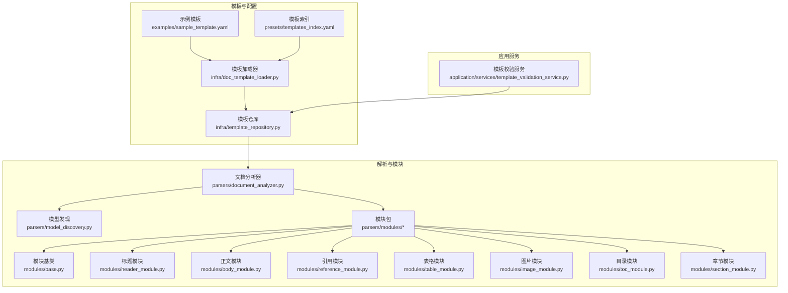
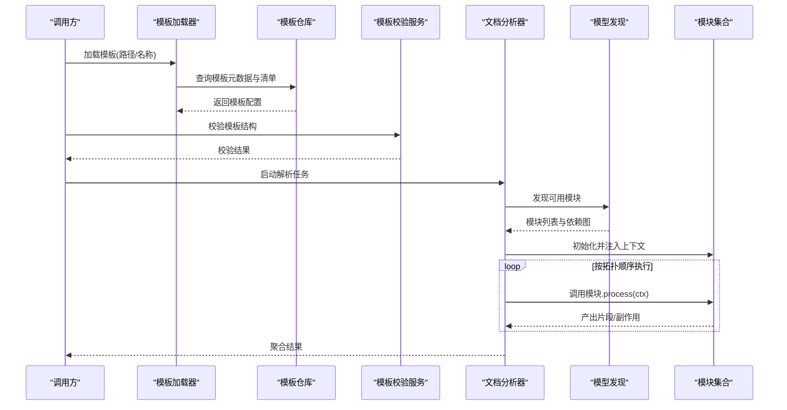
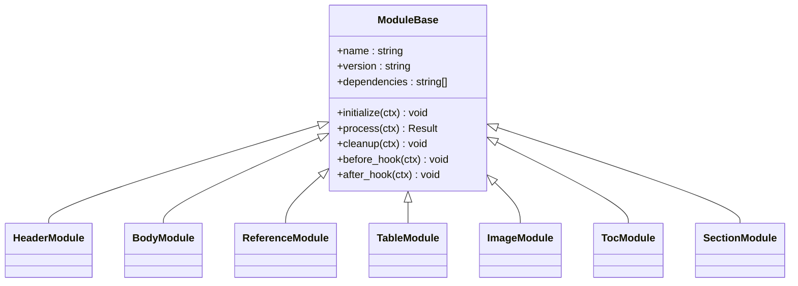
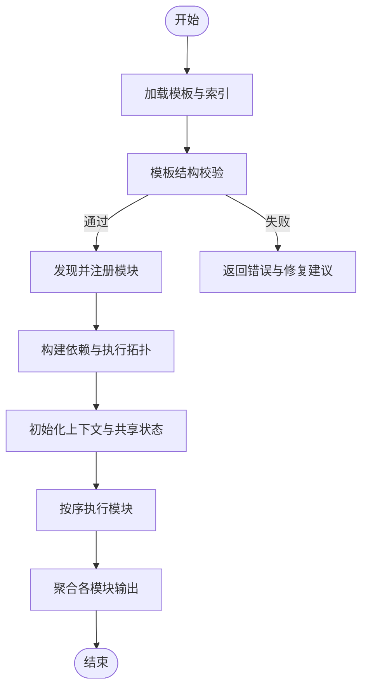
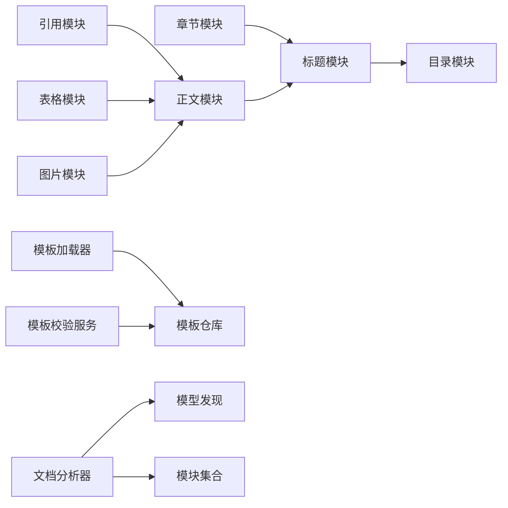

# 模板模块系统

<cite>
**本文引用的文件**   
- [src/paper_format_corrector/infrastructure/parsers/modules/__init__.py](file://src/paper_format_corrector/infrastructure/parsers/modules/__init__.py)
- [src/paper_format_corrector/infrastructure/parsers/modules/base.py](file://src/paper_format_corrector/infrastructure/parsers/modules/base.py)
- [src/paper_format_corrector/infrastructure/parsers/modules/header_module.py](file://src/paper_format_corrector/infrastructure/parsers/modules/header_module.py)
- [src/paper_format_corrector/infrastructure/parsers/modules/body_module.py](file://src/paper_format_corrector/infrastructure/parsers/modules/body_module.py)
- [src/paper_format_corrector/infrastructure/parsers/modules/reference_module.py](file://src/paper_format_corrector/infrastructure/parsers/modules/reference_module.py)
- [src/paper_format_corrector/infrastructure/parsers/modules/table_module.py](file://src/paper_format_corrector/infrastructure/parsers/modules/table_module.py)
- [src/paper_format_corrector/infrastructure/parsers/modules/image_module.py](file://src/paper_format_corrector/infrastructure/parsers/modules/image_module.py)
- [src/paper_format_corrector/infrastructure/parsers/modules/toc_module.py](file://src/paper_format_corrector/infrastructure/parsers/modules/toc_module.py)
- [src/paper_format_corrector/infrastructure/parsers/modules/section_module.py](file://src/paper_format_corrector/infrastructure/parsers/modules/section_module.py)
- [src/paper_format_corrector/infrastructure/parsers/document_analyzer.py](file://src/paper_format_corrector/infrastructure/parsers/document_analyzer.py)
- [src/paper_format_corrector/infrastructure/parsers/model_discovery.py](file://src/paper_format_corrector/infrastructure/parsers/model_discovery.py)
- [src/paper_format_corrector/infra/doc_template_loader.py](file://src/paper_format_corrector/infra/doc_template_loader.py)
- [src/paper_format_corrector/infra/template_repository.py](file://src/paper_format_corrector/infra/template_repository.py)
- [src/paper_format_corrector/application/services/template_validation_service.py](file://src/paper_format_corrector/application/services/template_validation_service.py)
- [examples/sample_template.yaml](file://examples/sample_template.yaml)
- [presets/templates_index.yaml](file://presets/templates_index.yaml)
- [tests/test_rule_parser.py](file://tests/test_rule_parser.py)
- [tests/test_document_analyzer.py](file://tests/test_document_analyzer.py)
</cite>

## 目录
1. [简介](#简介)
2. [项目结构](#项目结构)
3. [核心组件](#核心组件)
4. [架构总览](#架构总览)
5. [详细组件分析](#详细组件分析)
6. [依赖关系分析](#依赖关系分析)
7. [性能考虑](#性能考虑)
8. [故障排查指南](#故障排查指南)
9. [结论](#结论)
10. [附录](#附录)

## 简介
本文件面向“模板模块系统”的设计与使用，聚焦于文档解析与生成管线中的模块化能力。该系统将文档处理拆分为多个职责单一的模块（如标题、正文、引用、表格、图片、目录、章节等），通过统一的基类与注册机制实现可插拔扩展；同时提供模板加载、仓库管理、校验服务以及测试与调试方法，帮助用户快速构建自定义模块并集成到整体流程中。

## 项目结构
模板模块系统主要位于基础设施层与解析器子系统中，围绕“模块基类 + 内置模块 + 模板装配 + 校验与服务”的层次组织：

图表来源
- [examples/sample_template.yaml](file://examples/sample_template.yaml)
- [presets/templates_index.yaml](file://presets/templates_index.yaml)
- [src/paper_format_corrector/infra/doc_template_loader.py](file://src/paper_format_corrector/infra/doc_template_loader.py)
- [src/paper_format_corrector/infra/template_repository.py](file://src/paper_format_corrector/infra/template_repository.py)
- [src/paper_format_corrector/infrastructure/parsers/document_analyzer.py](file://src/paper_format_corrector/infrastructure/parsers/document_analyzer.py)
- [src/paper_format_corrector/infrastructure/parsers/model_discovery.py](file://src/paper_format_corrector/infrastructure/parsers/model_discovery.py)
- [src/paper_format_corrector/infrastructure/parsers/modules/base.py](file://src/paper_format_corrector/infrastructure/parsers/modules/base.py)
- [src/paper_format_corrector/infrastructure/parsers/modules/header_module.py](file://src/paper_format_corrector/infrastructure/parsers/modules/header_module.py)
- [src/paper_format_corrector/infrastructure/parsers/modules/body_module.py](file://src/paper_format_corrector/infrastructure/parsers/modules/body_module.py)
- [src/paper_format_corrector/infrastructure/parsers/modules/reference_module.py](file://src/paper_format_corrector/infrastructure/parsers/modules/reference_module.py)
- [src/paper_format_corrector/infrastructure/parsers/modules/table_module.py](file://src/paper_format_corrector/infrastructure/parsers/modules/table_module.py)
- [src/paper_format_corrector/infrastructure/parsers/modules/image_module.py](file://src/paper_format_corrector/infrastructure/parsers/modules/image_module.py)
- [src/paper_format_corrector/infrastructure/parsers/modules/toc_module.py](file://src/paper_format_corrector/infrastructure/parsers/modules/toc_module.py)
- [src/paper_format_corrector/infrastructure/parsers/modules/section_module.py](file://src/paper_format_corrector/infrastructure/parsers/modules/section_module.py)
- [src/paper_format_corrector/application/services/template_validation_service.py](file://src/paper_format_corrector/application/services/template_validation_service.py)

章节来源
- [src/paper_format_corrector/infra/doc_template_loader.py](file://src/paper_format_corrector/infra/doc_template_loader.py)
- [src/paper_format_corrector/infra/template_repository.py](file://src/paper_format_corrector/infra/template_repository.py)
- [src/paper_format_corrector/infrastructure/parsers/document_analyzer.py](file://src/paper_format_corrector/infrastructure/parsers/document_analyzer.py)
- [src/paper_format_corrector/infrastructure/parsers/model_discovery.py](file://src/paper_format_corrector/infrastructure/parsers/model_discovery.py)
- [src/paper_format_corrector/infrastructure/parsers/modules/base.py](file://src/paper_format_corrector/infrastructure/parsers/modules/base.py)
- [examples/sample_template.yaml](file://examples/sample_template.yaml)
- [presets/templates_index.yaml](file://presets/templates_index.yaml)

## 核心组件
- 模块基类与注册中心：定义统一接口、生命周期钩子、上下文传递与错误上报，并提供模块发现与注册机制。
- 内置模块族：标题、正文、引用、表格、图片、目录、章节等，各自负责特定内容片段的识别、抽取与标准化输出。
- 模板装配：从 YAML 模板与索引中读取模块清单、顺序与参数，驱动解析流水线。
- 模板校验：对模板结构与必填字段进行静态校验，保障运行时稳定性。
- 文档分析器与模型发现：协调模块执行、数据流转与结果聚合。

章节来源
- [src/paper_format_corrector/infrastructure/parsers/modules/base.py](file://src/paper_format_corrector/infrastructure/parsers/modules/base.py)
- [src/paper_format_corrector/infrastructure/parsers/document_analyzer.py](file://src/paper_format_corrector/infrastructure/parsers/document_analyzer.py)
- [src/paper_format_corrector/infrastructure/parsers/model_discovery.py](file://src/paper_format_corrector/infrastructure/parsers/model_discovery.py)
- [src/paper_format_corrector/application/services/template_validation_service.py](file://src/paper_format_corrector/application/services/template_validation_service.py)

## 架构总览
下图展示模板模块系统的端到端流程：模板加载 → 模板校验 → 文档分析 → 模块发现与注册 → 按序执行各模块 → 汇总输出。

图表来源
- [src/paper_format_corrector/infra/doc_template_loader.py](file://src/paper_format_corrector/infra/doc_template_loader.py)
- [src/paper_format_corrector/infra/template_repository.py](file://src/paper_format_corrector/infra/template_repository.py)
- [src/paper_format_corrector/application/services/template_validation_service.py](file://src/paper_format_corrector/application/services/template_validation_service.py)
- [src/paper_format_corrector/infrastructure/parsers/document_analyzer.py](file://src/paper_format_corrector/infrastructure/parsers/document_analyzer.py)
- [src/paper_format_corrector/infrastructure/parsers/model_discovery.py](file://src/paper_format_corrector/infrastructure/parsers/model_discovery.py)

## 详细组件分析

### 模块基类与注册机制
- 统一接口：所有模块需实现标准方法（如初始化、处理、清理），并通过上下文对象共享状态。
- 生命周期钩子：支持 before/after 钩子，便于在模块前后插入日志、指标或副作用。
- 依赖声明：模块可声明对其他模块产物的依赖，由模型发现阶段生成执行拓扑。
- 错误与诊断：集中式错误上报与诊断信息收集，便于定位问题。

图表来源
- [src/paper_format_corrector/infrastructure/parsers/modules/base.py](file://src/paper_format_corrector/infrastructure/parsers/modules/base.py)
- [src/paper_format_corrector/infrastructure/parsers/modules/header_module.py](file://src/paper_format_corrector/infrastructure/parsers/modules/header_module.py)
- [src/paper_format_corrector/infrastructure/parsers/modules/body_module.py](file://src/paper_format_corrector/infrastructure/parsers/modules/body_module.py)
- [src/paper_format_corrector/infrastructure/parsers/modules/reference_module.py](file://src/paper_format_corrector/infrastructure/parsers/modules/reference_module.py)
- [src/paper_format_corrector/infrastructure/parsers/modules/table_module.py](file://src/paper_format_corrector/infrastructure/parsers/modules/table_module.py)
- [src/paper_format_corrector/infrastructure/parsers/modules/image_module.py](file://src/paper_format_corrector/infrastructure/parsers/modules/image_module.py)
- [src/paper_format_corrector/infrastructure/parsers/modules/toc_module.py](file://src/paper_format_corrector/infrastructure/parsers/modules/toc_module.py)
- [src/paper_format_corrector/infrastructure/parsers/modules/section_module.py](file://src/paper_format_corrector/infrastructure/parsers/modules/section_module.py)

章节来源
- [src/paper_format_corrector/infrastructure/parsers/modules/base.py](file://src/paper_format_corrector/infrastructure/parsers/modules/base.py)

### 标题模块（Header）
- 功能：识别文档标题层级、提取标题文本与编号、规范化样式映射。
- 输入：文档原始内容与上下文（包含已发现的章节结构）。
- 输出：结构化标题节点，供后续目录生成与交叉引用使用。
- 配置项：标题级别范围、编号策略、样式映射规则等。

章节来源
- [src/paper_format_corrector/infrastructure/parsers/modules/header_module.py](file://src/paper_format_corrector/infrastructure/parsers/modules/header_module.py)

### 正文模块（Body）
- 功能：抽取正文段落、清洗空白与不可见字符、合并断行、保留必要格式标记。
- 输入：文档主体区域与上下文。
- 输出：标准化段落序列，附带位置信息与样式标签。
- 配置项：段落边界判定、换行策略、特殊符号处理等。

章节来源
- [src/paper_format_corrector/infrastructure/parsers/modules/body_module.py](file://src/paper_format_corrector/infrastructure/parsers/modules/body_module.py)

### 引用模块（Reference）
- 功能：识别参考文献条目、解析作者/题名/出处/年份等字段、去重与排序。
- 输入：文档末尾或指定区域的引用块。
- 输出：规范化的引用记录列表，支持多种引文风格。
- 配置项：引文风格、分隔符、字段映射、去重策略等。

章节来源
- [src/paper_format_corrector/infrastructure/parsers/modules/reference_module.py](file://src/paper_format_corrector/infrastructure/parsers/modules/reference_module.py)

### 表格模块（Table）
- 功能：检测表格区域、解析行列结构、提取表头与单元格内容、对齐与跨行跨列处理。
- 输入：文档中的表格片段。
- 输出：结构化表格数据与元信息（行列数、表头标识等）。
- 配置项：最小行数阈值、表头识别规则、空单元格处理等。

章节来源
- [src/paper_format_corrector/infrastructure/parsers/modules/table_module.py](file://src/paper_format_corrector/infrastructure/parsers/modules/table_module.py)

### 图片模块（Image）
- 功能：定位图片、提取尺寸与分辨率、关联说明文字、生成占位与索引。
- 输入：文档图像区域与相邻文本。
- 输出：图片元数据与说明文本，用于排版与导出。
- 配置项：图片过滤条件、说明文字匹配窗口、命名规则等。

章节来源
- [src/paper_format_corrector/infrastructure/parsers/modules/image_module.py](file://src/paper_format_corrector/infrastructure/parsers/modules/image_module.py)

### 目录模块（TOC）
- 功能：基于标题模块产物生成目录树、计算页码占位、维护层级缩进。
- 输入：标题节点集合与文档布局信息。
- 输出：目录条目序列，支持多级嵌套与自动更新。
- 配置项：最大层级、前缀样式、页码对齐方式等。

章节来源
- [src/paper_format_corrector/infrastructure/parsers/modules/toc_module.py](file://src/paper_format_corrector/infrastructure/parsers/modules/toc_module.py)

### 章节模块（Section）
- 功能：识别章节边界、划分文档结构、建立父子关系、为其他模块提供结构上下文。
- 输入：原始文档流与标题线索。
- 输出：章节树与区间标注，供标题、正文、引用等模块消费。
- 配置项：章节起始模式、结束条件、嵌套深度限制等。

章节来源
- [src/paper_format_corrector/infrastructure/parsers/modules/section_module.py](file://src/paper_format_corrector/infrastructure/parsers/modules/section_module.py)

### 模板装配与执行流程
模板装配将 YAML 模板与索引解析为模块清单与执行顺序，随后由文档分析器驱动模块执行。

图表来源
- [src/paper_format_corrector/infra/doc_template_loader.py](file://src/paper_format_corrector/infra/doc_template_loader.py)
- [src/paper_format_corrector/infra/template_repository.py](file://src/paper_format_corrector/infra/template_repository.py)
- [src/paper_format_corrector/application/services/template_validation_service.py](file://src/paper_format_corrector/application/services/template_validation_service.py)
- [src/paper_format_corrector/infrastructure/parsers/document_analyzer.py](file://src/paper_format_corrector/infrastructure/parsers/document_analyzer.py)
- [src/paper_format_corrector/infrastructure/parsers/model_discovery.py](file://src/paper_format_corrector/infrastructure/parsers/model_discovery.py)

章节来源
- [src/paper_format_corrector/infra/doc_template_loader.py](file://src/paper_format_corrector/infra/doc_template_loader.py)
- [src/paper_format_corrector/infra/template_repository.py](file://src/paper_format_corrector/infra/template_repository.py)
- [src/paper_format_corrector/application/services/template_validation_service.py](file://src/paper_format_corrector/application/services/template_validation_service.py)
- [src/paper_format_corrector/infrastructure/parsers/document_analyzer.py](file://src/paper_format_corrector/infrastructure/parsers/document_analyzer.py)
- [src/paper_format_corrector/infrastructure/parsers/model_discovery.py](file://src/paper_format_corrector/infrastructure/parsers/model_discovery.py)

## 依赖关系分析
- 模块间依赖：章节模块为上游，标题模块依赖章节结构；目录模块依赖标题模块；引用、表格、图片模块相对独立但可共享上下文。
- 模板与仓库：模板加载器依赖模板仓库获取清单与资源；校验服务对模板结构进行静态检查。
- 解析器与发现：文档分析器依赖模型发现来枚举与实例化模块，并依据依赖图编排执行顺序。

图表来源
- [src/paper_format_corrector/infrastructure/parsers/modules/section_module.py](file://src/paper_format_corrector/infrastructure/parsers/modules/section_module.py)
- [src/paper_format_corrector/infrastructure/parsers/modules/header_module.py](file://src/paper_format_corrector/infrastructure/parsers/modules/header_module.py)
- [src/paper_format_corrector/infrastructure/parsers/modules/toc_module.py](file://src/paper_format_corrector/infrastructure/parsers/modules/toc_module.py)
- [src/paper_format_corrector/infrastructure/parsers/modules/body_module.py](file://src/paper_format_corrector/infrastructure/parsers/modules/body_module.py)
- [src/paper_format_corrector/infrastructure/parsers/modules/reference_module.py](file://src/paper_format_corrector/infrastructure/parsers/modules/reference_module.py)
- [src/paper_format_corrector/infrastructure/parsers/modules/table_module.py](file://src/paper_format_corrector/infrastructure/parsers/modules/table_module.py)
- [src/paper_format_corrector/infrastructure/parsers/modules/image_module.py](file://src/paper_format_corrector/infrastructure/parsers/modules/image_module.py)
- [src/paper_format_corrector/infra/doc_template_loader.py](file://src/paper_format_corrector/infra/doc_template_loader.py)
- [src/paper_format_corrector/infra/template_repository.py](file://src/paper_format_corrector/infra/template_repository.py)
- [src/paper_format_corrector/application/services/template_validation_service.py](file://src/paper_format_corrector/application/services/template_validation_service.py)
- [src/paper_format_corrector/infrastructure/parsers/document_analyzer.py](file://src/paper_format_corrector/infrastructure/parsers/document_analyzer.py)
- [src/paper_format_corrector/infrastructure/parsers/model_discovery.py](file://src/paper_format_corrector/infrastructure/parsers/model_discovery.py)

章节来源
- [src/paper_format_corrector/infrastructure/parsers/document_analyzer.py](file://src/paper_format_corrector/infrastructure/parsers/document_analyzer.py)
- [src/paper_format_corrector/infrastructure/parsers/model_discovery.py](file://src/paper_format_corrector/infrastructure/parsers/model_discovery.py)
- [src/paper_format_corrector/infra/doc_template_loader.py](file://src/paper_format_corrector/infra/doc_template_loader.py)
- [src/paper_format_corrector/infra/template_repository.py](file://src/paper_format_corrector/infra/template_repository.py)
- [src/paper_format_corrector/application/services/template_validation_service.py](file://src/paper_format_corrector/application/services/template_validation_service.py)

## 性能考虑
- 模块并行度：无强依赖的模块可在安全前提下并发执行，提升吞吐。
- 上下文大小控制：避免在上下文中保存大对象副本，采用引用与惰性加载。
- 增量处理：对长文档分块处理，减少内存峰值。
- 缓存命中：对重复计算的中间结果（如标题树、章节边界）进行缓存。
- I/O 优化：批量读取与写入，减少磁盘访问次数。

[本节为通用指导，不直接分析具体文件]

## 故障排查指南
- 模板校验失败：检查模板必填字段、类型与取值范围，参考校验服务的错误提示。
- 模块未注册：确认模块已正确实现基类接口并在注册表中可见。
- 依赖循环：若出现执行死锁，检查模块依赖声明是否形成环。
- 上下文缺失：确保上游模块在 process 前完成必要数据的写入。
- 单元测试辅助：利用现有测试用例验证模块行为与边界情况。

章节来源
- [src/paper_format_corrector/application/services/template_validation_service.py](file://src/paper_format_corrector/application/services/template_validation_service.py)
- [tests/test_rule_parser.py](file://tests/test_rule_parser.py)
- [tests/test_document_analyzer.py](file://tests/test_document_analyzer.py)

## 结论
模板模块系统通过清晰的基类契约、灵活的模板装配与严格的校验服务，实现了高内聚、低耦合的文档处理能力。用户可基于内置模块快速组合出符合规范的文档处理流水线，也可按需扩展新模块以满足个性化需求。配合完善的测试与调试手段，系统具备良好的可维护性与可扩展性。

[本节为总结性内容，不直接分析具体文件]

## 附录

### 内置模块配置要点速览
- 标题模块：标题级别范围、编号策略、样式映射。
- 正文模块：段落边界、换行策略、符号处理。
- 引用模块：引文风格、字段映射、去重排序。
- 表格模块：最小行数、表头识别、空单元格处理。
- 图片模块：过滤条件、说明匹配窗口、命名规则。
- 目录模块：最大层级、前缀样式、页码对齐。
- 章节模块：起始模式、结束条件、嵌套深度。

章节来源
- [src/paper_format_corrector/infrastructure/parsers/modules/header_module.py](file://src/paper_format_corrector/infrastructure/parsers/modules/header_module.py)
- [src/paper_format_corrector/infrastructure/parsers/modules/body_module.py](file://src/paper_format_corrector/infrastructure/parsers/modules/body_module.py)
- [src/paper_format_corrector/infrastructure/parsers/modules/reference_module.py](file://src/paper_format_corrector/infrastructure/parsers/modules/reference_module.py)
- [src/paper_format_corrector/infrastructure/parsers/modules/table_module.py](file://src/paper_format_corrector/infrastructure/parsers/modules/table_module.py)
- [src/paper_format_corrector/infrastructure/parsers/modules/image_module.py](file://src/paper_format_corrector/infrastructure/parsers/modules/image_module.py)
- [src/paper_format_corrector/infrastructure/parsers/modules/toc_module.py](file://src/paper_format_corrector/infrastructure/parsers/modules/toc_module.py)
- [src/paper_format_corrector/infrastructure/parsers/modules/section_module.py](file://src/paper_format_corrector/infrastructure/parsers/modules/section_module.py)

### 自定义模块开发步骤
- 新建模块类：继承模块基类，实现 initialize/process/cleanup 等方法。
- 声明依赖：在 dependencies 中列出所需上游模块名。
- 注册模块：确保模块被模型发现机制扫描并注册。
- 编写测试：覆盖正常路径与异常分支，验证上下文读写与副作用。
- 集成模板：在模板清单中添加模块条目与参数，运行端到端验证。

章节来源
- [src/paper_format_corrector/infrastructure/parsers/modules/base.py](file://src/paper_format_corrector/infrastructure/parsers/modules/base.py)
- [src/paper_format_corrector/infrastructure/parsers/model_discovery.py](file://src/paper_format_corrector/infrastructure/parsers/model_discovery.py)
- [examples/sample_template.yaml](file://examples/sample_template.yaml)
- [tests/test_rule_parser.py](file://tests/test_rule_parser.py)

### 最佳实践
- 单一职责：每个模块只关注一类内容的抽取与标准化。
- 幂等设计：多次执行应得到一致结果，便于重试与回滚。
- 明确边界：清晰定义输入输出与上下文键名，避免隐式耦合。
- 可观测性：记录关键指标与诊断信息，便于定位问题。
- 渐进增强：优先保证基础能力，再逐步添加高级特性。

[本节为通用指导，不直接分析具体文件]