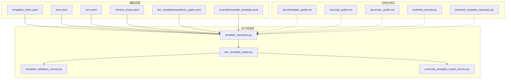
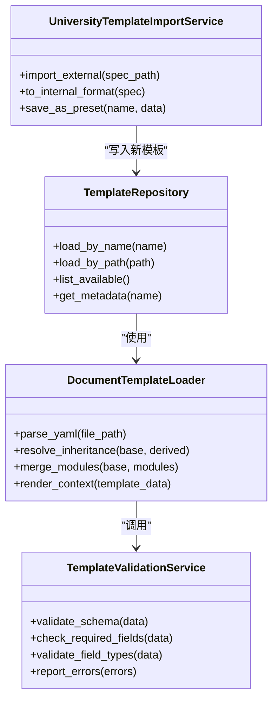
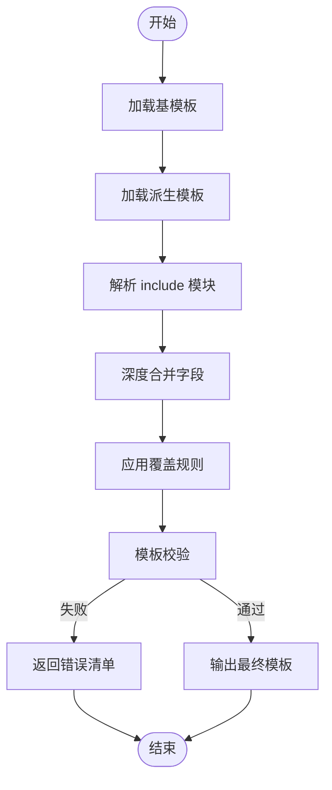
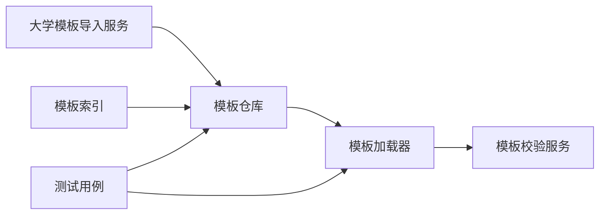

# 模板结构分析

<cite>
**本文引用的文件**   
- [README.md](file://README.md)
- [template_guide.md](file://docs/template_guide.md)
- [api_guide.md](file://docs/api_guide.md)
- [user_guide.md](file://docs/user_guide.md)
- [presets/templates_index.yaml](file://presets/templates_index.yaml)
- [presets/ieee.yaml](file://presets/ieee.yaml)
- [presets/acm.yaml](file://presets/acm.yaml)
- [presets/chinese_thesis.yaml](file://presets/chinese_thesis.yaml)
- [presets/doc_templates/academic_paper.yaml](file://presets/doc_templates/academic_paper.yaml)
- [examples/sample_template.yaml](file://examples/sample_template.yaml)
- [src/paper_format_corrector/infra/template_repository.py](file://src/paper_format_corrector/infra/template_repository.py)
- [src/paper_format_corrector/infra/doc_template_loader.py](file://src/paper_format_corrector/infra/doc_template_loader.py)
- [src/paper_format_corrector/application/services/template_validation_service.py](file://src/paper_format_corrector/application/services/template_validation_service.py)
- [src/paper_format_corrector/application/services/university_template_import_service.py](file://src/paper_format_corrector/application/services/university_template_import_service.py)
- [tests/test_presets.py](file://tests/test_presets.py)
- [tests/test_template_repository.py](file://tests/test_template_repository.py)
</cite>

## 目录
1. [简介](#简介)
2. [项目结构](#项目结构)
3. [核心组件](#核心组件)
4. [架构总览](#架构总览)
5. [详细组件分析](#详细组件分析)
6. [依赖关系分析](#依赖关系分析)
7. [性能考虑](#性能考虑)
8. [故障排查指南](#故障排查指南)
9. [结论](#结论)
10. [附录](#附录)

## 简介
本文件聚焦于“论文格式矫正工具”的模板体系，系统性解析 YAML 模板的结构、字段定义与规则语法；通过实际模板示例展示不同格式标准的实现方式；解释模板继承机制与模块复用模式；总结模板设计模式与架构原则；并提供复杂模板的分解与组合策略。文档面向希望扩展或定制模板的用户与开发者，力求在可操作性和可读性之间取得平衡。

## 项目结构
模板相关资源与代码主要分布在以下位置：
- 预设模板与索引：presets/*.yaml、presets/templates_index.yaml、presets/doc_templates/*.yaml
- 示例模板：examples/sample_template.yaml
- 模板加载与仓库：src/paper_format_corrector/infra/template_repository.py、doc_template_loader.py
- 模板校验与服务：application/services/template_validation_service.py、university_template_import_service.py
- 用户与开发者文档：docs/template_guide.md、docs/api_guide.md、docs/user_guide.md
- 测试用例：tests/test_presets.py、tests/test_template_repository.py

图表来源
- [presets/templates_index.yaml](file://presets/templates_index.yaml)
- [presets/ieee.yaml](file://presets/ieee.yaml)
- [presets/acm.yaml](file://presets/acm.yaml)
- [presets/chinese_thesis.yaml](file://presets/chinese_thesis.yaml)
- [presets/doc_templates/academic_paper.yaml](file://presets/doc_templates/academic_paper.yaml)
- [examples/sample_template.yaml](file://examples/sample_template.yaml)
- [src/paper_format_corrector/infra/template_repository.py](file://src/paper_format_corrector/infra/template_repository.py)
- [src/paper_format_corrector/infra/doc_template_loader.py](file://src/paper_format_corrector/infra/doc_template_loader.py)
- [src/paper_format_corrector/application/services/template_validation_service.py](file://src/paper_format_corrector/application/services/template_validation_service.py)
- [src/paper_format_corrector/application/services/university_template_import_service.py](file://src/paper_format_corrector/application/services/university_template_import_service.py)
- [docs/template_guide.md](file://docs/template_guide.md)
- [docs/api_guide.md](file://docs/api_guide.md)
- [docs/user_guide.md](file://docs/user_guide.md)
- [tests/test_presets.py](file://tests/test_presets.py)
- [tests/test_template_repository.py](file://tests/test_template_repository.py)

章节来源
- [README.md](file://README.md)
- [docs/template_guide.md](file://docs/template_guide.md)
- [docs/api_guide.md](file://docs/api_guide.md)
- [docs/user_guide.md](file://docs/user_guide.md)

## 核心组件
- 模板仓库（Template Repository）
  - 负责发现、加载、缓存与合并模板资源，提供按名称或路径获取模板的能力。
- 文档模板加载器（Document Template Loader）
  - 负责解析 YAML 模板、执行继承与模块复用、生成最终渲染上下文。
- 模板校验服务（Template Validation Service）
  - 对模板进行结构校验、必填项检查、字段类型与取值范围验证。
- 大学模板导入服务（University Template Import Service）
  - 将外部模板（如高校规范）转换为内部标准模板结构，便于统一管理与复用。

章节来源
- [src/paper_format_corrector/infra/template_repository.py](file://src/paper_format_corrector/infra/template_repository.py)
- [src/paper_format_corrector/infra/doc_template_loader.py](file://src/paper_format_corrector/infra/doc_template_loader.py)
- [src/paper_format_corrector/application/services/template_validation_service.py](file://src/paper_format_corrector/application/services/template_validation_service.py)
- [src/paper_format_corrector/application/services/university_template_import_service.py](file://src/paper_format_corrector/application/services/university_template_import_service.py)

## 架构总览
模板系统采用“资源+服务”的分层架构：YAML 模板作为声明式资源，由仓库与加载器协同完成解析与组装，再由校验服务确保质量，导入服务支持生态扩展。

图表来源
- [src/paper_format_corrector/infra/template_repository.py](file://src/paper_format_corrector/infra/template_repository.py)
- [src/paper_format_corrector/infra/doc_template_loader.py](file://src/paper_format_corrector/infra/doc_template_loader.py)
- [src/paper_format_corrector/application/services/template_validation_service.py](file://src/paper_format_corrector/application/services/template_validation_service.py)
- [src/paper_format_corrector/application/services/university_template_import_service.py](file://src/paper_format_corrector/application/services/university_template_import_service.py)

## 详细组件分析

### YAML 模板结构与字段定义
- 顶层元数据
  - 标识与版本：用于模板识别、兼容性与升级管理。
  - 适用场景：论文、报告、合同等。
- 页面与版式
  - 页边距、纸张大小、行距、段落缩进、首行缩进等。
- 标题与层级
  - 各级标题样式、编号规则、自动编号开关。
- 正文与字体
  - 正文字体、字号、颜色、段前段后间距。
- 表格与图片
  - 表格样式、表头重复、跨页处理；图片尺寸、对齐、浮动行为。
- 参考文献
  - 引用风格（APA、IEEE、GB/T 7714 等）、排序规则、悬挂缩进。
- 封面与页眉页脚
  - 封面字段映射、页码位置与样式、奇偶页差异。
- 规则与约束
  - 文本长度限制、禁止空段落、引用必须存在等。
- 模块与继承
  - 通过 include/extends 引入通用片段与基模板，减少重复配置。

章节来源
- [presets/ieee.yaml](file://presets/ieee.yaml)
- [presets/acm.yaml](file://presets/acm.yaml)
- [presets/chinese_thesis.yaml](file://presets/chinese_thesis.yaml)
- [presets/doc_templates/academic_paper.yaml](file://presets/doc_templates/academic_paper.yaml)
- [examples/sample_template.yaml](file://examples/sample_template.yaml)
- [docs/template_guide.md](file://docs/template_guide.md)

### 模板继承机制与模块复用
- 继承机制
  - 派生模板可覆盖基模板的任意字段，未覆盖部分保留基模板值。
  - 支持多级继承链，解析时自顶向下合并。
- 模块复用
  - 通过 include 引入公共片段（如字体、表格样式），避免重复定义。
  - 模块可按命名空间组织，便于跨模板共享。
- 合并策略
  - 字典型字段深度合并；列表型字段默认追加或替换（以具体实现为准）。
  - 冲突字段可通过优先级或别名机制解决。

图表来源
- [src/paper_format_corrector/infra/doc_template_loader.py](file://src/paper_format_corrector/infra/doc_template_loader.py)
- [src/paper_format_corrector/application/services/template_validation_service.py](file://src/paper_format_corrector/application/services/template_validation_service.py)

章节来源
- [src/paper_format_corrector/infra/doc_template_loader.py](file://src/paper_format_corrector/infra/doc_template_loader.py)
- [presets/templates_index.yaml](file://presets/templates_index.yaml)

### 不同格式标准的实现方式
- IEEE 模板
  - 双栏布局、特定字体与字号、参考文献为 IEEE 风格。
- ACM 模板
  - 遵循 ACM 排版规范，包含版权信息与会议信息块。
- 中文学位论文模板
  - 符合国内高校要求，包括封面、摘要、目录、参考文献等完整结构。
- 学术文章通用模板
  - 适用于多类期刊，强调结构化与可扩展性。

章节来源
- [presets/ieee.yaml](file://presets/ieee.yaml)
- [presets/acm.yaml](file://presets/acm.yaml)
- [presets/chinese_thesis.yaml](file://presets/chinese_thesis.yaml)
- [presets/doc_templates/academic_paper.yaml](file://presets/doc_templates/academic_paper.yaml)

### 模板设计模式与架构原则
- 声明式优先
  - 用 YAML 描述期望结果，而非过程逻辑，提升可读性与可维护性。
- 组合优于继承
  - 通过模块组合构建复杂模板，降低继承链复杂度。
- 单一职责
  - 每个模板或模块仅关注一个领域（如“表格样式”、“参考文献”）。
- 可验证性
  - 所有模板需通过校验服务，保证结构正确与字段合法。
- 可移植性
  - 模板不耦合具体平台细节，便于在不同环境复用。

章节来源
- [docs/template_guide.md](file://docs/template_guide.md)
- [src/paper_format_corrector/application/services/template_validation_service.py](file://src/paper_format_corrector/application/services/template_validation_service.py)

### 复杂模板的分解与组合策略
- 分解维度
  - 按功能域拆分：版式、字体、标题、表格、图片、参考文献、封面等。
  - 按受众拆分：会议模板、期刊模板、学位论文模板。
- 组合策略
  - 基础模板定义通用规范；专业模板按需引入模块并覆盖差异点。
  - 使用索引文件集中管理可用模板与模块，便于检索与依赖管理。
- 演进路径
  - 从最小可行模板起步，逐步引入模块与继承，持续通过校验与回归测试。

章节来源
- [presets/templates_index.yaml](file://presets/templates_index.yaml)
- [examples/sample_template.yaml](file://examples/sample_template.yaml)
- [docs/template_guide.md](file://docs/template_guide.md)

## 依赖关系分析
- 组件耦合
  - 模板仓库与加载器紧密协作，前者负责资源定位，后者负责解析与合并。
  - 校验服务被加载器调用，形成“解析—校验”流水线。
  - 导入服务产出标准模板，写入仓库，供后续加载使用。
- 外部依赖
  - YAML 解析库、文件系统访问、可选的网络同步（远程模板）。
- 循环依赖
  - 当前分层清晰，未见直接循环依赖；建议保持单向依赖方向。

图表来源
- [src/paper_format_corrector/infra/template_repository.py](file://src/paper_format_corrector/infra/template_repository.py)
- [src/paper_format_corrector/infra/doc_template_loader.py](file://src/paper_format_corrector/infra/doc_template_loader.py)
- [src/paper_format_corrector/application/services/template_validation_service.py](file://src/paper_format_corrector/application/services/template_validation_service.py)
- [src/paper_format_corrector/application/services/university_template_import_service.py](file://src/paper_format_corrector/application/services/university_template_import_service.py)
- [presets/templates_index.yaml](file://presets/templates_index.yaml)
- [tests/test_template_repository.py](file://tests/test_template_repository.py)
- [tests/test_presets.py](file://tests/test_presets.py)

章节来源
- [tests/test_template_repository.py](file://tests/test_template_repository.py)
- [tests/test_presets.py](file://tests/test_presets.py)

## 性能考虑
- 模板缓存
  - 对已解析的模板进行内存或磁盘缓存，避免重复 I/O 与解析开销。
- 增量合并
  - 仅在变更的模板或模块上执行合并，减少计算量。
- 懒加载
  - 按需加载大型模板或模块，缩短启动时间。
- 校验批量化
  - 批量校验多个模板，利用并行化提升吞吐。

[本节为通用指导，无需源码引用]

## 故障排查指南
- 常见错误
  - 模板缺失或路径错误：检查模板索引与实际文件一致性。
  - 字段类型不符：依据校验服务返回的错误清单修正。
  - 继承链断裂：确认基模板存在且可解析。
  - 模块引用失败：核对 include 路径与命名空间。
- 诊断步骤
  - 启用日志输出，记录模板加载与合并过程。
  - 使用最小模板复现问题，逐步添加模块定位根因。
  - 运行单元测试与集成测试，确保回归稳定。

章节来源
- [src/paper_format_corrector/application/services/template_validation_service.py](file://src/paper_format_corrector/application/services/template_validation_service.py)
- [tests/test_template_repository.py](file://tests/test_template_repository.py)
- [tests/test_presets.py](file://tests/test_presets.py)

## 结论
本模板体系以 YAML 为核心，结合仓库、加载器与校验服务，实现了高内聚、低耦合的模板管理方案。通过继承与模块复用，既能满足多样化格式标准，又能保持模板的可维护性与可移植性。建议在实践中遵循声明式、组合优先与可验证性的设计原则，逐步构建高质量模板生态。

[本节为总结性内容，无需源码引用]

## 附录
- 快速上手
  - 参考示例模板与用户指南，快速创建与调试自定义模板。
- 扩展开发
  - 基于导入服务将外部规范转为内部模板，纳入索引统一管理。
- 最佳实践
  - 小步迭代、充分测试、持续优化模板结构与性能。

章节来源
- [docs/template_guide.md](file://docs/template_guide.md)
- [docs/user_guide.md](file://docs/user_guide.md)
- [examples/sample_template.yaml](file://examples/sample_template.yaml)