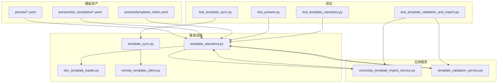
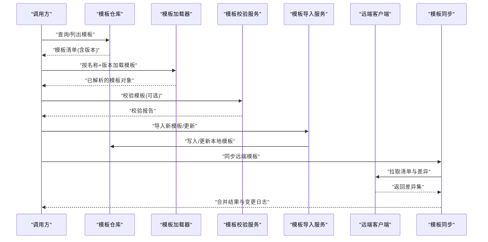
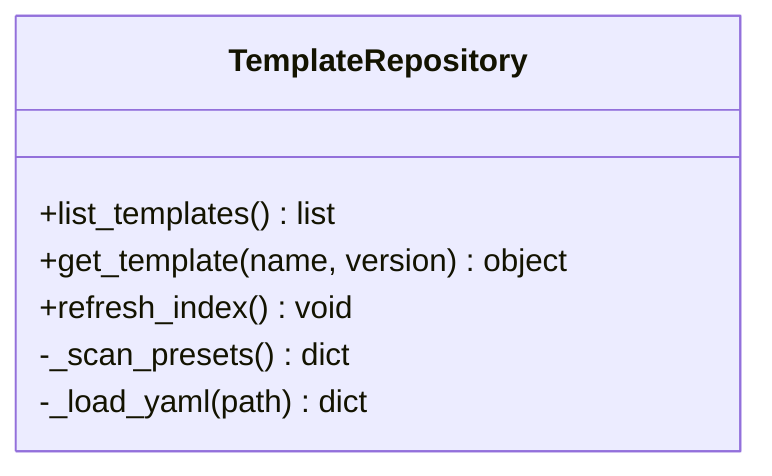
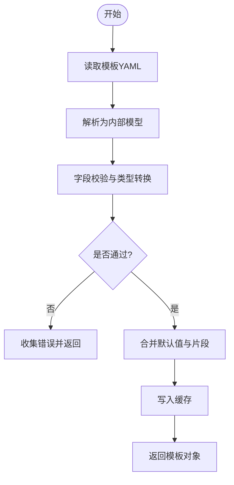
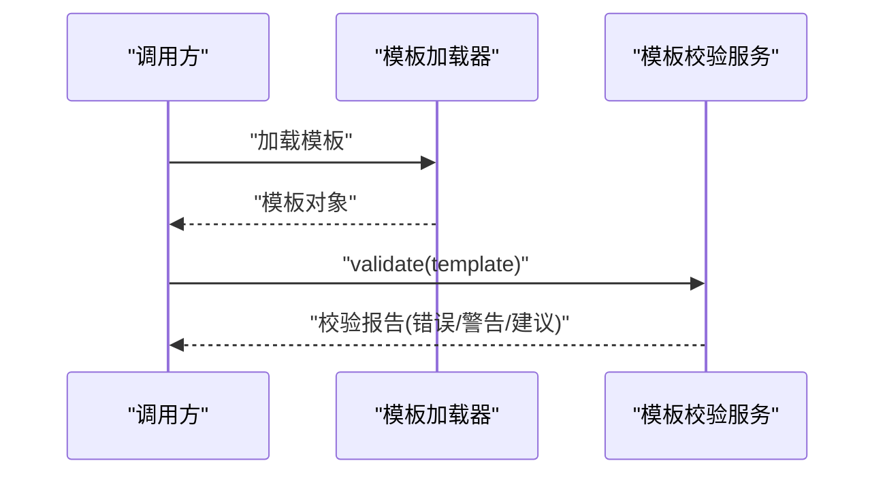
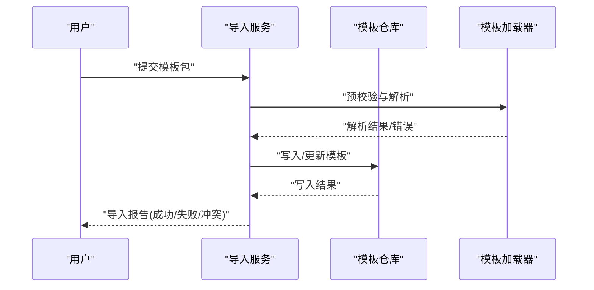
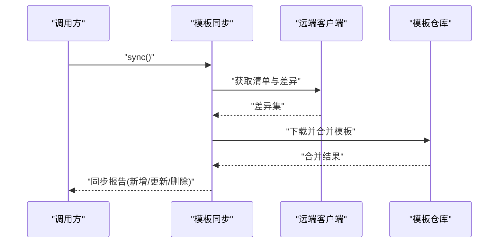
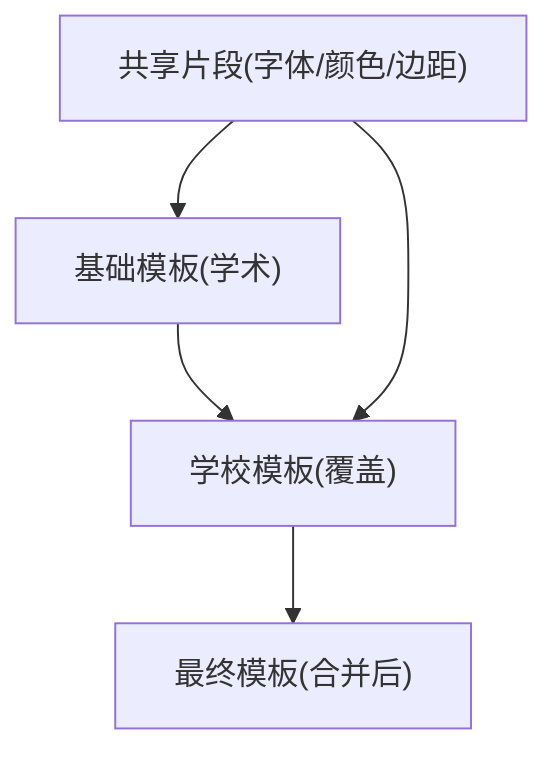
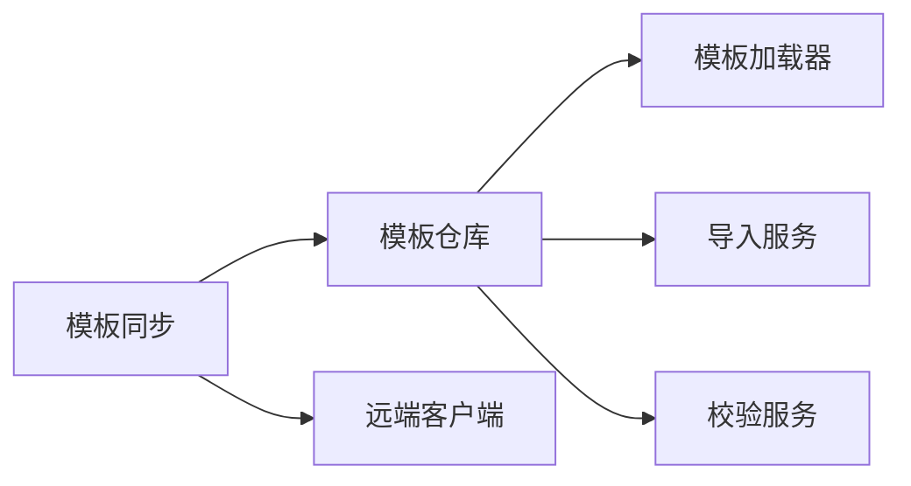

# 模板继承与复用

<cite>
**本文引用的文件**   
- [presets/README.md](file://presets/README.md)
- [presets/templates_index.yaml](file://presets/templates_index.yaml)
- [presets/chinese_thesis.yaml](file://presets/chinese_thesis.yaml)
- [presets/academic_paper.yaml](file://presets/doc_templates/academic_paper.yaml)
- [src/paper_format_corrector/infra/template_repository.py](file://src/paper_format_corrector/infra/template_repository.py)
- [src/paper_format_corrector/infra/doc_template_loader.py](file://src/paper_format_corrector/infra/doc_template_loader.py)
- [src/paper_format_corrector/application/services/university_template_import_service.py](file://src/paper_format_corrector/application/services/university_template_import_service.py)
- [src/paper_format_corrector/application/services/template_validation_service.py](file://src/paper_format_corrector/application/services/template_validation_service.py)
- [src/paper_format_corrector/infra/template_sync.py](file://src/paper_format_corrector/infra/template_sync.py)
- [src/paper_format_corrector/infra/remote_template_client.py](file://src/paper_format_corrector/infra/remote_template_client.py)
- [tests/test_presets.py](file://tests/test_presets.py)
- [tests/test_template_repository.py](file://tests/test_template_repository.py)
- [tests/test_template_validation_and_import.py](file://tests/test_template_validation_and_import.py)
- [tests/test_template_sync.py](file://tests/test_template_sync.py)
</cite>

## 目录
1. [简介](#简介)
2. [项目结构](#项目结构)
3. [核心组件](#核心组件)
4. [架构总览](#架构总览)
5. [详细组件分析](#详细组件分析)
6. [依赖关系分析](#依赖关系分析)
7. [性能考虑](#性能考虑)
8. [故障排查指南](#故障排查指南)
9. [结论](#结论)
10. [附录](#附录)

## 简介
本文件围绕“模板继承机制与模块复用模式”展开，结合仓库中的预设模板、模板加载器、校验服务、导入与同步能力，系统阐述：
- 如何构建可复用的模板组件与共享配置
- 模板层次结构与继承关系的实际案例
- 模板覆盖与合并策略
- 大型项目的模板组织模式与架构设计原则
- 模板版本管理与兼容性考量

## 项目结构
本项目采用“预设模板 + 运行时加载 + 校验/导入/同步”的分层组织方式。模板以 YAML 描述为主，集中存放于 presets 目录；运行时由模板仓库与加载器负责解析、缓存与组合；应用层提供校验、导入与远程同步能力；测试覆盖关键路径以确保稳定性。

图表来源
- [presets/README.md](file://presets/README.md)
- [presets/templates_index.yaml](file://presets/templates_index.yaml)
- [src/paper_format_corrector/infra/template_repository.py](file://src/paper_format_corrector/infra/template_repository.py)
- [src/paper_format_corrector/infra/doc_template_loader.py](file://src/paper_format_corrector/infra/doc_template_loader.py)
- [src/paper_format_corrector/application/services/university_template_import_service.py](file://src/paper_format_corrector/application/services/university_template_import_service.py)
- [src/paper_format_corrector/application/services/template_validation_service.py](file://src/paper_format_corrector/application/services/template_validation_service.py)
- [src/paper_format_corrector/infra/template_sync.py](file://src/paper_format_corrector/infra/template_sync.py)
- [src/paper_format_corrector/infra/remote_template_client.py](file://src/paper_format_corrector/infra/remote_template_client.py)
- [tests/test_presets.py](file://tests/test_presets.py)
- [tests/test_template_repository.py](file://tests/test_template_repository.py)
- [tests/test_template_validation_and_import.py](file://tests/test_template_validation_and_import.py)
- [tests/test_template_sync.py](file://tests/test_template_sync.py)

章节来源
- [presets/README.md](file://presets/README.md)
- [presets/templates_index.yaml](file://presets/templates_index.yaml)
- [src/paper_format_corrector/infra/template_repository.py](file://src/paper_format_corrector/infra/template_repository.py)
- [src/paper_format_corrector/infra/doc_template_loader.py](file://src/paper_format_corrector/infra/doc_template_loader.py)
- [src/paper_format_corrector/application/services/university_template_import_service.py](file://src/paper_format_corrector/application/services/university_template_import_service.py)
- [src/paper_format_corrector/application/services/template_validation_service.py](file://src/paper_format_corrector/application/services/template_validation_service.py)
- [src/paper_format_corrector/infra/template_sync.py](file://src/paper_format_corrector/infra/template_sync.py)
- [src/paper_format_corrector/infra/remote_template_client.py](file://src/paper_format_corrector/infra/remote_template_client.py)
- [tests/test_presets.py](file://tests/test_presets.py)
- [tests/test_template_repository.py](file://tests/test_template_repository.py)
- [tests/test_template_validation_and_import.py](file://tests/test_template_validation_and_import.py)
- [tests/test_template_sync.py](file://tests/test_template_sync.py)

## 核心组件
- 模板仓库（TemplateRepository）
  - 职责：发现、索引、加载、缓存模板；维护模板元数据与版本信息；为上层服务提供统一访问接口。
  - 关键点：支持本地文件系统扫描、按名称/标签检索、按需加载与结果缓存。
- 文档模板加载器（DocTemplateLoader）
  - 职责：将模板 YAML 解析为内部模型；处理字段默认值、必填项校验、类型转换与错误聚合。
  - 关键点：对嵌套结构进行深度合并与覆盖；在加载阶段完成基础合法性检查。
- 大学模板导入服务（UniversityTemplateImportService）
  - 职责：将外部或用户提供的模板导入到本地仓库；执行增量更新与冲突解决；生成变更日志。
  - 关键点：支持批量导入、幂等写入、回滚与审计。
- 模板校验服务（TemplateValidationService）
  - 职责：对模板进行语法与语义校验；输出结构化诊断报告；支持规则扩展。
  - 关键点：区分致命错误与警告；提供修复建议与定位信息。
- 模板同步与远端客户端（TemplateSync / RemoteTemplateClient）
  - 职责：从远端仓库拉取模板清单与差异；本地合并策略；断点续传与重试。
  - 关键点：基于版本号与哈希的幂等同步；冲突检测与人工确认流程。

章节来源
- [src/paper_format_corrector/infra/template_repository.py](file://src/paper_format_corrector/infra/template_repository.py)
- [src/paper_format_corrector/infra/doc_template_loader.py](file://src/paper_format_corrector/infra/doc_template_loader.py)
- [src/paper_format_corrector/application/services/university_template_import_service.py](file://src/paper_format_corrector/application/services/university_template_import_service.py)
- [src/paper_format_corrector/application/services/template_validation_service.py](file://src/paper_format_corrector/application/services/template_validation_service.py)
- [src/paper_format_corrector/infra/template_sync.py](file://src/paper_format_corrector/infra/template_sync.py)
- [src/paper_format_corrector/infra/remote_template_client.py](file://src/paper_format_corrector/infra/remote_template_client.py)

## 架构总览
下图展示了模板从定义到使用的全链路：模板资产经仓库索引后，由加载器解析并注入到业务服务；导入与校验服务贯穿生命周期；同步模块负责多源一致性。

图表来源
- [src/paper_format_corrector/infra/template_repository.py](file://src/paper_format_corrector/infra/template_repository.py)
- [src/paper_format_corrector/infra/doc_template_loader.py](file://src/paper_format_corrector/infra/doc_template_loader.py)
- [src/paper_format_corrector/application/services/template_validation_service.py](file://src/paper_format_corrector/application/services/template_validation_service.py)
- [src/paper_format_corrector/application/services/university_template_import_service.py](file://src/paper_format_corrector/application/services/university_template_import_service.py)
- [src/paper_format_corrector/infra/template_sync.py](file://src/paper_format_corrector/infra/template_sync.py)
- [src/paper_format_corrector/infra/remote_template_client.py](file://src/paper_format_corrector/infra/remote_template_client.py)

## 详细组件分析

### 模板仓库（TemplateRepository）
- 功能要点
  - 扫描与索引：遍历预设目录，读取 templates_index.yaml 与具体模板 YAML，建立名称→版本的映射。
  - 加载与缓存：按名称与版本加载模板，避免重复 IO；提供失效与刷新接口。
  - 查询与过滤：支持按标签、作者、适用场景筛选。
- 数据结构与复杂度
  - 索引表：O(1) 查找；缓存命中 O(1)。
  - 扫描阶段：O(N) N 为模板文件数。
- 优化机会
  - 增量索引：仅扫描变更文件。
  - 并发加载：对独立模板并行解析。
- 错误处理
  - 缺失版本、非法 YAML、字段缺失时抛出明确异常并附带上下文。

图表来源
- [src/paper_format_corrector/infra/template_repository.py](file://src/paper_format_corrector/infra/template_repository.py)
- [presets/templates_index.yaml](file://presets/templates_index.yaml)

章节来源
- [src/paper_format_corrector/infra/template_repository.py](file://src/paper_format_corrector/infra/template_repository.py)
- [presets/templates_index.yaml](file://presets/templates_index.yaml)
- [tests/test_template_repository.py](file://tests/test_template_repository.py)

### 文档模板加载器（DocTemplateLoader）
- 功能要点
  - 解析 YAML 为内部模型；填充默认值；进行类型转换与约束检查。
  - 支持模板片段引用与组合（见“模板覆盖与合并策略”）。
- 数据结构与复杂度
  - 解析树：线性遍历，时间 O(M)，M 为节点数。
  - 合并策略：深度合并，时间 O(K)，K 为合并键数量。
- 错误处理
  - 对必填字段、枚举值、数值范围进行校验，返回结构化错误列表。

图表来源
- [src/paper_format_corrector/infra/doc_template_loader.py](file://src/paper_format_corrector/infra/doc_template_loader.py)

章节来源
- [src/paper_format_corrector/infra/doc_template_loader.py](file://src/paper_format_corrector/infra/doc_template_loader.py)
- [tests/test_presets.py](file://tests/test_presets.py)

### 模板校验服务（TemplateValidationService）
- 功能要点
  - 语法校验：YAML 语法、Schema 约束。
  - 语义校验：字段依赖、跨段引用、资源路径有效性。
  - 输出报告：错误级别、位置、修复建议。
- 可扩展性
  - 规则插件化：新增校验规则无需改动核心流程。

图表来源
- [src/paper_format_corrector/application/services/template_validation_service.py](file://src/paper_format_corrector/application/services/template_validation_service.py)
- [src/paper_format_corrector/infra/doc_template_loader.py](file://src/paper_format_corrector/infra/doc_template_loader.py)

章节来源
- [src/paper_format_corrector/application/services/template_validation_service.py](file://src/paper_format_corrector/application/services/template_validation_service.py)
- [tests/test_template_validation_and_import.py](file://tests/test_template_validation_and_import.py)

### 大学模板导入服务（UniversityTemplateImportService）
- 功能要点
  - 接收外部模板包（YAML 集合），执行命名空间隔离与冲突检测。
  - 支持增量导入、幂等写入、失败回滚与审计日志。
- 合并策略
  - 同名模板：按版本号覆盖；若存在未保存的本地修改，提示冲突。
- 典型流程

图表来源
- [src/paper_format_corrector/application/services/university_template_import_service.py](file://src/paper_format_corrector/application/services/university_template_import_service.py)
- [src/paper_format_corrector/infra/template_repository.py](file://src/paper_format_corrector/infra/template_repository.py)
- [src/paper_format_corrector/infra/doc_template_loader.py](file://src/paper_format_corrector/infra/doc_template_loader.py)

章节来源
- [src/paper_format_corrector/application/services/university_template_import_service.py](file://src/paper_format_corrector/application/services/university_template_import_service.py)
- [tests/test_template_validation_and_import.py](file://tests/test_template_validation_and_import.py)

### 模板同步与远端客户端（TemplateSync / RemoteTemplateClient）
- 功能要点
  - 拉取远端模板清单与差异；本地合并策略；断点续传与重试。
  - 基于版本号和哈希确保幂等与一致性。
- 典型流程

图表来源
- [src/paper_format_corrector/infra/template_sync.py](file://src/paper_format_corrector/infra/template_sync.py)
- [src/paper_format_corrector/infra/remote_template_client.py](file://src/paper_format_corrector/infra/remote_template_client.py)
- [src/paper_format_corrector/infra/template_repository.py](file://src/paper_format_corrector/infra/template_repository.py)

章节来源
- [src/paper_format_corrector/infra/template_sync.py](file://src/paper_format_corrector/infra/template_sync.py)
- [src/paper_format_corrector/infra/remote_template_client.py](file://src/paper_format_corrector/infra/remote_template_client.py)
- [tests/test_template_sync.py](file://tests/test_template_sync.py)

### 模板覆盖与合并策略
- 覆盖优先级
  - 用户本地模板 > 预设模板 > 系统默认值。
- 合并规则
  - 字典型字段：递归深度合并，子键同名则覆盖。
  - 列表型字段：按约定追加或替换（由模板 Schema 指定）。
  - 片段引用：通过 include 引用公共片段，最终在加载期合并。
- 示例说明
  - 学术模板作为基类，学校模板继承并覆盖特定段落样式与页眉页脚。
  - 通用字体、颜色、边距等共享配置抽取为片段，供多个模板复用。

[此图为概念示意，不直接映射具体源码文件]

章节来源
- [presets/chinese_thesis.yaml](file://presets/chinese_thesis.yaml)
- [presets/doc_templates/academic_paper.yaml](file://presets/doc_templates/academic_paper.yaml)
- [src/paper_format_corrector/infra/doc_template_loader.py](file://src/paper_format_corrector/infra/doc_template_loader.py)

## 依赖关系分析
- 组件耦合
  - 模板仓库为所有上层服务的入口，形成星型拓扑，降低横向耦合。
  - 加载器与校验服务相对独立，便于单元测试与替换实现。
- 外部依赖
  - 文件系统与 YAML 解析库；网络请求库用于远端同步。
- 循环依赖
  - 当前分层清晰，未发现循环依赖迹象。

图表来源
- [src/paper_format_corrector/infra/template_repository.py](file://src/paper_format_corrector/infra/template_repository.py)
- [src/paper_format_corrector/infra/doc_template_loader.py](file://src/paper_format_corrector/infra/doc_template_loader.py)
- [src/paper_format_corrector/application/services/university_template_import_service.py](file://src/paper_format_corrector/application/services/university_template_import_service.py)
- [src/paper_format_corrector/application/services/template_validation_service.py](file://src/paper_format_corrector/application/services/template_validation_service.py)
- [src/paper_format_corrector/infra/template_sync.py](file://src/paper_format_corrector/infra/template_sync.py)
- [src/paper_format_corrector/infra/remote_template_client.py](file://src/paper_format_corrector/infra/remote_template_client.py)

章节来源
- [src/paper_format_corrector/infra/template_repository.py](file://src/paper_format_corrector/infra/template_repository.py)
- [src/paper_format_corrector/infra/doc_template_loader.py](file://src/paper_format_corrector/infra/doc_template_loader.py)
- [src/paper_format_corrector/application/services/university_template_import_service.py](file://src/paper_format_corrector/application/services/university_template_import_service.py)
- [src/paper_format_corrector/application/services/template_validation_service.py](file://src/paper_format_corrector/application/services/template_validation_service.py)
- [src/paper_format_corrector/infra/template_sync.py](file://src/paper_format_corrector/infra/template_sync.py)
- [src/paper_format_corrector/infra/remote_template_client.py](file://src/paper_format_corrector/infra/remote_template_client.py)

## 性能考虑
- 索引与缓存
  - 首次启动扫描模板目录，后续使用内存索引与文件级缓存，减少 IO。
- 并发与批处理
  - 模板解析与校验可并发执行；导入与同步支持批处理与断点续传。
- 内存占用
  - 大模板按需加载，避免一次性载入全部模板对象。
- 网络与重试
  - 远端同步具备指数退避与重试策略，提升弱网环境稳定性。

[本节为通用指导，不直接分析具体文件]

## 故障排查指南
- 常见问题
  - 模板无法加载：检查 YAML 语法与必填字段；查看加载器错误详情。
  - 校验失败：根据校验报告定位字段与行号，修正后重新导入。
  - 导入冲突：当本地有未保存修改时，选择保留本地或覆盖远端。
  - 同步失败：检查网络与权限；查看同步日志与重试次数。
- 定位方法
  - 启用调试日志，记录模板路径、版本与合并过程。
  - 使用最小复现模板逐步缩小问题范围。
  - 对比 templates_index.yaml 与实际文件一致性。

章节来源
- [src/paper_format_corrector/infra/doc_template_loader.py](file://src/paper_format_corrector/infra/doc_template_loader.py)
- [src/paper_format_corrector/application/services/template_validation_service.py](file://src/paper_format_corrector/application/services/template_validation_service.py)
- [src/paper_format_corrector/application/services/university_template_import_service.py](file://src/paper_format_corrector/application/services/university_template_import_service.py)
- [src/paper_format_corrector/infra/template_sync.py](file://src/paper_format_corrector/infra/template_sync.py)

## 结论
通过“预设模板 + 模板仓库 + 加载器 + 校验/导入/同步”的分层架构，本项目实现了高内聚、低耦合的模板体系。模板继承与复用模式清晰，覆盖与合并策略可控，配合版本管理与兼容性校验，能够支撑大型项目中多团队、多场景的模板治理需求。

[本节为总结性内容，不直接分析具体文件]

## 附录
- 最佳实践
  - 将通用样式与布局抽象为共享片段，减少重复。
  - 为每个模板声明版本与变更说明，便于追踪与回滚。
  - 在 CI 中集成模板校验与回归测试，保障质量。
- 兼容性建议
  - 保持向后兼容的字段命名与默认值。
  - 引入弃用标记与迁移工具，平滑升级。
  - 对破坏性变更发布主版本，并提供迁移指南。

[本节为通用指导，不直接分析具体文件]