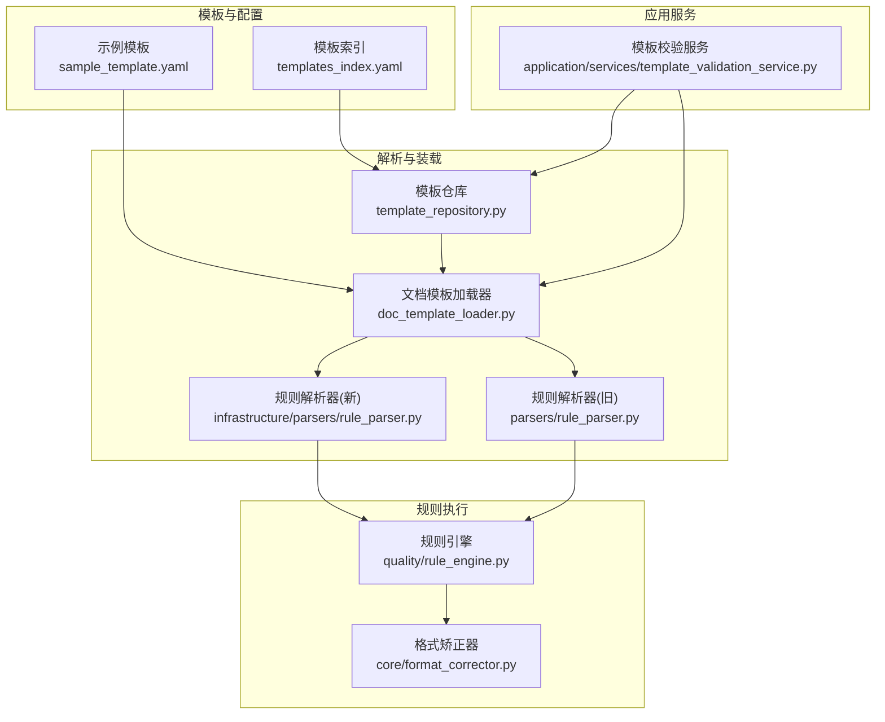
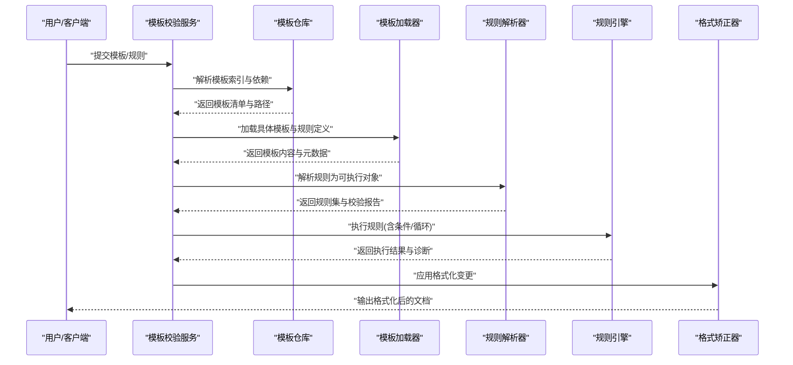
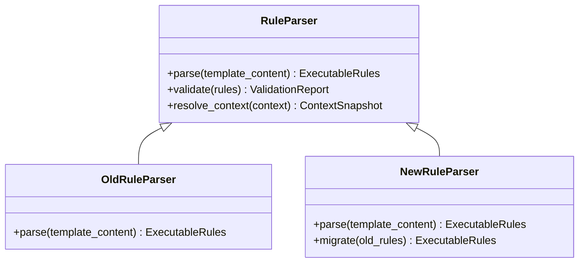
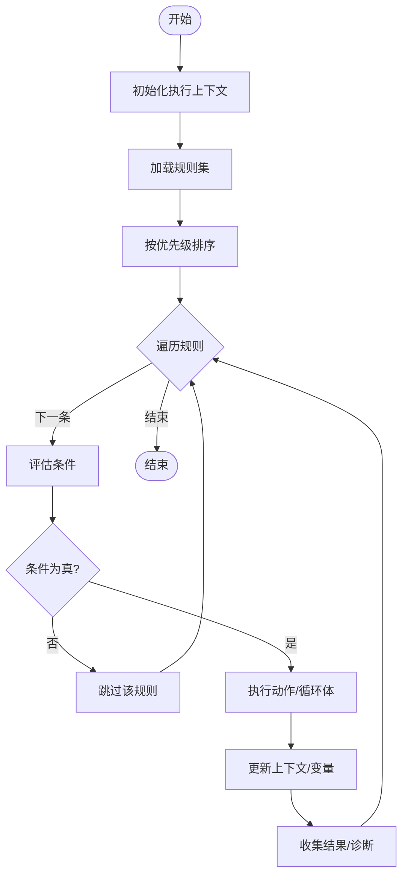
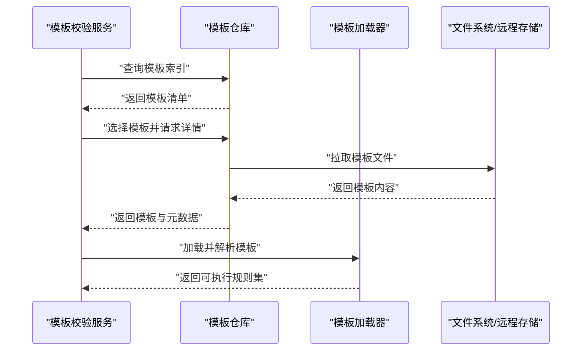

# 规则引擎配置

<cite>
**本文引用的文件**   
- [src/paper_format_corrector/infrastructure/quality/rule_engine.py](file://src/paper_format_corrector/infrastructure/quality/rule_engine.py)
- [src/paper_format_corrector/parsers/rule_parser.py](file://src/paper_format_corrector/parsers/rule_parser.py)
- [src/paper_format_corrector/infrastructure/parsers/rule_parser.py](file://src/paper_format_corrector/infrastructure/parsers/rule_parser.py)
- [src/paper_format_corrector/core/format_corrector.py](file://src/paper_format_corrector/core/format_corrector.py)
- [src/paper_format_corrector/application/services/template_validation_service.py](file://src/paper_format_corrector/application/services/template_validation_service.py)
- [src/paper_format_corrector/infra/template_repository.py](file://src/paper_format_corrector/infra/template_repository.py)
- [src/paper_format_corrector/infra/doc_template_loader.py](file://src/paper_format_corrector/infra/doc_template_loader.py)
- [presets/templates_index.yaml](file://presets/templates_index.yaml)
- [examples/sample_template.yaml](file://examples/sample_template.yaml)
- [tests/test_rule_parser.py](file://tests/test_rule_parser.py)
</cite>

## 目录
1. [简介](#简介)
2. [项目结构](#项目结构)
3. [核心组件](#核心组件)
4. [架构总览](#架构总览)
5. [详细组件分析](#详细组件分析)
6. [依赖关系分析](#依赖关系分析)
7. [性能考虑](#性能考虑)
8. [故障排查指南](#故障排查指南)
9. [结论](#结论)
10. [附录](#附录)

## 简介
本文件聚焦于模板中的“规则引擎”配置机制，系统性解析格式化规则的编写语法、条件判断与循环处理、规则优先级与执行顺序，并通过复杂模板示例展示高级规则的实现方式。同时提供自定义规则创建方法与调试技巧，以及性能优化建议与最佳实践，帮助读者高效构建与维护高质量文档格式规则。

## 项目结构
围绕规则引擎的关键代码分布在以下模块：
- 规则解析器：负责将 YAML/JSON 等模板中的规则描述解析为内部可执行对象
- 规则引擎：负责加载、排序、调度并执行规则，支持条件分支与循环
- 模板仓库与加载器：负责从本地或远程位置加载模板索引与具体模板
- 应用服务层：封装模板校验、导入与使用流程
- 核心矫正器：在文档处理管线中调用规则引擎进行格式化修正

图表来源
- [presets/templates_index.yaml](file://presets/templates_index.yaml)
- [examples/sample_template.yaml](file://examples/sample_template.yaml)
- [src/paper_format_corrector/infra/template_repository.py](file://src/paper_format_corrector/infra/template_repository.py)
- [src/paper_format_corrector/infra/doc_template_loader.py](file://src/paper_format_corrector/infra/doc_template_loader.py)
- [src/paper_format_corrector/parsers/rule_parser.py](file://src/paper_format_corrector/parsers/rule_parser.py)
- [src/paper_format_corrector/infrastructure/parsers/rule_parser.py](file://src/paper_format_corrector/infrastructure/parsers/rule_parser.py)
- [src/paper_format_corrector/infrastructure/quality/rule_engine.py](file://src/paper_format_corrector/infrastructure/quality/rule_engine.py)
- [src/paper_format_corrector/core/format_corrector.py](file://src/paper_format_corrector/core/format_corrector.py)
- [src/paper_format_corrector/application/services/template_validation_service.py](file://src/paper_format_corrector/application/services/template_validation_service.py)

章节来源
- [src/paper_format_corrector/infra/template_repository.py](file://src/paper_format_corrector/infra/template_repository.py)
- [src/paper_format_corrector/infra/doc_template_loader.py](file://src/paper_format_corrector/infra/doc_template_loader.py)
- [src/paper_format_corrector/parsers/rule_parser.py](file://src/paper_format_corrector/parsers/rule_parser.py)
- [src/paper_format_corrector/infrastructure/parsers/rule_parser.py](file://src/paper_format_corrector/infrastructure/parsers/rule_parser.py)
- [src/paper_format_corrector/infrastructure/quality/rule_engine.py](file://src/paper_format_corrector/infrastructure/quality/rule_engine.py)
- [src/paper_format_corrector/core/format_corrector.py](file://src/paper_format_corrector/core/format_corrector.py)
- [src/paper_format_corrector/application/services/template_validation_service.py](file://src/paper_format_corrector/application/services/template_validation_service.py)
- [presets/templates_index.yaml](file://presets/templates_index.yaml)
- [examples/sample_template.yaml](file://examples/sample_template.yaml)

## 核心组件
- 规则解析器
  - 职责：将模板中的规则声明（如条件、循环、动作）解析为结构化中间表示；兼容新旧两套解析实现
  - 关键点：字段映射、类型校验、错误定位、上下文注入
- 规则引擎
  - 职责：加载规则集合、按优先级排序、执行条件判断与循环、调用动作处理器、收集结果与诊断信息
  - 关键点：执行上下文、作用域隔离、短路求值、异常恢复
- 模板仓库与加载器
  - 职责：发现模板索引、下载/缓存模板、解析元数据与规则清单
  - 关键点：路径安全、版本选择、增量更新
- 应用服务
  - 职责：对外暴露模板校验、导入、预览能力，串联解析与执行
- 核心矫正器
  - 职责：在文档处理流水线中集成规则引擎，驱动段落、表格、图片等元素的格式化

章节来源
- [src/paper_format_corrector/infrastructure/parsers/rule_parser.py](file://src/paper_format_corrector/infrastructure/parsers/rule_parser.py)
- [src/paper_format_corrector/parsers/rule_parser.py](file://src/paper_format_corrector/parsers/rule_parser.py)
- [src/paper_format_corrector/infrastructure/quality/rule_engine.py](file://src/paper_format_corrector/infrastructure/quality/rule_engine.py)
- [src/paper_format_corrector/infra/template_repository.py](file://src/paper_format_corrector/infra/template_repository.py)
- [src/paper_format_corrector/infra/doc_template_loader.py](file://src/paper_format_corrector/infra/doc_template_loader.py)
- [src/paper_format_corrector/application/services/template_validation_service.py](file://src/paper_format_corrector/application/services/template_validation_service.py)
- [src/paper_format_corrector/core/format_corrector.py](file://src/paper_format_corrector/core/format_corrector.py)

## 架构总览
下图展示了从模板到执行的端到端流程：模板索引与模板文件经仓库与加载器获取，由规则解析器生成可执行规则集，再由规则引擎按优先级与条件执行，最终由核心矫正器应用到文档对象模型。

图表来源
- [src/paper_format_corrector/application/services/template_validation_service.py](file://src/paper_format_corrector/application/services/template_validation_service.py)
- [src/paper_format_corrector/infra/template_repository.py](file://src/paper_format_corrector/infra/template_repository.py)
- [src/paper_format_corrector/infra/doc_template_loader.py](file://src/paper_format_corrector/infra/doc_template_loader.py)
- [src/paper_format_corrector/infrastructure/parsers/rule_parser.py](file://src/paper_format_corrector/infrastructure/parsers/rule_parser.py)
- [src/paper_format_corrector/infrastructure/quality/rule_engine.py](file://src/paper_format_corrector/infrastructure/quality/rule_engine.py)
- [src/paper_format_corrector/core/format_corrector.py](file://src/paper_format_corrector/core/format_corrector.py)

## 详细组件分析

### 规则解析器（新旧双实现）
- 设计要点
  - 统一抽象：对外暴露一致的解析接口，屏蔽新旧实现差异
  - 字段契约：明确规则节点类型（条件、循环、动作、变量、上下文访问）
  - 错误定位：返回行号/路径级错误，便于快速修复
- 关键流程
  - 读取模板内容 -> 构建 AST/IR -> 类型检查 -> 生成可执行规则列表
- 兼容性策略
  - 通过版本标记或特性开关选择解析器
  - 对废弃字段给出迁移提示

图表来源
- [src/paper_format_corrector/parsers/rule_parser.py](file://src/paper_format_corrector/parsers/rule_parser.py)
- [src/paper_format_corrector/infrastructure/parsers/rule_parser.py](file://src/paper_format_corrector/infrastructure/parsers/rule_parser.py)

章节来源
- [src/paper_format_corrector/parsers/rule_parser.py](file://src/paper_format_corrector/parsers/rule_parser.py)
- [src/paper_format_corrector/infrastructure/parsers/rule_parser.py](file://src/paper_format_corrector/infrastructure/parsers/rule_parser.py)
- [tests/test_rule_parser.py](file://tests/test_rule_parser.py)

### 规则引擎（执行与调度）
- 设计要点
  - 优先级排序：基于规则声明的优先级字段进行稳定排序
  - 条件求值：支持布尔表达式、上下文查询、短路逻辑
  - 循环控制：支持集合遍历、分页、过滤与聚合
  - 作用域隔离：局部变量与作用域栈，避免污染全局上下文
  - 容错与恢复：单条规则失败不影响整体执行，记录诊断信息
- 执行流程
  - 初始化上下文 -> 加载规则集 -> 排序 -> 逐条执行 -> 汇总结果

图表来源
- [src/paper_format_corrector/infrastructure/quality/rule_engine.py](file://src/paper_format_corrector/infrastructure/quality/rule_engine.py)

章节来源
- [src/paper_format_corrector/infrastructure/quality/rule_engine.py](file://src/paper_format_corrector/infrastructure/quality/rule_engine.py)

### 模板仓库与加载器
- 模板索引
  - 维护模板名称、版本、来源、依赖与规则清单
- 加载流程
  - 解析索引 -> 选择目标模板 -> 拉取/缓存 -> 解析元数据与规则
- 安全与一致性
  - 路径白名单、签名校验、增量同步

图表来源
- [src/paper_format_corrector/infra/template_repository.py](file://src/paper_format_corrector/infra/template_repository.py)
- [src/paper_format_corrector/infra/doc_template_loader.py](file://src/paper_format_corrector/infra/doc_template_loader.py)
- [presets/templates_index.yaml](file://presets/templates_index.yaml)

章节来源
- [src/paper_format_corrector/infra/template_repository.py](file://src/paper_format_corrector/infra/template_repository.py)
- [src/paper_format_corrector/infra/doc_template_loader.py](file://src/paper_format_corrector/infra/doc_template_loader.py)
- [presets/templates_index.yaml](file://presets/templates_index.yaml)

### 应用服务与核心矫正器
- 模板校验服务
  - 对外提供模板可用性检查、规则预检、冲突检测
- 格式矫正器
  - 在文档处理阶段调用规则引擎，完成段落、表格、图片、页眉页脚等元素的格式化

章节来源
- [src/paper_format_corrector/application/services/template_validation_service.py](file://src/paper_format_corrector/application/services/template_validation_service.py)
- [src/paper_format_corrector/core/format_corrector.py](file://src/paper_format_corrector/core/format_corrector.py)

## 依赖关系分析
- 组件耦合
  - 规则解析器与规则引擎强耦合（解析产物直接作为执行输入）
  - 模板仓库与加载器松耦合（通过标准接口交换模板与元数据）
  - 应用服务编排各组件，降低上层调用复杂度
- 外部依赖
  - 文件系统/网络用于模板拉取与缓存
  - 日志与诊断用于问题追踪

图表来源
- [src/paper_format_corrector/infrastructure/parsers/rule_parser.py](file://src/paper_format_corrector/infrastructure/parsers/rule_parser.py)
- [src/paper_format_corrector/parsers/rule_parser.py](file://src/paper_format_corrector/parsers/rule_parser.py)
- [src/paper_format_corrector/infrastructure/quality/rule_engine.py](file://src/paper_format_corrector/infrastructure/quality/rule_engine.py)
- [src/paper_format_corrector/infra/template_repository.py](file://src/paper_format_corrector/infra/template_repository.py)
- [src/paper_format_corrector/infra/doc_template_loader.py](file://src/paper_format_corrector/infra/doc_template_loader.py)
- [src/paper_format_corrector/core/format_corrector.py](file://src/paper_format_corrector/core/format_corrector.py)
- [src/paper_format_corrector/application/services/template_validation_service.py](file://src/paper_format_corrector/application/services/template_validation_service.py)

章节来源
- [src/paper_format_corrector/infrastructure/parsers/rule_parser.py](file://src/paper_format_corrector/infrastructure/parsers/rule_parser.py)
- [src/paper_format_corrector/parsers/rule_parser.py](file://src/paper_format_corrector/parsers/rule_parser.py)
- [src/paper_format_corrector/infrastructure/quality/rule_engine.py](file://src/paper_format_corrector/infrastructure/quality/rule_engine.py)
- [src/paper_format_corrector/infra/template_repository.py](file://src/paper_format_corrector/infra/template_repository.py)
- [src/paper_format_corrector/infra/doc_template_loader.py](file://src/paper_format_corrector/infra/doc_template_loader.py)
- [src/paper_format_corrector/core/format_corrector.py](file://src/paper_format_corrector/core/format_corrector.py)
- [src/paper_format_corrector/application/services/template_validation_service.py](file://src/paper_format_corrector/application/services/template_validation_service.py)

## 性能考虑
- 规则集裁剪
  - 仅加载当前模板所需的规则子集，减少内存占用与解析开销
- 条件短路
  - 在条件评估阶段尽早短路，避免不必要的动作执行
- 循环优化
  - 对大集合采用分页/游标迭代，避免一次性加载全部元素
- 上下文复用
  - 复用已解析的上下文快照，减少重复查询
- 并行与批处理
  - 对独立规则块进行批处理或并行执行（需保证无副作用或线程安全）
- 缓存策略
  - 对模板与规则解析结果进行缓存，结合版本号与哈希键避免脏读

[本节为通用指导，不直接分析具体文件]

## 故障排查指南
- 常见问题
  - 规则未生效：检查优先级与条件表达式；确认作用域变量是否正确注入
  - 循环不终止：检查循环边界与退出条件；打印中间状态
  - 性能退化：定位热点规则与循环体；引入分页与缓存
- 调试技巧
  - 启用详细日志：记录每条规则的条件评估与执行耗时
  - 最小复现：抽取最小规则集验证行为
  - 断点与快照：在执行前后保存上下文快照，对比差异
- 测试支撑
  - 使用单元测试覆盖典型场景与边界条件
  - 使用回归用例确保规则变更不会破坏既有行为

章节来源
- [tests/test_rule_parser.py](file://tests/test_rule_parser.py)

## 结论
规则引擎通过“解析—排序—执行”的分层设计，实现了高内聚、低耦合的规则管理。借助清晰的优先级与条件/循环语义，配合完善的调试与测试手段，可在复杂模板场景下稳定地驱动文档格式化。遵循本文的性能优化与最佳实践，可进一步提升规则的可维护性与运行效率。

## 附录

### 格式化规则编写语法（概览）
- 基本结构
  - 规则条目包含：标识、优先级、条件、动作、作用域与变量
- 条件判断
  - 支持布尔表达式、上下文属性访问、比较与逻辑组合
- 循环处理
  - 支持集合遍历、过滤、分页与聚合统计
- 动作类型
  - 文本替换、样式设置、段落/表格/图片操作、引用与交叉引用更新

[本节为概念性说明，不直接分析具体文件]

### 规则优先级与执行顺序
- 优先级
  - 数值越小优先级越高；相同优先级保持声明顺序（稳定排序）
- 执行顺序
  - 自上而下依次执行；条件为假则跳过；动作执行失败记录诊断但不中断整体流程

[本节为概念性说明，不直接分析具体文件]

### 复杂模板示例（思路）
- 多段标题层级格式化
  - 根据标题级别与上下文自动设置样式与编号
- 参考文献批量规范化
  - 遍历参考文献列表，依据期刊/会议规则进行格式统一
- 图表编号与交叉引用
  - 扫描文档中的图表，生成编号并在正文中插入交叉引用

[本节为概念性说明，不直接分析具体文件]

### 自定义规则创建方法
- 步骤
  - 定义规则节点：声明条件、动作与作用域
  - 注册动作处理器：实现具体格式化逻辑
  - 编写测试：覆盖正常与异常路径
  - 集成到模板：在模板中引用自定义规则
- 注意事项
  - 幂等性：多次执行不应产生副作用
  - 可观测性：输出必要日志与诊断信息

[本节为概念性说明，不直接分析具体文件]

### 调试技巧清单
- 开启详细日志与诊断输出
- 使用最小复现模板定位问题
- 对比执行前后上下文快照
- 逐步注释规则以二分定位瓶颈
- 利用单元测试与回归用例保障稳定性

[本节为概念性说明，不直接分析具体文件]