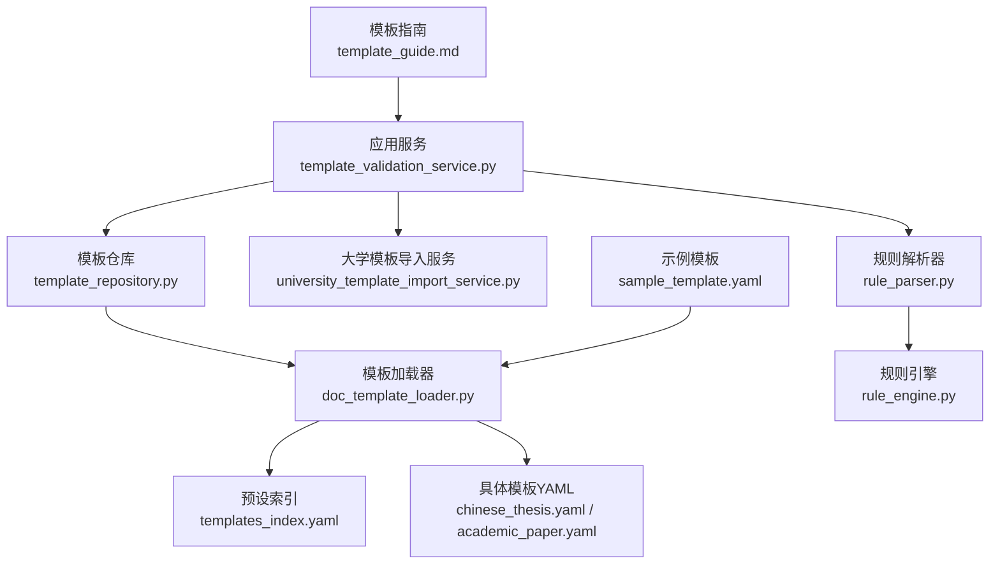
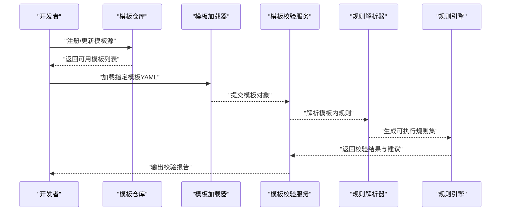
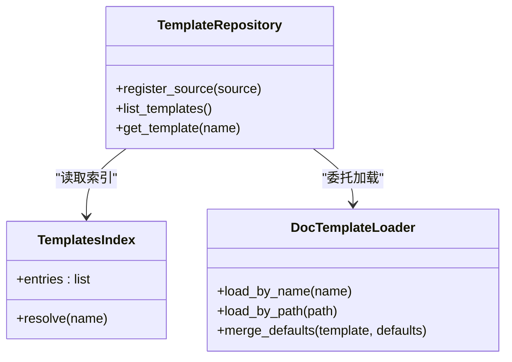
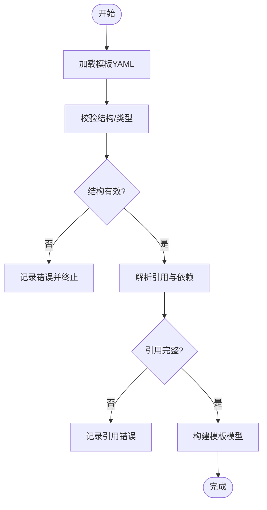
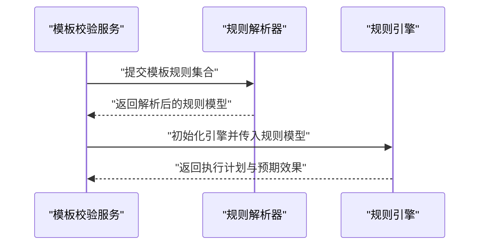
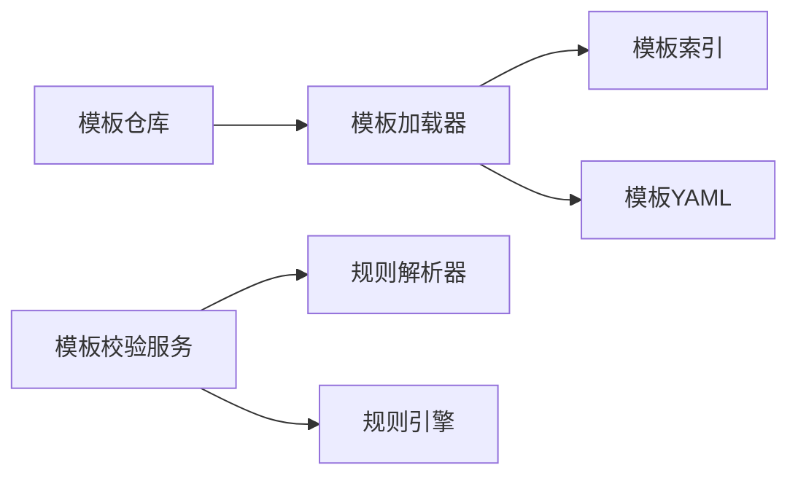

# 自定义模板开发

<cite>
**本文引用的文件**   
- [README.md](file://README.md)
- [pyproject.toml](file://pyproject.toml)
- [run.py](file://run.py)
- [src/paper_format_corrector/app.py](file://src/paper_format_corrector/app.py)
- [src/paper_format_corrector/cli.py](file://src/paper_format_corrector/cli.py)
- [src/paper_format_corrector/infra/template_repository.py](file://src/paper_format_corrector/infra/template_repository.py)
- [src/paper_format_corrector/infra/doc_template_loader.py](file://src/paper_format_corrector/infra/doc_template_loader.py)
- [src/paper_format_corrector/application/services/template_validation_service.py](file://src/paper_format_corrector/application/services/template_validation_service.py)
- [src/paper_format_corrector/application/services/university_template_import_service.py](file://src/paper_format_corrector/application/services/university_template_import_service.py)
- [src/paper_format_corrector/infrastructure/parsers/rule_parser.py](file://src/paper_format_corrector/infrastructure/parsers/rule_parser.py)
- [src/paper_format_corrector/quality/rule_engine.py](file://src/paper_format_corrector/quality/rule引擎.py)
- [presets/templates_index.yaml](file://presets/templates_index.yaml)
- [presets/chinese_thesis.yaml](file://presets/chinese_thesis.yaml)
- [presets/academic_paper.yaml](file://presets/academic_paper.yaml)
- [examples/sample_template.yaml](file://examples/sample_template.yaml)
- [docs/template_guide.md](file://docs/template_guide.md)
- [tests/test_presets.py](file://tests/test_presets.py)
- [tests/test_template_repository.py](file://tests/test_template_repository.py)
- [tests/test_rule_parser.py](file://tests/test_rule_parser.py)
</cite>

## 目录
1. [简介](#简介)
2. [项目结构](#项目结构)
3. [核心组件](#核心组件)
4. [架构总览](#架构总览)
5. [详细组件分析](#详细组件分析)
6. [依赖关系分析](#依赖关系分析)
7. [性能考虑](#性能考虑)
8. [故障排查指南](#故障排查指南)
9. [结论](#结论)
10. [附录](#附录)

## 简介
本教程面向希望基于现有模板创建新模板、修改字段与规则，并实现发布与分发的开发者。内容从基础模板修改入手，逐步深入到高级规则编写；涵盖模板结构解析、字段定制、规则引擎集成、调试与测试方法，以及模板发布流程与最佳实践。通过实际案例与常见问题解答，帮助读者快速上手并高质量交付可复用的模板。

## 项目结构
本项目采用分层与模块化组织方式：
- 应用层：提供模板校验、导入等能力
- 基础设施层：负责模板加载、仓库管理、规则解析与执行
- 预设模板：以 YAML 形式定义不同场景的模板规范
- 示例与文档：提供样例模板与用户/开发者指南
- 测试：覆盖模板加载、规则解析、预设验证等关键路径

图表来源
- [src/paper_format_corrector/application/services/template_validation_service.py](file://src/paper_format_corrector/application/services/template_validation_service.py)
- [src/paper_format_corrector/infra/template_repository.py](file://src/paper_format_corrector/infra/template_repository.py)
- [src/paper_format_corrector/infra/doc_template_loader.py](file://src/paper_format_corrector/infra/doc_template_loader.py)
- [presets/templates_index.yaml](file://presets/templates_index.yaml)
- [presets/chinese_thesis.yaml](file://presets/chinese_thesis.yaml)
- [presets/academic_paper.yaml](file://presets/academic_paper.yaml)
- [src/paper_format_corrector/infrastructure/parsers/rule_parser.py](file://src/paper_format_corrector/infrastructure/parsers/rule_parser.py)
- [src/paper_format_corrector/quality/rule_engine.py](file://src/paper_format_corrector/quality/rule_engine.py)
- [examples/sample_template.yaml](file://examples/sample_template.yaml)
- [docs/template_guide.md](file://docs/template_guide.md)

章节来源
- [README.md](file://README.md)
- [pyproject.toml](file://pyproject.toml)
- [run.py](file://run.py)

## 核心组件
- 模板仓库（TemplateRepository）：负责模板的发现、注册与获取，支持本地与远程源。
- 模板加载器（DocTemplateLoader）：解析 YAML 模板与索引，构建运行时可用的模板对象。
- 模板校验服务（TemplateValidationService）：对模板进行结构与语义校验，确保可用性与一致性。
- 大学模板导入服务（UniversityTemplateImportService）：将外部或机构模板转换为内部标准格式。
- 规则解析器（RuleParser）：解析模板中的规则描述为内部模型。
- 规则引擎（RuleEngine）：执行规则，产出诊断与修复建议。

章节来源
- [src/paper_format_corrector/infra/template_repository.py](file://src/paper_format_corrector/infra/template_repository.py)
- [src/paper_format_corrector/infra/doc_template_loader.py](file://src/paper_format_corrector/infra/doc_template_loader.py)
- [src/paper_format_corrector/application/services/template_validation_service.py](file://src/paper_format_corrector/application/services/template_validation_service.py)
- [src/paper_format_corrector/application/services/university_template_import_service.py](file://src/paper_format_corrector/application/services/university_template_import_service.py)
- [src/paper_format_corrector/infrastructure/parsers/rule_parser.py](file://src/paper_format_corrector/infrastructure/parsers/rule_parser.py)
- [src/paper_format_corrector/quality/rule_engine.py](file://src/paper_format_corrector/quality/rule_engine.py)

## 架构总览
下图展示了模板开发与运行时的关键交互：开发者维护 YAML 模板与规则，系统通过加载器与仓库装配模板，再由校验服务与规则引擎保障质量与一致性。

图表来源
- [src/paper_format_corrector/infra/template_repository.py](file://src/paper_format_corrector/infra/template_repository.py)
- [src/paper_format_corrector/infra/doc_template_loader.py](file://src/paper_format_corrector/infra/doc_template_loader.py)
- [src/paper_format_corrector/application/services/template_validation_service.py](file://src/paper_format_corrector/application/services/template_validation_service.py)
- [src/paper_format_corrector/infrastructure/parsers/rule_parser.py](file://src/paper_format_corrector/infrastructure/parsers/rule_parser.py)
- [src/paper_format_corrector/quality/rule_engine.py](file://src/paper_format_corrector/quality/rule_engine.py)

## 详细组件分析

### 模板仓库与加载器
- 职责
  - 模板仓库：集中管理模板来源（本地 presets、远程仓库），提供按名称或标签检索的能力。
  - 模板加载器：读取 YAML 模板与索引，合并默认值，构造标准化模板对象供上层使用。
- 关键点
  - 索引驱动：通过 templates_index.yaml 统一声明可用模板元信息。
  - 版本兼容：加载器需处理字段演进与弃用提示。
  - 错误隔离：加载失败应返回明确错误上下文，便于定位问题。

图表来源
- [src/paper_format_corrector/infra/template_repository.py](file://src/paper_format_corrector/infra/template_repository.py)
- [src/paper_format_corrector/infra/doc_template_loader.py](file://src/paper_format_corrector/infra/doc_template_loader.py)
- [presets/templates_index.yaml](file://presets/templates_index.yaml)

章节来源
- [src/paper_format_corrector/infra/template_repository.py](file://src/paper_format_corrector/infra/template_repository.py)
- [src/paper_format_corrector/infra/doc_template_loader.py](file://src/paper_format_corrector/infra/doc_template_loader.py)
- [presets/templates_index.yaml](file://presets/templates_index.yaml)

### 模板校验服务与导入服务
- 模板校验服务
  - 校验模板必填字段、类型约束、引用完整性与规则语法。
  - 输出结构化校验报告，包含错误、警告与建议。
- 大学模板导入服务
  - 将第三方或机构模板映射到内部标准结构，自动补齐缺失字段。
  - 提供迁移脚本与回滚策略。

图表来源
- [src/paper_format_corrector/application/services/template_validation_service.py](file://src/paper_format_corrector/application/services/template_validation_service.py)
- [src/paper_format_corrector/application/services/university_template_import_service.py](file://src/paper_format_corrector/application/services/university_template_import_service.py)

章节来源
- [src/paper_format_corrector/application/services/template_validation_service.py](file://src/paper_format_corrector/application/services/template_validation_service.py)
- [src/paper_format_corrector/application/services/university_template_import_service.py](file://src/paper_format_corrector/application/services/university_template_import_service.py)

### 规则解析器与规则引擎
- 规则解析器
  - 将模板中声明的规则（如段落样式、标题层级、表格编号等）解析为内部模型。
  - 支持条件表达式、作用域限定与优先级。
- 规则引擎
  - 遍历文档元素，匹配规则，生成诊断与修复动作。
  - 提供批量执行、增量执行与回滚机制。

图表来源
- [src/paper_format_corrector/infrastructure/parsers/rule_parser.py](file://src/paper_format_corrector/infrastructure/parsers/rule_parser.py)
- [src/paper_format_corrector/quality/rule_engine.py](file://src/paper_format_corrector/quality/rule_engine.py)

章节来源
- [src/paper_format_corrector/infrastructure/parsers/rule_parser.py](file://src/paper_format_corrector/infrastructure/parsers/rule_parser.py)
- [src/paper_format_corrector/quality/rule_engine.py](file://src/paper_format_corrector/quality/rule_engine.py)

### 模板结构与字段说明
- 模板索引（templates_index.yaml）
  - 用于声明所有可用模板的名称、版本、适用领域与入口文件。
- 具体模板（如 chinese_thesis.yaml、academic_paper.yaml）
  - 定义文档结构、样式、字段与规则。
- 示例模板（sample_template.yaml）
  - 提供最小可运行的模板骨架，便于快速起步。

章节来源
- [presets/templates_index.yaml](file://presets/templates_index.yaml)
- [presets/chinese_thesis.yaml](file://presets/chinese_thesis.yaml)
- [presets/academic_paper.yaml](file://presets/academic_paper.yaml)
- [examples/sample_template.yaml](file://examples/sample_template.yaml)

### 模板开发最佳实践与设计模式
- 设计原则
  - 单一职责：每个模板聚焦特定场景（论文、商业计划书等）。
  - 可扩展性：通过规则组合与继承减少重复配置。
  - 可测试性：为每条重要规则准备用例与断言。
- 推荐模式
  - 组合优于继承：通过规则组合表达复杂样式需求。
  - 显式依赖：在索引中声明模板依赖，避免隐式耦合。
  - 渐进增强：先满足最小可用集，再逐步添加高级特性。

[本节为通用指导，不直接分析具体文件]

### 模板调试工具与测试方法
- 调试
  - 使用 CLI 或 API 加载模板并输出解析树与规则清单，辅助定位问题。
  - 启用日志与详细报告，查看规则命中与冲突。
- 测试
  - 单元测试：覆盖规则解析、模板加载与校验逻辑。
  - 集成测试：端到端验证模板在真实文档上的表现。
  - 回归测试：保存基准输出，变更时对比差异。

章节来源
- [tests/test_presets.py](file://tests/test_presets.py)
- [tests/test_template_repository.py](file://tests/test_template_repository.py)
- [tests/test_rule_parser.py](file://tests/test_rule_parser.py)

### 模板发布与分发流程
- 本地发布
  - 将模板加入 presets 目录，并在 templates_index.yaml 中登记。
  - 运行校验服务确认模板可用性。
- 远程分发
  - 通过模板仓库接口上传，设置版本与适用范围。
  - 客户端拉取索引并缓存模板，支持离线使用。
- 版本管理
  - 遵循语义化版本，记录变更日志与兼容性说明。

章节来源
- [presets/templates_index.yaml](file://presets/templates_index.yaml)
- [src/paper_format_corrector/infra/template_repository.py](file://src/paper_format_corrector/infra/template_repository.py)

### 实战案例：从零到一创建“会议议程”模板
- 步骤概览
  - 复制示例模板，重命名为 meeting_agenda.yaml。
  - 在索引中新增条目，指向新模板。
  - 定义必要字段（会议主题、时间、地点、参会人、议题列表）。
  - 编写规则（标题层级、列表样式、页眉页脚）。
  - 运行校验与测试，修正问题后发布。
- 验收要点
  - 模板加载成功且无警告。
  - 规则在样例文档上正确生效。
  - 与其他模板无命名或资源冲突。

章节来源
- [examples/sample_template.yaml](file://examples/sample_template.yaml)
- [presets/templates_index.yaml](file://presets/templates_index.yaml)
- [docs/template_guide.md](file://docs/template_guide.md)

### 常见问题与解决方案
- 模板无法加载
  - 检查 YAML 语法与缩进，确认索引条目存在且路径正确。
- 规则未生效
  - 核对规则作用域与优先级，查看规则解析日志。
- 字段缺失报错
  - 对照模板结构定义补齐必填字段，或使用导入服务自动补齐。
- 冲突与覆盖
  - 调整规则顺序与范围，避免同名样式覆盖。

章节来源
- [src/paper_format_corrector/application/services/template_validation_service.py](file://src/paper_format_corrector/application/services/template_validation_service.py)
- [src/paper_format_corrector/infrastructure/parsers/rule_parser.py](file://src/paper_format_corrector/infrastructure/parsers/rule_parser.py)

## 依赖关系分析
- 模块耦合
  - 模板仓库与加载器低耦合，通过接口契约协作。
  - 校验服务依赖解析器与引擎，形成稳定的处理流水线。
- 外部依赖
  - YAML 解析库、日志框架、网络请求（远程模板）。
- 潜在风险
  - 循环依赖：应避免在加载器与仓库之间互相调用。
  - 版本漂移：模板字段演进需保持向后兼容。

图表来源
- [src/paper_format_corrector/infra/template_repository.py](file://src/paper_format_corrector/infra/template_repository.py)
- [src/paper_format_corrector/infra/doc_template_loader.py](file://src/paper_format_corrector/infra/doc_template_loader.py)
- [presets/templates_index.yaml](file://presets/templates_index.yaml)
- [src/paper_format_corrector/application/services/template_validation_service.py](file://src/paper_format_corrector/application/services/template_validation_service.py)
- [src/paper_format_corrector/infrastructure/parsers/rule_parser.py](file://src/paper_format_corrector/infrastructure/parsers/rule_parser.py)
- [src/paper_format_corrector/quality/rule_engine.py](file://src/paper_format_corrector/quality/rule_engine.py)

章节来源
- [src/paper_format_corrector/infra/template_repository.py](file://src/paper_format_corrector/infra/template_repository.py)
- [src/paper_format_corrector/infra/doc_template_loader.py](file://src/paper_format_corrector/infra/doc_template_loader.py)
- [presets/templates_index.yaml](file://presets/templates_index.yaml)
- [src/paper_format_corrector/application/services/template_validation_service.py](file://src/paper_format_corrector/application/services/template_validation_service.py)
- [src/paper_format_corrector/infrastructure/parsers/rule_parser.py](file://src/paper_format_corrector/infrastructure/parsers/rule_parser.py)
- [src/paper_format_corrector/quality/rule_engine.py](file://src/paper_format_corrector/quality/rule_engine.py)

## 性能考虑
- 模板加载
  - 预编译与缓存模板对象，避免重复解析。
  - 按需加载规则，减少内存占用。
- 规则执行
  - 增量执行：仅对变更区域重新评估。
  - 并行执行：对独立规则进行并发处理，注意线程安全。
- 资源管理
  - 限制单次处理的文档大小，避免 OOM。
  - 合理设置超时与重试策略。

[本节为通用指导，不直接分析具体文件]

## 故障排查指南
- 定位加载失败
  - 检查模板路径与权限，确认索引条目正确。
- 定位规则问题
  - 开启详细日志，查看规则命中与冲突详情。
- 定位校验错误
  - 根据校验报告逐项修复，必要时使用导入服务补齐字段。
- 回归验证
  - 使用测试套件与基准输出对比，确保修复不引入新问题。

章节来源
- [tests/test_presets.py](file://tests/test_presets.py)
- [tests/test_template_repository.py](file://tests/test_template_repository.py)
- [tests/test_rule_parser.py](file://tests/test_rule_parser.py)

## 结论
通过本教程，开发者可以掌握从基础模板修改到高级规则编写的完整流程，理解模板仓库与加载器的协作方式，运用校验服务与规则引擎保障模板质量，并建立完善的调试、测试与发布体系。建议在实际项目中遵循最佳实践，持续迭代与优化模板生态。

## 附录
- 快速入门
  - 参考示例模板与模板指南，快速搭建首个模板。
- 相关入口
  - CLI 与 API 入口可用于加载、校验与导出模板。

章节来源
- [docs/template_guide.md](file://docs/template_guide.md)
- [src/paper_format_corrector/cli.py](file://src/paper_format_corrector/cli.py)
- [src/paper_format_corrector/app.py](file://src/paper_format_corrector/app.py)
- [run.py](file://run.py)