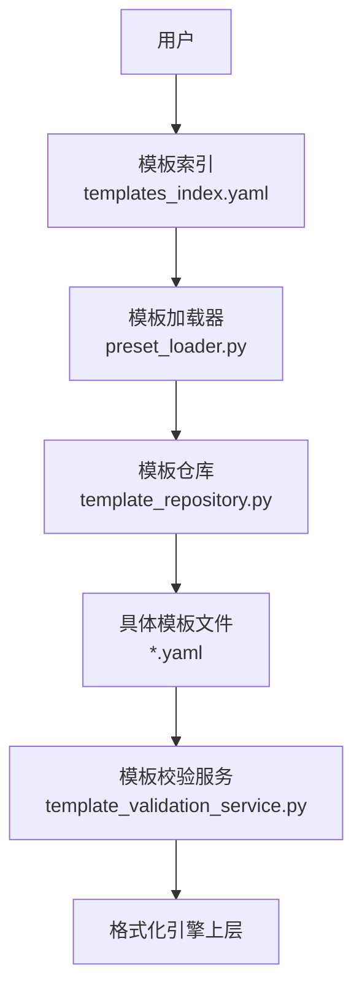
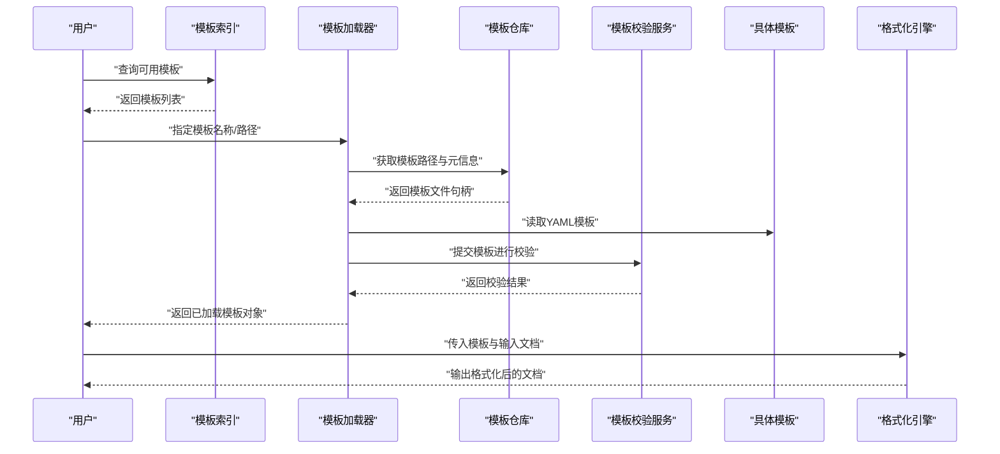
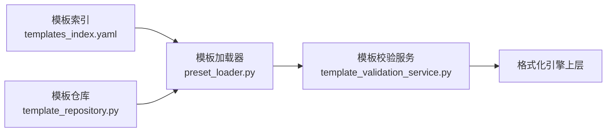

# 预设格式模板

<cite>
**本文引用的文件**   
- [presets/README.md](file://presets/README.md)
- [presets/templates_index.yaml](file://presets/templates_index.yaml)
- [presets/apa.yaml](file://presets/apa.yaml)
- [presets/ieee.yaml](file://presets/ieee.yaml)
- [presets/acm.yaml](file://presets/acm.yaml)
- [presets/nature.yaml](file://presets/nature.yaml)
- [presets/science.yaml](file://presets/science.yaml)
- [presets/chinese_thesis.yaml](file://presets/chinese_thesis.yaml)
- [presets/tsinghua.yaml](file://presets/tsinghua.yaml)
- [presets/peking.yaml](file://presets/peking.yaml)
- [presets/fudan.yaml](file://presets/fudan.yaml)
- [presets/zhejiang.yaml](file://presets/zhejiang.yaml)
- [presets/hit.yaml](file://presets/hit.yaml)
- [presets/shanghaijiaotong.yaml](file://presets/shanghaijiaotong.yaml)
- [presets/wuhan.yaml](file://presets/wuhan.yaml)
- [presets/xjtu.yaml](file://presets/xjtu.yaml)
- [presets/nanjing.yaml](file://presets/nanjing.yaml)
- [presets/gb7714.yaml](file://presets/gb7714.yaml)
- [presets/elsevier.yaml](file://presets/elsevier.yaml)
- [presets/springer.yaml](file://presets/springer.yaml)
- [presets/wiley.yaml](file://presets/wiley.yaml)
- [presets/aaai.yaml](file://presets/aaai.yaml)
- [presets/acl.yaml](file://presets/acl.yaml)
- [presets/emnlp.yaml](file://presets/emnlp.yaml)
- [presets/iclr.yaml](file://presets/iclr.yaml)
- [presets/icml.yaml](file://presets/icml.yaml)
- [presets/neurips.yaml](file://presets/neurips.yaml)
- [presets/cvpr.yaml](file://presets/cvpr.yaml)
- [presets/kdd.yaml](file://presets/kdd.yaml)
- [presets/sigir.yaml](file://presets/sigir.yaml)
- [presets/www.yaml](file://presets/www.yaml)
- [presets/ama.yaml](file://presets/ama.yaml)
- [presets/chicago.yaml](file://presets/chicago.yaml)
- [presets/mla.yaml](file://presets/mla.yaml)
- [presets/harvard.yaml](file://presets/harvard.yaml)
- [presets/japanese.yaml](file://presets/japanese.yaml)
- [presets/korean.yaml](file://presets/korean.yaml)
- [src/paper_format_corrector/infra/preset_loader.py](file://src/paper_format_corrector/infra/preset_loader.py)
- [src/paper_format_corrector/application/services/template_validation_service.py](file://src/paper_format_corrector/application/services/template_validation_service.py)
- [src/paper_format_corrector/infra/template_repository.py](file://src/paper_format_corrector/infra/template_repository.py)
- [examples/sample_template.yaml](file://examples/sample_template.yaml)
- [tests/test_presets.py](file://tests/test_presets.py)
</cite>

## 目录
1. [简介](#简介)
2. [项目结构](#项目结构)
3. [核心组件](#核心组件)
4. [架构总览](#架构总览)
5. [详细组件分析](#详细组件分析)
6. [依赖关系分析](#依赖关系分析)
7. [性能与扩展性](#性能与扩展性)
8. [故障排查指南](#故障排查指南)
9. [结论](#结论)
10. [附录](#附录)

## 简介
本指南面向需要快速、准确完成论文或报告排版的用户，系统介绍预设格式模板的使用方法。内容覆盖：
- 内置的50+种学术格式模板（国际期刊与会议、国内高校学位论文等）
- 模板结构与配置语法（YAML字段、继承机制）
- 模板选择与配置的实用建议
- 自定义模板创建教程（从基础修改到高级规则编写）
- 模板验证工具与调试方法
- 实际使用示例与常见问题解决方案

## 项目结构
预设模板位于 presets 目录，包含大量按领域和机构分类的 YAML 模板文件，以及一个索引文件用于统一管理。应用层通过加载器与仓库模块读取并解析这些模板，供格式化流程使用。

图示来源
- [presets/templates_index.yaml](file://presets/templates_index.yaml)
- [src/paper_format_corrector/infra/preset_loader.py](file://src/paper_format_corrector/infra/preset_loader.py)
- [src/paper_format_corrector/infra/template_repository.py](file://src/paper_format_corrector/infra/template_repository.py)
- [src/paper_format_corrector/application/services/template_validation_service.py](file://src/paper_format_corrector/application/services/template_validation_service.py)

章节来源
- [presets/README.md](file://presets/README.md)
- [presets/templates_index.yaml](file://presets/templates_index.yaml)
- [src/paper_format_corrector/infra/preset_loader.py](file://src/paper_format_corrector/infra/preset_loader.py)
- [src/paper_format_corrector/infra/template_repository.py](file://src/paper_format_corrector/infra/template_repository.py)

## 核心组件
- 模板索引：集中列出所有可用模板及其元数据，便于检索与选择。
- 模板加载器：负责发现、加载与缓存模板文件，提供统一接口给上层调用。
- 模板仓库：维护模板集合、版本与路径映射，支持按需加载与批量操作。
- 模板校验服务：对模板进行语法与语义校验，确保模板可被安全执行。
- 示例模板：提供最小可用的模板样例，帮助快速上手。

章节来源
- [presets/templates_index.yaml](file://presets/templates_index.yaml)
- [src/paper_format_corrector/infra/preset_loader.py](file://src/paper_format_corrector/infra/preset_loader.py)
- [src/paper_format_corrector/infra/template_repository.py](file://src/paper_format_corrector/infra/template_repository.py)
- [src/paper_format_corrector/application/services/template_validation_service.py](file://src/paper_format_corrector/application/services/template_validation_service.py)
- [examples/sample_template.yaml](file://examples/sample_template.yaml)

## 架构总览
下图展示从“选择模板”到“生成文档”的关键交互路径，包括加载、校验与应用的阶段。

图示来源
- [presets/templates_index.yaml](file://presets/templates_index.yaml)
- [src/paper_format_corrector/infra/preset_loader.py](file://src/paper_format_corrector/infra/preset_loader.py)
- [src/paper_format_corrector/infra/template_repository.py](file://src/paper_format_corrector/infra/template_repository.py)
- [src/paper_format_corrector/application/services/template_validation_service.py](file://src/paper_format_corrector/application/services/template_validation_service.py)

## 详细组件分析

### 模板索引与分类
- 模板索引提供统一的入口，可按类别（如 APA、IEEE、Nature、Science、GB/T 7714、清华、北大、复旦、浙大、哈工大、上交、武大、西交、南大等）快速定位。
- 每个模板条目通常包含名称、描述、适用场景、语言、引用风格、页面与字体偏好等元数据。

章节来源
- [presets/templates_index.yaml](file://presets/templates_index.yaml)

### 模板加载器
- 职责：扫描 presets 目录、解析索引、加载单个模板文件、缓存与复用。
- 关键点：
  - 支持相对路径与绝对路径
  - 支持同名模板优先级策略（例如用户目录优先于内置）
  - 提供错误提示（找不到模板、权限不足、编码异常等）

章节来源
- [src/paper_format_corrector/infra/preset_loader.py](file://src/paper_format_corrector/infra/preset_loader.py)

### 模板仓库
- 职责：维护模板集合、版本信息与路径映射；提供按名称或标签查询的能力。
- 关键点：
  - 支持批量加载与增量更新
  - 提供模板差异对比（用于升级与迁移）
  - 与加载器协作，避免重复 IO

章节来源
- [src/paper_format_corrector/infra/template_repository.py](file://src/paper_format_corrector/infra/template_repository.py)

### 模板校验服务
- 职责：在模板使用前进行语法与语义校验，防止非法或不完整模板导致运行时错误。
- 关键点：
  - 检查必填字段、类型约束、值域范围
  - 检测循环继承与冲突覆盖
  - 输出结构化错误信息，便于定位问题

章节来源
- [src/paper_format_corrector/application/services/template_validation_service.py](file://src/paper_format_corrector/application/services/template_validation_service.py)

### 示例模板
- 提供最小可用模板结构，帮助用户理解字段含义与组织方式。
- 建议以此为起点，逐步添加段落样式、页眉页脚、图表编号、参考文献格式等规则。

章节来源
- [examples/sample_template.yaml](file://examples/sample_template.yaml)

### 常用模板概览（部分）
以下为常见模板的分类与用途说明，便于快速选择：
- 国际期刊与出版集团
  - Nature、Science、Elsevier、Springer、Wiley
- 国际会议与学会
  - IEEE、ACM、AAAI、ACL、EMNLP、ICLR、ICML、NeurIPS、CVPR、KDD、SIGIR、WWW
- 引用与写作规范
  - APA、AMA、Chicago、MLA、Harvard、GB/T 7714
- 国内高校学位论文
  - 清华、北大、复旦、浙大、哈工大、上交、武大、西交、南大、中国科学技术大学等
- 其他语言与地区
  - Japanese、Korean

章节来源
- [presets/apa.yaml](file://presets/apa.yaml)
- [presets/ieee.yaml](file://presets/ieee.yaml)
- [presets/acm.yaml](file://presets/acm.yaml)
- [presets/nature.yaml](file://presets/nature.yaml)
- [presets/science.yaml](file://presets/science.yaml)
- [presets/gb7714.yaml](file://presets/gb7714.yaml)
- [presets/chinese_thesis.yaml](file://presets/chinese_thesis.yaml)
- [presets/tsinghua.yaml](file://presets/tsinghua.yaml)
- [presets/peking.yaml](file://presets/peking.yaml)
- [presets/fudan.yaml](file://presets/fudan.yaml)
- [presets/zhejiang.yaml](file://presets/zhejiang.yaml)
- [presets/hit.yaml](file://presets/hit.yaml)
- [presets/shanghaijiaotong.yaml](file://presets/shanghaijiaotong.yaml)
- [presets/wuhan.yaml](file://presets/wuhan.yaml)
- [presets/xjtu.yaml](file://presets/xjtu.yaml)
- [presets/nanjing.yaml](file://presets/nanjing.yaml)
- [presets/elsevier.yaml](file://presets/elsevier.yaml)
- [presets/springer.yaml](file://presets/springer.yaml)
- [presets/wiley.yaml](file://presets/wiley.yaml)
- [presets/aaai.yaml](file://presets/aaai.yaml)
- [presets/acl.yaml](file://presets/acl.yaml)
- [presets/emnlp.yaml](file://presets/emnlp.yaml)
- [presets/iclr.yaml](file://presets/iclr.yaml)
- [presets/icml.yaml](file://presets/icml.yaml)
- [presets/neurips.yaml](file://presets/neurips.yaml)
- [presets/cvpr.yaml](file://presets/cvpr.yaml)
- [presets/kdd.yaml](file://presets/kdd.yaml)
- [presets/sigir.yaml](file://presets/sigir.yaml)
- [presets/www.yaml](file://presets/www.yaml)
- [presets/ama.yaml](file://presets/ama.yaml)
- [presets/chicago.yaml](file://presets/chicago.yaml)
- [presets/mla.yaml](file://presets/mla.yaml)
- [presets/harvard.yaml](file://presets/harvard.yaml)
- [presets/japanese.yaml](file://presets/japanese.yaml)
- [presets/korean.yaml](file://presets/korean.yaml)

## 依赖关系分析
模板系统的依赖关系如下：
- 模板索引为入口，提供模板清单
- 加载器依赖仓库以解析路径与元信息
- 校验服务在加载后、应用前对模板进行安全检查
- 最终由格式化引擎消费模板对象

图示来源
- [presets/templates_index.yaml](file://presets/templates_index.yaml)
- [src/paper_format_corrector/infra/preset_loader.py](file://src/paper_format_corrector/infra/preset_loader.py)
- [src/paper_format_corrector/infra/template_repository.py](file://src/paper_format_corrector/infra/template_repository.py)
- [src/paper_format_corrector/application/services/template_validation_service.py](file://src/paper_format_corrector/application/services/template_validation_service.py)

章节来源
- [src/paper_format_corrector/infra/preset_loader.py](file://src/paper_format_corrector/infra/preset_loader.py)
- [src/paper_format_corrector/infra/template_repository.py](file://src/paper_format_corrector/infra/template_repository.py)
- [src/paper_format_corrector/application/services/template_validation_service.py](file://src/paper_format_corrector/application/services/template_validation_service.py)

## 性能与扩展性
- 缓存策略：加载器与仓库可对已解析模板进行内存缓存，减少重复 IO 与解析开销。
- 增量更新：当新增或修改模板时，仅重新加载受影响条目。
- 并行校验：对多模板批量校验时可并发执行，缩短整体耗时。
- 可扩展点：
  - 新增模板：在 presets 下新增 YAML 文件，并在索引中登记
  - 自定义规则：通过模板中的规则段定义段落、表格、图片、参考文献等处理逻辑
  - 插件机制：结合外部插件扩展特定格式能力（如特殊图表编号）

[本节为通用指导，不直接分析具体文件]

## 故障排查指南
- 模板未找到
  - 确认模板名称或路径正确
  - 检查索引是否包含该模板
  - 查看加载器日志中的路径解析过程
- 模板校验失败
  - 根据校验服务返回的错误信息修正字段类型或必填项
  - 检查是否存在循环继承或冲突覆盖
- 运行时报错
  - 使用示例模板作为基线，逐步比对差异
  - 启用更详细的日志输出，定位具体规则执行位置
- 回归测试
  - 参考现有测试用例，验证模板变更不影响既有行为

章节来源
- [tests/test_presets.py](file://tests/test_presets.py)
- [src/paper_format_corrector/application/services/template_validation_service.py](file://src/paper_format_corrector/application/services/template_validation_service.py)

## 结论
通过统一的模板索引、加载器、仓库与校验服务，本系统提供了稳定、可扩展且易用的预设格式模板体系。用户可基于内置模板快速完成排版，也可按需定制与扩展，满足多样化需求。

[本节为总结性内容，不直接分析具体文件]

## 附录

### 模板选择与配置实用指南
- 选择原则
  - 目标期刊/会议：优先选择对应官方模板（如 IEEE、ACM、Nature、Science）
  - 学位论文：选择所在高校的模板（如清华、北大、复旦、浙大等）
  - 引用规范：若需遵循特定引用风格，选择相应模板（APA、GB/T 7714、Chicago 等）
- 配置要点
  - 页面设置：页边距、纸张大小、行距
  - 字体与字号：正文字体、标题字体、英文字体
  - 段落样式：标题层级、缩进、对齐
  - 图表编号：自动编号与交叉引用
  - 参考文献：引用格式、排序规则、作者名缩写
- 推荐流程
  - 从索引中选择最接近的模板
  - 使用示例模板对照，逐项调整差异
  - 运行校验服务，修复错误后再应用

章节来源
- [presets/templates_index.yaml](file://presets/templates_index.yaml)
- [examples/sample_template.yaml](file://examples/sample_template.yaml)

### 自定义模板创建教程
- 步骤一：复制示例模板
  - 以示例模板为基础，保留必要字段，删除无关规则
- 步骤二：定义基本结构
  - 设置页面、字体、段落、标题层级
- 步骤三：添加业务规则
  - 插入图表编号、表格样式、页眉页脚
  - 配置参考文献格式与排序
- 步骤四：继承与覆盖
  - 通过继承机制复用通用规则，仅在差异处覆盖
- 步骤五：校验与测试
  - 使用校验服务检查语法与语义
  - 用真实文档跑通端到端流程
- 步骤六：发布与维护
  - 将模板加入索引，记录版本与变更说明

章节来源
- [examples/sample_template.yaml](file://examples/sample_template.yaml)
- [src/paper_format_corrector/application/services/template_validation_service.py](file://src/paper_format_corrector/application/services/template_validation_service.py)

### 模板验证与调试方法
- 验证入口
  - 通过校验服务对模板进行语法与语义检查
- 调试技巧
  - 开启详细日志，观察模板解析与规则执行顺序
  - 分块注释规则，定位问题来源
  - 使用最小化文档复现问题，降低干扰因素
- 回归保障
  - 参考现有测试用例，确保变更不会破坏既有功能

章节来源
- [src/paper_format_corrector/application/services/template_validation_service.py](file://src/paper_format_corrector/application/services/template_validation_service.py)
- [tests/test_presets.py](file://tests/test_presets.py)

### 实际使用示例
- 选择模板
  - 在索引中查找目标模板，记录其名称或路径
- 加载模板
  - 使用加载器接口传入模板标识，获取模板对象
- 校验模板
  - 调用校验服务，修复错误直至通过
- 应用模板
  - 将模板对象与输入文档交给格式化引擎，得到输出文档

章节来源
- [presets/templates_index.yaml](file://presets/templates_index.yaml)
- [src/paper_format_corrector/infra/preset_loader.py](file://src/paper_format_corrector/infra/preset_loader.py)
- [src/paper_format_corrector/infra/template_repository.py](file://src/paper_format_corrector/infra/template_repository.py)
- [src/paper_format_corrector/application/services/template_validation_service.py](file://src/paper_format_corrector/application/services/template_validation_service.py)